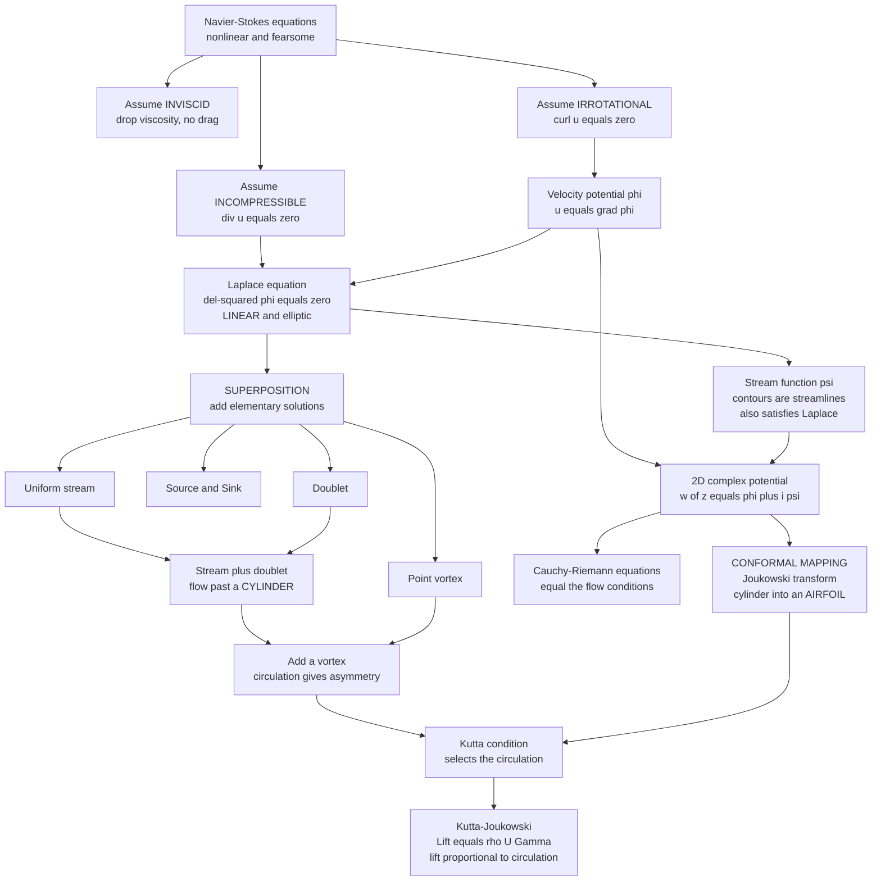

# 🌀 Potential Flow and Complex Analysis

> [!abstract] TL;DR
> **Potential flow** is the classical theory of **inviscid, incompressible, irrotational** flow — a heroic idealization that nonetheless describes the *outer* flow around streamlined bodies at high Reynolds number remarkably well, and is the foundation of classical aerodynamics before CFD. Its magic is a **collapse of complexity**: irrotationality ($\nabla\times\vec u=0$) lets the velocity come from a scalar **velocity potential** ($\vec u=\nabla\phi$), and incompressibility ($\nabla\cdot\vec u=0$) then forces $\phi$ to obey **Laplace's equation** $\nabla^2\phi=0$ — *linear* and elliptic, in place of the fearsome nonlinear Navier-Stokes. Linearity means **superposition**: build any flow by *adding* elementary solutions — a **uniform stream**, a **source/sink**, a **doublet**, and a **point vortex** — like LEGO bricks (stream + doublet = flow past a **cylinder**; add a **vortex** for circulation and lift). In **two dimensions** the potential $\phi$ and the **stream function** $\psi$ fuse into a single analytic **complex potential** $w(z)=\phi+i\psi$, so the entire toolbox of complex analysis — the Cauchy-Riemann equations (which *are* the potential-flow conditions), contour integrals for circulation and force (**Blasius**), and **conformal mapping** (the **Joukowski** transform that turns a cylinder into an **airfoil**) — applies directly. Add one physical input, the **Kutta condition**, and the theory analytically predicts **lift**: the **Kutta-Joukowski** theorem gives lift per span $L' = \rho U \Gamma$. Its blind spots are exactly the missing viscosity — **no drag** (d'Alembert's paradox), no boundary layers, no separation, no wakes, no turbulence — yet it remains a beautiful, useful theory and a striking bridge between fluid dynamics and complex analysis.

---

## Intuition

**Analogy:** Fluid dynamics is usually a nightmare of nonlinear equations, but here is a rare gift. **If** a flow has no viscosity **and** no spin (it is *irrotational*), the fearsome nonlinear governing equations collapse into **one beautiful LINEAR equation** — Laplace's. And "linear" is a magic word: it means you can build complicated flows by simply **ADDING simple ones together**, like snapping LEGO bricks. A uniform breeze, plus a little "source" that puffs fluid outward, plus a swirling "vortex" — snap them together and out pops the flow around a cylinder, or the flow around a wing.

In two dimensions the magic deepens into something almost unreasonable. The whole flow — every streamline, every velocity — becomes a **single complex-analytic function** $w(z)$ of the complex coordinate $z=x+iy$. Differentiate it and you get the velocity; integrate it around a body and you get the force. Best of all, an **angle-preserving map** can bend the simple flow around a cylinder into the flow around an airfoil, letting you literally *conjure lift out of elegant mathematics*. That a wing's lift can be written down with the same tools used to prove theorems about analytic functions is one of the most surprising bridges in all of physics.

---

## How It Works

### Core Mechanics

**1. Three idealizations, one payoff.** Potential flow makes three assumptions and is rewarded with a linear problem:

- **Inviscid** — viscosity $\mu\to 0$, so the flow obeys the **Euler equations** rather than Navier-Stokes (developed in the sibling note [[Euler_Equations_and_Inviscid_Flow]]). This is a good model for the *outer* flow at high Reynolds number, where viscous effects are confined to a thin layer near the surface (the sibling *The_Boundary_Layer*).
- **Incompressible** — $\nabla\cdot\vec u = 0$ (valid for liquids and for gas at Mach $< 0.3$).
- **Irrotational** — $\vec\omega=\nabla\times\vec u = 0$ everywhere. Kelvin's circulation theorem guarantees that a flow starting from rest in an inviscid fluid *stays* irrotational, so this is self-consistent for the outer flow ([[Vorticity_and_Circulation]] develops the spin content of flows).

**2. Irrotational + incompressible $\Rightarrow$ Laplace's equation.** Irrotationality is precisely the condition for the velocity to be the gradient of a scalar — the **velocity potential** $\phi$:

$$\vec u = \nabla\phi \qquad\text{(guarantees }\nabla\times\vec u = \nabla\times\nabla\phi = 0\text{)}.$$

Substitute into incompressibility $\nabla\cdot\vec u=0$ and the nonlinear Navier-Stokes problem evaporates into the friendly, thoroughly-understood **Laplace equation**:

$$\nabla\cdot(\nabla\phi) = \nabla^2\phi = 0.$$

It is **linear**, **elliptic**, and has no time in it — the pressure comes afterward from the unsteady **Bernoulli** equation ([[Bernoulli_and_Energy_in_Flows]]), which is where all the nonlinearity was quietly banished. Solving a flow is now solving a boundary-value problem for a harmonic function, identical in form to electrostatics, steady heat conduction, and groundwater seepage.

**3. The stream function and the flow net.** In 2D there is a complementary potential, the **stream function** $\psi$, defined by

$$u = \frac{\partial\psi}{\partial y}, \qquad v = -\frac{\partial\psi}{\partial x},$$

which automatically satisfies incompressibility. Its two defining properties are the workhorses of the whole subject:

- **Contours of $\psi$ are streamlines** (lines the flow follows), so any $\psi=\text{const}$ curve can be treated as a solid wall — this is how bodies are constructed.
- The **volume flow rate between two streamlines equals the difference in $\psi$**: $Q = \psi_2 - \psi_1$. Streamlines that crowd together mean fast flow.

Because the flow is also irrotational, $\psi$ *also* satisfies Laplace's equation, $\nabla^2\psi=0$. The curves $\phi=\text{const}$ (equipotentials) and $\psi=\text{const}$ (streamlines) are everywhere **orthogonal**, forming the **flow net** — $\phi$ and $\psi$ are *harmonic conjugates*.

**4. Superposition — the payoff of linearity.** Because Laplace's equation is linear, the sum of any two solutions is a solution. So complex flows are assembled by **adding elementary building blocks**. The four canonical bricks (all singular solutions of Laplace's equation, or exact ones):

| Elementary flow | Velocity potential $\phi$ | Stream function $\psi$ | Physical picture |
|---|---|---|---|
| Uniform stream ($U$ along $x$) | $U x$ | $U y$ | parallel flow |
| Source/sink (strength $m$) | $\dfrac{m}{2\pi}\ln r$ | $\dfrac{m}{2\pi}\theta$ | radial out ($m>0$) / in ($m<0$) |
| Doublet (strength $\kappa$, along $x$) | $\dfrac{\kappa}{2\pi}\dfrac{\cos\theta}{r}$ | $-\dfrac{\kappa}{2\pi}\dfrac{\sin\theta}{r}$ | source + sink in the limit |
| Point vortex (circulation $\Gamma$) | $\dfrac{\Gamma}{2\pi}\theta$ | $-\dfrac{\Gamma}{2\pi}\ln r$ | pure swirl, no radial flow |

The famous constructions:

- **Uniform stream + doublet = flow past a cylinder.** With $\kappa = 2\pi U a^2$, $\psi = U y\big(1 - a^2/r^2\big)$, and the streamline $\psi=0$ is exactly the circle $r=a$ — a solid cylinder appears out of two building blocks.
- **Cylinder + point vortex = cylinder with circulation.** Adding a vortex makes the flow **asymmetric** (faster over the top, slower underneath); the pressure imbalance is **lift**. This is the seed of the whole theory of the lifting wing.

Representing a body by a cleverly placed set of sources, sinks, and vortices is the **method of singularities**, whose numerical descendant is the **panel method**.

**5. Two dimensions and the complex potential.** Here the theory becomes stunningly elegant. Because $\phi$ and $\psi$ are harmonic conjugates, they combine into a single **analytic (holomorphic) function** of $z = x+iy$, the **complex potential**:

$$w(z) = \phi(x,y) + i\,\psi(x,y).$$

The **Cauchy-Riemann equations** for $w$ ($\partial_x\phi=\partial_y\psi$, $\partial_y\phi=-\partial_x\psi$) are *identically* the definitions of $\phi$ and $\psi$ above — **analyticity is the potential-flow condition**. Differentiating gives the **complex velocity**:

$$\frac{dw}{dz} = u - i\,v,$$

so the velocity field is read straight off a derivative. **Contour integrals** then deliver global quantities: $\oint \frac{dw}{dz}\,dz$ around a body gives the **circulation** $\Gamma$ (real part) and the volume source (imaginary part), and the **Blasius theorem** computes the force on a body from a contour integral of $(dw/dz)^2$ — the residue at the enclosed singularities *is* the lift. The full machinery of contour integration and residues (see [[Residue_Theorem_and_Applications]]) transfers wholesale into aerodynamics.

**6. Conformal mapping — the crown jewel.** A **conformal map** is an analytic function $\zeta = f(z)$ that preserves angles locally. Its miracle: **if $w(z)$ solves a flow in the $z$-plane, then the *same* $w$ expressed via the inverse map solves the flow in the $\zeta$-plane**. So you solve the *easy* problem (flow around a circle) once, then *map the circle into a wing*. The **Joukowski transformation**

$$\zeta = z + \frac{c^2}{z}$$

turns a circle (offset slightly from the origin) into a smooth airfoil shape with a rounded leading edge and a **sharp trailing edge** — and carries the cylinder's flow, circulation, and lift with it. Classical **thin-aerofoil theory** and the analytic lift of a wing fall straight out of this map.

**7. The Kutta condition selects the lift.** Pure potential flow around an airfoil is **non-unique**: *any* value of circulation $\Gamma$ gives a valid solution, most of which have the flow whipping impossibly around the sharp trailing edge at infinite speed. The **Kutta condition** — the one piece of real physics injected — states that a real viscous fluid cannot do that: **the flow must leave the sharp trailing edge smoothly**. This single requirement pins down *the* circulation $\Gamma$, and the **Kutta-Joukowski theorem** converts it to force:

$$\boxed{\,L' = \rho\,U\,\Gamma\,}\qquad\text{(lift per unit span)}.$$

Lift is *proportional to circulation*. Potential flow plus one physical condition thus **predicts lift** analytically — foreshadowing the full aerodynamics of [[Lift_Drag_and_Aerodynamics]].

**8. What it misses.** With no viscosity there is **no drag at all** on a closed body — the notorious **d'Alembert's paradox** (the pressure distribution is fore-aft symmetric, so it integrates to zero net force in the flow direction). Potential flow also has **no boundary layers, no separation, no wakes, and no turbulence**. It predicts the pressure and lift on *streamlined* bodies well, but fails utterly for **bluff bodies** and for **drag**. The resolution — that viscosity, however small, matters decisively in a thin surface layer — is Prandtl's boundary layer (*The_Boundary_Layer*). Modern **panel methods** (numerical potential flow, e.g. in XFOIL and early aircraft design codes) remain in daily use, coupled to a boundary-layer model to supply the missing drag.

### Flow / Architecture



---

## Key Concepts

### Secondary Level

- **A rare easy case.** Most flow is impossibly complicated, but *smooth, spin-free, thin-liquid-like* flow is special: it follows one simple rule, and simple rules can be added together.
- **Streamlines are the paths.** Draw the lines the fluid follows; where they bunch up, the flow is fast; where they spread out, it is slow. A wing works because the lines crowd over the top and spread underneath.
- **Building flows from pieces.** A steady breeze, a "puff" that pushes fluid outward, and a "swirl" are the basic pieces. Combine a breeze with the right pieces and you get the flow around a ball, a pipe, or a wing.
- **Lift is a swirl.** A lifting wing has a hidden circulation of air bound to it — more speed over the top, less below — and that speed difference is the lift.

### Undergraduate Level

- **Velocity potential.** $\vec u = \nabla\phi$; exists because the flow is irrotational. Combined with $\nabla\cdot\vec u = 0$ gives $\nabla^2\phi = 0$ (Laplace).
- **Stream function.** $u=\partial_y\psi,\ v=-\partial_x\psi$; contours are streamlines; $\Delta\psi$ = volume flux between them; also harmonic. $\phi$ and $\psi$ form an orthogonal **flow net**.
- **Elementary flows and superposition.** Memorize the four bricks (uniform stream, source/sink, doublet, vortex) and the rule that stream + doublet = cylinder, cylinder + vortex = lift. Non-lifting cylinder surface speed is $2U\sin\theta$; the pressure follows from Bernoulli.
- **Complex potential.** $w(z)=\phi+i\psi$ is analytic; $dw/dz = u - iv$. Uniform stream $w=Uz$; source $w=\tfrac{m}{2\pi}\ln z$; vortex $w=-\tfrac{i\Gamma}{2\pi}\ln z$; doublet $w=\tfrac{\mu}{2\pi z}$; cylinder $w=U(z+a^2/z)$.
- **Kutta-Joukowski.** Lift per span $L'=\rho U\Gamma$; the **Kutta condition** fixes $\Gamma$ so flow leaves the sharp trailing edge smoothly.
- **d'Alembert's paradox.** A closed body in steady potential flow feels **zero drag** — the signal that viscosity has been thrown away.

### Graduate Level

- **Harmonic-function theory.** Potential flow is potential theory: uniqueness and existence for the Dirichlet/Neumann problem, the maximum principle (no interior velocity-potential extrema), and Green's functions (a source is the free-space Green's function of the Laplacian, tying directly to [[The_Poisson_and_Laplace_Equation]]).
- **Blasius theorems.** Force and moment on a body from contour integrals: $F_x - iF_y = \tfrac{i\rho}{2}\oint\left(\tfrac{dw}{dz}\right)^2 dz$. Evaluated by residues, the pole from the bound vortex yields exactly $L'=\rho U\Gamma$ — Kutta-Joukowski falls out of the residue theorem.
- **Conformal mapping and the Joukowski aerofoil.** $\zeta=z+c^2/z$; a circle of radius $a$ centred at $-\varepsilon+i\delta$ maps to a cambered airfoil of chord $\approx 4c$; the Kutta condition applied at the mapped trailing edge gives $\Gamma=4\pi U a\sin(\alpha+\beta)$ and hence $C_L \approx 2\pi(\alpha+\beta)$ — the thin-aerofoil lift-slope of $2\pi$ per radian.
- **The circulation-lift connection.** Circulation is generated physically by the **starting vortex** shed at the trailing edge when a wing begins to move (Kelvin's theorem keeps total circulation zero); the bound vortex is its equal-and-opposite partner. This links potential flow to [[Vorticity_and_Circulation]] and to real, viscous startup.
- **3D and the failure of the vortex sheet.** In 3D a wing sheds a **trailing vortex sheet** (lifting-line theory, Prandtl), which introduces **induced drag** $\propto C_L^2$ — the one drag potential-flow *can* capture, because it is a pressure/inviscid effect, unlike friction drag.
- **Numerical potential flow.** Panel methods discretize the body surface into source/doublet panels solving an integral equation for the boundary condition; coupled with an integral boundary-layer solver (XFOIL, VSAERO) they remain fast, accurate design tools for attached flow.

---

## Python Demo

```python
# Potential flow by SUPERPOSITION: snap elementary 2D flows together to build
# the flow past a CYLINDER, then add CIRCULATION to make it asymmetric and LIFT.
#   (a) elementary flows: uniform stream, SOURCE, SINK, DOUBLET, point VORTEX
#   (b) superpose: uniform stream + doublet = CYLINDER; + vortex = LIFT
#   (c) use the COMPLEX POTENTIAL w(z)=phi+i*psi to get the velocity field and
#       the Kutta-Joukowski lift  L' = rho * U * Gamma.
# Streamlines are contours of the stream function psi (for the radial source/sink
# we streamplot the analytic velocity, which is cleaner than the branch-cut psi).
# Requires: numpy, matplotlib
import numpy as np
import matplotlib.pyplot as plt

# ---- grid (avoid the exact singular point at the origin) --------------------
n = 400
xs = np.linspace(-2.5, 2.5, n)
ys = np.linspace(-2.5, 2.5, n)
X, Y = np.meshgrid(xs, ys)
R2 = X**2 + Y**2
R2safe = np.where(R2 < 1e-6, 1e-6, R2)      # guard the origin

U = 1.0                                       # free-stream speed
a = 1.0                                       # cylinder radius
rho = 1.225                                   # air density [kg/m^3]

# ---- (a) ELEMENTARY stream functions psi ----------------------------------
psi_uniform = U * Y                                   # uniform stream
m = 2.0
psi_doublet = -(U * a**2) * Y / R2safe               # doublet (kappa = 2*pi*U*a^2)
Gamma_unit = 2 * np.pi                                # a reference vortex strength
psi_vortex  = -(Gamma_unit / (2*np.pi)) * 0.5 * np.log(R2safe)  # point vortex

# analytic radial velocity for source/sink (strength m): u = m/(2pi) * r_hat / r
def radial_vel(strength):
    u = strength/(2*np.pi) * X / R2safe
    v = strength/(2*np.pi) * Y / R2safe
    return u, v
us_src, vs_src = radial_vel(+m)                       # SOURCE  (outflow)
us_snk, vs_snk = radial_vel(-m)                       # SINK    (inflow)

# ---- (b) SUPERPOSITION: cylinder = uniform stream + doublet ----------------
psi_cyl = psi_uniform + psi_doublet                  # = U*Y*(1 - a^2/r^2)
psi_cyl_masked = np.where(R2 < a**2, np.nan, psi_cyl)  # flow only OUTSIDE body

# cylinder WITH circulation (add a bound vortex); surface stays a streamline
def cylinder_circulation(Gamma):
    psi = U * Y * (1 - a**2 / R2safe) - (Gamma/(2*np.pi)) * 0.5 * np.log(R2safe / a**2)
    return np.where(R2 < a**2, np.nan, psi)

Gamma_mod = 4*np.pi*U*a * 0.5      # moderate: sin(theta_s) = -0.5 -> stag at -30, -150 deg
Gamma_str = 4*np.pi*U*a * 1.0      # critical: single stagnation point at the bottom
psi_mod = cylinder_circulation(Gamma_mod)
psi_str = cylinder_circulation(Gamma_str)

# stagnation angles on the cylinder:  sin(theta_s) = -Gamma / (4*pi*U*a)
def stag_points(Gamma):
    s = -Gamma / (4*np.pi*U*a)
    s = np.clip(s, -1, 1)
    th = np.array([np.arcsin(s), np.pi - np.arcsin(s)])   # two roots on |z|=a
    return a*np.cos(th), a*np.sin(th)

# ---- (c) COMPLEX POTENTIAL -> velocity field and Kutta-Joukowski lift -------
# w(z) = U*(z + a^2/z) - i*Gamma/(2pi)*ln(z);   dw/dz = u - i*v
def complex_velocity(Gamma):
    Z = X + 1j*Y
    Zs = np.where(np.abs(Z) < 1e-6, 1e-6, Z)
    dwdz = U*(1 - a**2/Zs**2) - 1j*Gamma/(2*np.pi*Zs)
    u, v = np.real(dwdz), -np.imag(dwdz)
    return u, v

L_mod = rho * U * Gamma_mod        # Kutta-Joukowski lift per span [N/m]
L_str = rho * U * Gamma_str
print("=== Potential flow by superposition ===")
print(f"Cylinder radius a = {a} m, free-stream U = {U} m/s, rho = {rho} kg/m^3")
print(f"Moderate circulation Gamma = {Gamma_mod:6.3f} m^2/s  ->  L' = rho*U*Gamma = {L_mod:6.2f} N/m")
print(f"Critical circulation Gamma = {Gamma_str:6.3f} m^2/s  ->  L' = rho*U*Gamma = {L_str:6.2f} N/m")
xs_m, ys_m = stag_points(Gamma_mod)
print(f"Moderate stagnation points on cylinder: "
      f"({xs_m[0]:+.2f},{ys_m[0]:+.2f}) and ({xs_m[1]:+.2f},{ys_m[1]:+.2f})")
# sanity-check the complex-potential velocity away from the body
uc, vc = complex_velocity(Gamma_mod)
print(f"Complex-velocity speed at (0, 2): {np.hypot(uc[-1, n//2], vc[-1, n//2]):.3f} m/s")

# ---- plotting: a 3x3 gallery ----------------------------------------------
fig, ax = plt.subplots(3, 3, figsize=(14, 13))
fig.suptitle("Potential Flow: elementary bricks -> cylinder -> circulation -> LIFT",
             fontsize=15, fontweight="bold")
lv = np.linspace(-3, 3, 41)

def draw_cyl(a_ax):
    a_ax.add_patch(plt.Circle((0, 0), a, color="0.3", zorder=5))

# row 1: elementary flows
ax[0,0].contour(X, Y, psi_uniform, levels=lv, colors="#1f77b4", linewidths=0.8)
ax[0,0].set_title("Uniform stream")
ax[0,1].streamplot(xs, ys, us_src, vs_src, color="#2ca02c", density=1.1, linewidth=0.7)
ax[0,1].set_title("SOURCE (radial outflow)")
ax[0,2].streamplot(xs, ys, us_snk, vs_snk, color="#9467bd", density=1.1, linewidth=0.7)
ax[0,2].set_title("SINK (radial inflow)")

# row 2: doublet, vortex, cylinder
ax[1,0].contour(X, Y, np.where(R2 < 0.04, np.nan, psi_doublet),
                levels=np.linspace(-2, 2, 41), colors="#ff7f0e", linewidths=0.8)
ax[1,0].set_title("DOUBLET (source+sink limit)")
ax[1,1].contour(X, Y, np.where(R2 < 0.04, np.nan, psi_vortex),
                levels=25, colors="#d62728", linewidths=0.8)
ax[1,1].set_title("Point VORTEX (pure swirl)")
ax[1,2].contour(X, Y, psi_cyl_masked, levels=lv, colors="#1f77b4", linewidths=0.8)
ax[1,2].contour(X, Y, psi_cyl_masked, levels=[0.0], colors="k", linewidths=1.6)
draw_cyl(ax[1,2])
xs0, ys0 = stag_points(0.0)
ax[1,2].plot(xs0, ys0, "k*", ms=13, zorder=6)
ax[1,2].set_title("stream + doublet = CYLINDER\n(symmetric, no lift)")

# row 3: cylinder + circulation (two strengths), and the lift line
ax[2,0].contour(X, Y, psi_mod, levels=lv, colors="#1f77b4", linewidths=0.8)
draw_cyl(ax[2,0]); ax[2,0].plot(xs_m, ys_m, "r*", ms=13, zorder=6)
ax[2,0].set_title(f"+ VORTEX (moderate)\nasymmetric -> LIFT = {L_mod:.1f} N/m")

xs_s, ys_s = stag_points(Gamma_str)
ax[2,1].contour(X, Y, psi_str, levels=lv, colors="#1f77b4", linewidths=0.8)
draw_cyl(ax[2,1]); ax[2,1].plot(xs_s, ys_s, "r*", ms=13, zorder=6)
ax[2,1].set_title(f"+ VORTEX (critical)\nstagnation merges at bottom, L = {L_str:.1f} N/m")

G = np.linspace(0, 4*np.pi*U*a, 100)
ax[2,2].plot(G, rho*U*G, color="#111111", lw=2)
ax[2,2].plot([Gamma_mod, Gamma_str], [L_mod, L_str], "r*", ms=13)
ax[2,2].set_title("Kutta-Joukowski:  L' = rho * U * Gamma")
ax[2,2].set_xlabel("circulation Gamma  [m^2/s]")
ax[2,2].set_ylabel("lift per span L'  [N/m]")
ax[2,2].grid(alpha=0.3)

for a_ax in ax[:2, :].ravel().tolist() + [ax[2,0], ax[2,1]]:
    a_ax.set_xlim(-2.5, 2.5); a_ax.set_ylim(-2.5, 2.5); a_ax.set_aspect("equal")
    a_ax.set_xlabel("x"); a_ax.set_ylabel("y")

plt.tight_layout(rect=[0, 0, 1, 0.96])
plt.savefig("potential_flow_superposition.png", dpi=110)
print("Saved potential_flow_superposition.png")
```

**What it shows.** Row 1 is the LEGO kit: a uniform stream (parallel streamlines), a **source** (radial outflow), and a **sink** (radial inflow). Row 2 adds the **doublet** (its tangent-circle loops) and the **point vortex** (concentric circular streamlines, pure swirl), then snaps *uniform stream + doublet* together — and a **cylinder** materializes as the black $\psi=0$ streamline, perfectly fore-aft symmetric with two stagnation points on its sides (hence zero lift, d'Alembert). Row 3 adds a bound **vortex**: the streamlines crowd over the top and thin out below, the stagnation points slide down and finally merge at the bottom at the critical circulation, and the flow is now **asymmetric — this asymmetry is lift**. The last panel plots the **Kutta-Joukowski** law $L'=\rho U\Gamma$, a straight line, with the two computed cases marked: lift is exactly proportional to the circulation you snapped in.

---

## Real-World Applications

> **Example: airfoil and wing design, from Joukowski to the panel method.** Before CFD, entire families of practical airfoils (the **Joukowski** and **Kármán-Trefftz** aerofoils) were derived by *conformal mapping a cylinder*, and their lift computed analytically via Kutta-Joukowski. That lineage is not a museum piece: **panel methods** — numerical potential flow that tiles a body surface with source and doublet panels — power tools like **XFOIL**, **VSAERO**, and **PMARC** that are still used daily for rapid aircraft, wind-turbine, and propeller design. Coupled to an integral boundary-layer model (which supplies the drag potential flow cannot), they give accurate lift and pressure distributions in milliseconds, orders of magnitude faster than a Navier-Stokes solve.

- **Understanding lift itself.** The circulation picture and $L'=\rho U\Gamma$ remain the *conceptual* foundation for how wings, sails, turbine blades, and spinning balls (the Magnus effect is literally cylinder-plus-circulation) generate force.
- **Groundwater and reservoir flow.** Darcy flow in a porous medium obeys Laplace's equation for the hydraulic head; well fields are modelled as superpositions of sources and sinks — the exact same math, borrowed by hydrogeologists.
- **Electrostatics and heat conduction by analogy.** Any Laplace problem shares potential-flow solutions: the flow net around a cylinder is identical to the field around a conducting cylinder and to steady heat conduction — one solved problem, three disciplines.
- **Marine and wind engineering.** Wave-body interaction, ship hull streamlining, and the outer flow over sails and turbine blades all start from potential-flow / panel-method models before viscous corrections.
- **Aeroacoustics and initial design loops.** Fast potential-flow estimates seed the geometry that expensive high-fidelity CFD and wind-tunnel tests later refine.

---

## Common Pitfalls

- **Expecting drag.** Potential flow gives **zero drag** on a closed body (d'Alembert's paradox). This is not a bug to be patched inside the theory — it is the theory honestly reporting that it threw away viscosity. Drag needs the boundary layer (*The_Boundary_Layer*).
- **Applying it to bluff bodies or separated flow.** The theory is excellent for *streamlined* shapes at small angle of attack where the flow stays attached. For a flat plate broadside, a stalled wing, or a sphere's wake, the real flow **separates** and potential flow is qualitatively wrong.
- **Forgetting the Kutta condition.** Potential flow around a lifting airfoil is non-unique — *any* circulation "works" mathematically. Without imposing the Kutta condition you get physically absurd flow around the trailing edge and *no way to predict lift*. The lift is not in Laplace's equation; it is in that one extra physical rule.
- **Mis-signing or mislabelling the complex velocity.** Remember $dw/dz = u - i v$ (note the **minus** on $v$), and that a vortex uses $w=-\tfrac{i\Gamma}{2\pi}\ln z$ (the $i$ swaps its roles versus a source). Sign slips flip lift up into down.
- **Treating $\phi$ and $\psi$ as interchangeable.** $\phi$ constant = equipotential (perpendicular to the flow); $\psi$ constant = streamline (along the flow). They are conjugate but orthogonal; swapping them rotates the whole flow by ninety degrees.
- **Assuming irrotationality survives everywhere.** It holds only where the fluid started irrotational and viscosity has not acted. Inside boundary layers and wakes, vorticity is generated and potential flow is invalid — which is exactly *why* the outer/inner (boundary-layer) split is needed.

---

## Related Concepts

**Fluid Dynamics — this vault's siblings**
- [[Euler_Equations_and_Inviscid_Flow]] — the inviscid momentum equations potential flow specializes; irrotational + incompressible turns them into Laplace's equation.
- [[Bernoulli_and_Energy_in_Flows]] — supplies the pressure field once $\phi$ is known; the destination of all the banished nonlinearity.
- [[Vorticity_and_Circulation]] — irrotationality is the enabling assumption, and the circulation $\Gamma$ is exactly what sets the lift.
- [[Lift_Drag_and_Aerodynamics]] — the payoff: the Kutta condition and $L'=\rho U\Gamma$ grow into the full theory of wings.
- [[The_Navier_Stokes_Equations]] — the full nonlinear system whose triple idealization yields potential flow.
- [[Fluid_Dynamics_Overview]] — the vault map, where potential flow is the high-Reynolds outer-flow idealization that founded classical aerodynamics.
- [[Conservation_Laws_and_Control_Volumes]] — incompressibility $\nabla\cdot\vec u=0$, one of the two pillars of the Laplace reduction, comes from mass conservation.

**Mathematics of the complex-analysis bridge**
- [[Holomorphic_Functions]] — analytic functions and the Cauchy-Riemann equations, which are *identically* the potential-flow conditions on $w(z)=\phi+i\psi$.
- [[Complex_Numbers_and_Functions]] — the complex plane $z=x+iy$ in which the entire 2D flow becomes a single function.
- [[Cauchy_Theorem_and_Integral_Formula]] — the contour-integral machinery behind computing circulation and the Blasius force integrals.
- [[Residue_Theorem_and_Applications]] — evaluates the Blasius integral; the residue at the bound vortex yields $L'=\rho U\Gamma$.
- [[Complex_Analysis_for_Physics]] — the physicist's complex-analysis toolkit, with 2D potential flow as a headline application.
- [[The_Poisson_and_Laplace_Equation]] — the elliptic PDE $\nabla^2\phi=0$ that potential flow *is*; numerical relaxation solvers apply directly to flow potentials.
- [[Introduction_to_PDEs]] — the elliptic boundary-value-problem framework Laplace's equation belongs to.
- [[Vector_Fields_and_Line_Integrals]] — circulation $\Gamma=\oint\vec u\cdot d\vec\ell$ and the field-theoretic view of $\vec u=\nabla\phi$.
- [[Vector_Calculus_and_Differential_Operators]] — gradient, divergence, and curl, the operators defining $\phi$, incompressibility, and irrotationality.

**Physics fluid mechanics (survey level)**
- [[Euler_Equations_and_Ideal_Fluids]] — the physics-vault treatment of inviscid flow, Bernoulli, and potential flow at survey depth.
- [[Viscous_Fluids_and_Navier_Stokes]] — the full equations whose viscosity supplies the drag and boundary layers potential flow lacks.

---

## Review Questions

**Undergraduate**
1. Starting from the two assumptions *irrotational* and *incompressible*, derive that the velocity potential $\phi$ satisfies Laplace's equation. Explain in one or two sentences *why* linearity is the property that makes superposition of elementary flows legitimate — and why the full Navier-Stokes equations do **not** permit it.

**Undergraduate**
2. Superpose a uniform stream of speed $U$ with a doublet of strength $\kappa=2\pi U a^2$. Show that the streamline $\psi=0$ is the circle $r=a$, so the combination represents flow past a cylinder. Where are the stagnation points, and why does this flow predict **zero drag** (name the paradox)?

**Graduate**
3. A lifting airfoil admits infinitely many potential-flow solutions, one per value of the circulation $\Gamma$. (i) State the Kutta condition and explain physically why a real (slightly viscous) fluid enforces it. (ii) Using the Joukowski map $\zeta=z+c^2/z$ from a circle, sketch how the Kutta condition selects a unique $\Gamma$ and leads to $C_L\approx 2\pi(\alpha+\beta)$. (iii) Explain how the Blasius theorem and the residue theorem turn that bound circulation into the lift $L'=\rho U\Gamma$, and what physical event (Kelvin's theorem) actually *creates* the circulation when the wing starts moving.

---

## Sources

- L. M. Milne-Thomson — *Theoretical Hydrodynamics*, 5th ed. (Macmillan, 1968) — the classic treatment of complex potentials, conformal mapping, and the Blasius theorems.
- G. K. Batchelor — *An Introduction to Fluid Dynamics*, Ch. 2 & 6 (Cambridge University Press, 1967) — irrotational flow, singularities, and the potential-theory foundations.
- P. K. Kundu, I. M. Cohen & D. R. Dowling — *Fluid Mechanics*, 6th ed., Ch. 6 (Irrotational Flow) (Academic Press, 2015).
- J. D. Anderson — *Fundamentals of Aerodynamics*, 6th ed., Chs. 3–4 (McGraw-Hill, 2016) — elementary flows, the cylinder, Kutta-Joukowski, and the Kutta condition.
- H. Lamb — *Hydrodynamics*, 6th ed. (Cambridge University Press, 1932) — the definitive historical reference for potential flow and conformal-mapping aerofoil theory.

---

#fluid-dynamics #potential-flow #complex-analysis #superposition #conformal-mapping
