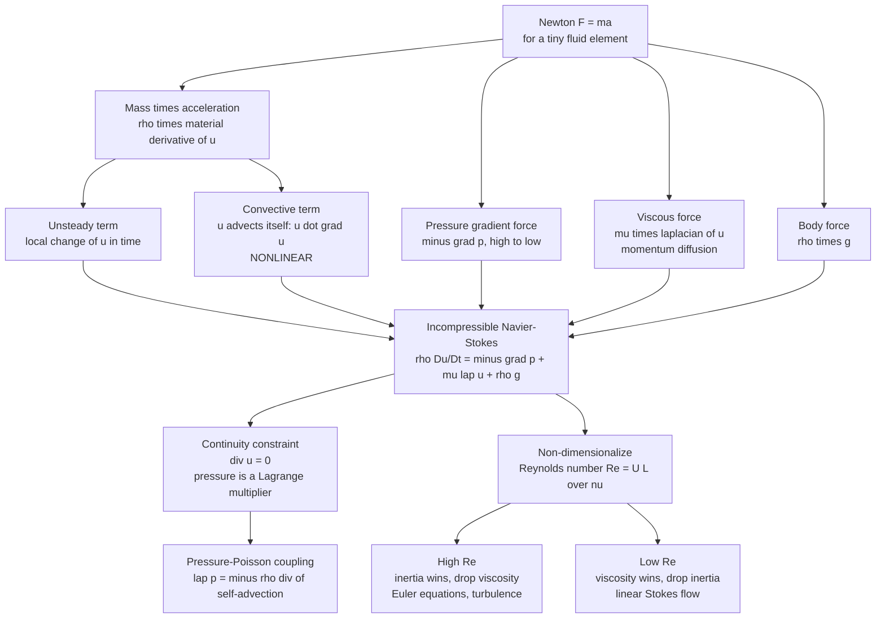

# 🌊 The Navier-Stokes Equations

> [!abstract] TL;DR
> The Navier-Stokes equations are Newton's $\vec{F}=m\vec{a}$ written for an infinitesimal blob of fluid: $\rho\left(\partial_t\vec{u} + (\vec{u}\cdot\nabla)\vec{u}\right) = -\nabla p + \mu\nabla^2\vec{u} + \rho\vec{g}$, closed by mass conservation $\nabla\cdot\vec{u}=0$. The left side is the blob's acceleration; the right side is pressure pushing, viscosity dragging, and gravity pulling. The convective term $(\vec{u}\cdot\nabla)\vec{u}$ makes the equations **nonlinear** — the source of turbulence, chaos, and the lack of general solutions. They govern nearly every flow in nature, are the workhorse of engineering CFD, and are the subject of an unsolved **\$1-million Millennium Prize** problem: do smooth 3D solutions always exist, or can they blow up?

---

## Intuition

**Analogy:** The Navier-Stokes equations are just Newton's $\vec{F}=m\vec{a}$ written for a tiny blob of fluid — but that "just" hides a monster. The forces are **pressure** pushing the blob from high toward low, **viscosity** dragging it like internal friction, and **gravity** pulling it down. The "$m\vec{a}$" is the blob's mass times its acceleration.

The trouble is one term. The blob's acceleration depends on **its own velocity times its own velocity gradient** — a self-referential nonlinearity that lets flows fold back on themselves, spawn eddies within eddies, and erupt into turbulence. These equations describe air, water, blood, weather, oceans, and the interiors of stars, yet whether their solutions always stay smooth is an unsolved million-dollar problem. Fluid dynamics is what happens when $\vec{F}=m\vec{a}$ is allowed to talk to itself.

---

## How It Works

### Building the equation as F = ma for a fluid element

Take a small parcel of fluid of density $\rho$ and follow it as it moves. Newton's second law says its mass times acceleration equals the net force on it. Written per unit volume:

**Left side — mass times acceleration.** The acceleration of a *moving* parcel is not just $\partial\vec{u}/\partial t$ at a fixed point. As the parcel drifts, it also samples a changing velocity field. The correct "acceleration following the fluid" is the **material derivative**:

$$\frac{D\vec{u}}{Dt} = \underbrace{\frac{\partial\vec{u}}{\partial t}}_{\text{unsteady / local}} + \underbrace{(\vec{u}\cdot\nabla)\vec{u}}_{\text{convective / self-advection}}$$

The unsteady term is how the velocity at a point changes in time. The convective term is the parcel accelerating because it moves into a region of different velocity — and it is **quadratic in $\vec{u}$**, hence nonlinear.

**Right side — the sum of forces per unit volume:**

1. **Pressure gradient**, $-\nabla p$: fluid is pushed from high pressure toward low pressure. Only the *gradient* matters, not the absolute pressure.
2. **Viscous force**, $\mu\nabla^2\vec{u}$: internal friction. For a Newtonian fluid this is the divergence of the viscous stress tensor, and it acts as a **diffusion of momentum** — it smooths velocity differences, spreading momentum from fast layers into slow ones.
3. **Body force**, $\rho\vec{g}$: gravity (or any external field) acting on the whole parcel.

Assembling both sides gives the **incompressible Navier-Stokes momentum equation**:

$$\boxed{\;\rho\left(\frac{\partial\vec{u}}{\partial t} + (\vec{u}\cdot\nabla)\vec{u}\right) = -\nabla p + \mu\nabla^2\vec{u} + \rho\vec{g}\;}$$

**Closure — mass conservation.** The momentum equation alone has too many unknowns (three velocity components plus pressure). It is closed by the **continuity equation**. For an incompressible fluid this is the constraint

$$\nabla\cdot\vec{u} = 0.$$

Here pressure plays a subtle role: it is not an independent thermodynamic variable but a **Lagrange multiplier** that instantaneously enforces $\nabla\cdot\vec{u}=0$. Taking the divergence of the momentum equation yields a **pressure-Poisson equation** $\nabla^2 p = -\rho\,\nabla\cdot[(\vec{u}\cdot\nabla)\vec{u}]$, linking Navier-Stokes to the elliptic solvers of [[The_Poisson_and_Laplace_Equation]] — the heart of most incompressible CFD.

### The master parameter: Reynolds number

Non-dimensionalizing with a characteristic speed $U$ and length $L$ collapses all the constants into one dimensionless group multiplying the equation — the **Reynolds number**:

$$Re = \frac{\rho U L}{\mu} = \frac{U L}{\nu} = \frac{\text{inertial (convective) term}}{\text{viscous term}}.$$

$Re$ is not put in by hand; it *emerges* from the equations and organizes every flow regime. High $Re$ means the nonlinear term dominates (turbulence, near-inviscid flow); low $Re$ means viscosity dominates (laminar, linear Stokes flow).

### Flow: from F = ma to the full equation and its limits



---

## Key Concepts

### Secondary Level

- **It is F = ma for fluids.** Left side = a blob's mass times acceleration; right side = pressure, friction (viscosity), and gravity. Nothing exotic — Newton's law, made continuous over every point in the fluid.
- **What each force does:** pressure pushes from high to low; viscosity is internal stickiness that resists sliding layers; gravity pulls everything down.
- **Why it is hard:** the fluid's motion feeds back on itself. Fast-moving fluid carries itself into new places, which changes its own speed — a loop that produces swirls, eddies, and eventually chaotic turbulence.
- **Where it shows up:** weather forecasts, airplane and car design, blood flow, ocean currents, plumbing, and the swirl of cream in coffee are all governed by these same equations.

### Undergraduate Level

- **Material vs. partial derivative.** $D/Dt = \partial_t + (\vec{u}\cdot\nabla)$. The convective piece $(\vec{u}\cdot\nabla)\vec{u}$ is the whole story: it is nonlinear, it advects momentum, and it is what the linear theories (Stokes flow, acoustics, potential flow) throw away.
- **Viscosity as diffusion.** $\mu\nabla^2\vec{u}$ has the same form as the heat equation — it *diffuses* momentum with kinematic viscosity $\nu=\mu/\rho$ playing the role of thermal diffusivity. High gradients decay fastest.
- **Exact solutions (the solvable islands).** In special geometries the convective term $(\vec{u}\cdot\nabla)\vec{u}$ vanishes identically by symmetry, and Navier-Stokes collapses to a linear ODE that can be solved by hand:
  - **Plane/Hagen-Poiseuille flow** (pressure-driven flow between plates or in a pipe): a balance of $-\nabla p$ and $\mu\nabla^2\vec{u}$ gives a **parabolic** velocity profile.
  - **Couette flow** (fluid dragged by a moving wall): a linear profile.
  - **Stokes' first and second problems** (a suddenly started or oscillating plate): diffusion-of-momentum solutions in terms of error functions.
  These are covered in depth in [[Viscous_Fluids_and_Navier_Stokes]].
- **No-slip boundary condition.** Viscosity's signature: at a solid surface the fluid velocity equals the wall velocity — zero for a stationary wall. This condition is what makes boundary layers, drag, and separation exist. Together with inflow/outflow and free-surface conditions it makes the problem well-posed.
- **Limiting regimes fall out of $Re$:**
  - $\mu\to 0$ (high $Re$): drop viscosity to get the **Euler equations** of inviscid flow — but this loses the no-slip condition, forcing a thin **boundary layer** near walls to reconcile the two descriptions.
  - $Re\ll 1$: drop inertia to get **linear Stokes flow**, reversible and analytically tractable (microorganisms, microfluidics).

### Graduate Level

- **Pressure as a constraint force.** In incompressible flow, $p$ is determined non-locally and instantaneously by the pressure-Poisson equation so that $\nabla\cdot\vec{u}=0$ holds at all times. This elliptic coupling means pressure information travels "infinitely fast" — an artifact of the incompressible idealization, and the reason projection/fractional-step methods dominate incompressible CFD.
- **Energy cascade and the nonlinearity.** The convective term conserves kinetic energy but redistributes it across scales. In 3D it transfers energy from large eddies to small ones (the Richardson–Kolmogorov cascade) until viscosity dissipates it at the Kolmogorov scale $\eta\sim(\nu^3/\varepsilon)^{1/4}$. This is why fully resolving turbulence (DNS) costs $\sim Re^{9/4}$ grid points.
- **The "poor man's Navier-Stokes."** The 1D viscous **Burgers' equation** $u_t + u u_x = \nu u_{xx}$ keeps the same convective nonlinearity and viscous diffusion but drops pressure and incompressibility. It is exactly solvable (Cole–Hopf transform) yet still forms steep fronts / shocks — a clean laboratory for the mechanism that makes Navier-Stokes hard.
- **The Millennium Prize problem.** The Clay Mathematics Institute offers \$1 million for a proof (or disproof) that, given smooth initial data with finite energy, the 3D incompressible Navier-Stokes equations always have a **globally smooth, unique** solution — or, alternatively, an example where a solution develops a **finite-time singularity (blow-up)**. In 2D, global regularity is proven. In 3D only *short-time* existence and *weak* (Leray) solutions are known; whether the convective term can concentrate energy into a singularity is open. We solve these equations daily in engineering without knowing whether their solutions are always well-behaved.
- **How they are actually solved.** Analytical solutions are rare (the solvable islands above). Beyond them the toolkit is (i) **asymptotics** — boundary-layer theory, matched expansions, lubrication theory; and above all (ii) **computation** — discretizing Navier-Stokes with finite differences (see [[Finite_Difference_Methods]]), finite volumes, finite elements, or spectral methods, the field of CFD.

---

## Python Demo

```python
# Two faces of the Navier-Stokes equations:
# (a) an EXACT laminar solution where the nonlinear term vanishes
#     (plane Poiseuille flow -> parabolic profile), and
# (b) the NONLINEARITY itself, via the 1D viscous Burgers' equation
#     ("poor man's Navier-Stokes"), which steepens a smooth profile
#     into a thin shock -- the mechanism that makes NS hard.
import numpy as np
import matplotlib.pyplot as plt

# ------------------------------------------------------------------
# (a) EXACT NS solution: steady, fully developed plane Poiseuille flow
#     between two fixed plates at y = +/- h. By symmetry u = (u(y),0,0),
#     so (u . grad)u = 0 EXACTLY. Navier-Stokes reduces to the linear
#     balance   0 = -dp/dx + mu * d2u/dy2   ->   parabolic profile.
# ------------------------------------------------------------------
mu   = 1.0e-3          # dynamic viscosity [Pa.s] (water)
h    = 1.0e-2          # half-gap between plates [m]
G    = 2.0             # favorable pressure gradient magnitude -dp/dx [Pa/m]

y       = np.linspace(-h, h, 200)
u_exact = G / (2.0 * mu) * (h**2 - y**2)      # parabolic Poiseuille profile
u_max   = G * h**2 / (2.0 * mu)

# ------------------------------------------------------------------
# (b) NONLINEARITY: 1D viscous Burgers' equation  u_t + u u_x = nu u_xx
#     Solved with an exact Godunov flux for the convective term (robust,
#     shock-capturing) plus explicit central diffusion, on a periodic grid.
# ------------------------------------------------------------------
N   = 400
Lx  = 1.0
x   = np.linspace(0.0, Lx, N, endpoint=False)
dx  = Lx / N
nu  = 2.0e-3
u   = 0.5 + 0.5 * np.sin(2.0 * np.pi * x)      # smooth initial hump (u >= 0)

def godunov_flux(uL, uR):
    """Exact Godunov numerical flux for convex f(u) = u^2/2."""
    fL, fR = 0.5 * uL**2, 0.5 * uR**2
    return np.where(
        uL <= uR,
        np.where((uL <= 0.0) & (0.0 <= uR), 0.0, np.minimum(fL, fR)),  # rarefaction
        np.maximum(fL, fR),                                            # shock
    )

targets   = [0.08, 0.16, 0.35]                 # times to snapshot
snapshots = {0.0: u.copy()}
t, ti     = 0.0, 0
while t < targets[-1]:
    umax = np.max(np.abs(u)) + 1e-12
    dt   = 0.4 * min(dx / umax, dx * dx / (2.0 * nu))   # CFL + diffusion limit
    fp   = godunov_flux(u, np.roll(u, -1))              # flux at i+1/2
    fm   = np.roll(fp, 1)                               # flux at i-1/2
    conv = (fp - fm) / dx                               # d/dx of u^2/2
    diff = nu * (np.roll(u, -1) - 2.0 * u + np.roll(u, 1)) / dx**2
    u    = u - dt * conv + dt * diff
    t   += dt
    while ti < len(targets) and t >= targets[ti]:
        snapshots[targets[ti]] = u.copy()
        ti += 1

# ------------------------------------------------------------------
# Plot both panels
# ------------------------------------------------------------------
fig, ax = plt.subplots(1, 2, figsize=(13, 5))

ax[0].plot(u_exact * 1e3, y * 1e3, lw=2.5, color="#1f77b4")
ax[0].axhline( h * 1e3, color="k", lw=3)
ax[0].axhline(-h * 1e3, color="k", lw=3)
ax[0].set_xlabel("velocity u(y)  [mm/s]")
ax[0].set_ylabel("y  [mm]")
ax[0].set_title("(a) EXACT NS solution: plane Poiseuille flow\n"
                "nonlinear term vanishes -> parabola")
ax[0].grid(alpha=0.3)

for key in sorted(snapshots):
    ax[1].plot(x, snapshots[key], lw=2, label=f"t = {key:.2f}")
ax[1].set_xlabel("x")
ax[1].set_ylabel("u(x, t)")
ax[1].set_title("(b) NONLINEARITY: Burgers' equation\n"
                "convective u u_x steepens the front into a shock")
ax[1].legend()
ax[1].grid(alpha=0.3)

plt.tight_layout()
plt.savefig("navier_stokes_demo.png", dpi=130)
plt.show()

print(f"Poiseuille centerline speed u_max = {u_max * 1e3:.3f} mm/s (exact, parabolic)")
print("Burgers: a smooth sine steepened into a thin viscous shock in finite time.")
```

Panel (a) shows Navier-Stokes reducing to something solvable by hand — a parabola — precisely because the nonlinear term dies by symmetry. Panel (b) shows what happens when it does *not*: the convective term $u\,u_x$ steepens a smooth profile until viscosity can barely hold a thin front together. That competition, generalized to three dimensions with pressure and incompressibility, is the entire difficulty of fluid dynamics.

---

## Real-World Applications

- **Aerospace and automotive CFD.** Every modern aircraft wing, engine, and car body is designed by numerically solving Navier-Stokes (RANS, LES, or DES turbulence closures) long before any wind-tunnel test.
- **Weather and climate.** Numerical weather prediction and climate models integrate the rotating, stratified Navier-Stokes equations over the whole atmosphere; see [[Numerical_Weather_Prediction]].
- **Oceanography.** Ocean circulation, mixing, and eddies are Navier-Stokes phenomena on a rotating sphere; small-scale turbulent mixing is treated in [[Turbulence_and_Diapycnal_Mixing]].
- **Biomedical flow.** Blood flow through arteries, airflow in lungs, and drug delivery in microfluidic chips are all Navier-Stokes problems — arterial flow at moderate $Re$, lab-on-a-chip devices in the linear Stokes regime.
- **Industrial process design.** Pipe networks, heat exchangers, mixing tanks, coating flows, and cooling of electronics are all sized using Navier-Stokes-based simulation and the Reynolds-number scaling that comes out of it.

---

## Common Pitfalls

- **Confusing $\partial_t\vec{u}$ with acceleration.** The physical acceleration of a fluid parcel is the *material* derivative $D\vec{u}/Dt$, which includes the convective term. Forgetting $(\vec{u}\cdot\nabla)\vec{u}$ removes the very nonlinearity that makes fluids interesting.
- **Treating pressure as thermodynamic in incompressible flow.** Incompressible pressure is a constraint (Lagrange) multiplier set by the pressure-Poisson equation, not an equation of state. Skipping the divergence-free projection produces spurious pressure and mass leaks in a solver.
- **Applying Bernoulli or potential flow where viscosity matters.** Inviscid results (Euler, Bernoulli) give zero drag — d'Alembert's paradox — and violate no-slip. Near walls you must keep the viscous term or graft on a boundary layer.
- **Using laminar exact solutions past their range.** Poiseuille flow assumes fully developed *laminar* motion; it breaks down in the entrance region and above the transition Reynolds number, where the flow turns turbulent.
- **Under-resolving the nonlinearity numerically.** Too coarse a grid or a scheme with too little/too much numerical diffusion will either blow up on the steepening convective term or smear real small-scale structure. Stability requires respecting the CFL and diffusion limits, as in the demo.
- **Assuming a smooth solution always exists.** In 3D this is literally an open question — the Millennium problem. Numerical "solutions" are approximations whose global regularity is not mathematically guaranteed.

---

> [!note] Where this sits in the vault
> This note is the **section-opener** for governing equations and ideal flow. Its dedicated siblings expand the pieces introduced here: an *Euler Equations and Inviscid Flow* note takes the $\mu\to 0$ limit; a *Conservation Laws and Control Volumes* note derives mass, momentum, and energy balances rigorously; a *Boundary Layer* note reconciles inviscid outer flow with no-slip walls; a *Turbulence Fundamentals* note develops the high-$Re$ cascade; and a *Computational Fluid Dynamics* note covers discretizing and solving these equations on a computer. For the focused viscous-flow deep-dive (Stokes drag, Poiseuille, Prandtl boundary layers, Reynolds-number scaling) see [[Viscous_Fluids_and_Navier_Stokes]] rather than duplicating it here.

## Related Concepts

- [[Viscous_Fluids_and_Navier_Stokes]] — the focused physics deep-dive: Stokes flow, Hagen-Poiseuille, boundary layers, Reynolds-number scaling. Read that for worked viscous solutions.
- [[Euler_Equations_and_Ideal_Fluids]] — the inviscid ($\mu\to 0$) limit of Navier-Stokes; Bernoulli, vorticity, and potential flow.
- [[Turbulence_and_Instabilities]] — what the convective nonlinearity produces at high Reynolds number.
- [[Fluid_Statics_and_Properties]] — the zero-velocity limit, and where viscosity comes from microscopically.
- [[Newtons_Laws_and_Kinematics]] — the $\vec{F}=m\vec{a}$ that Navier-Stokes generalizes to a continuum.
- [[Vector_Calculus_and_Differential_Operators]] — the gradient, divergence, and Laplacian that assemble the equation.
- [[Partial_Differential_Equations]] — Navier-Stokes is a coupled system of nonlinear PDEs.
- [[Introduction_to_PDEs]] — classification (elliptic pressure, parabolic diffusion, hyperbolic advection) all appear inside NS.
- [[The_Poisson_and_Laplace_Equation]] — the elliptic pressure-Poisson equation that enforces incompressibility.
- [[Finite_Difference_Methods]] — the numerical discretization used to solve NS in CFD.
- [[Chaos_and_Nonlinear_Dynamics_Numerically]] — the nonlinear, chaotic behavior the convective term can generate.
- [[Numerical_Weather_Prediction]] — Navier-Stokes integrated over the atmosphere.

---

## Review Questions

1. **Secondary:** The Navier-Stokes equations are often summarized as "$\vec{F}=m\vec{a}$ for a fluid." Identify which part of the equation is the "$m\vec{a}$" and name the three forces on the "$\vec{F}$" side. In one sentence, why do these equations produce turbulence while a block sliding down a ramp does not?
2. **Undergraduate:** Starting from $\rho\,D\vec{u}/Dt = -\nabla p + \mu\nabla^2\vec{u} + \rho\vec{g}$, explain why plane Poiseuille flow between two fixed plates has an *exact* parabolic solution. Which term vanishes, and why? Then non-dimensionalize the equation and show how the Reynolds number appears as the ratio of the convective to the viscous term.
3. **Graduate:** State the Clay Millennium problem for the 3D incompressible Navier-Stokes equations precisely. Why is the 2D case settled but the 3D case open — what is different about how the convective term $(\vec{u}\cdot\nabla)\vec{u}$ interacts with vortex stretching and the energy cascade in three dimensions? Explain how the 1D Burgers' equation is both a useful model of the nonlinearity and yet fundamentally too tame to capture the 3D difficulty.

---

## Sources

- Batchelor, G. K. — *An Introduction to Fluid Dynamics*, Cambridge University Press (Chs. 3–5).
- Landau, L. D. & Lifshitz, E. M. — *Fluid Mechanics*, 2nd ed., Pergamon (§§15–17).
- Kundu, Cohen & Dowling — *Fluid Mechanics*, 6th ed., Academic Press (Chs. 4–9).
- Fefferman, C. L. — ["Existence and Smoothness of the Navier–Stokes Equation"](https://www.claymath.org/millennium/navier-stokes-equation/), Clay Mathematics Institute Millennium Prize Problem description.
- Tritton, D. J. — *Physical Fluid Dynamics*, 2nd ed., Oxford University Press.

---

#fluid-dynamics #navier-stokes #momentum-equation #nonlinearity #millennium-problem
