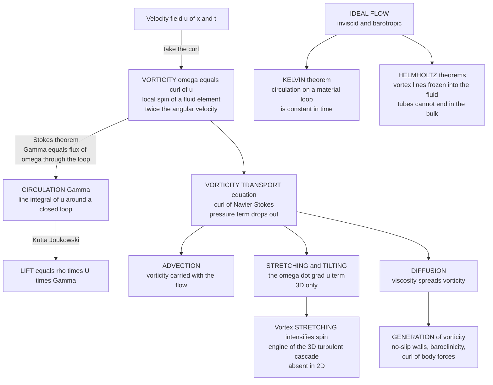

# 🌀 Vorticity and Circulation

> [!abstract] TL;DR
> **Vorticity** $\vec\omega = \nabla\times\vec u$ is the *local spin* of a fluid element — literally twice its angular velocity — and it is often a far more illuminating view of a flow than the velocity field itself. Crucially, curved streamlines do **not** imply spin (an irrotational $1/r$ vortex has zero vorticity everywhere but its core) and straight streamlines can **have** spin (simple shear rotates every element). **Circulation** $\Gamma = \oint \vec u\cdot d\vec\ell$ is the macroscopic sibling, tied to vorticity by **Stokes' theorem** ($\Gamma = \iint \vec\omega\cdot d\vec A$) and to lift by Kutta–Joukowski. Taking the curl of Navier–Stokes gives the **vorticity transport equation** (pressure drops out!): vorticity is *advected*, *diffused*, and — only in 3D — *stretched*. **Vortex stretching** is the engine of the turbulent energy cascade. In ideal flow, **Kelvin's theorem** conserves circulation and **Helmholtz's theorems** freeze vortex lines into the fluid as indestructible elastic threads.

---

## Intuition

**Analogy:** Drop a tiny paddlewheel into a flowing stream and watch its little spokes. If the paddlewheel *spins*, the fluid right there has **vorticity** — local rotation. If it merely translates without turning, that patch of fluid is *irrotational*, no matter how curved its path. Vorticity is the "spin content" of a flow, measured element by element, and it is exactly where the interesting action lives: smoke rings, tornadoes, the swirling wake behind your canoe paddle, and the trailing vortices that can flip a light plane caught behind a jumbo jet.

Here is the beautiful part. In an *ideal* fluid — inviscid and barotropic — the lines that thread along the spin behave like **indestructible elastic threads frozen into the flow**. They stretch, tilt, and tangle with the fluid but can never break, vanish, or simply appear in mid-fluid. That "frozen-in" property (Helmholtz) and the constancy of circulation around a moving loop (Kelvin) are conservation laws as deep as anything in physics — they are why a smoke ring holds together as it drifts across a room.

---

## How It Works

### Core Mechanics

**1. Vorticity is the curl of velocity — a local spin, not a global swirl.** Define
$$\vec\omega = \nabla\times\vec u, \qquad \omega_z = \frac{\partial v}{\partial x} - \frac{\partial u}{\partial y}\ \text{(in 2D)}.$$
Decompose the local velocity gradient into a symmetric **strain** part and an antisymmetric **rotation** part; the antisymmetric part *is* the vorticity, and it rotates a fluid element at angular velocity $\vec\Omega = \tfrac12\vec\omega$. So **vorticity is exactly twice the local angular velocity** of an infinitesimal fluid blob. It is a *field* — every point has its own spin — and it frequently reveals structure (shear layers, vortex cores, wakes) that the velocity field hides.

**2. The great misconception: curvature ≠ rotation.** This is the single most important idea in the topic. Vorticity measures whether *fluid elements* spin, not whether *streamlines* curve. Three canonical flows make the point:

- **Simple shear** $\vec u = (ky, 0)$ — perfectly *straight, parallel* streamlines, yet $\omega_z = -k$ is uniform and nonzero. Every element tumbles like a rolling log because the top moves faster than the bottom. Straight paths, real spin.
- **Free (irrotational) vortex** $u_\theta = \Gamma/(2\pi r)$ — strongly *curved* streamlines circling the center, yet $\vec\omega = 0$ *everywhere except the singular core*. An element orbits the center while counter-rotating about its own axis by exactly the same rate, so the paddlewheel translates around the loop without turning. Curved paths, zero spin.
- **Solid-body rotation** $u_\theta = \Omega r$ — the fluid turns as a rigid disk; $\omega_z = 2\Omega$ is uniform. Every element spins with the whole body.

Two swirls that look identical from a distance (both are "circular flow") can have opposite vorticity signatures. That is why vorticity, not streamline shape, is the honest diagnostic of rotation.

**3. Circulation is vorticity's macroscopic integral.** Circulation around a closed loop $C$ is the line integral of tangential velocity,
$$\Gamma = \oint_C \vec u\cdot d\vec\ell.$$
By **Stokes' theorem** this equals the *flux of vorticity* through any surface capping the loop,
$$\Gamma = \iint_S (\nabla\times\vec u)\cdot d\vec A = \iint_S \vec\omega\cdot d\vec A.$$
So circulation is "total vorticity threading the loop." It is the quantity that produces **lift**: the Kutta–Joukowski theorem gives lift per unit span $L' = \rho\, U\, \Gamma$ — a wing works by generating bound circulation. (This links directly to the not-yet-written sibling *Lift_Drag_and_Aerodynamics*.)

**4. The vorticity transport equation — pressure disappears.** Take the curl of the incompressible Navier–Stokes equation. Because $\nabla\times\nabla p = 0$, the pressure term vanishes — a major analytical prize — leaving
$$\frac{D\vec\omega}{Dt} = (\vec\omega\cdot\nabla)\vec u + \nu\nabla^2\vec\omega.$$
Reading it term by term: the material derivative on the left says vorticity is **advected** (carried bodily with the flow); $\nu\nabla^2\vec\omega$ **diffuses** it (viscosity smears spin, as heat smears temperature); and $(\vec\omega\cdot\nabla)\vec u$ **stretches and tilts** vortex lines. That last term exists only in 3D — in 2D vorticity is a scalar simply advected and diffused, $D\omega_z/Dt = \nu\nabla^2\omega_z$.

**5. Vortex stretching — the ice-skater effect, and the engine of turbulence.** The $(\vec\omega\cdot\nabla)\vec u$ term captures what happens when a vortex tube is stretched along its axis. Conservation of angular momentum for the tube (like a spinning skater pulling in their arms) forces the vorticity to **intensify** as the tube thins. Stretching amplifies spin; thinning concentrates it. This is the mechanism that transfers energy from large eddies to smaller and smaller ones — the **turbulent energy cascade** (see the sibling *Kolmogorov_Theory_and_the_Energy_Cascade*). Because stretching is absent in two dimensions, 2D and 3D turbulence are fundamentally different beasts: 3D cascades energy *down* to dissipation, while 2D famously cascades it *up* to larger scales. (Foreshadows *Turbulence_Fundamentals*.)

**6. Kelvin's circulation theorem — the deep conservation law.** In an ideal fluid (inviscid, barotropic, conservative body forces), the circulation around any **material loop** (a loop of marked fluid particles that moves with the flow) is **constant in time**:
$$\frac{D\Gamma}{Dt} = 0.$$
Rotation cannot be created or destroyed in the bulk of a perfect fluid; it can only be moved and reshaped.

**7. Helmholtz's vortex theorems — frozen-in threads.** Kelvin's theorem has vivid geometric consequences for ideal flow:
- **Vortex lines move with the fluid** — they are "frozen in," advected like dye threads.
- **Vortex-tube strength is constant along its length and in time** — a tube cannot fade out; where it thins it must spin faster (that *is* stretching).
- **Vortex tubes cannot end in the fluid** — they must form closed loops (hello, **vortex rings** and smoke rings) or terminate on a boundary. A vortex filament in the interior has nowhere to stop.

**8. So where does vorticity come from?** If ideal flow conserves it, real vorticity needs a source. The three generators are:
- **Viscosity at no-slip walls** — the dominant source. The no-slip condition forces a velocity gradient at every solid surface, injecting vorticity into a **boundary layer** that then sheds into wakes (foreshadows *The_Boundary_Layer*). Nearly all vorticity in engineering flows is born at a wall.
- **Baroclinicity** — misaligned pressure and density gradients ($\nabla\rho\times\nabla p \ne 0$) generate vorticity; central to the atmosphere, ocean, and astrophysics (sea breezes, fronts, accretion flows).
- **Curl of body forces** — e.g., a spatially varying force whose curl is nonzero.

These origins explain boundary layers, wakes, wingtip vortices, the **Kármán vortex street** shed behind a bluff body, tornadoes, and hurricanes — all rotational, all traceable back to a source of $\vec\omega$.

### Flow / Architecture



---

## Key Concepts

### Secondary Level

- **Spin, not swirl.** Vorticity asks a simple question: if you drop a tiny paddlewheel in, does it *spin*? That local spin is the vorticity — and it is different from whether the water travels in a circle.
- **Circulation is going around.** Add up the flow along a closed loop; if there is net "going around," you have circulation. That is what holds a smoke ring together and what lets a wing lift.
- **Smoke rings never end.** A vortex tube can't just stop in mid-air, so it curls back on itself into a ring — which is exactly why smoke rings are rings.

### Undergraduate Level

- **Definition and factor of two.** $\vec\omega = \nabla\times\vec u = 2\vec\Omega_{\text{element}}$. The velocity-gradient tensor splits into strain (symmetric) + rotation (antisymmetric); vorticity is the rotation part.
- **The three canonical flows.** Shear $(ky,0)$: straight lines, $\omega = -k \ne 0$. Free vortex $u_\theta = \Gamma/2\pi r$: curved lines, $\omega = 0$ except at the core. Solid body $u_\theta = \Omega r$: $\omega = 2\Omega$. Memorize these — they inoculate you against the curvature myth.
- **Stokes' theorem link.** $\Gamma = \oint \vec u\cdot d\vec\ell = \iint \vec\omega\cdot d\vec A$. Circulation is vorticity flux.
- **Lift.** Kutta–Joukowski: $L' = \rho U \Gamma$. No circulation, no lift.
- **2D vorticity equation.** $D\omega/Dt = \nu\nabla^2\omega$ — pure advection–diffusion, no stretching.

### Graduate Level

- **Full 3D transport.** $D\vec\omega/Dt = (\vec\omega\cdot\nabla)\vec u + \nu\nabla^2\vec\omega$; add baroclinic $\tfrac{1}{\rho^2}\nabla\rho\times\nabla p$ and vortex-stretching-by-dilatation terms for compressible flow.
- **Kelvin's theorem, precisely.** $\frac{D}{Dt}\oint_{C(t)}\vec u\cdot d\vec\ell = 0$ requires inviscid, barotropic ($p = p(\rho)$), and conservative body forces. Each failed hypothesis (viscosity, baroclinicity, non-conservative forcing) is a vorticity source.
- **Helmholtz as a corollary.** Frozen-in transport follows from Kelvin plus the kinematic vortex-line evolution $\frac{D}{Dt}(\vec\omega/\rho) = (\vec\omega/\rho\cdot\nabla)\vec u$ (the Helmholtz equation) — vortex lines are material lines.
- **Enstrophy and the cascade.** In 3D, mean **enstrophy** $\int|\vec\omega|^2$ is *produced* by stretching $\langle\omega_i S_{ij}\omega_j\rangle > 0$, sustaining dissipation as $\nu\to 0$; in 2D enstrophy is conserved (inviscidly), giving the inverse energy cascade and forward enstrophy cascade.
- **Point-vortex Hamiltonian.** $N$ point vortices in 2D form a Hamiltonian system with $H = -\tfrac{1}{4\pi}\sum_{i\ne j}\Gamma_i\Gamma_j\ln r_{ij}$ and conjugate variables $(\sqrt{\Gamma_i}\,x_i, \sqrt{\Gamma_i}\,y_i)$ — integrable for $N \le 3$, chaotic for $N \ge 4$.

---

## Python Demo

```python
# Vorticity and vortex dynamics in two acts.
# (a) VORTICITY FIELDS of three textbook flows -- demolishing the myth that
#     curved streamlines mean rotation and straight ones mean none.
# (b) POINT-VORTEX DYNAMICS -- like-signed vortices ORBIT (co-rotation) and
#     an opposite-signed PAIR TRANSLATES, the elegant Hamiltonian dance.
import numpy as np
import matplotlib.pyplot as plt

# =====================================================================
# (a) VORTICITY FIELDS:  omega_z = dv/dx - du/dy
# =====================================================================
n = 300
xs = np.linspace(-2, 2, n)
ys = np.linspace(-2, 2, n)
X, Y = np.meshgrid(xs, ys)
R2 = X**2 + Y**2
R2_safe = np.where(R2 < 1e-3, np.nan, R2)   # mask the singular core

def vorticity(U, V):
    dVdx = np.gradient(V, xs, axis=1)
    dUdy = np.gradient(U, ys, axis=0)
    return dVdx - dUdy

# 1) SIMPLE SHEAR: straight parallel streamlines, but UNIFORM vorticity
k = 1.0
U_sh, V_sh = k * Y, np.zeros_like(X)
w_sh = vorticity(U_sh, V_sh)                # ~ -k everywhere

# 2) FREE (IRROTATIONAL) VORTEX: curved streamlines, ZERO vorticity off-core
Gam = 2 * np.pi
U_fv = -Gam / (2*np.pi) * Y / R2_safe
V_fv =  Gam / (2*np.pi) * X / R2_safe
w_fv = vorticity(U_fv, V_fv)               # ~ 0 away from center

# 3) SOLID-BODY ROTATION: curved streamlines, UNIFORM vorticity 2*Omega
Om = 1.0
U_sb, V_sb = -Om * Y, Om * X
w_sb = vorticity(U_sb, V_sb)               # ~ 2*Omega everywhere

print("Vorticity check (interior means):")
print(f"  shear        omega ~ {np.nanmean(w_sh):+.2f}  (expect {-k:+.2f}, streamlines STRAIGHT)")
print(f"  free vortex  omega ~ {np.nanmean(w_fv):+.2f}  (expect  0.00, streamlines CURVED)")
print(f"  solid body   omega ~ {np.nanmean(w_sb):+.2f}  (expect {2*Om:+.2f}, streamlines CURVED)")

# =====================================================================
# (b) POINT-VORTEX DYNAMICS: each vortex advects in the others' field
#     induced velocity of vortex j at point p:
#       u = -G_j/(2*pi) * (y-y_j)/r^2 ,  v = +G_j/(2*pi) * (x-x_j)/r^2
# =====================================================================
def induced_velocity(pos, gammas, eps=1e-6):
    N = len(gammas)
    vel = np.zeros_like(pos)
    for i in range(N):
        for j in range(N):
            if i == j:
                continue
            dx = pos[i, 0] - pos[j, 0]
            dy = pos[i, 1] - pos[j, 1]
            r2 = dx*dx + dy*dy + eps
            vel[i, 0] += -gammas[j] / (2*np.pi) * dy / r2
            vel[i, 1] +=  gammas[j] / (2*np.pi) * dx / r2
    return vel

def rk4_vortices(pos0, gammas, dt, steps):
    pos = pos0.copy()
    traj = [pos.copy()]
    for _ in range(steps):
        k1 = induced_velocity(pos, gammas)
        k2 = induced_velocity(pos + 0.5*dt*k1, gammas)
        k3 = induced_velocity(pos + 0.5*dt*k2, gammas)
        k4 = induced_velocity(pos + dt*k3, gammas)
        pos = pos + (dt/6.0)*(k1 + 2*k2 + 2*k3 + k4)
        traj.append(pos.copy())
    return np.array(traj)

# CO-ROTATING pair (like-signed): they ORBIT their common centroid
pos_orbit = np.array([[-0.5, 0.0], [0.5, 0.0]])
g_orbit = np.array([1.0, 1.0])
traj_orbit = rk4_vortices(pos_orbit, g_orbit, dt=0.02, steps=1600)

# COUNTER-ROTATING pair (opposite-signed): they TRANSLATE together
pos_pair = np.array([[0.0, 0.4], [0.0, -0.4]])
g_pair = np.array([1.0, -1.0])
traj_pair = rk4_vortices(pos_pair, g_pair, dt=0.02, steps=900)
d = 0.8
v_translate = np.abs(g_pair[0]) / (2*np.pi*d)   # analytic self-propulsion speed
print(f"\nVortex pair: analytic translation speed = {v_translate:.3f} (Gamma/(2*pi*d))")

# =====================================================================
# PLOTS
# =====================================================================
fig, ax = plt.subplots(2, 3, figsize=(17, 10))

def plot_field(a, U, V, w, title):
    speed = np.sqrt(U**2 + V**2)
    lw = 1.2 * speed / (np.nanmax(speed) + 1e-9)
    strm = a.streamplot(X, Y, U, V, color=w, cmap="coolwarm",
                        density=1.1, linewidth=lw, arrowsize=0.8)
    a.set_title(title, fontsize=11)
    a.set_xlim(-2, 2); a.set_ylim(-2, 2); a.set_aspect("equal")
    return strm

s0 = plot_field(ax[0, 0], U_sh, V_sh, w_sh,
                "SHEAR: STRAIGHT lines, vorticity NONZERO")
s1 = plot_field(ax[0, 1], U_fv, V_fv, np.nan_to_num(w_fv),
                "FREE VORTEX: CURVED lines, vorticity ZERO off-core")
s2 = plot_field(ax[0, 2], U_sb, V_sb, w_sb,
                "SOLID BODY: CURVED lines, vorticity UNIFORM")
fig.colorbar(s0.lines, ax=ax[0, 0], fraction=0.046, label="vorticity")
fig.colorbar(s1.lines, ax=ax[0, 1], fraction=0.046, label="vorticity")
fig.colorbar(s2.lines, ax=ax[0, 2], fraction=0.046, label="vorticity")

# Co-rotating orbit
ax[1, 0].plot(traj_orbit[:, 0, 0], traj_orbit[:, 0, 1], color="#d1495b", lw=1.5)
ax[1, 0].plot(traj_orbit[:, 1, 0], traj_orbit[:, 1, 1], color="#1b6ca8", lw=1.5)
ax[1, 0].scatter(traj_orbit[0, :, 0], traj_orbit[0, :, 1], c="k", zorder=5)
ax[1, 0].set_title("LIKE-signed pair ORBITS (co-rotation)")
ax[1, 0].set_aspect("equal"); ax[1, 0].grid(alpha=0.3)

# Counter-rotating translating pair
ax[1, 1].plot(traj_pair[:, 0, 0], traj_pair[:, 0, 1], color="#d1495b", lw=1.5, label="+Gamma")
ax[1, 1].plot(traj_pair[:, 1, 0], traj_pair[:, 1, 1], color="#1b6ca8", lw=1.5, label="-Gamma")
ax[1, 1].scatter(traj_pair[0, :, 0], traj_pair[0, :, 1], c="k", zorder=5)
ax[1, 1].set_title("OPPOSITE-signed PAIR TRANSLATES (self-propels)")
ax[1, 1].legend(); ax[1, 1].set_aspect("equal"); ax[1, 1].grid(alpha=0.3)

# Circulation around a loop enclosing the free-vortex core
theta = np.linspace(0, 2*np.pi, 400)
r_loop = 1.0
xl, yl = r_loop*np.cos(theta), r_loop*np.sin(theta)
# tangential velocity Gamma/(2*pi*r) dotted with dl integrates to Gamma
Gamma_loop = Gam  # exact for the free vortex, independent of loop radius
ax[1, 2].plot(xl, yl, color="#2a9d8f", lw=2)
ax[1, 2].quiver(xl[::30], yl[::30], -yl[::30], xl[::30],
                color="#2a9d8f", scale=25, width=0.006)
ax[1, 2].scatter([0], [0], c="k", marker="x", s=80)
ax[1, 2].set_title(f"CIRCULATION around loop = Gamma = {Gamma_loop:.2f}")
ax[1, 2].set_xlim(-1.6, 1.6); ax[1, 2].set_ylim(-1.6, 1.6)
ax[1, 2].set_aspect("equal"); ax[1, 2].grid(alpha=0.3)

plt.tight_layout()
plt.savefig("vorticity_and_circulation.png", dpi=110)
print("Saved vorticity_and_circulation.png")
```

**What it shows.** The top row is the myth-buster: the **shear** flow has ruler-straight streamlines yet a solid, uniform vorticity color; the **free vortex** has dramatically curved streamlines yet vorticity that is essentially zero everywhere off the masked core; the **solid-body** flow has uniform vorticity $2\Omega$. Curvature and spin are decoupled. The bottom row is vortex dynamics: two *like-signed* point vortices **orbit** their shared centroid (co-rotation), an *opposite-signed* **pair self-propels** in a straight line at $\Gamma/(2\pi d)$ (the mechanism behind vortex rings), and the last panel shows that the **circulation** around a loop enclosing the free-vortex core equals $\Gamma$ regardless of the loop's radius — Stokes' theorem in action, since all the vorticity is concentrated at the core.

---

## Real-World Applications

> **Aircraft wake turbulence.** Every wing sheds two counter-rotating **trailing vortices** from its tips, carrying the circulation that produced the lift ($L' = \rho U \Gamma$). Behind a heavy jet these persist for kilometers and can roll a following light aircraft — the reason air-traffic control enforces wake-separation minima. This is Helmholtz's "vortex tubes cannot end in the fluid" made visible: the bound vortex on the wing turns into trailing vortices that close through the starting vortex far behind.

- **Tornadoes and hurricanes** — intense concentrations of vertical vorticity. Vortex stretching (updraft intensification) spins up tornadoes; planetary vorticity plus latent-heat-driven convergence organizes hurricanes. Meteorology tracks **relative** and **potential vorticity** as primary forecast variables.
- **Kármán vortex street** — alternating vortices shed behind bluff bodies (chimneys, bridge cables, submarine periscopes) drive vibration and the "singing" of wires; the shedding frequency sets the Strouhal number and can cause resonant structural failure.
- **Ocean eddies** — mesoscale rings pinch off from currents like the Gulf Stream, coherent vortices that transport heat, salt, and nutrients across basins for months.
- **Accretion disks** — angular-momentum (vorticity) transport governs how matter spirals onto stars and black holes; baroclinic and instability-driven vorticity is central to disk dynamics.
- **Combustor and mixer design** — engineers deliberately generate vorticity (swirlers, vortex generators on wings) to enhance mixing or delay boundary-layer separation.

---

## Common Pitfalls

- **"Curved streamlines mean rotation."** The headline error. A free vortex has wildly curved streamlines and *zero* vorticity; simple shear has straight streamlines and *nonzero* vorticity. Vorticity is the curl of the velocity, a *local* property of fluid-element spin — always compute it, never eyeball the streamlines.
- **Confusing vorticity with angular velocity by a factor of two.** $\vec\omega = 2\vec\Omega_{\text{element}}$, not $\vec\Omega$. The factor of two trips up many derivations.
- **Expecting vortex stretching in 2D.** The $(\vec\omega\cdot\nabla)\vec u$ term vanishes in strictly 2D flow, so 2D "turbulence" cannot intensify vorticity the way 3D does. Applying 3D cascade intuition to a 2D simulation gives the wrong energy-flux direction.
- **Applying Kelvin's theorem where it doesn't hold.** Circulation is conserved only for *inviscid, barotropic, conservatively forced* material loops. Viscosity, baroclinicity, or non-conservative forcing each break it — indeed these are precisely the *sources* of vorticity.
- **Forgetting the singular core of the free vortex.** The irrotational $1/r$ vortex has all its vorticity (and infinite velocity) crammed into an idealized core; a loop enclosing the core still has circulation $\Gamma$. Ignoring the core wrongly concludes "circulation is zero because vorticity is zero."
- **Thinking wall vorticity is unphysical bookkeeping.** The no-slip condition at a solid surface is the dominant real-world *source* of vorticity; boundary layers are where the flow's spin is actually manufactured, then shed into wakes.

Deeper development lives in the sibling notes *Kinematics_of_Fluid_Flow* (strain/rotation decomposition of the velocity gradient, streamlines and material lines), *Potential_Flow_and_Complex_Analysis* (irrotational flow where $\vec\omega = 0$ makes the whole field a potential problem), *Lift_Drag_and_Aerodynamics* (circulation and the Kutta condition), *The_Boundary_Layer* (where wall vorticity is generated), *Turbulence_Fundamentals*, and *Kolmogorov_Theory_and_the_Energy_Cascade* (where vortex stretching drives the cascade).

---

## Related Concepts

- [[Euler_Equations_and_Ideal_Fluids]] — the inviscid, barotropic setting in which Kelvin's theorem and Helmholtz's frozen-in vortex lines hold exactly.
- [[Viscous_Fluids_and_Navier_Stokes]] — taking the curl of these equations yields the vorticity transport equation; viscosity is the wall-source and diffuser of vorticity.
- [[Turbulence_and_Instabilities]] — vortex stretching is the engine of the 3D turbulent cascade, and its absence sets 2D turbulence apart.
- [[Conservation_Laws_and_Control_Volumes]] — circulation is a conserved integral quantity; Kelvin's theorem is the ideal-flow conservation law that complements mass and momentum.
- [[Integral_Theorems]] — Stokes' theorem is the exact bridge $\Gamma = \oint\vec u\cdot d\vec\ell = \iint\vec\omega\cdot d\vec A$ between circulation and vorticity flux.
- [[Vector_Fields_and_Line_Integrals]] — circulation *is* the line integral of a vector field around a closed curve; vorticity is its curl.
- [[Rotational_Dynamics]] — the ice-skater angular-momentum argument behind vortex stretching, and the factor $\vec\omega = 2\vec\Omega$.
- [[Coriolis_Effect_and_Geostrophic_Balance]] — planetary (absolute) vorticity and the vorticity view of large-scale atmospheric flow.
- [[Mesoscale_Eddies_and_Ocean_Variability]] — coherent ocean vortices as long-lived rotational structures transporting heat and tracers.
- [[Accretion_Disks_and_X_ray_Binaries]] — vorticity and angular-momentum transport in astrophysical swirling flows.

---

## Review Questions

1. **Secondary:** You drop a tiny paddlewheel into two different swirling flows. In flow A the streamlines are straight and parallel but the water at the top moves faster than at the bottom; in flow B the water travels in neat circles around a drain. In which flow does the paddlewheel spin, and what does that tell you about vorticity versus the shape of the path?
2. **Undergraduate:** For the free vortex $u_\theta = \Gamma/(2\pi r)$, show that the vorticity is zero for $r > 0$ yet the circulation around any loop enclosing the origin is $\Gamma$. Reconcile these two facts using Stokes' theorem. Then explain why a simple shear flow $\vec u = (ky, 0)$ has nonzero vorticity despite straight streamlines.
3. **Graduate:** Starting from the incompressible Navier–Stokes equation, take the curl to derive the vorticity transport equation and explain precisely why the pressure term vanishes. Identify the vortex-stretching term, argue why it is absent in strictly 2D flow, and use this to explain the opposite directions of the energy cascade in 2D versus 3D turbulence. Finally, state the assumptions of Kelvin's circulation theorem and name the vorticity source that each broken assumption represents.

---

## Sources

- Batchelor, G. K. — *An Introduction to Fluid Dynamics*, Ch. 2 & 5 (vorticity, Kelvin's and Helmholtz's theorems). Cambridge University Press.
- Kundu, Cohen & Dowling — *Fluid Mechanics*, 6th ed., Ch. 5 (Vorticity Dynamics). Academic Press.
- Saffman, P. G. — *Vortex Dynamics*. Cambridge University Press (point vortices, Helmholtz laws, vortex rings).
- Acheson, D. J. — *Elementary Fluid Dynamics*, Ch. 5 (vorticity, circulation, Kelvin's theorem). Oxford University Press.
- Davidson, P. A. — *Turbulence: An Introduction for Scientists and Engineers*, Ch. 5 (vortex stretching and the energy cascade). Oxford University Press.

---

#fluid-dynamics #vorticity #circulation #vortex-dynamics #kelvins-theorem
