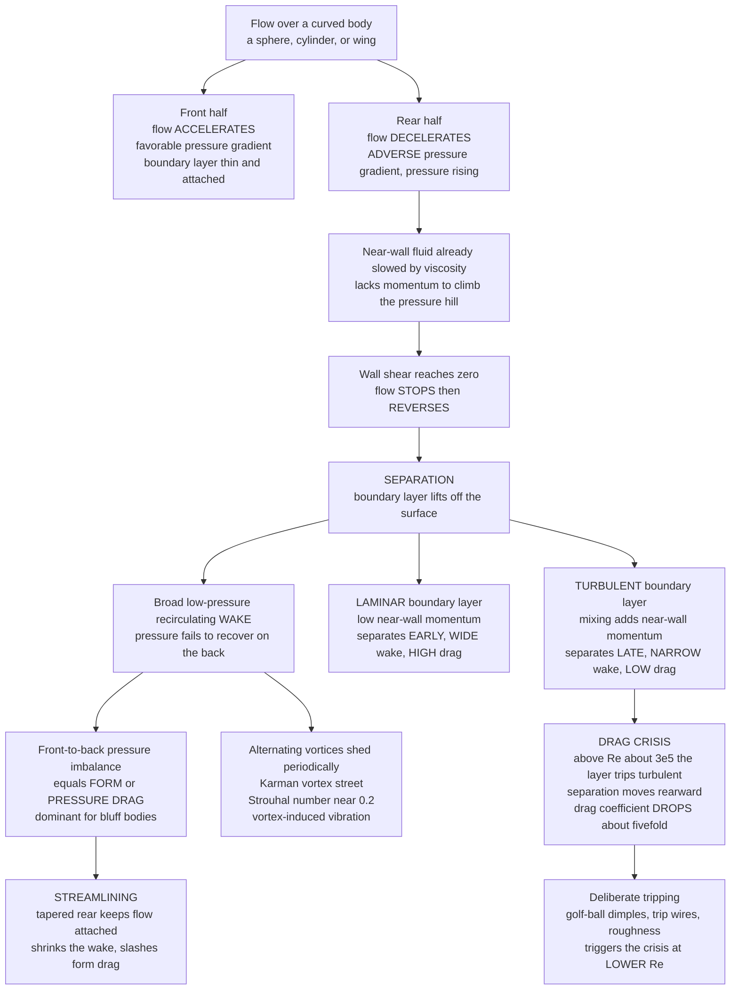

# 🌀 Flow Separation and the Drag Crisis

> [!abstract] TL;DR
> **Flow separation** is the moment a **boundary layer** detaches from a surface: as fluid rounds the back of a body the flow must **decelerate** and the pressure must **rise** — an **adverse pressure gradient** — and the near-wall fluid, already sapped of momentum by viscosity, stalls, reverses, and lifts off, leaving a broad low-pressure **wake**. That failed pressure recovery is **form (pressure) drag**, which dominates for **bluff bodies** (spheres, cylinders, cars, buildings). The great counterintuition: a **turbulent** boundary layer carries more near-wall momentum, so it clings farther, separates **later**, and leaves a **narrower** wake — *less* drag than a laminar one. Push a smooth sphere past a critical Reynolds number ($Re \sim 3\times10^5$) and the boundary layer trips to turbulence, separation jumps rearward, and the drag coefficient **collapses by a factor of about five** even as the speed rises — the **drag crisis**, deliberately exploited by **golf-ball dimples**. Separation also sheds alternating vortices — the **Kármán vortex street** — whose resonance vibrated the **Tacoma Narrows** bridge to destruction. Taming separation through **streamlining, tripping, and flow control** is one of the most practically important skills in fluid engineering.

---

## Intuition

**Analogy:** Why does a golf ball have dimples? Astonishingly, roughening a ball's surface makes it fly **farther**, not slower. The dimples deliberately **trip** the smooth airflow into a fine-grained turbulence — and turbulence, paradoxically, **reduces** drag. The secret is **flow separation**. When air sweeps over the front of a ball it speeds up and hugs the surface, but on the back the surface curves away and the air can no longer follow it: the flow **peels off**, leaving a wide, churning, low-pressure **wake** that sucks the ball backward like an invisible parachute. A turbulent boundary layer, energised by mixing, clings to the curving rear surface **longer** before letting go, so the wake shrinks and the suction weakens. A dimpled ball carries roughly **twice as far** as a smooth one at the same launch — the entire gain bought by controlling *where the flow separates*.

That same hidden villain is behind most of the drag you ever pay: the wake behind a truck, the buffeting of a stalled wing, the sway of a skyscraper, the singing of power lines. Separation is the pivotal event that divides gracefully **streamlined** flow from wasteful **bluff-body** flow — and learning to delay, trip, or steer it is a central art of engineering.

---

## How It Works

### Core Mechanics

**1. The adverse pressure gradient — the cause.** By Bernoulli's logic, where a flow **speeds up** the pressure **falls** (a *favorable* gradient) and where it **slows down** the pressure **rises** (an *adverse* gradient). Over the front of a rounded body the geometry accelerates the flow, so the pressure drops and the boundary layer stays thin, attached, and healthy. Over the **back**, the flow must decelerate back toward the free-stream and the pressure must climb again — the fluid is now running **uphill** against a rising pressure. Far from the wall the flow has plenty of momentum to make the climb. Right at the wall, the fluid has already been slowed almost to a standstill by viscosity (the [[Viscous_Fluids_and_Navier_Stokes]] no-slip condition), so it has the **least** momentum exactly where the pressure hill is **steepest**.

**2. Separation — the event.** The near-wall fluid decelerates, **stops**, and then is pushed **backward** by the adverse gradient: the wall shear stress passes through zero and reverses. At that **separation point** the boundary layer can no longer stay attached; it **lifts off** the surface and the main flow detaches, rolling up into a recirculating region behind the body. Mathematically the separation point is where $\partial u/\partial y = 0$ at the wall. Physically it is the instant a streamlined flow becomes a bluff-body flow. A **favorable** (accelerating) gradient can never cause separation — only a rising pressure can — which is why the front of a body almost never separates and the rear almost always does.

**3. Form (pressure) drag — the consequence.** In ideal, inviscid flow the pressure that dropped over the front would **fully recover** over the back, the front-to-back pressure forces would cancel exactly, and the body would feel **zero** drag — d'Alembert's paradox, the great failure of the [[Euler_Equations_and_Inviscid_Flow]] idealisation. Separation breaks that symmetry. Behind the separation point the pressure never recovers; instead the wake sits at a roughly constant low **base pressure**. Now the high pressure on the front is no longer balanced by the back, and the net streamwise pressure force is **form drag** (also called **pressure drag**). For **bluff** bodies — a sphere, a cylinder, a brick, a car, a building — form drag dwarfs skin friction. **Streamlining** (tapering the rear into a long teardrop tail) keeps the adverse gradient gentle, holds the flow attached, and can cut form drag by an order of magnitude — a teardrop has roughly one-tenth the drag of a sphere of the same frontal area.

**4. Laminar versus turbulent separation — the key trade-off.** A **laminar** boundary layer is smooth and orderly, with low near-wall momentum; it surrenders to the adverse gradient **early** and separates near the widest point, giving a **wide** wake and **high** form drag. A **turbulent** boundary layer is a chaotic tumble that constantly mixes high-momentum fluid from the free-stream down toward the wall. That re-energised near-wall flow resists the adverse gradient far better, so a turbulent layer separates **later** (farther around the back), leaving a **narrower** wake and **less** form drag. This is turbulence's great counterintuitive gift: on a bluff body, a *rougher, more turbulent* boundary layer can mean *lower* total drag, because delaying separation saves far more form drag than the extra skin friction costs.

**5. The drag crisis — the paradox.** For a smooth sphere or cylinder the boundary layer is laminar at moderate Reynolds numbers, giving a nearly constant drag coefficient $C_D \approx 0.4$–$0.5$. As $Re$ climbs through a **critical value near $3\times10^5$**, the boundary layer transitions to **turbulent** *before* it separates. Separation jumps rearward, the wake suddenly narrows, and $C_D$ **plunges by a factor of about five** — from $\approx 0.5$ down to $\approx 0.1$ — even though the flow is now *faster*. This sharp dip in the $C_D$-versus-$Re$ curve is the famous **drag crisis** (or "drag dip"). It is the rare regime where going faster makes a body proportionally *easier* to push.

**6. Dimples and tripping — the exploitation.** Engineers do not wait for nature to trip the boundary layer; they force it. **Roughening** the surface (golf-ball dimples), adding **trip wires**, seams, or **vortex generators** provokes early transition to turbulence, triggering the drag crisis at a **lower** Reynolds number than a smooth body would. A golf ball in flight sits at $Re \sim 10^5$ — below a smooth sphere's crisis but *above* a dimpled ball's — so the dimples drop it into the low-drag regime and it carries about twice as far. The raised seam on a **cricket** ball and the stitching on a **baseball** manipulate boundary-layer transition on one side only, producing the asymmetric separation that makes the ball **swing** or curve.

**7. Vortex shedding and the Kármán street.** Separation from a bluff body is rarely steady. Above $Re \approx 50$ for a cylinder the two shear layers shed alternately, rolling up into a regular staggered train of counter-rotating vortices — the **von Kármán vortex street** (a rotational structure traced back to its source in [[Vorticity_and_Circulation]]). The shedding is periodic, and its dimensionless frequency is the **Strouhal number** $St = f\,d / U$, which sits near $0.2$ over a huge range of $Re$. The alternating pressure loads drive **vortex-induced vibration** (VIV): the singing of wires, the swaying of chimneys, the oscillation of bridge cables and offshore risers. When the shedding frequency coincides with a structure's natural frequency, resonance can be catastrophic — the aeroelastic torsional flutter that destroyed the **Tacoma Narrows** bridge in 1940 is the canonical warning (resonance mechanics in [[Oscillations_and_SHM]]).

**8. Stall — separation on a wing.** On an airfoil the same physics limits lift. As angle of attack rises, the adverse gradient on the upper surface steepens until the boundary layer separates from the top; the suction that carried the lift collapses, lift falls, and drag spikes. This is **stall**, and the angle at which it strikes is the **critical angle of attack** (roughly $12$–$16^{\circ}$). High-lift devices (slats, flaps) and flow-control tricks exist precisely to delay this separation — the aerodynamics side developed in [[Lift_Drag_and_Aerodynamics]].

**9. Flow control — the engineering goal.** Because separation is so costly, a whole toolkit exists to fight it: **streamlining** (gentle rear tapers, boat-tails on trucks), **vortex generators** (small vanes that stir high-momentum fluid toward the wall), **boundary-layer suction or blowing** (removing or re-energising the tired near-wall flow), **riblets** (shark-skin-like grooves), and **active control** (synthetic jets, plasma actuators). Whether the aim is to *delay* separation (a wing, a diffuser, a pipeline) or to *provoke* it usefully (a golf ball, a spoiler dumping lift), controlling the separation point is the recurring objective.

### Flow / Architecture



---

## Key Concepts

### Secondary Level

- **The flow peels off.** Air (or water) can follow the front of a smooth shape, but where the surface curves sharply away at the back, the flow can't keep up and **detaches**, leaving a swirling low-pressure pocket — the **wake** — that drags the body back.
- **Drag is mostly the wake.** For blunt shapes (a brick, a parachute, a truck) most of the drag is the suction of that wake behind them, not friction along the sides. Making the tail long and pointy (a teardrop, a fish) keeps the flow attached and cuts the drag dramatically.
- **Dimples make golf balls fly farther.** Roughness trips the airflow into turbulence that clings to the ball longer, shrinking the wake. A dimpled ball travels about **twice** as far as a smooth one.
- **Vortices can shake things apart.** Wind peeling off a cable or chimney sheds a regular train of swirls that push the object side to side. If that rhythm matches the object's natural sway, it can vibrate violently — how the Tacoma Narrows bridge tore itself apart in 1940.

### Undergraduate Level

- **Adverse pressure gradient.** Separation requires $dp/dx > 0$ (rising pressure). Separation point defined by zero wall shear: $\left.\partial u/\partial y\right|_{y=0} = 0$.
- **Drag decomposition.** Total drag $=$ **skin friction** (viscous shear) $+$ **form/pressure drag** (wake). Bluff bodies are form-drag dominated; streamlined bodies are friction-dominated.
- **Turbulent delay.** A turbulent boundary layer has a fuller velocity profile and higher near-wall momentum, so it separates later. Sphere separation moves from $\approx 80^{\circ}$ (laminar) to $\approx 120^{\circ}$ (turbulent), narrowing the wake.
- **Drag crisis.** For a smooth sphere, $C_D$ drops from $\approx 0.5$ to $\approx 0.1$ near $Re_c \approx 3\times10^5$; roughness shifts $Re_c$ lower. Reynolds number $Re = \rho U d/\mu$ (see [[Dimensional_Analysis_and_Similarity]]).
- **Vortex shedding.** Strouhal number $St = f d/U \approx 0.2$ for a cylinder over $10^3 \lesssim Re \lesssim 10^5$. Shedding drives **vortex-induced vibration** and lock-in at resonance.
- **Stall.** On a wing, upper-surface separation past the critical angle of attack collapses lift and spikes drag.

### Graduate Level

- **Boundary-layer separation criterion.** In the momentum-integral / Falkner–Skan framework, separation of a laminar layer occurs when the pressure-gradient parameter reaches a critical negative value (Thwaites' method: $\lambda \approx -0.09$). Turbulent layers tolerate far stronger adverse gradients before separating.
- **Base pressure and the wake deficit.** Form drag equals the integral of $(p_\infty - p)$ over the projected area; the near-constant **base pressure coefficient** $C_{p,b}$ sets it. Subcritical spheres/cylinders sit at $C_{p,b} \approx -1.1$; supercritical (post-crisis) rises to $\approx -0.4$, the direct signature of the shrunken wake.
- **Drag crisis mechanism.** A **laminar separation bubble** forms, the separated shear layer transitions to turbulence, and the turbulent flow **reattaches** before separating again much farther back — the reattachment is what collapses the wake and $C_D$. Surface roughness, free-stream turbulence, and trip wires all lower the transition $Re$.
- **Vortex-shedding dynamics.** The wake is a global instability (a supercritical Hopf bifurcation near $Re \approx 47$ for a cylinder); the Kármán street is the resulting limit cycle. $St(Re)$ follows Roshko's fit $St \approx 0.212\,(1 - 21.2/Re)$. VIV **lock-in** occurs when shedding synchronises to the structural natural frequency across a band of flow speeds.
- **Vorticity origin.** All of this rotational structure is wall-born vorticity: the no-slip condition injects vorticity into the boundary layer, which separates and rolls up into the wake — the mechanism developed in [[Vorticity_and_Circulation]] and [[Turbulence_and_Instabilities]].

---

## Python Demo

```python
# Flow separation and the drag crisis, in two acts.
# (a) THE DRAG CRISIS: drag coefficient C_D vs Reynolds number for a SPHERE
#     across the whole range -- Stokes 24/Re, the Newton plateau ~0.4-0.5, and
#     the sudden DROP near Re ~ 3e5 where the boundary layer trips turbulent and
#     separation is delayed. Roughness (dimples) shifts the crisis to lower Re.
# (b) SEPARATION MADE VISIBLE: the pressure distribution around a cylinder
#     (inviscid full recovery vs laminar/turbulent separation cutting off
#     recovery = form drag), a Karman vortex STREET schematic, and the
#     Strouhal number vs Re.
# Requires: numpy, matplotlib
import numpy as np
import matplotlib.pyplot as plt

# =====================================================================
# (a) DRAG CRISIS -- Morrison (2013) full-range sphere drag correlation,
#     parametrised by the crisis Reynolds number Rc so we can shift it.
# =====================================================================
def cd_sphere(Re, Rc=2.63e5):
    Re = np.asarray(Re, dtype=float)
    stokes    = 24.0 / Re                                   # creeping flow
    intermed  = 2.6 * (Re / 5.0) / (1.0 + (Re / 5.0) ** 1.52)
    crisis    = 0.411 * (Re / Rc) ** -7.94 / (1.0 + (Re / Rc) ** -8.00)
    supercrit = 0.25 * (Re / 1.0e6) / (1.0 + (Re / 1.0e6))
    return stokes + intermed + crisis + supercrit

Re = np.logspace(-1, 7, 2000)
cd_smooth = cd_sphere(Re, Rc=2.63e5)   # smooth sphere: crisis near 3e5
cd_rough  = cd_sphere(Re, Rc=6.0e4)    # dimpled/rough: crisis shifted LOWER

# quantify the crisis for the smooth sphere: plateau value vs post-crisis min
plateau_mask = (Re > 2e3) & (Re < 1e5)
cd_plateau   = np.mean(cd_smooth[plateau_mask])
i_min        = np.argmin(np.where((Re > 1e5) & (Re < 1e6), cd_smooth, np.inf))
cd_dip, Re_dip = cd_smooth[i_min], Re[i_min]
print("=== Drag crisis (smooth sphere) ===")
print(f"Sub-critical plateau  C_D ~ {cd_plateau:.2f}")
print(f"Post-crisis minimum   C_D ~ {cd_dip:.2f} at Re ~ {Re_dip:.1e}")
print(f"Drag collapses by a factor of ~ {cd_plateau / cd_dip:.1f}")

# =====================================================================
# (b1) PRESSURE around a cylinder: inviscid recovers fully (zero drag,
#      d'Alembert); real flow SEPARATES and the pressure never recovers.
#      Turbulent BL separates LATER -> higher base pressure -> less drag.
# =====================================================================
theta = np.linspace(0, 180, 400)          # degrees from front stagnation
th    = np.radians(theta)
cp_inv      = 1.0 - 4.0 * np.sin(th) ** 2                 # ideal / inviscid
cp_attached = 1.0 - 2.3 * np.sin(th) ** 2                 # real attached suction
sep_lam, sep_turb = 80.0, 130.0                           # separation angles [deg]
base_lam  = 1.0 - 2.3 * np.sin(np.radians(sep_lam))  ** 2 # subcritical base Cp
base_turb = 1.0 - 2.3 * np.sin(np.radians(sep_turb)) ** 2 # supercritical base Cp
cp_lam  = np.where(theta <= sep_lam,  cp_attached, base_lam)
cp_turb = np.where(theta <= sep_turb, cp_attached, base_turb)
print("\n=== Cylinder base pressure ===")
print(f"Laminar (subcritical)   separates ~{sep_lam:.0f} deg, base Cp ~ {base_lam:+.2f}")
print(f"Turbulent (supercrit.)  separates ~{sep_turb:.0f} deg, base Cp ~ {base_turb:+.2f}"
      "  (higher -> narrower wake -> less form drag)")

# =====================================================================
# (b2) KARMAN VORTEX STREET schematic + STROUHAL number
# =====================================================================
d, U = 1.0, 1.0
St   = 0.20
lam  = U / (St) * 1.0        # wavelength scale (spacing) ~ U/f, in units of d
xs   = np.arange(2.0, 14.0, 1.6)
y_top, y_bot = 0.6, -0.6
top_x = xs
bot_x = xs + 0.8            # staggered
print(f"\n=== Vortex shedding ===  Strouhal St = f d / U ~ {St}")
print(f"At U = 30 m/s past a d = 0.05 m cable: f = St*U/d "
      f"= {St*30/0.05:.0f} Hz")

# Strouhal vs Re (Roshko fit), plateau near 0.2
Re_st = np.logspace(1.8, 5.3, 400)
St_re = 0.212 * (1.0 - 21.2 / Re_st)

# =====================================================================
# PLOTS: 2 x 2
# =====================================================================
fig, ax = plt.subplots(2, 2, figsize=(15, 11))
fig.suptitle("Flow Separation and the Drag Crisis",
             fontsize=16, fontweight="bold")

# A. drag crisis
axA = ax[0, 0]
axA.loglog(Re, cd_smooth, color="#1f77b4", lw=2.5, label="smooth sphere")
axA.loglog(Re, cd_rough,  color="#d62728", lw=2.2, ls="--",
           label="rough / dimpled")
axA.loglog(Re, 24.0 / Re, color="gray", lw=1.4, ls=":",
           label="Stokes  24 / Re")
axA.axvspan(2e5, 5e5, color="#ffe08a", alpha=0.5)
axA.annotate("DRAG CRISIS\nBL trips turbulent,\nseparation delayed",
             xy=(Re_dip, cd_dip), xytext=(6e5, 0.03), fontsize=9,
             color="#8a5a00",
             arrowprops=dict(arrowstyle="->", color="#8a5a00"))
axA.annotate("Newton plateau\nC_D ~ 0.4-0.5", xy=(1e4, 0.45),
             xytext=(2e2, 1.2), fontsize=9,
             arrowprops=dict(arrowstyle="->"))
axA.set_xlabel("Reynolds number  Re = rho U d / mu")
axA.set_ylabel("drag coefficient  C_D")
axA.set_title("A. C_D vs Re: the drag crisis")
axA.set_ylim(0.02, 300)
axA.legend(fontsize=8); axA.grid(alpha=0.3, which="both")

# B. pressure distribution around a cylinder
axB = ax[0, 1]
axB.plot(theta, cp_inv,  color="gray",    lw=1.8, ls=":",
         label="inviscid: full recovery (zero drag)")
axB.plot(theta, cp_lam,  color="#1f77b4", lw=2.5,
         label=f"laminar: separates ~{sep_lam:.0f} deg")
axB.plot(theta, cp_turb, color="#d62728", lw=2.5,
         label=f"turbulent: separates ~{sep_turb:.0f} deg")
axB.fill_between(theta, cp_lam, cp_inv, where=(theta > sep_lam),
                 color="#add8e6", alpha=0.5)
axB.axvline(sep_lam,  color="#1f77b4", ls="--", lw=1.0)
axB.axvline(sep_turb, color="#d62728", ls="--", lw=1.0)
axB.annotate("failed pressure recovery\n= FORM DRAG", xy=(150, 0),
             xytext=(70, 0.4), fontsize=9,
             arrowprops=dict(arrowstyle="->"))
axB.invert_yaxis()   # low pressure (suction) points up
axB.set_xlabel("angle from front stagnation  theta [deg]")
axB.set_ylabel("pressure coefficient  C_p")
axB.set_title("B. Separation cuts off pressure recovery")
axB.legend(fontsize=8, loc="lower right"); axB.grid(alpha=0.3)

# C. Karman vortex street schematic
axC = ax[1, 0]
cyl = plt.Circle((0, 0), 0.5, color="#333333", zorder=5)
axC.add_patch(cyl)
axC.scatter(top_x, np.full_like(top_x, y_top), s=260, c="#d62728",
            edgecolors="k", zorder=4)
axC.scatter(bot_x, np.full_like(bot_x, y_bot), s=260, c="#1f77b4",
            edgecolors="k", zorder=4)
for x in top_x:   # clockwise swirl markers (top row)
    axC.annotate("", xy=(x + 0.22, y_top), xytext=(x - 0.22, y_top),
                 arrowprops=dict(arrowstyle="->", color="#d62728", lw=1.3))
for x in bot_x:   # counter-clockwise (bottom row)
    axC.annotate("", xy=(x - 0.22, y_bot), xytext=(x + 0.22, y_bot),
                 arrowprops=dict(arrowstyle="->", color="#1f77b4", lw=1.3))
axC.annotate("U", xy=(-2.2, 0), xytext=(-3.2, 0), fontsize=13,
             arrowprops=dict(arrowstyle="->", lw=2))
axC.text(6, 1.35, "Karman vortex street:  St = f d / U ~ 0.2",
         ha="center", fontsize=11, fontweight="bold")
axC.set_xlim(-3.5, 15); axC.set_ylim(-1.6, 1.7)
axC.set_aspect("equal"); axC.set_title("C. Vortex shedding behind a bluff body")
axC.axis("off")

# D. Strouhal number vs Reynolds number
axD = ax[1, 1]
axD.semilogx(Re_st, St_re, color="#2ca02c", lw=2.5)
axD.axhline(0.2, color="k", ls="--", lw=1.0)
axD.annotate("St ~ 0.2 plateau\n(nearly constant\nover a wide Re range)",
             xy=(1e4, 0.2), xytext=(2e2, 0.10), fontsize=9,
             arrowprops=dict(arrowstyle="->"))
axD.set_xlabel("Reynolds number  Re")
axD.set_ylabel("Strouhal number  St = f d / U")
axD.set_title("D. Shedding frequency: the Strouhal plateau")
axD.set_ylim(0, 0.26); axD.grid(alpha=0.3, which="both")

plt.tight_layout(rect=[0, 0, 1, 0.96])
plt.savefig("flow_separation_and_drag_crisis.png", dpi=110)
print("\nSaved flow_separation_and_drag_crisis.png")
```

**What it shows.** Panel **A** is the star: the sphere's drag coefficient follows the Stokes $24/Re$ line at tiny $Re$, flattens onto the Newton plateau ($C_D \approx 0.4$–$0.5$), then **plunges** near $Re \sim 3\times10^5$ — the **drag crisis** — before recovering. The dashed red curve shows how surface roughness (dimples) **shifts the crisis to a lower $Re$**, which is exactly why a dimpled golf ball, flying at $Re \sim 10^5$, sits in the low-drag regime while a smooth ball does not. The console prints the plateau value, the post-crisis minimum, and the roughly five-fold drop. Panel **B** makes separation visible through pressure: the inviscid curve recovers fully to $C_p = +1$ at the rear (symmetric, **zero drag** — d'Alembert's paradox), but the real flow **separates** and the pressure freezes at a low **base** value — the shaded gap is exactly the **form drag**. The turbulent boundary layer separates **later** ($\approx 130^{\circ}$ vs $\approx 80^{\circ}$), reaching a **higher** base pressure, so its wake and drag are smaller. Panel **C** sketches the staggered, counter-rotating **Kármán vortex street** with the **Strouhal** relation, and Panel **D** shows that the shedding frequency collapses onto the near-universal $St \approx 0.2$ plateau across a wide Reynolds range.

---

## Real-World Applications

> **Example — the golf ball (the drag crisis, engineered).** A golf ball flies at $Re \approx 10^5$. A *smooth* sphere at that Reynolds number is still **below** its drag crisis, so it drags a wide laminar-separation wake and drops out of the sky quickly. The ~300–450 **dimples** trip the boundary layer to turbulence, moving the drag crisis down to a much lower $Re$; the ball therefore flies in the **low-drag** regime, its wake shrinks, and it carries roughly **twice as far** as a smooth ball on the same swing. It is arguably the most successful piece of everyday aerodynamic engineering — deliberately using turbulence to defeat separation.

- **The Tacoma Narrows Bridge (1940).** Wind separating off the bluff deck shed vortices that coupled with the deck's torsional mode; the resulting aeroelastic flutter grew until the span tore apart. Modern long-span bridges use streamlined box-girder decks, fairings, and tuned mass dampers to break up vortex shedding and detune resonance.
- **Cars and trucks.** Most highway fuel burn fights form drag from the separated wake behind a blunt tail. **Boat-tails**, rounded edges, underbody trays, and vortex generators keep flow attached longer, shrinking the wake — the difference between $C_D \approx 0.25$ (a sleek car) and $\approx 0.6$ (a boxy truck).
- **Aircraft stall and high-lift devices.** Wing stall is upper-surface separation; slats, flaps, and vortex generators re-energise or delay it so aircraft can fly slowly on approach without losing lift — see [[Lift_Drag_and_Aerodynamics]].
- **Sports-ball swing and curve.** A cricket ball's raised seam and a baseball's stitches trip transition on one side only; the asymmetric separation shifts the wake sideways, generating the side force that makes the ball swing or break.
- **Tall structures and marine risers.** Chimneys, cables, and offshore pipelines suffer **vortex-induced vibration**; helical strakes and fairings are added specifically to spoil the coherent vortex street and suppress the oscillation.
- **Biological swimming and flight.** Fish and birds exploit and control separation — leading-edge vortices, streamlined bodies, and drag reduction are central to efficient locomotion, developed in [[Fluid_Dynamics_in_Biology]] and [[Biomechanics_of_Movement]].

---

## Common Pitfalls

- **"Smoother is always lower drag."** Near the drag crisis a *rough* surface can have several times *less* drag than a smooth one — the dimpled-golf-ball paradox. Always check the Reynolds regime before assuming polishing helps; on a bluff body below its crisis, roughness can be a huge win.
- **Confusing skin friction with form drag.** They respond to opposite fixes. Streamlining a tail attacks form drag but slightly *raises* skin friction; a smoother surface cuts skin friction but can *worsen* form drag by delaying transition. Diagnose which dominates (bluff vs streamlined) before choosing a remedy.
- **Thinking curvature alone causes separation.** Separation needs an **adverse** (rising) pressure gradient, not merely a curved surface. A strongly accelerating flow over a convex nose stays firmly attached; it is the *decelerating* rear where separation lurks.
- **Trusting inviscid theory on the back of a body.** Potential-flow / [[Euler_Equations_and_Inviscid_Flow]] pressure distributions predict full recovery and **zero drag** (d'Alembert). They are excellent on the attached front but useless behind the separation point, where the real base pressure is set by the viscous wake.
- **Assuming turbulence is always the enemy.** On a bluff body, a turbulent boundary layer *reduces* total drag by delaying separation. Blindly laminarising a surface can *increase* drag.
- **Ignoring vortex-induced vibration at design speed.** A structure can be perfectly strong statically yet fail through fatigue or resonance when the shedding frequency $f = St\,U/d$ locks onto a natural mode. Never size a slender bluff structure without checking its lock-in wind speeds.
- **Extrapolating the Strouhal plateau everywhere.** $St \approx 0.2$ holds over a wide but not unlimited $Re$ band; near and through the drag crisis the wake reorganises and $St$ shifts, so blindly reusing $0.2$ across a transition can mispredict the shedding frequency.

---

## Related Concepts

- [[Lift_Drag_and_Aerodynamics]] — the parent picture of drag; form drag and stall are the separation-driven pieces of the drag breakdown, and the drag crisis appears there too.
- [[Vorticity_and_Circulation]] — the separated shear layer is wall-born vorticity rolling up into the wake and the Kármán vortex street.
- [[Viscous_Fluids_and_Navier_Stokes]] — the no-slip condition and viscosity that slow the near-wall fluid and make it vulnerable to the adverse gradient.
- [[Turbulence_and_Instabilities]] — why a turbulent boundary layer carries more near-wall momentum and separates later; the transition that triggers the drag crisis.
- [[Dimensional_Analysis_and_Similarity]] — the Reynolds and Strouhal numbers that organise the whole $C_D$-vs-$Re$ and shedding-frequency story.
- [[Euler_Equations_and_Inviscid_Flow]] — the inviscid idealisation whose zero-drag prediction (d'Alembert's paradox) separation resolves.
- [[Bernoulli_and_Energy_in_Flows]] — the pressure-velocity relation behind favorable versus adverse gradients and the base-pressure deficit.
- [[Oscillations_and_SHM]] — resonance and natural frequencies underlying vortex-induced vibration and the Tacoma Narrows collapse.
- [[Fluid_Dynamics_in_Biology]] — drag and separation control in swimming and flapping flight.
- [[Biomechanics_of_Movement]] — streamlining and drag in animal and human locomotion.
- [[Fluid_Dynamics_Overview]] — parent survey placing separation, boundary layers, and drag within the whole field.

Deeper development lives in the not-yet-written Fluid_Dynamics siblings *The_Boundary_Layer* (Prandtl's thin viscous layer, the momentum-integral separation criterion, and skin friction), *Transition_to_Turbulence* (how and when a laminar layer trips, setting the drag-crisis Reynolds number), and *Aerodynamics_and_Aerospace_Applications* (finite-wing stall, high-lift devices, and full-configuration drag).

---

## Review Questions

1. **Secondary:** A smooth ball and a dimpled golf ball are hit with exactly the same speed and spin. Explain, without equations, why the *rougher* ball flies farther. What is happening to the air on the back of each ball?
2. **Undergraduate:** A cylinder of diameter $d = 0.04\ \text{m}$ sits in a wind of $U = 25\ \text{m/s}$. (a) Using $St \approx 0.2$, estimate the vortex-shedding frequency. (b) The cylinder's natural frequency is $120\ \text{Hz}$; at roughly what wind speed would you worry about lock-in resonance? (c) Explain physically why tripping the boundary layer to turbulence would *reduce* the mean drag on this cylinder even though it adds skin friction.
3. **Graduate:** Sketch $C_D$ versus $Re$ for a smooth sphere and mark the Stokes regime, the Newton plateau, and the drag crisis. Explain the boundary-layer mechanism of the crisis (laminar separation bubble, transition, turbulent reattachment) and derive, qualitatively, how a rougher surface or higher free-stream turbulence shifts the critical Reynolds number. Then connect this to the failure of inviscid theory: why does d'Alembert's paradox predict zero drag, and precisely which physical effect restores the observed form drag?

---

## Sources

- F. M. White — *Fluid Mechanics*, 8th ed. (McGraw-Hill, 2016), Ch. 7 (boundary layers, separation, drag of immersed bodies, the drag crisis).
- H. Schlichting & K. Gersten — *Boundary-Layer Theory*, 9th ed. (Springer, 2017), Chs. 2 & 7 (separation, adverse pressure gradients).
- J. D. Anderson — *Fundamentals of Aerodynamics*, 6th ed. (McGraw-Hill, 2017), Chs. 4 & 15–16 (pressure vs friction drag, d'Alembert's paradox, viscous flow over cylinders/spheres).
- A. Roshko — "On the drag and shedding frequency of two-dimensional bluff bodies," *NACA Technical Note 3169* (1954) — the Strouhal-number fit and vortex-street measurements.
- F. A. Morrison — *An Introduction to Fluid Mechanics* (Cambridge University Press, 2013) — the full-range sphere-drag correlation used in the demo.
- NASA Glenn Research Center — "Drag of a Sphere" and "Reynolds Number," grc.nasa.gov (Beginner's Guide to Aeronautics).

---

#fluid-dynamics #flow-separation #drag-crisis #vortex-shedding #boundary-layer
