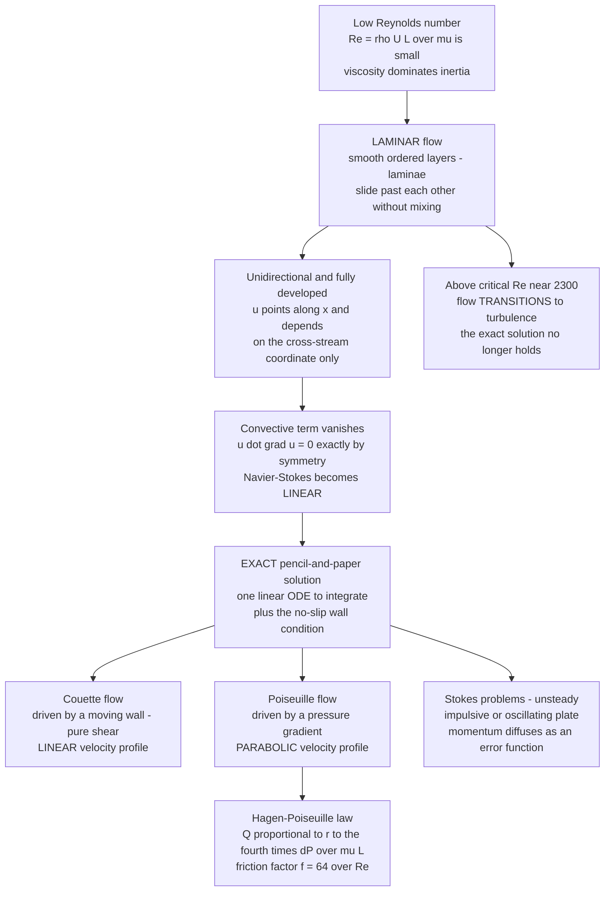

# 🌊 Laminar Flow and Exact Solutions

> [!abstract] TL;DR
> **Laminar flow** is smooth, orderly motion in parallel layers ("laminae") that slide past one another without mixing — the low-Reynolds-number regime, the calm opposite of turbulence. Its orderliness is a gift: in a handful of symmetric geometries the fluid is unidirectional and fully developed, so the ferociously nonlinear convective term $(\vec u\cdot\nabla)\vec u$ **vanishes exactly**, leaving a *linear* equation you can integrate by hand. These rare exact solutions — **Couette** flow (linear profile, driven by a moving wall), **Poiseuille** flow (parabolic profile, driven by a pressure gradient), and **Stokes' problems** (unsteady momentum diffusion) — are the benchmarks and intuition-builders of all fluid mechanics. Poiseuille flow yields the **Hagen-Poiseuille law**, $Q \propto \Delta P\, r^4/(\mu L)$ — the dramatic fourth-power dependence on radius — and the laminar friction factor $f = 64/Re$.

---

## Intuition

**Analogy:** Watch honey pour slowly from a jar. It moves in smooth, glassy sheets that glide past each other without ever churning or mixing — every layer keeps its lane. That is **laminar flow**: the calm, deterministic opposite of turbulent chaos. Tip the jar harder and eventually the smooth ribbon breaks into a splattering mess — that is transition to turbulence.

This orderliness is not just pretty; it is a rare gift to physicists. The [[The_Navier_Stokes_Equations|Navier-Stokes equations]] are almost never solvable with pencil and paper because of one vicious nonlinear term — the fluid advecting itself. But when the flow is laminar and *unidirectional* (every particle moving straight down its own lane), that term dies by symmetry, and the equation collapses to something a first-year student can integrate. The bullet-shaped **parabolic profile** of oil creeping through a pipe or blood through a capillary — fastest in the middle, pinned to zero at the walls — is one of the very few *exact* solutions in all of fluid dynamics.

---

## How It Works

### Core Mechanics

Laminar flow lives at **low Reynolds number**, $Re = \rho U L/\mu = UL/\nu$, where viscosity dominates inertia. Momentum diffuses across the flow faster than the fluid can pile it up into eddies, so neighbouring layers stay coherent. The magic that makes exact solutions possible is a three-step collapse:

1. **Unidirectional, fully-developed assumption.** Suppose the flow points only along $x$ and its profile no longer changes downstream: $\vec u = \big(u(y),\,0,\,0\big)$. Incompressibility $\nabla\cdot\vec u = 0$ is then automatic, because $\partial u/\partial x = 0$.
2. **The nonlinear term vanishes identically.** The convective acceleration is $(\vec u\cdot\nabla)\vec u = u\,\partial_x u = 0$, because $u$ has no $x$-dependence. This is the whole trick: the term that makes Navier-Stokes intractable is *exactly zero* by geometry, not merely small.
3. **A linear ODE remains.** What's left is a straight balance between the pressure gradient and viscous diffusion:
$$0 = -\frac{dp}{dx} + \mu\,\frac{d^2u}{dy^2}.$$
Integrate twice, apply the **no-slip** boundary condition (fluid velocity equals wall velocity), and you have an exact answer.

The **type of driving** picks the solution:

- **Couette flow** — no pressure gradient; the flow is dragged by a moving wall (pure shear). With $d^2u/dy^2 = 0$, the profile is **linear**: $u(y) = U\,y/H$. This is the model for lubrication films and rotational viscometers.
- **Poiseuille flow** — a stationary channel or pipe driven by a pressure gradient $G = -dp/dx$. Integrating $\mu\,u'' = -G$ with no-slip at both walls gives a **parabola**. In a pipe of radius $R$ (using the cylindrical Laplacian),
$$u(r) = \frac{G}{4\mu}\big(R^2 - r^2\big), \qquad u_{\max} = \frac{G R^2}{4\mu}.$$
- **Combined Couette-Poiseuille** — superpose the two (the equation is linear!): a moving wall *plus* a pressure gradient. An adverse gradient can even reverse the flow near the wall (backflow), a precursor to separation.

**Integrate the parabola over the pipe cross-section** and you get the crown jewel, the **Hagen-Poiseuille law**:
$$Q = \int_0^R u(r)\,2\pi r\,dr = \frac{\pi R^4\,\Delta P}{8\mu L}.$$
The **fourth-power** dependence on radius is the headline: halving a pipe's radius cuts the flow **sixteenfold** at the same pressure. This is why a small arterial narrowing is so dangerous, and why viscosity and radius — not pressure — dominate pressure drop in fine tubes.

Recast dimensionlessly, the same result is the **laminar friction factor**:
$$f = \frac{64}{Re}\quad(\text{laminar}),$$
the straight, steeply falling line on the left of the **Moody chart**. Turbulent flow (above $Re \approx 2300$ in pipes) obeys a *higher*, only weakly $Re$-dependent, roughness-sensitive law — a different world entirely.

Finally, the **unsteady** exact solutions — **Stokes' problems** — reveal viscosity as pure diffusion. Stokes' *first problem* (a plate impulsively yanked into motion) spreads momentum into the fluid as an error function, with penetration depth $\delta \sim \sqrt{\nu t}$. Stokes' *second problem* (an oscillating plate) creates the decaying **Stokes boundary layer** of thickness $\sim\sqrt{\nu/\omega}$. Both are clean pictures of momentum diffusing exactly like heat.

### Flow / Architecture



---

## Key Concepts

### Secondary Level

- **Laminar means orderly.** Fluid moves in smooth parallel sheets that never mix — think of slow honey or the calm core of a gently running tap. Turbulent means chaotic swirling. Laminar happens when the flow is slow, thick (viscous), or in a narrow channel.
- **The parabola.** In a pipe, the fluid is fastest in the middle and slows to a stop at the walls (it sticks — the "no-slip" rule). Plotting speed across the pipe traces a smooth bullet-shaped **parabola**.
- **The fourth-power rule.** Flow through a pipe grows with the *fourth power* of its radius. Double the radius and you get **sixteen times** the flow. This is why a slightly narrowed artery drastically cuts blood flow.
- **Why we love these cases.** The full equations of fluid motion are usually unsolvable by hand. In these tidy laminar situations they simplify enough to solve exactly — so they are the textbook examples everyone learns first.

### Undergraduate Level

- **Why the nonlinearity dies.** For $\vec u = (u(y),0,0)$, the convective term $(\vec u\cdot\nabla)\vec u = u\,\partial_x u$ is *identically zero* because $u$ has no streamwise dependence. Navier-Stokes reduces to the linear balance $\mu\,u'' = dp/dx$. This exact cancellation — not smallness — is what makes the problem solvable.
- **Couette vs Poiseuille.** No pressure gradient plus a moving wall gives a **linear** profile ($u'' = 0$); a pressure gradient in a fixed channel gives a **parabolic** one ($u'' = \text{const}$). Because the reduced equation is linear, you can **superpose** them (combined Couette-Poiseuille flow).
- **Hagen-Poiseuille.** Integrating the parabola: $Q = \pi R^4 \Delta P/(8\mu L)$. Equivalently the pressure drop is $\Delta P = 8\mu L Q/(\pi R^4)$ — the fluid analogue of Ohm's law with hydraulic resistance $\mathcal{R} = 8\mu L/(\pi R^4)$.
- **Friction factor.** The Darcy friction factor $f = 64/Re$ for laminar pipe flow. On the **Moody chart** this is the single straight line valid below $Re\approx 2300$; above it, roughness-dependent turbulent correlations (Blasius, Colebrook) take over.
- **Entrance length and fully-developed flow.** Real pipe flow is *not* parabolic at the inlet. Boundary layers grow from the walls over an **entrance length** $L_e \approx 0.06\,Re\,D$ (laminar) until they merge and the profile becomes fully developed. The exact solution applies only downstream of this region.
- **Stokes' problems.** Unsteady exact solutions: the impulsively started plate (first problem) has $u/U_0 = \operatorname{erfc}\!\big(y/2\sqrt{\nu t}\,\big)$, momentum penetrating a depth $\delta\sim\sqrt{\nu t}$; the oscillating plate (second problem) yields the damped, phase-shifted **Stokes layer**. Both show viscosity as a diffusion of momentum with diffusivity $\nu$.

### Graduate Level

- **The catalogue of exact solutions is tiny but structured.** Beyond Couette/Poiseuille/Stokes lie a few more: the **Taylor-Couette** base state (flow between rotating cylinders), **film flow** down an inclined plane (gravity-driven, semi-parabolic with a free surface), and — crucially — **similarity solutions** where a partial differential equation collapses to an ODE via a self-similar variable. **Hiemenz stagnation-point flow** and the **Blasius boundary layer** ($f''' + \tfrac12 f f'' = 0$) are the canonical examples, foreshadowing [[Viscous_Fluids_and_Navier_Stokes|boundary-layer theory]].
- **Why laminar exact solutions can still be unstable.** Being an exact steady solution does not make a flow *observable*. Plane Poiseuille flow is linearly unstable above $Re\approx 5772$ (Orr-Sommerfeld / Tollmien-Schlichting waves), yet pipe Poiseuille flow is linearly stable at *all* $Re$ and transitions only through finite-amplitude, non-normal transient growth near $Re\approx 2000$. The exact base flow is the starting point for stability analysis, not the end of the story.
- **Reversibility and the Stokes regime.** In the strict $Re\to 0$ limit the inertial term drops entirely, giving the *linear, time-reversible* Stokes equations — the domain of microswimmers and microfluidics. Laminar unidirectional flows are a special exactly-solvable slice of this broader low-Reynolds world; the general theory is developed in a dedicated **Low Reynolds Number Flow** sibling note.
- **Hydraulic-resistance networks.** Because $\Delta P = \mathcal{R}Q$ is linear, laminar micro-networks (and biological capillary beds) compose exactly like resistor circuits, with series/parallel rules — the foundation of much microfluidic circuit design.
- **Where it hands off.** These solutions are the *inner* and *base* states for everything that follows: the growing wall layers become the subject of a **Boundary Layer** sibling, and their instability is the subject of a **Transition to Turbulence** sibling. The stress model that closes the viscous term is developed in a **Viscosity and Stress in Fluids** sibling.

---

## Python Demo

```python
# Exact laminar solutions of the Navier-Stokes equations.
#   (a) POISEUILLE flow: the parabolic profile in a pipe, and the
#       HAGEN-POISEUILLE r^4 flow-rate law (Q propto R^4 * dP / (mu L)).
#   (b) FRICTION FACTOR: laminar f = 64/Re (the straight-line part of the
#       Moody chart) contrasted with the higher, weakly Re-dependent
#       turbulent friction (Blasius correlation).
#   (c) COMBINED Couette + Poiseuille flow (moving wall + pressure gradient),
#       including adverse-gradient backflow.
import numpy as np
import matplotlib.pyplot as plt

# ------------------------------------------------------------------
# (a) POISEUILLE FLOW IN A PIPE
#     Exact solution:  u(r) = (dP / (4 mu L)) * (R^2 - r^2)   -> parabola
#     Hagen-Poiseuille: Q    = pi R^4 dP / (8 mu L)           -> r^4 law
# ------------------------------------------------------------------
mu   = 1.0e-3        # dynamic viscosity of water [Pa.s]
L    = 1.0           # pipe length [m]
dP   = 100.0         # pressure drop across the pipe [Pa]
R0   = 5.0e-3        # reference pipe radius [m]

r    = np.linspace(-R0, R0, 300)
u    = (dP / (4.0 * mu * L)) * (R0**2 - r**2)          # parabolic profile
umax = dP * R0**2 / (4.0 * mu * L)

# flow rate vs radius (everything else fixed) -- the steep r^4 dependence
R    = np.linspace(0.2 * R0, 2.0 * R0, 200)
Q    = np.pi * R**4 * dP / (8.0 * mu * L)              # Hagen-Poiseuille
Q0   = np.pi * R0**4 * dP / (8.0 * mu * L)             # reference flow rate

# ------------------------------------------------------------------
# (b) FRICTION FACTOR vs REYNOLDS NUMBER  (Darcy f)
# ------------------------------------------------------------------
Re_lam  = np.linspace(100.0, 2300.0, 200)
f_lam   = 64.0 / Re_lam                                # laminar: exact
Re_turb = np.logspace(np.log10(4000.0), 5.0, 200)
f_turb  = 0.316 * Re_turb**-0.25                       # Blasius (smooth pipe)

# ------------------------------------------------------------------
# (c) COMBINED COUETTE + POISEUILLE between plates at y = -h .. +h,
#     top plate moving at U.  Nondimensional:  eta = y/h in [-1, 1],
#     u/U = (eta + 1)/2  +  P * (1 - eta^2),  P = G h^2 / (2 mu U).
#     P > 0 favorable, P < 0 adverse (can drive backflow near the wall).
# ------------------------------------------------------------------
eta = np.linspace(-1.0, 1.0, 200)
Ps  = [-1.0, -0.5, 0.0, 1.0, 3.0]

# ------------------------------------------------------------------
# Plot
# ------------------------------------------------------------------
fig, ax = plt.subplots(2, 2, figsize=(13, 10))

# (a1) parabolic velocity profile
ax[0, 0].plot(u * 1e3, r * 1e3, lw=2.5, color="#1f77b4")
ax[0, 0].axhline( R0 * 1e3, color="k", lw=3)
ax[0, 0].axhline(-R0 * 1e3, color="k", lw=3)
ax[0, 0].fill_betweenx(r * 1e3, 0, u * 1e3, alpha=0.15, color="#1f77b4")
ax[0, 0].set_xlabel("velocity u(r)  [mm/s]")
ax[0, 0].set_ylabel("radial position r  [mm]")
ax[0, 0].set_title("(a) Poiseuille flow: exact PARABOLIC profile\n"
                   "fastest at center, no-slip zero at the walls")
ax[0, 0].grid(alpha=0.3)

# (a2) Hagen-Poiseuille r^4 flow-rate law
ax[0, 1].plot(R / R0, Q / Q0, lw=2.5, color="#d62728")
ax[0, 1].plot(R / R0, (R / R0)**4, "k--", lw=1.5, label="pure r^4 scaling")
ax[0, 1].axvline(0.5, color="gray", ls=":", lw=1.2)
ax[0, 1].scatter([0.5], [0.5**4], zorder=5, color="k")
ax[0, 1].annotate("half radius -> 1/16 flow",
                  xy=(0.5, 0.5**4), xytext=(0.62, 1.5),
                  arrowprops=dict(arrowstyle="->"))
ax[0, 1].set_xlabel("radius  R / R0")
ax[0, 1].set_ylabel("flow rate  Q / Q0")
ax[0, 1].set_title("(a) Hagen-Poiseuille law: Q proportional to R^4\n"
                   "steeply nonlinear dependence on radius")
ax[0, 1].legend()
ax[0, 1].grid(alpha=0.3)

# (b) friction factor -- laminar 64/Re vs turbulent
ax[1, 0].loglog(Re_lam,  f_lam,  lw=2.5, color="#1f77b4", label="laminar  f = 64/Re")
ax[1, 0].loglog(Re_turb, f_turb, lw=2.5, color="#ff7f0e",
                label="turbulent  f = 0.316 Re^-0.25 (Blasius)")
ax[1, 0].axvspan(2300, 4000, color="gray", alpha=0.2, label="transition")
ax[1, 0].set_xlabel("Reynolds number  Re")
ax[1, 0].set_ylabel("Darcy friction factor  f")
ax[1, 0].set_title("(b) Friction factor: the laminar part of the Moody chart\n"
                   "laminar falls as 1/Re; turbulent is higher and flatter")
ax[1, 0].legend(fontsize=8)
ax[1, 0].grid(alpha=0.3, which="both")

# (c) combined Couette + Poiseuille profiles
for P in Ps:
    uc = (eta + 1.0) / 2.0 + P * (1.0 - eta**2)
    ax[1, 1].plot(uc, eta, lw=2, label=f"P = {P:+.1f}")
ax[1, 1].axvline(0.0, color="k", lw=1)
ax[1, 1].axhline( 1.0, color="k", lw=2)
ax[1, 1].axhline(-1.0, color="k", lw=2)
ax[1, 1].set_xlabel("velocity  u / U")
ax[1, 1].set_ylabel("position  y / h")
ax[1, 1].set_title("(c) Combined Couette + Poiseuille\n"
                   "moving wall + pressure gradient; P<0 gives backflow")
ax[1, 1].legend(fontsize=8)
ax[1, 1].grid(alpha=0.3)

plt.tight_layout()
plt.savefig("laminar_exact_solutions.png", dpi=130)
plt.show()

# ------------------------------------------------------------------
# Numerical takeaways
# ------------------------------------------------------------------
print(f"Poiseuille centerline speed u_max = {umax*1e3:.2f} mm/s")
print(f"Mean speed u_mean = u_max/2      = {umax*1e3/2:.2f} mm/s (parabola)")
print(f"Flow rate at R0   Q0             = {Q0*1e6:.3f} mL/s")
print(f"Halving the radius scales Q by   = {(0.5)**4:.4f}  (= 1/16)")
print(f"Laminar f at Re=2000            = {64/2000:.4f}")
print(f"Turbulent f at Re=4000 (Blasius) = {0.316*4000**-0.25:.4f}  (higher)")
```

Panel (a) shows Navier-Stokes handing back a clean parabola and the brutal $r^4$ flow law. Panel (b) is the laminar $f = 64/Re$ line of the Moody chart — falling steeply as $1/Re$ — set against the higher, nearly flat turbulent branch. Panel (c) demonstrates the linearity of the reduced equation: Couette (linear) and Poiseuille (parabolic) simply add, and a strong *adverse* pressure gradient ($P<0$) pushes the near-wall fluid backwards.

---

## Real-World Applications

- **Blood flow in small vessels.** Flow in arterioles and capillaries is laminar and closely Poiseuille. The $r^4$ law means a modest atherosclerotic narrowing slashes perfusion dramatically, and it explains why the body regulates flow mainly by adjusting vessel *radius*. In larger arteries at higher $Re$ (and pulsatile flow) Poiseuille breaks down — the biological caveats are developed in [[Fluid_Dynamics_in_Biology]].
- **Microfluidics and lab-on-a-chip.** At micron scales $Re$ is tiny, so flow is laminar *by design*. Streams flowing side by side mix only by diffusion, enabling laminar diffusion sensors, hydrodynamic focusing, and precise dosing. Devices are laid out as hydraulic-resistance networks using $\Delta P = 8\mu L Q/(\pi R^4)$.
- **Lubrication.** Thin oil films in journal bearings and between gear teeth are Couette-like shear flows (with pressure-driven corrections captured by the Reynolds lubrication equation). The linear velocity profile sets the shear stress, load capacity, and frictional loss.
- **Viscometry.** Capillary viscometers time a fixed volume draining through a fine tube and invert Hagen-Poiseuille to get $\mu$; rotational (Couette) viscometers measure the torque needed to shear fluid between cylinders. Both rely on the exact laminar profile being valid.
- **Pipe and duct engineering.** For laminar service ($Re < 2300$), pressure-drop sizing uses $f = 64/Re$ directly. Recognizing the laminar-turbulent transition tells engineers when the simple exact law must give way to the Moody-chart turbulent correlations.

---

## Common Pitfalls

- **Using Poiseuille past its range.** The parabolic profile and $f = 64/Re$ hold only for *fully-developed laminar* flow. In the **entrance region** the profile is still developing, and above $Re\approx 2300$ the flow is turbulent — applying $64/Re$ there badly underpredicts the pressure drop.
- **Forgetting the entrance length.** Assuming the flow is parabolic right at the inlet ignores $L_e\approx 0.06\,Re\,D$ of developing flow. In short tubes or at higher $Re$ the entrance region can dominate.
- **Confusing "exact" with "stable/observable."** Plane Poiseuille flow is an exact solution yet becomes unstable at high $Re$; pipe flow is linearly stable at all $Re$ yet transitions anyway via finite-amplitude disturbances. An exact base state is not a guarantee you will see it in the lab.
- **Misreading the $r^4$ law.** Because $Q\propto r^4$, tiny errors in measuring a capillary's radius blow up fourfold in the inferred flow or viscosity — a classic experimental trap in viscometry.
- **Applying the linear friction factor logic to turbulence.** Laminar $f=64/Re$ is independent of wall roughness; turbulent friction is *higher* and roughness-dependent. Extrapolating the laminar line into the turbulent regime is a common and costly error.
- **Assuming laminar means slow everywhere.** Whether flow is laminar depends on $Re = UL/\nu$, not speed alone: fast flow of a very viscous fluid, or any flow in a sufficiently small channel, can still be perfectly laminar.

---

## Related Concepts

- [[The_Navier_Stokes_Equations]] — the full nonlinear equations; laminar exact solutions are the rare cases where the convective term vanishes and they become solvable by hand.
- [[Viscous_Fluids_and_Navier_Stokes]] — the physics deep-dive on Stokes flow, Hagen-Poiseuille, boundary layers, and Reynolds-number scaling that this note complements.
- [[Dimensional_Analysis_and_Similarity]] — where the Reynolds number comes from and why $Re$ organizes the laminar-turbulent divide.
- [[Euler_Equations_and_Inviscid_Flow]] — the opposite limit ($\mu\to 0$): drop viscosity entirely, losing no-slip and the parabolic profile.
- [[Vorticity_and_Circulation]] — Poiseuille flow carries shear vorticity even though it is steady and orderly; a useful contrast to irrotational ideal flow.
- [[The_Continuum_Hypothesis_and_Fluid_Properties]] — the origin of viscosity as a fluid property, the coefficient $\mu$ that sets the friction in every solution here.
- [[Conservation_Laws_and_Control_Volumes]] — integrating the momentum balance over a pipe control volume is one route to the Hagen-Poiseuille pressure-drop law.
- [[Fluid_Dynamics_in_Biology]] — Poiseuille flow in blood vessels, the $r^4$ law in physiology, and where it breaks down in disease.
- [[Diffusion_and_Brownian_Motion_in_Cells]] — Stokes' problems show viscosity as *momentum* diffusion, the mechanical twin of the mass diffusion treated here.
- [[Second_Order_Linear_ODEs]] — the linear ODE $\mu\,u'' = dp/dx$ that every exact laminar profile reduces to.
- [[Introduction_to_PDEs]] — Navier-Stokes as a PDE system; laminar symmetry is what collapses it to a solvable ODE.
- [[Turbulence_and_Instabilities]] — what happens beyond the critical Reynolds number, when the exact laminar solution loses stability.

> [!note] Siblings still to be written
> This note sits in the viscous-flow section. Its companion siblings — not yet in the vault — will expand the surrounding physics: a **Viscosity and Stress in Fluids** note deriving the viscous stress tensor behind $\mu\nabla^2\vec u$; a **The Boundary Layer** note on how the growing wall layers here become Prandtl's boundary-layer theory; a **Low Reynolds Number Flow** note on the reversible Stokes regime of microswimmers and microfluidics; and a **Transition to Turbulence** note on how the exact laminar states destabilize past their critical Reynolds numbers.

---

## Review Questions

1. **Secondary:** In a garden hose running gently, why is the water fastest in the middle and slowest at the walls? If you could double the hose's radius while keeping the same pressure, roughly how many times more water would flow, and why is that number so large?
2. **Undergraduate:** Starting from $\rho\,D\vec u/Dt = -\nabla p + \mu\nabla^2\vec u$, show precisely why steady, fully-developed pipe flow has an *exact* parabolic solution — which term vanishes and why? Then integrate the parabola to derive the Hagen-Poiseuille law and identify the hydraulic resistance $\mathcal{R}$.
3. **Graduate:** Plane Poiseuille flow and pipe Poiseuille flow are both exact steady solutions, yet the former is linearly unstable above $Re\approx 5772$ while the latter is linearly stable at all $Re$ but still transitions near $Re\approx 2000$. Explain how an exact solution can nonetheless be unobservable, and contrast the roles of modal (Tollmien-Schlichting) versus non-normal transient-growth mechanisms in the two geometries.

---

## Sources

- White, F. M. — *Viscous Fluid Flow*, 3rd ed., McGraw-Hill (Ch. 3, exact solutions of the Navier-Stokes equations).
- Batchelor, G. K. — *An Introduction to Fluid Dynamics*, Cambridge University Press (§4.2, unidirectional flows; §4.3, Stokes' problems).
- Kundu, Cohen & Dowling — *Fluid Mechanics*, 6th ed., Academic Press (Ch. 9, laminar flow; Poiseuille, Couette, and entrance length).
- Sutera, S. P. & Skalak, R. — ["The History of Poiseuille's Law"](https://doi.org/10.1146/annurev.fl.25.010193.000245), *Annual Review of Fluid Mechanics*, 25, 1–20 (1993).
- Drazin, P. G. & Riley, N. — *The Navier-Stokes Equations: A Classification of Flows and Exact Solutions*, Cambridge University Press (2006).

---

#fluid-dynamics #laminar-flow #poiseuille #exact-solutions #friction-factor
