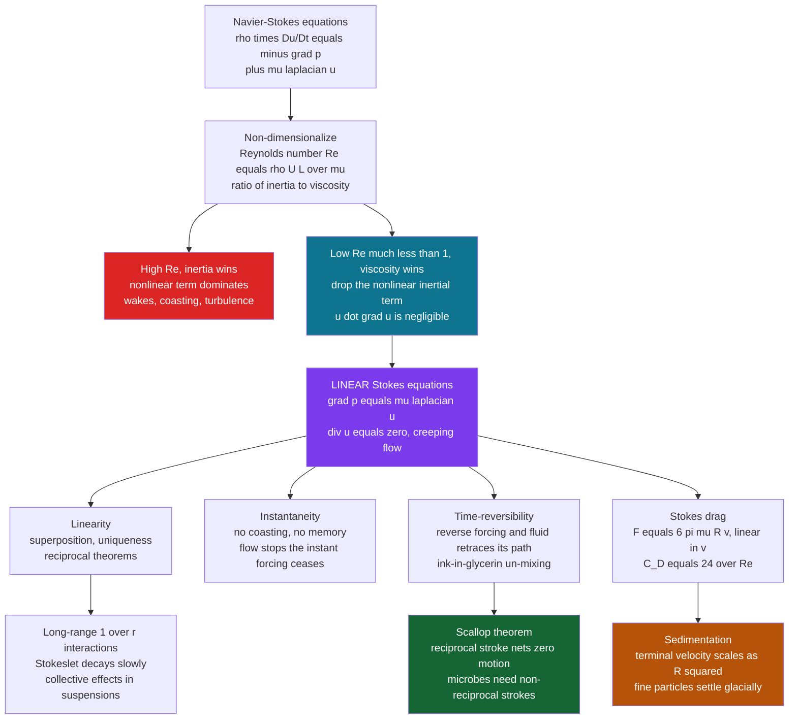

# 🦠 Low Reynolds Number Flow

> [!abstract] TL;DR
> When the Reynolds number $\mathrm{Re}=\rho U L/\mu \ll 1$, viscosity utterly dominates inertia and the nonlinear term $(\vec{u}\cdot\nabla)\vec{u}$ of the Navier-Stokes equations becomes negligible. What survives is the **linear Stokes equations** $\nabla p = \mu\nabla^2\vec{u},\ \nabla\cdot\vec{u}=0$ — the world of microbes, cells, colloids, dust, and lubricating films. This "creeping flow" is **instantaneous** (no coasting: a bacterium halts in about an atom's width when it stops swimming), **time-reversible** (reverse the forcing and the fluid retraces its path — the ink-in-glycerin un-mixing demo), and subject to the **scallop theorem** (any reciprocal stroke nets zero displacement, forcing microorganisms to evolve rotating helical flagella and beating cilia). **Stokes drag** $F=6\pi\mu R v$ is linear in velocity, so fine particles settle as $R^2$ (aerosols and silt stay aloft for ages) and the drag coefficient is exactly $C_D=24/\mathrm{Re}$. Long-range $1/r$ hydrodynamic interactions and lubrication theory make this regime the backbone of biology, colloid science, microfluidics, and bearing design.

---

## Intuition

**Analogy:** Shrink yourself to the size of a bacterium and water becomes as thick as tar. In this world **inertia is meaningless**: stop swimming and you halt within an atom's width, unable to coast even a little. Time is almost reversible — wave your arm forward then back and you return exactly where you started, going nowhere. A scallop that opens slowly and snaps shut quickly is a giant that lunges forward on inertia; the *same* scallop shrunk to microscopic size just rocks in place forever, because at this scale opening-then-closing is a perfectly reversible round trip that undoes itself. This is life at **low Reynolds number**: the strange, syrupy regime of microbes, cells, dust, and lubricating films, where viscosity utterly dominates and our everyday fluid intuitions fail completely.

The number that sets this world apart is the same **Reynolds number** $\mathrm{Re}=\rho U L/\mu$ that organizes all of fluid mechanics (see [[Dimensional_Analysis_and_Similarity]]). It measures inertia against viscosity. Everyday flows — a swimmer, a thrown ball, a river — have $\mathrm{Re}$ in the thousands or millions, so inertia wins and fluids splash, coast, and go turbulent. Drop $\mathrm{Re}$ below one and the physics inverts completely: everything that made high-$\mathrm{Re}$ flow interesting disappears, replaced by a linear, reversible, memoryless world.

---

## How It Works

### Core Mechanics

1. **The regime: $\mathrm{Re}\ll 1$.** Non-dimensionalizing the incompressible Navier-Stokes equations leaves a single control parameter, $\mathrm{Re}=\rho U L/\mu$, multiplying the inertial (convective) term. When $\mathrm{Re}\to 0$ — because the length $L$ is tiny (a $1\,\mu\text{m}$ microbe), the speed $U$ is slow, or the viscosity $\mu$ is huge (glycerin, honey) — the inertial term is negligible everywhere. This is the world of microorganisms, cells, colloids, dust, aerosols, and thin lubricating films.

2. **The Stokes equations.** Dropping the nonlinear $(\vec{u}\cdot\nabla)\vec{u}$ term (and, for steady creeping flow, the unsteady term) collapses Navier-Stokes to the **linear** system

   $$\nabla p = \mu\nabla^2\vec{u},\qquad \nabla\cdot\vec{u}=0.$$

   Losing the nonlinearity is an enormous simplification: the equations become **linear**, so solutions can be **superposed**, uniqueness is guaranteed, and powerful **reciprocal theorems** (Lorentz reciprocity) apply. Fluid mechanics at low $\mathrm{Re}$ is almost a branch of linear PDE theory — the antithesis of the intractable, turbulent high-$\mathrm{Re}$ world discussed in [[The_Navier_Stokes_Equations]].

3. **Instantaneity — no coasting, no memory.** With inertia gone there is no $\partial_t\vec{u}$ momentum to carry the flow forward. The velocity field responds **instantly** to the applied forces and **stops instantly** when the forcing ceases. A bacterium that switches off its flagellum coasts a distance of order $\sim 0.1\ \text{nm}$ — about an atomic diameter — before stopping. The flow is **quasi-static**: at every instant it is the solution to a steady boundary-value problem set by the current boundary positions. There is no momentum "memory" of what happened a moment ago.

4. **Time-reversibility.** Because the Stokes equations are linear and have no inertial time derivative, reversing the sign of the boundary forcing reverses the entire velocity field: run the boundaries backward and **every fluid particle exactly retraces its path**. The famous demonstration is a blob of dye sheared into apparent oblivion in viscous glycerin between concentric cylinders — then, on rotating the cylinder backward the same number of turns, the dye **un-mixes** and the blob reappears. (Molecular diffusion sets the only limit on how perfectly it reassembles.)

5. **The scallop theorem.** Purcell's theorem is the startling corollary for locomotion: a **reciprocal** swimming stroke — one whose shape sequence looks identical played forward and backward, like a scallop opening and snapping shut — produces **zero net displacement** at low $\mathrm{Re}$, no matter how fast or slow each phase is. To move, a microswimmer must break time-symmetry with a **non-reciprocal** stroke that traces a loop in configuration space. Evolution's solutions: bacteria spin rigid **helical flagella** with rotary motors, sperm propagate **bending waves** down a flagellum, and ciliated surfaces beat with asymmetric power-and-recovery strokes coordinated into travelling **metachronal waves**. This is why microorganisms swim the way they do — developed in depth for cells in [[Fluid_Dynamics_in_Biology]].

6. **Stokes drag.** Solving the Stokes equations for uniform flow past a rigid sphere of radius $R$ gives the exact drag

   $$F = 6\pi\mu R v,$$

   **linear** in velocity $v$ — utterly unlike the $\sim\!v^2$ inertial drag of everyday life. Written as a drag coefficient, $C_D = F/(\tfrac12\rho v^2 A) = 24/\mathrm{Re}$, the source of the famous $24/\mathrm{Re}$ line at the left of the universal $C_D$-vs-$\mathrm{Re}$ curve.

7. **Sedimentation as $R^2$.** Balancing Stokes drag against net gravity (weight minus buoyancy) for a settling sphere gives the **terminal velocity**

   $$v_t = \frac{2}{9}\,\frac{(\rho_p-\rho_f)\,g\,R^2}{\mu}\ \propto\ R^2.$$

   Halving the radius quarters the settling speed. This **Stokes' law of sedimentation** is why fine particles settle glacially: aerosols and dust stay aloft for hours, silt stays suspended in rivers, and separating fine colloids requires the artificial "gravity" of a centrifuge.

8. **Fore-aft symmetry, no wake.** Stokes flow past a sphere is **fore-aft symmetric**: streamlines that converge ahead of the sphere diverge identically behind it, with **no separation and no wake**. Reversibility forbids the asymmetry that inertial flows use to generate lift or a trailing vortex street — a symmetric body in steady creeping flow feels drag but no lift, and cannot propel itself by any symmetric motion.

9. **Long-range $1/r$ interactions.** The disturbance a moving particle creates in Stokes flow decays slowly, as $\sim 1/r$ (the Stokeslet), far slower than the $1/r^3$ dipole of inviscid potential flow. So particles and microswimmers feel each other **hydrodynamically over long ranges**, producing collective effects in concentrated suspensions and coordinated dynamics in microbial swarms.

10. **Lubrication theory.** A key application is thin viscous films. **Reynolds' lubrication equation** shows that a converging thin film generates enormous pressure and can support huge loads on a vanishingly thin layer of fluid — the physics of journal bearings, the synovial film in joints, the tear film on the eye, and why a wet floor is slippery. Low-$\mathrm{Re}$ thin-film flow turns viscosity from a nuisance into a load-bearing asset.

The other faces of this regime — how viscous stress is defined microscopically (*Viscosity_and_Stress_in_Fluids*), the exact laminar solutions like Poiseuille and Couette flow (*Laminar_Flow_and_Exact_Solutions*), the shear-thinning suspensions that low-$\mathrm{Re}$ colloids become (*Non_Newtonian_and_Complex_Fluids*), and the engineered lab-on-a-chip devices that live here (*Microfluidics_and_Biological_Flows*) — are treated in their own sibling notes.

### Flow / Architecture



---

## Key Concepts

### Secondary (intuitive)
- **Small means syrupy.** For anything tiny — a microbe, a speck of dust, a fat globule in milk — water behaves like honey. Viscosity, not inertia, rules.
- **No coasting.** Stop pushing and the motion stops instantly. There is no gliding, drifting, or splashing at this scale — the fluid has no momentum to spare.
- **Reversible time.** Because there is no inertia, running the motion backward exactly undoes it. Mix a dye into thick glycerin, then unwind the stirring, and the dye reassembles.
- **The scallop's problem.** A swimmer that just opens and closes (a reciprocal motion) gets nowhere at this scale. Microbes must corkscrew or ripple — motions that look different forward and backward — to move at all.
- **Fine dust hangs in the air.** Halve a particle's size and it settles four times slower. That is why dust, smoke, and fog linger for hours.

### Undergraduate (quantitative)
- **The linearization.** In dimensionless form the momentum equation is $\mathrm{Re}\,(\partial_t\hat{\vec u}+\hat{\vec u}\cdot\hat\nabla\hat{\vec u}) = -\hat\nabla\hat p + \hat\nabla^2\hat{\vec u}$. Setting $\mathrm{Re}\to 0$ deletes the entire left side, leaving the **Stokes equations** $\nabla p=\mu\nabla^2\vec{u},\ \nabla\cdot\vec{u}=0$ — linear, elliptic, and instantaneous.
- **Stokes drag and its coefficient.** For a sphere, $F=6\pi\mu R v$; hence $C_D=\dfrac{F}{\tfrac12\rho v^2 (\pi R^2)}=\dfrac{24}{\mathrm{Re}}$ with $\mathrm{Re}=\rho v (2R)/\mu$. This is the low-$\mathrm{Re}$ asymptote of the universal drag curve in [[Dimensional_Analysis_and_Similarity]].
- **Terminal velocity.** Force balance $6\pi\mu R v_t = \tfrac43\pi R^3(\rho_p-\rho_f)g$ gives $v_t=\dfrac{2(\rho_p-\rho_f)gR^2}{9\mu}$ — the $R^2$ sedimentation law. Valid only while the resulting $\mathrm{Re}$ stays $\lesssim 1$; larger particles enter the inertial regime and Stokes' law over-predicts their speed.
- **Stokes stream function past a sphere.** $\psi = U\sin^2\theta\left(\dfrac{r^2}{2}-\dfrac{3Rr}{4}+\dfrac{R^3}{4r}\right)$ satisfies no-slip on the sphere and uniform flow at infinity; its streamlines are exactly fore-aft symmetric, and the disturbance velocity $\propto 1/r$.
- **Reversibility as a constraint.** Because Stokes flow is linear and instantaneous, a body undergoing a reciprocal deformation cannot translate — the same equations run backward give the mirror-image displacement, which must cancel. This is the mathematical content of the **scallop theorem**.

### Graduate (advanced)
- **The biharmonic structure.** Taking the curl of the Stokes momentum equation kills pressure; for axisymmetric flow the stream function obeys $E^4\psi=0$ (a **biharmonic**-type equation). Stokes-flow problems reduce to solving linear biharmonic boundary-value problems, solvable by separation of variables, singularity methods, or the boundary-integral (boundary-element) method.
- **Fundamental singularities.** The Green's function of the Stokes operator is the **Stokeslet** (point force, velocity $\sim 1/r$), whose derivatives give the **stresslet**, **rotlet**, and source **doublet**. Any Stokes flow can be built by distributing these singularities on surfaces — the basis of slender-body theory for flagella and of boundary-integral solvers.
- **Stokes paradox and Oseen's fix.** In 2D there is *no* solution to steady Stokes flow past a cylinder that matches a uniform far field (the **Stokes paradox**), and even in 3D the Stokes solution fails at large $r$ where the neglected inertial term $\rho\,\vec{u}\cdot\nabla\vec{u}$ eventually catches up. **Oseen** linearized that term about the free-stream velocity to repair the far field, giving the next correction $C_D=\dfrac{24}{\mathrm{Re}}\left(1+\dfrac{3}{16}\mathrm{Re}+\cdots\right)$ — the beginning of a **matched-asymptotic** (singular perturbation) expansion in $\mathrm{Re}$.
- **Reciprocal theorem and swimming.** The **Lorentz reciprocal theorem** relates two Stokes flows around the same geometry and is the workhorse for computing swimming speeds, mobilities, and forces without solving the full flow. It formalizes the scallop theorem and yields results like the efficiency bounds on microswimmers.
- **Mobility and hydrodynamic interactions.** Because the equations are linear, forces and velocities on a set of particles are related by a **grand mobility matrix** whose off-diagonal blocks decay as $1/r$ (Rotne-Prager-Yamakawa tensor). This slow decay makes suspensions and microbial collectives strongly coupled and underlies Brownian dynamics simulations that pair with [[Diffusion_and_Brownian_Motion_in_Cells]].
- **Lubrication as an asymptotics.** Reynolds' lubrication equation is the leading order of an expansion in the thin-film aspect ratio; the load capacity scales as $1/h^2$ in the gap $h$, and the pressure is generated purely by geometric convergence of the film — a low-$\mathrm{Re}$, thin-film limit distinct from the sphere problem.

---

## Python Demo

```python
# Stokes / creeping-flow physics, three illustrations:
#   (a) STOKES DRAG & SEDIMENTATION -- terminal velocity of a small sphere
#       from the balance of net gravity against F = 6 pi mu R v; plot v_t vs R
#       (the R^2 law) and the drag coefficient C_D = 24/Re at low Re.
#   (b) TIME-REVERSIBILITY / fore-aft symmetry -- streamlines of Stokes flow
#       past a sphere, symmetric front-to-back (no wake), from the exact
#       Stokes stream function.
#   (c) LONG-RANGE 1/r decay -- the Stokes disturbance velocity decays as 1/r,
#       far slower than the 1/r^3 potential-flow dipole.
import numpy as np
import matplotlib.pyplot as plt

# ---------------------------------------------------------------------------
# (a) STOKES DRAG, TERMINAL VELOCITY, and the 24/Re drag coefficient
# ---------------------------------------------------------------------------
mu     = 1.0e-3          # water dynamic viscosity [Pa.s]
rho_f  = 1000.0          # water density [kg/m^3]
rho_p  = 2650.0          # quartz/silica particle density [kg/m^3] (sand)
g      = 9.81

R = np.logspace(-7, -3.5, 200)                       # radius 0.1 um -> ~0.3 mm
v_t = 2.0 * (rho_p - rho_f) * g * R**2 / (9.0 * mu)   # Stokes terminal velocity
Re_t = rho_f * v_t * (2.0 * R) / mu                   # particle Reynolds number
valid = Re_t < 1.0                                    # Stokes' law region

# settling time to fall 1 metre of still water -- shows how glacial fine dust is
t_fall = 1.0 / v_t
for Rq in [1e-7, 1e-6, 1e-5, 1e-4]:
    vq = 2.0 * (rho_p - rho_f) * g * Rq**2 / (9.0 * mu)
    print(f"R = {Rq*1e6:7.2f} um -> v_t = {vq*1e6:10.3e} um/s, "
          f"time to fall 1 m = {1.0/vq/3600:9.2f} h")

Re = np.logspace(-3, 1, 200)
CD_stokes = 24.0 / Re                                 # low-Re drag coefficient

# ---------------------------------------------------------------------------
# (b) STOKES FLOW PAST A SPHERE -- exact stream function, fore-aft symmetric
#     psi = U sin^2(theta) [ r^2/2 - 3 a r/4 + a^3/(4 r) ],  no-slip at r = a
# ---------------------------------------------------------------------------
U, a = 1.0, 1.0
xx = np.linspace(-4, 4, 400)
yy = np.linspace(-3, 3, 320)
X, Y = np.meshgrid(xx, yy)
r = np.sqrt(X**2 + Y**2)
sin2 = np.where(r > 0, (Y / r)**2, 0.0)               # sin^2(theta), flow along x
psi = U * sin2 * (r**2 / 2.0 - 3.0 * a * r / 4.0 + a**3 / (4.0 * r))
psi = np.ma.masked_where(r < a, psi)                 # blank the solid sphere

# ---------------------------------------------------------------------------
# (c) LONG-RANGE DECAY -- disturbance speed along the equator (theta = 90 deg)
#     Stokes:   |u_x - U| = U ( 3a/(4r) + a^3/(4 r^3) )  ->  ~ 1/r  (Stokeslet)
#     Potential dipole for comparison decays as (a/r)^3
# ---------------------------------------------------------------------------
rr = np.logspace(0, 2, 200)                           # r/a from 1 to 100
stokes_dist = 0.75 * (a / rr) + 0.25 * (a / rr)**3    # exact Stokes disturbance
potential   = (a / rr)**3                             # inviscid dipole, for contrast

# ---------------------------------------------------------------------------
# Plots
# ---------------------------------------------------------------------------
fig, ax = plt.subplots(2, 2, figsize=(14, 11))

# (a-left) terminal velocity vs radius: the R^2 sedimentation law
ax[0, 0].loglog(R * 1e6, v_t * 1e6, color="#0e7490", lw=2.5,
                label="Stokes terminal velocity")
ax[0, 0].loglog(R[~valid] * 1e6, v_t[~valid] * 1e6, color="#dc2626", lw=2.5,
                label="Re > 1 : Stokes' law breaks down")
ax[0, 0].set_xlabel("particle radius  R  [micrometre]")
ax[0, 0].set_ylabel("terminal velocity  v_t  [micrometre/s]")
ax[0, 0].set_title("(a) Sedimentation: v_t proportional to R^2\n"
                   "fine particles settle glacially")
ax[0, 0].legend(fontsize=8); ax[0, 0].grid(alpha=0.3, which="both")

# (a-right) drag coefficient C_D = 24/Re in the creeping-flow regime
ax[0, 1].loglog(Re, CD_stokes, color="#7c3aed", lw=2.5, label="C_D = 24 / Re")
ax[0, 1].set_xlabel("Reynolds number  Re")
ax[0, 1].set_ylabel("drag coefficient  C_D")
ax[0, 1].set_title("(a) Low-Re drag law: C_D = 24/Re\n"
                   "linear drag F = 6 pi mu R v")
ax[0, 1].legend(fontsize=9); ax[0, 1].grid(alpha=0.3, which="both")

# (b) fore-aft symmetric streamlines of Stokes flow past a sphere
levels = np.linspace(-3, 3, 41)
ax[1, 0].contour(X, Y, psi, levels=levels, colors="#0e7490", linewidths=0.9)
ax[1, 0].add_patch(plt.Circle((0, 0), a, color="#333333", zorder=5))
ax[1, 0].set_aspect("equal")
ax[1, 0].set_xlabel("x  (flow direction) / a")
ax[1, 0].set_ylabel("y / a")
ax[1, 0].set_title("(b) Stokes flow past a sphere\n"
                   "fore-aft SYMMETRIC, no wake (reversible)")

# (c) long-range 1/r decay of the Stokes disturbance vs 1/r^3 potential flow
ax[1, 1].loglog(rr, stokes_dist, color="#166534", lw=2.5,
                label="Stokes disturbance ~ 1/r  (Stokeslet)")
ax[1, 1].loglog(rr, potential, color="#b45309", lw=2.5, ls="--",
                label="potential-flow dipole ~ 1/r^3")
ax[1, 1].loglog(rr, 0.75 * a / rr, color="k", lw=1, ls=":",
                label="slope -1 guide")
ax[1, 1].set_xlabel("distance from sphere  r / a")
ax[1, 1].set_ylabel("disturbance speed / U")
ax[1, 1].set_title("(c) Long-range hydrodynamics\n"
                   "Stokes decays as 1/r -- far slower than inviscid 1/r^3")
ax[1, 1].legend(fontsize=8); ax[1, 1].grid(alpha=0.3, which="both")

plt.tight_layout()
plt.show()
```

**What you should see.** Panel (a-left) is the physics of dust and silt: terminal velocity falls off as $R^2$, and the printout shows a $0.1\,\mu\text{m}$ particle taking *thousands of hours* to fall a single metre — this is why aerosols hang in the air and why separating fine colloids needs a centrifuge. The red segment flags where the settling $\mathrm{Re}$ exceeds one and Stokes' law stops applying. Panel (a-right) is the $C_D=24/\mathrm{Re}$ line — linear drag rendered as the steep left edge of the universal drag curve. Panel (b) draws the streamlines of creeping flow past a sphere: they are perfectly **fore-aft symmetric**, converging ahead and diverging identically behind, with **no wake** — the geometric signature of time-reversibility. Panel (c) contrasts the slow $1/r$ decay of the Stokes disturbance (the reason microswimmers and colloids interact over long ranges) with the rapid $1/r^3$ decay of inviscid potential flow.

---

## Real-World Applications

> **Example — the microfluidic lab-on-a-chip.** A microfluidic channel is tens of micrometres wide with flow speeds of millimetres per second, giving $\mathrm{Re}\sim 10^{-3}$: pure Stokes flow. This has a decisive design consequence — **there is no turbulence to mix fluids.** Two streams merged in a channel flow side by side as smooth parallel laminae and blend *only by molecular diffusion across the interface*, which is slow. Engineers therefore exploit the regime deliberately: they either wait for diffusion (useful for gradient generators and reagent exchange), fold channels into serpentine or herringbone patterns to stretch interfaces, or use droplet compartments — all a direct consequence of living at low $\mathrm{Re}$.

- **Cell and microorganism motility.** Bacteria rotate helical flagella, sperm beat bending waves, and ciliated tissues (airways, oviduct, *Paramecium*) pump with metachronal waves — all non-reciprocal strokes evolved to defeat the scallop theorem. See [[Fluid_Dynamics_in_Biology]] and [[Cell_Motility_and_Adhesion]].
- **Sedimentation and centrifugation.** Stokes' law underlies analytical ultracentrifugation, blood separation, water-treatment settling tanks, and geological sorting of silt — anywhere particles are separated by size or density through a viscous fluid.
- **Aerosols, dust, and air quality.** The $R^2$ settling law explains why PM2.5 particulates linger in the atmosphere and lungs for hours while coarse dust drops out quickly — central to pollution modelling and inhalation toxicology.
- **Colloids and suspension rheology.** Paints, inks, milk, blood, and cement slurries are colloidal suspensions whose low-$\mathrm{Re}$ hydrodynamic interactions set their viscosity and stability. See [[Nanoparticles_and_Colloidal_Systems]] and [[Liquid_Crystals_and_Colloids]].
- **Lubrication in machines and joints.** Journal and thrust bearings, gear meshes, and the synovial fluid in your knees all rely on Reynolds' lubrication theory: a converging viscous film carrying an enormous load on a micrometre-thin layer.
- **Particle filtration and the flow of cytoplasm.** Depth filters, HEPA media, and the streaming of organelle-laden cytoplasm inside cells are all low-$\mathrm{Re}$ flows around and through fine structures.

---

## Common Pitfalls

- **Applying Stokes' law outside its range.** $F=6\pi\mu R v$ and $v_t\propto R^2$ hold only while the particle $\mathrm{Re}\lesssim 1$. For larger or faster particles inertia matters, the drag becomes nonlinear, and Stokes' law badly over-predicts settling speed — use the full $C_D(\mathrm{Re})$ curve instead.
- **Expecting turbulent mixing in microfluidics.** At $\mathrm{Re}\sim 10^{-3}$ there is *no* turbulence; streams do not mix by stirring, only by slow diffusion. Designers who assume otherwise get devices that never blend their reagents.
- **Forgetting reversibility forbids reciprocal swimming.** A micro-robot or model swimmer with a single reciprocating paddle goes nowhere on average. Net motion requires a non-reciprocal cycle — a common trap when scaling down macroscopic propulsion ideas.
- **Ignoring long-range hydrodynamic coupling.** Because Stokes disturbances decay only as $1/r$, particles in a suspension are *not* independent — dilute-limit formulas fail sooner than intuition suggests, and settling clusters interact strongly.
- **The Stokes paradox / far-field breakdown.** Steady Stokes flow past a 2D cylinder has no valid far-field solution, and even in 3D the neglected inertial term eventually dominates at large $r$. Quantitative work needs the **Oseen** correction or matched asymptotics, not bare Stokes flow, in the far field.
- **Confusing "linear drag" with "no drag."** Fore-aft symmetry and reversibility mean no *lift* and no wake, but the drag is very real and, per unit mass, viciously large — which is exactly why microbes must expend continuous power just to hold position.

---

## Related Concepts

- [[The_Navier_Stokes_Equations]] — the parent equations; low-$\mathrm{Re}$ flow is their $\mathrm{Re}\to 0$ limit, where the nonlinear convective term is dropped to give linear Stokes flow.
- [[Dimensional_Analysis_and_Similarity]] — the Reynolds number that defines the regime, and the universal $C_D$-vs-$\mathrm{Re}$ curve whose $24/\mathrm{Re}$ left edge is Stokes drag.
- [[Viscous_Fluids_and_Navier_Stokes]] — the physics companion covering viscosity, Poiseuille/Couette exact solutions, and boundary layers alongside creeping flow.
- [[Fluid_Dynamics_in_Biology]] — the biophysics deep-dive on life at low $\mathrm{Re}$: microswimmers, the scallop theorem in cells, and hemodynamics across 12 decades of $\mathrm{Re}$.
- [[Diffusion_and_Brownian_Motion_in_Cells]] — the partner transport process; the Stokes-Einstein relation $D=k_BT/6\pi\mu R$ ties Stokes drag directly to diffusion, and Brownian dynamics pairs with the low-$\mathrm{Re}$ mobility.
- [[Scales_Units_and_Orders_of_Magnitude_in_Biophysics]] — the number-sense (sizes, speeds, viscosities) that decides when $\mathrm{Re}\ll 1$.
- [[Cell_Motility_and_Adhesion]] — how cells crawl, swim, and adhere in the viscosity-dominated microworld.
- [[Molecular_Motors_and_Mechanochemistry]] — the rotary and linear motors that drive flagella and cilia against relentless Stokes drag.
- [[Nanoparticles_and_Colloidal_Systems]] — colloids and suspensions whose stability and settling are governed by Stokes drag and low-$\mathrm{Re}$ interactions.
- [[Liquid_Crystals_and_Colloids]] — the materials-science view of colloidal suspensions and their ordering.
- [[Kinetic_Theory_of_Gases]] — the microscopic origin of the viscosity $\mu$ that dominates this regime.

---

## Review Questions

1. **(Secondary / conceptual)** Explain, without equations, why a bacterium that stops beating its flagellum halts almost instantly, and why a scallop-like "open slowly, snap shut quickly" stroke would carry a microbe nowhere. What everyday experience of coasting and splashing is completely absent at this scale, and why?
2. **(Undergraduate / scenario)** A $2\,\mu\text{m}$-radius silica particle ($\rho_p=2650\ \text{kg/m}^3$) settles in still water ($\mu=10^{-3}\ \text{Pa·s}$). Estimate its terminal velocity and the corresponding particle Reynolds number, and confirm you are in the Stokes regime. If you double the radius, by what factor does the settling speed change, and at what radius would Stokes' law start to fail? Explain physically why this makes fine aerosols so persistent.
3. **(Graduate / trade-off)** Starting from the dimensionless Navier-Stokes equation, justify dropping the inertial term at low $\mathrm{Re}$ and state precisely why the resulting Stokes flow is time-reversible. Then explain the **Stokes paradox** and why the Stokes approximation fails in the far field even in 3D, how **Oseen's** linearization repairs it, and what this reveals about the low-$\mathrm{Re}$ expansion being a *singular* (matched-asymptotic) rather than regular perturbation problem.

---

## Sources

- E. M. Purcell, "Life at Low Reynolds Number," *American Journal of Physics* **45**, 3–11 (1977) — the classic, indispensable paper on the scallop theorem and microswimming.
- G. K. Batchelor, *An Introduction to Fluid Dynamics*, Cambridge University Press (2000) — Ch. 4 on Stokes flow, drag on a sphere, and the Oseen correction.
- J. Happel & H. Brenner, *Low Reynolds Number Hydrodynamics*, Prentice-Hall / Springer (1983) — the comprehensive reference on creeping flow, singularities, and hydrodynamic interactions.
- L. D. Landau & E. M. Lifshitz, *Fluid Mechanics*, 2nd ed., Pergamon (1987) — §20–24 on flow at small Reynolds numbers and the Stokes/Oseen problems.
- S. Kim & S. J. Karrila, *Microhydrodynamics: Principles and Selected Applications*, Butterworth-Heinemann (1991) — mobility tensors, reciprocal theorems, and boundary-integral methods.

---

#fluid-dynamics #low-reynolds-number #stokes-flow #scallop-theorem #creeping-flow
