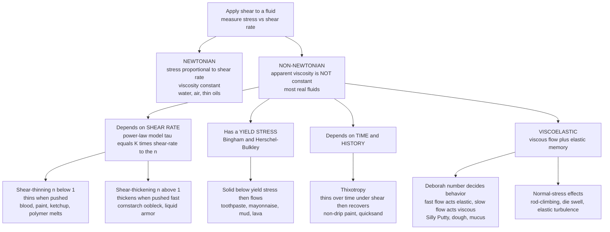

# 🍯 Non-Newtonian and Complex Fluids

> [!abstract] TL;DR
> A **Newtonian fluid** obeys one tidy law — shear stress is simply proportional to shear rate through a *constant* viscosity, $\tau = \mu\,\dot\gamma$ — and water and air are almost the only everyday fluids that actually do this. **Non-Newtonian fluids**, which are the overwhelming majority (blood, paint, ketchup, cornstarch, toothpaste, mud, polymer melts, mucus, magma), break that rule: their **apparent viscosity depends on how fast you shear them (shear-thinning $n<1$ or shear-thickening $n>1$), on whether a **yield stress** has been exceeded (Bingham plastics), on the **history** of deformation (thixotropy), or they are **viscoelastic** — combining liquid flow with solid-like elastic memory governed by a **relaxation time** and the **Deborah number**. The science that measures and models all this is **rheology**, and it links the bulk behavior back to microstructure (chains stretching, particles jamming). The clean Newtonian fluid of textbooks is the exception, not the rule.

## Intuition — analogy FIRST

Punch a bowl of cornstarch-and-water hard and it turns rock-solid under your fist; press the same bowl slowly and your fingers sink through it like a liquid. Squeeze a bottle of ketchup and nothing happens — until you *thwack* the base and it suddenly gushes. Leave a lump of Silly Putty on the desk overnight and it slowly puddles into a flat disc, yet throw it at the wall and it bounces like a rubber ball. None of these substances has a single "thickness" you can look up in a table. Their resistance **depends on how hard, how fast, and how long** you push — and some of them seem to *remember* how they were deformed, springing back like a solid.

That is the whole world of **non-Newtonian fluids**. Newton's law says stress and shear rate are locked in strict proportion through one fixed number, the viscosity — pour water slowly or stir it fast and its viscosity is identical. Real fluids refuse to be so obedient. Blood thins as it speeds through arteries; paint thins under the brush then thickens so it will not drip; toothpaste behaves as a solid in the tube then flows on demand; cornstarch stiffens the instant you stress it quickly. Understanding *why* — and how to quantify it — is the domain of **rheology**, the science of how matter deforms and flows across the entire spectrum from ideal elastic solid to ideal viscous liquid.

This note sits in the *Viscous Flow and Boundary Layers* arc of the *Fluid_Dynamics* vault. It builds directly on the Newtonian baseline established in [[The_Continuum_Hypothesis_and_Fluid_Properties]] and the constitutive closure of [[The_Navier_Stokes_Equations]], and it foreshadows the forthcoming siblings *Viscosity_and_Stress_in_Fluids* (the full stress tensor), *Low_Reynolds_Number_Flow* (where viscous forces dominate and non-Newtonian effects are sharpest), *Microfluidics_and_Biological_Flows* (blood, mucus, and lab-on-a-chip), and *Multiphase_and_Free_Surface_Flows* (suspensions, emulsions, and slurries) — all referenced here in prose.

---

## How It Works

### The Newtonian baseline and how it breaks

For a **Newtonian fluid** in simple shear, the shear stress $\tau$ is strictly proportional to the shear rate $\dot\gamma = du/dy$:

$$\tau = \mu\,\dot\gamma, \qquad \mu = \text{const}$$

Plot $\tau$ against $\dot\gamma$ and you get a **straight line through the origin** with slope $\mu$. The viscosity is a material constant: it does not care whether you shear slowly or violently. Water, air, glycerol, and thin oils obey this to excellent accuracy.

Non-Newtonian fluids violate this in one or more distinct ways. The right diagnostic is the **apparent viscosity** $\mu_{\text{app}} = \tau/\dot\gamma$ — the *local* slope of the flow curve — which for a non-Newtonian fluid is no longer constant. There are four broad families:

1. **Shear-rate dependence (shear-thinning and shear-thickening).** The **power-law** (Ostwald–de Waele) model captures both:
   $$\tau = K\,\dot\gamma^{\,n}, \qquad \mu_{\text{app}} = K\,\dot\gamma^{\,n-1}$$
   Here $K$ is the *consistency* and $n$ the *flow-behavior index*. When $n = 1$ it reduces to Newtonian ($K = \mu$). When $n < 1$ the fluid is **shear-thinning (pseudoplastic)** — apparent viscosity *falls* as you shear harder (blood, paint, ketchup, polymer melts, most biological fluids). When $n > 1$ it is **shear-thickening (dilatant)** — viscosity *rises* with shear rate (dense cornstarch suspensions, "oobleck", used in liquid body armor).

2. **Yield stress (Bingham plastics).** Some materials behave as an elastic **solid** until the stress exceeds a critical **yield stress** $\tau_y$, after which they flow. The **Bingham** model is
   $$\tau = \tau_y + \mu_p\,\dot\gamma \quad (\text{for } \tau > \tau_y), \qquad \dot\gamma = 0 \quad (\text{for } \tau \le \tau_y)$$
   with plastic viscosity $\mu_p$. Toothpaste holds its ribbon shape (no flow below $\tau_y$) then squeezes out cleanly; mayonnaise, mud, drilling fluids, wet concrete, and lava behave similarly. The **Herschel–Bulkley** model $\tau = \tau_y + K\dot\gamma^{\,n}$ generalizes this by adding power-law behavior above yield.

3. **Time dependence (thixotropy and rheopexy).** In **thixotropic** fluids the viscosity *decreases over time* under constant shear as microstructure is progressively broken down, then *recovers* when left at rest (non-drip paints, ketchup, many gels, quicksand — "stir to loosen"). **Rheopexy** is the rarer opposite (thickening under sustained shear). These fluids carry a *memory* of their recent deformation history.

4. **Viscoelasticity.** The most subtle family combines **viscous** (fluid-like, energy-dissipating) and **elastic** (solid-like, energy-storing) response. Polymer solutions and melts, Silly Putty, dough, mucus, and biological tissue all store some deformation energy elastically and return it. Two canonical lumped models made of springs (elastic, modulus $G$) and dashpots (viscous, $\eta$) describe this:
   - **Maxwell model** (spring and dashpot *in series*): under a sudden **step strain** the stress **relaxes** exponentially, $\sigma(t) = \sigma_0\,e^{-t/\lambda}$, where the **relaxation time** is $\lambda = \eta/G$. It flows like a liquid at long times.
   - **Kelvin–Voigt model** (spring and dashpot *in parallel*): under a sudden **step stress** the strain **creeps** toward its elastic limit, $\gamma(t) = (\sigma_0/G)(1 - e^{-t/\tau_r})$, with retardation time $\tau_r = \eta/G$. It behaves like a solid.

   Whether a viscoelastic fluid *looks* solid or liquid depends on the ratio of its relaxation time to the timescale of observation or flow — the **Deborah number**:
   $$\mathrm{De} = \frac{\lambda}{t_{\text{obs}}}$$
   $\mathrm{De} \gg 1$ (fast/short observation) means the material cannot relax in time and responds **elastically** (Silly Putty bounces); $\mathrm{De} \ll 1$ (slow/long observation) means it fully relaxes and responds **viscously** (Silly Putty puddles). The name comes from the biblical line "the mountains flowed before the Lord" — *everything flows given enough time*. In steady shear the analogous group is the **Weissenberg number** $\mathrm{Wi} = \lambda\dot\gamma$, which measures how strongly elasticity distorts the flow and drives dramatic effects like **rod-climbing** (the Weissenberg effect), **die swell** at extruder exits, and even **elastic turbulence** at vanishing Reynolds number.

### Why: the microstructure origin

Non-Newtonian behavior is not magic — it is **microstructure responding to flow**. In shear-thinning polymer solutions, tangled chains *stretch and align* with the flow, reducing entanglement drag. In shear-thickening dense suspensions, particles *jam* into force chains ("hydroclusters") when pushed fast. Yield stress arises from a *percolating network* (of particles, droplets, or gel bonds) that must be ruptured before flow. Thixotropy is that network breaking and slowly re-forming. Elasticity is *stored configurational entropy* in stretched chains springing back. Rheology is the bridge between this molecular/particle structure and the bulk stress response — the heart of **soft-matter physics**.



---

## Key Concepts / Details

### Secondary Level

**One thickness is not enough.** A Newtonian fluid like water has a single viscosity — it is just as "thick" whether you stir gently or vigorously. Non-Newtonian fluids do not: their thickness *changes* with how you handle them.

**Shear-thinning** fluids get *runnier* the harder or faster you push. This is why **paint** brushes on smoothly (thin under the brush) but does not drip off the wall afterward (thick at rest), and why **ketchup** is stubborn until you shake or squeeze it.

**Shear-thickening** fluids do the opposite — they get *stiffer* when hit fast. Cornstarch mixed with water ("oobleck") lets you *run across a pool* of it but swallows you if you stand still.

**Yield-stress** fluids act like a *soft solid* until you push hard enough, then suddenly flow. **Toothpaste** keeps its shape on the brush but flows out of the tube when you squeeze; the same idea holds for mayonnaise and mud.

**Viscoelastic** fluids are part-liquid, part-rubber. **Silly Putty** bounces when thrown (acts solid, fast) but slowly melts into a puddle if left alone (acts liquid, slow).

### Undergraduate Level

**The power-law model quantitatively.** Writing $\tau = K\dot\gamma^{\,n}$, the apparent viscosity is $\mu_{\text{app}} = \tau/\dot\gamma = K\dot\gamma^{\,n-1}$. On a log-log plot of $\mu_{\text{app}}$ vs $\dot\gamma$ this is a straight line of slope $n-1$: horizontal for Newtonian ($n=1$), *downward* for shear-thinning ($n<1$), *upward* for shear-thickening ($n>1$). Real shear-thinning fluids actually show **Newtonian plateaus** at very low and very high shear rate (the Carreau and Cross models capture the full S-shaped curve), with power-law behavior only in the middle decades — the power-law model is a useful local fit, not the whole story.

**Blood as the canonical shear-thinning fluid.** At low shear rate, red blood cells form stacked "rouleaux" and the blood is thick; as shear rate rises the rouleaux break up and the cells deform and align, dropping the viscosity several-fold. This shear-thinning is *physiologically essential* — it keeps flow resistance manageable in large arteries yet allows cells to squeeze single-file through capillaries. Below a small yield stress blood barely flows at all, so it is often modeled with **Casson** or **Herschel–Bulkley** laws. This theme continues in [[Fluid_Dynamics_in_Biology]].

**Reading the Bingham curve.** For a Bingham plastic, $\mu_{\text{app}} = \tau_y/\dot\gamma + \mu_p$: the apparent viscosity is *enormous* near zero shear rate (the $\tau_y/\dot\gamma$ term blows up — the material barely moves) and asymptotes to $\mu_p$ at high shear rate. This is exactly why toothpaste sits still on the brush ($\dot\gamma \to 0$, effectively infinite viscosity) but flows freely under a firm squeeze.

**The Maxwell and Kelvin–Voigt models.** These are the two simplest spring-dashpot combinations. A **Maxwell** element (series) has *instantaneous elastic* response plus *unbounded viscous* flow, so under fixed strain its stress *relaxes* to zero — it is a **viscoelastic liquid**. A **Kelvin–Voigt** element (parallel) *creeps* toward a finite elastic strain and recovers fully — it is a **viscoelastic solid**. Real polymers need a *spectrum* of relaxation times (generalized Maxwell model), but these two capture the essential physics: stress relaxation and creep.

**Deborah and Weissenberg numbers.** $\mathrm{De} = \lambda/t_{\text{obs}}$ compares the material's intrinsic relaxation time to the *observation/process* time; $\mathrm{Wi} = \lambda\dot\gamma$ compares it to the *flow deformation rate*. Both say the same thing in different settings: **when the material cannot relax fast enough relative to how fast it is being deformed, elasticity dominates.** A glacier ($\lambda$ huge, but $t_{\text{obs}}$ of centuries even larger $\Rightarrow$ small De) flows; Silly Putty at impact ($t_{\text{obs}}$ milliseconds $\Rightarrow$ large De) bounces.

### Graduate Level

**Beyond scalars: the stress tensor and normal stresses.** In general shear the extra (deviatoric) stress is a tensor, and viscoelastic fluids generate **normal stress differences** absent in Newtonian flow. The **first normal stress difference** $N_1 = \sigma_{xx} - \sigma_{yy}$ is positive for polymer solutions and is the origin of the **Weissenberg rod-climbing effect** (fluid climbs a rotating rod instead of being flung outward) and **die swell / extrudate swell** (a polymer jet expands on leaving a die as stretched chains recoil). These effects scale with $\mathrm{Wi}$ and have *no Newtonian analog*. Constitutive models that capture them include the **Upper-Convected Maxwell**, **Oldroyd-B**, **Giesekus**, and **FENE-P** equations, which promote the scalar relaxation to a frame-invariant (objective) tensor evolution.

**Elastic turbulence and the failure of Reynolds intuition.** Polymer additives can make a flow *chaotic and mixing* even at Reynolds number $\ll 1$, where a Newtonian fluid would be perfectly laminar — driven by elastic instabilities at high $\mathrm{Wi}$. Conversely, tiny amounts of long-chain polymer *suppress* inertial turbulence and drag in pipelines (the **Toms drag-reduction effect**). Elasticity thus reshapes stability in both directions, decoupled from inertia.

**Yield stress: reality and controversy.** Whether a *true* yield stress exists (versus an extremely high but finite viscosity at low shear — the "no true yield stress" view) has been debated for decades; practically, an *apparent* or *engineering* yield stress from a Herschel–Bulkley fit is what matters for pumping, coating, and 3D-printing design. Yield-stress fluids also show **thixotropic** aging, so the measured $\tau_y$ depends on the loading protocol and rest history — a persistent source of irreproducibility.

**Microstructure–rheology coupling.** The constitutive law is ultimately set by microstructure dynamics: the **Péclet number** $\mathrm{Pe} = \dot\gamma a^2/D$ (shear rate vs Brownian relaxation of a particle of size $a$, diffusivity $D$) governs whether suspensions shear-thin (Brownian, low Pe) or shear-thicken (hydrodynamic/contact, high Pe); the **Weissenberg number** governs chain stretch in polymers. This connects directly to the materials-science treatment in [[Polymer_Mechanics_and_Viscoelasticity]] and the colloidal picture in [[Nanoparticles_and_Colloidal_Systems]]. On geophysical scales the *same* viscoelastic framework treats mantle rock and glacial ice as extremely slow, high-viscosity fluids (very large $\lambda$, but even larger geological $t_{\text{obs}}$), the deformation behind [[Mantle_Convection_and_Hotspots]].

---

## Python Demo

```python
# Non-Newtonian rheology in four panels:
#   (a) FLOW CURVES  - shear stress vs shear rate for Newtonian, shear-thinning,
#       shear-thickening (power-law) and Bingham-plastic (yield-stress) fluids.
#   (b) APPARENT VISCOSITY vs shear rate for the same fluids (log-log).
#   (c) VISCOELASTICITY - Maxwell stress RELAXATION after a step strain,
#       sigma(t) = sigma0 * exp(-t/lam); the Deborah number De = lam / t_obs
#       decides elastic (De>>1) vs viscous (De<<1) response.
#   (d) VISCOELASTIC CREEP - Kelvin-Voigt delayed elastic strain under a step stress.
import numpy as np
import matplotlib.pyplot as plt

# ----------------------------------------------------------------------
# (a,b) FLOW CURVES
#   Power-law (Ostwald-de Waele):  tau = K * gdot**n ,  mu_app = K * gdot**(n-1)
#   Bingham plastic:               tau = tau_y + mu_p * gdot  (above yield)
# ----------------------------------------------------------------------
gdot = np.logspace(-1, 3, 400)                      # shear rate [1/s], log-spaced

# power-law fluids: (label, K consistency, n index, colour)
power_fluids = [
    ("Newtonian  n=1.0",          0.05,  1.0, "#1f5fa8"),  # water-like
    ("Shear-thinning  n=0.4",     2.0,   0.4, "#e8590c"),  # blood, paint, ketchup
    ("Shear-thickening  n=1.6",   0.002, 1.6, "#2f9e44"),  # cornstarch / oobleck
]

# Bingham plastic: yield stress, then plastic (Newtonian-like) flow
tau_y, mu_p = 8.0, 0.05                              # yield stress [Pa], plastic visc
tau_bingham = tau_y + mu_p * gdot                    # toothpaste / mud
mu_bingham  = tau_bingham / gdot                     # apparent viscosity -> huge at low gdot

fig, ax = plt.subplots(2, 2, figsize=(13, 10))

# (a) shear stress vs shear rate
for label, K, n, c in power_fluids:
    ax[0, 0].plot(gdot, K * gdot**n, color=c, lw=2, label=label)
ax[0, 0].plot(gdot, tau_bingham, color="#9c36b5", lw=2,
              label=f"Bingham  tau_y={tau_y:.0f} Pa")
ax[0, 0].axhline(tau_y, color="#9c36b5", ls=":", lw=1)
ax[0, 0].set_xscale("log"); ax[0, 0].set_yscale("log")
ax[0, 0].set_xlabel("shear rate  gamma-dot  [1/s]")
ax[0, 0].set_ylabel("shear stress  tau  [Pa]")
ax[0, 0].set_title("(a) Flow curves: stress vs shear rate")
ax[0, 0].legend(fontsize=8); ax[0, 0].grid(alpha=0.3, which="both")

# (b) apparent viscosity vs shear rate
for label, K, n, c in power_fluids:
    ax[0, 1].plot(gdot, K * gdot**(n - 1), color=c, lw=2, label=label)
ax[0, 1].plot(gdot, mu_bingham, color="#9c36b5", lw=2, label="Bingham")
ax[0, 1].set_xscale("log"); ax[0, 1].set_yscale("log")
ax[0, 1].set_xlabel("shear rate  gamma-dot  [1/s]")
ax[0, 1].set_ylabel("apparent viscosity  mu_app  [Pa s]")
ax[0, 1].set_title("(b) Apparent viscosity: thinning vs thickening")
ax[0, 1].legend(fontsize=8); ax[0, 1].grid(alpha=0.3, which="both")

# ----------------------------------------------------------------------
# (c) MAXWELL STRESS RELAXATION  sigma(t) = sigma0 * exp(-t/lam),  lam = eta/G
#     Deborah number De = lam / t_obs:
#       t_obs << lam (De>>1) -> stress barely relaxes -> ELASTIC (solid-like)
#       t_obs >> lam (De<<1) -> stress fully relaxes  -> VISCOUS (liquid-like)
# ----------------------------------------------------------------------
sigma0 = 1.0
t = np.linspace(0, 10, 400)
t_obs = 2.0                                          # our observation window
for lam, c in [(0.5, "#e8590c"), (2.0, "#1f5fa8"), (8.0, "#2f9e44")]:
    ax[1, 0].plot(t, sigma0 * np.exp(-t / lam), color=c, lw=2,
                  label=f"relaxation time lam={lam}")
ax[1, 0].axvline(t_obs, color="k", ls="--", lw=1.2)
ax[1, 0].text(t_obs + 0.15, 0.86, "observation\ntime t_obs", fontsize=8)
ax[1, 0].set_xlabel("time  t  [s]")
ax[1, 0].set_ylabel("stress  sigma(t) / sigma0")
ax[1, 0].set_title("(c) Maxwell relaxation and the Deborah number")
ax[1, 0].legend(fontsize=8); ax[1, 0].grid(alpha=0.3)

# ----------------------------------------------------------------------
# (d) KELVIN-VOIGT CREEP  gamma(t) = (sigma0/G) * (1 - exp(-t/tau_r))
# ----------------------------------------------------------------------
G = 1.0
sig_applied = 1.0
for tau_r, c in [(0.5, "#e8590c"), (2.0, "#1f5fa8"), (8.0, "#2f9e44")]:
    gamma = (sig_applied / G) * (1 - np.exp(-t / tau_r))
    ax[1, 1].plot(t, gamma, color=c, lw=2, label=f"retardation time={tau_r}")
ax[1, 1].axhline(sig_applied / G, color="k", ls=":", lw=1,
                 label="elastic limit sigma0/G")
ax[1, 1].set_xlabel("time  t  [s]")
ax[1, 1].set_ylabel("strain  gamma(t)")
ax[1, 1].set_title("(d) Kelvin-Voigt creep: delayed elastic strain")
ax[1, 1].legend(fontsize=8); ax[1, 1].grid(alpha=0.3)

plt.tight_layout(); plt.show()

# Console: Deborah-number regime for each relaxation time at this observation window
print(f"Observation window t_obs = {t_obs} s")
for lam in [0.5, 2.0, 8.0]:
    De = lam / t_obs
    regime = "ELASTIC (solid-like)" if De > 1 else "VISCOUS (liquid-like)"
    print(f"  lam={lam:>4}  ->  De = lam/t_obs = {De:4.2f}  ->  {regime}")
```

Panel (a) shows the defining pictures: the Newtonian line is straight through the origin, the shear-thinning curve bends *below* it, the shear-thickening curve *above* it, and the Bingham curve starts at a nonzero **yield stress** even at vanishing shear rate. Panel (b) makes the viscosity story explicit — a flat line for Newtonian, a downward slope for thinning, upward for thickening, and the Bingham apparent viscosity diverging as $\dot\gamma\to 0$ (why toothpaste "sets"). Panels (c) and (d) show the two faces of viscoelasticity — exponential **stress relaxation** and delayed-elastic **creep** — and the console output turns the same relaxation times into **Deborah numbers**, flipping the material between elastic and viscous depending on how it compares to the observation time.

---

## Real-World Applications

- **Food processing.** Sauces, dressings, chocolate, dough, yogurt, and molten confections are almost all non-Newtonian; recipes and pumping/coating equipment are engineered around their flow curves (ketchup is deliberately thixotropic; chocolate tempering is a rheology-controlled process).
- **Paints, inks, and coatings.** Shear-thinning plus thixotropy is the designed-in "brush easily, do not drip, level smoothly" behavior; the *same* physics governs **3D-printing inks and bioinks**, which must flow through a nozzle (high shear) yet hold shape after deposition (yield stress).
- **Polymer processing.** Extrusion and injection molding are dominated by shear-thinning and elasticity: **die swell** ($N_1$, high $\mathrm{Wi}$) must be compensated in die design, and melt-fracture instabilities limit throughput.
- **Drilling, cement, and construction.** Drilling **muds** and cement slurries are yield-stress/thixotropic fluids: they must suspend rock cuttings at rest (high low-shear viscosity) yet pump freely (thin under shear). Fresh concrete "slump" is a yield-stress measurement.
- **Biological fluids.** **Blood** is shear-thinning (vital for circulation), **synovial fluid** is viscoelastic (lubricating and shock-absorbing in joints), **mucus** is a viscoelastic gel (cleared by cilia), and **cytoplasm** behaves as a complex fluid — see [[Fluid_Dynamics_in_Biology]] and [[The_Cytoskeleton_and_Cell_Mechanics]].
- **Cosmetics and pharmaceuticals.** Creams, gels, and toothpastes are formulated for target yield stress and thixotropy (spreadable but stable).
- **Geophysics.** **Lava** and **magma** flow as yield-stress/temperature-dependent non-Newtonian fluids ([[Volcanism_and_Volcanic_Hazards]], [[Magma_Generation_and_Bowens_Series]]); on longer timescales mantle rock and glacial ice creep as extremely viscous fluids ([[Mantle_Convection_and_Hotspots]]).
- **Protective materials.** Shear-thickening fluids soak into fabric to make **liquid body armor** that stays flexible but stiffens on ballistic impact.

---

## Common Pitfalls

1. **Quoting "the viscosity" of a non-Newtonian fluid.** There is no single viscosity — only an *apparent* viscosity at a stated shear rate. Reporting a number without the shear rate (and temperature, and shear history) is meaningless.
2. **Extrapolating the power law everywhere.** $\tau = K\dot\gamma^n$ is a *local* fit valid over a few decades; real shear-thinning fluids have low- and high-shear Newtonian plateaus (use Carreau/Cross). Extrapolating to $\dot\gamma\to 0$ predicts infinite or zero viscosity, both wrong.
3. **Ignoring the yield stress in design.** Sizing a pump or pipe with a constant viscosity for a yield-stress mud or slurry underpredicts start-up pressure massively — nothing moves until $\tau > \tau_y$, and a plug of unyielded material can flow down the pipe center.
4. **Confusing shear-thinning with thixotropy.** Shear-thinning is *instantaneous* (viscosity depends on current shear rate); thixotropy is *time-dependent* (viscosity depends on how long shear has been applied and rest history). Many fluids show both; a steady-shear flow curve cannot distinguish them — you need transient or hysteresis tests.
5. **Forgetting elasticity (normal stresses).** Treating a polymer melt as a purely viscous shear-thinning fluid misses die swell, rod-climbing, and elastic instabilities. If $\mathrm{Wi}$ or $\mathrm{De}$ is order one or larger, elasticity is not optional.
6. **Mismatching timescales.** Whether a viscoelastic material behaves as solid or liquid is *not* an intrinsic label — it depends on the Deborah number. A material can be "solid" to a fast process and "liquid" to a slow one; asking "is it a solid or a liquid?" without a timescale is ill-posed.

---

## Related Concepts

- [[The_Continuum_Hypothesis_and_Fluid_Properties]] — establishes the Newtonian baseline $\tau = \mu\,du/dy$ that this note generalizes; defines viscosity and the fluid/solid distinction.
- [[The_Navier_Stokes_Equations]] — the Newtonian constitutive closure; non-Newtonian fluids replace it with the models here, giving the *generalized* Navier–Stokes equations.
- [[Viscous_Fluids_and_Navier_Stokes]] — Physics-vault companion on viscous stress and the momentum equation for real fluids.
- [[Fluid_Statics_and_Properties]] — Physics view of viscosity and Newtonian vs non-Newtonian fluid behavior.
- [[Turbulence_and_Instabilities]] — contrast with *elastic* turbulence, where polymer stress (not inertia) drives chaos at low Reynolds number.
- [[Polymer_Mechanics_and_Viscoelasticity]] — Materials-science deep dive on relaxation, creep, storage/loss moduli, and time–temperature superposition behind viscoelastic fluids.
- [[Polymer_Structure_and_Glass_Transition]] — the molecular chains and entanglement whose stretching/alignment produce shear-thinning and elasticity.
- [[Nanoparticles_and_Colloidal_Systems]] — colloidal suspensions whose particle interactions cause shear-thinning, shear-thickening, and yield stress.
- [[Liquid_Crystals_and_Colloids]] — ordered soft-matter phases with strongly anisotropic, flow-dependent rheology.
- [[Stress_Strain_and_Elastic_Moduli]] — the elastic solid limit ($\mathrm{De}\to\infty$) at one end of the rheological spectrum.
- [[Fluid_Dynamics_in_Biology]] — blood, mucus, and synovial fluid as complex fluids where non-Newtonian behavior is physiologically essential.
- [[The_Cytoskeleton_and_Cell_Mechanics]] — the viscoelastic interior of the living cell.
- [[Diffusion_and_Brownian_Motion_in_Cells]] — the Brownian relaxation (Péclet number) that sets whether a suspension thins or thickens.
- [[Mantle_Convection_and_Hotspots]] — solid rock behaving as an extremely viscous non-Newtonian fluid over geological time.
- [[Volcanism_and_Volcanic_Hazards]] — lava as a yield-stress, temperature-dependent flow.
- [[Magma_Generation_and_Bowens_Series]] — magma rheology and its control on eruption style.
- [[Pericyclic_Radical_and_Polymer_Chemistry]] — the polymer chemistry underlying the macromolecules that make melts and solutions viscoelastic.
- [[States_of_Matter_and_Gas_Laws]] — the solid/liquid continuum that rheology bridges.

---

## Review Questions

1. **Secondary.** Explain in plain language why paint is designed to be *shear-thinning* and why toothpaste is designed to have a *yield stress*. What everyday problem does each behavior solve? Give one more example of each type of fluid.
2. **Undergraduate.** A fluid follows the power law $\tau = K\dot\gamma^{\,n}$ with $K = 2\ \text{Pa·s}^n$ and $n = 0.4$. (a) Is it shear-thinning or shear-thickening, and what is the sign of the slope of $\log\mu_{\text{app}}$ vs $\log\dot\gamma$? (b) Compute the apparent viscosity at $\dot\gamma = 1\ \text{s}^{-1}$ and at $\dot\gamma = 100\ \text{s}^{-1}$, and state the ratio. (c) A separate Bingham fluid has $\tau_y = 8\ \text{Pa}$, $\mu_p = 0.05\ \text{Pa·s}$; explain why its *apparent* viscosity diverges as $\dot\gamma\to 0$ and what that means physically.
3. **Graduate.** A polymer solution has relaxation time $\lambda = 0.1\ \text{s}$. (a) Compute the Deborah number for a slow pour lasting $10\ \text{s}$ and for an impact lasting $1\ \text{ms}$, and state whether each response is dominated by viscous or elastic behavior. (b) In a steady shear rheometer at $\dot\gamma = 50\ \text{s}^{-1}$, compute the Weissenberg number and name two observable elastic phenomena you would expect. (c) Explain, in terms of chain configuration and stored entropy, why the *same* solution both shear-thins in steady shear and climbs a rotating rod — and why a purely Newtonian model cannot reproduce either.

---

## Sources

- Barnes, H. A., Hutton, J. F., & Walters, K. — *An Introduction to Rheology* (Elsevier). The standard accessible primer on non-Newtonian flow, yield stress, thixotropy, and viscoelasticity.
- Bird, R. B., Armstrong, R. C., & Hassager, O. — *Dynamics of Polymeric Liquids, Vol. 1: Fluid Mechanics*, 2nd ed. (Wiley). Constitutive models (Maxwell, Oldroyd-B, FENE), normal stresses, and viscoelastic flows.
- Macosko, C. W. — *Rheology: Principles, Measurements, and Applications* (Wiley-VCH). Rheometry and the measurement of flow curves and moduli.
- Chhabra, R. P., & Richardson, J. F. — *Non-Newtonian Flow and Applied Rheology*, 2nd ed. (Butterworth-Heinemann). Engineering applications: slurries, drilling muds, food, and process flows.
- Larson, R. G. — *The Structure and Rheology of Complex Fluids* (Oxford University Press). Microstructure–rheology connection for polymers, colloids, and suspensions.

#fluid-dynamics #non-newtonian #rheology #viscoelasticity #shear-thinning
