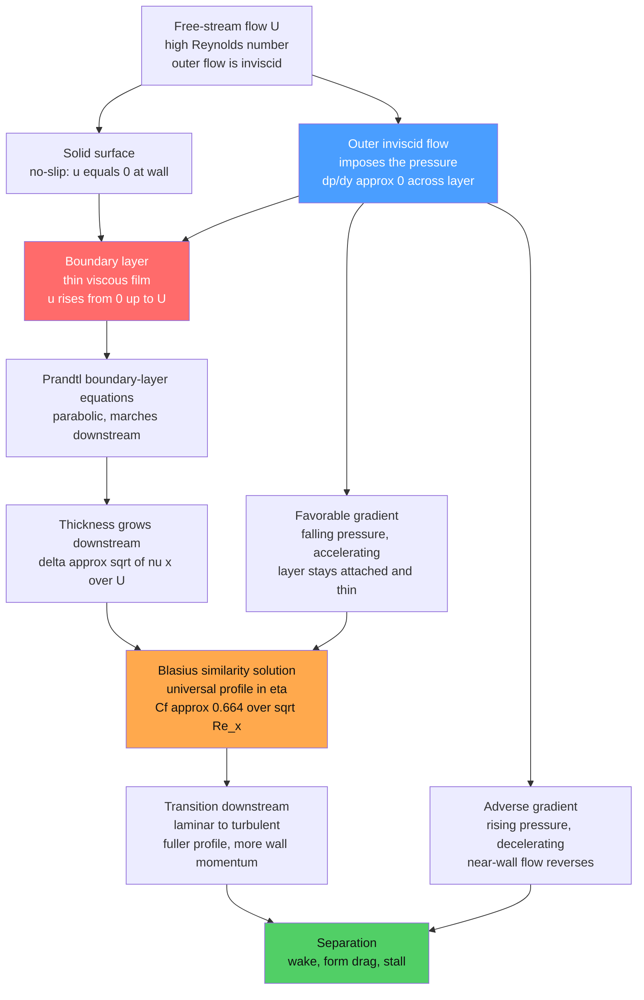

# 🌀 The Boundary Layer

> [!abstract] TL;DR
> At high **Reynolds number**, viscosity does not act everywhere — it is confined to a **wafer-thin layer hugging the surface**, where the flow slows from the full free-stream speed $U$ down to **zero at the wall** (the no-slip condition). Outside that skin the flow is effectively **inviscid** (potential flow). Ludwig **Prandtl's 1904** boundary-layer idea reconciled inviscid theory with real drag, resolved **d'Alembert's paradox**, and founded modern aerodynamics. Almost all **skin-friction drag**, **form drag** (via **separation**), and surface **heat/mass transfer** live inside this thin film, whose laminar thickness grows as $\delta \sim \sqrt{\nu x / U}$ and whose universal flat-plate profile is the **Blasius** solution.

---

## Intuition

**Analogy:** For over a century, fluid theory was schizophrenic. The elegant *inviscid* mathematics predicted that a body gliding through a fluid feels **zero drag** — plainly absurd, since everything from a raindrop to an airliner experiences resistance. Yet keeping viscosity *everywhere* made the equations hopeless to solve. Then in **1904** a young **Ludwig Prandtl** resolved the whole crisis in a single stroke: viscosity matters only in a **paper-thin layer clinging to the surface**, where the fluid is dragged from full speed down to a **dead stop at the wall**. Outside that skin, the flow is as frictionless as the old idealization always claimed.

That thin film is the **boundary layer**. Picture the wind rushing over a flat runway: a millimetre above the tarmac the air moves at full speed, but right at the ground it is motionless, held fast by friction. All the "missing physics" of inviscid theory — the drag, the wakes, the stall — hides inside this crucial skin. Prandtl's move let engineers keep the tractable inviscid math for the *outer* flow while patching in a simple viscous model for the *inner* layer, and modern aerodynamics was born.

---

## How It Works

### Core Mechanics

1. **The setup — high Reynolds number.** For flow past a body of size $L$ at speed $U$, the **Reynolds number** $Re = UL/\nu$ measures inertia versus viscous friction. When $Re \gg 1$ (a wing, a ship, a pipe of everyday size), inertia dominates almost everywhere — *except* right at the wall, where the no-slip condition forces the fluid to match the surface velocity (zero for a stationary body). Reconciling "fast-moving free stream" with "zero at the wall" over a tiny distance demands a **steep velocity gradient**, and steep gradients are exactly where the viscous term $\nu\nabla^2 u$ becomes important.

2. **Two regions, matched.** The flow splits into an **outer region** — the bulk, governed by the inviscid Euler/potential equations (see *Euler_Equations_and_Inviscid_Flow*) — and a thin **inner region**, the boundary layer of thickness $\delta \ll L$, where viscosity brings $u$ from the outer free-stream value $U(x)$ down to $0$. This is a textbook **singular perturbation / matched asymptotic expansion**: the small parameter $1/Re$ multiplies the highest derivative, so setting it to zero drops the no-slip condition; the inner layer restores it, and the two solutions are matched where they overlap.

3. **Prandtl's boundary-layer equations.** Inside the thin layer, an order-of-magnitude analysis of Navier-Stokes shows the **wall-normal momentum equation collapses to** $\partial p/\partial y \approx 0$: pressure does **not** vary across the layer. The pressure is therefore **imposed on the layer by the outer inviscid flow**, $-\tfrac1\rho\,dp/dx = U\,dU/dx$. What remains is the streamwise balance
   $$u\frac{\partial u}{\partial x} + v\frac{\partial u}{\partial y} = U\frac{dU}{dx} + \nu\frac{\partial^2 u}{\partial y^2},$$
   plus continuity. This system is **parabolic**, not elliptic — a huge simplification: you can **march downstream** from the leading edge, station by station, instead of solving the full elliptic Navier-Stokes field at once.

4. **Thickness grows as the square root of distance.** Balancing inertia $U^2/x$ against friction $\nu U/\delta^2$ gives $\delta \sim \sqrt{\nu x / U}$. The layer **thickens downstream** like $\sqrt{x}$ — on a wing it may be a fraction of a millimetre near the leading edge and a few millimetres at the trailing edge. Three standard measures pin it down: the **99% thickness** $\delta_{99}$ (where $u = 0.99\,U$), the **displacement thickness** $\delta^* = \int_0^\infty (1 - u/U)\,dy$ (how far the outer streamlines are pushed out), and the **momentum thickness** $\theta = \int_0^\infty \frac{u}{U}\!\left(1-\frac{u}{U}\right)dy$ (the momentum deficit, which sets the drag).

5. **The Blasius solution — the exact laminar profile.** For a flat plate with zero pressure gradient ($dU/dx = 0$), the profile is **self-similar**: at every station the shape is identical once $y$ is scaled by $\delta(x)$. Introducing the similarity variable $\eta = y\sqrt{U/\nu x}$ and $u/U = f'(\eta)$ collapses the PDE to a single ODE — the **Blasius equation**
   $$f''' + \tfrac12\, f f'' = 0, \qquad f(0)=0,\; f'(0)=0,\; f'(\infty)=1.$$
   Its numerical solution gives the universal profile, the wall curvature $f''(0)=0.332$, $\delta_{99}\approx 5.0\sqrt{\nu x/U}$, and the **skin-friction coefficient** $C_f = 0.664/\sqrt{Re_x}$ — decaying as $1/\sqrt{Re_x}$. (The flat plate is the cleanest of the exact viscous solutions explored in *Laminar_Flow_and_Exact_Solutions*.)

6. **This resolves d'Alembert's paradox.** Inviscid theory predicted zero drag because it ignored the wall layer entirely. The boundary layer supplies the two missing drag mechanisms: **skin-friction drag** from the viscous shear $\tau_w = \mu\,\partial u/\partial y|_{y=0}$ integrated over the surface, and **pressure/form drag** when the layer **separates**. The thin viscous film is precisely where the "missing" physics of inviscid theory lives — the singular limit finally makes sense.

7. **Laminar to turbulent transition.** A boundary layer is not permanently laminar. Past a critical distance ($Re_x \sim 5\times10^5$ on a flat plate) disturbances amplify and it **transitions to turbulence** (see *Transition_to_Turbulence*). A **turbulent** boundary layer is **thicker**, has a **fuller** profile (the log-law near the wall), and produces **higher skin friction** — but its fuller profile packs more momentum near the wall, so it **resists separation** far better. That trade-off is central to real design.

8. **Pressure gradient and separation — the villain.** The outer flow imposes $dp/dx$ on the layer. A **favorable** gradient ($dp/dx < 0$, accelerating flow, as over the front of a wing) keeps the layer thin and firmly **attached**. An **adverse** gradient ($dp/dx > 0$, decelerating flow, as on the rear of a bluff body or a wing near stall) **decelerates the already-slow near-wall fluid until it reverses**; the layer then **separates** from the surface, throwing off a broad low-pressure **wake**. Separation is the cause of **form drag** and **stall** — and the reason streamlining, dimples, and vortex generators exist (deep-dived in *Flow_Separation_and_Drag_Crisis* and *Lift_Drag_and_Aerodynamics*).

### Flow / Architecture



---

## Key Concepts

### Secondary Level

- **No-slip at the wall** — a fluid touching a solid surface sticks to it: its speed there is zero. That single fact forces a thin layer where the flow ramps up from a standstill to full speed.
- **The boundary layer** — the paper-thin skin of slowed fluid next to a surface. A millimetre off a wing the air moves fast; right at the surface it is stationary.
- **Why it explains drag** — inviscid theory said "no friction, no drag," which is wrong. The friction lives in this thin layer, and it is what actually drags on a moving body.
- **Separation and stall** — if the flow has to climb against rising pressure (like over the back of a hump), the slow near-wall fluid gives up, peels away, and leaves a turbulent wake. On a wing tilted too steeply this is a **stall**.

### Undergraduate Level

- **Scaling estimate** — balancing inertia against viscous friction gives $\delta/L \sim 1/\sqrt{Re_L}$, so at $Re = 10^6$ the layer is only $\sim 0.1\%$ of the body length. High $Re$ means a *thinner*, not weaker, viscous region.
- **Prandtl's simplification** — across the thin layer $\partial p/\partial y \approx 0$, so pressure is set by the outer flow and imposed as a known forcing. The equations become parabolic and can be marched from the leading edge, a massive computational win over the full elliptic Navier-Stokes.
- **Blasius flat plate** — similarity variable $\eta = y\sqrt{U/\nu x}$, $u/U = f'(\eta)$, and $f''' + \tfrac12 f f'' = 0$. Key numbers: $f''(0)=0.332$, $\delta_{99}=5.0\sqrt{\nu x/U}$, $\delta^*=1.721\sqrt{\nu x/U}$, $\theta=0.664\sqrt{\nu x/U}$, and $C_f = 0.664/\sqrt{Re_x}$.
- **Thickness measures** — $\delta_{99}$ (geometric), $\delta^*$ (mass-flow deficit / streamline displacement), $\theta$ (momentum deficit). The **shape factor** $H = \delta^*/\theta$ (1.72 laminar, $\sim$1.3–1.4 turbulent) diagnoses how close a layer is to separating — $H$ rising sharply signals imminent separation.
- **Laminar vs turbulent** — transition near $Re_x \approx 5\times10^5$. Turbulent layers: thicker, fuller ($1/7$-power / log-law profile), higher $C_f \approx 0.059\,Re_x^{-1/5}$, but far more resistant to separation because momentum is mixed down toward the wall.

### Graduate Level

- **Matched asymptotic expansions** — the boundary layer is the *inner* solution of a singular perturbation in $\varepsilon = 1/\sqrt{Re}$. Stretch the wall-normal coordinate $Y = y/\varepsilon$, expand inner and outer solutions, and match in the overlap. This formalism (shared with *Viscosity_and_Stress_in_Fluids* and asymptotic ODE theory) makes Prandtl's physical argument rigorous and yields higher-order corrections (e.g., the $O(Re^{-1/2})$ displacement effect on the outer flow).
- **Falkner-Skan family** — for wedge flows $U(x) \propto x^m$ the similarity ODE generalizes to $f''' + f f'' + \beta(1 - f'^2) = 0$ with $\beta = 2m/(m+1)$. Favorable gradients ($\beta > 0$) give fuller profiles; the adverse branch reaches **separation** at $\beta \approx -0.199$ where $f''(0) \to 0$ — the wall shear vanishes, the analytic signature of separation.
- **Von Kármán momentum integral** — $\frac{d\theta}{dx} + (2+H)\frac{\theta}{U}\frac{dU}{dx} = \frac{C_f}{2}$ turns the PDE into an ODE for $\theta(x)$, powering fast engineering methods (Thwaites for laminar, Head/Green for turbulent) and separation prediction without full CFD.
- **Vorticity view** — the wall is a source of vorticity: the no-slip condition continuously generates vorticity that diffuses and advects into the layer (connect to *Vorticity_and_Circulation*). Separation is where this vorticity sheet lifts off the surface; the boundary layer is, in essence, a thin sheet of concentrated vorticity.
- **Thermal and concentration layers; Reynolds analogy** — momentum, heat, and species each have their own boundary layer; their relative thicknesses scale with the **Prandtl number** $Pr = \nu/\alpha$ and **Schmidt number** $Sc = \nu/D$ ($\delta/\delta_T \sim Pr^{1/3}$). The **Reynolds analogy** links skin friction to heat transfer ($St \approx C_f/2$ for $Pr\approx1$), which is why nearly all surface heating and mass transfer happen in this same thin film.

---

## Python Demo

```python
# Blasius laminar flat-plate boundary layer, from scratch (numpy + matplotlib).
#   Similarity variable:  eta = y * sqrt(U / (nu * x))
#   Velocity profile:     u/U = f'(eta)
#   Blasius ODE:          f''' + 0.5 * f * f'' = 0
#   Boundary conditions:  f(0)=0, f'(0)=0, f'(inf)=1
# We solve it with a hand-rolled RK4 integrator plus a shooting/bisection
# search for the unknown wall curvature s = f''(0), then use the profile to
# show (a) the universal profile, (b) the layer thickening downstream,
# (c) delta ~ sqrt(x) growth, and (d) skin friction decaying as 1/sqrt(Re_x).

import numpy as np
import matplotlib.pyplot as plt

# ---- Blasius ODE as a first-order system: state = [f, f', f''] -------
def rhs(state):
    f, g, h = state                       # f, f'=g, f''=h
    return np.array([g, h, -0.5 * f * h]) # f', f'', f''' = -0.5 f f''

def integrate(s, eta_max=10.0, n=4000):
    """RK4-integrate from eta=0 with f''(0)=s. Returns eta grid and states."""
    d = eta_max / n
    eta = np.linspace(0.0, eta_max, n + 1)
    Y = np.zeros((n + 1, 3))
    Y[0] = [0.0, 0.0, s]                   # f(0)=0, f'(0)=0, f''(0)=s
    for i in range(n):
        y = Y[i]
        k1 = rhs(y)
        k2 = rhs(y + 0.5 * d * k1)
        k3 = rhs(y + 0.5 * d * k2)
        k4 = rhs(y + d * k3)
        Y[i + 1] = y + (d / 6.0) * (k1 + 2*k2 + 2*k3 + k4)
    return eta, Y

# ---- Shooting: choose s so that f'(inf) = 1 (bisection) -------------
def miss(s):                               # f'(eta_max) - 1
    _, Y = integrate(s)
    return Y[-1, 1] - 1.0

lo, hi = 0.1, 0.6
for _ in range(60):
    mid = 0.5 * (lo + hi)
    if miss(lo) * miss(mid) <= 0.0:
        hi = mid
    else:
        lo = mid
s_star = 0.5 * (lo + hi)
print(f"wall curvature  f''(0) = {s_star:.5f}   (textbook 0.33206)")

eta, Y = integrate(s_star)
f, fp, fpp = Y[:, 0], Y[:, 1], Y[:, 2]     # f, u/U = f', f''

eta99 = np.interp(0.99, fp, eta)           # where u/U reaches 0.99
print(f"eta at u/U=0.99 = {eta99:.3f}   ->  delta99 ~ {eta99:.2f} * sqrt(nu x / U)")

# ---- Physical growth along a flat plate (air) ----------------------
U  = 20.0            # free-stream speed [m/s]
nu = 1.5e-5          # kinematic viscosity of air [m^2/s]
x  = np.linspace(1e-3, 1.0, 400)           # distance from leading edge [m]
Re_x = U * x / nu

delta99   = eta99 * np.sqrt(nu * x / U)    # 99% thickness [m]
delta_str = 1.721 * np.sqrt(nu * x / U)    # displacement thickness [m]
Cf        = 0.664 / np.sqrt(Re_x)          # local skin-friction coefficient

# ---- Figure --------------------------------------------------------
fig, ax = plt.subplots(2, 2, figsize=(13, 10))

# (a) Universal Blasius profile ------------------------------------
ax[0, 0].plot(fp, eta, color="#d62728", lw=2.2)
ax[0, 0].axhline(eta99, color="0.5", ls="--", lw=1)
ax[0, 0].text(0.05, eta99 + 0.15, f"eta99 = {eta99:.2f}  (u/U = 0.99)", color="0.3")
ax[0, 0].scatter([0], [0], color="k", zorder=5)
ax[0, 0].annotate("no-slip: u = 0 at wall", (0.0, 0.0), (0.25, 0.9),
                  arrowprops=dict(arrowstyle="->", color="0.4"))
ax[0, 0].set_xlabel("u / U   (= f' )")
ax[0, 0].set_ylabel("similarity variable  eta")
ax[0, 0].set_title("(a) Universal Blasius profile\nsame shape at every station")
ax[0, 0].set_ylim(0, 8)

# (b) Velocity profiles at several stations -> layer thickens -------
stations = [0.02, 0.1, 0.3, 0.6, 0.95]     # x locations [m]
colors = plt.cm.viridis(np.linspace(0.15, 0.85, len(stations)))
for xs, c in zip(stations, colors):
    y_phys = eta * np.sqrt(nu * xs / U) * 1e3   # wall-normal distance [mm]
    ax[0, 1].plot(fp, y_phys, color=c, lw=2, label=f"x = {xs:.2f} m")
ax[0, 1].set_xlabel("u / U")
ax[0, 1].set_ylabel("distance from wall  y  [mm]")
ax[0, 1].set_title("(b) Profiles downstream\n0 at wall -> U in a thin, thickening film")
ax[0, 1].legend(fontsize=8, loc="lower right")
ax[0, 1].set_ylim(0, 12)

# (c) Thickness growth  delta ~ sqrt(x) ----------------------------
ax[1, 0].plot(x, delta99 * 1e3, color="#1f77b4", lw=2.2, label="delta99 (99% thickness)")
ax[1, 0].plot(x, delta_str * 1e3, color="#2ca02c", lw=2, ls="--",
              label="delta* (displacement)")
ax[1, 0].fill_between(x, 0, delta99 * 1e3, color="#1f77b4", alpha=0.10)
ax[1, 0].set_xlabel("distance along plate  x  [m]")
ax[1, 0].set_ylabel("boundary-layer thickness  [mm]")
ax[1, 0].set_title("(c) Layer grows as sqrt(x)\nthin at the leading edge, thickens downstream")
ax[1, 0].legend(loc="upper left")

# (d) Skin friction ~ 1/sqrt(Re_x) ---------------------------------
ax[1, 1].loglog(Re_x, Cf, color="#9467bd", lw=2.2, label="Cf = 0.664 / sqrt(Re_x)")
ax[1, 1].loglog(Re_x, 0.664 / np.sqrt(Re_x), color="k", ls=":", lw=1,
                label="slope -1/2 reference")
ax[1, 1].set_xlabel("Reynolds number  Re_x = U x / nu")
ax[1, 1].set_ylabel("skin-friction coefficient  Cf")
ax[1, 1].set_title("(d) Skin friction decays as 1/sqrt(Re_x)\nwall shear falls downstream")
ax[1, 1].legend()
ax[1, 1].grid(True, which="both", alpha=0.3)

plt.tight_layout()
plt.show()

# Expected: f''(0) ~ 0.33206, eta99 ~ 4.91 (so delta99 ~ 5.0*sqrt(nu x/U)).
# Panel (b) shows the classic picture -- flow pinned to 0 at the wall rising to
# U across a film only millimetres thick, thickening with x. Panels (c) and (d)
# confirm the sqrt(x) growth and the 1/sqrt(Re_x) skin-friction decay.
# NOTE: real plates transition to turbulence near Re_x ~ 5e5, after which the
# layer thickens faster, friction rises, and it resists an adverse-gradient
# separation far better than this laminar Blasius layer would.
```

Running it prints $f''(0)\approx 0.33206$ and $\eta_{99}\approx 4.91$ (so $\delta_{99}\approx 5.0\sqrt{\nu x/U}$), then draws the four panels: the universal profile pinned to zero at the wall, the physical profiles thickening downstream, the $\sqrt{x}$ growth of $\delta_{99}$ and $\delta^*$, and the $1/\sqrt{Re_x}$ decay of skin friction. To *illustrate separation*, imagine imposing an adverse pressure gradient in panel (b): the near-wall slope $\partial u/\partial y|_0$ would shrink toward zero and then go negative — the flow reverses at the wall and the layer lifts off.

---

## Real-World Applications

> **Example — the airplane wing.** Everything Prandtl's theory promises is visible on a wing. Over most of the surface the air obeys the inviscid/potential equations, so panel and Euler CFD codes nail the outer pressure distribution and the **lift**. The **drag**, though, comes entirely from the boundary layer: viscous shear integrated over the skin (**skin-friction drag**) plus the wake left when the layer **separates**. Push the angle of attack too high and the adverse gradient over the upper surface separates the layer catastrophically — the wing **stalls**. Designers fight this with **vortex generators** (small vanes that trip the layer turbulent so it resists separation) and careful shaping to keep the gradient mild.

- **Golf-ball dimples** — the dimples deliberately **trip the boundary layer turbulent**. A turbulent layer clings to the back of the ball longer, delaying separation, shrinking the wake, and roughly halving the pressure drag — a dimpled ball flies about twice as far as a smooth one. This is the **drag crisis** in action.
- **Turbine and compressor blades** — blade rows operate near separation by design; predicting boundary-layer transition and separation sets efficiency and stall margins, and film-cooling of hot turbine blades is governed by the *thermal* boundary layer.
- **Ships and pipelines** — hull skin-friction drag (a turbulent boundary layer over tens of metres) dominates fuel burn; **riblets** (micro-grooves mimicking shark skin) cut turbulent skin friction a few percent, and low-drag hull shaping avoids adverse gradients that would separate the flow.
- **Atmosphere and ocean** — the **atmospheric (planetary) boundary layer** is the turbulent skin of air over the ground where wind meets zero at the surface, and the ocean's **Ekman layer** is its rotating cousin; both are direct geophysical instances of the same near-wall physics.
- **Heat exchangers and electronics cooling** — the thermal boundary layer sets the convective heat-transfer coefficient; thinning it (higher velocity, turbulence promoters, fins) is the whole game in cooling surfaces.

---

## Common Pitfalls

- **Confusing "$\mu=0$" with "$Re\to\infty$"** — the inviscid limit is **singular**, not a smooth switch. Viscosity multiplies the highest derivative, so dropping it lowers the equation's order and abandons the no-slip condition. However large $Re$ gets, a boundary layer always remains; it just gets thinner.
- **Thinking a thin layer is a negligible layer** — the boundary layer is thin but decisive. It carries *all* the skin-friction drag and, through separation, controls form drag, lift, and stall. Thin does not mean unimportant.
- **Assuming pressure varies across the layer** — Prandtl's key result is $\partial p/\partial y \approx 0$: the outer flow *dictates* the pressure to the layer. Trying to solve for a wall-normal pressure gradient inside a thin attached layer is a conceptual error.
- **Forgetting the adverse-gradient limit on Bernoulli/inviscid design** — inviscid theory happily lets flow decelerate against a steep pressure rise, but the real boundary layer separates first. Aggressive aft-loading or a sharp trailing wedge that "works" inviscidly can separate and stall in reality.
- **Assuming laminar everywhere** — real layers transition near $Re_x\sim5\times10^5$ (sooner with roughness or free-stream turbulence). Applying Blasius ($C_f\propto Re_x^{-1/2}$) past transition badly under-predicts drag; use turbulent correlations ($C_f\propto Re_x^{-1/5}$) there.
- **Mis-reading a turbulent layer as always worse** — yes, it has higher skin friction, but its fuller profile resists separation. On a bluff body, *forcing* turbulence (dimples, trip wires) can slash the *total* drag by killing the wake. Skin friction is not the whole drag story.

---

## Related Concepts

- [[Euler_Equations_and_Inviscid_Flow]] — the inviscid outer flow the boundary layer is matched to; the boundary layer is exactly what resolves that note's **d'Alembert's paradox**.
- [[The_Navier_Stokes_Equations]] — the full viscous equations that Prandtl's parabolic boundary-layer equations are the thin-layer simplification of.
- [[Vorticity_and_Circulation]] — the wall is a vorticity source; a boundary layer is a thin sheet of vorticity, and separation is where that sheet lifts off.
- [[Dimensional_Analysis_and_Similarity]] — the **Reynolds number** and the similarity variable $\eta$ that make the Blasius collapse possible.
- [[Kinematics_of_Fluid_Flow]] — the strain-rate and velocity-gradient description behind the steep near-wall shear that defines the layer.
- [[Viscous_Fluids_and_Navier_Stokes]] — the Physics-vault treatment of viscous stress and the equations of real fluids.
- [[Turbulence_and_Instabilities]] — where a boundary layer goes after transition, and the log-law turbulent profile.
- [[Euler_Equations_and_Ideal_Fluids]] — the broader ideal-fluid picture that the outer flow obeys.
- [[Atmospheric_Boundary_Layer]] — the planetary-scale turbulent boundary layer of air over the ground (Meteorology).
- [[Ekman_Transport_and_Coastal_Upwelling]] — the rotating **Ekman layer**, the geophysical boundary layer in the ocean (Oceanography).
- [[Fluid_Dynamics_in_Biology]] — boundary layers and the low-Reynolds-number regime around cells and swimmers (Biophysics).
- [[Introduction_to_PDEs]] — the elliptic-vs-parabolic classification that explains why the boundary-layer equations can be marched downstream.
- [[Systems_of_ODEs]] — the Blasius equation recast as a first-order system and solved by shooting, as in the demo.

---

## Review Questions

1. **Secondary** — In plain words, what is a boundary layer, and why does its existence explain why a real ball feels drag even though "frictionless" theory said it should feel none?
2. **Undergraduate** — For a laminar flat-plate boundary layer, derive (by scaling inertia against viscous friction) why $\delta \sim \sqrt{\nu x / U}$, and explain why the local skin-friction coefficient therefore decreases as $1/\sqrt{Re_x}$. What does the Blasius similarity variable $\eta = y\sqrt{U/\nu x}$ accomplish?
3. **Graduate** — Explain, using the pressure gradient imposed by the outer flow, why an **adverse** gradient causes separation while a **favorable** one prevents it. Why is a **turbulent** boundary layer, despite its higher skin friction, more resistant to separation, and how do golf-ball dimples exploit this to *reduce* total drag?

---

## Sources

- Prandtl, L. (1904) — *Über Flüssigkeitsbewegung bei sehr kleiner Reibung*, Proc. 3rd Int. Math. Congress, Heidelberg (the founding boundary-layer paper).
- Schlichting, H. & Gersten, K. — *Boundary-Layer Theory*, 9th ed., Springer (the definitive reference; Blasius, transition, separation).
- Batchelor, G. K. — *An Introduction to Fluid Dynamics*, Cambridge University Press, Ch. 5 (boundary layers and the high-Re limit).
- Kundu, Cohen & Dowling — *Fluid Mechanics*, 6th ed., Ch. 10 (boundary layers, Blasius, momentum integral, separation).
- White, F. M. — *Viscous Fluid Flow*, 3rd ed., McGraw-Hill, Chs. 4 and 6 (laminar and turbulent boundary layers, skin friction).

---

#fluid-dynamics #boundary-layer #prandtl #blasius #flow-separation
