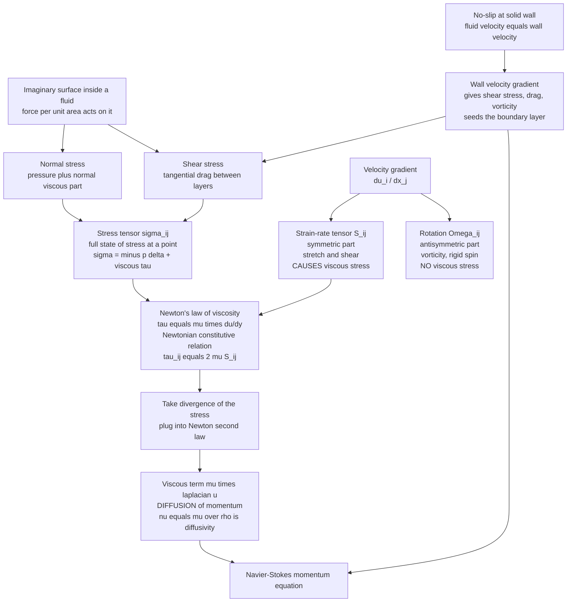

# 🍯 Viscosity and Stress in Fluids

> [!abstract] TL;DR
> **Viscosity** is the internal friction of a fluid. **Newton's law of viscosity** says the tangential (**shear**) stress transmitted between sliding fluid layers is proportional to the velocity gradient (the strain rate): $\tau = \mu\,\frac{du}{dy}$. Generalized to three dimensions, the full state of force at a point is the **stress tensor** $\sigma_{ij}$ (an isotropic pressure part plus a viscous part), and the Newtonian **constitutive relation** ties the viscous stress linearly to the symmetric **strain-rate tensor**. Feeding this back into Newton's second law produces the viscous term $\mu\nabla^2\vec{u}$ of Navier-Stokes — a **diffusion operator** that spreads momentum exactly as heat diffuses, with **kinematic viscosity** $\nu=\mu/\rho$ as the momentum diffusivity. Viscosity's **no-slip** boundary condition makes fluid stick to walls, and that is the origin of velocity gradients, drag, vorticity, and boundary layers — the whole viscous half of fluid dynamics.

---

## Intuition

**Analogy:** Push the top card of a thick deck sideways. The top card slides most, the card beneath it drags along a little less, the next one less still, down to the bottom card that does not move at all. The deck **shears** into a smooth slope of displacements, each card gripping its neighbor through friction and passing the motion downward one layer at a time.

A fluid does exactly this. Pour it into the gap between a plate you drag and a plate held still, and it settles into a **gradient of speeds** — fast at the moving wall, zero at the fixed wall — with each thin layer dragging the one below through internal friction. That friction is **viscosity**, and the sideways force per unit area it transmits between layers is the **shear stress**. Whether the fluid is water or honey comes down to one thing: how fiercely its molecular layers grip one another as they slide past. Honey grips hard and transmits large stress for a gentle shear; water grips weakly. That single "grip per unit shear rate" is the viscosity coefficient $\mu$.

---

## How It Works

### Stress: force per area on an internal surface

Slice an imaginary plane through a fluid. The material on one side pushes on the material on the other with a force per unit area — the **stress**. That force has two flavors relative to the surface:

- **Normal stress** — the component perpendicular to the surface. In a fluid at rest this is just the (isotropic) **pressure** pushing inward; in motion there is an extra **normal viscous** contribution when the fluid is being stretched or compressed along that direction.
- **Shear stress** — the component tangential to the surface, the sideways drag one layer exerts on the next. This is the purely viscous, motion-dependent stress that a static fluid cannot support.

Because the force on a surface depends on the surface's orientation, the complete state of stress at a point is not a vector but a **tensor**, $\sigma_{ij}$ — the $i$-th force component acting on the surface whose outward normal points in the $j$ direction. It is conventionally split as

$$\sigma_{ij} = \underbrace{-p\,\delta_{ij}}_{\text{isotropic pressure}} + \underbrace{\tau_{ij}}_{\text{viscous (deviatoric) stress}}.$$

The diagonal terms $\sigma_{11},\sigma_{22},\sigma_{33}$ are normal stresses; the off-diagonal terms are shear stresses. The stress tensor is how forces are transmitted through a continuous fluid: divergence of $\sigma_{ij}$ is the net force per unit volume on a fluid element (the basis of [[The_Navier_Stokes_Equations]]).

### Newton's law of viscosity

For the simplest case — a **simple shear**, where fluid moves in the $x$ direction with a speed that varies only across $y$, so $\vec{u}=(u(y),0,0)$ — experiment gives a beautifully linear law. The shear stress on planes of constant $y$ is proportional to the velocity gradient:

$$\boxed{\;\tau = \mu\,\frac{du}{dy}\;}$$

The velocity gradient $du/dy$ is the **strain rate** (the rate at which layers shear past each other), and the constant of proportionality $\mu$ is the **dynamic viscosity** (units Pa·s). Fluids that obey this linear relation — water, air, most oils, glycerine — are called **Newtonian**. Their stress responds instantly and proportionally to strain rate. Fluids that do not (ketchup, blood, polymer melts, cornstarch slurry) are **non-Newtonian**, the subject of a dedicated *Non-Newtonian and Complex Fluids* sibling note.

### The strain-rate tensor: generalizing to 3D

In three dimensions the local relative motion of fluid is governed by the **velocity-gradient tensor** $\partial u_i/\partial x_j$. Split it into symmetric and antisymmetric parts (this decomposition is the heart of [[Kinematics_of_Fluid_Flow]]):

$$\frac{\partial u_i}{\partial x_j} = \underbrace{\tfrac{1}{2}\!\left(\frac{\partial u_i}{\partial x_j}+\frac{\partial u_j}{\partial x_i}\right)}_{S_{ij}\ \text{strain-rate tensor}} + \underbrace{\tfrac{1}{2}\!\left(\frac{\partial u_i}{\partial x_j}-\frac{\partial u_j}{\partial x_i}\right)}_{\Omega_{ij}\ \text{rotation (spin)}}.$$

- The **symmetric part** $S_{ij}$ — the **strain-rate** (rate-of-deformation) tensor — measures how fast a fluid element **stretches and shears**. This, and only this, causes viscous stress.
- The **antisymmetric part** $\Omega_{ij}$ is **rigid rotation**, encoded by the **vorticity** $\vec{\omega}=\nabla\times\vec{u}$. A blob spinning as a rigid body is not being deformed, so it generates **no viscous stress**. This is a crucial subtlety: viscosity resists *deformation*, not *rotation*.

### The Newtonian constitutive relation and how it closes the equations

A **constitutive relation** is the material-specific law linking stress to motion — it is what turns the abstract "there is some stress tensor" into a solvable model. The **Newtonian constitutive law** states that viscous stress is a linear, isotropic function of the strain rate:

$$\tau_{ij} = 2\mu\,S_{ij} + \lambda\,(\nabla\cdot\vec{u})\,\delta_{ij}.$$

Here $\mu$ is the **shear (dynamic) viscosity** governing deformation, and $\lambda$ (related to the **bulk / second viscosity** $\kappa = \lambda + \tfrac{2}{3}\mu$) governs resistance to pure volume change. For an **incompressible** fluid $\nabla\cdot\vec{u}=0$, the bulk term vanishes and only $\mu$ survives. Substituting this stress into the momentum balance $\rho\,D\vec{u}/Dt = \nabla\cdot\sigma$ and taking the divergence of $\tau_{ij}$ collapses the whole viscous stress into a single elegant term:

$$\nabla\cdot\tau = \mu\,\nabla^2\vec{u}.$$

That $\mu\nabla^2\vec{u}$ is the viscous term of Navier-Stokes — a **Laplacian**, i.e. a **diffusion operator**. The constitutive law is precisely what "closes" the equations, converting an unknown stress field into a known function of the velocity field.

### Dynamic vs kinematic viscosity, and momentum diffusion

Divide the dynamic viscosity by density to get the **kinematic viscosity**:

$$\nu = \frac{\mu}{\rho}\qquad[\text{m}^2/\text{s}].$$

Those units — length squared over time — are the signature of a **diffusivity**. Writing the incompressible momentum equation per unit mass makes the point unmistakable:

$$\frac{\partial \vec{u}}{\partial t} + (\vec{u}\cdot\nabla)\vec{u} = -\frac{1}{\rho}\nabla p + \nu\,\nabla^2\vec{u}.$$

The term $\nu\nabla^2\vec{u}$ has exactly the form of the heat equation $\partial_t T = \alpha\nabla^2 T$. So **viscosity diffuses momentum just as thermal diffusivity diffuses heat**: $\nu$ is the **momentum diffusivity**. Sharp velocity gradients are smoothed out and spread into the surrounding fluid over time. The dimensionless **Prandtl number** $\mathrm{Pr}=\nu/\alpha$ compares the two diffusivities and tells you whether momentum or heat spreads faster (for air $\mathrm{Pr}\approx0.7$, for water $\approx7$, for oils in the hundreds). The clean textbook demonstrations are **Stokes' problems**: a suddenly started plate (momentum penetrating as $\sqrt{\nu t}$) and an oscillating plate (the thin Stokes layer).

### The no-slip condition

Viscosity comes with a signature boundary condition. A real (viscous) fluid **sticks to solid surfaces** — the fluid immediately at the wall moves with the wall (zero relative velocity). This is the **no-slip condition**. It is not a mathematical convenience; it is an experimental fact rooted in molecular interaction between fluid and wall.

No-slip has enormous consequences. Because the far-field fluid moves but the wall-adjacent fluid does not, a **velocity gradient** is forced to exist near every wall. That gradient is exactly the strain rate that Newton's law converts into **shear stress** — hence wall **drag** (skin friction) and **vorticity** generation. The thin near-wall region where this gradient lives is the **boundary layer** (its own dedicated sibling note). Contrast this with idealized **inviscid** flow, whose **slip** condition allows fluid to glide frictionlessly along walls, predicts zero drag (d'Alembert's paradox), and admits the smooth solutions of the *Laminar Flow and Exact Solutions* and Euler-flow notes. No-slip is the defining feature that separates real viscous flow from the inviscid idealization.

### Microscopic origin: momentum transport by molecules

Viscosity is not a fundamental force but an emergent consequence of **molecular momentum transport**, and it works oppositely in gases and liquids:

- **In gases**, molecules fly between collisions, carrying their momentum with them. Fast molecules from a high-speed layer wander into a slow layer and speed it up; slow molecules wander into the fast layer and retard it. This molecular mixing transmits shear stress. Because molecules move faster when hotter, **gas viscosity increases with temperature** ($\mu\propto\sqrt{T}$ from [[Kinetic_Theory_of_Gases]]) — surprising to newcomers.
- **In liquids**, molecules are packed close and momentum is transmitted through momentary **intermolecular bonds** and cage rearrangements. Heating loosens these bonds, so **liquid viscosity decreases with temperature** — hot honey pours easily, cold honey barely moves. This is Arrhenius-like, $\mu\propto e^{E_a/k_BT}$.

The **range** of viscosities is staggering: air $\sim 1.8\times10^{-5}$ Pa·s, water $\sim 10^{-3}$, olive oil $\sim 0.08$, honey $\sim 10$, pitch $\sim 10^{8}$. This range, together with the flow's speed and size (via the Reynolds number of [[Dimensional_Analysis_and_Similarity]]), decides where viscous stresses **matter** — near walls, in thin films, in **lubrication**, and at **low Reynolds number** — versus where they are negligible, in the effectively **inviscid bulk** at high Reynolds number. That distinction is the setup for the entire boundary-layer story.

### Flow / Architecture



---

## Key Concepts

### Secondary Level

- **Viscosity is internal friction.** It measures how strongly a fluid resists being sheared. Honey has high viscosity; water low; air very low.
- **Shear stress = friction between layers.** Drag the top of a fluid and each layer drags the next a little less, forming a smooth slope of speeds. The sideways force per area passed between layers is the shear stress.
- **Newton's law:** the shear stress equals viscosity times the velocity gradient, $\tau=\mu\,(du/dy)$. Steeper velocity change or thicker fluid means more stress.
- **No-slip:** fluid sticks to walls. The layer touching a stationary wall does not move at all — this is why there is friction (drag) on pipes, wings, and swimmers.
- **Temperature flips the two states of matter:** hot honey (a liquid) flows easily, but a hot gas is actually *more* viscous than a cold one.

### Undergraduate Level

- **Stress is a tensor.** The force on an internal surface depends on the surface's orientation, so a full description needs $\sigma_{ij}$: diagonal entries are normal stresses (pressure plus normal viscous), off-diagonal entries are shear stresses. Decompose as $\sigma_{ij}=-p\,\delta_{ij}+\tau_{ij}$.
- **Strain-rate tensor.** Only the *symmetric* part of $\nabla\vec{u}$, $S_{ij}=\tfrac12(\partial_i u_j+\partial_j u_i)$, deforms fluid elements and produces viscous stress. The antisymmetric part (vorticity) is rigid rotation and produces none.
- **Newtonian constitutive law:** $\tau_{ij}=2\mu S_{ij}$ for incompressible flow. Its divergence gives $\mu\nabla^2\vec{u}$ — the viscous term of [[The_Navier_Stokes_Equations]].
- **Dynamic vs kinematic viscosity:** $\mu$ [Pa·s] sets the *stress*; $\nu=\mu/\rho$ [m²/s] sets the *diffusion of momentum*. Same $\mu$, lighter fluid means faster momentum spreading.
- **Momentum diffusion:** $\nu\nabla^2\vec{u}$ is a heat-equation-style diffusion. Velocity gradients smooth out and penetrate a distance $\sim\sqrt{\nu t}$. Stokes' first problem (impulsive plate) gives an error-function profile.
- **No-slip generates everything near walls:** the enforced wall gradient is the strain rate that becomes skin-friction stress, drag, and vorticity — the origin of the boundary layer.

### Graduate Level

- **Frame indifference and isotropy.** The Newtonian law $\tau_{ij}=2\mu S_{ij}+\lambda(\nabla\cdot\vec{u})\delta_{ij}$ is the *most general* linear, isotropic, frame-indifferent relation between viscous stress and velocity gradient — the antisymmetric spin cannot appear precisely because a viscous stress must be objective under rigid rotation of the observer.
- **Bulk viscosity and Stokes' hypothesis.** The second coefficient $\kappa=\lambda+\tfrac23\mu$ resists volume change and matters for compressible acoustics and shock structure. Stokes' hypothesis $\kappa=0$ is an approximation, exact only for monatomic dilute gases (from kinetic theory).
- **Deviatoric split.** Writing $\tau_{ij}=2\mu\,S_{ij}^{\text{dev}}+\kappa(\nabla\cdot\vec u)\delta_{ij}$ cleanly separates shape-changing (deviatoric) from volume-changing (dilatational) response, mirroring the deviatoric/hydrostatic split of solid-mechanics stress.
- **Viscosity as a transport coefficient.** From kinetic theory a dilute gas has $\mu\sim\tfrac13\rho\,\bar{c}\,\ell$ (density, mean molecular speed, mean free path), giving $\mu\propto\sqrt{T}$ independent of pressure — a nontrivial, experimentally confirmed prediction linking micro to macro.
- **Similarity with heat and species.** Momentum ($\nu$), heat ($\alpha$), and mass ($D$) diffusion share the same operator; their ratios (Prandtl $\nu/\alpha$, Schmidt $\nu/D$, Lewis $\alpha/D$) organize coupled transport and boundary-layer thickness ratios ($\delta/\delta_T\sim\mathrm{Pr}^{1/3}$).
- **Where viscosity is singular.** In the high-Reynolds limit $\nu\to0$ the viscous term is a *singular perturbation*: it multiplies the highest derivative, so it cannot simply be dropped without losing the no-slip condition. The resolution is the boundary layer — a thin region where $\nu\nabla^2\vec u$ is restored to balance inertia.

---

## Python Demo

```python
# Viscous stress and momentum diffusion, the two faces of viscosity.
#   (a) COUETTE FLOW: fluid dragged between a moving and a fixed plate
#       -> LINEAR velocity profile and UNIFORM shear stress
#       tau = mu * du/dy. More viscous fluids transmit MORE stress for
#       the SAME shear rate.
#   (b) STOKES' FIRST PROBLEM: a suddenly started plate. Momentum
#       DIFFUSES into the fluid exactly like heat, spreading as an
#       error function with penetration depth ~ sqrt(nu * t).
# Pure numpy + matplotlib (math.erfc from the standard library).
import numpy as np
import matplotlib.pyplot as plt
import math

# ============================================================
# (a) COUETTE FLOW: exact linear profile, uniform shear stress
# ============================================================
H  = 1.0e-2                      # gap between plates [m]
U  = 0.5                         # top-plate speed [m/s]
y  = np.linspace(0.0, H, 100)

u_couette = U * y / H            # linear: no-slip u(0)=0, u(H)=U
dudy      = U / H                # constant strain rate [1/s]

mus    = [1.0e-3, 8.0e-3, 4.0e-2]                    # water, oil, heavy oil [Pa.s]
labels = ["water  mu=1e-3", "oil    mu=8e-3", "syrup  mu=4e-2"]
taus   = [mu * dudy for mu in mus]                   # UNIFORM shear stress [Pa]

# ============================================================
# (b) STOKES' FIRST PROBLEM: solve du/dt = nu d2u/dy2 numerically
#     (FTCS) and compare to the analytic error-function solution
#     u(y,t) = U0 * erfc( y / (2 sqrt(nu t)) ).
# ============================================================
nu   = 1.0e-4                    # kinematic viscosity [m^2/s]
U0   = 1.0                       # wall speed after the sudden start [m/s]
L    = 0.10                      # domain height [m] (semi-infinite proxy)
N    = 500
yy   = np.linspace(0.0, L, N)
dy   = yy[1] - yy[0]
dt   = 0.4 * dy * dy / nu        # explicit-diffusion stability limit

u    = np.zeros(N)               # fluid initially at rest
u[0] = U0                        # NO-SLIP: fluid at wall moves with wall

erfc = np.vectorize(math.erfc)   # analytic complementary error function
snap_times = [0.5, 2.0, 8.0]
num, ana   = {}, {}

t, ti = 0.0, 0
while t < snap_times[-1] + dt:
    while ti < len(snap_times) and t >= snap_times[ti]:
        tt = snap_times[ti]
        num[tt] = u.copy()
        ana[tt] = U0 * erfc(yy / (2.0 * np.sqrt(nu * tt)))
        ti += 1
    u_new        = u.copy()
    u_new[1:-1]  = u[1:-1] + nu * dt / dy**2 * (u[2:] - 2.0*u[1:-1] + u[:-2])
    u_new[0]     = U0        # no-slip moving wall
    u_new[-1]    = 0.0       # far field at rest
    u            = u_new
    t           += dt

# ============================================================
# Plot: Couette profile, uniform stress, diffusing momentum
# ============================================================
fig, ax = plt.subplots(1, 3, figsize=(16, 5))

ax[0].plot(u_couette, y * 1e3, lw=2.5, color="#1f77b4")
ax[0].scatter([0, U], [0, H * 1e3], color="k", zorder=5)
ax[0].axhline(0.0,     color="k",   lw=5)
ax[0].axhline(H * 1e3, color="0.5", lw=5)
ax[0].text(0.02, 0.3, "fixed wall (no-slip)", fontsize=8)
ax[0].text(0.25, H*1e3 - 1.3, "moving wall  U", fontsize=8)
ax[0].set_xlabel("velocity  u(y)  [m/s]")
ax[0].set_ylabel("y  [mm]")
ax[0].set_title("(a) Couette flow: LINEAR profile\nno-slip fixes u at both walls")
ax[0].grid(alpha=0.3)

for mu, tau, lab in zip(mus, taus, labels):
    ax[1].plot([tau, tau], [0, H * 1e3], lw=3,
               label=f"{lab}:  tau = {tau:.3f} Pa")
ax[1].set_xlabel("shear stress  tau = mu du/dy  [Pa]")
ax[1].set_ylabel("y  [mm]")
ax[1].set_title(f"(b) Uniform stress across the gap\n"
                f"same strain rate du/dy = {dudy:.0f} 1/s, stress scales with mu")
ax[1].legend(fontsize=8)
ax[1].grid(alpha=0.3)

colors = ["#d62728", "#2ca02c", "#9467bd"]
for c, tt in zip(colors, snap_times):
    ax[2].plot(ana[tt], yy * 1e3, color=c, lw=2, label=f"t = {tt:.1f} s  (erfc)")
    ax[2].scatter(num[tt][::18], yy[::18] * 1e3, color=c, s=14, zorder=5)
    depth = np.sqrt(nu * tt) * 1e3          # penetration depth ~ sqrt(nu t)
    ax[2].axhline(depth, color=c, ls="--", lw=1, alpha=0.6)
ax[2].set_xlabel("velocity  u(y,t)  [m/s]")
ax[2].set_ylabel("y  [mm]")
ax[2].set_title("(c) Stokes' 1st problem: momentum DIFFUSES\n"
                "profiles are erfc; dashed = depth sqrt(nu t)")
ax[2].legend(fontsize=8)
ax[2].grid(alpha=0.3)

plt.tight_layout()
plt.savefig("viscosity_stress_demo.png", dpi=130)
plt.show()

print("Couette shear stress (uniform across the gap):")
for lab, tau in zip(labels, taus):
    print(f"  {lab:18s}  tau = {tau:.4f} Pa")
print(f"Same strain rate du/dy = {dudy:.0f} 1/s for all three; stress scales with mu.")
for tt in snap_times:
    print(f"Stokes depth at t = {tt:4.1f} s :  sqrt(nu t) = {np.sqrt(nu*tt)*1e3:5.2f} mm")
```

Panel (a) shows Couette flow collapsing to a straight line: no-slip pins the velocity to $0$ at the fixed wall and to $U$ at the moving wall, and viscosity fills the gap with a uniform strain rate. Panel (b) shows the shear stress is the *same at every height* — a hallmark of simple shear — and that a more viscous fluid transmits proportionally more stress for the identical shear rate. Panel (c) shows momentum **diffusing**: the numerically integrated profiles (dots) fall exactly on the analytic $\mathrm{erfc}$ curves (lines), and the disturbance penetrates only a depth $\sim\sqrt{\nu t}$ — viscosity spreading momentum into the fluid precisely as heat spreads by conduction.

---

## Real-World Applications

- **Skin-friction drag and boundary layers.** No-slip forces a steep near-wall velocity gradient on ships, aircraft, and pipelines; the resulting wall shear stress $\tau_w=\mu(\partial u/\partial y)_{wall}$ is the skin-friction drag that engineers spend billions of dollars to reduce.
- **Lubrication.** Journal bearings, gears, and engine cylinders survive because a thin viscous oil film transmits load through pressure while its shear stress stays low; lubrication theory is Navier-Stokes with viscosity dominant in a thin gap.
- **Pipe and pump sizing.** Pressure drop in laminar pipe flow scales directly with viscosity (Hagen-Poiseuille); choosing pumps for crude oil, blood, or molten polymer starts from $\mu$ and its steep temperature dependence.
- **Viscometry and quality control.** Motor-oil grades (SAE), paint flow, food texture, and pharmaceutical formulations are certified by measuring $\mu$ or $\nu$ in rotational and capillary viscometers built directly on $\tau=\mu\,du/dy$.
- **Microfluidics and biology at low Reynolds number.** For bacteria and lab-on-a-chip devices viscous stress dwarfs inertia; swimming and mixing are governed entirely by the linear viscous term, as explored in [[Fluid_Dynamics_in_Biology]].
- **Aerodynamic and thermal similarity.** The Prandtl number $\nu/\alpha$ sets how thick the momentum boundary layer is relative to the thermal one, driving heat-exchanger and turbine-blade cooling design.

---

## Common Pitfalls

- **Confusing dynamic and kinematic viscosity.** $\mu$ [Pa·s] sets stress; $\nu=\mu/\rho$ [m²/s] sets momentum diffusion. Air has far lower $\mu$ than water yet a *comparable* $\nu$ because it is so light — mixing them up wrecks Reynolds-number and boundary-layer estimates.
- **Thinking rotation causes viscous stress.** Only the symmetric strain-rate tensor deforms fluid and generates stress. A region in rigid-body rotation (nonzero vorticity, zero strain rate) carries no viscous stress — a point that trips up first-time readers of the stress-tensor derivation.
- **Assuming gas viscosity drops with temperature.** It is the opposite: gas viscosity *rises* with $T$ (faster molecules carry more momentum), while liquid viscosity falls. The two mechanisms are physically distinct.
- **Ignoring no-slip / applying inviscid results at walls.** Bernoulli and potential flow predict zero drag and slip at surfaces (d'Alembert's paradox). Near any wall the viscous term must be kept, or a boundary layer grafted on, or the physics is simply wrong.
- **Using $\tau=\mu\,du/dy$ for non-Newtonian fluids.** Blood, ketchup, and polymer melts have strain-rate-dependent or time-dependent viscosity. Applying the constant-$\mu$ Newtonian law to them gives nonsense; use the correct constitutive model instead.
- **Dropping viscosity because Reynolds number is large.** $\nu\nabla^2\vec u$ multiplies the highest derivative, so it is a *singular* perturbation. However thin, the viscous boundary layer sets the drag and cannot be discarded.
- **Forgetting bulk viscosity in compressible flow.** In sound absorption and shock structure the dilatational term $\kappa(\nabla\cdot\vec u)$ matters; assuming Stokes' hypothesis $\kappa=0$ everywhere is only justified for dilute monatomic gases.

---

## Related Concepts

- [[The_Navier_Stokes_Equations]] — the momentum equation whose viscous term $\mu\nabla^2\vec u$ is exactly the divergence of the Newtonian stress derived here.
- [[The_Continuum_Hypothesis_and_Fluid_Properties]] — the continuum picture that lets stress and viscosity be defined as smooth pointwise fields at all.
- [[Kinematics_of_Fluid_Flow]] — the decomposition of $\nabla\vec u$ into strain-rate and vorticity that underlies which motions produce viscous stress.
- [[Dimensional_Analysis_and_Similarity]] — the Reynolds number $UL/\nu$ that decides when viscous stresses dominate versus become negligible.
- [[Euler_Equations_and_Inviscid_Flow]] — the $\mu\to0$ idealization with a slip condition, the foil against which no-slip viscous flow is defined.
- [[Conservation_Laws_and_Control_Volumes]] — the momentum balance into which the stress tensor is inserted to build the equations of motion.
- [[Viscous_Fluids_and_Navier_Stokes]] — the companion physics-vault treatment of viscous flow, Stokes drag, and Poiseuille solutions.
- [[Kinetic_Theory_of_Gases]] — the molecular origin of gas viscosity as momentum transport, giving $\mu\propto\sqrt{T}$.
- [[Diffusion_and_Brownian_Motion_in_Cells]] — the same diffusion mathematics, here for particles, mirroring momentum diffusion by $\nu$.
- [[Diffusion_in_Solids_and_Ficks_Laws]] — Fick's law shares the Laplacian diffusion operator that viscosity applies to momentum.
- [[Polymer_Mechanics_and_Viscoelasticity]] — where the Newtonian assumption breaks and stress depends on strain-rate history (viscoelastic, non-Newtonian response).
- [[Stress_Strain_and_Elastic_Moduli]] — the solid-mechanics stress tensor and its deviatoric/hydrostatic split that the fluid stress tensor parallels.
- [[Introduction_to_PDEs]] — classifies the parabolic diffusion equation that the viscous term obeys.
- [[Partial_Derivatives]] — the velocity gradients whose symmetric part is the strain-rate tensor.

---

## Review Questions

1. **Secondary:** Using the sliding-deck-of-cards picture, explain why honey transmits more sideways force than water when you drag the top layer at the same speed across the same gap. Which single fluid property captures this difference, and what does the no-slip condition say about the layer touching the bottom plate?
2. **Undergraduate:** Starting from $\tau=\mu\,du/dy$, show that steady Couette flow between a fixed and a moving plate has a linear velocity profile and a shear stress that is *uniform* across the gap. Then explain why the term $\nu\nabla^2\vec u$ is called "momentum diffusion" and why the disturbance from a suddenly started plate penetrates a distance that grows like $\sqrt{\nu t}$ rather than linearly in $t$.
3. **Graduate:** The Newtonian constitutive law is $\tau_{ij}=2\mu S_{ij}+\lambda(\nabla\cdot\vec u)\delta_{ij}$. Explain (a) why only the symmetric part $S_{ij}$ of the velocity gradient appears and the antisymmetric spin does not; (b) what physical response the second coefficient $\lambda$ (bulk viscosity) governs and when it can be neglected; and (c) why, in the limit $\nu\to0$, the viscous term is a *singular* perturbation that cannot simply be dropped, and what flow structure resolves the resulting contradiction with no-slip.

---

## Sources

- Batchelor, G. K. — *An Introduction to Fluid Dynamics*, Cambridge University Press (Ch. 1, §3.3–3.4: stress tensor, rate of strain, Newtonian constitutive equation).
- Kundu, Cohen & Dowling — *Fluid Mechanics*, 6th ed., Academic Press (Ch. 4: conservation laws, stress tensor, Newtonian relation; Ch. 9: Stokes' problems).
- White, F. M. — *Viscous Fluid Flow*, 3rd ed., McGraw-Hill (Ch. 1–3: viscosity, no-slip, exact viscous solutions).
- Landau, L. D. & Lifshitz, E. M. — *Fluid Mechanics*, 2nd ed., Pergamon (§15: viscous stress tensor; §24: momentum diffusion).
- Tritton, D. J. — *Physical Fluid Dynamics*, 2nd ed., Oxford University Press (Ch. 5: viscosity and its molecular origin).

---

#fluid-dynamics #viscosity #shear-stress #strain-rate #no-slip
