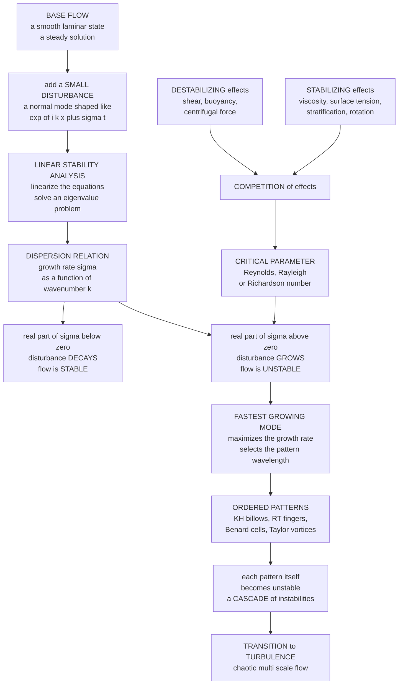

# 🌊 Hydrodynamic Instabilities

> [!abstract] TL;DR
> A **hydrodynamic instability** is a smooth (laminar) base flow that *amplifies* tiny disturbances instead of damping them — the gateway from ordered flow into swirling complexity and, ultimately, turbulence. The standard tool is **linear stability analysis**: perturb the base state with a normal mode $\sim e^{ikx + \sigma t}$, linearize, and read off the **growth rate** $\sigma$ from the **dispersion relation**. If $\mathrm{Re}(\sigma) > 0$ for any wavenumber, the flow is unstable. Every instability is a **competition** between *destabilizing* effects (velocity shear, buoyancy, centrifugal force) and *stabilizing* ones (viscosity, surface tension, stable stratification, rotation); a single **control parameter** — Reynolds, Rayleigh, or Richardson number — crosses a **critical value** at onset. The classic trio: **Kelvin-Helmholtz** (shear layers roll up into billows and cat's-eyes), **Rayleigh-Taylor** (heavy-over-light fluid fingers into mushroom plumes), and **Rayleigh-Bénard** (heating from below organizes into convection cells above $Ra_c \approx 1708$). Crucially, instabilities are the *first* step in a **cascade** toward turbulence, and along the way they paint the ordered **patterns** of self-organization.

---

## Intuition

**Analogy:** Picture a perfectly smooth layer of fast air sliding over a layer of slow air. It *looks* stable — a glassy, laminar shear. But let the tiniest ripple appear at the interface. Instead of fading away, the ripple *grows*: it steepens, curls over, and rolls up into the beautiful breaking-wave billows you can actually see stacked across the sky in some clouds. That runaway amplification of a tiny disturbance is a **hydrodynamic instability** — a flow that *feeds* small perturbations rather than smoothing them out.

Nature is full of these tipping points, each with its own destabilizing agent. Heavy fluid perched on top of light fluid wants to fall through it (**Rayleigh-Taylor**, the fingers of a mushroom cloud). Two layers in relative motion want to shear apart (**Kelvin-Helmholtz**, the billows). Fluid heated from below wants to overturn (**Rayleigh-Bénard convection**, the hexagonal cells in a pan of warming oil). In every case a smooth, ordered state sits at a knife's edge, and once a control knob is turned past a critical setting, the flow tips over into growing patterns — the doorway from simple order into swirling complexity and eventually full **turbulence**.

---

## How It Works

### Core Mechanics

**1. Stability is about the fate of small disturbances.** Take a **base flow** $\bar{U}$ — a steady, smooth solution of the equations of motion (a uniform shear, two stacked fluid layers, a motionless conducting layer). Now nudge it with a small perturbation. The flow is **stable** if that disturbance *decays* back to the base state, and **unstable** if it *grows*. Instability does not require a big kick; it means the flow *manufactures* amplitude out of infinitesimal noise. This is what makes it a genuine tipping point rather than a matter of how hard you push.

**2. The outcome hinges on a single control parameter.** Whether disturbances grow or decay is governed by a dimensionless number that measures destabilizing forcing against stabilizing dissipation. Below a **critical value** the flow is stable; above it, unstable. The parameter depends on the instability:
- **Reynolds number** $Re = UL/\nu$ — inertia versus viscosity (shear-driven transition, boundary layers).
- **Rayleigh number** $Ra = g\alpha\,\Delta T\,L^3/(\nu\kappa)$ — buoyancy versus diffusion (thermal convection).
- **Richardson number** $Ri = N^2/(\partial U/\partial z)^2$ — stabilizing stratification versus destabilizing shear (a shear layer is unstable when $Ri < 1/4$).

Crossing the critical value is a **bifurcation**: the base state loses stability and a new branch of solutions (a pattern, an oscillation) takes over.

**3. Linear stability analysis — the workhorse.** The standard method makes the "small disturbance" idea quantitative:
1. Write the field as base plus perturbation, e.g. $u = \bar{U}(y) + u'(x,y,t)$.
2. Substitute into the governing equations and **linearize** — drop products of primed quantities, since they are second-order small.
3. Because the base flow is uniform in $x$ and $t$, seek **normal-mode** solutions $u' \propto e^{i k x + \sigma t}$ (a single wavenumber $k$, growth rate $\sigma$). This turns PDEs into an algebraic or ODE eigenvalue problem.
4. Solve for the **dispersion relation** $\sigma(k)$. The real part $\mathrm{Re}(\sigma)$ is the growth rate; the imaginary part is an oscillation frequency.
5. **Read the verdict.** If $\mathrm{Re}(\sigma) > 0$ for *any* $k$, the base flow is unstable. The wavenumber that maximizes $\mathrm{Re}(\sigma)$ is the **fastest-growing mode** — it dominates and sets the observed pattern's wavelength. The locus where $\mathrm{Re}(\sigma) = 0$ is the **marginal (neutral) stability curve**, and its lowest point defines the critical parameter.

**4. Instability is always a competition of effects.** Every dispersion relation encodes a tug-of-war. **Destabilizing** effects inject energy into disturbances: velocity **shear** (extracting energy from the mean flow), unstable density **stratification / buoyancy** (heavy fluid wanting to sink), and **centrifugal** force (dense fluid flung outward against an adverse gradient). **Stabilizing** effects drain that energy or resist deformation: **viscosity** (dissipating fine-scale motion — which is why short wavelengths are usually damped first), **surface tension** (penalizing curved interfaces), **stable stratification** (buoyancy restoring displaced fluid), and **rotation** (rigidity via the Taylor-Proudman constraint). The critical parameter marks exactly where destabilizing finally wins.

**5. The classic instabilities.**
- **Kelvin-Helmholtz (KH) — the shear instability.** Two fluid layers in relative motion (a velocity jump) are unstable: the interface rolls up into a periodic train of vortical **billows** or **cat's-eyes**. It is visible in *Kelvin-Helmholtz clouds*, in wind generating waves on water, in atmospheric and oceanic shear layers, and in the mixing edge of jets. Stable stratification fights it — the shear layer survives only if $Ri > 1/4$.
- **Rayleigh-Taylor (RT) — the buoyancy instability.** A **heavy** fluid resting on a **light** one (or any acceleration driving heavy into light) is unstable; the interface grows the characteristic **spikes and mushroom fingers**. The inviscid growth rate is $\sigma = \sqrt{A\,g\,k}$ with **Atwood number** $A = (\rho_2 - \rho_1)/(\rho_2 + \rho_1)$. RT shapes supernova ejecta, inertial-confinement fusion capsules, mushroom clouds, salt domes, and turbulent mixing layers.
- **Rayleigh-Bénard — the thermal instability.** A fluid layer **heated from below** becomes unstable once $Ra$ exceeds a critical value ($Ra_c \approx 1708$ for rigid boundaries, $27\pi^4/4 \approx 657.5$ for stress-free), overturning into ordered **convection cells** — rolls and hexagons. It is the paradigm of **pattern formation** and drives weather, mantle convection, and stellar granulation (links to the future sibling *Convection_and_Thermal_Fluid_Dynamics*).

**6. The wider menagerie.** Beyond the big three: **Taylor-Couette** (centrifugal instability of fluid between rotating cylinders, forming stacked **Taylor vortices**), **Rayleigh-Plateau** (a liquid jet pinching into **droplets** to minimize surface energy — why a thin faucet stream breaks up), **Richtmyer-Meshkov** (shock-driven RT, key in fusion and astrophysics), and **Tollmien-Schlichting** waves (viscous boundary-layer instability that seeds *transition*, foreshadowing *The_Boundary_Layer* and *Transition_to_Turbulence*).

**7. Instability as the route to turbulence.** This is why the subject matters so much: instabilities are the *first* step from laminar order toward **turbulence**. A flow typically undergoes a **cascade of successive instabilities** — each new pattern is itself unstable to further disturbances, spawning the next. The recognized **routes to chaos** (period-doubling, quasiperiodicity, intermittency) carry the flow through fewer and fewer degrees of order until it reaches fully developed turbulence. Along the way the ordered stages — convection cells, Taylor vortices, cloud streets, sand ripples — are the visible face of **self-organization** and **pattern selection**, connecting fluid mechanics to nonlinear dynamics and complexity theory (see *Turbulence_Fundamentals* and *Rotating_and_Stratified_Flows*).

### Flow / Architecture



---

## Key Concepts

### Secondary Level

- **Stable versus unstable.** A flow is **stable** if a tiny nudge dies away and **unstable** if the nudge grows. Balance a pencil on its point: the smallest wobble topples it — that is instability. Rest it flat: nudges do nothing — that is stability.
- **Turn a knob past a threshold.** Instabilities switch on at a **critical setting**. Heat the pan too gently and the oil sits still; heat it past a threshold and it churns into convection cells. There is a sharp on/off point.
- **The famous three.** *Shear* (fast air over slow air rolls up into cloud billows), *heavy-on-light* (a dense layer over a light one fingers downward like a mushroom cloud), and *heated-from-below* (warm fluid rising in organized cells). Same idea, different trigger.
- **Instability leads to turbulence.** Smooth flow does not jump straight to chaos. It first grows a neat pattern; that pattern then wobbles into a messier one, and so on, until the flow is fully turbulent.

### Undergraduate Level

- **Normal-mode ansatz.** Perturb the base flow and look for solutions $\propto e^{ikx + \sigma t}$. Linearizing the equations yields a **dispersion relation** $\sigma(k)$; instability means $\mathrm{Re}(\sigma) > 0$ for some $k$.
- **Marginal stability curve.** The set of parameter values where $\mathrm{Re}(\sigma) = 0$ separates stable from unstable regions. Its minimum gives the **critical** parameter and the **critical wavenumber**.
- **Kelvin-Helmholtz growth.** For a sharp inviscid interface with velocity jump $\Delta U$ and gravity, the growth rate is $\sigma = k\!\left[\tfrac{1}{4}(\Delta U)^2 - g\,\tfrac{\rho_2-\rho_1}{\rho_2+\rho_1}\tfrac{1}{k}\cdots\right]^{1/2}$-type expression; without stratification *every* wavenumber is unstable and $\sigma \propto k\,\Delta U$.
- **Rayleigh-Taylor growth.** $\sigma = \sqrt{A g k}$ with Atwood number $A$: short wavelengths grow fastest in the inviscid limit (viscosity and surface tension cut off the smallest scales, selecting a finite fastest-growing mode).
- **Rayleigh-Bénard onset.** Convection begins when $Ra > Ra_c$. For stress-free boundaries the neutral curve is $Ra(a) = (\pi^2 + a^2)^3 / a^2$, minimized at $a_c = \pi/\sqrt{2}$, giving $Ra_c = 27\pi^4/4 \approx 657.5$ (rigid boundaries give $\approx 1708$).
- **Richardson criterion.** A stratified shear layer is unstable to KH only if the gradient Richardson number $Ri < 1/4$ somewhere — the Miles-Howard theorem gives $Ri \ge 1/4$ everywhere as a *sufficient* condition for stability.

### Graduate Level

- **Orr-Sommerfeld equation.** For a viscous parallel shear flow $\bar{U}(y)$, the stream-function perturbation $\psi = \phi(y)e^{i k(x - ct)}$ obeys $(\bar{U}-c)(\phi'' - k^2\phi) - \bar{U}''\phi = \tfrac{1}{ikRe}(\phi'''' - 2k^2\phi'' + k^4\phi)$. Its inviscid limit is the **Rayleigh equation**; **Rayleigh's inflection-point theorem** and **Fjørtoft's criterion** give necessary conditions for inviscid shear instability.
- **Convective versus absolute instability.** A disturbance can grow while being swept downstream (**convective**) or grow in place, contaminating all space (**absolute**) — distinguished by the pinch-point analysis of $\sigma(k)$ in the complex $k$-plane. This governs whether a flow acts as a noise **amplifier** or a self-sustained **oscillator**.
- **Weakly nonlinear theory and amplitude equations.** Near onset, the pattern amplitude $A$ obeys a **Ginzburg-Landau** or **Stuart-Landau** equation $\dot{A} = \mu A - \ell|A|^2 A$; the sign of the cubic term sets **supercritical** (soft, continuous) versus **subcritical** (hard, hysteretic) bifurcation and hence the **pattern selection**.
- **Subcritical transition.** Plane Couette and pipe flow are *linearly stable at all* $Re$ yet turbulent in practice: the non-normal linearized operator allows large **transient (algebraic) growth** of streaks that trip nonlinear self-sustaining cycles — the modern **bypass transition** picture.
- **Squire's theorem.** For parallel shear flow the most unstable perturbation is two-dimensional, so 2D analysis suffices to find the critical $Re$ — a major simplification, though 3D transient growth dominates the actual transition.
- **Energy method.** A rigorous *lower* bound (energy Reynolds number $Re_E$) below which all disturbances decay monotonically, complementing the linear *upper* bound $Re_L$; the gap $Re_E < Re < Re_L$ is where nonlinearity decides the outcome.

---

## Python Demo

```python
# Hydrodynamic instability in two acts.
# (a) THE CRITICAL PARAMETER: Rayleigh-Benard marginal (neutral) stability
#     curve Ra_c(a) = (pi^2 + a^2)^3 / a^2, and the growth rate sigma(a) for
#     several Rayleigh numbers -- showing a BAND of unstable wavenumbers open
#     above Ra_c and a FASTEST-GROWING MODE that selects the pattern.
# (b) KELVIN-HELMHOLTZ ROLL-UP: a perturbed vortex sheet (Krasny 1986
#     desingularized periodic kernel) rolling an initially flat shear
#     interface into the classic KH billows / cat's-eyes.
import numpy as np
import matplotlib.pyplot as plt

# =====================================================================
# (a) RAYLEIGH-BENARD: marginal curve + growth rates
#     Stress-free boundaries. With k2 = pi^2 + a^2 (a = horizontal
#     wavenumber), the neutral curve is Ra_c(a) = k2^3 / a^2, and a
#     high-Prandtl growth-rate model consistent with it is
#         sigma(a) = Ra * a^2 / k2^2  -  k2
#     (sigma = 0 reproduces the marginal curve; sigma > 0 <=> Ra > Ra_c(a)).
# =====================================================================
a = np.linspace(0.4, 6.0, 600)
k2 = np.pi**2 + a**2
Ra_marg = k2**3 / a**2                       # neutral stability curve

a_c = np.pi / np.sqrt(2)                      # critical wavenumber
Ra_c = 27 * np.pi**4 / 4                       # critical Rayleigh number ~ 657.5
print(f"(a) Rayleigh-Benard, stress-free boundaries")
print(f"    critical wavenumber a_c = {a_c:.4f}")
print(f"    critical Rayleigh   Ra_c = {Ra_c:.2f}")

def growth_rate(a, Ra):
    k2 = np.pi**2 + a**2
    return Ra * a**2 / k2**2 - k2             # nondimensional growth rate

Ra_list = [400.0, Ra_c, 1500.0, 3000.0]       # sub / marginal / super / super
labels  = ["Ra = 400 (stable)", f"Ra = {Ra_c:.0f} (marginal)",
           "Ra = 1500 (unstable)", "Ra = 3000 (unstable)"]

# fastest-growing mode at the most supercritical Ra
sig_top = growth_rate(a, 3000.0)
a_fast = a[np.argmax(sig_top)]
print(f"    at Ra = 3000, fastest-growing mode a* = {a_fast:.3f}"
      f"  (sigma_max = {sig_top.max():.1f})")

# =====================================================================
# (b) KELVIN-HELMHOLTZ vortex-sheet roll-up (Krasny desingularization)
#     N point vortices over one period L = 1, each of circulation 1/N.
#     A small sinusoidal displacement seeds the instability; the sheet
#     rolls up into a cat's-eye. Velocity of the periodic desingularized
#     sheet (delta = smoothing):
#       u = -(1/2N) sum sinh(2pi dy) / [cosh(2pi dy) - cos(2pi dx) + d^2]
#       v = +(1/2N) sum sin (2pi dx) / [cosh(2pi dy) - cos(2pi dx) + d^2]
# =====================================================================
N = 200
L = 1.0
gam = np.full(N, 1.0 / N)                     # circulation per point vortex
delta = 0.5                                   # Krasny smoothing parameter

x0 = np.linspace(0.0, L, N, endpoint=False)
y0 = 0.01 * np.sin(2 * np.pi * x0 / L)        # tiny single-wavelength seed
pos = np.stack([x0, y0], axis=1)

def sheet_velocity(pos, gam, delta):
    x, y = pos[:, 0], pos[:, 1]
    dx = 2 * np.pi * (x[:, None] - x[None, :])
    dy = 2 * np.pi * (y[:, None] - y[None, :])
    denom = np.cosh(dy) - np.cos(dx) + delta**2
    u = -0.5 * (gam[None, :] * np.sinh(dy) / denom).sum(axis=1)
    v =  0.5 * (gam[None, :] * np.sin(dx)  / denom).sum(axis=1)
    return np.stack([u, v], axis=1)

def rk4_step(pos, gam, delta, dt):
    k1 = sheet_velocity(pos, gam, delta)
    k2 = sheet_velocity(pos + 0.5 * dt * k1, gam, delta)
    k3 = sheet_velocity(pos + 0.5 * dt * k2, gam, delta)
    k4 = sheet_velocity(pos + dt * k3, gam, delta)
    return pos + (dt / 6.0) * (k1 + 2 * k2 + 2 * k3 + k4)

dt, steps = 0.02, 200
pos_init = pos.copy()
for _ in range(steps):
    pos = rk4_step(pos, gam, delta, dt)
print(f"(b) Kelvin-Helmholtz: evolved {N} vortices to t = {steps*dt:.1f}")

# tile two periods so the cat's-eyes are visible
def tile(p):
    return np.concatenate([p, p + [L, 0.0]], axis=0)

# =====================================================================
# PLOTS
# =====================================================================
fig, ax = plt.subplots(2, 2, figsize=(14, 10))

# marginal stability curve
ax[0, 0].plot(a, Ra_marg, color="#1b6ca8", lw=2.2)
ax[0, 0].fill_between(a, Ra_marg, 5000, color="#d1495b", alpha=0.15)
ax[0, 0].fill_between(a, 0, Ra_marg, color="#2a9d8f", alpha=0.15)
ax[0, 0].scatter([a_c], [Ra_c], color="k", zorder=5)
ax[0, 0].annotate(f"critical point\n a_c = {a_c:.2f},  Ra_c = {Ra_c:.0f}",
                  (a_c, Ra_c), textcoords="offset points", xytext=(25, 20),
                  arrowprops=dict(arrowstyle="->"))
ax[0, 0].text(4.4, 3600, "UNSTABLE", color="#d1495b", fontweight="bold")
ax[0, 0].text(4.4, 600, "STABLE", color="#2a9d8f", fontweight="bold")
ax[0, 0].set_ylim(0, 5000)
ax[0, 0].set_xlabel("horizontal wavenumber a")
ax[0, 0].set_ylabel("Rayleigh number Ra")
ax[0, 0].set_title("Rayleigh-Benard MARGINAL STABILITY curve")

# growth-rate curves
colors = ["#6c757d", "#e9c46a", "#f4a261", "#e76f51"]
for Ra, lab, c in zip(Ra_list, labels, colors):
    ax[0, 1].plot(a, growth_rate(a, Ra), lw=2, color=c, label=lab)
ax[0, 1].axhline(0, color="k", lw=0.8)
ax[0, 1].scatter([a_fast], [sig_top.max()], color="#e76f51", zorder=5)
ax[0, 1].annotate("fastest-growing mode",
                  (a_fast, sig_top.max()), textcoords="offset points",
                  xytext=(10, -25), arrowprops=dict(arrowstyle="->"))
ax[0, 1].set_ylim(-40, 40)
ax[0, 1].set_xlabel("horizontal wavenumber a")
ax[0, 1].set_ylabel("growth rate sigma")
ax[0, 1].set_title("Growth rate: a BAND of unstable modes above Ra_c")
ax[0, 1].legend(fontsize=8)

# KH initial sheet
pi0 = tile(pos_init)
ax[1, 0].plot(pi0[:, 0], pi0[:, 1], ".", ms=3, color="#1b6ca8")
ax[1, 0].set_xlim(0, 2 * L)
ax[1, 0].set_ylim(-0.35, 0.35)
ax[1, 0].set_aspect("equal")
ax[1, 0].set_title("KH interface at t = 0: flat sheet, tiny ripple")
ax[1, 0].set_xlabel("x"); ax[1, 0].set_ylabel("y")

# KH rolled-up cat's-eyes
pf = tile(pos)
ax[1, 1].plot(pf[:, 0], pf[:, 1], ".", ms=3, color="#d1495b")
ax[1, 1].set_xlim(0, 2 * L)
ax[1, 1].set_ylim(-0.35, 0.35)
ax[1, 1].set_aspect("equal")
ax[1, 1].set_title("KH roll-up: the sheet forms cat's-eye billows")
ax[1, 1].set_xlabel("x"); ax[1, 1].set_ylabel("y")

plt.tight_layout()
plt.savefig("hydrodynamic_instabilities.png", dpi=110)
print("Saved hydrodynamic_instabilities.png")
```

**What it shows.** *Top-left:* the Rayleigh-Bénard **marginal stability curve** $Ra_c(a) = (\pi^2+a^2)^3/a^2$ carves the parameter plane into a stable region (below) and an unstable one (above); its minimum is the **critical point** $(a_c, Ra_c) \approx (2.22,\ 657.5)$ — the onset of convection. *Top-right:* the **growth rate** $\sigma(a)$ sits entirely below zero at $Ra = 400$ (all disturbances decay), just kisses zero at the critical $Ra$, and lifts a whole **band of wavenumbers** above zero as $Ra$ increases — the peak of that band is the **fastest-growing mode** that selects the convection-cell size. *Bottom row:* the **Kelvin-Helmholtz** vortex sheet starts essentially flat with a whisper of a ripple, and the same tiny seed grows and winds the interface into the signature **cat's-eye billows** — a laminar shear layer tipping into a train of vortices exactly as in the sky.

---

## Real-World Applications

> **Inertial-confinement fusion (ICF).** At the National Ignition Facility, 192 lasers implode a millimeter fuel capsule. As the dense shell is decelerated by the hot, light core, the interface is **Rayleigh-Taylor unstable** — and any imperfection in the shell or drive seeds RT spikes that puncture the hot spot and quench the burn. Suppressing RT and its shock-driven cousin **Richtmyer-Meshkov** growth (through smoother surfaces, tailored pulse shapes, and ablative stabilization) is *the* central engineering battle of the entire program.

- **Kelvin-Helmholtz clouds and clear-air turbulence.** Wind shear across a stable atmospheric layer rolls up into the wave-like *KH clouds*; the same shear layers, cloud-free, produce the sudden **clear-air turbulence** that jolts airliners in and near the jet stream (links to *Cloud_Formation_and_Microphysics* and stability via the Richardson number).
- **Supernova explosions.** As the shock races outward through a star's layered envelope, **Rayleigh-Taylor and Richtmyer-Meshkov** instabilities shred the interfaces, mixing heavy elements outward and setting the clumpy structure of remnants like the Crab and SN 1987A.
- **Stellar and planetary convection.** The Sun's outer third is **Rayleigh-Bénard-like convection** — the granulation tiling the photosphere is the fastest-growing convective mode made visible; the same instability drives Earth's mantle convection and the boiling of giant-planet interiors.
- **Ink-jet and spray breakup.** The **Rayleigh-Plateau** instability sets exactly where a liquid jet pinches into drops; ink-jet printers, fuel injectors, and agricultural sprayers are all engineered around (or against) its fastest-growing wavelength.
- **Ocean mixing.** KH billows at the base of the mixed layer and at internal-wave crests are a primary mechanism that mixes heat, salt, and nutrients across otherwise stably stratified water.

---

## Common Pitfalls

- **Confusing "stability" with "smallness of the disturbance."** Instability is defined by whether an *infinitesimal* perturbation grows, not by how large the kick is. A linearly stable flow can still be nonlinearly tripped into turbulence by a finite disturbance (pipe flow) — and a linearly unstable flow topples from noise alone.
- **Assuming linear stability tells the whole story.** Plane Couette and pipe flow are linearly stable at *all* Reynolds numbers, yet turbulent in practice. **Non-normal transient growth** and **subcritical / bypass transition** mean the eigenvalue verdict can be dangerously incomplete; you must consider finite-amplitude and energy-based criteria.
- **Reading growth into the imaginary part of $\sigma$.** Only $\mathrm{Re}(\sigma)$ governs growth; $\mathrm{Im}(\sigma)$ is an oscillation frequency (a traveling or standing wave). Mixing them up turns a neutrally propagating wave into a spurious "instability."
- **Ignoring the stabilizing cutoff and picking the wrong mode.** In RT and KH the *inviscid* growth rate rises without bound as $k \to \infty$. Viscosity and surface tension damp the smallest scales and select a *finite* fastest-growing wavelength — omit them and you predict nonsense at small scales.
- **Forgetting stratification in shear flows.** A shear layer that is KH-unstable in a homogeneous fluid can be completely stabilized by stable density stratification. The gradient Richardson number ($Ri \ge 1/4$ everywhere is sufficient for stability) is essential in atmospheric and oceanic flows.
- **Treating instability as the endpoint.** The first instability is only the opening move. Real transition is a **cascade** of successive instabilities and a route to chaos; the neat pattern at onset is usually itself unstable to the next stage.

Deeper development lives in the not-yet-written siblings *Transition_to_Turbulence* (bypass transition, the routes to chaos), *Turbulence_Fundamentals* and the Kolmogorov cascade, *The_Boundary_Layer* (Tollmien-Schlichting waves and separation), *Convection_and_Thermal_Fluid_Dynamics* (Rayleigh-Bénard beyond onset), and *Rotating_and_Stratified_Flows* (Taylor-Couette, baroclinic and centrifugal instabilities).

---

## Related Concepts

- [[The_Navier_Stokes_Equations]] — the governing equations that get linearized about a base flow; instability is the birth of their non-trivial solutions.
- [[Euler_Equations_and_Inviscid_Flow]] — the inviscid limit where KH and RT instabilities appear in their purest form, before viscosity supplies the small-scale cutoff.
- [[Vorticity_and_Circulation]] — KH roll-up *is* the concentration of interfacial vorticity into discrete vortices; the point-vortex sheet in the demo makes this explicit.
- [[Dimensional_Analysis_and_Similarity]] — where the Reynolds, Rayleigh, and Richardson control numbers come from, and why a single dimensionless parameter governs onset.
- [[Fluid_Statics_and_Buoyancy]] — the buoyancy of heavy-over-light stratification that powers Rayleigh-Taylor and thermal convection.
- [[Bifurcations_and_Tipping_Points]] — crossing the critical parameter *is* a bifurcation; supercritical versus subcritical onset is the pattern-formation language of instability.
- [[Chaos_Theory_and_Sensitive_Dependence]] — the successive-instability cascade is a canonical route to deterministic chaos (period-doubling, quasiperiodicity).
- [[Emergence_and_Self_Organization]] — convection cells, Taylor vortices, and cloud streets are self-organized order emerging from a uniform unstable state.
- [[Criticality_and_Phase_Transitions]] — onset at a critical parameter is a symmetry-breaking transition, with amplitude equations echoing Landau theory.
- [[Supernovae_and_Gamma_Ray_Bursts]] — Rayleigh-Taylor and Richtmyer-Meshkov mixing shape the ejecta of exploding stars.
- [[Star_Formation]] — gravitational and thermal instabilities set which clouds collapse and how convection transports energy in young stars.
- [[Cloud_Formation_and_Microphysics]] — Kelvin-Helmholtz billow clouds and convective instability made visible in the sky.
- [[Adiabatic_Processes_and_Atmospheric_Stability]] — atmospheric stability, lapse rates, and the Richardson-number criterion for shear instability.
- [[Chaos_and_Nonlinear_Dynamics_Numerically]] — the numerical companion for simulating the routes from instability to chaos and turbulence.

---

## Review Questions

1. **Secondary:** A pan of oil sits perfectly still when warmed gently, but past a certain flame setting it suddenly organizes into a grid of churning cells. Explain, in the language of instability, what "past a certain setting" means and why the cells are the *fastest-growing* pattern rather than a random mess. Name two other everyday instabilities and their triggers.
2. **Undergraduate:** Outline the steps of **linear stability analysis** for a parallel shear flow: the normal-mode ansatz, linearization, the dispersion relation $\sigma(k)$, and the criterion for instability. Using the Rayleigh-Bénard neutral curve $Ra(a) = (\pi^2+a^2)^3/a^2$, find the critical wavenumber and critical Rayleigh number for stress-free boundaries, and explain what a "band of unstable wavenumbers" means physically above onset.
3. **Graduate:** Plane Couette flow is linearly stable at *every* Reynolds number, yet becomes turbulent in the lab. Reconcile this with linear stability theory. In your answer address the **non-normality** of the Orr-Sommerfeld/Squire operator, **transient (algebraic) growth**, the distinction between the energy stability bound $Re_E$ and the linear bound $Re_L$, and how **subcritical/bypass transition** completes the picture that eigenvalues alone miss.

---

## Sources

- Drazin, P. G. & Reid, W. H. — *Hydrodynamic Stability*, 2nd ed. Cambridge University Press (the standard graduate reference: normal modes, Orr-Sommerfeld, KH, RT, Rayleigh-Bénard).
- Chandrasekhar, S. — *Hydrodynamic and Hydromagnetic Stability*. Oxford University Press / Dover (classic derivations of Rayleigh-Bénard, Rayleigh-Taylor, and Taylor-Couette).
- Charru, F. — *Hydrodynamic Instabilities*. Cambridge University Press (modern, physically motivated treatment with pattern formation).
- Krasny, R. (1986) — "Desingularization of periodic vortex sheet roll-up," *Journal of Computational Physics* 65, 292-313 (the vortex-sheet method used in the demo).
- Kundu, Cohen & Dowling — *Fluid Mechanics*, 6th ed., Ch. 11 (Instability). Academic Press.

---

#fluid-dynamics #hydrodynamic-instability #kelvin-helmholtz #rayleigh-taylor #rayleigh-benard
