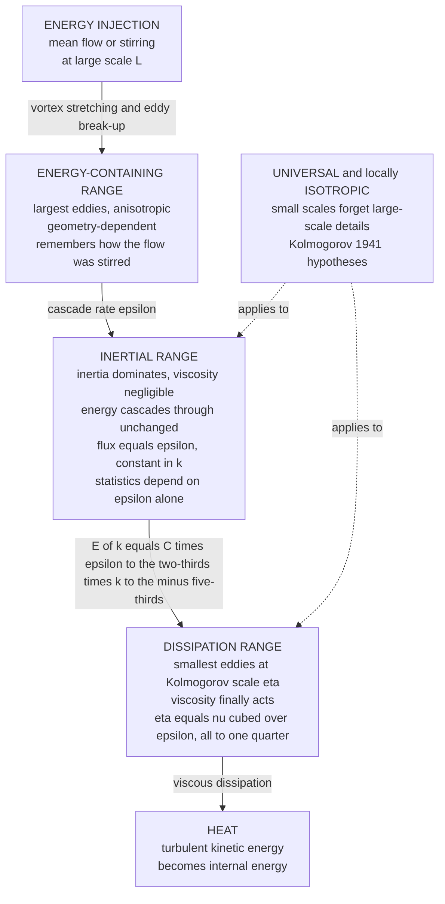

# 🌪️ Kolmogorov Theory and the Energy Cascade

> [!abstract] TL;DR
> Turbulence looks hopelessly chaotic, yet in **1941 Andrey Kolmogorov** found a universal law hidden inside it. Energy is **injected at large scales** by the mean flow or stirring; through **nonlinear interactions** (vortex stretching, eddy break-up) it **cascades** — one-way, downhill — through an **inertial range** to ever-smaller eddies, until at the **Kolmogorov dissipation scale** viscosity finally turns it into heat. Kolmogorov reasoned that these small scales *forget* how the flow was stirred and become **statistically universal and locally isotropic** (K41). Since the inertial range can depend only on the **energy dissipation rate $\varepsilon$**, pure **dimensional analysis** forces the celebrated **energy spectrum** $E(k) = C\,\varepsilon^{2/3} k^{-5/3}$ — the **"minus five-thirds law"**, confirmed spectacularly across the atmosphere, ocean, wind tunnels, and astrophysics — the **Kolmogorov length** $\eta = (\nu^3/\varepsilon)^{1/4}$, and the *exact* **4/5 law**. The brutal consequence: scales separate as $L/\eta \sim \mathrm{Re}^{3/4}$, so a full 3D simulation needs $\sim\mathrm{Re}^{9/4}$ grid points — why **direct numerical simulation** of high-Reynolds-number turbulence is astronomically expensive. Small **intermittency** corrections aside, Kolmogorov's cascade is the theoretical foundation of turbulence.

---

## Intuition

**Analogy:** Turbulence looks like pure chaos — a churning, unpredictable mess with no rules. Yet hidden inside that chaos is one of the most beautiful universal laws in all of physics. Picture pouring cream into coffee and stirring: your spoon injects energy into *big* swirls, those big swirls spin off *smaller* swirls, which spin off *smaller* ones still, until the tiniest whorls are so fine that the coffee's stickiness (viscosity) smears them into warmth. Lewis Fry Richardson captured it in 1922 in a rhyme parodying Jonathan Swift:

> *"Big whorls have little whorls that feed on their velocity,*
> *and little whorls have lesser whorls and so on to viscosity."*

Kolmogorov's leap was this: the *tiny* whorls at the bottom of the cascade have been handed down through so many generations that they **forget the messy details of how the flow was originally stirred**. A teacup, a jet engine, and a galaxy stir their fluid completely differently at the top — but far down the cascade, the small eddies all look **statistically the same**. From that single idea, plus the observation that the small scales can only "know" one number — the rate $\varepsilon$ at which energy is flowing down the cascade — Kolmogorov derived, from pure dimensional bookkeeping and *not one equation solved*, the famous **minus five-thirds** energy spectrum. Turbulence obeys it astonishingly well across a dozen decades of scales, from millimetres in a wind tunnel to light-years in interstellar gas.

---

## How It Works

### Core Mechanics

**1. The energy cascade — the central picture of turbulence.** Energy enters a turbulent flow at **large scales** $L$ (the size of the object stirring it: a propeller, a mountain range, a supernova blast). The large eddies are unstable and break up, transferring their energy to smaller eddies through **nonlinear inertial interactions** — chiefly **vortex stretching**, where a spinning vortex tube is stretched thin by the surrounding strain and, conserving angular momentum like an ice skater pulling in their arms, spins faster and shrinks (this is developed in [[Vorticity_and_Circulation]]). Those smaller eddies break up in turn, and so on. Energy flows **one way, downhill** through scale after scale — it does not run back up. At the very smallest scales the velocity gradients become so steep that **viscosity** finally dominates and converts the kinetic energy into heat: **dissipation**. In statistical steady state, the rate energy is injected at the top equals the rate $\varepsilon$ it cascades through the middle equals the rate it is dissipated at the bottom.

**2. The three ranges — the spectral anatomy.** Sorting eddies by size (equivalently by wavenumber $k \sim 1/\text{eddy size}$) reveals three regimes:

- **Energy-containing range** (large eddies, small $k$): where the energy lives and is injected. These eddies are **anisotropic** and **geometry-dependent** — a boundary layer, a jet, and a wake look different here because the large scales *remember* how the flow was created. This range is *not* universal.
- **Inertial range** (intermediate $k$): the heart of the theory. Here inertia dominates and viscosity is negligible, so eddies neither gain energy from injection nor lose it to heat — energy simply **cascades through**, and the flux is **conserved and equal to $\varepsilon$** at every scale. This is where **universality lives**.
- **Dissipation range** (smallest eddies, large $k$): where viscosity finally acts, velocity gradients are steepest, and kinetic energy becomes heat. Its size is set by the Kolmogorov scale $\eta$.

**3. Kolmogorov's 1941 hypotheses (K41) — the brilliant reasoning.** Three postulates turn the cascade picture into a quantitative law:

- **(Local isotropy / universality.)** At sufficiently high Reynolds number, the **small-scale** motions are statistically **isotropic** and **universal** — they have forgotten the orientation and the large-scale details of how the flow was stirred. The mess of the geometry is confined to the big eddies; the small ones are democratic.
- **(First similarity hypothesis.)** The statistics of the small scales depend on only **two** parameters: the energy dissipation rate $\varepsilon$ and the kinematic viscosity $\nu$. Everything about the small eddies is fixed once you know how fast energy arrives and how sticky the fluid is.
- **(Second similarity hypothesis.)** In the **inertial range** specifically — scales much smaller than $L$ but much larger than the dissipation scale — viscosity is irrelevant, so the statistics depend on **$\varepsilon$ alone**. This is the master stroke: throwing away $\nu$ leaves a single dimensional parameter and forces a power law.

**4. The Kolmogorov scales — the size of the smallest eddies.** In the dissipation range the only relevant quantities are $\varepsilon$ (units $L^2 T^{-3}$) and $\nu$ (units $L^2 T^{-1}$). There is exactly **one** length, one time, and one velocity you can build from them — **dimensional analysis leaves no freedom**:
$$\eta = \left(\frac{\nu^3}{\varepsilon}\right)^{1/4}, \qquad \tau_\eta = \left(\frac{\nu}{\varepsilon}\right)^{1/2}, \qquad u_\eta = (\nu\varepsilon)^{1/4}.$$
$\eta$ is the **Kolmogorov length** — the size of the smallest eddies, where the eddy Reynolds number $u_\eta\eta/\nu = 1$ and inertia finally hands off to viscosity. As the flow becomes more turbulent (higher $\mathrm{Re}$), $\eta$ **shrinks** and the smallest whorls get finer and finer.

**5. The famous $-5/3$ spectrum — the crown jewel.** In the inertial range the energy spectrum $E(k)$ (energy per unit wavenumber, units $L^3 T^{-2}$) can depend only on $\varepsilon$ and $k$. There is exactly one combination with the right dimensions:
$$\boxed{\,E(k) = C\,\varepsilon^{2/3}\,k^{-5/3}\,}$$
with $C \approx 1.5$ the universal **Kolmogorov constant**. That is the **minus five-thirds law** — derived, once again, from dimensions alone. It has been confirmed spectacularly across nature: tidal-channel and atmospheric measurements, wind tunnels, the ocean, and astrophysical plasmas all show a clean $k^{-5/3}$ slope over many decades. The equivalent statement in physical space is the **two-thirds law**: the second-order structure function, the mean-square velocity difference across a separation $r$, scales as $\langle(\delta u)^2\rangle \sim (\varepsilon r)^{2/3}$.

**6. The Kolmogorov 4/5 law — a rare exact result.** Almost everything in turbulence is a hypothesis or a model. One statement is **exact**, derived directly from the Navier–Stokes equations in the limit $\mathrm{Re}\to\infty$: the **third-order** longitudinal structure function obeys
$$\langle (\delta u_\parallel)^3 \rangle = -\tfrac{4}{5}\,\varepsilon\, r.$$
The negative sign encodes the **one-way, downhill** direction of the cascade (energy flows to small scales). The **4/5 law** is the rigorous backbone of the whole theory — the one non-trivial, exact statistical law of turbulence — and every model must be consistent with it.

**7. The scale-separation consequence — the computational curse.** The ratio of the largest eddy to the smallest is a pure power of the Reynolds number $\mathrm{Re} = uL/\nu$ (built with the large-eddy velocity $u$ and size $L$). Estimating $\varepsilon \sim u^3/L$ and substituting into $\eta = (\nu^3/\varepsilon)^{1/4}$ gives
$$\frac{L}{\eta} \sim \mathrm{Re}^{3/4}.$$
To resolve a turbulent flow in a **direct numerical simulation (DNS)** you need grid points spaced at $\eta$ across a box of size $L$ in **all three dimensions**, plus time steps of size $\tau_\eta$. The number of spatial degrees of freedom therefore scales as
$$N_{\text{dof}} \sim \left(\frac{L}{\eta}\right)^3 \sim \mathrm{Re}^{9/4}, \qquad \text{total cost (with time-stepping)} \sim \mathrm{Re}^{3}.$$
At a modest $\mathrm{Re}=10^6$ this is $\sim 10^{13}$ grid points — infeasible for most real engineering and geophysical flows. This is **why DNS is astronomically expensive**, and why practitioners turn to **turbulence modelling** — RANS and LES, the subject of [[Turbulence_Modeling_RANS_LES_DNS]] — and to *Computational_Fluid_Dynamics* more broadly.

**8. Intermittency — the honest caveat.** K41 is *not* exact. Real turbulence is **intermittent**: dissipation is not spread smoothly but is spatially **patchy and bursty**, concentrated in thin vortex filaments and sheets. This causes small but real **deviations** from K41, seen as **anomalous scaling** of higher-order structure functions $\langle(\delta u)^p\rangle \sim r^{\zeta_p}$, where the exponents $\zeta_p$ bend away from the K41 prediction $p/3$ — a **multifractal** signature. Kolmogorov himself proposed a refinement in **1962 (K62)**, a log-normal model for the fluctuating local dissipation, and modern **multifractal models** (She–Lévêque and others) capture the anomalous exponents remarkably well. Intermittency remains a frontier of turbulence theory, but the corrections are *small*: the $-5/3$ spectrum is barely nudged (the measured slope is closer to $-1.71$ than $-1.67$).

**9. Two dimensions — the inverse cascade.** In strictly **2D** flow there is **no vortex stretching** (the stretching term vanishes), and the physics flips. Energy cascades **upscale** — the **inverse cascade** — with small eddies *merging* into larger ones, while a second conserved quantity, **enstrophy** (mean-square vorticity), cascades *downscale*. This is why large-scale geophysical flows self-organize into coherent giants: the broad jets and eddies of the atmosphere and ocean, and **Jupiter's Great Red Spot**, a vortex that has persisted for centuries. 2D and 3D turbulence are **fundamentally different beasts** — a caution against blindly applying cascade intuition across dimensions.

### Flow / Architecture



---

## Key Concepts

### Secondary Level

- **Big whorls to little whorls.** Turbulence hands energy down from big swirls to smaller and smaller ones, until the tiniest are so fine that the fluid's stickiness turns them into heat. Energy only flows *one way* — downhill.
- **The chaos has a rule.** However you stir it, the smallest swirls all look the same statistically — they forget the big picture. That hidden sameness is *universality*, and it lets one law describe turbulence in a teacup, a jet engine, and a galaxy.
- **One magic exponent.** The amount of swirl energy at each size follows a power law with a special slope — "minus five-thirds" — that nature obeys astonishingly well.
- **Why weather is hard to simulate.** Turbulence has swirls of every size at once. The faster the flow, the wider that range, and simulating *all* the sizes becomes impossibly expensive — one reason perfect weather and engineering predictions are so costly.

### Undergraduate Level

- **The cascade and $\varepsilon$.** In steady state, injection rate $=$ inter-scale flux $=$ dissipation rate $= \varepsilon$ (units $\mathrm{m^2\,s^{-3}}$). Estimate $\varepsilon \sim u^3/L$ from the large eddies — remarkably, dissipation is set by the *large* scales even though it *happens* at the small ones.
- **The three ranges.** Energy-containing (large, anisotropic, non-universal) $\to$ inertial (universal, $\varepsilon$-only) $\to$ dissipation (viscous). The inertial range is where the $-5/3$ law holds.
- **The $-5/3$ spectrum by dimensions.** Require $E(k) = f(\varepsilon, k)$. With $[E]=L^3T^{-2}$, $[\varepsilon]=L^2T^{-3}$, $[k]=L^{-1}$, the only dimensionally consistent form is $E(k)=C\,\varepsilon^{2/3}k^{-5/3}$. No equations solved — just units.
- **Kolmogorov microscales.** $\eta=(\nu^3/\varepsilon)^{1/4}$, $\tau_\eta=(\nu/\varepsilon)^{1/2}$, $u_\eta=(\nu\varepsilon)^{1/4}$; the eddy Reynolds number at $\eta$ is exactly $1$.
- **Structure functions.** $\langle(\delta u)^2\rangle\sim(\varepsilon r)^{2/3}$ (the two-thirds law, physical-space partner of $-5/3$) and the *exact* $\langle(\delta u_\parallel)^3\rangle=-\tfrac{4}{5}\varepsilon r$ (the 4/5 law).
- **Scale separation.** $L/\eta\sim\mathrm{Re}^{3/4}$, so DNS needs $N\sim\mathrm{Re}^{9/4}$ grid points and $\sim\mathrm{Re}^{3}$ total operations. This single scaling explains the existence of the entire turbulence-modelling industry.

### Graduate Level

- **Richardson–Kolmogorov as an inertial-range fixed point.** The cascade is a nonlinear transfer of energy in Fourier space that is *local* in scale (each eddy mostly feeds its near-neighbours). The spectral energy budget $\partial_t E(k) = T(k) - 2\nu k^2 E(k) + F(k)$ has, in the inertial range, $T(k)=$ constant flux $\Pi(k)=\varepsilon$, from which the $-5/3$ form follows.
- **The 4/5 law from Kármán–Howarth.** For homogeneous isotropic turbulence, the Kármán–Howarth–Monin relation reduces, in the inertial range and the limit $\nu\to0$, to $\langle(\delta u_\parallel)^3\rangle=-\tfrac45\varepsilon r$ — a rigorous consequence of Navier–Stokes, independent of any closure. It is the one exact non-trivial law and the anchor for all modelling.
- **Anomalous scaling and intermittency.** K41 predicts $\zeta_p=p/3$; measurements show $\zeta_p$ is **concave** in $p$ (e.g. $\zeta_6<2$), signalling multifractality. K62 (log-normal, with intermittency exponent $\mu\approx0.25$) gives $\zeta_p=p/3 - \tfrac{\mu}{18}p(p-3)$; the **She–Lévêque** model $\zeta_p=p/9 + 2\big(1-(2/3)^{p/3}\big)$ fits data with no free parameters. The **dissipative anomaly** — finite $\varepsilon$ as $\nu\to0$ — underlies Onsager's conjecture and the modern rigorous programme (Onsager criticality, weak solutions of Euler).
- **2D turbulence and the dual cascade.** With no vortex stretching, enstrophy $\langle\omega^2\rangle$ is inviscidly conserved. Kraichnan (1967) predicted a **dual cascade**: an **inverse energy cascade** to large scales with $E(k)\sim\varepsilon^{2/3}k^{-5/3}$ *below* the forcing wavenumber, and a **forward enstrophy cascade** to small scales with $E(k)\sim\eta_\Omega^{2/3}k^{-3}$ *above* it. This underlies large-scale geostrophic and quasi-geostrophic dynamics.
- **The closure problem.** Averaging Navier–Stokes generates the unclosed Reynolds stress; every statistical moment depends on the next-higher one (the moment hierarchy never closes). K41 sidesteps closure by *dimensional* and *symmetry* arguments — its power and its limitation.
- **Cost scaling, precisely.** DNS spatial DOF $\sim\mathrm{Re}^{9/4}$; with an explicit time step limited by $\tau_\eta$ (CFL), total work $\sim\mathrm{Re}^{3}$. LES resolves only down to an inertial-range cutoff and *models* the sub-grid flux using the universality of the small scales — Kolmogorov's theory is precisely what makes sub-grid modelling possible.

---

## Python Demo

```python
# Kolmogorov's 1941 theory in two acts.
#   (A) THE -5/3 SPECTRUM. Synthesize a turbulent-like 1D velocity field whose
#       ENERGY SPECTRUM is prescribed as (i) a large-scale energy-containing
#       hump ~ k^4, (ii) an INERTIAL RANGE that falls off as k^(-5/3), and
#       (iii) an exponential viscous cutoff at the Kolmogorov scale. Each mode
#       is given a random complex Gaussian amplitude (realistic scatter). We
#       then MEASURE the spectrum back from the field and FIT the inertial-range
#       slope -- recovering -5/3.  The three ranges are shaded on the plot.
#   (B) SCALE SEPARATION and DNS COST. The ratio of largest to smallest eddy
#       grows as L/eta ~ Re^(3/4); a full 3D DNS needs N ~ Re^(9/4) grid points.
#       Plotting these shows WHY high-Reynolds-number turbulence is
#       astronomically expensive to simulate.
import numpy as np
import matplotlib.pyplot as plt

rng = np.random.default_rng(1)

# =====================================================================
# PART A -- synthesize a field with a von-Karman/Pao-like model spectrum
# =====================================================================
N = 1 << 16                      # samples (2^16) -> wide scale range
L_box = 2 * np.pi                # domain length
dx = L_box / N
x = np.arange(N) * dx

k = 2 * np.pi * np.fft.rfftfreq(N, d=dx)   # wavenumbers for a real FFT
k[0] = 1e-12                                 # avoid divide-by-zero at k=0

kL = 2 * np.pi / (L_box / 6)      # energy-containing wavenumber (large eddies)
keta = 2 * np.pi / (L_box / 2000) # Kolmogorov (dissipation) wavenumber

# model spectrum:  k^4 low-k roll-off  *  k^(-5/3) inertial  *  viscous cutoff
# for k >> kL:  k^4 / (kL^2 + k^2)^(17/6)  ->  k^(4 - 17/3) = k^(-5/3)
E_model = (k**4 / (kL**2 + k**2)**(17.0/6.0)) * np.exp(-(k / keta)**2)
E_model[0] = 0.0

# random-phase, random-amplitude field: |u_hat(k)|^2 ~ E(k) with real scatter
gauss = rng.standard_normal(k.shape) + 1j * rng.standard_normal(k.shape)
u_hat = np.sqrt(E_model / 2.0) * gauss
u = np.fft.irfft(u_hat, n=N)        # real turbulent-like velocity signal

# MEASURE the spectrum back from the synthesized signal
U = np.fft.rfft(u) / N
E_meas = np.abs(U)**2

# fit the -5/3 slope in the INERTIAL RANGE only (well above kL, below keta)
inertial = (k > 3 * kL) & (k < 0.15 * keta)
slope, intercept = np.polyfit(np.log(k[inertial]), np.log(E_meas[inertial]), 1)
print(f"Fitted inertial-range slope = {slope:.3f}   (Kolmogorov predicts -1.667)")

# Kolmogorov length from the imposed cutoff wavenumber, and the flux idea
eta = 2 * np.pi / keta
print(f"Kolmogorov length eta        = {eta:.3e}   (smallest eddy size)")
print(f"Scale range L/eta in this field ~ {(2*np.pi/kL)/eta:.0f}")
print("In the inertial range the cascade FLUX epsilon is constant across k:")
print("  energy enters at large scales and leaves only at eta -- nothing")
print("  is added or removed in between, so E(k) ~ epsilon^(2/3) k^(-5/3).")

# =====================================================================
# PART B -- scale separation and DNS cost versus Reynolds number
# =====================================================================
Re = np.logspace(2, 9, 200)
scale_sep = Re**(3.0/4.0)         # L / eta
dof_3d = Re**(9.0/4.0)            # 3D DNS grid points

Re_ex = 1.0e6
print(f"\nAt Re = {Re_ex:.0e}:")
print(f"  scale separation L/eta = {Re_ex**0.75:.2e}")
print(f"  3D DNS grid points     = {Re_ex**2.25:.2e}   (per time step!)")

# =====================================================================
# PLOTS
# =====================================================================
fig, ax = plt.subplots(1, 2, figsize=(15, 6))

# (A) the -5/3 energy spectrum with the three ranges shaded
ax[0].loglog(k[1:], E_meas[1:], color="#9aa0a6", lw=0.5, alpha=0.7,
             label="measured E(k) from field")
ax[0].loglog(k[1:], E_model[1:], color="#1b6ca8", lw=2.2,
             label="model spectrum")
# clean -5/3 reference line anchored in the inertial range
kk = k[inertial]
ref = np.exp(intercept) * kk**(-5.0/3.0) * 6.0
ax[0].loglog(kk, ref, "k--", lw=1.6, label="slope -5/3 reference")
ax[0].axvspan(k[1], 3 * kL, color="#2a9d8f", alpha=0.12)
ax[0].axvspan(3 * kL, 0.15 * keta, color="#e9c46a", alpha=0.20)
ax[0].axvspan(0.15 * keta, k[-1], color="#e76f51", alpha=0.15)
ax[0].text(1.4 * k[1], 3e-4, "energy-\ncontaining", fontsize=9)
ax[0].text(5 * kL, 2e-7, "inertial range\nk^(-5/3)", fontsize=9)
ax[0].text(0.22 * keta, 1e-12, "dissipation\nrange", fontsize=9)
ax[0].set_xlabel("wavenumber  k")
ax[0].set_ylabel("energy spectrum  E(k)")
ax[0].set_title(f"Kolmogorov -5/3 spectrum   (fitted slope {slope:.2f})")
ax[0].legend(fontsize=8, loc="lower left")
ax[0].grid(alpha=0.3, which="both")

# (B) scale separation and DNS cost vs Re
ax[1].loglog(Re, scale_sep, color="#1b6ca8", lw=2.2,
             label="scale separation  L/eta ~ Re^(3/4)")
ax[1].loglog(Re, dof_3d, color="#d1495b", lw=2.2,
             label="3D DNS grid points ~ Re^(9/4)")
ax[1].axvline(Re_ex, color="k", ls=":", lw=1.2)
ax[1].text(Re_ex * 1.3, 5e2, "Re = 1e6", fontsize=9)
ax[1].scatter([Re_ex], [Re_ex**2.25], color="#d1495b", zorder=5)
ax[1].annotate(f"{Re_ex**2.25:.0e}\ngrid points",
               xy=(Re_ex, Re_ex**2.25), xytext=(3e4, 1e12), fontsize=8,
               arrowprops=dict(arrowstyle="->", color="k"))
ax[1].set_xlabel("Reynolds number  Re")
ax[1].set_ylabel("ratio  /  degrees of freedom")
ax[1].set_title("Why high-Re DNS is astronomically expensive")
ax[1].legend(fontsize=9, loc="upper left")
ax[1].grid(alpha=0.3, which="both")

plt.tight_layout()
plt.savefig("kolmogorov_cascade.png", dpi=110)
print("\nSaved kolmogorov_cascade.png")
```

**What it shows.** *Part A* builds a synthetic "turbulent" velocity signal whose spectrum is engineered to have the three Kolmogorov ranges, then **measures the spectrum back** and fits the middle: the recovered slope lands near **$-1.67$**, reproducing the minus-five-thirds law from noisy, single-realization data — exactly what an experimentalist does with a hot-wire anemometer trace. The three shaded bands are the energy-containing ($k^4$ hump), inertial ($k^{-5/3}$ straight line on log-log axes), and dissipation (exponential fall-off) ranges. *Part B* is the sobering counterpart: as Reynolds number climbs, the scale separation $L/\eta$ grows only as $\mathrm{Re}^{3/4}$, but the **3D grid-point count explodes as $\mathrm{Re}^{9/4}$** — at $\mathrm{Re}=10^6$ you already need $\sim10^{13}$ points *per time step*, which is why direct numerical simulation of most real flows is out of reach and why turbulence *modelling* exists.

---

## Real-World Applications

> **Example — Large-Eddy Simulation (LES) in weather, engineering, and film.** LES resolves the large, energy-containing eddies directly on the grid but stops at an inertial-range cutoff and **models** the unresolved sub-grid scales. This only works *because* of Kolmogorov: the small scales are **universal and locally isotropic**, so a simple, universal sub-grid model (Smagorinsky and its descendants, calibrated to drain energy at the rate $\varepsilon$ set by the resolved strain) can stand in for eddies the grid cannot see. LES powers modern aircraft and engine design, atmospheric boundary-layer forecasting, wildfire and pollutant-plume prediction, and even the swirling smoke and water in animated films — all resting on the $-5/3$ cascade.

- **Atmospheric science and dispersion.** The observed atmospheric energy spectrum shows a clear $-5/3$ inertial range, and the $\langle(\delta u)^2\rangle\sim(\varepsilon r)^{2/3}$ law governs how pollutant and volcanic-ash clouds spread — Richardson's original relative-dispersion law $\langle r^2\rangle\sim\varepsilon t^3$ comes straight from the cascade. Turbulent transport and mixing are developed in the sibling note *Mixing_Dispersion_and_Turbulent_Transport*.
- **Aeronautics and CFD.** Reynolds numbers on an airliner wing reach $\sim10^7$–$10^8$, where DNS is hopeless ($\mathrm{Re}^{9/4}\sim10^{18}$ points), so all industrial *Computational_Fluid_Dynamics* uses RANS or LES turbulence models whose closures are built on inertial-range universality.
- **Astrophysical turbulence.** The **interstellar medium** shows a "big power law in the sky" — an electron-density spectrum close to Kolmogorov over roughly *twelve decades* of scale — regulating star formation, cosmic-ray scattering, and magnetic-field amplification. Turbulent (magnetorotational) stresses transport angular momentum in **accretion disks**, letting matter spiral onto stars and black holes.
- **Oceanography.** Ocean microstructure profilers infer the turbulent dissipation rate $\varepsilon$ directly by fitting the measured shear spectrum to the universal Kolmogorov (and Batchelor) form — the standard way to quantify ocean mixing.
- **Two-dimensional / geophysical flows.** The **inverse cascade** explains why large-scale atmospheric and oceanic motions self-organize into broad jets and long-lived eddies, and why **Jupiter's Great Red Spot** endures — energy piling up at large scales rather than dissipating.

---

## Common Pitfalls

- **"Dissipation happens at large scales because that's where the energy is."** Backwards. Energy is *injected* at large scales but *dissipated* at the tiny Kolmogorov scale $\eta$. What the large scales set is the *rate* $\varepsilon\sim u^3/L$ — dissipation is controlled by the big eddies but physically occurs at the smallest ones.
- **Thinking $\varepsilon$ depends on viscosity.** In fully developed turbulence $\varepsilon$ is fixed by the *large-scale* energy supply and is essentially **independent of $\nu$** (the dissipative anomaly: $\varepsilon\to$ constant as $\nu\to0$). Lowering viscosity does not lower dissipation — it just pushes $\eta$ smaller so the same energy is dissipated by finer, faster eddies.
- **Reading $-5/3$ as a slope in frequency without invoking Taylor's hypothesis.** Probes measure a *time* series; converting the frequency spectrum to a *wavenumber* spectrum assumes **Taylor's frozen-turbulence hypothesis** ($k\approx2\pi f/\bar U$), valid only when turbulence intensity is low. Skip it and your "$-5/3$" is mislabelled.
- **Applying 3D cascade intuition to 2D flow.** In 2D there is no vortex stretching; energy cascades *upward*, not downward. Expecting a forward energy cascade in a 2D or quasi-2D geophysical simulation gives the wrong sign of the energy flux entirely.
- **Believing K41 is exact.** It is a leading-order, mean-field theory. **Intermittency** bends the higher-order structure-function exponents away from $p/3$ (multifractality), and the spectral slope is measured slightly steeper than $-5/3$. The *only* exact statement is the **4/5 law**.
- **Fitting the slope over the wrong band.** The $-5/3$ law lives *strictly* in the inertial range. Fit too close to the forcing scale (energy-containing $k^4$ hump) or into the viscous roll-off and you will recover a bogus exponent. A clean inertial range needs a high enough Reynolds number to *have* one.
- **Confusing eddy size with wavenumber direction.** Large eddies are **small** $k$; small eddies are **large** $k$. The cascade runs from small $k$ to large $k$ (large eddies to small), which on the spectrum plot means energy flows *left to right*.

Related development lives in the sibling notes [[Turbulence_Fundamentals]] (transition, the Reynolds decomposition, the closure problem), [[Turbulence_Modeling_RANS_LES_DNS]] (how the cascade is exploited or bypassed computationally), *Mixing_Dispersion_and_Turbulent_Transport* (how the cascade stirs scalars), and *Computational_Fluid_Dynamics* (the numerical machinery).

---

## Related Concepts

- [[Turbulence_Fundamentals]] — the parent overview of turbulent flow (transition, Reynolds decomposition, the closure problem) that the cascade sits inside.
- [[Turbulence_Modeling_RANS_LES_DNS]] — the direct payoff of the $\mathrm{Re}^{9/4}$ cost scaling: why DNS is limited and how RANS/LES exploit small-scale universality.
- [[Transition_to_Turbulence]] — how a laminar flow becomes turbulent in the first place, upstream of the fully developed cascade.
- [[Hydrodynamic_Instabilities]] — the instabilities (Kelvin–Helmholtz and friends) that seed the eddies feeding the cascade.
- [[Vorticity_and_Circulation]] — **vortex stretching** is the physical engine of the 3D cascade; its absence in 2D is exactly why the inverse cascade appears.
- [[Turbulence_and_Instabilities]] — the Physics-vault companion picture of transition to turbulence and the flows in which the cascade operates.
- [[Viscous_Fluids_and_Navier_Stokes]] — the equations whose nonlinear term drives the cascade and whose viscous term sets the dissipation scale $\eta$; the 4/5 law is derived directly from them.
- [[Dimensional_Analysis_and_Similarity]] — K41 *is* dimensional analysis; the $-5/3$ spectrum and $\eta=(\nu^3/\varepsilon)^{1/4}$ fall out of units and the Reynolds number alone.
- [[Euler_Equations_and_Ideal_Fluids]] — the inviscid limit that governs the inertial range (viscosity irrelevant); Onsager's dissipative-anomaly ideas live here.
- [[Fractals_and_Self_Similarity]] — the cascade is scale-self-similar, and intermittency makes it **multifractal** — the same scaling language describes both.
- [[Chaos_Theory_and_Sensitive_Dependence]] — turbulence is spatiotemporal chaos; the cascade is the statistical order that survives the underlying sensitivity.
- [[Criticality_and_Phase_Transitions]] — power-law spectra and anomalous scaling exponents echo the scale invariance of critical phenomena.
- [[Frequency_Spectrum]] — the energy spectrum $E(k)$ is a spatial power spectral density; experimental turbulence spectra are measured this way.
- [[Fourier_Transform]] — the cascade is naturally described in wavenumber space, where "eddies of size $\ell$" become Fourier modes $k\sim1/\ell$.
- [[Spectral_Methods_and_the_FFT]] — pseudo-spectral codes are the workhorse of turbulence DNS; the $-5/3$ demo here uses the same FFT machinery.
- [[Magnetohydrodynamics]] — MHD turbulence extends the cascade to magnetized plasmas (Iroshnikov–Kraichnan and Goldreich–Sridhar spectra) in the ISM and solar wind.
- [[Atmospheric_Boundary_Layer]] — where the atmospheric $-5/3$ spectrum is routinely observed and $\varepsilon$ is measured.
- [[The_Interstellar_Medium]] — astrophysical turbulence showing a near-Kolmogorov spectrum across a dozen decades of scale.
- [[Accretion_Disks_and_X_ray_Binaries]] — turbulent stresses transport angular momentum, letting matter accrete onto compact objects.

---

## Review Questions

1. **(Secondary / conceptual)** Explain in your own words why the tiniest swirls in a stirred cup of coffee, a jet engine, and a galaxy can all "look the same" statistically, even though the three flows are stirred in completely different ways. What is this property called, and why does it make a single universal law of turbulence possible?
2. **(Undergraduate / scenario)** Using *only* dimensional analysis, derive the form of the inertial-range energy spectrum $E(k)$ assuming it depends solely on the energy dissipation rate $\varepsilon$ and the wavenumber $k$. Then derive the Kolmogorov length $\eta$ from $\varepsilon$ and $\nu$. Given a laboratory flow with $\varepsilon = 10^{-2}\,\mathrm{m^2\,s^{-3}}$ and $\nu = 10^{-6}\,\mathrm{m^2\,s^{-1}}$, estimate $\eta$ and explain what physically happens at that scale.
3. **(Graduate / trade-off)** A colleague proposes to directly simulate (DNS) the airflow over a full-scale wing at $\mathrm{Re}=10^7$. Estimate the number of grid points required and explain, via the $L/\eta\sim\mathrm{Re}^{3/4}$ scaling, why this is infeasible. Then explain how Large-Eddy Simulation exploits Kolmogorov's *universality* hypothesis to make the problem tractable, and state precisely which of Kolmogorov's assumptions the sub-grid model relies on. Finally, describe how **intermittency** would make you distrust a naive sub-grid model, and name one exact result that any turbulence theory must respect.

---

## Sources

- A. N. Kolmogorov, "The local structure of turbulence in incompressible viscous fluid for very large Reynolds numbers," *Doklady Akademii Nauk SSSR* **30**, 301–305 (1941); reprinted in *Proc. R. Soc. Lond. A* **434**, 9–13 (1991) — the original K41 papers.
- U. Frisch, *Turbulence: The Legacy of A. N. Kolmogorov*, Cambridge University Press (1995) — the definitive modern account of the cascade, the 4/5 law, and intermittency.
- S. B. Pope, *Turbulent Flows*, Cambridge University Press (2000) — Ch. 6, the energy cascade, Kolmogorov hypotheses, model spectra, and DNS/LES cost scaling.
- P. A. Davidson, *Turbulence: An Introduction for Scientists and Engineers*, 2nd ed., Oxford University Press (2015) — vortex stretching as the cascade engine; 2D vs 3D.
- R. H. Kraichnan, "Inertial ranges in two-dimensional turbulence," *Physics of Fluids* **10**, 1417–1423 (1967) — the dual (inverse energy / forward enstrophy) cascade in 2D.

---

#fluid-dynamics #kolmogorov #energy-cascade #turbulence-spectrum #five-thirds-law
