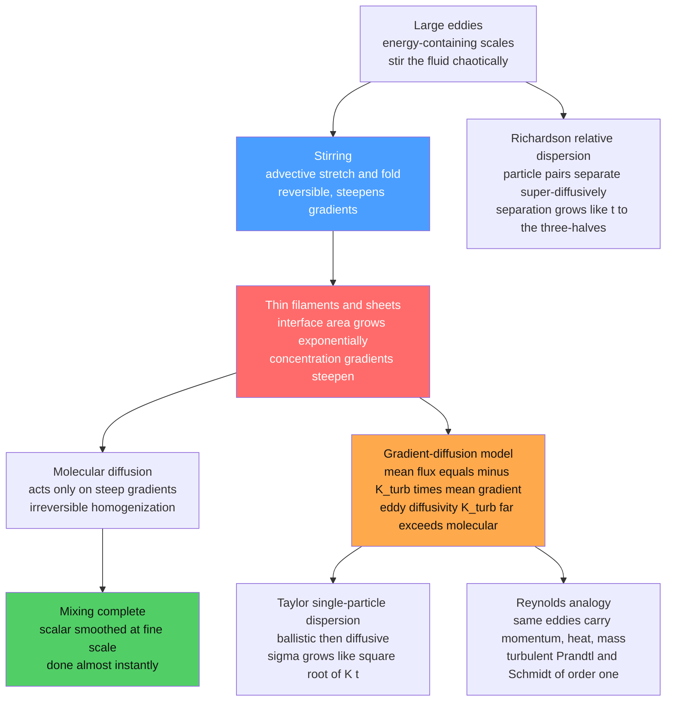

# 🌪️ Mixing, Dispersion, and Turbulent Transport

> [!abstract] TL;DR
> Turbulence's single most consequential *practical* effect is that it **transports and mixes momentum, heat, and mass astronomically faster than molecular diffusion alone**. The mechanism is **stir-then-diffuse**: chaotic eddies **stretch and fold** a blob of scalar (dye, heat, pollutant, fuel) into ever-thinner **filaments**, exponentially amplifying its interfacial area and **steepening concentration gradients**, so that molecular diffusion — which acts only on gradients — can finish the mixing **almost instantly**. Engineers capture this with an **eddy (turbulent) diffusivity** $K_{turb} \gg \kappa_{mol}$ (a gradient-diffusion model), and the **Reynolds analogy** says the *same* eddies carry momentum, heat, and mass, so their transport coefficients are related (turbulent Prandtl/Schmidt $\sim \mathcal{O}(1)$). This governs how the **atmosphere disperses plumes** (Taylor's $\sigma \sim \sqrt{Kt}$; Richardson's pair-separation $\sim t^{3/2}$), how the **ocean carries heat and carbon**, how **engines mix fuel to burn**, and how pollutants and pathogens spread.

---

## Intuition

**Analogy:** Pour a drop of milk into black coffee and *do not touch it* — it will take **hours** for molecular diffusion to blend it in, because diffusion crawls (it moves molecules a distance $\sim\sqrt{\kappa t}$, agonizingly slow over centimetres). Now give it **one stir with a spoon**. In about a second the milk vanishes into a uniform tan. That one-second miracle is the whole story of **turbulent mixing**. The spoon (or the churning eddies of any turbulent flow) does not *itself* mix anything at the molecular level — it **stirs**, dragging the milk out into long, thin, spiralling **filaments and sheets**. Every stretch halves the filament thickness and doubles its surface area; a few stretch-and-fold cycles multiply the milk's interface by factors of thousands and squeeze the concentration gradients across it razor-sharp. And molecular diffusion, which is hopeless over centimetres but *lightning-fast* over micrometres, then wipes out those thin filaments almost instantly. **Turbulence sets up the small scales; diffusion finishes the job.**

Nature exploits this everywhere. It is how the atmosphere disperses a **smokestack's plume** across a valley, how the **ocean carries heat and carbon** into its depths, how your **lungs and a car's engine** blend gases fast enough to work, how an **odor** reaches you across a room — and, darkly, how a **pollutant, an ash cloud, or an airborne pathogen** spreads through a crowd. Get mixing wrong and a jet engine misfires, a chemical reactor stalls, or a climate model mispredicts the carbon sink. This note is the turbulence sibling of *Turbulence_Fundamentals* and *Kolmogorov_Theory_and_the_Energy_Cascade*: those explain the eddies and the cascade; this one explains what the eddies *do* to everything they carry.

---

## How It Works

### Core Mechanics

1. **Molecular diffusion alone is hopelessly slow.** A passive scalar $c$ (a dye, a temperature anomaly, a chemical species) obeys the advection–diffusion equation $\partial_t c + \mathbf{u}\cdot\nabla c = \kappa\nabla^2 c$, where $\kappa$ is the **molecular diffusivity**. With $\mathbf{u}=0$ (pure diffusion) a blob spreads as $\sigma \sim \sqrt{\kappa t}$. For a gas $\kappa \sim 2\times10^{-5}\,\mathrm{m^2/s}$, so mixing a metre-scale region by diffusion alone takes $t \sim L^2/\kappa \sim 10^{5}\,\mathrm{s}$ — over a day. Diffusion is fast only over *microscopic* distances.

2. **Stirring: the advective stretch-and-fold.** Turn on a turbulent velocity field. The $\mathbf{u}\cdot\nabla c$ term does not change any fluid parcel's concentration (it just carries it around) — but it **rearranges** the field violently. Because turbulent strain rates stretch material lines and the flow is space-filling and chaotic, an initially compact blob is **stretched into a thin filament** and, because the domain is bounded, repeatedly **folded** back on itself. Adjacent fluid parcels separate **exponentially** (sensitive dependence — the Lagrangian signature of chaos), so a filament's length grows like $\ell \sim \ell_0 e^{\lambda t}$ and, by incompressibility (area/volume conserved), its **thickness collapses** like $\delta \sim \delta_0 e^{-\lambda t}$.

3. **Steepening gradients — the key.** As the filament thins, the scalar difference $\Delta c$ across it is squeezed into an ever-smaller distance, so the **gradient** $|\nabla c| \sim \Delta c/\delta$ grows **exponentially**. This matters because the diffusive smoothing rate scales with the *square* of the gradient. Stirring manufactures exactly the steep, small-scale gradients that diffusion devours fastest.

4. **Diffusion finishes it — almost instantly.** The filament keeps thinning until it reaches the **Batchelor scale** (for $Sc = \nu/\kappa > 1$, $\eta_B = \eta_K\,Sc^{-1/2}$) or the **Obukhov–Corrsin scale**, where the local strain-driven thinning balances diffusive spreading. At that scale molecular diffusion **erases the filament** on the strain timescale, not the domain timescale. **Mixing is not complete without molecular diffusion** — but turbulence makes it fast by a factor of $Pe = UL/\kappa$ (the Péclet number), which is enormous in any real flow.

5. **Stirring vs mixing — a crucial distinction.** **Stirring** is the *advective* stretching and folding done by the flow: it is **reversible** (in principle you could unstir), conserves the scalar's variance, and merely *increases gradients*. **Mixing** is the *irreversible homogenization* done by molecular diffusion: it destroys scalar variance and cannot be undone (it is where the entropy is produced). Turbulence **stirs**; diffusion **mixes**; the two are inseparable partners. The famous *unmixing* of a dye blob when a viscous Couette flow is slowly reversed (the Heller–Taylor demonstration) proves that stirring alone is reversible — the blob reappears — provided diffusion has not yet acted.

6. **The eddy (turbulent) diffusivity — a gradient-diffusion model.** For engineering we rarely want the full filamentary field, only the **mean** transport. Reynolds-averaging the scalar equation produces a **turbulent flux** $\overline{\mathbf{u'}c'}$ (the correlation of velocity and scalar fluctuations). The workhorse closure models it as **Fickian** with an enhanced diffusivity: $\overline{\mathbf{u'}c'} = -K_{turb}\,\nabla\bar{c}$, where the **eddy diffusivity** $K_{turb} \gg \kappa_{mol}$ (typically by factors of $10^3$–$10^7$). This mirrors the **eddy viscosity** used for momentum (see *Viscosity_and_Stress_in_Fluids*). It is enormously useful and pervasively used — but it is a **model**, valid only when transport is *down-gradient and local*; it fails for **counter-gradient transport** (heat flowing *up* the mean gradient in convection) and where eddies are as large as the mean-gradient scale (**non-locality**).

7. **The Reynolds analogy — one mechanism for momentum, heat, and mass.** The deep unification: the *same eddies* that carry momentum also carry heat and species, so their turbulent transport coefficients are nearly equal. Define the **turbulent Prandtl number** $Pr_t = K_M/K_H$ and **turbulent Schmidt number** $Sc_t = K_M/K_C$; in shear turbulence both are $\mathcal{O}(1)$ ($\approx 0.7$–$0.9$). Practically, **measuring drag tells you about heat and mass transfer**: the Reynolds analogy $St \approx C_f/2$ (Stanton number $\approx$ half the skin-friction coefficient) lets engineers predict convective heat transfer from the friction they can measure — a workhorse of heat-exchanger and turbine design (connects to *The_Boundary_Layer*).

8. **Dispersion of plumes — Taylor and Richardson.** Release a puff into turbulence and it **disperses**. **G. I. Taylor's (1921)** theory of *single-particle* dispersion tracks one marked particle: at **short times** it moves ballistically with the eddies, $\sigma \approx u_{rms}\,t$ (slope 1); at **long times**, once it has forgotten its initial velocity (after the Lagrangian correlation time), it random-walks, $\sigma \approx \sqrt{2K_{turb}\,t}$ (slope $1/2$) — recovering the eddy-diffusivity picture with $K_{turb}=u_{rms}^2\,T_L$. **Richardson (1926)** studied *relative* dispersion — how two particles (the edges of a cloud) **separate** — and found in the inertial range the super-diffusive law $\langle r^2\rangle \sim g\,\varepsilon\,t^3$, i.e. separation $\sim t^{3/2}$. **Richardson's $t^{3/2}$ law is a fingerprint of the energy cascade** (see *Kolmogorov_Theory_and_the_Energy_Cascade*): larger eddies pull particles apart faster the farther apart they get. Atmospheric and oceanic practice packages single-particle spreading into the **Gaussian plume model** $c \propto \exp(-x^2/2\sigma^2)$ with $\sigma(t)=\sqrt{2K t}$.

9. **Scalar turbulence and its spectrum.** A stirred scalar has its own **variance cascade**, mirroring the energy cascade. In the *inertial–convective* range the scalar spectrum follows **Obukhov–Corrsin** $E_c(k)\sim k^{-5/3}$; for high-Schmidt-number fluids (dye in water, $Sc\gg1$) there is a further **Batchelor $k^{-1}$** viscous–convective range where velocity is smooth but the scalar keeps folding. Mixed scalar fields are strongly **intermittent** — dominated by sharp **ramp–cliff** fronts (a slow drift then a near-discontinuous jump), a departure from Gaussian statistics that makes scalar turbulence its own rich subject.

### Flow / Architecture



---

## Key Concepts

### Secondary Level

- **Stirring makes mixing fast** — molecular diffusion alone blends things unbearably slowly; stirring drags a blob into thin threads so diffusion can finish in a flash. One spoon-stir mixes milk into coffee in a second instead of an hour.
- **Stretch and fold** — churning eddies pull a blob out into ever-thinner filaments and fold them back, multiplying the contact area between the two fluids enormously.
- **Turbulence spreads things much faster** — smoke, dust, smells, and pollutants disperse through turbulent air far faster than gentle diffusion ever could; this is why a plume fans out downwind.
- **Two jobs, two agents** — the flow *stirs* (rearranges), molecules *mix* (truly blend). You need both, but the flow's stirring is what makes it fast.

### Undergraduate Level

- **Péclet number** — $Pe = UL/\kappa$ measures advective vs diffusive transport; turbulent mixing speeds things up by roughly this factor, which is $10^6$ or more in real flows.
- **Eddy diffusivity closure** — model the turbulent scalar flux as $\overline{u'c'} = -K_{turb}\,\partial\bar{c}/\partial y$ with $K_{turb} \gg \kappa$. Simple, Fickian, and the basis of most engineering and atmospheric dispersion codes — but only valid for local, down-gradient transport.
- **Taylor dispersion (1921)** — single-particle spread grows **ballistically** ($\sigma \sim u_{rms}t$) at short times and **diffusively** ($\sigma \sim \sqrt{2K t}$, $K=u_{rms}^2 T_L$) at long times; the crossover is the Lagrangian integral time $T_L$.
- **Gaussian plume model** — a continuous release in a mean wind spreads as a Gaussian whose width $\sigma_y,\sigma_z \sim \sqrt{2Kt}$ grows with downwind distance; the backbone of regulatory air-quality modelling (Pasquill–Gifford stability classes set $K$).
- **Reynolds analogy** — $St \approx C_f/2$: because the same eddies move momentum and heat, friction predicts heat transfer; refined by the Chilton–Colburn factor $St\,Pr^{2/3} \approx C_f/2$ for $Pr \ne 1$.

### Graduate Level

- **Reynolds-averaged scalar transport & closure hierarchy** — averaging $\partial_t\bar c + \bar{\mathbf u}\cdot\nabla\bar c = \nabla\cdot(\kappa\nabla\bar c - \overline{\mathbf u'c'})$ leaves the unclosed flux $\overline{\mathbf u'c'}$; closures range from **gradient-diffusion** ($-K_{turb}\nabla\bar c$) through **algebraic flux models** to **scalar-flux transport equations**. Modelling in *Turbulence_Modeling_RANS_LES_DNS* lives or dies on this closure.
- **Counter-gradient & non-local transport** — in penetrative convection and some reacting flows the turbulent flux points *up* the mean gradient; gradient-diffusion then gives a *negative* $K_{turb}$ — a signal that transport is non-local (large eddies span the gradient) and needs transport-equation or transilient models.
- **Scalar spectra & mixing scales** — Obukhov–Corrsin $E_c(k)\sim C\,\chi\,\varepsilon^{-1/3}k^{-5/3}$ in the inertial–convective range; Batchelor $k^{-1}$ viscous–convective range for $Sc\gg1$ down to $\eta_B=\eta_K Sc^{-1/2}$; scalar dissipation rate $\chi = 2\kappa\overline{|\nabla c'|^2}$ sets the mixing rate and is central to combustion closure.
- **Lyapunov exponents & the Batchelor regime** — in smooth (sub-Kolmogorov, viscous) flow, filament thinning is set by the strain field's positive **Lyapunov exponent** $\lambda$; the scalar variance decays exponentially with a rate tied to $\lambda$ and $\kappa$ (the *strange eigenmode* of the advection–diffusion operator).
- **Richardson–Obukhov law & cascade fingerprint** — inertial-range relative dispersion $\langle r^2(t)\rangle = g\,\varepsilon\,t^3$ (Richardson constant $g\approx0.5$); its scale-dependent effective diffusivity $K(r)\sim\varepsilon^{1/3}r^{4/3}$ (Richardson's "4/3 law") directly encodes the $-5/3$ cascade and underlies pair-dispersion, contaminant patch growth, and stochastic Lagrangian models.
- **Turbulence–chemistry interaction** — for a reaction with rate $\dot\omega(c)$, the mean rate $\overline{\dot\omega(c)} \ne \dot\omega(\bar c)$ because reaction happens at the molecular (mixed) scale; closures (flamelet, PDF/transported-PDF, conditional moment) hinge on the **mixing rate** $\chi$ and the **Damköhler number** $Da = \tau_{mix}/\tau_{chem}$.

---

## Python Demo

```python
# Turbulent mixing & dispersion from scratch (numpy + matplotlib).
# Two ideas, six panels:
#   (A) STIRRING amplifies mixing -- a dye blob advected by a chaotic
#       (turbulent-like) flow STRETCHES and FOLDS into thin filaments,
#       neighbouring parcels separate EXPONENTIALLY (gradient amplification),
#       and the scalar HOMOGENIZES far faster than pure molecular diffusion
#       -> effective (eddy) diffusivity >> molecular.
#   (B) DISPERSION of a plume -- a Gaussian puff spreads with an EFFECTIVE
#       turbulent diffusivity (sigma ~ sqrt(2 K t)), and the dispersion
#       LAWS (Taylor ballistic ~t then diffusive ~t^1/2, Richardson pair
#       separation ~t^3/2) reveal the cascade's fingerprint.
#
# The stirrer is the randomized ALTERNATING SINE FLOW on a periodic [0,1]^2
# torus -- two shear half-steps per period, each an EXACT area-preserving map
# (no integration error), a classic chaotic-advection surrogate for turbulence.

import numpy as np
import matplotlib.pyplot as plt

rng = np.random.default_rng(7)
s = 0.8  # shear amplitude (strong -> vigorous stretch-and-fold)

def stir(x, y, pa, pb):
    """One period = two orthogonal shear half-steps (exact, incompressible)."""
    x = (x + s * np.sin(2*np.pi*(y + pa))) % 1.0   # shear in x, driven by y
    y = (y + s * np.sin(2*np.pi*(x + pb))) % 1.0   # shear in y, driven by x
    return x, y

# ---- (A1) a compact dye blob, stirred into filaments ------------------
N = 25000
rad = 0.06*np.sqrt(rng.random(N)); ang = 2*np.pi*rng.random(N)
bx0, by0 = 0.50 + rad*np.cos(ang), 0.35 + rad*np.sin(ang)
c_init = bx0.copy()                                # colour by initial x
bx, by = bx0.copy(), by0.copy()
for _ in range(6):                                 # 6 stirring periods
    bx, by = stir(bx, by, rng.random(), rng.random())

# ---- (A2) exponential stretching: neighbouring pairs separate ---------
M = 5000
px, py = rng.random(M), rng.random(M)
qx, qy = (px + 1e-5) % 1.0, py.copy()              # tiny initial separation
n_sep = 22
sep = [1e-5]
for _ in range(n_sep):
    pa, pb = rng.random(), rng.random()
    px, py = stir(px, py, pa, pb)
    qx, qy = stir(qx, qy, pa, pb)
    dx = ((qx - px + 0.5) % 1.0) - 0.5             # minimal-image distance
    dy = ((qy - py + 0.5) % 1.0) - 0.5
    sep.append(np.exp(np.mean(np.log(np.hypot(dx, dy)))))  # geometric mean
sep = np.array(sep)
periods = np.arange(n_sep + 1)
fit = sep < 0.05                                   # exponential (pre-saturation) regime
lam = np.polyfit(periods[fit], np.log(sep[fit]), 1)[0]   # Lyapunov exponent / period

# ---- (A3) mixing rate: chaotic stirring vs pure molecular diffusion ---
nbins, n_mix = 24, 16
def unmixedness(xx, yy):
    H, _, _ = np.histogram2d(xx, yy, bins=nbins, range=[[0, 1], [0, 1]])
    p = H / H.sum()
    return np.var(p)                               # 0 when perfectly uniform
xt, yt = bx0.copy(), by0.copy()                    # turbulent stirring
xm, ym = bx0.copy(), by0.copy()                    # molecular random walk
D_mol = 2.0e-4                                      # small molecular diffusivity
stepD = np.sqrt(2*D_mol)                            # rms step per unit-time period
var_turb, var_mol = [], []
for _ in range(n_mix):
    var_turb.append(unmixedness(xt, yt))
    var_mol.append(unmixedness(xm, ym))
    xt, yt = stir(xt, yt, rng.random(), rng.random())
    xm = (xm + stepD*rng.standard_normal(N)) % 1.0
    ym = (ym + stepD*rng.standard_normal(N)) % 1.0
var_turb = np.array(var_turb)/var_turb[0]          # normalize to initial
var_mol  = np.array(var_mol)/var_mol[0]

# ---- (B1) Gaussian plume widening with an effective (turbulent) K -----
xg = np.linspace(-400, 400, 800)                   # metres, crosswind coord
K_turb = 5.0                                        # eddy diffusivity  [m^2/s]
plume_times = [10, 60, 180, 600]                    # seconds after release

# ---- (B2) dispersion laws: molecular vs Taylor vs Richardson ----------
tt = np.logspace(-1, 3, 200)                        # seconds
K_mol = 2.0e-5                                       # molecular  [m^2/s] (gas)
sig_mol   = np.sqrt(2*K_mol*tt)                      # slope 1/2, tiny
sig_turb  = np.sqrt(2*K_turb*tt)                     # Taylor long-time, slope 1/2
u_rms, T_L = 0.5, 20.0                               # velocity scale, Lagrangian time
sig_ball  = u_rms*tt                                # Taylor short-time, slope 1
eps = 1.0e-3                                         # turbulent dissipation rate
sig_rich  = np.sqrt(0.5*eps*tt**3)                  # Richardson pair, slope 3/2

print(f"Lyapunov exponent  lambda ~ {lam:.2f} per period "
      f"(interface length grows like exp(lambda*n))")
print(f"turbulent stirring reaches variance {var_turb[-1]:.3f} of initial after "
      f"{n_mix} periods; molecular diffusion only {var_mol[-1]:.3f}")
print(f"eddy diffusivity K_turb={K_turb:g} m^2/s  vs  molecular K_mol={K_mol:g} m^2/s"
      f"  ->  ratio {K_turb/K_mol:.0e}")

# ======================= FIGURE =======================================
fig, ax = plt.subplots(2, 3, figsize=(16.5, 9.5))

# (0,0) initial compact blob
ax[0, 0].scatter(bx0, by0, s=2, c=c_init, cmap="turbo")
ax[0, 0].set_title("(A) t = 0 : a compact dye blob")
ax[0, 0].set_xlim(0, 1); ax[0, 0].set_ylim(0, 1); ax[0, 0].set_aspect("equal")

# (0,1) stirred into filaments
ax[0, 1].scatter(bx, by, s=1, c=c_init, cmap="turbo")
ax[0, 1].set_title("stretched & folded into thin filaments\n(6 stirring periods)")
ax[0, 1].set_xlim(0, 1); ax[0, 1].set_ylim(0, 1); ax[0, 1].set_aspect("equal")

# (0,2) exponential pair separation -> gradient amplification
ax[0, 2].semilogy(periods, sep, "o-", color="#d62728", ms=4,
                  label="mean pair separation")
ax[0, 2].semilogy(periods[fit], np.exp(lam*periods[fit] + np.log(sep[0])),
                  "k--", lw=1, label=f"exp fit, lambda={lam:.2f}")
ax[0, 2].axhline(0.38, color="0.5", ls=":", lw=1, label="domain scale (saturation)")
ax[0, 2].set_xlabel("stirring period n"); ax[0, 2].set_ylabel("separation")
ax[0, 2].set_title("exponential stretching\ngradients steepen like exp(lambda n)")
ax[0, 2].legend(fontsize=8)

# (1,0) mixing rate: turbulent vs molecular
ax[1, 0].plot(range(n_mix), var_turb, "o-", color="#1f77b4",
              label="turbulent stirring")
ax[1, 0].plot(range(n_mix), var_mol, "s-", color="#8c564b",
              label="molecular diffusion only")
ax[1, 0].set_xlabel("time (periods)")
ax[1, 0].set_ylabel("scalar unmixedness  (normalized variance)")
ax[1, 0].set_title("(A) mixing rate\nstirring homogenizes fast; diffusion barely moves")
ax[1, 0].legend()

# (1,1) Gaussian plume widening with turbulent K
for t in plume_times:
    sig = np.sqrt(2*K_turb*t)
    c = np.exp(-xg**2/(2*sig**2))/(np.sqrt(2*np.pi)*sig)
    ax[1, 1].plot(xg, c, lw=2, label=f"t = {t}s,  sigma = {sig:.0f} m")
ax[1, 1].set_xlabel("crosswind distance  [m]")
ax[1, 1].set_ylabel("concentration  c")
ax[1, 1].set_title("(B) Gaussian plume disperses\nsigma = sqrt(2 K t),  K_turb >> K_mol")
ax[1, 1].legend(fontsize=8)

# (1,2) dispersion scaling laws
ax[1, 2].loglog(tt, sig_ball, color="#2ca02c", lw=2, label="Taylor ballistic ~ t")
ax[1, 2].loglog(tt, sig_turb, color="#1f77b4", lw=2, label="Taylor diffusive ~ t^1/2")
ax[1, 2].loglog(tt, sig_rich, color="#ff7f0e", lw=2, label="Richardson pair ~ t^3/2")
ax[1, 2].loglog(tt, sig_mol, color="#8c564b", lw=2, ls="--", label="molecular ~ t^1/2")
ax[1, 2].set_xlabel("time  t  [s]"); ax[1, 2].set_ylabel("spread  sigma  [m]")
ax[1, 2].set_title("(B) dispersion laws\nturbulent spread dwarfs molecular")
ax[1, 2].legend(fontsize=8); ax[1, 2].grid(True, which="both", alpha=0.3)

plt.tight_layout()
plt.show()

# Takeaways:
#  * Panels (A) t=0 -> filaments: chaotic advection STRETCHES and FOLDS the blob,
#    thinning it toward the diffusive scale where molecular diffusion finishes fast.
#  * The pair-separation panel shows the EXPONENTIAL gradient amplification (the
#    engine of enhanced mixing) -- a positive Lyapunov exponent.
#  * The mixing-rate panel: stirring drives unmixedness to ~0 in a few periods while
#    pure molecular diffusion stays stuck -> effective (eddy) diffusivity >> molecular.
#  * The plume panels show sigma ~ sqrt(2 K t) growth with a large turbulent K, and the
#    Taylor (t, then t^1/2) and Richardson (t^3/2) dispersion laws -- the cascade's mark.
```

Running it prints a Lyapunov exponent $\lambda \sim 1$ per period (so filament interface grows like $e^{\lambda n}$), shows turbulent stirring driving the scalar's unmixedness to near zero within a handful of periods while pure molecular diffusion barely dents it, and reports an eddy-to-molecular diffusivity ratio of $\sim\!10^5$. The six panels trace the whole story: a compact blob, its explosion into filaments, the exponential gradient amplification that powers the speed-up, the mixing-rate gap between turbulence and molecular diffusion, a Gaussian plume widening as $\sqrt{2Kt}$, and the Taylor/Richardson dispersion laws that carry the cascade's fingerprint.

---

## Real-World Applications

> **Example — the atmospheric pollutant plume.** When a power-plant smokestack releases $\mathrm{SO_2}$ or fine particulates, *molecular* diffusion would keep the plume a pencil-thin thread for kilometres. Instead atmospheric turbulence — driven by wind shear and daytime convection — stirs it into a broadening cone that regulators model with the **Gaussian plume equation**, $c \propto \exp(-y^2/2\sigma_y^2)\exp(-z^2/2\sigma_z^2)$, with the spreads $\sigma_y,\sigma_z$ set by an **eddy diffusivity** binned into **Pasquill–Gifford stability classes** (from a calm, stable night to a convective, unstable afternoon). The same physics governs how far a wildfire's smoke, a volcano's ash, or an accidental toxic release travels before diluting to a safe concentration — and, in the pandemic era, how an exhaled aerosol of pathogens disperses through a room's turbulent ventilation.

- **Combustion in engines and furnaces** — fuel and oxidizer must meet at the *molecular* scale to react, so **turbulent mixing rate limits the burn**. Turbulence–chemistry interaction sets flame speed, combustion efficiency, and pollutant ($\mathrm{NO_x}$, soot) formation; the **Damköhler number** $Da=\tau_{mix}/\tau_{chem}$ decides whether chemistry or mixing is the bottleneck. Gas-turbine and diesel design is largely the art of stirring fuel and air fast and uniformly.
- **Ocean heat and carbon transport** — turbulent **diapycnal mixing** (see *Turbulence_and_Diapycnal_Mixing*) carries heat and dissolved $\mathrm{CO_2}$ across density surfaces, setting ocean stratification and the strength of the carbon sink — a first-order control on climate, and one of the largest uncertainties in climate models (the *Geophysical_Fluid_Dynamics* sibling explores the rotating, stratified regime).
- **Chemical & pharmaceutical reactors** — industrial **stirred tanks**, static mixers, and micro-mixers all exploit stretch-and-fold to bring reagents together; yield and selectivity of fast reactions depend on mixing keeping pace with chemistry.
- **Heat exchangers & electronics cooling** — the **Reynolds analogy** lets designers predict convective heat transfer from measured friction; turbulence promoters and fins thin the thermal boundary layer to move heat faster.
- **Biological transport** — turbulent and chaotic mixing disperses nutrients to plankton, blends gases in the alveoli of the lungs, and spreads odors and pheromones; even the gut and cardiovascular flows rely on stirring to transport solutes far faster than diffusion could.
- **Rivers, estuaries & spill response** — turbulent and shear dispersion set how a dye tracer, a nutrient load, or an oil spill spreads and dilutes downstream; multiphase spreading of the oil itself connects to *Multiphase_and_Free_Surface_Flows*.

---

## Common Pitfalls

- **Believing turbulence alone "mixes."** Stirring only *stretches and folds* — it is reversible and conserves scalar variance. **Nothing is truly mixed until molecular diffusion acts** across the thinned filaments. Turbulence makes mixing *fast*, but diffusion is what makes it *irreversible and complete*. Forgetting the molecular step leads to nonsense like predicting infinitely sharp scalar fronts.
- **Trusting the eddy diffusivity everywhere.** The gradient-diffusion closure $\overline{u'c'}=-K_{turb}\nabla\bar c$ assumes *local, down-gradient* transport. In convection, heat can flow **counter-gradient** (up the mean gradient), giving an absurd *negative* $K_{turb}$; and when eddies are as big as the gradient scale, transport is **non-local**. The model is a convenience, not a law.
- **Confusing molecular and turbulent diffusivity.** They differ by factors of $10^3$–$10^7$ and, crucially, $K_{turb}$ is a **property of the flow**, not the fluid — it varies in space and time with the turbulence intensity, whereas $\kappa_{mol}$ is a fixed material constant. Plugging a molecular $\kappa$ into an atmospheric dispersion calculation underpredicts spread by orders of magnitude.
- **Using single-particle (Taylor) dispersion for cloud growth.** A cloud's *size* is governed by **relative** (pair) dispersion — Richardson's $t^{3/2}$ super-diffusive law — which grows faster than the single-particle $\sqrt{t}$ once the cloud is inside the inertial range. Conflating the two underestimates how fast a contaminant patch grows.
- **Assuming $Sc$ or $Pr$ doesn't matter for the small scales.** For high-Schmidt-number scalars (dye in water) the scalar keeps folding down to the **Batchelor scale**, well below the smallest velocity scale, producing the $k^{-1}$ spectrum. Using a single "mixing length" ignores this and mispredicts fine-scale scalar structure and dissipation.
- **Ignoring turbulence–chemistry interaction.** Evaluating a reaction rate at the *mean* composition, $\dot\omega(\bar c)$, is wrong because reaction occurs at the *fluctuating, molecularly mixed* composition; $\overline{\dot\omega(c)}\ne\dot\omega(\bar c)$. This error can badly mispredict flame stability and pollutant formation.

---

## Related Concepts

- [[The_Navier_Stokes_Equations]] — the momentum equations whose nonlinear advection creates the eddies; the scalar advection–diffusion equation is their passive companion.
- [[The_Boundary_Layer]] — where the **Reynolds analogy** ($St\approx C_f/2$) and thermal/concentration layers live; near-wall turbulence sets surface heat and mass transfer.
- [[Viscosity_and_Stress_in_Fluids]] — the **eddy viscosity** for momentum is the exact analogue of the eddy diffusivity for scalars; both are turbulent-transport closures.
- [[Vorticity_and_Circulation]] — the stretching, folding eddies that do the stirring are organized vorticity; vortex stretching is the geometric heart of the cascade.
- [[Kinematics_of_Fluid_Flow]] — strain rate and the velocity-gradient tensor quantify how fluid elements (and scalar filaments) are stretched and rotated.
- [[Dimensional_Analysis_and_Similarity]] — the Péclet, Prandtl, Schmidt, and Damköhler numbers that organize when advection, diffusion, and reaction dominate.
- [[Turbulence_and_Diapycnal_Mixing]] — the oceanographic instance: cross-isopycnal turbulent transport of heat, salt, and carbon that sets stratification and climate.
- [[Density_Stratification_and_Mixing]] — how stable stratification suppresses vertical mixing, gating the eddy diffusivity in the ocean and atmosphere.
- [[The_Oceanic_Carbon_Cycle]] — turbulent transport moving dissolved $\mathrm{CO_2}$ into the deep ocean, a first-order climate control that mixing rates govern.
- [[Thermohaline_Circulation_and_AMOC]] — the large-scale overturning whose deep-water formation depends on small-scale turbulent mixing to close the loop.
- [[Atmospheric_Boundary_Layer]] — the turbulent skin of air where plumes disperse; its stability class sets the eddy diffusivity in dispersion models.
- [[Anthropogenic_Climate_Change]] — greenhouse-gas and aerosol transport, and ocean heat/carbon uptake, all mediated by turbulent mixing.
- [[Atmospheric_Optics_and_Aerosols]] — aerosols dispersed and diluted by atmospheric turbulence, affecting air quality and radiation.
- [[Chemical_Kinetics]] — reaction rates that, in turbulent flames and reactors, become mixing-limited (the Damköhler-number competition).
- [[Chaos_Theory_and_Sensitive_Dependence]] — the exponential separation of nearby trajectories (positive Lyapunov exponent) that *is* the stretch-and-fold stirring mechanism.
- [[Fractals_and_Self_Similarity]] — the space-filling, self-similar filament structure of a stirred scalar and the scale-invariance of the cascade.
- [[Turbulence_and_Instabilities]] — the Physics-vault overview of how turbulence arises, the backdrop for this note's transport consequences.
- [[Viscous_Fluids_and_Navier_Stokes]] — the Physics-vault treatment of the viscous equations underlying scalar transport.

---

## Review Questions

1. **Secondary** — Milk stirred into coffee blends in a second, but left alone it would take hours. In plain words, what is the stirring actually *doing* to the milk that lets ordinary molecular diffusion finish the job so fast?
2. **Undergraduate** — Explain the difference between **stirring** and **mixing**, and why turbulent mixing needs *both* an advective (stretch-and-fold) stage and a molecular-diffusion stage. Then define the **eddy diffusivity** $K_{turb}$ and state one situation where the gradient-diffusion model $\overline{u'c'}=-K_{turb}\nabla\bar c$ breaks down.
3. **Graduate** — Contrast **Taylor's single-particle dispersion** (ballistic $\to$ diffusive, $\sigma\sim\sqrt{2Kt}$) with **Richardson's relative dispersion** ($\langle r^2\rangle\sim\varepsilon t^3$). Why is the $t^{3/2}$ law a *fingerprint of the energy cascade*, and which one should you use to predict how fast a contaminant *cloud* grows? How does the **Reynolds analogy** let you infer heat transfer from a drag measurement, and when does it fail?

---

## Sources

- Taylor, G. I. (1921) — *Diffusion by Continuous Movements*, Proc. London Math. Soc. **20**, 196–212 (foundational single-particle dispersion theory).
- Richardson, L. F. (1926) — *Atmospheric Diffusion Shown on a Distance-Neighbour Graph*, Proc. Roy. Soc. A **110**, 709–737 (the $t^{3/2}$ relative-dispersion law).
- Ottino, J. M. (1989) — *The Kinematics of Mixing: Stretching, Chaos, and Transport*, Cambridge University Press (stir-vs-mix, stretch-and-fold, chaotic advection).
- Dimotakis, P. E. (2005) — *Turbulent Mixing*, Annu. Rev. Fluid Mech. **37**, 329–356 (modern review of mixing regimes and Schmidt-number effects).
- Warhaft, Z. (2000) — *Passive Scalars in Turbulent Flows*, Annu. Rev. Fluid Mech. **32**, 203–240 (scalar spectra, intermittency, ramp–cliff structure).
- Pope, S. B. (2000) — *Turbulent Flows*, Cambridge University Press, Chs. 4, 12 (Reynolds analogy, eddy diffusivity, scalar transport and PDF methods).

---

#fluid-dynamics #turbulent-mixing #dispersion #eddy-diffusivity #transport
