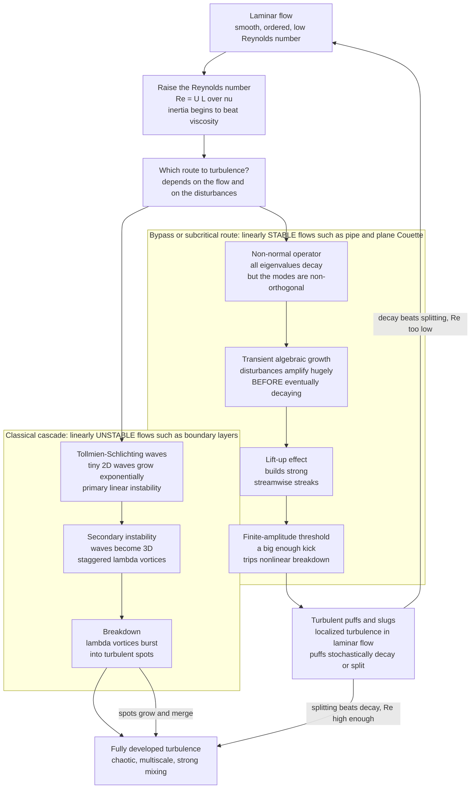

# 🌀 Transition to Turbulence

> [!abstract] TL;DR
> **Transition** is how a smooth, ordered **laminar** flow becomes chaotic **turbulent** flow as conditions change — almost always as the **Reynolds number** $Re = UL/\nu$ rises past a critical range. Osborne Reynolds pinned it down in 1883 by injecting a dye streak into pipe flow: below $Re\approx2000$ the dye stayed a straight glassy thread; above it, the thread suddenly burst into swirling chaos. The textbook story — small waves grow by **linear instability** and cascade to turbulence — is right for boundary layers (Tollmien-Schlichting waves → secondary 3D instability → breakdown), but it is **flatly wrong** for pipe and plane-Couette flow, which are **linearly stable at every Reynolds number** yet still go turbulent. The modern resolution is **transient (non-normal) growth**: even though every disturbance eventually decays, the linearized operator temporarily *amplifies* disturbances enormously, and a **finite-amplitude** kick then trips nonlinear breakdown — "**bypass**" transition. In pipes this appears as localized **turbulent puffs and slugs** that stochastically **decay or split**, making transition itself a **statistical critical phenomenon** (directed-percolation universality). Because transition controls **drag, heat transfer, mixing, and noise**, predicting and controlling it — delaying it on laminar-flow wings, or tripping it to prevent separation — is a central engineering goal.

---

## Intuition

**Analogy:** Turn a faucet on gently and the water falls in a smooth, glassy column you could almost read through. Open it a little more and — at some threshold — the stream suddenly *shatters* into a gurgling, frothing tangle. Nothing about the tap changed smoothly; the flow flipped from orderly (laminar) to chaotic (turbulent) at a tipping point. That abrupt switch is one of physics' oldest puzzles, first quantified by Osborne Reynolds in 1883 when he watched a thread of dye stay arrow-straight in a slow pipe flow and then explode into mixing once the flow ran fast enough.

Here is the twist that makes it deep rather than obvious. The natural guess — that the smooth flow becomes *unstable*, like a pencil balanced on its tip finally toppling — is often **wrong**. Pipe flow is technically **stable to small disturbances at all speeds**: nudge it gently and mathematics says the nudge dies away, forever, no matter how fast the flow. And yet every plumber knows fast pipe flow is turbulent. How order gives way to chaos when the "obvious" instability is absent turns out to be subtle, and it was only really understood — through *transient growth* and *statistical* pictures of turbulent patches — in the last few decades.

---

## How It Works

### The transition problem and the critical Reynolds number

The controlling parameter is the **Reynolds number** $Re = \rho U L/\mu = UL/\nu$ — the ratio of destabilizing inertia to stabilizing viscosity (built in [[Dimensional_Analysis_and_Similarity]]). At **low** $Re$ viscosity smooths every disturbance away and the flow is laminar, admitting the clean exact solutions of [[Laminar_Flow_and_Exact_Solutions]] (the parabolic Hagen-Poiseuille pipe profile, linear Couette flow). As $Re$ rises, inertia wins, disturbances survive and grow, and beyond a **critical range** the flow becomes turbulent.

Crucially, that critical value is **not a sharp universal constant**. For pipe flow, transition is usually quoted near $Re\approx2000$–$2300$, but with extreme care to remove disturbances, laminar pipe flow has been sustained to $Re\sim10^5$. The number is **fuzzy** and depends on the disturbance environment. Different flows have their own thresholds: flat-plate boundary layers, free jets, channels, and mixing layers each transition by different mechanisms at different $Re$.

### Two routes to chaos

**Route 1 — the classical cascade (linearly unstable flows).** For a flat-plate **boundary layer** (see [[The_Boundary_Layer]]), the path is the textbook one: infinitesimal 2D **Tollmien-Schlichting (TS) waves** become linearly unstable above a critical $Re$ and grow exponentially. They then suffer a **secondary instability**, becoming three-dimensional and forming staggered **lambda-vortices**; these burst into isolated **turbulent spots** that grow, merge, and fill the flow. This is a cascade of *successive instabilities*, and it is exactly the kind of primary→secondary breakdown catalogued in the companion *Hydrodynamic_Instabilities* note.

**Route 2 — the subtle case (linearly stable flows that transition anyway).** Here is the deep puzzle. **Pipe (Hagen-Poiseuille) flow** and **plane Couette flow** are **linearly stable at all Reynolds numbers**: solve the eigenvalue problem and every mode decays. The classical instability picture predicts they should *never* be turbulent — yet they routinely are. The eigenvalues lie, because the linearized operator is **non-normal** (its eigenvectors are far from orthogonal).

### The modern resolution: transient growth and bypass transition

A non-normal operator can have every eigenvalue decaying while combinations of its modes **temporarily add up** to a much larger disturbance before the eventual decay. This **transient algebraic growth** — energy amplification by factors of hundreds or thousands over a finite time — is driven physically by the **lift-up effect**: weak streamwise vortices pump slow near-wall fluid outward and fast fluid inward, building strong streamwise **streaks**. Those streaks are large enough that the ignored **nonlinear** terms take over, and a **finite-amplitude** disturbance (not an infinitesimal one) is pushed over a threshold into turbulence. The flow "**bypasses**" the classical TS route entirely — hence **bypass transition** — and because it needs a disturbance of finite size, it is a **subcritical** transition (a nonlinear, threshold phenomenon, like a ball needing a hard enough shove out of a valley rather than a hill that becomes unstable on its own).

### Turbulent puffs, slugs, and transition as a critical phenomenon

In a pipe, transition is not global and clean — it is **intermittent and localized**. At lower $Re$ turbulence appears as **puffs**: isolated patches of chaos, tens of pipe-diameters long, drifting downstream inside laminar flow. A puff is a "life-and-death" object: it can **decay** (relaminarize) or **split** into two, both as *stochastic* events with $Re$-dependent probabilities. Transition becomes sustained only when the *splitting rate outruns the decay rate* — mapping the onset of turbulence onto the **directed-percolation** universality class of statistical physics, a striking recent result linking fluid transition to [[Criticality_and_Phase_Transitions]] and [[Percolation_and_Random_Processes]]. At higher $Re$ the patches become aggressive **slugs** that grow at both ends and swallow the laminar flow. In the band between, the **turbulent fraction** rises smoothly from 0 to 1 — the statistical description of the transitional regime.

### What makes the critical Re fuzzy — and controllable

Because transition (especially the bypass route) is triggered by finite disturbances, it is exquisitely sensitive to the **disturbance level**: free-stream turbulence, wall **roughness**, vibration, acoustic noise, and pressure gradient. That sensitivity is a curse (the critical $Re$ is not reproducible) *and* a lever: you can **delay** transition (polished laminar-flow wings, suction, favorable pressure gradients) to cut skin-friction drag, or **trip** it deliberately (roughness strips, vortex generators, dimples) to energize the boundary layer and prevent [[Lift_Drag_and_Aerodynamics|separation]].



---

## Key Concepts

### Secondary (intuitive)
- **A tipping point, not a dial.** Flow does not gradually get rougher; past a threshold it flips from smooth (laminar) to chaotic (turbulent).
- **One number rules it: the Reynolds number.** Bigger pipe, faster flow, or thinner fluid → higher $Re$ → more likely turbulent.
- **Reynolds' dye experiment.** A thread of dye stays straight in slow pipe flow and shatters into mixing above a critical speed — the birth of transition studies.
- **The number is fuzzy.** Roughness, vibration, and noise all nudge the switch, so there is no single magic speed — which is also why engineers can *delay* or *trigger* the switch on purpose.

### Undergraduate (quantitative)
- **Critical Reynolds numbers are flow-specific and disturbance-dependent.** Pipe flow: $Re_c\approx2000$–$2300$ in practice, but sustainable to $Re\sim10^5$ if disturbances are removed. Blasius boundary layer: TS waves first go unstable near $Re_\delta\sim500$ (based on displacement thickness). Plane Poiseuille (channel) flow: linearly unstable at $Re\approx5772$, yet transitions far earlier, near $Re\approx1000$, by the bypass route.
- **Linear stability vs observed transition.** Solve the **Orr-Sommerfeld** eigenvalue problem for small disturbances $\sim e^{i(\alpha x-\omega t)}$. Positive growth rate ⇒ instability (boundary layer, channel). **Pipe and plane Couette give all-decaying eigenvalues at every $Re$** — linearly stable — so eigenvalues alone cannot explain their transition.
- **Friction factor jumps at transition.** Laminar pipe friction follows $f = 64/Re$ (falling); the turbulent branch (Blasius) is $f \approx 0.316\,Re^{-1/4}$, several times higher. The observed friction factor **jumps up** across the transitional band — the practical signature of transition, read off a Moody chart.
- **Skin friction differs by a large factor.** Turbulent boundary layers carry roughly 5–10× the wall shear (and heat transfer) of laminar ones at the same $Re$ — the reason transition is an engineering headline, not a curiosity.

### Graduate (advanced)
- **Non-normality and transient growth.** The linearized Navier-Stokes operator $L$ is **non-normal** ($LL^\dagger \neq L^\dagger L$). Even with $\text{spectrum}(L)$ entirely in the stable half-plane, the maximum energy amplification $G(t)=\max_{q_0}\|e^{Lt}q_0\|^2/\|q_0\|^2$ can grow to $O(Re^2)$ before decaying. Diagnosed via the **numerical range / pseudospectra** (Trefethen, Trefethen, Reddy & Driscoll 1993, *"Hydrodynamic stability without eigenvalues"*).
- **Lift-up and streaks.** The optimal transiently-growing disturbances are **streamwise rolls** that, via the lift-up mechanism, generate **streaks** of streamwise velocity — algebraic ($\sim t$) growth from the mean-shear coupling, not exponential modal growth.
- **Subcritical / edge dynamics.** Transition is a **finite-amplitude** phenomenon governed by an **edge of chaos** — a codimension-one manifold separating laminar and turbulent basins, whose relative attractors are unstable **exact coherent structures** (travelling waves, periodic orbits) discovered in the last two decades. Turbulence here is a long-lived **chaotic transient / saddle**, not (initially) an attractor.
- **Transition as a nonequilibrium phase transition.** Puff **decay** and **splitting** are memoryless (exponential) stochastic processes with super-exponentially $Re$-dependent rates. Their crossover defines a critical $Re_c$ (pipe: $\approx2040$) in the **directed-percolation** universality class — sustained turbulence as an absorbing-state phase transition (Avila et al. 2011; Lemoult et al. 2016), tying fluid transition to [[Criticality_and_Phase_Transitions]] and [[Bifurcations_and_Tipping_Points]].
- **Design integral: the $e^N$ method.** Practical transition prediction for boundary layers still leans on the semi-empirical $e^N$ method (integrated TS growth to a threshold $N\approx9$) precisely because bypass and receptivity make first-principles prediction hard; receptivity (how external disturbances seed internal modes) remains an active frontier.

---

## Python Demo

```python
# Two faces of the transition to turbulence:
#   (a) The REYNOLDS pipe experiment as a Moody-style diagram. The laminar
#       friction factor f = 64/Re falls smoothly; above a fuzzy critical band
#       the flow JUMPS onto the higher turbulent branch (Blasius 0.316*Re^-1/4).
#       In the transitional band, the TURBULENT FRACTION gamma(Re) climbs from
#       0 to 1 as puffs/slugs increasingly fill the pipe (intermittency).
#   (b) The BYPASS paradox. A linearly STABLE but NON-NORMAL 2x2 model
#       (Trefethen et al. 1993) has all eigenvalues decaying, yet its
#       disturbance energy grows by a huge TRANSIENT factor before dying --
#       enough to trip nonlinear breakdown. Eigenvalues alone predict only decay.
import numpy as np
import matplotlib.pyplot as plt

# ------------------------------------------------------------------
# (a) Friction factor vs Reynolds number, and the turbulent fraction
# ------------------------------------------------------------------
Re = np.logspace(2.6, 5.0, 600)              # ~400 to 100,000
f_lam  = 64.0 / Re                            # Hagen-Poiseuille laminar law
f_turb = 0.316 * Re**(-0.25)                  # Blasius smooth-pipe turbulent law

Re_lo, Re_hi = 2000.0, 4000.0                 # fuzzy transitional band
# Observed friction: laminar below, turbulent above, undefined (mixed) between.
f_obs = np.where(Re < Re_lo, f_lam,
         np.where(Re > Re_hi, f_turb, np.nan))

# Turbulent fraction gamma(Re): 0 (laminar) -> 1 (turbulent) across the band.
gamma = 1.0 / (1.0 + np.exp(-(Re - 3000.0) / 250.0))

# ------------------------------------------------------------------
# (b) Transient (non-normal) growth of a linearly STABLE 2x2 system.
#     A = [[-1/R, 1], [0, -2/R]]  -> eigenvalues -1/R, -2/R (both stable),
#     but the off-diagonal coupling gives large transient energy growth.
# ------------------------------------------------------------------
def energy_growth_curve(A, times):
    """G(t) = max over unit initial states of ||exp(A t) x||^2 (largest sing. val^2)."""
    lam, V = np.linalg.eig(A)
    Vinv = np.linalg.inv(V)
    G = np.empty_like(times, dtype=float)
    for i, t in enumerate(times):
        expAt = (V * np.exp(lam * t)) @ Vinv       # V diag(exp(lam t)) V^-1
        s = np.linalg.svd(expAt, compute_uv=False)
        G[i] = float(np.real(s[0]))**2
    return G

t = np.linspace(0.0, 700.0, 700)
Rs = [(25, '#0e7490'), (50, '#7c3aed'), (100, '#dc2626')]
growth = {}
for R, _ in Rs:
    A = np.array([[-1.0 / R, 1.0], [0.0, -2.0 / R]])
    growth[R] = energy_growth_curve(A, t)

# A single trajectory for R = 100 vs the eigenvalue-only envelope.
R0 = 100
A0 = np.array([[-1.0 / R0, 1.0], [0.0, -2.0 / R0]])
lam0, V0 = np.linalg.eig(A0)
V0inv = np.linalg.inv(V0)
x0 = np.array([0.0, 1.0])                         # excites the coupling
E_traj = np.array([np.abs((V0 * np.exp(lam0 * ti)) @ V0inv @ x0).dot(
                   np.abs((V0 * np.exp(lam0 * ti)) @ V0inv @ x0)) for ti in t])
lam_max = np.max(np.real(lam0))                   # least-stable eigenvalue
E_eig = np.exp(2.0 * lam_max * t)                 # eigenvalue-only prediction (decays)

# ------------------------------------------------------------------
# Plots
# ------------------------------------------------------------------
fig, ax = plt.subplots(2, 2, figsize=(14, 11))

# (0,0) Moody-style friction factor with the transition jump
ax[0, 0].loglog(Re, f_lam,  'b--', lw=1.2, alpha=0.6, label="laminar 64/Re (extended)")
ax[0, 0].loglog(Re, f_turb, 'r--', lw=1.2, alpha=0.6, label="turbulent Blasius (extended)")
ax[0, 0].loglog(Re[Re < Re_lo], f_obs[Re < Re_lo], 'b-', lw=3, label="observed: laminar")
ax[0, 0].loglog(Re[Re > Re_hi], f_obs[Re > Re_hi], 'r-', lw=3, label="observed: turbulent")
ax[0, 0].axvspan(Re_lo, Re_hi, color='gray', alpha=0.25)
ax[0, 0].text(2200, 0.055, "transitional\nband\n(puffs, slugs)", fontsize=8)
ax[0, 0].annotate("friction JUMPS up\nat transition",
                  xy=(4000, 0.316 * 4000**-0.25), xytext=(6500, 0.09),
                  fontsize=8, arrowprops=dict(arrowstyle="->"))
ax[0, 0].set_xlabel("Reynolds number  Re = U D / nu")
ax[0, 0].set_ylabel("friction factor  f")
ax[0, 0].set_title("(a) Reynolds pipe experiment: friction factor vs Re")
ax[0, 0].legend(fontsize=7); ax[0, 0].grid(alpha=0.3, which='both')

# (0,1) turbulent fraction (intermittency) across the transitional band
ax[0, 1].semilogx(Re, gamma, color='#166534', lw=2.5)
ax[0, 1].axvspan(Re_lo, Re_hi, color='gray', alpha=0.25)
ax[0, 1].axhline(0.5, color='k', ls=':', lw=1)
ax[0, 1].set_xlabel("Reynolds number  Re")
ax[0, 1].set_ylabel("turbulent fraction  gamma")
ax[0, 1].set_title("(a) Intermittency: fraction of flow that is turbulent")
ax[0, 1].grid(alpha=0.3, which='both')

# (1,0) transient energy growth for several 'Reynolds-like' R
for R, col in Rs:
    ax[1, 0].plot(t, growth[R], color=col, lw=2, label=f"R = {R}")
ax[1, 0].axhline(1.0, color='k', ls=':', lw=1)
ax[1, 0].set_xlabel("time  t")
ax[1, 0].set_ylabel("max energy growth  G(t)")
ax[1, 0].set_title("(b) Non-normal TRANSIENT growth\n(stable system, grows then decays)")
ax[1, 0].legend(fontsize=9); ax[1, 0].grid(alpha=0.3)

# (1,1) one trajectory vs eigenvalue-only prediction: the paradox in one picture
ax[1, 1].plot(t, E_traj, color='#dc2626', lw=2.5, label="actual disturbance energy")
ax[1, 1].plot(t, E_eig, 'k--', lw=1.8, label="eigenvalue-only prediction")
ax[1, 1].axhline(1.0, color='k', ls=':', lw=1)
ax[1, 1].fill_between(t, 1.0, E_traj, where=(E_traj > 1.0), color='#dc2626', alpha=0.12)
ax[1, 1].set_xlabel("time  t")
ax[1, 1].set_ylabel("disturbance energy  (start = 1)")
ax[1, 1].set_title("(b) The bypass paradox at R = 100:\nlinearly stable, yet energy soars first")
ax[1, 1].legend(fontsize=9); ax[1, 1].grid(alpha=0.3)

plt.tight_layout()
plt.savefig("transition_to_turbulence.png", dpi=130)
plt.show()

print(f"Peak transient energy growth (R=100): {growth[100].max():.1f}x initial energy")
print(f"All eigenvalues stable: real parts = {np.real(lam0)}  (both negative)")
print("Eigenvalues predict monotonic decay; the flow transiently amplifies anyway.")
```

**What you should see.** Panel (a-left) is the Reynolds experiment as a Moody chart: the laminar $64/Re$ line drops until the shaded transitional band, where the friction factor **jumps up** onto the higher turbulent branch — the measurable fingerprint of transition. Panel (a-right) shows the **turbulent fraction** climbing 0→1 across that same band, the statistical face of puffs and slugs. Panels (b) are the paradox that broke the classical theory: a system whose eigenvalues are **all negative** (so eigenvalue theory promises pure decay, the dashed line) nonetheless **amplifies disturbance energy by hundreds of times** before it finally decays — and larger $R$ amplifies more. In a real flow that transient surge is what pushes the nonlinear terms over threshold and trips bypass transition.

---

## Real-World Applications

> **Example — laminar-flow wings and the drag stakes.** On a modern airliner, skin-friction drag is roughly half of total cruise drag, and turbulent skin friction runs several times higher than laminar. "**Natural laminar flow**" and hybrid laminar-flow-control wings (e.g., on the Boeing 787's engine nacelles and studies on business jets) chase drag savings of a few percent — worth billions of dollars of fuel across a fleet — purely by *delaying* boundary-layer transition through polished surfaces, tailored pressure gradients, and suction. The whole enterprise is an engineering bet on where transition happens.

- **Golf balls, cricket, and sports aerodynamics.** Dimples deliberately **trip** the boundary layer turbulent so it stays attached longer, shrinking the wake and cutting pressure drag — the same "drag crisis" that lets a dimpled ball fly nearly twice as far as a smooth one. Cricket's reverse swing exploits asymmetric transition on the two sides of the seam.
- **Pipelines and plumbing.** The laminar-to-turbulent jump in friction factor (the Moody chart) sizes every water main, oil pipeline, and HVAC duct; pumping-power budgets hinge on which side of $Re\approx2300$ the flow sits.
- **Turbomachinery and gas turbines.** Transition on compressor and turbine blades (much of it **bypass** transition driven by high free-stream turbulence from upstream combustors) sets efficiency and blade heat load; the $e^N$ and correlation-based transition models are baked into design CFD.
- **Heat exchangers and electronics cooling.** Turbulent flow mixes and transfers heat far better than laminar, so designers often *trip* transition on purpose to boost heat transfer — at the cost of higher pressure drop.
- **Hypersonics and re-entry.** Transition location on a re-entry vehicle can multiply the local heat flux several-fold; mispredicting it is a thermal-protection-system safety issue, and roughness-induced transition is a first-order design driver.

---

## Common Pitfalls

- **Treating the critical Reynolds number as a universal constant.** There is no single magic $Re$. It is flow-specific and, for bypass-prone flows, strongly dependent on the disturbance environment — pipe flow ranges from $\sim2000$ in a noisy rig to $\sim10^5$ in a pristine one. Always state the flow, the length scale, and the disturbance conditions.
- **Trusting linear (eigenvalue) stability to predict transition.** Linear stability gives a *necessary* condition for the classical route, but pipe and plane-Couette flow are linearly stable at all $Re$ and still transition. Non-normal transient growth and finite-amplitude thresholds are invisible to an eigenvalue analysis.
- **Confusing the linear critical $Re$ with the observed transition $Re$.** Plane Poiseuille flow is linearly unstable at $Re\approx5772$ but transitions near $Re\approx1000$; the bypass route beats the TS wave to the punch. Quoting the eigenvalue threshold as "the" transition point is a classic error.
- **Ignoring receptivity and disturbance amplitude.** Because bypass transition is a *finite-amplitude* phenomenon, the same nominal flow can be laminar or turbulent depending on inlet turbulence, wall roughness, or acoustic noise. "It went turbulent early" is often a disturbance-environment story, not a Reynolds-number story.
- **Assuming turbulence, once started, is permanent.** A low-$Re$ turbulent puff is a *transient*: it can spontaneously relaminarize. Sustained turbulence requires the splitting rate to exceed the decay rate — an emphatically statistical, not deterministic, condition.
- **Using laminar exact solutions or inviscid theory past transition.** Parabolic Poiseuille profiles and potential-flow drag estimates are invalid once the flow is transitional/turbulent; the mean profile flattens and wall shear rises sharply.

---

> [!note] Where this sits in the vault
> This is the opener of **Section 04 — Turbulence and Instability**. Its siblings develop the pieces referenced here: a *Hydrodynamic_Instabilities* note details the primary/secondary instabilities (Tollmien-Schlichting, Kelvin-Helmholtz, Rayleigh-Taylor, centrifugal) that feed the classical route; a *Turbulence_Fundamentals* note takes over once the flow is fully turbulent; and a *Kolmogorov_Theory_and_the_Energy_Cascade* note develops the $-5/3$ inertial-range spectrum of the resulting chaos. Upstream, [[Laminar_Flow_and_Exact_Solutions]] supplies the ordered base states that transition destabilizes and [[The_Boundary_Layer]] supplies the wall-bounded flow where the classical cascade plays out.

## Related Concepts

- [[The_Boundary_Layer]] — the wall-bounded flow where the classical Tollmien-Schlichting → spot → turbulence cascade occurs; transition location sets its drag and heat transfer.
- [[Laminar_Flow_and_Exact_Solutions]] — the ordered base states (Hagen-Poiseuille, Couette) that transition destabilizes; the exact profiles that hold *below* the critical $Re$.
- [[Low_Reynolds_Number_Flow]] — the opposite limit where viscosity always wins and transition never happens (Stokes flow, microfluidics).
- [[Dimensional_Analysis_and_Similarity]] — where the Reynolds number is born and why it, not any absolute speed, governs transition.
- [[Lift_Drag_and_Aerodynamics]] — why transition matters practically: laminar vs turbulent skin friction, tripping to prevent separation, the drag crisis.
- [[The_Navier_Stokes_Equations]] — the nonlinear equations whose convective term makes transition and turbulence possible.
- [[Vorticity_and_Circulation]] — streamwise vortices, lift-up, and lambda-vortices are the vorticity dynamics behind streaks and breakdown.
- [[Turbulence_and_Instabilities]] — the physics-vault companion: instability mechanisms and the turbulent state transition leads to.
- [[Viscous_Fluids_and_Navier_Stokes]] — viscosity as the stabilizing agent whose competition with inertia defines $Re$ and the transition threshold.
- [[Chaos_Theory_and_Sensitive_Dependence]] — the deterministic-chaos lens on how a smooth flow becomes unpredictable; the edge of chaos and chaotic transients.
- [[Bifurcations_and_Tipping_Points]] — subcritical (finite-amplitude) transition as a bifurcation with hysteresis and a threshold.
- [[Criticality_and_Phase_Transitions]] — the statistical-physics view: sustained turbulence as an absorbing-state (directed-percolation) phase transition.
- [[Phase_Transitions_and_Critical_Phenomena]] — universality classes and critical exponents, the framework behind the directed-percolation result for pipe transition.
- [[Percolation_and_Random_Processes]] — directed percolation and puff splitting/decay as the model for the onset of sustained turbulence.
- [[Dynamical_Systems_and_Attractors]] — exact coherent structures (travelling waves, periodic orbits) as unstable saddles organizing the transition.
- [[Chaos_and_Nonlinear_Dynamics_Numerically]] — numerically integrating nonlinear systems that grow disturbances and go chaotic, as in the demo.

---

## Review Questions

1. **(Secondary / conceptual)** Using the faucet or Reynolds' dye experiment, explain what "transition to turbulence" means and name the single quantity that decides which side of the switch a flow is on. Why is there no one universal "transition speed" — what real-world factors move the switch?
2. **(Undergraduate / scenario)** You measure friction factor versus flow rate in a smooth pipe and see it follow $64/Re$, then abruptly jump to a higher curve near $Re\approx2300$, then follow $\sim0.316\,Re^{-1/4}$. Sketch and label this on a Moody chart, identify each branch, and explain what is physically happening in the gap between them (puffs, slugs, intermittency). If a colleague keeps their pipe flow laminar to $Re\approx8000$, what did they do differently?
3. **(Graduate / trade-off)** Plane Poiseuille flow is linearly unstable at $Re\approx5772$ yet transitions near $Re\approx1000$; pipe flow is linearly stable at *every* $Re$ yet transitions near $Re\approx2000$. Reconcile these facts. Define non-normality and transient growth, explain why eigenvalue analysis is insufficient, and describe how the "bypass" (finite-amplitude, subcritical) mechanism and the directed-percolation picture of puff decay/splitting together resolve the classical paradox. What does this imply for how you would (a) predict and (b) delay transition in a real design?

---

## Sources

- O. Reynolds, "An Experimental Investigation of the Circumstances Which Determine Whether the Motion of Water Shall Be Direct or Sinuous," *Phil. Trans. R. Soc.* 174, 935–982 (1883) — the original dye experiment and the Reynolds number.
- L. N. Trefethen, A. E. Trefethen, S. C. Reddy & T. A. Driscoll, "Hydrodynamic Stability Without Eigenvalues," *Science* 261, 578–584 (1993) — non-normality and transient growth.
- P. J. Schmid & D. S. Henningson, *Stability and Transition in Shear Flows*, Springer (2001) — the graduate reference on the whole subject.
- K. Avila, D. Moxey, A. de Lozar, M. Avila, D. Barkley & B. Hof, "The Onset of Turbulence in Pipe Flow," *Science* 333, 192–196 (2011) — puff decay/splitting and the critical Reynolds number.
- G. Lemoult, L. Shi, K. Avila, S. V. Jalikop, M. Avila & B. Hof, "Directed Percolation Phase Transition to Sustained Turbulence in Couette Flow," *Nature Physics* 12, 254–258 (2016).
- P. G. Drazin & W. H. Reid, *Hydrodynamic Stability*, 2nd ed., Cambridge University Press (2004) — classical linear stability theory (Orr-Sommerfeld, TS waves).

---

#fluid-dynamics #transition-to-turbulence #reynolds-number #bypass-transition #turbulent-puffs
