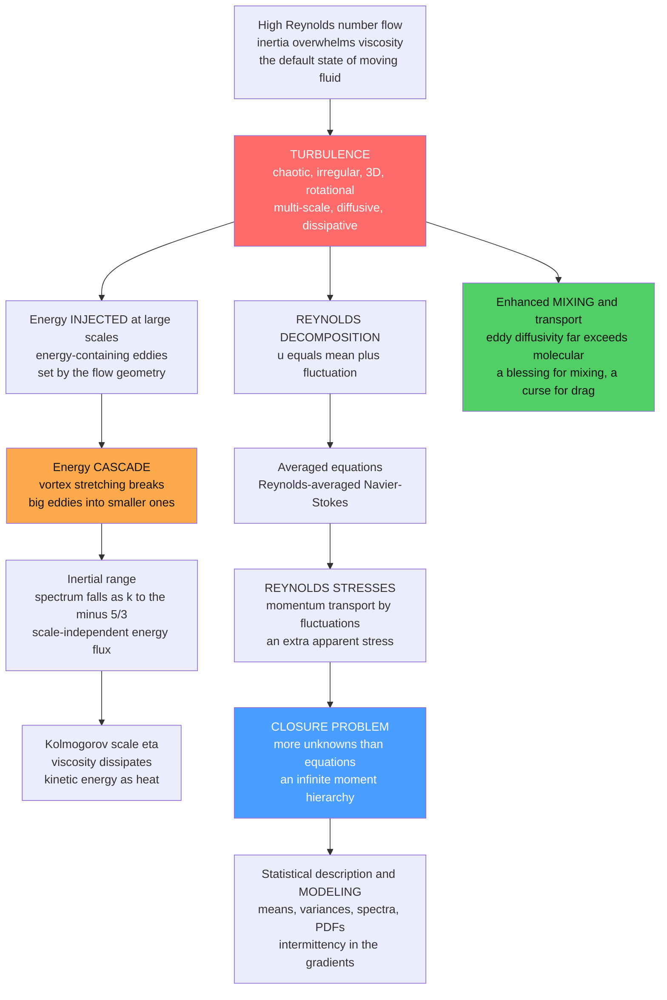

# 🌀 Turbulence Fundamentals

> [!abstract] TL;DR
> **Turbulence** is the chaotic, irregular, three-dimensional, **multi-scale** swirling motion that appears whenever the **Reynolds number** is high — which is to say almost everywhere in nature and engineering: rivers, the atmosphere, oceans, jet exhausts, blood in the aorta, and the interiors of stars. It is famously **the most important unsolved problem of classical physics** (attributed to Feynman): we possess the *exact* governing equations (**Navier–Stokes**) yet, after 150 years, still cannot fully predict or explain the flows they generate. Its defining traits — **chaotic** (sensitive to initial conditions), **random** (needing a *statistical* description), **rotational and 3D** (full of stretching vortices), **multi-scale**, **highly diffusive** (mixing momentum, heat, and mass orders of magnitude faster than molecules can), and **dissipative** — organize around two central ideas. The **energy cascade** ships kinetic energy injected at large scales down through ever-smaller eddies to the tiny **Kolmogorov scale**, where viscosity finally burns it to heat. And **Reynolds decomposition** (splitting every field into a mean plus a fluctuation) exposes the fundamental **closure problem**: averaging Navier–Stokes creates new unknowns — the **Reynolds stresses** — with no equations to close them, so turbulence must be *modeled* and *described statistically* rather than solved.

---

## Intuition

**Analogy:** Pour a splash of cream into black coffee and *don't* stir. Watch. In a heartbeat it explodes into a riot of swirls — swirls inside swirls inside swirls — folding, tearing, and interleaving cream and coffee until, within seconds, the cup is a uniform tan. Now imagine the same cream with **no** stirring and **no** swirling, blending only by molecular diffusion, one bumping molecule at a time. It would take *hours*. That difference — seconds versus hours — is turbulence. It is the churning, chaotic, hierarchical motion that dominates almost every real flow, from a mountain stream to the jet stream to the convecting guts of the Sun.

And here is the humbling part. We have known the *exact* equations of fluid motion — the **Navier–Stokes equations** — since the 1840s. Richard Feynman still called turbulence *"the most important unsolved problem of classical physics."* We can write down the law that governs every one of those swirls, and yet we cannot solve it, cannot predict the detailed dance, cannot even fully *explain* why the statistics come out the way they do. The equations are deterministic; the flow is effectively unpredictable. That gap — between having the law and having the answer — is what makes turbulence one of the great open problems of physics.

---

## How It Works

### Core Mechanics

**1. Turbulence is what high Reynolds number *does*.** The **Reynolds number** $Re = UL/\nu$ measures inertia against viscous friction (see *[[Dimensional_Analysis_and_Similarity]]*). At low $Re$, viscosity smooths every disturbance and the flow is orderly and **laminar**. Crank $Re$ up — a faster flow, a bigger pipe, a thinner fluid — and past a critical value the flow **destabilizes** and breaks down into turbulence (the onset itself is the subject of *[[Transition_to_Turbulence]]* and *[[Hydrodynamic_Instabilities]]*). Because everyday flows are large and fast, high $Re$ is the *rule*, not the exception: turbulence is the **default state of moving fluid**, and laminar flow is the delicate special case.

**2. The six defining characteristics.** A flow earns the name "turbulent" when it is:
   - **Chaotic** — exquisitely sensitive to initial conditions. Two nearly identical starts diverge exponentially, so the *detailed* future is unpredictable even though the equations are deterministic (the fluid-dynamical face of *[[Chaos_Theory_and_Sensitive_Dependence]]*).
   - **Irregular / random** — so disordered that only a **statistical** description is meaningful. We give up on tracking every wiggle and speak of means, variances, and spectra.
   - **Three-dimensional and rotational** — saturated with **vorticity** and stretching vortices. Vorticity is *essential*: strictly two-dimensional turbulence is a genuinely different beast (it cascades energy the *wrong* way), because the vortex-stretching mechanism that drives 3D turbulence is absent in 2D (see *[[Vorticity_and_Circulation]]*).
   - **Multi-scale** — a vast, continuous hierarchy of eddy sizes coexisting at once, from the biggest whorls down to the smallest.
   - **Highly diffusive** — it mixes and transports momentum, heat, and mass *orders of magnitude* faster than molecular diffusion. This enhanced mixing is turbulence's most practical hallmark.
   - **Dissipative** — it constantly grinds organized kinetic energy into heat via viscosity at the smallest scales, so it **decays** unless continuously fed energy. Turbulence is not free; something must keep stirring.

**3. The range of scales — a hierarchy of eddies.** Turbulence is a *bestiary of eddies*. The **largest, energy-containing eddies** are set by the geometry of the flow (the pipe diameter, the width of the wake, the depth of the atmospheric boundary layer). The **smallest eddies** are the **Kolmogorov scale** $\eta$, where viscosity finally wins and motion is smoothed out. The ratio of largest to smallest scales grows with Reynolds number as
$$\frac{L}{\eta} \sim Re^{3/4},$$
so a modest laboratory flow at $Re = 10^6$ already spans a **factor of $\sim$30,000** in length — and, since the flow is 3D, a factor of $Re^{9/4} \sim 10^{13}$ in the number of degrees of freedom. *This* is why simulating turbulence directly (resolving every eddy) is astronomically expensive: the dynamic range is enormous, and it explodes as $Re$ rises. It is the root reason turbulence must usually be *modeled* (see *[[Turbulence_Modeling_RANS_LES_DNS]]*).

**4. The energy cascade — Richardson's little whorls.** How does energy travel across that huge range of scales? Lewis Fry Richardson captured it in 1922 in the most famous doggerel in fluid mechanics:
> *"Big whorls have little whorls that feed on their velocity, and little whorls have lesser whorls, and so on to viscosity."*

Energy is **injected at the large scales** (by the pressure gradient, the shear, the buoyancy that drives the flow). Nonlinear interactions — physically, **vortex stretching** breaking big eddies into smaller ones — pass that energy down to progressively **smaller eddies**, with essentially no loss along the way, until it reaches the **Kolmogorov scale** where viscosity finally **dissipates** it as heat. This one-way flux of energy from large to small — the **energy cascade** — is the central energetic picture of turbulence and the seed of Kolmogorov's celebrated 1941 theory (fully developed in *[[Kolmogorov_Theory_and_the_Energy_Cascade]]*), which predicts the universal $E(k) \sim k^{-5/3}$ **inertial-range** spectrum seen in the demo below.

**5. Enhanced mixing and transport — the practical hallmark.** Why do you *stir* your coffee instead of waiting? Because turbulent stirring folds and stretches the fluid, creating enormous interfacial area and steep local gradients that molecular diffusion then erases almost instantly. The net effect is an **effective (eddy or turbulent) diffusivity** that dwarfs the molecular one — often by factors of $10^3$ to $10^7$. This is a **blessing and a curse**: it is why the atmosphere disperses pollutants, why turbulent heat exchangers and combustors work, why the ocean mixes heat and nutrients (see *[[Turbulence_and_Diapycnal_Mixing]]*) — and simultaneously why turbulent flows suffer far more **drag** and heat loss than laminar ones. The dedicated treatment is the sibling *Mixing_Dispersion_and_Turbulent_Transport*.

**6. Reynolds decomposition — the statistical bargain.** Since the detail is unpredictable, Osborne Reynolds (1895) proposed a bargain: give up on the instantaneous field and split it into a **mean** plus a **fluctuation**,
$$u_i = \bar{u}_i + u_i', \qquad \overline{u_i'} = 0.$$
Substituting this into Navier–Stokes and averaging gives the **Reynolds-Averaged Navier–Stokes (RANS)** equations for the *mean* flow $\bar{u}_i$ — which look almost like the original equations, except for one extra term born from averaging the **nonlinear** advection $u_j \partial_j u_i$:
$$\rho\,\bar{u}_j \frac{\partial \bar{u}_i}{\partial x_j} = -\frac{\partial \bar{p}}{\partial x_i} + \frac{\partial}{\partial x_j}\!\left( \mu \frac{\partial \bar{u}_i}{\partial x_j} - \rho\,\overline{u_i' u_j'} \right).$$
That new term $-\rho\,\overline{u_i' u_j'}$ is the **Reynolds stress tensor**: the mean transport of momentum by turbulent fluctuations, which acts on the mean flow exactly like an *extra stress* — usually far larger than the viscous stress. The turbulence, though we averaged it away, leaves its fingerprint as an apparent stress the mean flow must obey.

**7. The closure problem — why there is no complete theory.** Here is the wall every turbulence theory hits. The RANS equations contain **more unknowns (the six Reynolds stresses) than equations**. So write an evolution equation for $\overline{u_i' u_j'}$ — and it contains a *new* unknown, the third-order moment $\overline{u_i' u_j' u_k'}$. Write an equation for *that*, and a fourth-order moment appears. The nonlinearity of Navier–Stokes generates an **infinite hierarchy** in which every equation for the statistics at one order introduces higher-order unknowns. **There is no closed set of equations for the statistics of turbulence.** This is the **closure problem**, and it is the fundamental reason turbulence has no complete first-principles theory and must instead be **modeled** — approximating the Reynolds stresses in terms of the mean flow (eddy-viscosity models, $k$–$\varepsilon$, Reynolds-stress transport models, and so on, in *[[Turbulence_Modeling_RANS_LES_DNS]]*).

**8. Statistical description and intermittency.** Because the detail is out of reach, turbulence is the physics of **statistics**: the **mean**, the **variance** (whose square root, normalized by the mean, is the **turbulence intensity** $I = u_{rms}/\bar{U}$), two-point **correlations**, **structure functions**, probability distributions, and above all the **energy spectrum** $E(k)$ — energy versus eddy size — whose $k^{-5/3}$ inertial range is the signature of the cascade. A subtlety: velocity fluctuations are **nearly Gaussian**, but **velocity gradients are strongly non-Gaussian** — their distributions are **heavy-tailed**, reflecting rare, violent bursts of intense straining. This is **intermittency**, and it is the leading correction to Kolmogorov's 1941 theory. The demo below reproduces both features.

**9. Coherent structures — order inside the chaos.** Turbulence is *not* pure noise. Embedded in the randomness are recurring, organized **coherent structures** — **hairpin vortices** and near-wall **streaks** in boundary layers (see *[[The_Boundary_Layer]]*), large-scale rolls, mixing-layer billows. The modern *structural* view of turbulence hunts for these repeatable patterns, which carry much of the transport and offer handles for control that a purely statistical picture hides.

### Flow / Architecture



---

## Key Concepts

### Secondary Level

- **Turbulence is churning, swirling, chaotic flow.** Think of white-water rapids, rising smoke, or cream exploding into coffee — messy, unpredictable, full of eddies of every size. It is what fast-moving fluid *does*, and it is everywhere.
- **Swirls within swirls.** A turbulent flow contains eddies of a huge range of sizes at once: big ones the size of the river, tiny ones you would need a microscope to see. Big eddies break into smaller ones, which break into smaller ones still.
- **Why you stir your coffee.** Turbulent stirring mixes things *thousands* of times faster than sitting still. That is turbulence's superpower — and also why turbulent flow feels so much more "draggy" than smooth flow.
- **We can't fully predict it.** We know the exact equations of fluid motion, yet turbulence is so chaotic that we still cannot predict the details — one of the great unsolved puzzles of classical physics.

### Undergraduate Level

- **Reynolds number sets the regime.** $Re = UL/\nu$. Low $Re$: viscosity wins, laminar. High $Re$: inertia wins, turbulent. Real flows are usually high-$Re$, so turbulence is the norm.
- **The cascade and its cost.** Scale ratio $L/\eta \sim Re^{3/4}$; degrees of freedom $\sim Re^{9/4}$. This is why direct simulation is so costly and modeling is necessary.
- **Reynolds decomposition.** $u_i = \bar u_i + u_i'$. Averaging the nonlinear Navier–Stokes term $\overline{u_j'\partial_j u_i'}$ produces the **Reynolds stress** $-\rho\,\overline{u_i'u_j'}$, which typically dwarfs the viscous stress and dominates momentum transport.
- **Turbulence intensity.** $I = u_{rms}/\bar U$, the RMS fluctuation normalized by the mean speed — a first, crude measure of "how turbulent."
- **The energy spectrum.** $E(k)$ = kinetic energy per unit wavenumber. The **inertial range** obeys $E(k) \propto k^{-5/3}$: the fingerprint of the cascade, and the single most-tested prediction in the field.
- **Enhanced diffusivity.** Model turbulent transport as an **eddy diffusivity** $\nu_t \gg \nu$; the whole idea of eddy-viscosity closure is to approximate the Reynolds stress as $-\rho\,\overline{u_i'u_j'} \approx \rho\,\nu_t\,(\partial_j\bar u_i + \partial_i\bar u_j)$.

### Graduate Level

- **The closure hierarchy.** The moment equations never close: the $n$th-order moment equation contains the $(n{+}1)$th. Every closure (eddy-viscosity, $k$–$\varepsilon$, algebraic and full **Reynolds-stress transport** models, PDF methods) is an *approximation* that truncates this hierarchy with physical modeling assumptions.
- **Kolmogorov 1941 (K41).** Under local isotropy and a scale-independent mean dissipation $\varepsilon$, dimensional analysis fixes $E(k) = C_K\,\varepsilon^{2/3} k^{-5/3}$ in the inertial range and $\eta = (\nu^3/\varepsilon)^{1/4}$ for the dissipation scale (developed in *[[Kolmogorov_Theory_and_the_Energy_Cascade]]*).
- **Intermittency and K62.** K41 assumes a uniform $\varepsilon$; reality is patchy. Structure-function exponents $\zeta_p$ (where $\langle |\delta u|^p\rangle \sim r^{\zeta_p}$) deviate from the linear K41 prediction $p/3$ — **anomalous scaling** — because the local dissipation is intermittent (Kolmogorov's 1962 log-normal refinement, She–Lévêque, multifractal models). The heavy tails of the velocity-gradient PDF are its statistical signature.
- **Vortex stretching as the cascade engine.** The $(\vec\omega\cdot\nabla)\vec u$ term (see *[[Vorticity_and_Circulation]]*) amplifies enstrophy $\int|\vec\omega|^2$ and transfers energy to smaller scales; its absence in 2D reverses the cascade direction — energy flows *up* to large scales while enstrophy cascades down.
- **The Navier–Stokes existence and smoothness problem.** Whether 3D Navier–Stokes solutions always remain smooth (no finite-time singularity) is a Clay Millennium Prize problem — the mathematical face of turbulence's unsolved status.
- **LES and the closure spectrum.** Between fully-modeled RANS and fully-resolved DNS lies **Large-Eddy Simulation**, which resolves the energy-containing eddies and models only the (more universal) sub-grid scales — a pragmatic exploitation of the cascade's scale separation.

---

## Python Demo

```python
# Characterizing turbulence STATISTICALLY, from scratch (numpy + matplotlib).
#
#   (a) Synthesize a turbulent VELOCITY signal with a Kolmogorov-like energy
#       spectrum (E(k) ~ k^-5/3) by shaping random-phase Fourier modes, then
#       modulate it with a slowly-varying log-normal "activity" envelope so the
#       small-scale GRADIENTS become INTERMITTENT (heavy-tailed).
#   (b) Show its statistics: the fluctuating signal with its MEAN and RMS band
#       (turbulence intensity), the near-Gaussian PDF of velocity fluctuations
#       vs the HEAVY-TAILED PDF of velocity gradients (intermittency), and the
#       ENERGY SPECTRUM with its ~k^-5/3 inertial range (foreshadowing Kolmogorov).
#   (c) Illustrate ENHANCED MIXING: how fast a dye patch spreads by molecular
#       diffusion alone vs with turbulent (eddy) diffusivity >> molecular.
import numpy as np
import matplotlib.pyplot as plt

rng = np.random.default_rng(7)

# =====================================================================
# (a) SYNTHESIZE a turbulent velocity signal with a Kolmogorov spectrum
#     Taylor's frozen-turbulence hypothesis lets us read a time signal as a
#     spatial cut: frequency f plays the role of wavenumber k.
# =====================================================================
N   = 2**14                      # samples
fs  = 1000.0                     # sampling rate [Hz]
dt  = 1.0 / fs
t   = np.arange(N) * dt          # time [s]
f   = np.fft.rfftfreq(N, d=dt)   # frequency axis [Hz]

f_lo, f_eta = 2.0, 200.0         # integral (large-eddy) and dissipation scales
amp = np.zeros_like(f)
pos = f > 0
# inertial-range amplitude ~ f^(-5/6)  =>  power spectral density ~ f^(-5/3)
amp[pos] = f[pos] ** (-5.0 / 6.0)
amp[f < f_lo] = f_lo ** (-5.0 / 6.0)          # flat energy-containing range
amp *= np.exp(-(f / f_eta) ** 2)               # viscous dissipation cutoff
phases = rng.uniform(0, 2 * np.pi, size=f.shape)
u_base = np.fft.irfft(amp * np.exp(1j * phases), n=N)
u_base /= u_base.std()                          # unit-variance base fluctuation

# Intermittency: a slowly-varying, positive, log-normal "activity" envelope.
# (physically, the local dissipation rate is intermittent and ~log-normal)
white  = rng.standard_normal(N)
tau    = 60                                     # envelope smoothness [samples]
kx     = np.arange(-4 * tau, 4 * tau + 1)
kern   = np.exp(-0.5 * (kx / tau) ** 2); kern /= kern.sum()
smooth = np.convolve(white, kern, mode="same")
env    = np.exp(1.1 * smooth / (smooth.std() + 1e-12))
env   /= env.mean()                             # unit-mean bursty envelope
fluct  = u_base * env                            # intermittent fluctuation
fluct -= fluct.mean()

# Reynolds decomposition:  u(t) = U_mean + u'(t),  set turbulence intensity
U_mean, I = 10.0, 0.15                           # mean speed [m/s], intensity
u_prime = I * U_mean * fluct / fluct.std()       # fluctuation with rms = I*U_mean
u_turb  = U_mean + u_prime                        # full turbulent signal
u_rms   = u_prime.std()
print(f"Reynolds decomposition:  mean U = {u_turb.mean():.3f} m/s,"
      f"  u_rms = {u_rms:.3f} m/s,  intensity I = {u_rms / u_turb.mean():.3f}")

# Non-Gaussianity: kurtosis of velocity (~3) vs its gradient (>>3 = heavy tails)
def kurtosis(x):
    x = x - x.mean()
    return np.mean(x ** 4) / (np.mean(x ** 2) ** 2)
grad = np.diff(u_prime)                           # velocity gradient (increments)
print(f"kurtosis  velocity  = {kurtosis(u_prime):.2f}  (Gaussian = 3.0, near-Gaussian)")
print(f"kurtosis  gradient  = {kurtosis(grad):.2f}  (>> 3  => INTERMITTENCY, heavy tails)")

# Energy spectrum via log-binned periodogram
U   = np.fft.rfft(u_prime)
psd = (np.abs(U) ** 2) / (N * fs)
band = (f >= f.max() * 1e-3)
bins = np.logspace(np.log10(f[pos][0]), np.log10(f[-1]), 45)
idx  = np.digitize(f, bins)
fb, pb = [], []
for b in range(1, len(bins)):
    sel = (idx == b) & band
    if sel.sum() > 0:
        fb.append(f[sel].mean()); pb.append(psd[sel].mean())
fb, pb = np.array(fb), np.array(pb)

# =====================================================================
# (c) ENHANCED MIXING: spread of a dye released at x=0, t=0.
#     Diffusion Green's function  c(x,t) = exp(-x^2/(4 D t)) / sqrt(4 pi D t)
#     std spread  sigma = sqrt(2 D t).  Compare molecular vs eddy diffusivity.
# =====================================================================
D_mol  = 1.0e-9      # molecular diffusivity of dye in water [m^2/s]
D_eddy = 1.0e-2      # turbulent (eddy) diffusivity [m^2/s]  (>> molecular)
t_mix  = 60.0        # elapsed time [s]
x      = np.linspace(-3.0, 3.0, 1200)             # position [m]
def gaussian_patch(D):
    s2 = 2 * D * t_mix
    return np.exp(-x ** 2 / (2 * s2)) / np.sqrt(2 * np.pi * s2)
c_mol, c_eddy = gaussian_patch(D_mol), gaussian_patch(D_eddy)
sig_mol, sig_eddy = np.sqrt(2 * D_mol * t_mix), np.sqrt(2 * D_eddy * t_mix)
print(f"\nAfter {t_mix:.0f} s:  molecular spread = {sig_mol*1e3:.3f} mm,"
      f"  turbulent spread = {sig_eddy:.3f} m")
print(f"turbulent mixing is ~{sig_eddy/sig_mol:.0f}x wider "
      f"(eddy diffusivity is {D_eddy/D_mol:.0e}x molecular)")

# =====================================================================
# PLOTS
# =====================================================================
fig, ax = plt.subplots(2, 2, figsize=(14, 10))

# (a) turbulent signal with mean and RMS band
ax[0, 0].plot(t, u_turb, color="#1f77b4", lw=0.6)
ax[0, 0].axhline(U_mean, color="k", lw=1.6, label=f"mean U = {U_mean:.1f} m/s")
ax[0, 0].fill_between(t, U_mean - u_rms, U_mean + u_rms, color="#ff6b6b",
                      alpha=0.25, label=f"mean +/- rms  (I = {u_rms/U_mean:.2f})")
ax[0, 0].set_xlim(0, t.max())
ax[0, 0].set_xlabel("time  t  [s]"); ax[0, 0].set_ylabel("velocity  u  [m/s]")
ax[0, 0].set_title("(a) Turbulent velocity signal\nReynolds decomposition: mean + fluctuation")
ax[0, 0].legend(loc="upper right", fontsize=8)

# (b) PDFs: velocity (near-Gaussian) vs gradient (heavy-tailed intermittency)
def std_pdf(x, nb=120):
    x = (x - x.mean()) / x.std()
    h, edges = np.histogram(x, bins=nb, density=True)
    ctr = 0.5 * (edges[:-1] + edges[1:])
    return ctr, h
cv, pv = std_pdf(u_prime); cg, pg = std_pdf(grad)
xg = np.linspace(-6, 6, 400)
gauss = np.exp(-xg ** 2 / 2) / np.sqrt(2 * np.pi)
ax[0, 1].semilogy(xg, gauss, "k--", lw=1.4, label="Gaussian reference")
ax[0, 1].semilogy(cv, pv, "o", ms=3, color="#1f77b4",
                  label=f"velocity  (kurtosis {kurtosis(u_prime):.1f})")
ax[0, 1].semilogy(cg, pg, "s", ms=3, color="#d62728",
                  label=f"gradient  (kurtosis {kurtosis(grad):.1f})")
ax[0, 1].set_ylim(1e-4, 1)
ax[0, 1].set_xlabel("standardized fluctuation  (x - mean)/std")
ax[0, 1].set_ylabel("probability density")
ax[0, 1].set_title("(b) Velocity ~Gaussian, GRADIENTS heavy-tailed\n= intermittency")
ax[0, 1].legend(loc="lower center", fontsize=8)

# (c) energy spectrum with -5/3 inertial range
ax[1, 0].loglog(fb, pb, "o-", ms=3, color="#2ca02c", label="model spectrum E(k)")
sel = (fb > 4) & (fb < 80)
ref = fb ** (-5.0 / 3.0)
ref *= pb[sel].mean() / (fb[sel] ** (-5.0 / 3.0)).mean()
ax[1, 0].loglog(fb, ref, "k--", lw=1.4, label="slope  k^(-5/3)")
ax[1, 0].axvspan(f_lo, f_eta, color="#ffa94d", alpha=0.12, label="inertial range")
ax[1, 0].set_xlabel("frequency ~ wavenumber  k")
ax[1, 0].set_ylabel("energy spectrum  E(k)")
ax[1, 0].set_title("(c) Energy spectrum\ncascade fingerprint: k^(-5/3) inertial range")
ax[1, 0].legend(fontsize=8)

# (d) enhanced mixing: molecular vs turbulent spread of a dye patch
ax[1, 1].plot(x, c_eddy, color="#d62728", lw=2,
              label=f"turbulent  sigma = {sig_eddy:.2f} m")
ax[1, 1].fill_between(x, 0, c_eddy, color="#d62728", alpha=0.15)
ax[1, 1].plot(x, c_mol, color="#1f77b4", lw=2,
              label=f"molecular  sigma = {sig_mol*1e3:.2f} mm (a spike)")
ax[1, 1].set_xlim(-3, 3)
ax[1, 1].set_xlabel("position  x  [m]"); ax[1, 1].set_ylabel("dye concentration")
ax[1, 1].set_title(f"(d) Enhanced mixing after {t_mix:.0f} s\n"
                   f"eddy diffusivity ~{D_eddy/D_mol:.0e}x molecular")
ax[1, 1].legend(loc="upper right", fontsize=8)

plt.tight_layout()
plt.savefig("turbulence_fundamentals.png", dpi=110)
print("\nSaved turbulence_fundamentals.png")
```

**What it shows.** Panel **(a)** is the raw turbulent signal — a fluctuating velocity around its **mean**, with the shaded **RMS band** whose width relative to the mean is the **turbulence intensity** $I \approx 0.15$; this *is* the Reynolds decomposition $u = \bar U + u'$ made visible. Panel **(b)** is the statistical heart of the matter: the **velocity** fluctuations are **near-Gaussian** (they track the dashed parabola, kurtosis $\approx 3$), but the **velocity gradients** are dramatically **heavy-tailed** (kurtosis $\gg 3$, far above the Gaussian in the wings) — the statistical signature of **intermittency**, rare violent bursts of straining that K41 misses. Panel **(c)** recovers the celebrated $E(k) \sim k^{-5/3}$ **inertial range**, the fingerprint of the energy cascade and the setup for *[[Kolmogorov_Theory_and_the_Energy_Cascade]]*. Panel **(d)** dramatizes **enhanced mixing**: after one minute, a dye patch spread by molecular diffusion alone is a sub-millimetre spike, while the same patch under a turbulent **eddy diffusivity** has spread to over a metre — the seconds-versus-hours gap of the coffee analogy, quantified.

---

## Real-World Applications

> **Example — weather and climate models.** The atmosphere is a giant turbulent fluid, and no model can resolve every eddy from continental storms down to millimetre dissipation — the $Re^{9/4}$ degrees-of-freedom explosion forbids it. So numerical weather prediction and climate models resolve the large scales and **parameterize** the unresolved turbulence: the **atmospheric boundary layer**'s mixing of heat, moisture, and momentum is handled with **eddy-diffusivity** closures that are direct descendants of the Reynolds-stress/closure problem (see *[[Atmospheric_Boundary_Layer]]*). Turbulence parameterization is one of the largest sources of uncertainty in climate projection — the closure problem, at planetary scale.

- **Aerodynamics and drag.** Nearly all drag on aircraft, cars, and ships comes from **turbulent boundary layers** and wakes (see *[[The_Boundary_Layer]]* and *[[Lift_Drag_and_Aerodynamics]]*). Predicting where flow transitions and separates — and modeling the Reynolds stresses with RANS or LES — is the core of applied CFD.
- **Combustion and mixing.** Engines, gas turbines, and industrial reactors rely on turbulence to mix fuel and oxidizer fast enough to burn; the turbulent flame speed and mixing rate set efficiency and emissions.
- **Ocean and lake mixing.** Turbulence sets the rate at which the ocean mixes heat, carbon, and nutrients across density surfaces — **diapycnal mixing** — a first-order control on climate and marine biology (see *[[Turbulence_and_Diapycnal_Mixing]]*).
- **Blood flow.** Flow in the aorta and past stenosed (narrowed) heart valves can go turbulent; the resulting fluctuating wall stresses and audible **murmurs** are diagnostic, and turbulence promotes clotting and plaque.
- **Astrophysics.** Turbulence in the **interstellar medium** governs star formation by setting the density structure of molecular clouds; turbulent dynamos amplify cosmic magnetic fields, and accretion-disk turbulence transports angular momentum onto stars and black holes (see *[[The_Interstellar_Medium]]*).
- **Pipelines and HVAC.** The turbulent pressure drop (via the friction factor) sets pumping-power and fan costs for every fluid moved through a duct or pipe on Earth.

---

## Common Pitfalls

- **"Turbulence is just randomness / noise."** It is chaotic and needs statistics, but it is *deterministic* (governed exactly by Navier–Stokes) and full of **coherent structures**. Treating it as structureless white noise throws away the vortices, streaks, and cascade that make it what it is.
- **Confusing the cascade's direction — and forgetting it reverses in 2D.** In **3D**, energy cascades *down* to small scales and dissipates. In strictly **2D** flow, **vortex stretching is absent**, and energy cascades *up* to larger scales (the inverse cascade) while enstrophy goes down. Applying 3D intuition to a 2D simulation (or vice versa) gets the physics backwards.
- **Assuming Reynolds stresses are a real molecular stress.** $-\rho\,\overline{u_i'u_j'}$ is an *apparent* stress from averaging, not a material property. It has no universal constitutive law — that is the whole closure problem — so "just use an eddy viscosity" is an approximation, not a truth.
- **Trusting a single turbulence model everywhere.** RANS closures ($k$–$\varepsilon$, $k$–$\omega$, etc.) are calibrated to particular flows. They can fail badly on separation, strong curvature, swirl, or buoyancy. There is no universal model — a direct consequence of having no closed theory.
- **Ignoring intermittency.** K41's clean $k^{-5/3}$ assumes uniform dissipation, but real dissipation is patchy. Predictions of high-order statistics (extreme gradients, mixing of reactive scalars, particle clustering) built on the Gaussian/K41 assumption under-predict rare violent events. The heavy tails are physical, not numerical artifacts.
- **Thinking "more mixing" is always the goal.** Enhanced mixing is a blessing (combustion, dispersion, heat transfer) *and* a curse (drag, heat loss, erosion, noise). Whether you promote or suppress turbulence depends entirely on which side of that trade-off you are on.
- **Believing higher $Re$ eventually "smooths out."** The opposite: higher $Re$ means a *wider* range of scales and *more* intense small-scale activity, not a calmer flow. Turbulence gets harder, not easier, as $Re$ grows.

The onset of turbulence, its energetic theory, its engineering closures, and turbulent transport are developed in the sibling deep-dives *[[Transition_to_Turbulence]]*, *[[Hydrodynamic_Instabilities]]*, *[[Kolmogorov_Theory_and_the_Energy_Cascade]]*, *[[Turbulence_Modeling_RANS_LES_DNS]]*, and *Mixing_Dispersion_and_Turbulent_Transport*.

---

## Related Concepts

- [[Kolmogorov_Theory_and_the_Energy_Cascade]] — the quantitative theory of the cascade this note introduces: the $k^{-5/3}$ inertial range, the Kolmogorov scale, and the $Re^{3/4}$ scale ratio.
- [[Turbulence_Modeling_RANS_LES_DNS]] — the practical response to the closure problem: how the Reynolds stresses are approximated (RANS), partially resolved (LES), or fully resolved (DNS).
- [[Transition_to_Turbulence]] — how a laminar flow first destabilizes and breaks down into the turbulence characterized here.
- [[Hydrodynamic_Instabilities]] — the specific instabilities (Kelvin–Helmholtz, Rayleigh–Bénard, Taylor–Couette) that seed transition and feed turbulence.
- [[The_Navier_Stokes_Equations]] — the *exact* deterministic equations whose high-$Re$ solutions are turbulent; Reynolds-averaging them creates the closure problem.
- [[Vorticity_and_Circulation]] — turbulence is intensely rotational; **vortex stretching** (a 3D-only term) is the physical engine of the energy cascade, and its absence makes 2D turbulence fundamentally different.
- [[The_Boundary_Layer]] — where wall-bounded turbulence is generated and where hairpin vortices and streaks live; nearly all engineering drag is turbulent boundary-layer drag.
- [[Dimensional_Analysis_and_Similarity]] — the **Reynolds number** that governs the transition to turbulence and the $Re^{3/4}$ range of scales; dimensional analysis also yields the $k^{-5/3}$ law.
- [[Lift_Drag_and_Aerodynamics]] — turbulent skin friction and separation set drag; predicting them requires turbulence modeling.
- [[Turbulence_and_Instabilities]] — the Physics-vault overview of turbulence, instabilities, and chaos in fluids; this note is the focused fluid-dynamics deep-dive on the fundamentals.
- [[Chaos_Theory_and_Sensitive_Dependence]] — turbulence *is* deterministic chaos in a continuum: sensitive dependence on initial conditions is why detailed prediction fails.
- [[Turbulence_and_Diapycnal_Mixing]] — turbulence's enhanced-mixing hallmark applied to the ocean's transport of heat, carbon, and nutrients.
- [[Atmospheric_Boundary_Layer]] — planetary-scale turbulent mixing of the lower atmosphere, closed with the same eddy-diffusivity approximations.
- [[The_Interstellar_Medium]] — supersonic turbulence structures molecular clouds and regulates star formation.
- [[Chaos_and_Nonlinear_Dynamics_Numerically]] — numerical tools for the sensitive-dependence and strange-attractor behavior underlying turbulent unpredictability.
- [[Fractals_and_Self_Similarity]] — the cascade's scale-invariance and the multifractal structure of intermittent dissipation.
- [[Emergence_and_Self_Organization]] — coherent structures as order emerging spontaneously from the turbulent chaos.

---

## Review Questions

1. **Secondary:** Using the cream-in-coffee picture, explain what turbulence is and why stirred cream mixes in seconds while unstirred cream would take hours. What does this tell you about how turbulence moves heat and mass compared to molecular diffusion?
2. **Undergraduate:** Starting from $u_i = \bar u_i + u_i'$, explain how averaging the *nonlinear* term of the Navier–Stokes equations produces the Reynolds stress $-\rho\,\overline{u_i'u_j'}$, and state precisely what the **closure problem** is. Why does the ratio of largest to smallest eddy scales grow as $Re^{3/4}$, and why does that make direct simulation of high-$Re$ turbulence so expensive?
3. **Graduate:** Turbulence is chaotic yet governed by deterministic equations, and its velocity fluctuations are near-Gaussian while its velocity *gradients* are heavy-tailed. Explain the physical origin of this **intermittency**, why it represents a deviation from Kolmogorov's 1941 theory, and how it connects to the vortex-stretching mechanism. Then contrast the direction of the energy cascade in 3D versus 2D turbulence and explain the role of vortex stretching in each.

---

## Sources

- Tennekes, H. & Lumley, J. L. — *A First Course in Turbulence*, MIT Press (Reynolds decomposition, closure, spectra; the standard first text).
- Pope, S. B. — *Turbulent Flows*, Cambridge University Press (the definitive modern reference; statistics, spectra, RANS/PDF/LES modeling).
- Frisch, U. — *Turbulence: The Legacy of A. N. Kolmogorov*, Cambridge University Press (the cascade, K41/K62, intermittency and multifractals).
- Davidson, P. A. — *Turbulence: An Introduction for Scientists and Engineers*, 2nd ed., Oxford University Press (vortex stretching, cascade, physical picture).
- Richardson, L. F. — *Weather Prediction by Numerical Process*, Cambridge University Press, 1922 (the "big whorls" cascade verse; origin of the cascade idea).

---

#fluid-dynamics #turbulence #reynolds-stress #energy-cascade #mixing
