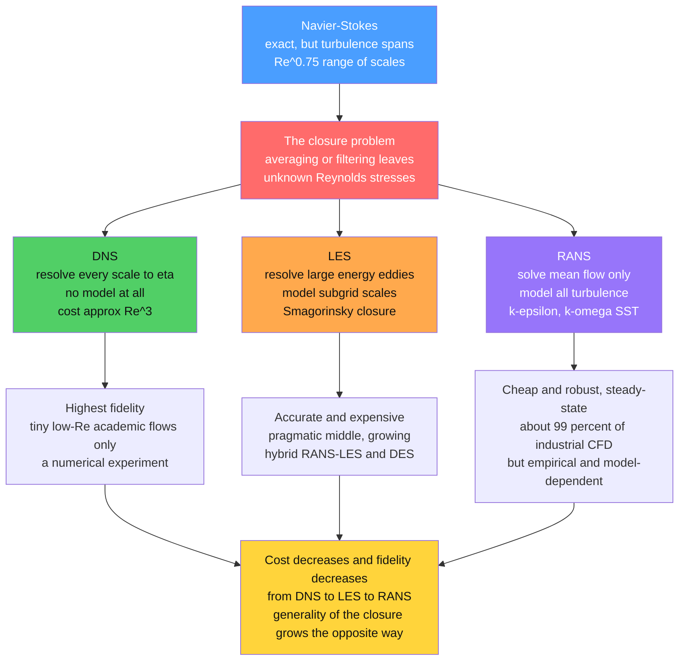

# 🌀 Turbulence Modeling (RANS, LES, DNS)

> [!abstract] TL;DR
> Turbulent flow spans an enormous range of scales — the ratio of the largest energy-containing eddies to the smallest dissipating ones grows as $Re^{3/4}$ — so **directly resolving every eddy** (DNS) costs on the order of $Re^{3}$ and is affordable only for tiny academic flows. Practical CFD therefore **approximates turbulence's effects**. The three approaches form a spectrum of cost versus fidelity: **DNS** resolves all scales with no model (exact, unaffordable); **LES** resolves the large, geometry-dependent eddies and *models* only the small, near-universal subgrid scales (the pragmatic, growing middle ground); and **RANS** solves only the *mean* flow, modeling the entire effect of turbulence through a closure such as $k$-$\varepsilon$ or $k$-$\omega$ SST (cheap, robust, and roughly 99 percent of industrial CFD). Turbulence modeling — the closure problem, the eddy-viscosity model zoo, wall treatment, and the emerging use of machine learning — is the central practical challenge of computational fluid dynamics.

---

## Intuition

**Analogy:** To simulate the turbulent air over an entire airliner by tracking every last eddy — down to the millimetre-scale swirls where motion finally dissolves into heat — would take a supercomputer longer than the age of the universe. The range of scales is simply too vast. So engineers strike **bargains**. You can solve every scale exactly (**DNS** — perfect, but only for a toy problem in a shoebox). You can resolve the big, important eddies and **fake** the small ones (**LES** — the pragmatic middle). Or you can refuse to resolve the turbulence at all and just model its **average** effect on the flow (**RANS** — cheap, ubiquitous, and how nearly every real engineering flow is actually computed).

Turbulence modeling is the art of choosing **which eddies to compute and which to fake**. The large eddies carry most of the energy and depend on the specific geometry, so faking them is dangerous; the small eddies are more universal (Kolmogorov's cascade makes them look statistically alike everywhere), so faking them is safer. Every method in this note is a different answer to one question: *where do you draw the line between "resolve" and "model"?*

---

## How It Works

### Core Mechanics

1. **Why turbulence must be modeled — the scale range.** In a turbulent flow, energy is injected at large scales $L_0$ (the pipe diameter, the wing chord) and cascades down to the **Kolmogorov scale** $\eta = (\nu^3/\varepsilon)^{1/4}$, where viscosity finally dissipates it as heat (see the energy cascade in *Kolmogorov_Theory_and_the_Energy_Cascade* and *Turbulence_Fundamentals*). The ratio of these scales is $L_0/\eta \sim Re^{3/4}$. To capture everything you need a grid fine enough to see $\eta$ and wide enough to see $L_0$ in each direction, giving $N \sim (L_0/\eta)^3 = Re^{9/4}$ grid points — and because small eddies also evolve fast, the number of time steps grows as $Re^{3/4}$, so the **total cost scales as roughly $Re^{3}$.** For a full aircraft ($Re \sim 10^{7}$) this is astronomically beyond any computer. That is *why* turbulence modeling exists.

2. **Why averaging is not free — the closure problem.** Split the velocity into a mean and a fluctuation, $\vec{u} = \bar{\vec{u}} + \vec{u}'$, and average the Navier-Stokes equations. A new term survives: the **Reynolds stress** $\tau_{ij} = -\rho\,\overline{u_i' u_j'}$, the extra momentum transport carried by the fluctuations you just averaged away. The mean-flow equations now contain *more unknowns than equations* — this is the **closure problem**. You cannot solve the averaged equations without an extra recipe (a "turbulence model") that expresses the unknown stresses in terms of the mean flow. Every approach below is defined by *how much* it averages and therefore *how much* it must close.

3. **DNS — resolve everything, model nothing.** Direct Numerical Simulation solves the full Navier-Stokes equations on a grid fine enough to capture $\eta$, with **no turbulence model at all**. It is the "exact" numerical solution — a numerical *experiment*. It is the gold standard for accuracy and the primary tool for *studying* turbulence physics (energy budgets, structures, statistics that no experiment can measure). But at $\sim Re^{3}$ cost it is feasible only for **low-$Re$, simple-geometry** academic flows (channels, isotropic boxes, jets at $Re$ of a few thousand), never for engineering.

4. **LES — resolve the big eddies, model the small ones.** Large-Eddy Simulation **spatially filters** the equations at a grid scale $\Delta$: eddies larger than $\Delta$ are computed directly, and only the **subgrid** motions smaller than $\Delta$ are modeled. This is the pragmatic bet: the large eddies carry the energy and depend on geometry (so you must resolve them), while the small subgrid eddies are more universal and easier to model — the classic **Smagorinsky** model treats them as an eddy viscosity $\nu_t = (C_s\Delta)^2|\bar{S}|$ that simply drains energy. LES is far cheaper than DNS and far more accurate than RANS, and it grows with computing power (wall-modeled LES, and **hybrid RANS-LES** methods like Detached-Eddy Simulation, DES).

5. **RANS — model all of it, solve only the mean.** Reynolds-Averaged Navier-Stokes goes to the opposite extreme: it does **not resolve any turbulence**. It solves only for the mean flow and models the *entire* Reynolds-stress tensor with a turbulence model. Because there are no small fast eddies to chase, RANS can often be run to a **steady state**, making it enormously cheaper and more robust. This is why on the order of **99 percent of industrial CFD is RANS** — the workhorse behind virtually every car, engine, pump, and building simulated (all orchestrated within the broader pipeline of *Computational_Fluid_Dynamics*).

6. **The RANS model zoo — closing the Reynolds stress.** Most RANS models invoke the **Boussinesq eddy-viscosity hypothesis**: by analogy with molecular viscosity, the Reynolds stress is proportional to the mean strain rate, $-\overline{u_i'u_j'} = \nu_t\big(\partial_j\bar{u}_i + \partial_i\bar{u}_j\big) - \tfrac{2}{3}k\,\delta_{ij}$, so the whole problem reduces to prescribing one scalar **eddy viscosity** $\nu_t$. The models differ in how they find it: the algebraic **mixing-length** model sets $\nu_t = \ell_m^2|\partial\bar{u}/\partial y|$; the two-equation **$k$-$\varepsilon$** model solves transport equations for turbulent kinetic energy $k$ and its dissipation $\varepsilon$ (with $\nu_t = C_\mu k^2/\varepsilon$); **$k$-$\omega$** and the widely trusted **$k$-$\omega$ SST** blend near-wall accuracy with free-stream robustness. Beyond eddy viscosity, **Reynolds-Stress Models (RSM)** solve a transport equation for each of the six stresses — more general (they capture anisotropy and curvature) but more expensive and harder to converge.

7. **The fundamental trade-off — cost vs fidelity vs generality.** DNS is exact but unaffordable; LES is accurate and expensive but increasingly practical; RANS is cheap and robust but *model-dependent*. Crucially, RANS closures are **calibrated, empirical** fits — tuned on canonical flows (channels, boundary layers, free jets). There is **no universal turbulence model**. They can fail badly for flows outside their tuning: massive **separation**, strong streamline **curvature**, laminar-turbulent **transition**, rotation, and genuinely **unsteady** phenomena. This is why serious CFD demands **validation** against experiment or DNS, and increasingly **uncertainty quantification** on the model itself. Turbulence modeling is a pragmatic *art*, not an exact science.

8. **Wall treatment — the practical crux.** Near a solid wall the eddies shrink and the gradients steepen, so resolving the viscous sublayer (placing the first grid point at $y^{+} \lesssim 1$) is brutally expensive — near-wall resolution dominates the cost of both wall-resolved LES and RANS at high $Re$. The cheap alternative is **wall functions**: instead of resolving the sublayer, you *model* it by assuming the near-wall velocity obeys the **law of the wall** ($u^{+} = \tfrac{1}{\kappa}\ln y^{+} + B$) and bridge from the first off-wall node. Wall functions save enormous cost but are themselves a modeling assumption — a major source of error when the boundary layer separates or the law of the wall does not hold (compare the near-wall physics in [[The_Boundary_Layer]]).

9. **The machine-learning frontier.** The modern research push is **data-driven turbulence modeling**: train ML models on high-fidelity DNS/LES data to build better RANS closures or subgrid models, and use ML for **super-resolution** and cheap emulation of turbulent fields. The promise is closures that generalize beyond hand-tuned constants; the pitfalls are **generalization** (does a model trained on channel flow work on a wing?) and **physical consistency** (respecting Galilean invariance, realizability, conservation). This links directly to the broader program of [[Machine_Learning_in_Computational_Physics]].

### Flow / Architecture



---

## Key Concepts

### Secondary Level

- **Turbulence has many sizes at once** — a turbulent flow is full of swirls (eddies) from very big to very tiny, all interacting. Following every single one on a computer is impossible for real machines like planes or cars.
- **Three bargains.** *DNS* = compute every eddy exactly (only works for very small toy problems). *LES* = compute the big eddies, fake the small ones. *RANS* = do not compute the swirling at all; just work out the *average* flow and estimate how much the turbulence pushes it around.
- **Why we usually fake it** — resolving everything is astronomically expensive, so almost all real engineering (aircraft, engines, buildings) is done with the cheapest method, RANS. The price of cheapness is that RANS uses *approximations* that can be wrong.
- **Which eddies are safe to fake** — the small eddies look statistically similar in almost every flow, so faking them (LES) is fairly safe. The big eddies depend on the exact shape of the object, so faking *those* (RANS) is riskier.

### Undergraduate Level

- **The scale range and DNS cost.** $L_0/\eta \sim Re^{3/4}$, so a 3D DNS grid needs $N \sim Re^{9/4}$ points; adding the number of time steps ($\sim Re^{3/4}$) gives a **total cost $\sim Re^{3}$.** Doubling $Re$ multiplies the DNS bill by about 8; going from a lab flow to an aircraft ($Re$ up by $10^4$) multiplies it by $10^{12}$.
- **Reynolds averaging and the closure problem.** Substituting $\vec{u} = \bar{\vec{u}} + \vec{u}'$ into Navier-Stokes and averaging yields the extra **Reynolds stress** $-\rho\,\overline{u_i'u_j'}$. The mean equations have more unknowns than equations — you *must* supply a model to close them.
- **The Boussinesq / eddy-viscosity idea.** Model the Reynolds stress like a viscous stress: $-\overline{u_i'u_j'} = \nu_t\,\bar{S}_{ij} - \tfrac{2}{3}k\delta_{ij}$. The turbulence is compressed into a single scalar **eddy viscosity** $\nu_t$, which is far larger than the molecular $\nu$.
- **Mixing length (Prandtl).** The simplest closure: $\nu_t = \ell_m^2\,|\partial\bar{u}/\partial y|$, with $\ell_m = \kappa y$ near a wall. This algebraic model, plus the law of the wall, powers many quick engineering estimates.
- **Two-equation models.** $k$-$\varepsilon$ solves transport equations for turbulent kinetic energy $k$ and dissipation $\varepsilon$, then sets $\nu_t = C_\mu k^2/\varepsilon$. $k$-$\omega$ (and the blended $k$-$\omega$ **SST**) behave better near walls and in adverse pressure gradients — the default choice for many aerospace flows.
- **LES filtering.** LES resolves scales larger than the filter width $\Delta$ and models the **subgrid stress**; the Smagorinsky model uses $\nu_t = (C_s\Delta)^2|\bar{S}|$. As $\Delta \to \eta$, LES continuously approaches DNS.
- **$y^{+}$ and wall functions.** Wall-resolved simulations need the first node at $y^{+}\!\lesssim\!1$ (expensive); **wall functions** instead assume the log-law and place the first node in the range $30 \lesssim y^{+} \lesssim 300$, trading accuracy for cost.

### Graduate Level

- **Filtered vs averaged equations.** RANS applies a statistical (ensemble/time) average — it is an *operator that commutes with derivatives and is idempotent*. LES applies a **spatial convolution filter** $\bar{\phi}(\vec{x}) = \int G(\vec{x}-\vec{r})\phi(\vec{r})\,d\vec{r}$, which is *not* idempotent and does not commute with differentiation on non-uniform grids — the source of commutation errors. The unclosed term is the **subgrid-scale stress** $\tau_{ij}^{sgs} = \overline{u_iu_j} - \bar{u}_i\bar{u}_j$.
- **Realizability and invariance constraints.** A defensible closure must be **Galilean invariant**, frame-indifferent where appropriate, and **realizable** (predicted Reynolds stresses must form a positive-semidefinite tensor with $\overline{u_\alpha'^2}\ge 0$ and Schwarz-satisfying cross terms). Naive eddy-viscosity models can violate realizability in strong strain; these constraints also discipline ML-based closures.
- **Failure modes of eddy viscosity.** The Boussinesq hypothesis assumes the Reynolds-stress anisotropy is *instantaneously aligned* with the mean strain rate. This breaks down in flows with strong **rotation/curvature**, secondary flows in ducts (which require anisotropy), rapid distortion, and separation. **Reynolds-Stress Models** and **nonlinear/explicit algebraic** eddy-viscosity models relax this alignment at higher cost.
- **Cost scalings (Chapman/Choi-Moin estimates).** Wall-*resolved* LES scales roughly as $Re^{1.8}$-$Re^{2}$ because the near-wall eddies shrink with $Re$; **wall-modeled LES** relaxes this toward $\sim Re^{1}$, which is what makes high-$Re$ LES conceivable. RANS grid requirements are set by geometry and boundary-layer thickness, growing only logarithmically with $Re$ — effectively $Re$-independent.
- **Hybrid RANS-LES (DES).** Detached-Eddy Simulation runs RANS in attached boundary layers (cheap, where RANS is reliable) and switches to LES in separated regions (where RANS fails and resolved eddies matter). The switch is governed by comparing the RANS length scale to the local grid spacing; poor grid design triggers pathologies like *grid-induced separation* and the *log-layer mismatch*, motivating Delayed and Improved DES (DDES, IDDES).
- **Data-driven closures.** Field-inversion + machine learning (FIML), tensor-basis neural networks (embedding Galilean/rotational invariance via the integrity basis of the strain/rotation tensors), and gene-expression programming produce RANS corrections from DNS data. Central open problems: **out-of-distribution generalization**, **conditioning/ill-posedness** when a learned closure is coupled back into the RANS solver, and guaranteeing **physical consistency**. This is a live thread of [[Machine_Learning_in_Computational_Physics]].
- **The transport connection.** The eddy viscosity is really a *turbulent diffusivity* — the same modeled quantity governs turbulent mixing of heat and species via a turbulent Prandtl/Schmidt number (developed further in *Mixing_Dispersion_and_Turbulent_Transport*).

---

## Python Demo

```python
# Turbulence modeling: WHY we fake eddies, and WHAT each method keeps.
#   (a) COST vs Reynolds number -- DNS ~ Re^3 explodes; LES grows fast; RANS stays
#       nearly flat.  Real applications are marked: a lab experiment (DNS feasible)
#       vs a full aircraft (only RANS/LES are affordable).
#   (b) The FILTER/AVERAGE idea -- one synthetic "turbulent" signal decomposed into
#       what DNS keeps (everything), LES keeps (large eddies, subgrid removed), and
#       RANS keeps (just the mean, plus a MODELED fluctuation band of +/- rms).
#   (c) The same story in spectral space -- which wavenumbers each method resolves.
# numpy + matplotlib only.

import numpy as np
import matplotlib.pyplot as plt

# ----------------------------------------------------------------------
# (a) Computational cost vs Reynolds number  ---------------------------
# Costs normalized to 1 at the reference Re0 = 1e3.
#   DNS total cost ~ Re^3   (grid Re^(9/4) x time steps Re^(3/4))
#   wall-resolved LES        ~ Re^1.8   (Chapman/Choi-Moin scaling)
#   RANS                     ~ Re^0.15  (grid set by geometry, near flat)
Re  = np.logspace(3, 8, 300)
Re0 = 1e3
cost_dns  = (Re / Re0) ** 3.0
cost_les  = (Re / Re0) ** 1.8
cost_rans = (Re / Re0) ** 0.15

# Real applications at representative Reynolds numbers.
apps = {"lab channel\n(DNS feasible)": 5e3,
        "road car":                    2e6,
        "airliner\n(RANS/LES only)":   5e7}

# ----------------------------------------------------------------------
# Build one synthetic turbulent signal with a -5/3 energy spectrum ------
rng = np.random.default_rng(1)
N   = 4096
t   = np.linspace(0.0, 12.0, N)
dt  = t[1] - t[0]

freqs = np.fft.rfftfreq(N, d=dt)          # >= 0
amp          = np.zeros_like(freqs)
amp[1:]      = freqs[1:] ** (-5.0 / 6.0)  # power |A|^2 ~ f^(-5/3)
phase        = rng.uniform(0.0, 2 * np.pi, size=freqs.size)
spectrum     = amp * np.exp(1j * phase)
spectrum[0]  = 0.0                         # remove DC from the fluctuation
fluct        = np.fft.irfft(spectrum, n=N)
fluct       *= 0.55 / fluct.std()          # set turbulence intensity ~ 0.55
U_mean       = 3.0
u_dns        = U_mean + fluct              # DNS: the full resolved field

# LES: spatial/temporal low-pass filter -> keep large eddies, drop subgrid.
f_cut          = 2.0                        # cutoff "frequency" (grid scale)
spec_les       = spectrum.copy()
spec_les[freqs > f_cut] = 0.0
u_les          = U_mean + np.fft.irfft(spec_les, n=N)

# RANS: keep ONLY the mean; the fluctuations are not resolved but MODELED
# as an rms band  U_mean +/- sqrt(2k/3)  (here just the fluctuation rms).
u_rms          = fluct.std()

# ----------------------------------------------------------------------
# Figure ---------------------------------------------------------------
fig, ax = plt.subplots(2, 2, figsize=(14, 10))

# (a) cost vs Re -------------------------------------------------------
ax[0, 0].loglog(Re, cost_dns,  color="#51cf66", lw=2.4, label="DNS  ~ Re^3")
ax[0, 0].loglog(Re, cost_les,  color="#ffa94d", lw=2.4, label="LES  ~ Re^1.8")
ax[0, 0].loglog(Re, cost_rans, color="#9775fa", lw=2.4, label="RANS ~ Re^0.15")
for label, r in apps.items():
    ax[0, 0].axvline(r, color="0.6", ls=":", lw=1)
    ax[0, 0].text(r, 3e12, label, rotation=90, va="top", ha="right",
                  fontsize=8, color="0.3")
ax[0, 0].set_xlabel("Reynolds number  Re")
ax[0, 0].set_ylabel("relative computational cost")
ax[0, 0].set_title("(a) Why engineering uses RANS/LES\nDNS cost explodes as Re^3")
ax[0, 0].legend(loc="upper left")
ax[0, 0].set_ylim(1e-1, 1e16)
ax[0, 0].grid(True, which="both", alpha=0.25)

# (b) signal decomposition: DNS vs LES ---------------------------------
win = slice(0, 900)
ax[0, 1].plot(t[win], u_dns[win], color="#adb5bd", lw=0.9,
              label="DNS  (all scales resolved)")
ax[0, 1].plot(t[win], u_les[win], color="#ffa94d", lw=2.0,
              label="LES  (large eddies, subgrid removed)")
ax[0, 1].set_xlabel("time")
ax[0, 1].set_ylabel("velocity  u(t)")
ax[0, 1].set_title("(b) LES filters the signal\nresolve big eddies, model the small")
ax[0, 1].legend(loc="upper right", fontsize=8)

# (c) signal decomposition: DNS vs RANS mean + modeled band ------------
ax[1, 0].plot(t[win], u_dns[win], color="#adb5bd", lw=0.9,
              label="DNS  (full field)")
ax[1, 0].axhline(U_mean, color="#9775fa", lw=2.4, label="RANS mean  U")
ax[1, 0].fill_between(t[win], U_mean - u_rms, U_mean + u_rms,
                      color="#9775fa", alpha=0.20,
                      label="modeled fluctuation band  +/- rms")
ax[1, 0].set_xlabel("time")
ax[1, 0].set_ylabel("velocity  u(t)")
ax[1, 0].set_title("(c) RANS resolves nothing\nkeeps the mean, MODELS the fluctuation level")
ax[1, 0].legend(loc="upper right", fontsize=8)

# (d) which wavenumbers each method keeps (spectral view) --------------
k       = freqs[1:]
E_full  = amp[1:] ** 2
ax[1, 1].loglog(k, E_full, color="#adb5bd", lw=1.4, label="true spectrum E(k)")
# DNS resolves all k; LES resolves up to f_cut; RANS resolves only the mean (k->0)
ax[1, 1].fill_between(k, E_full, where=(k <= f_cut),
                      color="#ffa94d", alpha=0.30, label="LES resolves  (k <= k_cut)")
ax[1, 1].fill_between(k, E_full, where=(k > f_cut),
                      color="#ff6b6b", alpha=0.20, label="LES/RANS MODEL this")
ax[1, 1].axvline(f_cut, color="#ffa94d", ls="--", lw=1.5)
ref = np.logspace(np.log10(k[2]), np.log10(k[-2]), 40)
ax[1, 1].loglog(ref, E_full[2] * (ref / k[2]) ** (-5.0 / 3.0), "k:",
                lw=1, label="k^(-5/3) slope")
ax[1, 1].set_xlabel("wavenumber k (eddy size, small -> large k)")
ax[1, 1].set_ylabel("energy  E(k)")
ax[1, 1].set_title("(d) Which eddies each method keeps\nDNS: all   LES: k<=k_cut   RANS: mean only")
ax[1, 1].legend(loc="lower left", fontsize=8)
ax[1, 1].grid(True, which="both", alpha=0.25)

plt.tight_layout()
plt.show()

# Takeaways:
#  * (a) At an aircraft Re ~ 5e7 the DNS bar is ~1e14 times a lab flow -- hence RANS.
#  * (b) LES keeps the large, energy-containing eddies and discards the subgrid wiggles.
#  * (c) RANS keeps ONLY the mean; everything turbulent is compressed into one modeled
#        rms level (the eddy-viscosity closure supplies exactly this kind of estimate).
#  * (d) In spectral space the "resolve vs model" line is literally a cutoff wavenumber:
#        DNS resolves all k, LES resolves k below k_cut, RANS resolves only k -> 0.
```

---

## Real-World Applications

> **Example — designing a commercial aircraft.** No supercomputer on Earth can DNS the flow over a full airliner at cruise ($Re \sim 5\times10^{7}$) — panel (a) of the demo shows the DNS bill dwarfing a lab flow by a factor near $10^{14}$. So aerodynamicists compute the cruise polar, the pressure distribution, and the drag with **RANS**, almost always the **$k$-$\omega$ SST** model, using **wall functions** or wall-resolved grids depending on the region. Where RANS is known to fail — the separated wake behind the fuselage, buffet at high angle of attack, unsteady loads on control surfaces — engineers escalate to **hybrid RANS-LES (DES)** or targeted **LES**. Every closure is then **validated** against wind-tunnel data and (where possible) DNS before a number is trusted.

- **Gas-turbine and internal combustion engines** — turbulent mixing controls flame speed, efficiency, and $\text{NO}_x$ emissions. LES is now standard for combustor design because RANS cannot capture the large-scale unsteady mixing that governs ignition and flame stabilization.
- **Automotive aerodynamics** — drag, cooling, and cabin wind noise are computed with RANS for fast design sweeps and with LES/DES for the unsteady wake that dominates a car's pressure drag and for aeroacoustics.
- **Weather and climate models** — the same "resolve the big, model the small" philosophy appears as **subgrid parameterization**: global models resolve scales of kilometres and *model* all turbulence and convection below the grid, exactly the closure problem of RANS/LES at planetary scale (see [[Numerical_Weather_Prediction]]).
- **Wind-turbine and wind-farm design** — LES of the atmospheric boundary layer predicts wake losses between turbines, where RANS systematically under-predicts wake recovery.
- **Turbomachinery and heat exchangers** — near-separation blade rows and film cooling depend critically on transition and separation prediction, the exact regime where RANS closures are least reliable and validation matters most.

---

## Common Pitfalls

- **Believing there is a "best" turbulence model** — there is **no universal model**. $k$-$\varepsilon$, $k$-$\omega$ SST, and Spalart-Allmaras are each calibrated on canonical flows; the right choice depends on the flow (attached vs separated, free-shear vs wall-bounded). "Which model?" is always flow-specific.
- **Trusting RANS on separated or highly unsteady flows** — eddy-viscosity RANS is tuned for attached, mildly perturbed boundary layers. On massive separation, strong curvature, or intrinsically unsteady wakes it can be qualitatively wrong. That is precisely where LES/DES exists.
- **Ignoring $y^{+}$ and wall treatment** — using wall functions with a first node at $y^{+}\!<\!1$ (or a wall-resolved model at $y^{+}\!=\!100$) misapplies the near-wall assumption. Wall treatment is a leading source of silent error; always check $y^{+}$ against the model's requirement.
- **Confusing grid convergence with model convergence** — refining a RANS grid converges to the *model's* answer, not the *true* answer. A perfectly grid-converged RANS solution can still be wrong because the closure is wrong. LES is worse: refining the grid *changes the model* (the filter width shrinks), so LES "grid convergence" must be interpreted carefully.
- **Calling DNS/LES for a problem RANS could handle** — DNS/LES are not automatically "more correct" for an engineering answer; they are vastly more expensive and can introduce their own errors (subgrid model, under-resolution, boundary conditions). Match the tool to the question.
- **Treating a data-driven closure as plug-and-play** — an ML model trained on channel-flow DNS may violate realizability or destabilize the solver on a wing. Without embedded invariances and out-of-distribution testing, ML closures generalize poorly.

---

## Related Concepts

- [[Turbulence_and_Instabilities]] — the physics this note *models*: the energy cascade, the $Re^{3/4}$ scale range, Reynolds decomposition, and mixing length all originate there.
- [[The_Navier_Stokes_Equations]] — the exact equations that DNS solves directly and that RANS/LES average or filter to obtain their closure problem.
- [[The_Boundary_Layer]] — the near-wall region whose resolution (or wall-function modeling) is the dominant cost and error source in turbulent CFD.
- [[Dimensional_Analysis_and_Similarity]] — the Reynolds number and the $L_0/\eta \sim Re^{3/4}$ scaling that make DNS unaffordable and force modeling.
- [[Viscous_Fluids_and_Navier_Stokes]] — the molecular viscosity that the eddy-viscosity closure is built by analogy to, and the dissipation that closes the cascade.
- [[Machine_Learning_in_Computational_Physics]] — data-driven and invariance-embedding approaches to building better RANS and subgrid closures from DNS data.
- [[Finite_Difference_Methods]] — the discretization machinery underneath a DNS/LES/RANS solver; grid resolution is exactly what the cost scalings count.
- [[High_Performance_and_Parallel_Computing]] — why DNS and wall-resolved LES live on the largest supercomputers, and how their cost scaling maps to core counts.
- [[Numerical_Weather_Prediction]] — the geophysical incarnation of the same closure problem: subgrid parameterization of turbulence and convection below the grid scale.

---

## Review Questions

1. **Secondary** — In plain words, what is the difference between DNS, LES, and RANS? For each, say which eddies it *computes* and which it *fakes*, and explain why almost all real engineering (a car, a plane) uses RANS rather than DNS.
2. **Undergraduate** — Starting from Reynolds decomposition $\vec{u} = \bar{\vec{u}} + \vec{u}'$, show how averaging the Navier-Stokes equations produces the Reynolds-stress term and hence the **closure problem**. Then explain the Boussinesq eddy-viscosity hypothesis and how a two-equation model such as $k$-$\varepsilon$ supplies the eddy viscosity $\nu_t$. Why does DNS cost scale as $\sim Re^{3}$?
3. **Graduate** — A colleague reports a fully grid-converged RANS ($k$-$\omega$ SST) simulation of a stalled airfoil that badly under-predicts the separated wake. Explain, in terms of the Boussinesq assumption and its alignment/anisotropy limitations, *why* RANS is expected to fail here, what alternatives (RSM, DES, wall-modeled LES) you would escalate to and their cost implications, and how you would **validate** the result. What role could a data-driven closure play, and what would you check before trusting it?

---

## Sources

- Pope, S. B. — *Turbulent Flows*, Cambridge University Press (2000). The definitive graduate text: RANS closures, LES filtering, DNS, and the closure problem.
- Wilcox, D. C. — *Turbulence Modeling for CFD*, 3rd ed., DCW Industries (2006). Reference for $k$-$\varepsilon$, $k$-$\omega$, and Reynolds-stress models.
- Sagaut, P. — *Large Eddy Simulation for Incompressible Flows*, 3rd ed., Springer (2006). Filtering theory and subgrid-scale modeling.
- Chapman, D. R. — "Computational Aerodynamics Development and Outlook," *AIAA Journal* 17(12), 1293-1313 (1979); and Choi & Moin, *Phys. Fluids* 24, 011702 (2012) — the LES/DNS grid-cost scaling estimates.
- Duraisamy, K., Iaccarino, G. & Xiao, H. — "Turbulence Modeling in the Age of Data," *Annual Review of Fluid Mechanics* 51, 357-377 (2019). The machine-learning frontier for closures.

---

#fluid-dynamics #turbulence-modeling #RANS #LES #DNS
