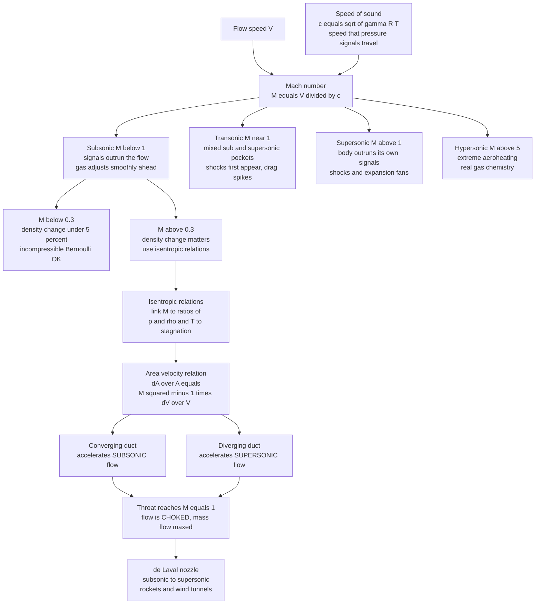

# 🚀 Compressible Flow and Gas Dynamics

> [!abstract] TL;DR
> **Compressible flow** is the second great regime of fluid dynamics: flow in which the fluid's **density changes significantly**, which is what happens whenever a **gas** moves fast — over an airliner's wing, through a rocket nozzle, inside a turbine, or in a blast wave. The master parameter is the **Mach number** $M = V/c$, the flow speed divided by the **speed of sound** $c=\sqrt{\gamma R T}$ — the speed at which *pressure information* propagates through the gas. Below $M\approx0.3$ density barely moves (under 5 percent) and the incompressible **[[Bernoulli_and_Energy_in_Flows|Bernoulli]]** picture holds; but as the flow approaches and crosses the sound speed the physics inverts. The gas can no longer "get the message" to move aside in advance, so **shocks** appear, density and temperature swing wildly, and nozzles behave counterintuitively: you accelerate *subsonic* gas by **narrowing** a passage but must **widen** it to accelerate *supersonic* gas — which is why every rocket uses a **converging-diverging (de Laval) nozzle** that goes sonic ($M=1$, **choked**) at its throat. Gas dynamics is inseparable from **[[Laws_of_Thermodynamics|thermodynamics]]** — the stagnation temperature that scorches a re-entry vehicle is just the flow's kinetic energy turned back into heat — and it governs aerospace, propulsion, turbomachinery, pipelines, and the physics of the sound barrier.

---

## Intuition

**Analogy first.** At everyday speeds, air behaves almost exactly like an incompressible liquid: walk across a room and the air simply flows out of your way, sliding around you without changing its density in any measurable way. The reason it can do this is that the air feels you coming. A moving object continuously radiates faint **pressure signals** — sound — in every direction, and those signals race *ahead* of it, gently nudging the air downstream to start peeling aside *before* the object arrives. The oncoming air "gets the memo" and adjusts smoothly.

Now push the object faster and faster, up toward the **speed of sound**. Here is the crux: those warning signals travel at *exactly* the sound speed. As the object closes on that speed, it begins to keep pace with its own messages — the air ahead gets almost no advance notice. Cross the sound barrier and the object **outruns its own pressure signals entirely**. The air downstream has no idea anything is coming until the object is right on top of it, and then it must adjust *all at once*, in a razor-thin, near-discontinuous jump: a **shock wave**. Density piles up, temperature soars, and the entire character of the flow flips. The **Mach number** — your speed divided by the speed of sound — is the master switch between these two utterly different fluid worlds: the smooth, forgiving, "incompressible" world below it, and the abrupt, violent, thermodynamically charged world above it.

The deep idea to carry into the mathematics is that *the speed of sound is the speed of information in a gas*, and compressibility is simply what happens when the flow starts to rival that speed.

---

## How It Works

### The speed of sound is the speed of information

A gas communicates with itself through **pressure**. Poke it — put an obstacle in a stream, close a valve, flap a wing — and the disturbance you create propagates outward as tiny pressure fluctuations, which is precisely what a **sound wave** is (developed in [[Waves_in_Fluids_and_Acoustics]]). For an ideal gas that signal travels at

$$c=\sqrt{\gamma R T}=\sqrt{\gamma\frac{p}{\rho}},$$

where $\gamma$ is the ratio of specific heats ($\approx1.4$ for air), $R$ the specific gas constant, and $T$ the absolute temperature. Two facts matter enormously. First, $c$ depends only on the **temperature** of the gas, not on how fast the gas is flowing — colder air carries sound (and information) more slowly, which is why the sound barrier is *easier* to break in the frigid stratosphere. Second, $c$ is **finite**. Because the messenger has a top speed, whether the flow beats that speed decides everything.

### The Mach number and its four regimes

The single dimensionless group that captures "flow speed versus signal speed" is the **Mach number**:

$$M=\frac{V}{c}.$$

It is the governing parameter of compressible flow the way the Reynolds number governs viscous flow (both are products of the same [[Dimensional_Analysis_and_Similarity|dimensional-analysis]] logic). Its value carves the subject into four qualitatively distinct regimes:

1. **Subsonic ($M<1$).** Signals outrun the flow, so information reaches every point upstream and the flow rearranges itself *smoothly* around obstacles. Below $M\approx0.3$ density variation is negligible and the flow is effectively **incompressible**; between $0.3$ and $1$ it is genuinely compressible ("high subsonic"), and near the top of the range local pockets can quietly go supersonic.
2. **Transonic ($M\approx0.8$–$1.2$).** The nastiest regime. Sub- and supersonic pockets coexist on the *same* body, shocks first appear on the wing's upper surface, and drag spikes (the "sound barrier" as a **drag** wall). Almost every airliner cruises here, which is why transonic aerodynamics is so economically important and so hard.
3. **Supersonic ($M>1$).** The body outruns its own signals; disturbances cannot propagate upstream and instead collect on oblique and normal **shock waves** and **expansion fans**. This is the domain of [[Shock_Waves_and_Supersonic_Flow]].
4. **Hypersonic ($M>5$).** So fast that the shock-heated air dissociates and ionizes — real-gas **chemistry** and radiation matter, and surfaces face brutal aeroheating. This is re-entry and scramjet territory.

Each regime is not a smooth continuation of the last but a different physical world, which is what makes gas dynamics so rich.

### Why $M\approx0.3$ is the compressibility threshold

For smooth, adiabatic flow the density change tracks the Mach number through the isentropic relations below; plugging in numbers, at $M=0.3$ the density has changed by only about **5 percent** from its stagnation value — small enough that treating $\rho$ as constant costs you a few percent at most. That is why **incompressible** analysis (constant density, [[Bernoulli_and_Energy_in_Flows|Bernoulli's equation]]) is the standard, hugely convenient approximation for liquids and for low-speed gas flow. Above $M\approx0.3$ the density swing grows past what you can ignore, and the incompressible Bernoulli equation must be **replaced** by the full compressible energy relation.

### Isentropic flow relations and stagnation conditions

For **smooth** compressible flow — shock-free, **adiabatic** (no heat added), and **reversible**, hence at constant entropy or **isentropic** — the energy equation reduces to conservation of **stagnation enthalpy** along a streamline, $h+\tfrac12V^2=h_0$. Imagining the flow brought gently to rest defines the **stagnation** (or **total**) conditions $T_0,\,p_0,\,\rho_0$ — literally what an ideal probe that decelerates the gas to zero would read. For a perfect gas the algebra collapses into three workhorse relations, each a pure function of $M$ and $\gamma$:

$$\frac{T_0}{T}=1+\frac{\gamma-1}{2}M^2,\qquad
\frac{p_0}{p}=\left(1+\frac{\gamma-1}{2}M^2\right)^{\!\frac{\gamma}{\gamma-1}},\qquad
\frac{\rho_0}{\rho}=\left(1+\frac{\gamma-1}{2}M^2\right)^{\!\frac{1}{\gamma-1}}.$$

These are the daily bread of gas dynamics: know the Mach number and you know how much the pressure, density, and temperature have dropped from their reservoir values as the gas accelerated. As $M\to0$ the pressure relation reduces exactly to the incompressible dynamic pressure $p_0=p+\tfrac12\rho V^2$, gracefully recovering Bernoulli. The **stagnation temperature** $T_0$ is the same everywhere in an adiabatic flow, and it is what makes fast flight *hot*: bring $M=6$ air to rest and $T_0/T=1+0.2\cdot36\approx8.2$, so ambient stratospheric air near $220\,\text{K}$ stagnates at roughly $1800\,\text{K}$ — the physics behind re-entry heat shields.

### The counterintuitive area-velocity relation

Combine mass conservation ($\rho V A=\text{const}$; see [[Conservation_Laws_and_Control_Volumes]]) with the momentum and sound-speed relations for steady isentropic flow and you get the celebrated **area-velocity relation**:

$$\frac{dA}{A}=\bigl(M^2-1\bigr)\frac{dV}{V}.$$

Read the sign of the factor $M^2-1$ and a beautiful reversal falls out:

- **Subsonic ($M<1$):** $M^2-1<0$, so speeding the flow up ($dV>0$) requires **shrinking** the area ($dA<0$). A **converging** passage accelerates subsonic gas — exactly the incompressible intuition from a garden-hose nozzle.
- **Supersonic ($M>1$):** $M^2-1>0$, so accelerating the flow now requires **growing** the area ($dA>0$). A **diverging** passage accelerates supersonic gas, because density falls off *faster* than the area grows, and continuity forces the velocity up to compensate.
- **Sonic ($M=1$):** the only place $dA=0$, i.e. an area **minimum** — a **throat**.

So to take gas continuously from subsonic to supersonic you must first **converge** it (to speed it toward $M=1$) and then **diverge** it (to keep accelerating it past $M=1$), passing through $M=1$ exactly at the throat. That is the **converging-diverging (de Laval) nozzle**, the heart of every rocket engine and supersonic wind tunnel.

### Choking: the throat sets a speed limit and a mass-flow limit

Because $M=1$ can occur *only* at the throat, once the throat reaches sonic conditions the flow is **choked**: the mass flow rate is maxed out and no amount of extra downstream suction can pull more gas through, because the news of that lower pressure cannot travel upstream past the sonic throat. Choking is simultaneously the mechanism that lets a de Laval nozzle produce supersonic exhaust and a hard limit engineers must respect in valves, orifices, and pipelines.



---

## Key Concepts

### Secondary Level

- **Two worlds of flow.** Slow-moving air behaves like an incompressible liquid, sliding out of the way. Push it near the speed of sound and it changes density, heats up, and forms **shock waves** — a completely different regime.
- **Mach number.** Your speed divided by the speed of sound. $M<1$ is **subsonic**, $M=1$ is exactly the sound speed, $M>1$ is **supersonic**, and $M>5$ is **hypersonic**. A jet at $M=2$ moves at twice the speed of sound.
- **Sound is a warning signal.** A moving object sends pressure signals (sound) ahead of itself so the air can move aside in time. Go faster than sound and the object outruns its own warnings, so the air cannot get out of the way smoothly — it slams together into a **shock**, and you hear a **sonic boom**.
- **Fast flight gets hot.** Squeezing a fast airflow to a stop turns its motion into heat — this is why supersonic jets and returning spacecraft get scorching hot at the nose.
- **Rocket nozzles are bell-shaped for a reason.** They narrow to a throat and then flare out, which is exactly the shape needed to push exhaust gas past the speed of sound.

### Undergraduate Level

- **Speed of sound:** $c=\sqrt{\gamma R T}=\sqrt{\gamma p/\rho}$ for an ideal gas; it depends only on temperature, and it is the propagation speed of small pressure disturbances.
- **Mach number regimes:** subsonic ($M<1$, incompressible-like below $0.3$), transonic ($M\approx0.8$–$1.2$, mixed and shock-laden), supersonic ($M>1$), hypersonic ($M>5$).
- **The compressibility threshold.** Below $M\approx0.3$, $\Delta\rho/\rho<5\%$, so incompressible [[Bernoulli_and_Energy_in_Flows|Bernoulli]] is accurate; above it you must account for density change.
- **Isentropic relations:** $\dfrac{T_0}{T}=1+\dfrac{\gamma-1}{2}M^2$, with $\dfrac{p_0}{p}=\left(\dfrac{T_0}{T}\right)^{\gamma/(\gamma-1)}$ and $\dfrac{\rho_0}{\rho}=\left(\dfrac{T_0}{T}\right)^{1/(\gamma-1)}$; stagnation ($_0$) values are the reservoir/probe-at-rest conditions.
- **Compressible energy equation:** stagnation enthalpy $h_0=h+\tfrac12V^2=c_pT_0$ is conserved along an adiabatic streamline — this *replaces* incompressible Bernoulli.
- **Area-velocity relation:** $\dfrac{dA}{A}=(M^2-1)\dfrac{dV}{V}$; converging ducts accelerate subsonic flow, diverging ducts accelerate supersonic flow, $M=1$ occurs only at a throat.
- **de Laval nozzle and choking:** a converging-diverging nozzle reaches $M=1$ (**choked**, maximum mass flow) at the throat and accelerates the flow to supersonic in the diverging section.

### Graduate Level

- **Area-Mach relation (closed form):** $\left(\dfrac{A}{A^\*}\right)^2=\dfrac{1}{M^2}\left[\dfrac{2}{\gamma+1}\left(1+\dfrac{\gamma-1}{2}M^2\right)\right]^{\frac{\gamma+1}{\gamma-1}}$, where $A^\*$ is the sonic (throat) area — a *double-valued* function of $A/A^\*$ giving one subsonic and one supersonic solution for each area ratio, selected by the back pressure.
- **Characteristic form and domain of dependence.** The steady Euler equations are **elliptic** for subsonic flow (information reaches everywhere, no upstream influence limit) and **hyperbolic** for supersonic flow (information confined to **Mach cones** of half-angle $\mu=\arcsin(1/M)$); this change of PDE type — traced in [[The_Navier_Stokes_Equations]] and [[Euler_Equations_and_Inviscid_Flow]] — *is* the mathematical statement of "signals cannot travel upstream."
- **Stagnation quantities and entropy.** $T_0$ and $h_0$ are conserved across an adiabatic process, but $p_0$ and $\rho_0$ drop across any **irreversible** feature (a shock), since a normal shock raises **entropy** (see [[Entropy_and_Second_Law]]); the stagnation-pressure loss is the practical measure of shock and duct inefficiency.
- **Choked mass flow:** $\dot m_{\max}=\rho^\* A^\* c^\* = A^\* p_0\sqrt{\dfrac{\gamma}{RT_0}}\left(\dfrac{2}{\gamma+1}\right)^{\frac{\gamma+1}{2(\gamma-1)}}$ — set entirely by throat area and reservoir stagnation conditions, independent of downstream pressure once choked.
- **Nozzle operating states.** Off-design back pressure produces over- and under-expanded jets, oblique-shock diamonds, or a normal shock standing inside the diverging section — the matching problem central to rocket and *Aerodynamics_and_Aerospace_Applications*.
- **Real-gas and hypersonics.** Above $M\approx5$ the perfect-gas $\gamma$ and constant $c_p$ break down as vibrational modes, dissociation, and ionization activate — the isentropic table must give way to equilibrium or nonequilibrium chemistry, coupling gas dynamics to [[Kinetic_Theory_of_Gases|kinetic theory]] and reacting-flow thermochemistry.

---

## Python Demo

```python
# Compressible-flow relations, three ways:
#   (a) SPEED OF SOUND c = sqrt(gamma R T) vs temperature, with the Mach
#       regimes marked on the isentropic plot below.
#   (b) ISENTROPIC RELATIONS: how T/T0, p/p0, rho/rho0 fall as the flow
#       accelerates with Mach number (density drops dramatically supersonic),
#       and the ~5% density change at M ~ 0.3 that marks the compressibility
#       threshold.
#   (c) CONVERGING-DIVERGING (de Laval) NOZZLE: the counterintuitive
#       area-Mach relation A/A* vs M -- a converging duct accelerates
#       SUBSONIC flow, a diverging duct accelerates SUPERSONIC flow, and the
#       flow chokes at M = 1 at the throat (the area minimum).
# Requires: numpy, matplotlib
import numpy as np
import matplotlib.pyplot as plt

gamma = 1.4        # ratio of specific heats for air (diatomic)
R     = 287.0      # specific gas constant for air [J/(kg K)]

# =====================================================================
# (a) SPEED OF SOUND vs TEMPERATURE
# =====================================================================
T = np.linspace(180.0, 340.0, 200)         # absolute temperature [K]
c = np.sqrt(gamma * R * T)                  # speed of sound [m/s]

T_sea, T_strat = 288.15, 216.65             # sea level and tropopause
c_sea   = np.sqrt(gamma * R * T_sea)
c_strat = np.sqrt(gamma * R * T_strat)
print("=== Speed of sound ===")
print(f"sea level (T = {T_sea:.1f} K):  c = {c_sea:5.1f} m/s")
print(f"tropopause (T = {T_strat:.1f} K): c = {c_strat:5.1f} m/s  "
      "(colder air -> slower signals -> easier to go supersonic)")

# =====================================================================
# (b) ISENTROPIC RELATIONS vs MACH NUMBER
# =====================================================================
M   = np.linspace(0.01, 5.0, 500)
tau = 1.0 + (gamma - 1.0) / 2.0 * M**2       # T0/T
T_ratio   = 1.0 / tau                          # T / T0
p_ratio   = tau ** (-gamma / (gamma - 1.0))    # p / p0
rho_ratio = tau ** (-1.0 / (gamma - 1.0))      # rho / rho0

# density-change threshold in the subsonic range
M_sub       = np.linspace(0.0, 1.0, 300)
rho_sub     = (1.0 + (gamma - 1.0) / 2.0 * M_sub**2) ** (-1.0 / (gamma - 1.0))
dens_change = (1.0 - rho_sub) * 100.0          # percent drop from stagnation
i03 = np.argmin(np.abs(M_sub - 0.3))
print("\n=== Isentropic relations ===")
print(f"at M = 0.30: density change = {dens_change[i03]:.1f} percent "
      "(~5% -> the incompressible threshold)")
for Mi in (0.8, 2.0, 4.0):
    ti = 1.0 + (gamma - 1.0) / 2.0 * Mi**2
    print(f"at M = {Mi:.1f}: T/T0 = {1/ti:5.3f}, p/p0 = {ti**(-gamma/(gamma-1)):6.4f}, "
          f"rho/rho0 = {ti**(-1/(gamma-1)):6.4f}")

# =====================================================================
# (c) AREA-MACH RELATION for a CONVERGING-DIVERGING (de Laval) NOZZLE
# =====================================================================
def area_ratio(Mn):
    """A / A_star for isentropic flow (A_star = sonic throat area)."""
    return (1.0 / Mn) * ((2.0 / (gamma + 1.0)) *
            (1.0 + (gamma - 1.0) / 2.0 * Mn**2)) ** ((gamma + 1.0) /
            (2.0 * (gamma - 1.0)))

M_noz  = np.linspace(0.08, 4.0, 500)
AAstar = area_ratio(M_noz)
sub    = M_noz < 1.0                          # subsonic branch (converging)
sup    = M_noz >= 1.0                         # supersonic branch (diverging)
print("\n=== de Laval nozzle (area-Mach) ===")
print(f"A/A* at M = 1.0 (throat) = {area_ratio(1.0):.3f}  (the minimum area)")
print(f"A/A* at M = 3.0 (rocket exit) = {area_ratio(3.0):.2f}  "
      "-> exit must be much wider than the throat")

# =====================================================================
# PLOTS
# =====================================================================
fig, ax = plt.subplots(2, 2, figsize=(13, 9))
fig.suptitle("Compressible Flow and Gas Dynamics", fontsize=15, fontweight="bold")

# A: speed of sound vs temperature
axA = ax[0, 0]
axA.plot(T, c, color="#1f77b4", lw=2.4)
axA.scatter([T_sea, T_strat], [c_sea, c_strat], color="#d62728", zorder=5)
axA.annotate("sea level", (T_sea, c_sea), textcoords="offset points",
             xytext=(-70, 6), fontsize=8)
axA.annotate("tropopause", (T_strat, c_strat), textcoords="offset points",
             xytext=(6, -14), fontsize=8)
axA.set_xlabel("temperature  T [K]")
axA.set_ylabel("speed of sound  c [m/s]")
axA.set_title("A. Speed of sound  c = sqrt(gamma R T)")
axA.grid(alpha=0.3)

# B: isentropic ratios vs Mach, with regime bands
axB = ax[0, 1]
axB.plot(M, T_ratio,   color="#ff7f0e", lw=2.2, label="T / T0")
axB.plot(M, p_ratio,   color="#2ca02c", lw=2.2, label="p / p0")
axB.plot(M, rho_ratio, color="#9467bd", lw=2.2, label="rho / rho0")
axB.axvspan(0.0, 0.8, color="#cfe8ff", alpha=0.5)
axB.axvspan(0.8, 1.2, color="#ffe0b3", alpha=0.6)
axB.axvspan(1.2, 5.0, color="#ffd0d0", alpha=0.5)
axB.text(0.35, 0.9, "subsonic",   fontsize=8, ha="center")
axB.text(1.0,  0.9, "transonic",  fontsize=8, ha="center")
axB.text(3.0,  0.9, "supersonic", fontsize=8, ha="center")
axB.set_xlabel("Mach number  M")
axB.set_ylabel("ratio to stagnation value")
axB.set_title("B. Isentropic relations: density drops fast supersonic")
axB.legend(fontsize=8, loc="center right")
axB.grid(alpha=0.3)

# C: density-change compressibility threshold (subsonic zoom)
axC = ax[1, 0]
axC.plot(M_sub, dens_change, color="#8c564b", lw=2.4)
axC.axhline(5.0, color="k", ls=":", lw=1.0)
axC.axvline(0.3, color="#d62728", ls="--", lw=1.4)
axC.text(0.32, 1.0, "M ~ 0.3\nincompressible\nthreshold", fontsize=8, color="#d62728")
axC.text(0.02, 5.4, "5 percent", fontsize=8)
axC.set_xlabel("Mach number  M")
axC.set_ylabel("density change from stagnation [percent]")
axC.set_title("C. Below M ~ 0.3 density barely moves")
axC.grid(alpha=0.3)

# D: area-Mach relation for the de Laval nozzle
axD = ax[1, 1]
axD.plot(M_noz[sub], AAstar[sub], color="#1f77b4", lw=2.4,
         label="subsonic branch (converging)")
axD.plot(M_noz[sup], AAstar[sup], color="#d62728", lw=2.4,
         label="supersonic branch (diverging)")
axD.scatter([1.0], [1.0], color="k", zorder=5)
axD.annotate("throat: M = 1, CHOKED\n(minimum area)", (1.0, 1.0),
             textcoords="offset points", xytext=(12, 40), fontsize=8,
             arrowprops=dict(arrowstyle="->", lw=0.8))
axD.set_xlabel("Mach number  M")
axD.set_ylabel("area ratio  A / A*")
axD.set_yscale("log")
axD.set_title("D. de Laval nozzle: throat at M = 1, flares to go supersonic")
axD.legend(fontsize=8)
axD.grid(alpha=0.3, which="both")

plt.tight_layout(rect=[0, 0, 1, 0.96])
plt.savefig("compressible_flow_and_gas_dynamics.png", dpi=130)
plt.show()
```

Running the script prints the sound speed at sea level ($\approx340\,\text{m/s}$) and at the colder tropopause ($\approx295\,\text{m/s}$), confirms the density change is about 5 percent at $M=0.3$ (the incompressible threshold) and collapses toward zero at low $M$, tabulates how sharply $T/T_0$, $p/p_0$, and especially $\rho/\rho_0$ fall as the flow accelerates supersonically, and reports the nozzle area ratios ($A/A^\*=1$ at the sonic throat, widening to $\approx4.2$ at a Mach-3 exit). The four panels visualize each: the sound speed rising with temperature, the isentropic ratios plunging across the regime bands, the compressibility threshold at $M\approx0.3$, and the double-valued area-Mach curve whose minimum *is* the choked throat of a de Laval nozzle.

---

## Real-World Applications

- **Aerospace and the sound barrier.** Airliners cruise in the **transonic** regime ($M\approx0.78$–$0.85$), where supercritical wings and swept planforms tame the shocks that would otherwise cause the drag spike once misread as a physical "barrier." Supersonic (Concorde, fighters) and hypersonic (re-entry capsules, the Space Shuttle) vehicles live entirely in the compressible world and are shaped by shocks and aeroheating (the domain of *Aerodynamics_and_Aerospace_Applications*).
- **Rocket and jet propulsion.** Every rocket engine bell is a **de Laval nozzle** that chokes at $M=1$ in its throat and expands the combustion gas to $M=3$–$5$ at the exit; jet-engine afterburner nozzles and turbine inlet guide vanes are choked-flow devices whose thrust and mass flow are fixed by throat area and chamber stagnation conditions.
- **Turbomachinery.** Compressor and turbine blades operate in transonic and supersonic relative flow; shock losses and choking margins set the pressure ratio and efficiency of gas turbines and jet engines.
- **Gas pipelines and safety valves.** High-pressure natural-gas lines and pressure-relief/blowdown valves routinely **choke** — the sonic condition at the restriction caps the mass flow, a fact engineers exploit for metering and must respect for safe venting.
- **Explosions and blast waves.** A detonation drives a **shock** into the surrounding air far faster than sound; the peak overpressure and its decay are pure compressible gas dynamics (the physics detailed in [[Shock_Waves_and_Supersonic_Flow]]).
- **Astrophysical flows.** Supersonic **stellar winds** and jets, the shocks of **supernova** remnants sweeping the [[The_Interstellar_Medium|interstellar medium]] (see [[Supernovae_and_Gamma_Ray_Bursts]]), and accretion flows are compressible gas dynamics on cosmic scales, where the same Mach-number logic governs whether disturbances can propagate upstream.

---

## Common Pitfalls

- **Using incompressible Bernoulli above $M\approx0.3$.** The classic error: applying $p_0=p+\tfrac12\rho V^2$ to high-speed gas. It underestimates stagnation pressure because it ignores density change; above $M\approx0.3$ you must use the compressible (isentropic-enthalpy) relations.
- **Thinking a diverging duct always slows the flow.** True only for *subsonic* flow. In *supersonic* flow a diverging passage **accelerates** the gas — the sign of $M^2-1$ flips the intuition. This trips up nearly everyone meeting nozzles for the first time.
- **Expecting $M=1$ anywhere but a throat.** Sonic conditions in steady isentropic flow can occur only at an area minimum. Trying to reach $M=1$ in the middle of a diverging section, or forgetting that a purely converging nozzle can at best choke (never go supersonic), leads to impossible designs.
- **Confusing static and stagnation properties.** Static $T,p,\rho$ are what a sensor drifting *with* the flow reads; stagnation $T_0,p_0,\rho_0$ are the reservoir/decelerated values. A thermocouple in a fast stream reads closer to $T_0$ than $T$ — mixing them corrupts every downstream calculation, and is why supersonic vehicles seem "impossibly hot."
- **Assuming stagnation pressure is conserved.** $T_0$ and $h_0$ survive an adiabatic process, but $p_0$ **drops** across a shock or any irreversibility because entropy rises. Treating $p_0$ as constant through a shock overstates achievable thrust and pressure recovery.
- **Applying the isentropic table across a shock.** The isentropic relations assume smooth, reversible flow. A shock is neither; you need the (entropy-increasing) normal- or oblique-shock relations, not the isentropic ones, to connect states across it.
- **Forgetting $\gamma$ is not universal.** The relations use $\gamma\approx1.4$ for cool diatomic air, but in hot combustion gases, hypersonic shock layers, or monatomic/polyatomic gases $\gamma$ shifts, and at hypersonic temperatures the perfect-gas assumption fails entirely.

---

## Related Concepts

- [[Bernoulli_and_Energy_in_Flows]] — the incompressible energy equation that gas dynamics *generalizes*; its compressible form conserves stagnation enthalpy and recovers Bernoulli as $M\to0$.
- [[The_Navier_Stokes_Equations]] — the full governing equations whose steady inviscid limit changes mathematical type (elliptic to hyperbolic) as the flow crosses $M=1$.
- [[Euler_Equations_and_Inviscid_Flow]] — the inviscid model from which the isentropic and area-velocity relations are derived.
- [[Shock_Waves_and_Supersonic_Flow]] — the abrupt, entropy-raising jumps that arise once the flow outruns its own signals; the natural continuation of this note into $M>1$.
- [[Lift_Drag_and_Aerodynamics]] — where transonic shocks drive the drag rise and Mach number reshapes lift and drag on wings.
- [[Conservation_Laws_and_Control_Volumes]] — mass conservation ($\rho V A=\text{const}$) is half of the derivation of choking and the area-velocity relation.
- [[Dimensional_Analysis_and_Similarity]] — the Mach number is the compressible-flow similarity parameter, the counterpart of the Reynolds number.
- [[The_Boundary_Layer]] — shock-boundary-layer interaction and aeroheating couple viscous effects to compressible gas dynamics near surfaces.
- [[Waves_in_Fluids_and_Acoustics]] — sound as a small-amplitude pressure wave; its propagation speed $c$ *is* the signal speed that defines the Mach number.
- [[Kinetic_Theory_of_Gases]] — the molecular origin of the speed of sound, $\gamma$, and the temperature dependence of $c$.
- [[Laws_of_Thermodynamics]] — the adiabatic energy balance and stagnation enthalpy that make gas dynamics inseparable from thermodynamics.
- [[Entropy_and_Second_Law]] — "isentropic" means constant entropy; shocks are the irreversible, entropy-raising exception.
- [[States_of_Matter_and_Gas_Laws]] — the ideal-gas equation of state $p=\rho R T$ underlying $c=\sqrt{\gamma R T}$ and the isentropic relations.
- [[Chemical_Thermodynamics]] — the specific heats and enthalpy that fix $\gamma$, $c_p$, and the stagnation temperature.
- [[Supernovae_and_Gamma_Ray_Bursts]] — astrophysical blast waves and shocks, compressible gas dynamics on the largest scales.
- [[The_Interstellar_Medium]] — the medium swept up by supersonic stellar winds and supernova shocks.

*Fluid-Dynamics siblings referenced in prose (to be built in this section): Aerodynamics_and_Aerospace_Applications, Surface_and_Internal_Waves.*

---

## Review Questions

1. **(Secondary)** Explain, using the idea that a moving object sends out sound signals as warnings, why air can "get out of the way" smoothly when an object moves slowly but slams into a shock wave when the object moves faster than sound. What is the Mach number of a jet flying at twice the speed of sound, and roughly why does the nose of a fast supersonic aircraft get so hot?
2. **(Undergraduate)** Air at $M=0.2$ flows in a duct. (a) Using $c=\sqrt{\gamma R T}$ with $T=250\,\text{K}$, find the flow speed. (b) Is the incompressible approximation acceptable here — justify with the density-change criterion. (c) The duct then feeds a converging-diverging nozzle. Sketch how the Mach number varies from inlet to exit, state where $M=1$ occurs and why it can occur *only* there, and explain why the diverging section is essential to reach supersonic speed rather than slowing the flow as it would subsonically.
3. **(Graduate)** A supersonic wind tunnel runs a reservoir at $T_0=300\,\text{K}$, $p_0=8\,\text{atm}$ through a de Laval nozzle designed for a Mach-3 test section. (a) Using the isentropic relations, find the test-section static temperature, pressure, and the required exit-to-throat area ratio $A/A^\*$. (b) The mass flow is choked; explain precisely why lowering the downstream (back) pressure further cannot increase it, invoking the fact that signals cannot travel upstream through a sonic throat. (c) A normal shock stands in the diverging section during startup — explain why the *stagnation pressure* downstream of it is lower than $p_0$ even though the *stagnation temperature* is unchanged, connecting your answer to entropy and the [[Entropy_and_Second_Law|second law]].

---

## Sources

- John D. Anderson Jr. — *Modern Compressible Flow: With Historical Perspective*, 3rd ed. (McGraw-Hill, 2003) — the standard text on Mach number, isentropic relations, nozzles, and shocks.
- Frank M. White — *Fluid Mechanics*, 8th ed. (McGraw-Hill, 2016), Ch. 9 (Compressible Flow) — speed of sound, stagnation properties, choking, and the area-velocity relation.
- Ascher H. Shapiro — *The Dynamics and Thermodynamics of Compressible Fluid Flow*, Vol. 1 (Ronald Press, 1953) — the classic rigorous treatment of one-dimensional gas dynamics.
- H. W. Liepmann & A. Roshko — *Elements of Gasdynamics* (Wiley, 1957; Dover reprint) — concise foundations of compressible flow and nozzles.
- NASA Glenn Research Center — "Isentropic Flow Relations" and "Nozzle Design: Converging-Diverging (CD) Nozzle", [grc.nasa.gov](https://www.grc.nasa.gov/www/k-12/airplane/isentrop.html).

---

#fluid-dynamics #compressible-flow #gas-dynamics #mach-number #supersonic
