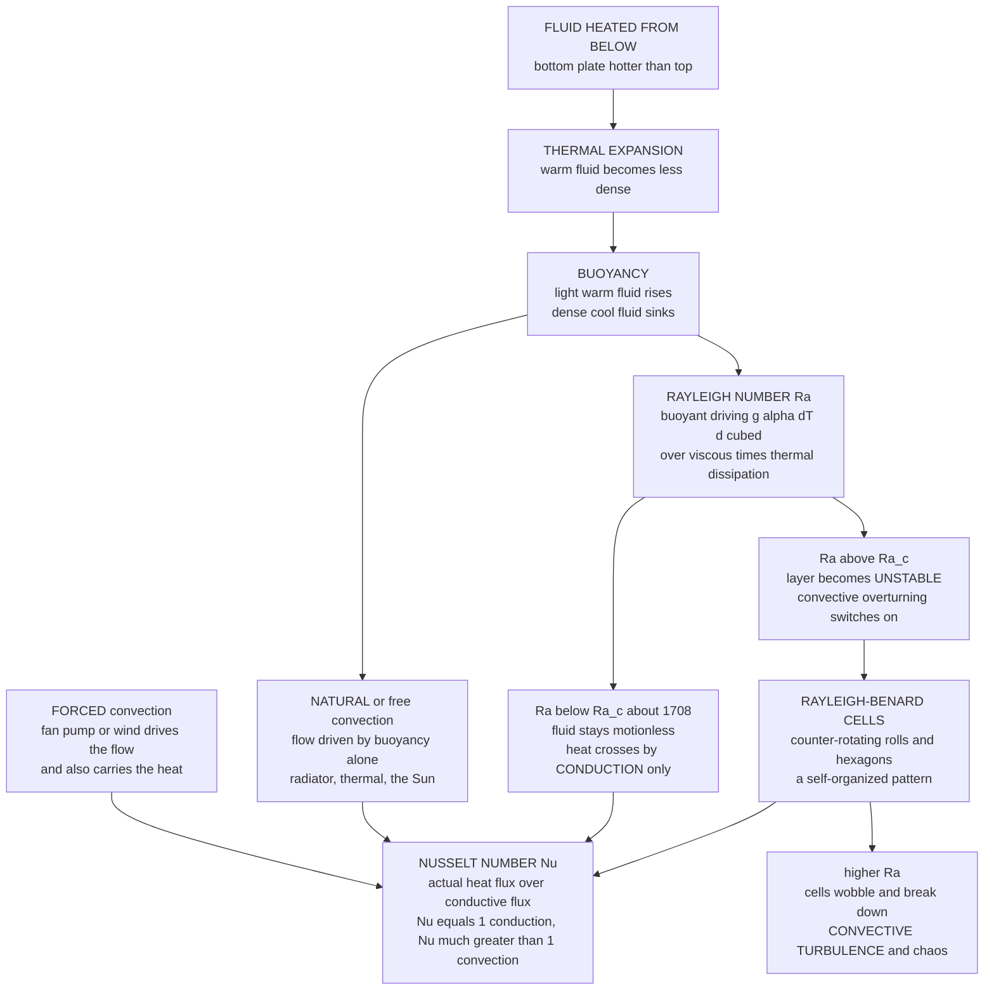

# 🔥 Convection and Thermal Fluid Dynamics

> [!abstract] TL;DR
> **Convection** is heat transported by the *bulk motion* of fluid — warm, buoyant fluid rises while cool, dense fluid sinks, physically carrying thermal energy far faster than **conduction** could diffuse it through a static medium. It is one of the three modes of heat transfer (with conduction and radiation) and the dominant one in fluids, and it lives at the *coupling* of the flow field and the temperature field — hence **thermal fluid dynamics**. The engine is **buoyancy**: **thermal expansion** makes warm fluid lighter, so gravity lifts it (the **Boussinesq approximation** keeps density variable only in the buoyancy term). Convection comes in two regimes — **natural (free)** convection driven by buoyancy alone (a radiator, a rising thermal, the Sun's surface) and **forced** convection driven by an external fan, pump, or wind that also sweeps heat away (cooling a chip, a heat exchanger). The paradigm is **Rayleigh-Bénard convection**: a fluid layer heated from below stays motionless and conducts until the **Rayleigh number** $Ra$ (buoyant driving over viscous-plus-thermal dissipation) exceeds a critical $Ra_c \approx 1708$, at which point the layer spontaneously organizes into **convection cells** — a textbook instability, self-organization, and, at high $Ra$, the route to convective turbulence and chaos (Lorenz's equations came from exactly this). The **Nusselt number** $Nu$ measures the payoff: $Nu = 1$ means pure conduction, $Nu \gg 1$ means convection has multiplied the heat transport, scaling roughly as $Nu \sim Ra^{1/3}$. Convective overturning drives thunderstorms and the Hadley circulation, the churning granulation of the Sun and its magnetic dynamo, the slow mantle convection that powers plate tectonics, ocean deep-water formation, and Earth's core geodynamo — while engineered convection cools electronics and runs every heat exchanger.

---

## Intuition

**Analogy first.** Put a pot of water on the stove. For the first moment nothing seems to move — the warmth creeps upward the slow way, by **conduction**, molecule jostling molecule through still water. But past a threshold the fluid can no longer take it: the hot, light water pinned at the bottom breaks free and *surges upward* in plumes, while cooler, denser water at the top peels off and sinks to replace it. Watch a pan of oil with a little pepper in it and the flow organizes into a mesmerizing tiling of rolling cells — fluid overturning in an orderly, self-made pattern. That churning is **convection**: the fluid transporting heat by *bodily moving itself*, hauling warm parcels up and cold parcels down, far faster than conduction ever could.

The very same overturning, scaled up almost beyond imagination, drives the boiling **granulation** on the surface of the Sun, the achingly slow creep of Earth's solid **mantle** over hundreds of millions of years, the towering updraft of a **thunderstorm**, and — scaled back down — the warm air a household **radiator** sheds into your room. Wherever a fluid is heated unevenly in a gravitational field, buoyancy sets it in motion, and that motion carries the heat. Convection is one of the most universal and consequential phenomena in nature and engineering alike.

---

## How It Works

### Convection versus conduction: heat that moves the medium

Heat crosses a material in three ways: **conduction** (energy diffusing through a *static* medium as fast molecules bump slow ones), **radiation** (electromagnetic emission, needing no medium), and **convection** (energy carried by the *bulk flow* of a fluid). Conduction is described by Fourier's law $q = -k\,\nabla T$ and is *slow* — it is diffusion, spreading as $\sqrt{t}$. Convection cheats: instead of waiting for heat to trickle through, it *moves the hot fluid itself* to where the cold is, replacing a slow diffusive relay with a fast advective conveyor. This is why a fan cools you and why the ocean can shuttle tropical heat to the poles. The governing physics is the **advection-diffusion equation** for temperature, $\partial_t T + \mathbf{u}\cdot\nabla T = \kappa\,\nabla^2 T$, coupled to the momentum equation through the flow $\mathbf{u}$ — the two fields drive each other, which is what makes it *thermal fluid dynamics* rather than either heat transfer or fluid mechanics alone.

### Buoyancy: the engine of overturning

Why does warm fluid rise? **Thermal expansion.** Heating a fluid at roughly constant pressure lowers its density by $\rho \approx \rho_0[1 - \alpha(T - T_0)]$, where $\alpha$ is the thermal expansion coefficient. A warmer parcel is therefore *lighter* than its surroundings, and — by exactly the [[Fluid_Statics_and_Buoyancy|Archimedes buoyancy]] that floats a ship — gravity pushes it up; a cooler, denser parcel sinks. The net upward force per volume is $\approx \rho_0\,g\,\alpha\,\Delta T$. Practically, we model this with the **Boussinesq approximation**: treat density as *constant everywhere except in the gravity (buoyancy) term*, where its tiny variations are exactly what drives the flow. Whether buoyancy actually overturns the fluid depends on the **stratification**: warm fluid sitting *on top* of cold is **stably stratified** (nothing wants to move — the arrangement is already bottom-heavy), while warm *underneath* cold is **unstably stratified** and primed to overturn. Convection is what happens when unstable stratification wins.

### Natural (free) versus forced convection

- **Natural / free convection** — the flow is *driven by buoyancy itself*: temperature differences create density differences, and gravity does the rest. A radiator warming a room, a thermal rising off sun-baked asphalt, the plume above a candle, the Sun's surface — all self-organize with no external mover. Its vigor is set by the **Rayleigh number**.
- **Forced convection** — an *external* agent (a fan, a pump, the wind) drives the flow, and that flow *also* carries heat. CPU heat sinks, car radiators, and shell-and-tube **heat exchangers** are forced-convection devices; their heat transport is set by the **Reynolds** and **Prandtl** numbers.
- **Mixed convection** — when buoyancy and forced flow are comparable (e.g. a heated vertical plate in a gentle breeze), both matter, and the ratio $Gr/Re^2$ (Grashof over Reynolds squared) decides which dominates.

### Rayleigh-Bénard convection: the paradigm

The cleanest laboratory of convection is a fluid layer of depth $d$ trapped between two horizontal plates, the **bottom heated** and the top cooled by $\Delta T$. Below a critical driving the fluid sits perfectly still and heat crosses by **conduction only** — a linear temperature profile, no motion. Increase $\Delta T$ and, at a sharp threshold, the motionless state loses stability: the layer spontaneously breaks into **convection cells** — long counter-rotating **rolls**, or, near onset in many fluids, tidy **hexagons**. This is a beautiful pattern-forming **instability** (developed in full in [[Hydrodynamic_Instabilities]]) and a paradigm of **self-organization**: order emerging from a uniform, symmetric state with no template imposed from outside. Push $Ra$ higher and the cells wobble, oscillate, and eventually break down into **convective turbulence**. Edward Lorenz built his famous three-equation chaos model by drastically truncating exactly this system — the butterfly effect was born in a convecting layer.

### The Rayleigh number: the control knob

The single dimensionless number that decides onset is the **Rayleigh number**:

$$Ra = \frac{g\,\alpha\,\Delta T\,d^3}{\nu\,\kappa}$$

Read it as a ratio: the **buoyant driving** ($g\,\alpha\,\Delta T$) in the numerator versus the two things that *resist* overturning — viscous drag $\nu$ (kinematic viscosity) and thermal diffusion $\kappa$ (which smears out the temperature contrast a rising parcel relies on). Convection **onsets** only when buoyancy overwhelms both dissipations, i.e. when $Ra$ crosses a **critical value** $Ra_c$. For a layer between two rigid, no-slip plates $Ra_c \approx 1708$; for idealized stress-free boundaries it drops to $27\pi^4/4 \approx 657.5$. The larger $Ra$ is beyond $Ra_c$, the more vigorously the fluid convects — $Ra$ is *the* measure of convective intensity (natural convection derived from the more general [[Dimensional_Analysis_and_Similarity|dimensional-analysis]] of the Boussinesq equations).

### The Nusselt number: the engineering payoff

If $Ra$ says *whether and how hard* the fluid convects, the **Nusselt number** says *how much good it does*:

$$Nu = \frac{\text{actual (convective) heat flux}}{\text{pure conductive heat flux}}$$

$Nu = 1$ means the fluid is motionless and heat crosses by conduction alone; $Nu \gg 1$ means convection has multiplied the heat transport many-fold. Below $Ra_c$, $Nu \equiv 1$. Above onset, $Nu$ climbs, and across a wide turbulent range it follows a scaling law close to $Nu \sim Ra^{1/3}$ (the classical Malkus/Priestley argument; real experiments land near $Ra^{0.28}$–$Ra^{1/3}$, with an ultimate $Ra^{1/2}$ regime debated). That exponent is the whole reason engineers *want* convection: a heat sink or boiler with $Nu = 50$ moves fifty times the heat of a still fluid.

### Plumes and thermals: the structures of convection

Convection organizes into recognizable structures. **Plumes** are *continuous* buoyant columns — the rising stalk above a smokestack, a hydrothermal vent, or a volcanic eruption column, and the sinking cold fingers at the top of a Rayleigh-Bénard cell. **Thermals** are *discrete* buoyant blobs that detach and rise — the invisible updrafts that soaring birds and glider pilots circle to gain altitude, and the parcels whose condensation builds fair-weather **cumulus** clouds. Both are the fluid's way of packaging buoyancy into coherent transport.

### Flow / Architecture



---

## Key Concepts

### Secondary Level

- **Convection = heat that moves the fluid.** Instead of heat slowly seeping through still material (conduction), the hot fluid *itself* travels: warm rises, cool sinks, carrying the heat along. It is one of the three ways heat travels, alongside conduction and radiation.
- **Warm rises because it is lighter.** Heating a fluid makes it expand and thin out, so it floats up like a hot-air balloon; cold fluid is denser and drops. That up-and-down swap is the whole mechanism.
- **Heated from below overturns; heated from above does not.** Warm-on-bottom is top-heavy and unstable — it churns. Warm-on-top is already stable and sits quietly.
- **Two flavors.** *Natural* convection runs on buoyancy alone (a radiator warming a room). *Forced* convection uses a fan or pump to push the fluid and sweep heat away (a computer fan, a hair dryer).
- **Everywhere in nature.** The boiling Sun's surface, thunderstorm updrafts, the slow churn of Earth's interior, and the pot on your stove are all the same phenomenon at wildly different sizes.

### Undergraduate Level

- **Boussinesq buoyancy.** Density varies as $\rho = \rho_0[1 - \alpha(T-T_0)]$; keep it constant everywhere except the gravity term, giving a buoyancy force $\rho_0 g \alpha (T-T_0)$ that closes the coupled momentum and heat equations.
- **Rayleigh number.** $Ra = g\alpha\,\Delta T\,d^3/(\nu\kappa)$ — buoyant forcing over viscous and thermal dissipation. It is the control parameter for onset and vigor.
- **Critical Rayleigh number.** Convection begins at $Ra_c \approx 1708$ (rigid plates) or $27\pi^4/4 \approx 657.5$ (stress-free). Below it, motionless conduction; above it, cells.
- **Nusselt number.** $Nu = qd/(k\,\Delta T)$ = convective flux over conductive flux. $Nu=1$ is pure conduction; the high-$Ra$ scaling is roughly $Nu \sim Ra^{1/3}$.
- **Prandtl number.** $Pr = \nu/\kappa$ (momentum vs thermal diffusivity) sets *how* convection behaves — thin thermal boundary layers, plume structure — even though onset $Ra_c$ is Pr-independent.
- **Forced convection scaling.** In forced flow the heat transfer is correlated as $Nu = f(Re, Pr)$, e.g. the Dittus-Boelter relation $Nu = 0.023\,Re^{0.8}Pr^{0.4}$ for turbulent pipe flow.

### Graduate Level

- **Boussinesq equations.** The nondimensional system $\frac{1}{Pr}(\partial_t\mathbf{u} + \mathbf{u}\cdot\nabla\mathbf{u}) = -\nabla p + \nabla^2\mathbf{u} + Ra\,\theta\,\hat{\mathbf{z}}$, $\partial_t\theta + \mathbf{u}\cdot\nabla\theta = w + \nabla^2\theta$, $\nabla\cdot\mathbf{u}=0$ — with $Ra$ and $Pr$ the only parameters, a clean statement of thermal fluid dynamics.
- **Linear onset.** Normal-mode analysis of the conductive base state yields the neutral curve; for stress-free boundaries $Ra(a) = (\pi^2+a^2)^3/a^2$, minimized at $a_c = \pi/\sqrt2$ giving $Ra_c = 27\pi^4/4$. Rigid boundaries require solving a transcendental characteristic equation ($Ra_c \approx 1707.76$, $a_c \approx 3.117$) — the classic Rayleigh/Jeffreys/Pellew-Southwell result.
- **Weakly nonlinear amplitude.** Near onset the roll amplitude obeys a Landau/Ginzburg-Landau equation $\dot A = \sigma A - \ell|A|^2A$; the supercritical pitchfork gives $A \propto \sqrt{Ra - Ra_c}$ and hence $Nu - 1 \propto (Ra/Ra_c - 1)$ just above threshold. Hexagons versus rolls are selected by non-Boussinesq (temperature-dependent property) symmetry breaking.
- **Route to chaos.** Truncating the Boussinesq system to three modes gives the **Lorenz equations** $\dot x = \sigma(y-x)$, $\dot y = rx - y - xz$, $\dot z = xy - \beta z$ with $r \propto Ra/Ra_c$ — the origin of deterministic chaos and the strange attractor.
- **High-Ra heat-transport theory.** Malkus marginal-stability and Grossmann-Lohse boundary-layer theories predict $Nu(Ra, Pr)$; the debated **ultimate regime** ($Nu \sim Ra^{1/2}(\ln Ra)^{-3/2}$, Kraichnan) concerns turbulence in bulk-dominated transport, tested at $Ra > 10^{12}$.
- **Rigorous bounds.** The **background/Constantin-Doering-Hopf** variational method proves upper bounds $Nu \le c\,Ra^{1/2}$, connecting convective heat transport to the mathematics of turbulence and dissipation (foreshadowing [[Turbulence_Fundamentals]]).

---

## Python Demo

```python
# Convection physics in four panels:
#   (a) ONSET via the Nusselt number Nu(Ra): pure CONDUCTION (Nu = 1) below the
#       critical Rayleigh number Ra_c ~ 1708, then Nu rising once Ra > Ra_c with
#       the classic high-Ra scaling Nu ~ (Ra / Ra_c)^(1/3).
#   (b) The supercritical PITCHFORK bifurcation at onset: the convective flow
#       amplitude stays exactly zero below Ra_c and grows like sqrt(Ra - Ra_c)
#       above it (two branches = the roll can turn either way).
#   (c) A Rayleigh-Benard CONVECTION CELL: streamlines of counter-rotating rolls
#       from the stream function psi = A sin(pi z) cos(k x).
#   (d) The TEMPERATURE field with velocity arrows: hot plumes rising in the
#       up-flow, cold fluid sinking in the down-flow.
import numpy as np
import matplotlib.pyplot as plt

Ra_c = 1708.0                      # critical Rayleigh number, rigid plates

# =====================================================================
# (a) NUSSELT NUMBER vs RAYLEIGH NUMBER  (heat-transport enhancement)
# =====================================================================
Ra = np.logspace(2.5, 9, 500)      # ~316 up to 1e9
Nu = np.where(Ra < Ra_c, 1.0, (Ra / Ra_c) ** (1.0 / 3.0))
print(f"(a) Ra_c = {Ra_c:.0f}")
for Rq in [500, 1708, 1e4, 1e6, 1e8]:
    nq = 1.0 if Rq < Ra_c else (Rq / Ra_c) ** (1 / 3)
    print(f"    Ra = {Rq:>9.0f}   Nu = {nq:6.2f}"
          f"   {'conduction only' if nq == 1 else 'convection enhanced'}")

# =====================================================================
# (b) PITCHFORK BIFURCATION: convective amplitude ~ sqrt(Ra - Ra_c)
# =====================================================================
Ra_b = np.linspace(1000, 4000, 400)
amp = np.where(Ra_b > Ra_c, np.sqrt(np.clip(Ra_b - Ra_c, 0, None)), 0.0)
amp /= amp.max()                   # normalize to unit peak

# =====================================================================
# (c),(d) CONVECTION-CELL FIELDS from a Boussinesq roll stream function
#   psi = A sin(pi z) cos(k x),   z in [0,1], depth = 1
#   incompressible 2D:  u = d psi/dz ,  w = -d psi/dx
#   temperature: conductive profile (1 - z) plus a roll perturbation in
#   phase with vertical velocity (warm fluid rides the up-flow).
# =====================================================================
k = 3.117                          # critical horizontal wavenumber (rigid plates)
A = 0.10                           # roll amplitude
nx, nz = 220, 90
x = np.linspace(0, 4.0, nx)        # ~2 rolls wide
z = np.linspace(0, 1.0, nz)
X, Z = np.meshgrid(x, z)

psi = A * np.sin(np.pi * Z) * np.cos(k * X)
U   =  A * np.pi * np.cos(np.pi * Z) * np.cos(k * X)   #  d psi / dz
W   =  A * k     * np.sin(np.pi * Z) * np.sin(k * X)   # -d psi / dx
theta = 0.9 * np.sin(np.pi * Z) * np.sin(k * X)        # perturbation, in phase with W
T = (1.0 - Z) + theta                                  # conduction profile + convection
print(f"(c/d) cell fields: k = {k}, amplitude A = {A}, grid {nx}x{nz}")

# =====================================================================
# PLOTS
# =====================================================================
fig, ax = plt.subplots(2, 2, figsize=(14, 10))

# (a) Nu vs Ra on log-log axes
ax[0, 0].loglog(Ra, Nu, color="#d1495b", lw=2.4)
ax[0, 0].axvline(Ra_c, color="k", ls="--", lw=1)
ax[0, 0].axhline(1.0, color="#2a9d8f", ls=":", lw=1.2)
ax[0, 0].text(3e2, 1.05, "Nu = 1  CONDUCTION only", color="#2a9d8f", fontsize=9)
ax[0, 0].text(Ra_c * 1.3, 1.2, "Ra_c ~ 1708\nonset of convection", fontsize=9)
ax[0, 0].text(5e6, 30, "Nu ~ Ra^(1/3)", color="#d1495b", fontsize=10)
ax[0, 0].set_xlabel("Rayleigh number Ra")
ax[0, 0].set_ylabel("Nusselt number Nu")
ax[0, 0].set_title("(a) Onset: heat transport jumps above Ra_c")
ax[0, 0].grid(alpha=0.3, which="both")

# (b) pitchfork bifurcation
ax[0, 1].plot(Ra_b, amp, color="#e76f51", lw=2.4, label="convecting branch")
ax[0, 1].plot(Ra_b, -amp, color="#e76f51", lw=2.4)
ax[0, 1].plot(Ra_b[Ra_b <= Ra_c], 0 * Ra_b[Ra_b <= Ra_c],
              color="#2a9d8f", lw=2.4, label="motionless (stable)")
ax[0, 1].plot(Ra_b[Ra_b > Ra_c], 0 * Ra_b[Ra_b > Ra_c],
              color="#2a9d8f", lw=1.2, ls="--", label="motionless (unstable)")
ax[0, 1].axvline(Ra_c, color="k", ls="--", lw=1)
ax[0, 1].text(Ra_c * 1.02, -0.9, "Ra_c", fontsize=10)
ax[0, 1].set_xlabel("Rayleigh number Ra")
ax[0, 1].set_ylabel("convective flow amplitude")
ax[0, 1].set_title("(b) Supercritical pitchfork: amplitude ~ sqrt(Ra - Ra_c)")
ax[0, 1].legend(fontsize=8, loc="lower right")

# (c) streamlines of the convection rolls
sp = ax[1, 0].streamplot(X, Z, U, W, density=1.3, color=np.hypot(U, W),
                         cmap="viridis", linewidth=1.0)
ax[1, 0].set_aspect("equal")
ax[1, 0].set_xlim(0, 4.0); ax[1, 0].set_ylim(0, 1.0)
ax[1, 0].set_xlabel("x"); ax[1, 0].set_ylabel("z")
ax[1, 0].set_title("(c) Rayleigh-Benard cells: counter-rotating rolls")

# (d) temperature field + velocity arrows (hot rising, cold sinking)
pc = ax[1, 1].pcolormesh(X, Z, T, cmap="RdBu_r", shading="auto")
skip = (slice(None, None, 8), slice(None, None, 12))
ax[1, 1].quiver(X[skip], Z[skip], U[skip], W[skip], color="k",
                scale=6, width=0.003)
fig.colorbar(pc, ax=ax[1, 1], label="temperature (hot = red)")
ax[1, 1].set_aspect("equal")
ax[1, 1].set_xlim(0, 4.0); ax[1, 1].set_ylim(0, 1.0)
ax[1, 1].set_xlabel("x"); ax[1, 1].set_ylabel("z")
ax[1, 1].set_title("(d) Temperature: hot plumes rise, cold fluid sinks")

plt.tight_layout()
plt.savefig("convection_thermal_fluid_dynamics.png", dpi=110)
print("Saved convection_thermal_fluid_dynamics.png")
```

**What it shows.** *Top-left:* the **Nusselt number** is pinned at exactly $Nu = 1$ — heat crossing by **conduction alone** — for every $Ra$ below the critical $Ra_c \approx 1708$; the instant $Ra$ exceeds $Ra_c$ the fluid starts to convect and $Nu$ climbs, following the classic $Nu \sim Ra^{1/3}$ scaling that quantifies how dramatically convection outpaces conduction. *Top-right:* the same onset seen as a **supercritical pitchfork bifurcation** — the motionless state is the only solution below $Ra_c$, but above it the convective amplitude grows as $\sqrt{Ra - Ra_c}$ on two symmetric branches (the roll can spin either way). *Bottom-left:* the **streamlines** of the Rayleigh-Bénard cells, a train of counter-rotating rolls. *Bottom-right:* the **temperature field** with velocity arrows overlaid — warm fluid (red) rides the up-flow as rising plumes while cold fluid (blue) sinks in the down-flow, the physical act of convective heat transport made visible.

---

## Real-World Applications

> **Cooling a CPU — forced convection as a hard design constraint.** A modern processor dumps 100–300 W from a chip the size of a fingernail; conduction through still air could never carry it away, so a **heat sink** spreads the flux over finned area and a **fan** forces air across it (forced convection, $Nu = f(Re, Pr)$). When even that saturates, servers switch to *liquid* cooling and, at the extreme, two-phase **boiling** convection. Thermal management — not transistor physics — is now the ceiling on how much power a chip can use, making convective heat transfer one of the central constraints of modern computing hardware.

- **Atmospheric convection and weather.** Solar heating of the ground destabilizes the lower atmosphere; buoyant thermals rise, condense, and build [[Thunderstorms_and_Convective_Systems|cumulus and thunderstorm cells]], while planetary-scale convection organizes the [[Global_Atmospheric_Circulation|Hadley circulation]] that sets the trade winds and the world's deserts. Convection *is* the engine of weather.
- **Mantle convection and plate tectonics.** Earth's solid rock creeps like an ultra-slow fluid, heated from within and below; [[Mantle_Convection_and_Hotspots|mantle convection]] over hundreds of millions of years drags the surface plates, opening oceans and raising mountains — Rayleigh-Bénard writ across a planet at $Ra \sim 10^7$.
- **The Sun and stars.** The outer third of [[The_Sun|the Sun]] is a convection zone; the granulation tiling its surface is the top of convection cells, and that churning of ionized gas winds up the magnetic field in the solar **dynamo** ([[Stellar_Structure_and_Energy_Generation|stellar structure]] uses convective versus radiative energy transport to build every star).
- **Ocean deep convection and the geodynamo.** Wintertime cooling in the North Atlantic and around Antarctica makes surface water dense enough to sink, forming deep water that drives the [[Thermohaline_Circulation_and_AMOC|thermohaline circulation]]; convection of liquid iron in Earth's outer core generates the [[Geomagnetism_and_Paleomagnetism|geomagnetic field]] via a self-exciting dynamo.
- **Engineered heat transfer.** Shell-and-tube and plate **heat exchangers**, boilers, condensers, building **HVAC** and passive-cooling stacks, and crystal-growth furnaces all live or die by their convective heat transport — the $Nu$-$Ra$ and $Nu$-$Re$-$Pr$ correlations are the daily bread of thermal engineering.

---

## Common Pitfalls

- **Confusing convection with conduction (or radiation).** Convection *requires bulk fluid motion* — it is advective transport, not diffusion. In a solid, or a truly motionless fluid, there is no convection, only conduction. Calling any hot-object heat loss "convection" without a moving fluid is wrong.
- **Thinking any heating causes convection.** Heating from *above* (warm on top) is *stably* stratified and does **not** convect — the fluid just conducts. Overturning needs unstable stratification (warm below cold) *and* enough of it: $Ra$ must exceed $Ra_c$. A gentle temperature gradient can sit conducting forever.
- **Forgetting the critical Rayleigh number.** There is a genuine *threshold*. Below $Ra_c \approx 1708$ the fluid is motionless no matter how long you wait; convection is not a smooth turn-on but a bifurcation. Designs that assume "some convection always helps" fail when $Ra < Ra_c$.
- **Misreading the Nusselt number.** $Nu$ is a *ratio to conduction*, dimensionless — not a heat flux. $Nu = 1$ means "no better than a still fluid," and $Nu = 40$ means "40× the conductive flux," not "40 watts." Treating $Nu$ as an absolute rate garbles every estimate.
- **Using the Boussinesq approximation out of range.** Keeping density variable *only* in the buoyancy term assumes small $\alpha\,\Delta T$. For large temperature contrasts, strong compressibility, or gases spanning big density ratios, non-Boussinesq and fully compressible effects (and hexagon selection) matter.
- **Ignoring the Prandtl number.** Two fluids at the same $Ra$ convect *differently*: mercury ($Pr \approx 0.02$) and oil ($Pr \approx 1000$) have utterly different plume and boundary-layer structure. Onset $Ra_c$ is Pr-independent, but heat transport and turbulence are not.
- **Confusing natural and forced regimes.** Correlations do not transfer: a natural-convection $Nu(Ra)$ law cannot be used for a fan-driven flow, which needs $Nu(Re, Pr)$. In the mixed regime ($Gr \sim Re^2$) you must account for both.

Deeper development lives in the not-yet-written Fluid-Dynamics siblings *Rotating_and_Stratified_Flows* (how rotation and stable stratification reshape convection into rolls, geostrophic columns, and baroclinic overturning) and *Geophysical_Fluid_Dynamics* (planetary-scale convection in atmospheres, oceans, mantles, and cores), while the high-$Ra$ breakdown of cells into disordered transport is the province of [[Turbulence_Fundamentals]].

---

## Related Concepts

- [[Fluid_Statics_and_Buoyancy]] — the Archimedes buoyancy and stable/unstable stratification that convection is built on; convection is buoyancy *set in motion by heat*.
- [[Hydrodynamic_Instabilities]] — Rayleigh-Bénard convection is the paradigm thermal instability; onset at $Ra_c$ is a bifurcation, and cells are pattern selection.
- [[Turbulence_Fundamentals]] — at high $Ra$ convection cells break down into convective turbulence; the $Nu$-$Ra$ scaling is a turbulent-transport law.
- [[The_Navier_Stokes_Equations]] — with a buoyancy body force these become the Boussinesq equations that govern all of thermal fluid dynamics.
- [[Dimensional_Analysis_and_Similarity]] — where the Rayleigh, Nusselt, Prandtl, and Grashof numbers come from, and why they collapse convection onto a few curves.
- [[The_Boundary_Layer]] — convective heat transport is throttled by thin thermal boundary layers at the plates; their scaling sets $Nu$.
- [[Laws_of_Thermodynamics]] — convection is a mode of heat transfer; expansion, buoyancy work, and the second law frame the energetics of overturning.
- [[Mantle_Convection_and_Hotspots]] — solid-rock convection driving plate tectonics — Rayleigh-Bénard across a planet.
- [[Thunderstorms_and_Convective_Systems]] — atmospheric convection: buoyant thermals, plumes, and the towers that make severe weather.
- [[Global_Atmospheric_Circulation]] — planetary convection organized into the Hadley cells that set global winds and climate zones.
- [[The_Sun]] — the solar convection zone and the granulation on the photosphere, and the dynamo it powers.
- [[Stellar_Structure_and_Energy_Generation]] — convective versus radiative energy transport shaping the interiors of stars.
- [[Thermohaline_Circulation_and_AMOC]] — ocean deep convection forming dense water that drives the global overturning circulation.
- [[Geomagnetism_and_Paleomagnetism]] — convection of liquid iron in the outer core generating Earth's magnetic field.

---

## Review Questions

1. **(Secondary)** A pot of water on the stove sits still at first, then suddenly starts churning in an orderly pattern of rolling cells. Explain, in terms of *what carries the heat*, why the churning transports heat faster than the still water did, and why heating the pot from the *top* instead of the bottom would produce no such churning.
2. **(Undergraduate)** Define the Rayleigh number $Ra$ and the Nusselt number $Nu$, giving the physical meaning of numerator and denominator in each. Sketch $Nu$ versus $Ra$ and explain why $Nu = 1$ for $Ra < Ra_c \approx 1708$ and why $Nu$ then rises roughly as $Ra^{1/3}$. Distinguish natural from forced convection and state which dimensionless groups control each.
3. **(Graduate)** Starting from the Boussinesq equations, outline the linear stability calculation that yields the neutral curve $Ra(a) = (\pi^2+a^2)^3/a^2$ for stress-free boundaries, find the critical wavenumber and $Ra_c$, and explain physically why rigid boundaries raise $Ra_c$ to $\approx 1708$. Then describe how a severe truncation of this system produces the Lorenz equations, and what that reveals about the route from steady convection to chaos.

---

## Sources

- Chandrasekhar, S. — *Hydrodynamic and Hydromagnetic Stability*, Oxford / Dover (the definitive derivation of the Rayleigh-Bénard critical Rayleigh number for rigid, free, and mixed boundaries).
- Kundu, Cohen & Dowling — *Fluid Mechanics*, 6th ed., chapters on thermal convection and instability (Boussinesq approximation, $Ra$, $Nu$, onset).
- Incropera, DeWitt, Bergman & Lavine — *Fundamentals of Heat and Mass Transfer*, 8th ed. (engineering natural and forced convection, $Nu$-$Ra$ and $Nu$-$Re$-$Pr$ correlations).
- Ahlers, Grossmann & Lohse (2009) — "Heat transfer and large-scale dynamics in turbulent Rayleigh-Bénard convection," *Reviews of Modern Physics* 81, 503 (modern high-$Ra$ $Nu$-scaling theory and experiment).
- Lorenz, E. N. (1963) — "Deterministic Nonperiodic Flow," *Journal of the Atmospheric Sciences* 20, 130-141 (the convection-derived model that launched chaos theory).

---

#fluid-dynamics #convection #rayleigh-benard #buoyancy #heat-transfer
