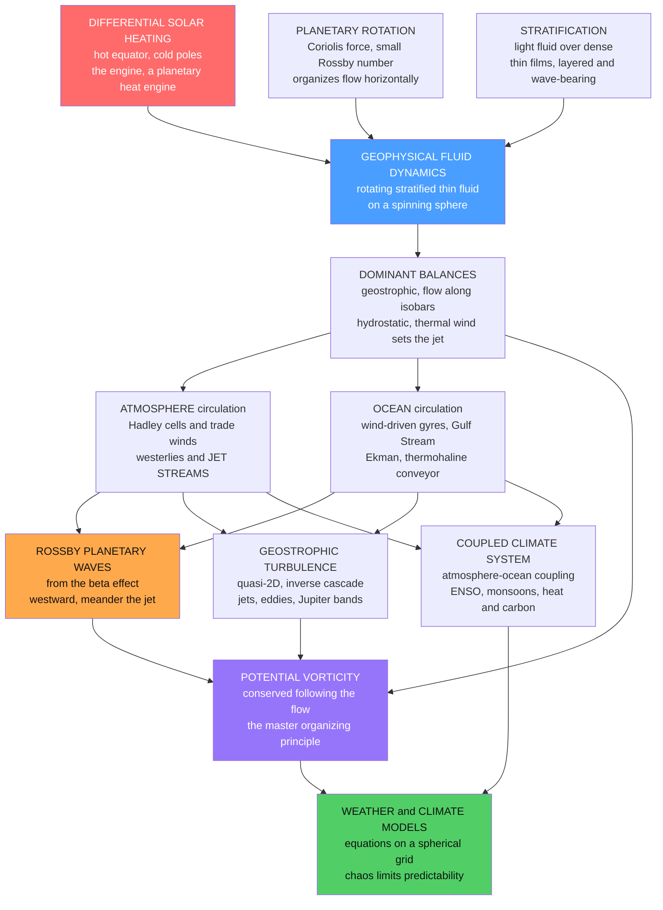

# 🌍 Geophysical Fluid Dynamics

> [!abstract] TL;DR
> **Geophysical Fluid Dynamics (GFD)** is the fluid mechanics of the planet's fluids — the large-scale **atmosphere** and **ocean** (and, by extension, planetary and stellar interiors) treated as **thin, rotating, stratified films** smeared over a spinning sphere and driven by **differential solar heating** (hot equator, cold poles). Three ingredients set everything: **heating** is the engine that converts an equator-to-pole temperature difference into winds and currents; **rotation** (the Coriolis force) organizes the flow into large, nearly-horizontal patterns; and **stratification** (light fluid over dense) layers it and lets it wave. Because the flow is slow, wide, and fast-rotating, it settles into approximate **balances** — **geostrophic** (Coriolis ↔ pressure gradient, so wind blows *along* isobars, not across them), **hydrostatic** (weight ↔ vertical pressure), and their marriage in **quasi-geostrophy** and the **thermal wind** (temperature gradients set vertical wind shear — the jet stream). From this machinery emerge the **general circulation** (Hadley cells and trade winds, the mid-latitude westerlies and jet streams, the wind-driven ocean gyres and the Gulf Stream, the thermohaline conveyor), the **Rossby (planetary) waves** that make the jet meander, the **geostrophic turbulence** whose energy cascades *upscale* into jets and eddies (Jupiter's bands, ocean rings), and the master conserved quantity — **potential vorticity** — beneath it all. Discretized on rotating spherical grids and run on supercomputers, the GFD equations literally *are* the weather forecast and the climate model, making GFD one of fluid dynamics' most consequential applications and the fluid-mechanical foundation of Earth system science.

---

## Intuition

**Analogy:** Take a spinning basketball and wrap it in two impossibly thin films of fluid — a whisper of air and a slightly thicker skin of water. Both films are *thin* the way the peel is thin on an orange: the atmosphere's weather lives in the bottom ~10 km of a planet 6,371 km in radius, and the ocean averages ~4 km deep across basins ~10,000 km wide. Now light a fire under the equator and pack the poles in ice. Heat *wants* to flow from the hot belt to the cold caps, but the ball is *spinning*, so every attempt the fluid makes to run poleward gets deflected sideways by the rotation into vast, sweeping, sideways-organized flows. From this absurdly simple setup — a **heated, rotating, stratified thin film** — emerges *everything*: the trade winds and the doldrums, the jet stream and its meanders, the Gulf Stream, hurricanes, El Niño, monsoons, and the climate itself.

That is Geophysical Fluid Dynamics: the physics of how a spinning, layered, unevenly-heated fluid organizes itself on a planet. And here is why it matters more than almost any other branch of fluid mechanics — its equations, discretized and run on the world's biggest supercomputers, **are** the weather forecast and the climate model. When you check tomorrow's rain or read a projection of the year 2100, you are reading the output of GFD. Understanding how a rotating stratified fluid organizes itself is, quite literally, understanding the machinery of our planet.

---

## How It Works

### Core Mechanics

**1. The setup — thin, rotating, stratified films driven by a heating imbalance.** GFD begins from the [[The_Navier_Stokes_Equations|Navier–Stokes equations]] written in a **rotating frame** on a sphere, but its whole character comes from three facts about planetary fluids. First, they are **thin**: horizontal scales (thousands of km) dwarf vertical ones (kilometres), so the motion is overwhelmingly *horizontal* and the vertical is nearly passive. Second, they **rotate**: the planet turns once a day, and on the scales of weather and currents the **Coriolis force** is a first-order player, not a curiosity. Third, they are **stratified**: buoyant fluid sits over dense (warm air over cold, fresh/warm water over salty/cold), which strongly resists vertical motion and supports internal waves. The **engine** driving all of it is **differential solar heating** — the tropics absorb far more sunlight than they radiate, the poles the reverse — so the fluid is a giant **heat engine** perpetually trying to carry heat poleward, converting the equator-to-pole temperature contrast into the kinetic energy of winds and currents.

**2. Rotation matters when the Rossby number is small.** Whether rotation dominates is measured by the **Rossby number** $Ro = U/(fL)$, the ratio of the fluid's own acceleration to the Coriolis acceleration ($f = 2\Omega\sin\phi$ is the **Coriolis parameter**, the local vertical spin rate of the planet). For a mid-latitude weather system, $U \sim 10$ m/s, $L \sim 10^6$ m, $f \sim 10^{-4}$ s$^{-1}$, giving $Ro \sim 0.1$ — **rotation wins**. Small $Ro$ is the defining regime of GFD and is exactly what lets the equations simplify into *balances*. (Contrast a coffee cup, $Ro \sim 10^4$: rotation is utterly negligible, which is why your morning stir owes nothing to the Earth's spin.)

**3. The dominant balances — geostrophic and hydrostatic.** When $Ro$ is small and the fluid is thin, the momentum equations collapse into two beautiful approximate balances that do most of GFD's explanatory work (developed for flow generally in the sibling *Rotating_and_Stratified_Flows*):
   - **Geostrophic balance** — horizontally, the **Coriolis force balances the pressure-gradient force**, so the flow runs *along* lines of constant pressure rather than down the gradient: $f\,\vec{u} = \frac{1}{\rho}\,\hat{z}\times\nabla p$. This is why weather maps work — winds blow *parallel* to the isobars, counter-clockwise around lows in the Northern Hemisphere, and the map of pressure *is* essentially the map of the wind (see [[Coriolis_Effect_and_Geostrophic_Balance]]).
   - **Hydrostatic balance** — vertically, the **pressure gradient balances gravity**: $\partial p/\partial z = -\rho g$. Because the fluid is thin, vertical accelerations are tiny and the vertical momentum equation reduces to this static weighing of the fluid column (the atmospheric case is the [[Atmospheric_Pressure_and_the_Hydrostatic_Equation|hydrostatic equation]]).
   Combine the two and differentiate, and you get the **thermal wind** relation: a *horizontal temperature gradient* forces the geostrophic wind to *change with height*. The pole-to-equator temperature difference therefore mandates strong upper-level westerlies — the **jet stream** is thermal wind made visible. The workhorse approximation that keeps geostrophy as a leading balance while allowing slow evolution is **quasi-geostrophy (QG)**, the single most-used framework in dynamical meteorology and oceanography.

**4. The general circulation of the atmosphere.** The atmosphere's organized response to the heating imbalance is the **general circulation** ([[Global_Atmospheric_Circulation|see the dedicated note]]). In the tropics, direct thermal overturning forms the **Hadley cells**: air rises at the heat-fed **ITCZ** near the equator, flows poleward aloft, sinks in the subtropics (~30°, home of the great deserts), and returns equatorward at the surface — and rotation deflects that return flow into the **trade winds**. Poleward of the Hadley cells, the flow cannot overturn directly (rotation forbids it); instead the **mid-latitude westerlies** and their **jet streams** carry heat poleward largely through **baroclinic eddies** — the travelling highs and lows of everyday weather, which are the dominant poleward heat conveyor at mid-latitudes. The classical three-cell caricature (Hadley, Ferrel, polar) captures the mean, but the *eddies* do much of the real work.

**5. The general circulation of the ocean.** The ocean answers the same rotating-stratified physics in three intertwined systems ([[Wind_Driven_Circulation_and_Sverdrup_Balance|wind-driven theory]]). Surface **wind stress** drives the great subtropical and subpolar **gyres**; the **β-effect** (the poleward increase of $f$) breaks their east–west symmetry and jams the return flow into narrow, fast **western boundary currents** — the [[Western_Boundary_Currents_and_Gulf_Stream|Gulf Stream]] and Kuroshio (Sverdrup and Stommel theory). Near the surface, wind acting through rotation produces **Ekman transport** at right angles to the wind, driving coastal **upwelling** that feeds the world's fisheries ([[Ekman_Transport_and_Coastal_Upwelling|Ekman transport]]). And on the longest timescales, density differences set by heat and salt drive the deep **thermohaline / overturning circulation** — the "global conveyor belt" that moves heat and carbon over centuries to millennia and is central to climate ([[Thermohaline_Circulation_and_AMOC|thermohaline circulation and the AMOC]]).

**6. Rossby (planetary) waves — the giant waves that steer weather.** The most distinctive wave of GFD owes its very existence to the fact that the Coriolis parameter **varies with latitude** — the **β-effect**, $\beta = df/d\phi \cdot 1/R$. Displace a ring of fluid poleward: conservation of **potential vorticity** forces it to spin one way; displace it equatorward and it spins the other. The result is a restoring mechanism that produces enormous, slow, **westward-propagating** undulations — **Rossby waves**. In the atmosphere they make the **jet stream meander** into the troughs and ridges that *are* the large-scale weather pattern and that steer storms; in the ocean they slowly adjust the gyres and carry signals across basins over years. Their signature is a **westward phase speed** and a strong dependence on wavelength (long waves race west, short waves can drift east), which the demo below reproduces. When a mean westerly flow exactly cancels their westward tendency, they become **stationary planetary waves** locked to the continents and mountains — which is why the jet's big kinks sit where they do.

**7. Geostrophic turbulence — why planetary flows self-organize into big structures.** Rapidly rotating, strongly stratified turbulence behaves almost **two-dimensionally**, because rotation and stratification suppress vertical motion. And 2D-like turbulence does something startling that its 3D cousin does not (contrast [[Turbulence_Fundamentals]]): its energy cascades **upscale** — an **inverse cascade** — spontaneously organizing small eddies into **larger** coherent structures. On a β-plane this upscale energy piles into **zonal jets and bands**. This is why planetary flows self-organize: the ocean's teeming **mesoscale eddies** ([[Mesoscale_Eddies_and_Ocean_Variability|mesoscale eddies]]), Jupiter's striking **banded winds** and its centuries-old **Great Red Spot**, and Earth's own zonal jets are all manifestations of geostrophic turbulence funnelling energy *up* the scale ladder rather than down it.

**8. Potential vorticity — the master conserved quantity.** If GFD has one central organizing principle, it is **potential vorticity (PV)**. Combining the fluid's own spin, the planet's spin, and the stratification, **Ertel's PV** is **conserved following the flow** in the absence of friction and heating. PV thinking is astonishingly powerful: it explains Rossby waves (they are the sloshing of a PV gradient), the dynamics of jets (they are PV staircases and barriers), and the birth of cyclones (as PV anomalies). Rather like [[Vorticity_and_Circulation|vorticity and Kelvin's theorem]] in ordinary flow, PV is the "vorticity of the rotating, stratified world" — a single scalar you can *track* to understand how the whole system evolves.

**9. Climate, coupling, and models — the practical culmination.** The atmosphere and ocean are **coupled**: they exchange heat, momentum, moisture, and carbon across their shared surface, and their coupled modes — **ENSO** (El Niño/La Niña, a coupled ocean–atmosphere oscillation of the tropical Pacific, see [[Ocean_Atmosphere_Coupling_and_ENSO]]), the monsoons, and the slow overturning circulation — *are* the machinery of **climate** and its variability. The practical endpoint of GFD is therefore **numerical modelling**: discretize the rotating, stratified equations on a spherical grid, close the unresolved turbulence, convection, and clouds with **parameterizations**, and integrate. Forward a week, that is **numerical weather prediction** ([[Numerical_Weather_Prediction|NWP]]); forward a century with coupled ocean, ice, and carbon, that is a **general circulation / climate model** ([[Climate_Models_and_Projections|GCM]]). GFD is where **chaos** and the **butterfly effect** were discovered (Lorenz, 1963), so it also sets the *limits of predictability* — the reason forecasts are probabilistic and horizons finite. This is applied, planetary-scale computational fluid dynamics (the sibling *Computational_Fluid_Dynamics*).

### Flow / Architecture



---

## Key Concepts

### Secondary Level

- **A thin skin of fluid on a spinning ball.** The air and the ocean are amazingly thin compared to how wide they spread — weather lives in the bottom ~10 km, the ocean averages ~4 km deep. GFD studies how these thin films move.
- **The Sun heats the equator, the poles freeze.** That temperature difference is the *engine*. Heat tries to flow from the hot middle to the cold ends, and the winds and currents are the fluid trying to carry it there.
- **The spin bends everything sideways.** Because the planet rotates, moving air and water get deflected (the **Coriolis effect**), so instead of flowing straight from equator to pole they organize into huge sideways patterns — trade winds, the jet stream, ocean currents.
- **Giant slow waves and rivers in the sky and sea.** The **jet stream** meanders in enormous **Rossby waves**; the ocean has fast "rivers" like the **Gulf Stream**. GFD explains where they come from.
- **This *is* the weather forecast.** Put these physics into a computer and you get tomorrow's weather and the climate projections for 2100.

### Undergraduate Level

- **The three ingredients:** rotation (Coriolis parameter $f = 2\Omega\sin\phi$), stratification (buoyancy frequency $N$), and differential heating. The **Rossby number** $Ro = U/(fL)$ measures rotation's importance; GFD is the small-$Ro$ regime.
- **Geostrophic balance:** $f\,\vec{u}_g = \frac{1}{\rho}\hat{z}\times\nabla p$. Flow runs *along* isobars; the pressure map *is* the wind map. Add **hydrostatic** balance $\partial p/\partial z = -\rho g$ for the vertical.
- **Thermal wind:** $f\,\partial \vec{u}_g/\partial z \propto \hat{z}\times\nabla T$. A horizontal temperature gradient forces vertical shear — the equator-to-pole $\Delta T$ builds the jet stream.
- **The β-effect and Rossby waves:** $\beta = df/dy$. Dispersion relation $\omega = -\beta k/(k^2+l^2)$ gives **westward** phase speed; the meanders of the jet are Rossby waves. Stationary waves when a westerly $U = \beta/(k^2+l^2)$.
- **The general circulation:** Hadley cells (thermally direct, tropics), Ferrel/eddy-driven mid-latitudes, ocean gyres with **western intensification** (β), Ekman transport 90° to the wind.
- **Potential vorticity:** the QG PV $q = \nabla^2\psi + \beta y + (\text{stretching})$ is materially conserved, $Dq/Dt = 0$ — the unifying dynamical variable.

### Graduate Level

- **Quasi-geostrophy (QG).** Systematic expansion in $Ro$: leading order is geostrophic and hydrostatic; the next order gives the **QG potential vorticity equation** $\frac{Dq}{Dt}=0$ with $q = \nabla^2\psi + \beta y + \partial_z\!\left(\frac{f_0^2}{N^2}\partial_z\psi\right)$ — the workhorse of theoretical GFD. Rossby waves, baroclinic instability, and jet dynamics all follow from linearizing or analysing this one equation.
- **Ertel PV and invertibility.** Ertel's PV $q = \frac{1}{\rho}(\vec{\omega}_a\cdot\nabla\theta)$ (absolute vorticity dotted with the gradient of potential temperature) is conserved for adiabatic, frictionless flow. The **invertibility principle** — given PV plus a balance condition and boundaries, recover the entire flow — makes PV the master field of GFD.
- **Baroclinic instability.** The equator-to-pole temperature gradient stores available potential energy; the Eady/Charney problem shows the mean flow is unstable to growing waves that convert it to eddy kinetic energy. These eddies *are* mid-latitude weather and the dominant poleward heat flux — the general circulation is fundamentally an *eddy* problem.
- **Geostrophic turbulence and the inverse cascade.** Rotation/stratification render the dynamics quasi-2D; energy cascades upscale (Kraichnan) while enstrophy cascades down. On a β-plane the inverse cascade is arrested at the **Rhines scale** $L_\beta \sim \sqrt{U/\beta}$, organizing the flow into **zonal jets** (Earth's jets, Jupiter's bands).
- **Predictability and chaos.** Lorenz's discovery of sensitive dependence emerged directly from a truncated convection model; the finite error-doubling time bounds deterministic forecasting and motivates **ensemble** prediction and stochastic parameterization.
- **Non-QG frontiers.** Primitive-equation models, the surface QG (SQG) system, gravity-wave drag, moist and convective dynamics, and the eddy-parameterization (Gent–McWilliams) problem in ocean models are where modern GFD and climate modelling actually live.

---

## Python Demo

```python
# ROSSBY (planetary) WAVES on a mid-latitude beta-plane -- the hallmark of GFD.
#
# Rossby waves exist ONLY because the Coriolis parameter f = 2*Omega*sin(phi)
# VARIES with latitude: beta = df/dy > 0. A displaced ring of fluid conserves
# potential vorticity, acquires a spin anomaly, and the whole pattern marches
# WESTWARD. This demo builds the physics from scratch (numpy + matplotlib):
#
#   (a) HOVMOLLER diagram: the streamfunction at a fixed latitude vs longitude
#       and TIME. Phase lines tilt so that, as time increases, crests move to
#       smaller x -> WESTWARD propagation, the Rossby-wave signature.
#   (b) DISPERSION: zonal phase speed c_x = -beta/(k^2+l^2) and group speed
#       c_gx = beta*(k^2-l^2)/(k^2+l^2)^2 vs zonal wavelength. Long waves race
#       west; short waves' energy can go EAST -- classic Rossby dispersion.
#   (c) The MEANDERING JET: a mean westerly U plus a STATIONARY Rossby wave
#       (U = beta/K^2) gives the troughs-and-ridges pattern of the real jet
#       stream, locked in place -- the large-scale weather map itself.
import numpy as np
import matplotlib.pyplot as plt

# --- Planetary parameters at mid-latitude (~45 N) --------------------
Omega = 7.292e-5                       # Earth's rotation rate [1/s]
R     = 6.371e6                        # Earth's radius [m]
phi   = np.deg2rad(45.0)               # reference latitude
f0    = 2*Omega*np.sin(phi)            # Coriolis parameter [1/s]
beta  = 2*Omega*np.cos(phi)/R          # beta = df/dy [1/(m s)]
print(f"At 45N:  f0   = {f0:.3e} 1/s")
print(f"         beta = {beta:.3e} 1/(m*s)   (the engine of Rossby waves)")

# =====================================================================
# (a) A single free Rossby wave and its WESTWARD-tilting Hovmoller plot
#     psi(x,y,t) = A cos(k x + l y - omega t),  omega = -beta k/(k^2+l^2)
# =====================================================================
Lx = 2*np.pi*R*np.cos(phi)             # zonal circumference at 45N [m] ~ 28000 km
m  = 6                                  # zonal wavenumber (6 waves around the globe)
k  = 2*np.pi*m/Lx                       # zonal wavenumber [1/m]
l  = np.pi/6.0e6                        # meridional wavenumber (~one half-wave/6000 km)
K2 = k*k + l*l
omega = -beta*k/K2                      # Rossby dispersion relation [1/s]
cx    = omega/k                          # zonal PHASE speed [m/s] (negative = west)
period_days = 2*np.pi/abs(omega)/86400.0
print(f"\nWave m={m}: zonal phase speed = {cx:.2f} m/s (westward),"
      f" period = {period_days:.1f} days")

nx, nt = 400, 300
x  = np.linspace(0, Lx, nx)
tt = np.linspace(0, 20*86400.0, nt)     # 20 days
Xg, Tg = np.meshgrid(x, tt)
psi_hov = np.cos(k*Xg - omega*Tg)        # y-phase absorbed into a constant

# =====================================================================
# (b) DISPERSION: phase and group speed vs zonal wavelength
# =====================================================================
lam  = np.linspace(1.0e6, 12.0e6, 300)   # zonal wavelength 1000 -> 12000 km
kk   = 2*np.pi/lam
Kk2  = kk*kk + l*l
cx_l   = -beta*kk/Kk2                      # zonal phase speed [m/s]
cgx_l  =  beta*(kk*kk - l*l)/(Kk2*Kk2)     # zonal group speed [m/s]

# =====================================================================
# (c) MEANDERING JET: mean westerly U + stationary Rossby wave (omega=0)
#     Stationary condition:  U = beta/(k_s^2 + l^2)  ->  K_s = sqrt(beta/U)
# =====================================================================
U   = 10.0                                # mean zonal (westerly) wind [m/s]
Ks2 = beta/U                              # stationary total wavenumber^2
ly  = np.pi/6.0e6                          # meridional structure (~6000 km domain)
ks  = np.sqrt(max(Ks2 - ly*ly, 1e-18))     # stationary zonal wavenumber
lam_s = 2*np.pi/ks
print(f"\nStationary Rossby wave for U={U:.0f} m/s: wavelength ~ {lam_s/1e3:.0f} km"
      f"  ({Lx/lam_s:.1f} waves around the globe)")

xj = np.linspace(0, Lx, 260)
yj = np.linspace(-3.0e6, 3.0e6, 160)       # +/- 3000 km meridional band
Xj, Yj = np.meshgrid(xj, yj)
A_wave = 6.0e6                              # wave streamfunction amplitude
psi_jet = -U*Yj + A_wave*np.cos(ks*Xj)*np.cos(ly*Yj)   # mean flow + stationary wave

# =====================================================================
# PLOTS
# =====================================================================
fig, ax = plt.subplots(2, 2, figsize=(15, 10))

# (a) Hovmoller: westward phase propagation
im = ax[0, 0].contourf(x/1e3, tt/86400.0, psi_hov, levels=21, cmap="RdBu_r")
# overlay a phase line x = (omega t)/k + const, marching westward
t_line = tt/86400.0
x_line = ((omega*tt)/k) % Lx
ax[0, 0].plot(x_line/1e3, t_line, "k--", lw=1.5, label="a crest (moves WEST)")
ax[0, 0].set_xlabel("longitude  x  [km]"); ax[0, 0].set_ylabel("time  [days]")
ax[0, 0].set_title("(a) Hovmoller: Rossby wave streamfunction\n"
                   "phase lines tilt -> WESTWARD propagation")
ax[0, 0].legend(loc="upper right", fontsize=8)
fig.colorbar(im, ax=ax[0, 0], fraction=0.046, label="streamfunction")

# (b) dispersion relation
ax[0, 1].plot(lam/1e3, cx_l, color="#1f77b4", lw=2, label="phase speed c_x")
ax[0, 1].plot(lam/1e3, cgx_l, color="#d62728", lw=2, label="group speed c_gx")
ax[0, 1].axhline(0, color="k", lw=0.8)
ax[0, 1].set_xlabel("zonal wavelength  [km]")
ax[0, 1].set_ylabel("speed  [m/s]  (negative = westward)")
ax[0, 1].set_title("(b) Rossby dispersion\nlong waves race WEST; short-wave energy can go EAST")
ax[0, 1].legend(fontsize=9); ax[0, 1].grid(alpha=0.3)

# (c) meandering jet: streamlines of mean flow + stationary wave
cs = ax[1, 0].contour(Xj/1e3, Yj/1e3, psi_jet, levels=18, cmap="viridis")
ax[1, 0].set_xlabel("longitude  x  [km]"); ax[1, 0].set_ylabel("latitude (relative)  [km]")
ax[1, 0].set_title(f"(c) Meandering jet stream\nmean westerly + STATIONARY Rossby wave"
                   f"  (~{lam_s/1e3:.0f} km)")
fig.colorbar(cs, ax=ax[1, 0], fraction=0.046, label="streamfunction (streamlines)")

# (d) snapshot of the free Rossby-wave streamfunction pattern (map view)
ys = np.linspace(-3.0e6, 3.0e6, 160)
Xs, Ys = np.meshgrid(x, ys)
psi_map = np.cos(k*Xs + l*Ys)            # a single time slice
im2 = ax[1, 1].contourf(x/1e3, ys/1e3, psi_map, levels=21, cmap="RdBu_r")
ax[1, 1].set_xlabel("longitude  x  [km]"); ax[1, 1].set_ylabel("latitude (relative)  [km]")
ax[1, 1].set_title("(d) Rossby-wave pattern (snapshot)\ntroughs and ridges = the weather map")
fig.colorbar(im2, ax=ax[1, 1], fraction=0.046, label="streamfunction")

plt.tight_layout()
plt.savefig("geophysical_fluid_dynamics.png", dpi=110)
print("\nSaved geophysical_fluid_dynamics.png")
```

**What it shows.** Panel **(a)** is the Rossby-wave fingerprint: a **Hovmöller** diagram (longitude versus time) of the wave streamfunction, whose phase lines **tilt** so that a given crest slides to smaller longitude as time advances — **westward propagation**, the defining behaviour that no ordinary sound or gravity wave shows. Panel **(b)** is the **dispersion relation**: the zonal **phase speed** $c_x = -\beta/(k^2+l^2)$ is always westward and largest for **long** waves, while the **group speed** (which carries the energy) can be **eastward** for short waves — the counter-intuitive dispersion that lets Rossby-wave *energy* propagate downstream even as crests move upstream. Panel **(c)** builds the **meandering jet stream**: superpose a mean westerly $U$ on a **stationary** Rossby wave (the wavelength where the westward propagation exactly cancels the eastward advection, $U=\beta/K^2$, here ~5,000 km giving planetary wavenumber ~5) and the streamlines fold into the **troughs and ridges** that *are* the large-scale weather pattern. Panel **(d)** is a single-time map of the wave's high-and-low pattern. Everything follows from the one fact that $f$ increases toward the poles — the **β-effect** — which is why Rossby waves are the signature of a **rotating** planet and central to how weather systems propagate and how the jet stream meanders.

---

## Real-World Applications

> **Example — numerical weather prediction and climate models.** A modern weather or climate model *is* the GFD equations, discretized. It integrates the rotating, stratified primitive equations on a spherical grid, enforcing geostrophic and hydrostatic balance implicitly and resolving Rossby waves and baroclinic eddies explicitly, while **parameterizing** the unresolved turbulence, convection, and clouds. Forward ~10 days that is [[Numerical_Weather_Prediction|numerical weather prediction]]; coupled to an ocean, sea ice, and carbon cycle and run for a century it is a [[Climate_Models_and_Projections|general circulation / climate model]]. The chaotic error growth first found by Lorenz in a GFD model is exactly why forecasts are issued as **ensembles** and why there is a hard predictability horizon of ~2 weeks. These runs shape agriculture, disaster response, aviation, and our entire quantitative understanding of [[Anthropogenic_Climate_Change|climate change]].

- **The Gulf Stream and Kuroshio.** Western intensification — the reason these currents are narrow, fast, and hug the western edge of their basins — is a pure β-effect result of GFD (Stommel's theory), and their heat transport shapes the climate of Europe and Japan ([[Western_Boundary_Currents_and_Gulf_Stream]]).
- **El Niño / ENSO forecasting.** ENSO is a **coupled** ocean–atmosphere mode mediated by equatorial Kelvin and Rossby waves crossing the Pacific; GFD wave dynamics underpin the seasonal forecasts that guide fisheries, agriculture, and disaster planning ([[Ocean_Atmosphere_Coupling_and_ENSO]]).
- **Jet-stream and blocking forecasts.** The meanders (Rossby waves) and stationary "blocks" of the jet stream govern heat waves, cold outbreaks, and storm tracks; their prediction is a direct application of Rossby-wave and PV dynamics ([[Global_Atmospheric_Circulation]]).
- **Ocean overturning and carbon.** The thermohaline / meridional overturning circulation moves heat and sequesters carbon over centuries; its stability under warming is a first-order climate question posed entirely in GFD terms ([[Thermohaline_Circulation_and_AMOC]]).
- **Planetary and stellar atmospheres.** The same equations explain Jupiter's banded winds and Great Red Spot, Saturn's polar hexagon, the super-rotation of Venus, Martian dust storms, and convection in stellar interiors — GFD is the fluid dynamics of *every* rotating fluid planet.
- **Hurricane track and coastal upwelling.** Rossby-wave steering sets hurricane tracks, while wind-driven Ekman upwelling controls the world's most productive fisheries ([[Ekman_Transport_and_Coastal_Upwelling]]).

---

## Common Pitfalls

- **Thinking wind blows from high to low pressure.** At small Rossby number it does *not* — geostrophic balance makes it blow **along** the isobars (the Coriolis force turns it). Air *does* cross isobars near the surface where friction breaks geostrophy, but the free-atmosphere intuition of "down the gradient" is exactly backwards.
- **Treating Rossby waves like ordinary waves.** They are not restored by gravity or compression but by the **β-effect** (the meridional PV gradient), which is why they propagate **westward** and why their group velocity can oppose their phase velocity. Forgetting the β-effect makes them inexplicable.
- **Applying 3D turbulence intuition to the large scale.** Rotating, stratified flow is quasi-**2D**, so energy cascades **upscale** into jets and big eddies — the *opposite* of the 3D forward cascade in [[Turbulence_Fundamentals]]. Expecting large-scale motions to "cascade down and dissipate" gets planetary self-organization exactly wrong.
- **Confusing the Coriolis *force* with a real force.** It is an inertial (fictitious) force arising from working in the rotating frame. It does no work and vanishes in an inertial frame; treating it as a physical push leads to nonsense about "what pushes the wind sideways."
- **Ignoring stratification (or ignoring rotation).** Drop stratification and you lose baroclinic instability, internal waves, and the thermal wind; drop rotation and you lose geostrophy, Rossby waves, and western intensification. GFD *is* the interplay — either one alone is a different, poorer problem (see the sibling *Rotating_and_Stratified_Flows* and *Surface_and_Internal_Waves*).
- **Believing the mean circulation carries the heat.** In mid-latitudes the **eddies** (baroclinic storms) do most of the poleward heat transport, not the mean Ferrel cell. Reading the general circulation as a set of steady overturning cells misses where the real transport happens.
- **Over-trusting model detail.** Chaos bounds deterministic forecasts to ~2 weeks, and climate projections carry irreducible uncertainty from turbulence, convection, and cloud **parameterizations** — the closure problem of [[Turbulence_Fundamentals]] at planetary scale. A single deterministic run is not a forecast; the ensemble spread is the message.

Deeper development lives in the sibling notes *Rotating_and_Stratified_Flows* (the geostrophic, hydrostatic, and thermal-wind balances in general), *Surface_and_Internal_Waves* (the gravity and internal waves that coexist with Rossby waves), *Convection_and_Thermal_Fluid_Dynamics* (the buoyancy-driven overturning that heating produces), [[Vorticity_and_Circulation]] (the vorticity and circulation ideas PV generalizes), [[Turbulence_Fundamentals]] (the cascade, here running upscale), and *Computational_Fluid_Dynamics* (how the equations are actually integrated on a grid).

---

## Related Concepts

- [[Coriolis_Effect_and_Geostrophic_Balance]] — the rotation-driven balance at the heart of GFD; wind and current flow *along* pressure contours, and the pressure map becomes the flow map.
- [[Global_Atmospheric_Circulation]] — the atmosphere's Hadley/Ferrel/polar cells, trade winds, and jet streams: the general circulation this note frames as the response of a heated rotating fluid.
- [[Jet_Streams_and_Upper_Level_Flow]] — the thermal-wind jets whose Rossby-wave meanders steer mid-latitude weather.
- [[Wind_Driven_Circulation_and_Sverdrup_Balance]] — the ocean gyres and Sverdrup/Stommel theory, GFD's answer for the wind-driven ocean and western intensification.
- [[Western_Boundary_Currents_and_Gulf_Stream]] — the Gulf Stream and Kuroshio as β-effect–intensified boundary currents predicted by GFD.
- [[Ekman_Transport_and_Coastal_Upwelling]] — wind stress acting through rotation, driving transport 90° to the wind and the upwelling that feeds fisheries.
- [[Thermohaline_Circulation_and_AMOC]] — the density-driven overturning "conveyor," the slow, deep branch of the general ocean circulation.
- [[Mesoscale_Eddies_and_Ocean_Variability]] — the ocean's coherent vortices, products of geostrophic turbulence and the inverse cascade.
- [[Ocean_Atmosphere_Coupling_and_ENSO]] — the coupled ocean–atmosphere system and El Niño, mediated by equatorial Rossby and Kelvin waves.
- [[Numerical_Weather_Prediction]] — the GFD equations discretized on a spherical grid: the forecast is applied GFD.
- [[Climate_Models_and_Projections]] — coupled general circulation models that project climate: GFD run forward a century.
- [[Anthropogenic_Climate_Change]] — the changing energy balance and circulation that GFD-based models quantify.
- [[Vorticity_and_Circulation]] — the vorticity, circulation, and Kelvin-theorem ideas that potential vorticity generalizes to the rotating, stratified world.
- [[Turbulence_Fundamentals]] — the turbulent cascade; in GFD's quasi-2D regime it runs *upscale*, organizing jets and eddies rather than dissipating them.
- [[The_Navier_Stokes_Equations]] — the parent equations of motion; GFD is Navier–Stokes in a rotating frame with stratification and small Rossby number.
- [[Mantle_Convection_and_Hotspots]] — GFD's cousin in the solid-yet-fluid interior: a rotating, stratified, thermally driven flow governed by the same convective physics.

---

## Review Questions

1. **Secondary:** The atmosphere and ocean are described as "thin films of fluid on a spinning ball, heated at the equator and chilled at the poles." Using this picture, explain why heat does not simply flow in a straight line from the equator to the poles, and name two large-scale flows (one atmospheric, one oceanic) that result from the combination of heating and rotation.
2. **Undergraduate:** State the geostrophic and hydrostatic balances and explain why, at small Rossby number, wind blows *along* isobars rather than across them. Then use the β-effect to explain (qualitatively or via the dispersion relation $\omega = -\beta k/(k^2+l^2)$) why Rossby waves propagate westward and why a mean westerly flow can hold a planetary wave *stationary* over a continent.
3. **Graduate:** Rotating, stratified turbulence behaves quasi-two-dimensionally and cascades energy *upscale*, whereas 3D turbulence cascades it *downscale*. Explain the physical origin of this difference, how the β-effect and the Rhines scale arrest the inverse cascade into zonal jets, and why this same mechanism explains both Earth's jet streams and Jupiter's banded winds. Then explain why potential vorticity, and its invertibility, is regarded as the master organizing principle tying Rossby waves, jets, and cyclogenesis together.

---

## Sources

- Vallis, G. K. — *Atmospheric and Oceanic Fluid Dynamics: Fundamentals and Large-Scale Circulation*, 2nd ed., Cambridge University Press (the definitive modern GFD text; balances, QG, waves, turbulence, circulation).
- Pedlosky, J. — *Geophysical Fluid Dynamics*, 2nd ed., Springer (the classic graduate reference; quasi-geostrophy, Rossby waves, instability).
- Gill, A. E. — *Atmosphere–Ocean Dynamics*, Academic Press (unified atmosphere–ocean treatment; waves, adjustment, equatorial dynamics).
- Marshall, J. & Plumb, R. A. — *Atmosphere, Ocean and Climate Dynamics: An Introductory Text*, Academic Press (accessible physical introduction with lab analogues).
- Lorenz, E. N. — "Deterministic Nonperiodic Flow," *Journal of the Atmospheric Sciences*, 20, 130–141 (1963) (chaos and the butterfly effect, discovered in a GFD convection model).

---

#fluid-dynamics #geophysical-fluid-dynamics #general-circulation #rossby-waves #climate
