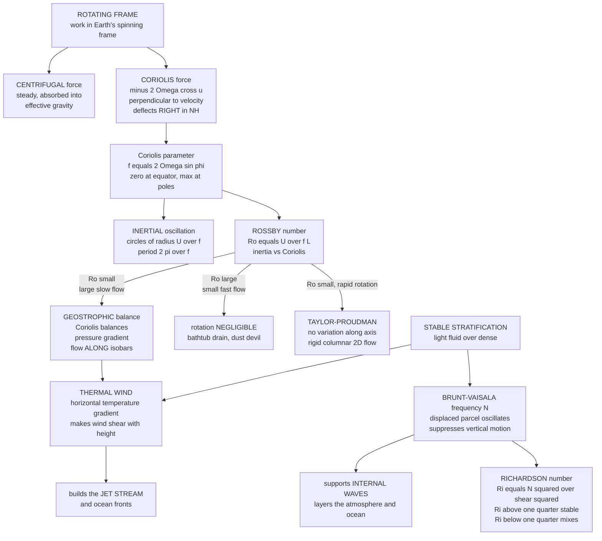

# 🌀 Rotating and Stratified Flows

> [!abstract] TL;DR
> On a **rotating, density-layered planet**, large-scale fluids obey qualitatively different rules than any lab flow. Working in Earth's spinning frame introduces the **Coriolis force** $-2\vec\Omega\times\vec u$ — perpendicular to velocity, deflecting motion **right in the Northern Hemisphere**, with strength set by the **Coriolis parameter** $f = 2\Omega\sin\varphi$. For slow, large flows the **Rossby number** $Ro = U/(fL)$ is tiny, and the Coriolis force **balances the pressure-gradient force**: the resulting **geostrophic** wind or current flows *along the isobars* (perpendicular to the pressure gradient), circling highs and lows instead of rushing down-gradient. Rapid rotation also makes fluids weirdly rigid — the **Taylor-Proudman theorem** forces columnar, two-dimensional motion. Meanwhile **stable stratification** (light fluid over dense) resists vertical motion, so a displaced parcel oscillates at the **Brunt-Väisälä frequency** $N$, and the **Richardson number** $Ri = N^2/(\partial u/\partial z)^2$ decides whether stratification suppresses turbulence ($Ri > 1/4$) or shear tears it apart ($Ri < 1/4$). Combine rotation and stratification and horizontal temperature gradients force the wind to shear with height — the **thermal wind** that builds the jet stream. These are the foundations of geophysical fluid dynamics: weather, ocean circulation, and planetary flows.

---

## Intuition

**Analogy:** Stand at the middle of a **merry-go-round spinning counterclockwise** and throw a ball straight to a friend on the rim. To you, riding the platform, the ball does not go straight — it curves off **to the right** and misses. Nothing pushed it sideways; the floor simply rotated beneath it while it flew. That phantom sideways deflection is the **Coriolis effect**, and the Earth is exactly that merry-go-round, turning under everything that moves.

Now do this not with a ball but with the **whole atmosphere and ocean**. Air squeezed from high pressure toward low never makes it straight to the low: the moment it moves, Coriolis bends it right, and it keeps bending until it coasts **sideways, parallel to the isobars**, circling the pressure system instead of filling it. This is why winds and currents flow at *right angles* to the pressure gradient — utterly unlike water running downhill. Rotation does something stranger still: it makes fluids behave **rigidly**, organizing them into vertical "columns" that move as units. And **density layering** — warm water over cold, fresh over salty, light over heavy — locks the fluid into horizontal sheets that fiercely **resist vertical motion**, so a nudged parcel bobs back like a cork and oscillates. Together, rotation's sideways deflection and stratification's vertical stiffness set the strange, counterintuitive rules of planetary flow.

---

## How It Works

### Core Mechanics

**1. Why rotation and stratification change everything.** A beaker of stirred water does not care that Earth spins, because it swirls and settles in seconds — far faster than the day. But a weather system or an ocean gyre evolves over *days to years*, comparable to the rotation period, and spans hundreds to thousands of kilometres. On those scales the planet's rotation is no longer negligible; it dominates. Add that the atmosphere and ocean are **density-stratified** — arranged in stable layers of decreasing density upward — and vertical motion becomes energetically expensive. The result is a flow world governed by the **Coriolis force** and **buoyancy** rather than by the everyday intuition of pressure driving fluid straight down-gradient. This is the foundation of *geophysical fluid dynamics*, developed further in the sibling note *Geophysical_Fluid_Dynamics*.

**2. The rotating frame and the Coriolis force.** Writing Newton's second law in Earth's rotating frame adds two *apparent* (frame) forces per unit mass:
$$\vec a_{\text{rot}} = \underbrace{-\vec\Omega\times(\vec\Omega\times\vec r)}_{\text{centrifugal}} \;\underbrace{-\,2\vec\Omega\times\vec u}_{\text{Coriolis}}.$$
The **centrifugal** term is steady and points outward from the rotation axis; it is quietly absorbed into an *effective gravity* (it slightly flattens the planet into an oblate spheroid) and thereafter ignored. The **Coriolis** term is the star: it depends on the fluid's velocity, always acts **perpendicular to the motion**, and so can only *turn* a parcel, never speed it up. Its horizontal strength is set by the **Coriolis parameter**
$$f = 2\Omega\sin\varphi,$$
zero at the equator, maximum at the poles. The horizontal deflection is to the **right in the Northern Hemisphere** ($f>0$) and to the **left in the Southern** ($f<0$).

**3. Inertial oscillations.** Give a parcel a push and remove every other force, leaving only Coriolis. The equations $\dot u = f v,\ \dot v = -f u$ describe a velocity vector of constant magnitude that rotates steadily, so the parcel traces a closed **inertial circle** of radius $U/f$, clockwise in the NH. The period is
$$T_{\text{inertial}} = \frac{2\pi}{f} = \frac{2\pi}{2\Omega\sin\varphi} = \tfrac{1}{2}\,\text{(pendulum day)},$$
roughly 17 hours at mid-latitudes. These loops are the pure, rotation-driven "ringing" of the fluid, seen as spirals in ocean-drifter tracks after a storm.

**4. Geostrophic balance — the central balance of large-scale flow.** For slow, large flows the parcel's acceleration is tiny, so the horizontal momentum equation collapses to a standoff between just two forces — the **pressure-gradient force** and the **Coriolis force**:
$$f\,\hat z\times\vec u_g = -\frac{1}{\rho}\nabla p \quad\Longrightarrow\quad \vec u_g = \frac{1}{\rho f}\,\hat z\times\nabla p.$$
The geostrophic velocity is **perpendicular to the pressure gradient**, so the wind or current flows **along the isobars**, not across them. In the NH it circles a **low counterclockwise** and a **high clockwise** (with low pressure on its left). This is why weather maps show wind wrapping *around* pressure systems, and why ocean currents track contours of sea-surface height. It is genuinely counterintuitive: the fluid never flows from high to low pressure — it flows *around*. (The atmospheric version is developed in [[Coriolis_Effect_and_Geostrophic_Balance]].)

**5. The Rossby number — when does rotation matter?** The dimensionless
$$Ro = \frac{U}{fL}$$
compares the inertial (advective) acceleration $U^2/L$ to the Coriolis acceleration $fU$. **Small $Ro$** (large, slow flows — weather systems, ocean gyres) means rotation **dominates** and the flow is nearly geostrophic. **Large $Ro$** (small, fast flows — a dust devil, a draining bathtub) means rotation is **negligible**. This settles a famous myth: a bathtub drain has $Ro \sim 10^{3}$–$10^{4}$, so Earth's rotation is utterly swamped by the basin's own residual swirl — the direction is set by how you filled it, not by your hemisphere.

**6. The Taylor-Proudman theorem — rotation makes fluids rigid.** Take the curl of the geostrophic balance for a rapidly rotating, homogeneous, low-$Ro$ fluid and you find
$$(\vec\Omega\cdot\nabla)\vec u = 0,$$
meaning the velocity **cannot vary along the rotation axis**. The flow becomes **two-dimensional and columnar**: fluid organizes into rigid **Taylor columns** that move as vertical units. Push a slow obstacle through a rapidly rotating tank and an entire column of fluid above and below it moves with it, as if the fluid had turned stiff. This strange rigidity is a hallmark of rotation-dominated flow.

**7. Stable stratification — the vertical stiffness.** When lighter fluid sits over denser (warm over cold, fresh over salty), the layering is **stably stratified** and resists vertical motion. Displace a parcel upward and it finds itself denser than its surroundings, so buoyancy pushes it back down; it overshoots and oscillates at the **Brunt-Väisälä (buoyancy) frequency**
$$N = \sqrt{-\frac{g}{\rho_0}\frac{d\rho}{dz}}.$$
Strong stratification (large $N$) means stiff layers that **suppress vertical mixing** and support **internal gravity waves** that propagate along density surfaces (see [[Internal_Waves_and_Solitons]] and the sibling *Surface_and_Internal_Waves*). This layering is why the atmosphere and ocean are organized into strata — the thermocline, the stratosphere — rather than churning freely. The static-stability foundation lives in [[Fluid_Statics_and_Buoyancy]] and *Convection_and_Thermal_Fluid_Dynamics*.

**8. The Richardson number — stratification versus shear.** Stratification stabilizes; velocity shear destabilizes. Their contest is measured by the **gradient Richardson number**
$$Ri = \frac{N^2}{(\partial u/\partial z)^2} = \frac{\text{buoyancy (stabilizing)}}{\text{shear (destabilizing)}}.$$
When $Ri > 1/4$ stratification wins and turbulence is suppressed; when $Ri < 1/4$ shear overwhelms buoyancy and **Kelvin-Helmholtz instability** erupts, rolling the interface into billows and mixing the layers (this instability is treated in [[Hydrodynamic_Instabilities]]). The Richardson number therefore governs mixing throughout the stratified ocean and atmosphere.

**9. The thermal wind — rotation meets stratification.** Combine geostrophy with stratification and a striking link emerges: a **horizontal temperature (density) gradient forces the geostrophic wind to change with height**. Differentiating geostrophic balance vertically and using hydrostatics gives the **thermal wind relation**
$$\frac{\partial \vec u_g}{\partial z} = \frac{g}{f\,\rho_0}\,\hat z\times\nabla_h \rho \;\;\propto\;\; \hat z\times\nabla_h T.$$
This is why the **jet stream** sits high above the sharp equator-to-pole temperature gradient: the pole-to-equator warming makes the west-to-east wind strengthen all the way up to the tropopause (see [[Jet_Streams_and_Upper_Level_Flow]]). Temperature structure below dictates the winds aloft.

**10. Ekman layers — rotation plus friction.** Near a boundary, friction joins Coriolis. In the wind-driven ocean surface layer the balance between wind stress, friction, and Coriolis produces the **Ekman spiral**: current direction rotates with depth, and the *net* transport of the whole layer is at **90° to the wind** (to the right in the NH). Convergence and divergence of this transport drive vertical **Ekman pumping**, the engine that spins up ocean gyres (developed in [[Ekman_Transport_and_Coastal_Upwelling]] and [[Wind_Driven_Circulation_and_Sverdrup_Balance]]).

### Flow / Architecture



---

## Key Concepts

### Secondary Level

- **The merry-go-round deflection.** On a spinning planet, anything that moves gets nudged sideways — right in the north, left in the south. That nudge is the **Coriolis effect**, and it is why storms spin.
- **Winds go around, not across.** Instead of blowing straight from high pressure to low, large-scale winds and currents circle the pressure systems, flowing *along* the lines of equal pressure. That is **geostrophic** flow.
- **Layers that resist stirring.** Warm water floating on cold, like oil on water, forms stable **layers** that push back against anything trying to mix them up and down. A nudged blob bobs back like a cork.
- **The bathtub myth.** Your drain does *not* swirl a fixed way because of your hemisphere — the basin is far too small and fast for Earth's rotation to matter.

### Undergraduate Level

- **Coriolis parameter.** $f = 2\Omega\sin\varphi$; horizontal Coriolis acceleration $-f\,\hat z\times\vec u$. Zero at the equator, $\sim 10^{-4}\,\text{s}^{-1}$ at mid-latitudes.
- **Geostrophic wind.** $\vec u_g = \dfrac{1}{\rho f}\,\hat z\times\nabla p$: perpendicular to $\nabla p$, so flow follows isobars; counterclockwise around NH lows.
- **Rossby number.** $Ro = U/(fL)$. $Ro \ll 1 \Rightarrow$ geostrophic (weather, gyres); $Ro \gg 1 \Rightarrow$ rotation irrelevant (drains, dust devils); $Ro \sim 1 \Rightarrow$ gradient-wind regime (hurricanes).
- **Brunt-Väisälä frequency.** $N = \sqrt{-\frac{g}{\rho_0}\frac{d\rho}{dz}}$; the frequency of a buoyancy oscillation. Real $N$ means stable; imaginary $N$ means convective overturning.
- **Richardson number.** $Ri = N^2 / (\partial u/\partial z)^2$; the $Ri = 1/4$ threshold (Miles-Howard) separates stable stratified shear from Kelvin-Helmholtz instability.
- **Inertial period.** $T = 2\pi/f$; half a pendulum day; radius of an inertial circle $= U/f$.

### Graduate Level

- **Full rotating momentum equation.** $\dfrac{D\vec u}{Dt} + f\,\hat z\times\vec u = -\dfrac{1}{\rho}\nabla p + \vec g_{\text{eff}} + \nu\nabla^2\vec u$; scale analysis at low $Ro$ yields geostrophy at leading order and the quasi-geostrophic (QG) system at next order.
- **Taylor-Proudman theorem.** From $2\vec\Omega\times\vec u = -\frac{1}{\rho}\nabla p$ with constant $\rho$, take the curl to get $(\vec\Omega\cdot\nabla)\vec u = 0$ — columnar rigidity; Taylor columns and the Proudman-Taylor constraint on rapidly rotating, barotropic flow.
- **Thermal wind.** $f\dfrac{\partial \vec u_g}{\partial z} = \dfrac{g}{\rho_0}\,\hat z\times\nabla_h\rho$ (or $-\frac{g}{\theta_0}\hat z\times\nabla_h\theta$ in the atmosphere); the vertical shear of the geostrophic wind is tied to horizontal buoyancy gradients — baroclinicity.
- **Ekman dynamics.** The Ekman-layer solution gives a spiral $\vec u \propto e^{z/\delta_E}$ with $\delta_E = \sqrt{2\nu/f}$; depth-integrated Ekman transport $\vec M_E = \dfrac{1}{\rho f}\,\hat z\times\vec\tau$ is $90^\circ$ to the wind stress; $\text{curl}$ of the stress drives Ekman pumping $w_E = \frac{1}{\rho f}\,\hat z\cdot(\nabla\times\vec\tau)$.
- **Potential vorticity.** The conserved master variable of geophysical flow: $Q = \dfrac{(\zeta + f)}{h}$ (shallow water) or Ertel's $Q = \frac{1}{\rho}(\vec\omega_a\cdot\nabla\theta)$, tying rotation (planetary vorticity $f$), relative vorticity $\zeta$, and stratification together (bridges to [[Vorticity_and_Circulation]]).
- **Rossby waves and $\beta$.** The latitudinal gradient $\beta = df/dy$ supports westward-propagating **Rossby waves** — the large-scale meanders of the jet stream and the mechanism of western intensification in ocean gyres.

---

## Python Demo

```python
# Rotating and stratified flow, four demonstrations:
#   (a) CORIOLIS -> a free parcel traces INERTIAL CIRCLES, curving RIGHT (NH).
#   (b) GEOSTROPHIC balance -> flow circles a LOW, running ALONG the isobars.
#   (c) ROSSBY NUMBER Ro = U/(f L) across flows: when does rotation dominate?
#   (d) STRATIFICATION -> a displaced parcel oscillates at the Brunt-Vaisala N.
import numpy as np
import matplotlib.pyplot as plt

Omega = 7.292e-5           # Earth's rotation rate [rad/s]
lat   = np.deg2rad(45.0)   # mid-latitude
f     = 2 * Omega * np.sin(lat)     # Coriolis parameter ~ 1.03e-4 /s
print(f"Coriolis parameter f at 45N = {f:.3e} 1/s")
print(f"Inertial period 2*pi/f      = {2*np.pi/f/3600:.1f} hours\n")

# ------------------------------------------------------------------
# (a) INERTIAL CIRCLES: du/dt = f v, dv/dt = -f u  (NH -> curves right)
# ------------------------------------------------------------------
U0 = 10.0                          # initial speed [m/s], pushed toward +x
dt = 60.0                          # 1 minute steps
steps = int(2 * (2*np.pi/f) / dt)  # two inertial periods
u, v = U0, 0.0
x, y = 0.0, 0.0
xs, ys = [x], [y]
for _ in range(steps):             # RK4 on the linear Coriolis system
    def acc(u, v): return (f*v, -f*u)
    k1 = acc(u, v)
    k2 = acc(u + 0.5*dt*k1[0], v + 0.5*dt*k1[1])
    k3 = acc(u + 0.5*dt*k2[0], v + 0.5*dt*k2[1])
    k4 = acc(u + dt*k3[0],     v + dt*k3[1])
    u += dt/6*(k1[0] + 2*k2[0] + 2*k3[0] + k4[0])
    v += dt/6*(k1[1] + 2*k2[1] + 2*k3[1] + k4[1])
    x += u*dt; y += v*dt
    xs.append(x); ys.append(y)
xs, ys = np.array(xs)/1000, np.array(ys)/1000   # km
R_theory = U0/f/1000
print(f"Inertial-circle radius: numeric ~ {(xs.max()-xs.min())/2:.1f} km, "
      f"theory U/f = {R_theory:.1f} km\n")

# ------------------------------------------------------------------
# (b) GEOSTROPHIC FLOW around a LOW:  u_g = (1/(rho f)) z_hat x grad p
# ------------------------------------------------------------------
n = 60
L = 1.0e6                                   # 1000 km domain half-width
gx = np.linspace(-L, L, n); gy = np.linspace(-L, L, n)
GX, GY = np.meshgrid(gx, gy)
rho = 1.2
p0, dp, Lp = 1.0e5, 2.0e3, 5.0e5            # Gaussian LOW-pressure center
P = p0 - dp * np.exp(-((GX**2 + GY**2)/Lp**2))
dPdy, dPdx = np.gradient(P, gy, gx)
Ug = -(1/(rho*f)) * dPdy                    # geostrophic components
Vg =  (1/(rho*f)) * dPdx                    # flow is 90 deg to grad p

# ------------------------------------------------------------------
# (c) ROSSBY NUMBER Ro = U/(f L) for a spread of real flows
# ------------------------------------------------------------------
Omega_J = 1.76e-4                           # Jupiter rotation rate
f_earth = 1.0e-4
f_jup   = 2*Omega_J*np.sin(np.deg2rad(22))
flows = [
    ("Bathtub drain", 0.1,  0.3,   f_earth),
    ("Dust devil",    10.0, 5.0,   f_earth),
    ("Tornado",       50.0, 1.0e2, f_earth),
    ("Hurricane",     50.0, 5.0e5, f_earth),
    ("Midlat cyclone",20.0, 1.0e6, f_earth),
    ("Ocean gyre",    0.1,  2.0e6, f_earth),
    ("Jupiter GRS",   100.0,1.0e7, f_jup),
]
names = [nm for nm, *_ in flows]
Ro = np.array([U/(ff*Lc) for _, U, Lc, ff in flows])
print("Rossby numbers (Ro << 1 => rotation dominates, geostrophic):")
for nm, r in zip(names, Ro):
    verdict = "rotation DOMINATES" if r < 1 else "rotation negligible"
    print(f"  {nm:15s} Ro = {r:10.3g}   {verdict}")

# ------------------------------------------------------------------
# (d) BUOYANCY OSCILLATION: z'' = -N^2 z at Brunt-Vaisala frequency
# ------------------------------------------------------------------
N = 0.01                                    # stable stratification [1/s]
T_bv = 2*np.pi/N
t = np.linspace(0, 3*T_bv, 600)
z = 5.0 * np.cos(N*t)                       # 5 m initial displacement
print(f"\nBrunt-Vaisala period 2*pi/N = {T_bv/60:.1f} min (N = {N} 1/s)")

# ------------------------------------------------------------------
# PLOTS
# ------------------------------------------------------------------
fig, ax = plt.subplots(2, 2, figsize=(14, 11))

ax[0,0].plot(xs, ys, color="#1b6ca8", lw=1.8)
ax[0,0].scatter([xs[0]], [ys[0]], c="k", zorder=5, label="start (moving +x)")
ax[0,0].annotate("", xy=(xs[8], ys[8]), xytext=(xs[0], ys[0]),
                 arrowprops=dict(arrowstyle="->", color="#d1495b", lw=2))
ax[0,0].set_title("(a) CORIOLIS: inertial circle, curving RIGHT (NH)")
ax[0,0].set_xlabel("x [km]"); ax[0,0].set_ylabel("y [km]")
ax[0,0].set_aspect("equal"); ax[0,0].grid(alpha=0.3); ax[0,0].legend()

cs = ax[0,1].contour(GX/1e3, GY/1e3, P/100, 12, colors="0.5", linewidths=0.8)
ax[0,1].streamplot(gx/1e3, gy/1e3, Ug, Vg,
                   color=np.hypot(Ug, Vg), cmap="viridis", density=1.2)
ax[0,1].scatter([0],[0], c="red", marker="x", s=120)
ax[0,1].text(0, 40, "LOW", color="red", ha="center", fontweight="bold")
ax[0,1].set_title("(b) GEOSTROPHIC: flow ALONG isobars, circling the low")
ax[0,1].set_xlabel("x [km]"); ax[0,1].set_ylabel("y [km]")
ax[0,1].set_aspect("equal")

colors = ["#2a9d8f" if r < 1 else "#e76f51" for r in Ro]
ax[1,0].barh(names, Ro, color=colors)
ax[1,0].set_xscale("log")
ax[1,0].axvline(1.0, color="k", ls="--", lw=1.5)
ax[1,0].text(1.3, 0.2, "Ro = 1", rotation=90, va="bottom")
ax[1,0].set_title("(c) ROSSBY number: green = rotation dominates")
ax[1,0].set_xlabel("Ro = U / (f L)  [log scale]")
ax[1,0].grid(alpha=0.3, axis="x")

ax[1,1].plot(t/60, z, color="#6a4c93", lw=1.8)
ax[1,1].axhline(0, color="k", lw=0.8)
ax[1,1].set_title(f"(d) STRATIFICATION: buoyancy oscillation, period {T_bv/60:.0f} min")
ax[1,1].set_xlabel("time [min]"); ax[1,1].set_ylabel("parcel height z [m]")
ax[1,1].grid(alpha=0.3)

plt.tight_layout()
plt.savefig("rotating_and_stratified_flows.png", dpi=110)
print("Saved rotating_and_stratified_flows.png")
```

**What it shows.** Panel **(a)** integrates a frictionless parcel under Coriolis alone: it does not go straight but loops in a closed **inertial circle**, curving consistently to the right (NH), with radius $U/f \approx 100$ km and period $\sim 17$ h — the pure ringing of rotation. Panel **(b)** builds a Gaussian **low-pressure** field and computes the geostrophic wind; the streamlines run **parallel to the grey isobars**, circling the low counterclockwise, never pointing at it — flow at right angles to the pressure gradient. Panel **(c)** ranks flows by **Rossby number** on a log axis: bathtub drains, dust devils, and tornadoes sit far to the right ($Ro \gg 1$, rotation irrelevant — the drain myth debunked), while hurricanes hover near $Ro \sim 1$ and mid-latitude cyclones, ocean gyres, and Jupiter's Great Red Spot fall well below 1 (rotation dominates, geostrophic). Panel **(d)** releases a displaced parcel in a **stably stratified** fluid; it does not run away but **oscillates** at the Brunt-Väisälä frequency $N$, the vertical stiffness that suppresses mixing and carries internal waves.

---

## Real-World Applications

> **Weather forecasting and the general circulation.** Every synoptic weather map is a geostrophic map: winds wrap around highs and lows because the free atmosphere is in near-geostrophic balance. Numerical weather models solve the rotating, stratified equations, tracking potential vorticity and using the thermal-wind link between the pole-to-equator temperature gradient and the [[Jet_Streams_and_Upper_Level_Flow|jet stream]] aloft. The Hadley, Ferrel, and polar cells of the [[Global_Atmospheric_Circulation|global circulation]] are the planet's rotating-fluid response to differential heating.

- **Ocean currents and gyres.** The Gulf Stream and every subtropical gyre are geostrophic currents flowing along sea-surface-height contours, spun up by wind-stress-curl **Ekman pumping** ([[Wind_Driven_Circulation_and_Sverdrup_Balance]]) and intensified on western boundaries ([[Western_Boundary_Currents_and_Gulf_Stream]]) by the $\beta$-effect. Stratification ([[Density_Stratification_and_Mixing]]) sets the thermocline and hosts internal tides.
- **Hurricanes.** At $Ro \sim 1$ these are gradient-wind systems where Coriolis, pressure gradient, and centrifugal force all matter; Earth's rotation is what lets a warm-core low organize into a rotating storm at all (and why hurricanes never form on the equator, where $f = 0$).
- **The jet stream.** A textbook thermal wind: the sharp mid-latitude temperature gradient forces the westerlies to strengthen with height, peaking near the tropopause — steering weather systems and airline routes.
- **Rotating machinery and industrial flows.** Centrifuges, rotating heat exchangers, and turbomachinery show Taylor-column rigidity and Ekman boundary-layer effects; rotating tanks are the classic laboratory analogue of the atmosphere.
- **Astrophysical and planetary flows.** [[Giant_Planets_and_Their_Moons|Jupiter's banded jets and the Great Red Spot]] are low-$Ro$ geostrophic vortices in a rapidly rotating, stratified atmosphere; stellar and planetary interiors are shaped by rotation and stratification; and [[Accretion_Disks_and_X_ray_Binaries|accretion disks]] are rotation-dominated stratified flows where angular-momentum transport governs how matter falls inward.

---

## Common Pitfalls

- **"Fluid flows from high to low pressure."** True for a drinking straw, false for the planet. At low $Ro$ the flow reaches **geostrophic balance** and runs *along* the isobars, circling pressure systems rather than filling them. Expecting down-gradient flow is the single most common error.
- **The bathtub / toilet Coriolis myth.** Basins are far too small and fast ($Ro \sim 10^3$–$10^4$) for Earth's rotation to matter; the swirl direction is set by residual motion and basin shape, not hemisphere. Coriolis reveals itself only over hundreds of kilometres.
- **Confusing the Coriolis force with a real force.** It is an *apparent* force that exists only because we chose a rotating frame; it does no work (always perpendicular to velocity) and vanishes in an inertial frame. It cannot speed a parcel up or down, only turn it.
- **Forgetting $f$ depends on latitude — and sign.** $f = 2\Omega\sin\varphi$ is zero at the equator (no geostrophy, no organized rotation there) and flips sign across it, so deflection is opposite in the two hemispheres and geostrophic circulation reverses.
- **Reading imaginary $N$ as "no oscillation."** If $d\rho/dz > 0$ (dense over light) the stratification is *unstable*, $N$ is imaginary, and the "oscillation" is exponential overturning — convection, not bobbing. Only stable stratification ($N$ real) supports buoyancy oscillations and internal waves.
- **Applying the wrong Richardson threshold.** $Ri < 1/4$ is a *necessary* condition for shear instability, not a guarantee of turbulence; and once turbulence exists, it can persist above $Ri = 1/4$. Do not treat the threshold as an on/off switch.
- **Ignoring stratification when invoking Taylor-Proudman.** Strict columnar rigidity assumes a *homogeneous* rotating fluid. Real geophysical flows are stratified, which relaxes the constraint and permits the vertical shear that the thermal wind demands.

Deeper development lives in the sibling notes *Geophysical_Fluid_Dynamics* (the full weather-ocean-climate framework), *Surface_and_Internal_Waves* (gravity and internal waves in stratified fluids), *Convection_and_Thermal_Fluid_Dynamics* (unstable stratification and buoyancy-driven overturning), plus the existing [[Fluid_Statics_and_Buoyancy]] (hydrostatic and static-stability foundations) and [[Vorticity_and_Circulation]] (potential vorticity, the master variable of rotating flow).

---

## Related Concepts

- [[Vorticity_and_Circulation]] — planetary vorticity $f$ plus relative vorticity gives absolute vorticity; potential vorticity $Q=(\zeta+f)/h$ is the conserved master variable of rotating, stratified flow.
- [[Fluid_Statics_and_Buoyancy]] — hydrostatic balance and static stability are the foundation on which the Brunt-Väisälä frequency and stratification are built.
- [[Coriolis_Effect_and_Geostrophic_Balance]] — the atmospheric-dynamics treatment of the same Coriolis force and geostrophic balance developed here from the fluid-mechanics side.
- [[Jet_Streams_and_Upper_Level_Flow]] — the thermal-wind consequence: horizontal temperature gradients build the upper-level jet.
- [[Density_Stratification_and_Mixing]] — the oceanographic view of stable layering, the thermocline, buoyancy frequency, and diapycnal mixing.
- [[Ekman_Transport_and_Coastal_Upwelling]] — rotation plus friction gives the Ekman spiral and wind-driven transport at $90^\circ$ to the wind.
- [[Wind_Driven_Circulation_and_Sverdrup_Balance]] — how Ekman pumping and the $\beta$-effect spin up geostrophic ocean gyres.
- [[Internal_Waves_and_Solitons]] — the waves that stable stratification supports, propagating along density surfaces.
- [[Hydrodynamic_Instabilities]] — Kelvin-Helmholtz instability at low Richardson number, where stratified shear breaks into billows and mixes.
- [[Rotational_Dynamics]] — the mechanics of rotating frames, centrifugal and Coriolis apparent forces, and angular momentum behind it all.
- [[Giant_Planets_and_Their_Moons]] — Jupiter's banded jets and Great Red Spot as low-Rossby-number geostrophic vortices.
- [[Accretion_Disks_and_X_ray_Binaries]] — rotation-dominated, stratified astrophysical flow where angular-momentum transport governs infall.

---

## Review Questions

1. **Secondary:** A friend insists their bathtub always drains clockwise "because of the Coriolis effect and which hemisphere we're in." Using the idea of *how big and how slow* a flow must be for Earth's rotation to matter, explain why they are almost certainly wrong — and name a flow that genuinely *is* governed by the Coriolis effect.
2. **Undergraduate:** A mid-latitude low-pressure system has isobars spaced so the pressure-gradient force is directed inward toward the center. Sketch the direction of the geostrophic wind in the Northern Hemisphere and explain, using the balance $f\,\hat z\times\vec u_g = -\frac{1}{\rho}\nabla p$, why the air circles the low rather than rushing into it. Then estimate the Rossby number for $U = 20$ m/s, $L = 1000$ km, $f = 10^{-4}$ s$^{-1}$ and state whether the geostrophic approximation is justified.
3. **Graduate:** Derive the thermal-wind relation by combining geostrophic balance with hydrostatic balance, and use it to explain why the jet stream intensifies with height above the strongest equator-to-pole temperature gradient. Separately, explain the roles of the Brunt-Väisälä frequency $N$ and the vertical shear in the Richardson number $Ri = N^2/(\partial u/\partial z)^2$, and describe what happens to a stratified shear layer as $Ri$ falls below $1/4$.

---

## Sources

- Vallis, G. K. — *Atmospheric and Oceanic Fluid Dynamics: Fundamentals and Large-Scale Circulation*, 2nd ed. Cambridge University Press (geostrophy, thermal wind, potential vorticity, QG theory).
- Cushman-Roisin, B. & Beckers, J.-M. — *Introduction to Geophysical Fluid Dynamics: Physical and Numerical Aspects*, 2nd ed. Academic Press (Coriolis, Ekman layers, stratification, Taylor columns).
- Pedlosky, J. — *Geophysical Fluid Dynamics*, 2nd ed. Springer (rotating and stratified equations, Rossby number scaling).
- Gill, A. E. — *Atmosphere-Ocean Dynamics*. Academic Press (buoyancy frequency, internal waves, geostrophic adjustment).
- Kundu, Cohen & Dowling — *Fluid Mechanics*, 6th ed., Ch. 14 (Geophysical Fluid Dynamics). Academic Press.

---

#fluid-dynamics #coriolis #geostrophic-balance #rossby-number #stratification
