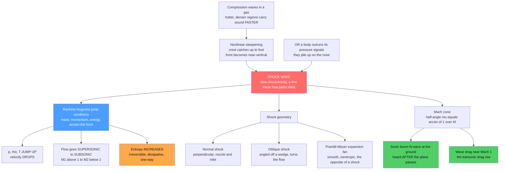

# 💥 Shock Waves and Supersonic Flow

> [!abstract] TL;DR
> A **shock wave** is a near-discontinuous jump in pressure, density, temperature, and velocity, thinner than a hair — a few mean free paths — across which supersonic flow is violently and **irreversibly** decelerated to subsonic. Shocks form when compression waves **nonlinearly steepen** and pile onto one another, or when a body outruns its own pressure signals. The **Rankine-Hugoniot conditions** — mass, momentum, and energy conservation across the front — fix the downstream state from the upstream Mach number $M_1$, and always increase entropy. The same physics produces the **Mach cone** and the **sonic boom**, the transonic **wave drag** that once defined the "sound barrier," the **bow shocks** of re-entry vehicles and supernova blast waves, and the numerical headache that demands special **shock-capturing** schemes.

---

## Intuition

**Analogy:** When a jet outruns its own sound, the pressure waves it continuously emits can no longer escape ahead of it. They pile up into a single, razor-thin wall of near-discontinuous pressure, temperature, and density — a **shock wave**. Across a distance thinner than a hair, the air's properties **jump** violently. You *hear* the pile-up as a **sonic boom**, you *see* it as the cone trailing a bullet, and you *feel* its destructive power in a blast wave. Shocks are precisely where the smooth mathematics of flow breaks down into abrupt, irreversible jumps.

Picture the wake of a fast boat. At walking pace the boat sits inside its own ring of ripples; speed it past the ripples' own speed and the crests can no longer run out in front — they collapse into a sharp, V-shaped **bow wave**. A supersonic aircraft does the identical thing in three dimensions with sound instead of water waves: the wall of piled-up pressure is the shock, and its trailing cone is what eventually slaps the ground as a boom.

---

## How It Works

### Core Mechanics

**1. Why shocks form — nonlinear steepening.** In a compressible gas the local sound speed is $c=\sqrt{\gamma R T}$, so **hotter, higher-pressure regions carry sound *faster*.** When a smooth compression pulse travels through the gas, its high-pressure crest moves faster than its low-pressure foot and **catches up** to it, steepening the wave front. Left unchecked the front would become multivalued — physically impossible — so nature resolves it into a genuine **near-discontinuity**: a shock. This is exactly the shock formation of the inviscid **Burgers' equation** $u_t + u\,u_x = 0$, whose characteristics cross at a finite time $t_{\text{shock}} = 1/\max(-u_0')$. Equivalently, a supersonic object outruns the pressure signals it sends ahead, and they pile onto a stationary standing shock. The nonlinearity of the **Euler equations** is what lets smooth data collapse into discontinuous *weak* solutions — the point picked up in the sibling *Euler_Equations_and_Inviscid_Flow* and, at the wave-propagation level, in *The_Wave_Equation*.

**2. The Rankine-Hugoniot jump conditions.** A shock is far too thin to resolve, so we treat it as a surface and apply **control-volume conservation** across it. In the shock's rest frame, with subscript 1 upstream and 2 downstream:
$$\rho_1 u_1 = \rho_2 u_2 \quad\text{(mass)}$$
$$p_1 + \rho_1 u_1^2 = p_2 + \rho_2 u_2^2 \quad\text{(momentum)}$$
$$h_1 + \tfrac12 u_1^2 = h_2 + \tfrac12 u_2^2 \quad\text{(energy)}$$
For a calorically perfect gas ($h=c_pT$, ratio of specific heats $\gamma$), these close into pure **algebra** in the upstream Mach number $M_1 = u_1/c_1$. For a **normal shock**:
$$\frac{p_2}{p_1} = 1 + \frac{2\gamma}{\gamma+1}\left(M_1^2 - 1\right), \qquad \frac{\rho_2}{\rho_1} = \frac{(\gamma+1)M_1^2}{(\gamma-1)M_1^2 + 2}$$
$$\frac{T_2}{T_1} = \frac{p_2}{p_1}\cdot\frac{\rho_1}{\rho_2}, \qquad M_2^2 = \frac{(\gamma-1)M_1^2 + 2}{2\gamma M_1^2 - (\gamma-1)}$$

**3. What a normal shock does.** Across it, **pressure, density, and temperature all jump upward** — dramatically for strong shocks — while **velocity drops**. Crucially, the flow goes from **supersonic ($M_1>1$) to subsonic ($M_2<1$)**. And because a shock converts ordered mechanical energy into disordered heat, **entropy increases**: the shock is **irreversible**, unlike smooth isentropic flow. The Second Law is what selects physical *compression* shocks and forbids the time-reversed "expansion shock" (see *[[Entropy_and_Second_Law]]*). The internal structure that does the dissipating is set by viscosity and heat conduction over a thickness of a few **mean free paths**, which is why continuum theory only gives the endpoints, not the interior (*[[Kinetic_Theory_of_Gases]]*).

**4. Normal vs oblique shocks and expansion fans.** A **normal shock** stands perpendicular to the flow, as in a nozzle or engine inlet. An **oblique shock** is angled — thrown off a wedge, cone, or compression corner — is weaker, and *turns* the flow while still compressing it; these are the shocks you actually **see** as sharp lines off supersonic bullets and aircraft. Their opposite is the **Prandtl-Meyer expansion fan**: a smooth, **isentropic** acceleration that fans out around an expansion corner, dropping pressure gradually with no entropy jump. Combining oblique shocks on compression surfaces with expansion fans on expansion surfaces gives **shock-expansion theory** for supersonic airfoils.

**5. The Mach cone and sonic boom.** A supersonic body's disturbances envelope into a **Mach cone** with half-angle
$$\mu = \arcsin\!\left(\frac{1}{M}\right),$$
narrower the faster you go. The pressure discontinuities that reach the ground arrive as the classic **N-wave** — a sharp over-pressure, a linear drop below ambient, then a sharp recovery — heard as the double-crack **sonic boom**. Because the cone trails behind the aircraft, you hear the boom *after* the plane has already passed overhead. Suppressing the boom for overland supersonic flight is an active design frontier of low-boom airframe shaping.

**6. Wave drag — the "sound barrier."** Shocks dissipate energy, and that dissipation shows up as **wave drag**: a steep **drag rise** that begins near $M\approx1$ (the transonic regime), the real physics behind the old "sound barrier." Slender, swept, and **area-ruled** shapes minimise shock strength and hence wave drag — the reason supersonic vehicles look nothing like subsonic ones. This connects directly to the wave-drag term in *[[Lift_Drag_and_Aerodynamics]]* and the design practice of *Aerodynamics_and_Aerospace_Applications*.

### Flow / Architecture



---

## Key Concepts

### Secondary Level

- **A shock is a wall of piled-up sound.** Go faster than sound and the pressure waves cannot get out of the way; they stack into a paper-thin sheet where pressure and temperature suddenly leap.
- **Sonic boom.** That sheet dragging across the sky is what you hear as a sharp double crack when a jet flies over — and you hear it *after* it has passed, not when it is overhead.
- **The cone.** A supersonic bullet or plane trails a cone of shock; the faster it goes, the **narrower** the cone.
- **One-way street.** A shock heats the air and can never spontaneously "un-happen" — it wastes energy, which is why breaking the sound barrier costs a big jump in drag.

### Undergraduate Level

- **Mach number** $M = u/c$ with $c=\sqrt{\gamma R T}$; shocks exist only when the upstream flow is supersonic, $M_1>1$.
- **Normal-shock relations** (perfect gas): $p_2/p_1 = 1 + \tfrac{2\gamma}{\gamma+1}(M_1^2-1)$, $\rho_2/\rho_1 = \tfrac{(\gamma+1)M_1^2}{(\gamma-1)M_1^2+2}$, and $M_2^2 = \tfrac{(\gamma-1)M_1^2+2}{2\gamma M_1^2-(\gamma-1)}$, always giving $M_2<1$.
- **Strong-shock limit** ($M_1\to\infty$): the density ratio *saturates* at $\rho_2/\rho_1\to(\gamma+1)/(\gamma-1)=6$ for $\gamma=1.4$, while pressure and temperature ratios grow without bound.
- **Mach angle** $\mu=\arcsin(1/M)$: at $M=1$, $\mu=90^\circ$ (a normal front); at $M=2$, $\mu=30^\circ$; the cone tightens with speed.
- **Oblique shock** relations follow from the normal-shock algebra applied to the flow component *normal* to the shock, linked to the deflection angle by the $\theta$–$\beta$–$M$ relation (weak vs strong solution branches).
- **Entropy jump** $\Delta s/R = \tfrac{\gamma}{\gamma-1}\ln(T_2/T_1) - \ln(p_2/p_1) > 0$ for any compression shock — the quantitative statement of irreversibility.

### Graduate Level

- **Weak solutions and the entropy condition.** The compressible **Euler equations** are a hyperbolic system of conservation laws; discontinuous *weak* solutions are non-unique, and an **entropy (Lax) condition** — characteristics must *converge* into the shock, $M_1>1>M_2$ — selects the physical one. Rarefaction shocks violate it and are ruled out.
- **The Hugoniot vs the isentrope.** In the $p$–$v$ plane the **Rankine-Hugoniot curve** through the upstream state lies *above* the isentrope; the vertical gap is the entropy production, and the **Rayleigh line** connecting the two states has slope $-\rho_1^2u_1^2$, tying the shock speed to the jump.
- **Shock structure.** The RH relations are a control-volume result and say nothing about the interior. Resolving the profile requires the **viscous, heat-conducting Navier-Stokes** equations (Becker's solution) or, at hypersonic/rarefied conditions, kinetic theory, giving a thickness of order the mean free path.
- **Detonations vs deflagrations.** Adding chemical heat release turns the Hugoniot into a family of curves; the **Chapman-Jouguet** condition picks the detonation speed — a reactive shock. Blast waves obey the self-similar **Sedov-Taylor** solution $R(t)\propto (E t^2/\rho)^{1/5}$.
- **Numerics.** Capturing shocks needs **conservative finite-volume** methods (Godunov, approximate Riemann solvers, flux limiters, WENO); non-conservative or naive centered schemes give the *wrong shock speed* or spurious oscillations — the crux of *Computational_Fluid_Dynamics* and *[[The_Wave_Equation_and_Hyperbolic_PDEs]]*.

---

## Python Demo

```python
# Shock physics for a calorically perfect gas (air, gamma = 1.4):
#   (a) NORMAL-SHOCK relations -- how pressure, density, temperature, the
#       downstream Mach number, and the entropy jump vary with upstream M1,
#       showing p/T rise steeply while the flow drops to SUBSONIC (M2 < 1).
#   (b) The MACH CONE / sonic boom -- Mach angle mu = arcsin(1/M) vs M, and a
#       sketch of the conical wavefront geometry (faster => narrower cone).
# Requires: numpy, matplotlib
import numpy as np
import matplotlib.pyplot as plt

gamma = 1.4

# ------------------------------------------------------------------
# (a) Normal-shock jump relations as functions of upstream Mach M1
# ------------------------------------------------------------------
M1 = np.linspace(1.0, 5.0, 400)                       # supersonic upstream
p_ratio   = 1.0 + (2*gamma/(gamma+1)) * (M1**2 - 1.0)          # p2/p1
rho_ratio = ((gamma+1)*M1**2) / ((gamma-1)*M1**2 + 2.0)        # rho2/rho1
T_ratio   = p_ratio / rho_ratio                                # T2/T1
M2        = np.sqrt(((gamma-1)*M1**2 + 2.0) /
                    (2*gamma*M1**2 - (gamma-1)))               # downstream Mach

# Entropy jump in units of R:  ds/R = (g/(g-1)) ln(T2/T1) - ln(p2/p1)
ds_R = (gamma/(gamma-1)) * np.log(T_ratio) - np.log(p_ratio)

# Strong-shock density limit (rho2/rho1 -> (g+1)/(g-1))
rho_limit = (gamma+1)/(gamma-1)

# Console check at M1 = 2 (textbook values)
i2 = np.argmin(np.abs(M1 - 2.0))
print("=== Normal shock at M1 = 2.0 (gamma = 1.4) ===")
print(f"p2/p1   = {p_ratio[i2]:.3f}   (exact 4.500)")
print(f"rho2/rho1 = {rho_ratio[i2]:.3f} (exact 2.667)")
print(f"T2/T1   = {T_ratio[i2]:.3f}   (exact 1.687)")
print(f"M2      = {M2[i2]:.3f}   (exact 0.577, SUBSONIC)")
print(f"ds/R    = {ds_R[i2]:.4f}   (> 0, irreversible)")
print(f"strong-shock density limit rho2/rho1 -> {rho_limit:.2f}")

# ------------------------------------------------------------------
# (b) Mach angle vs Mach number, and Mach-cone geometry
# ------------------------------------------------------------------
Mc = np.linspace(1.0, 5.0, 400)
mu = np.degrees(np.arcsin(1.0 / Mc))                  # Mach angle in degrees

# ------------------------------------------------------------------
# Plotting: 2 x 2 grid
# ------------------------------------------------------------------
fig, ax = plt.subplots(2, 2, figsize=(14, 10))
fig.suptitle("Shock Waves and Supersonic Flow", fontsize=15, fontweight="bold")

# A. property jumps across the shock
axA = ax[0, 0]
axA.plot(M1, p_ratio,   color="#d62728", lw=2.5, label="p2/p1  (pressure)")
axA.plot(M1, T_ratio,   color="#ff7f0e", lw=2.5, label="T2/T1  (temperature)")
axA.plot(M1, rho_ratio, color="#1f77b4", lw=2.5, label="rho2/rho1 (density)")
axA.axhline(rho_limit, ls=":", color="#1f77b4", lw=1.2)
axA.text(4.05, rho_limit + 0.15, "density limit (g+1)/(g-1) = 6",
         color="#1f77b4", fontsize=8)
axA.set_xlabel("upstream Mach number  M1")
axA.set_ylabel("downstream / upstream ratio")
axA.set_title("A. Property JUMPS grow with M1\n(p, T unbounded; density saturates)")
axA.legend(fontsize=9); axA.grid(alpha=0.3)

# B. downstream Mach number -> always subsonic
axB = ax[0, 1]
axB.plot(M1, M2, color="#2ca02c", lw=2.5)
axB.axhline(1.0, ls="--", color="k", lw=1.0)
axB.fill_between(M1, M2, 0, color="#d7f5d7", alpha=0.6)
axB.text(3.0, 0.35, "M2 < 1  ALWAYS\nflow is now SUBSONIC",
         color="#2ca02c", fontsize=10, ha="center")
axB.set_xlabel("upstream Mach number  M1")
axB.set_ylabel("downstream Mach number  M2")
axB.set_title("B. A shock decelerates flow to SUBSONIC")
axB.set_ylim(0, 1.1); axB.grid(alpha=0.3)

# C. entropy jump -> irreversibility
axC = ax[1, 0]
axC.plot(M1, ds_R, color="#9467bd", lw=2.5)
axC.axhline(0.0, color="k", lw=0.8)
axC.fill_between(M1, ds_R, 0, color="#ece1f5", alpha=0.8)
axC.set_xlabel("upstream Mach number  M1")
axC.set_ylabel("entropy jump  ds / R")
axC.set_title("C. Entropy ALWAYS increases (ds > 0)\nshocks are irreversible")
axC.grid(alpha=0.3)

# D. Mach angle and Mach-cone sketch
axD = ax[1, 1]
axD.plot(Mc, mu, color="#e377c2", lw=2.5)
for Mval in (1.5, 2.0, 3.0):
    ang = np.degrees(np.arcsin(1.0 / Mval))
    axD.scatter([Mval], [ang], color="k", zorder=5)
    axD.annotate(f"M={Mval:g}: mu={ang:.0f} deg",
                 xy=(Mval, ang), xytext=(Mval + 0.15, ang + 6),
                 fontsize=8, arrowprops=dict(arrowstyle="->"))
axD.set_xlabel("Mach number  M")
axD.set_ylabel("Mach angle  mu [deg]")
axD.set_title("D. Mach cone: mu = arcsin(1/M)\nfaster flight => NARROWER cone")
axD.grid(alpha=0.3)

# inset: two Mach cones emanating from a moving body
axins = axD.inset_axes([0.42, 0.42, 0.55, 0.52])
apex = 0.0
for Mval, col in ((1.5, "#1f77b4"), (3.0, "#d62728")):
    ang = np.arcsin(1.0 / Mval)
    L = 1.0
    dx = L * np.cos(ang)
    dy = L * np.sin(ang)
    axins.plot([apex, apex + dx], [0,  dy], color=col, lw=2,
               label=f"M={Mval:g}")
    axins.plot([apex, apex + dx], [0, -dy], color=col, lw=2)
axins.scatter([apex], [0], color="k", zorder=5)
axins.set_xlim(-0.1, 1.1); axins.set_ylim(-0.8, 0.8)
axins.set_aspect("equal"); axins.set_xticks([]); axins.set_yticks([])
axins.set_title("cone geometry", fontsize=8)
axins.legend(fontsize=7, loc="lower right")

plt.tight_layout(rect=[0, 0, 1, 0.95])
plt.show()
```

**What it shows.** Panel **A** plots the Rankine-Hugoniot jumps: pressure and temperature ratios climb steeply and without bound as $M_1$ rises, while the **density ratio saturates** at $(\gamma+1)/(\gamma-1)=6$ — a strong shock can barely compress the gas beyond sixfold no matter how fast the flow. Panel **B** confirms the defining feature of a shock: the downstream Mach number is **always below 1**, so a shock is a supersonic-to-subsonic decelerator. Panel **C** shows the entropy jump is **strictly positive** and growing — the quantitative fingerprint of irreversibility that the Second Law demands. Panel **D** gives the **Mach angle** $\mu=\arcsin(1/M)$ and, in the inset, sketches how the cone **tightens** as Mach number rises — why a faster bullet trails a sharper, more swept-back shock.

---

## Real-World Applications

> **Example — the bow shock of a re-entry capsule.** A returning spacecraft hits the atmosphere at hypersonic speed ($M\sim25$). A **detached bow shock** stands off its blunt heat shield, and across it the Rankine-Hugoniot temperature jump heats the air to thousands of kelvin — the plasma sheath that both protects the vehicle (a blunt body deliberately dumps most heat into the shocked air, not the skin) and causes the radio blackout. Blunt-body shaping to *maximise* shock stand-off distance, invented by Harvey Allen, is a direct engineering use of the shock relations.

- **Supersonic and hypersonic propulsion.** Engine inlets use carefully positioned **oblique-shock trains** to decelerate and compress air to subsonic speed *before* the combustor; a mispositioned normal shock ("inlet unstart") can kill the engine. Nozzles run shock trains when over-expanded.
- **Sonic boom and overland supersonic flight.** The N-wave from the Mach cone is why Concorde was barred from supersonic overland flight; NASA's X-59 reshapes the airframe to soften the shock coalescence into a quiet "thump" instead of a boom.
- **Astrophysical shocks.** Supernova **blast waves** sweep the interstellar medium into expanding shock shells that heat gas to $\sim10^6$ K and accelerate cosmic rays (*[[Supernovae_and_Gamma_Ray_Bursts]]*, *[[The_Interstellar_Medium]]*); the **solar wind** forms a bow shock at Earth's magnetosphere, and accretion and jet shocks light up across the high-energy sky, often coupled to magnetic fields (*[[Magnetohydrodynamics]]*).
- **Explosions and detonations.** Blast waves from chemical or nuclear explosions are strong shocks obeying the Sedov-Taylor scaling; detonation waves are reactive shocks central to safety engineering and propulsion.
- **Medicine and the lab.** Extracorporeal **shock-wave lithotripsy** focuses shocks to shatter kidney stones; **shock tubes** generate controlled shocks to study high-temperature gas chemistry and material response.

---

## Common Pitfalls

- **Confusing a shock with a sound wave.** A sound wave is a continuous, small-amplitude, *isentropic* perturbation that travels *at* the sound speed. A shock is a finite-amplitude discontinuity that travels *faster* than sound relative to the gas ahead and *raises* entropy. Linear acoustics cannot describe it.
- **Expecting an "expansion shock."** Only *compression* shocks exist. A discontinuous expansion would *decrease* entropy and is forbidden by the Second Law; expansions must be smooth Prandtl-Meyer fans. Always check $M_1>1>M_2$.
- **Thinking Rankine-Hugoniot gives the shock's internal profile.** It does not — it is a control-volume relation between the two *end* states. The interior thickness and structure require viscosity/heat conduction or kinetic theory.
- **Using the *static* pressure ratio for a moving shock without frame care.** The clean algebra assumes the shock is at rest. For a propagating shock (blast wave, shock tube) you must transform into the shock frame before applying the relations.
- **Naive CFD across shocks.** Central-difference schemes on the conservation laws produce spurious oscillations or the *wrong shock speed*; only **conservative, shock-capturing** finite-volume methods (Godunov/flux-limited/WENO) converge to the physical discontinuity.
- **Forgetting compressibility below Mach 1.** Wave drag and local shocks appear at *transonic* free-stream Mach numbers (around 0.8) because flow accelerates to supersonic pockets over a wing long before the whole aircraft is supersonic — the drag-divergence trap.

---

## Related Concepts

- [[Euler_Equations_and_Inviscid_Flow]] — the nonlinear, hyperbolic compressible Euler system whose smooth solutions steepen into the discontinuous weak solutions this note is about.
- [[Waves_in_Fluids_and_Acoustics]] — sound waves, the Mach number, and the linear-acoustics baseline that a shock violates; also derives Burgers-equation shock formation.
- [[Entropy_and_Second_Law]] — the irreversibility and entropy-increase condition that selects physical compression shocks and forbids expansion shocks.
- [[Kinetic_Theory_of_Gases]] — mean free path and molecular collisions that set the finite thickness and internal structure of a real shock.
- [[The_Wave_Equation_and_Hyperbolic_PDEs]] — characteristics, hyperbolic conservation laws, and the shock-capturing numerics shocks demand.
- [[Finite_Difference_Methods]] — the discretization machinery whose conservative/upwind variants are needed to compute shocks without oscillation.
- [[Lift_Drag_and_Aerodynamics]] — where wave drag joins skin-friction, form, and induced drag near the sound barrier.
- [[Supernovae_and_Gamma_Ray_Bursts]] — the bounce shock and expanding blast waves that are astrophysical shocks on a colossal scale.
- [[The_Interstellar_Medium]] — supernova-driven shocks heating and structuring the galactic gas.
- [[Magnetohydrodynamics]] — magnetized (MHD) shocks: bow shocks, the solar wind, and astrophysical shock acceleration.

Deeper development lives in the not-yet-written Fluid_Dynamics siblings *Compressible_Flow_and_Gas_Dynamics* (isentropic relations, nozzles, and the Mach-number framework that shocks sit inside), *The_Wave_Equation* (characteristics and the wave-propagation roots of steepening), *Aerodynamics_and_Aerospace_Applications* (supersonic wing design, area ruling, and wave-drag reduction), and *Computational_Fluid_Dynamics* (Riemann solvers and shock-capturing schemes).

---

## Review Questions

1. **Secondary:** A supersonic jet flies directly over your head, yet you hear the sonic boom only several seconds *later*. Using the idea of a trailing Mach cone, explain why — and explain why a faster jet trails a narrower cone.
2. **Undergraduate:** Air at $M_1 = 3$ ($\gamma = 1.4$) passes through a normal shock. (a) Compute the pressure, density, and temperature ratios and the downstream Mach number $M_2$. (b) Verify $M_2 < 1$ and that the entropy jump is positive. (c) As $M_1 \to \infty$, which ratios grow without bound and which one saturates, and to what value?
3. **Graduate:** The Euler equations admit non-unique weak solutions, so both a compression shock and a (hypothetical) expansion shock formally satisfy Rankine-Hugoniot. State the entropy/Lax condition that selects the physical solution, explain it in terms of converging vs diverging characteristics and $M_1$ vs $M_2$, and describe why a naive conservative-but-non-upwind numerical scheme can still converge to an unphysical answer.

---

## Sources

- J. D. Anderson — *Modern Compressible Flow: With Historical Perspective*, 3rd ed. (McGraw-Hill, 2003), Chs. 3–4, 7–9 (normal/oblique shocks, expansion fans, Rankine-Hugoniot).
- H. W. Liepmann & A. Roshko — *Elements of Gasdynamics* (Dover, 2001), Chs. 2–4 (shock relations, Mach cone, wave drag).
- L. D. Landau & E. M. Lifshitz — *Fluid Mechanics*, Vol. 6, 2nd ed. (Pergamon, 1987), Ch. IX (shock waves, Hugoniot adiabat, discontinuities).
- R. J. LeVeque — *Finite Volume Methods for Hyperbolic Problems* (Cambridge University Press, 2002) — weak solutions, entropy conditions, and shock-capturing.
- Ya. B. Zel'dovich & Yu. P. Raizer — *Physics of Shock Waves and High-Temperature Hydrodynamic Phenomena* (Dover, 2002) — blast waves, detonations, and astrophysical shocks.

---

#fluid-dynamics #shock-waves #supersonic #rankine-hugoniot #sonic-boom
