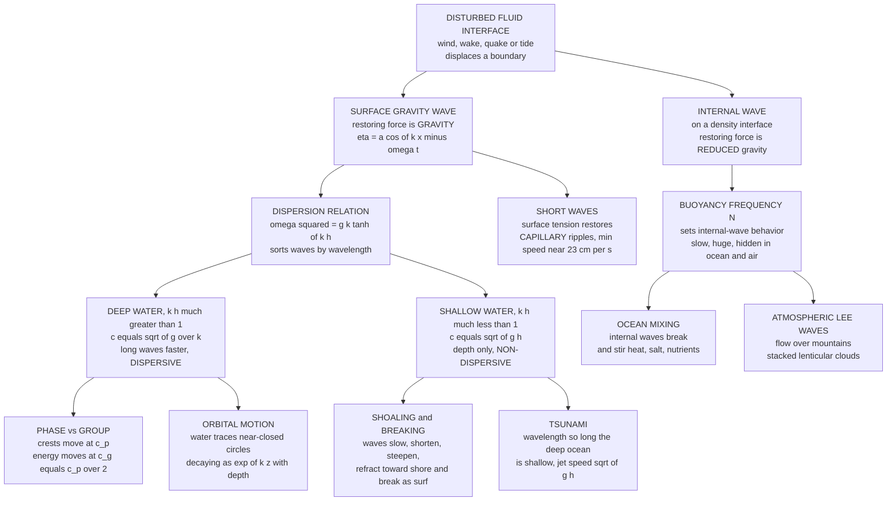

# 🌊 Surface and Internal Waves

> [!abstract] TL;DR
> **Surface and internal waves** are oscillations that ride the *interface* of a fluid — the free surface of water (**surface gravity waves**) or a hidden density layer inside a stratified fluid (**internal gravity waves**) — and they are a branch of fluid dynamics entirely distinct from sound/compression waves. Their defining physics is the **dispersion relation** $\omega^2 = gk\tanh(kh)$, which *sorts waves by wavelength*: in **deep water** ($kh\gg1$) the phase speed is $c=\sqrt{g/k}$ so long waves outrun short ones (**dispersive** — why distant-storm swell arrives before local chop), while in **shallow water** ($kh\ll1$) the speed collapses to $c=\sqrt{gh}$, depending only on depth (**non-dispersive** — the physics of tsunamis and shoaling). The wave carries **energy, not water**: parcels trace near-closed **orbits** (circles in deep water, ellipses in shallow) while the pattern travels. A subtle, load-bearing distinction is **phase vs group velocity** — for deep-water waves the energy-carrying group velocity is exactly *half* the crest speed. At short wavelengths, **surface tension** takes over as the restoring force (**capillary ripples**), giving a minimum wave speed of ~23 cm/s. As swell shoals it slows, steepens, refracts, and **breaks** into surf. And on the ocean's and atmosphere's density layers, **internal waves** (restored by *reduced* gravity, set by the buoyancy frequency $N$) run slow, huge, and invisible — driving deep-ocean mixing and stacking lenticular clouds over mountains.

---

## Intuition

**Analogy:** Watch ocean waves roll in and you will notice something strange. A floating gull bobs up and down and traces tiny circles, but it *goes nowhere* — the wave marches to the beach while the water essentially stays put. The **wave** travels; the **water** does not. Now watch a whole day of surf and you will notice a second oddity: waves sort themselves by size. The long, smooth, evenly spaced swell arrives first, and the short, messy wind-chop straggles in behind it. That is why a glassy long-period groundswell from a storm a thousand miles away can reach the beach *days before* the storm's own wind-chop. This sorting-by-wavelength is called **dispersion**, and it is the hidden signature of water waves.

Here is the beautiful part: the very same drama plays out *inside* the ocean, on invisible layers between waters of different density. Push on a boundary between light warm water and heavy cold water and it will slosh and undulate exactly like the surface does — only slower, larger, and completely hidden from a boat overhead. These **internal waves** obey the same wave-on-an-interface logic, restored not by full gravity but by the weak *buoyancy* difference across the layer. Surface and internal waves are two faces of one phenomenon: a disturbance that propagates *energy* along a fluid interface while the fluid itself only orbits in place.

---

## How It Works

### Core Mechanics

**1. A wave on an interface, not a wave of compressed matter.** Unlike sound (a compression wave *through* the bulk of a fluid), surface and internal waves live on a *boundary* where two states of the fluid meet — air over water, or dense water under light water. Displace the interface and a **restoring force** pulls it back toward flat, the parcel overshoots, and the disturbance propagates sideways as a wave. For the free surface the restoring force is **gravity** (displaced water is pulled back to level); for an internal layer it is **reduced gravity** (buoyancy), which is far weaker.

**2. The water orbits; the wave travels.** Assuming irrotational, incompressible flow, linear (small-amplitude) wave theory predicts that each water parcel moves in a **near-closed orbit** as the wave passes: a **circle** in deep water, shrinking exponentially with depth as $e^{kz}$, and a flattened **ellipse** in shallow water where the seabed squashes the vertical motion. Over one full period the parcel returns almost exactly to where it started. The wave transports **energy** (and a little momentum) across the ocean, but almost no mass — the small residual net drift is the second-order **Stokes drift**.

**3. The dispersion relation is the whole story.** Combining Laplace's equation for the velocity potential with the linearized free-surface conditions (dynamic: the linearized Bernoulli/pressure condition; kinematic: the surface follows the fluid) and the flat-bottom condition yields the master result:

$$\boxed{\omega^2 = g\,k\,\tanh(kh)}$$

relating angular frequency $\omega$ to wavenumber $k = 2\pi/\lambda$ and depth $h$. Everything about water waves flows from its two limits:

| Regime | Condition | Speed | Character |
|--------|-----------|-------|-----------|
| **Deep water** | $kh\gg1$ (i.e. $h>\lambda/2$) | $c_p=\sqrt{g/k}=\sqrt{g\lambda/2\pi}$ | **Dispersive** — longer waves faster |
| **Shallow water** | $kh\ll1$ (i.e. $h<\lambda/20$) | $c=\sqrt{gh}$ | **Non-dispersive** — all $\lambda$ equal |
| **Intermediate** | otherwise | full $\tanh$ | transition |

In **deep water** long waves genuinely travel faster ($c_p\propto\sqrt{\lambda}$) — this is exactly why sorted swell outruns chop. In **shallow water** the wave "feels the bottom": speed depends *only on depth*, so every wavelength travels together — the physics of tsunamis and of waves shoaling onto a beach.

**4. Phase vs group velocity — a subtle, crucial split.** The **phase velocity** $c_p=\omega/k$ is the speed of an individual crest. The **group velocity** $c_g=\mathrm{d}\omega/\mathrm{d}k$ is the speed of a wave *packet* — and it is the speed at which **energy** actually travels. For deep-water gravity waves,

$$c_g=\frac{1}{2}c_p.$$

The consequence is uncanny to watch: within a moving group of swells, individual crests appear at the *back* of the group, race forward through it at twice the group's speed, and vanish at the *front*. Energy — and therefore wave-arrival times and wave-power flux — travels at $c_g$, not $c_p$. Getting this factor of two wrong doubles a swell forecast's error. (Ship wakes, whose famous 19.47° Kelvin angle is a group-velocity effect, are governed by the same distinction.)

**5. Capillary waves and the minimum speed.** For very *short* wavelengths (millimetres to ~1.7 cm), **surface tension** $\sigma$, not gravity, is the dominant restoring force — these are **capillary waves** (ripples). The combined **gravity–capillary** dispersion is

$$c_p^2=\frac{g}{k}+\frac{\sigma k}{\rho},$$

a sum of a gravity term (falling with $k$) and a capillary term (rising with $k$). Their competition produces a **minimum phase speed** of about **23 cm/s** for clean water, at a wavelength of ~1.7 cm. Below this speed *no* surface wave can exist — which is why a slow-moving insect or a gentle raindrop must reach that threshold before it can radiate ripples, and why the tiniest wind ruffles ("cat's paws") appear at a characteristic scale.

**6. Shoaling, refraction, and breaking.** As a swell enters shallowing water near a coast, its **period is conserved** but its speed drops toward $\sqrt{gh}$. So the wave *shortens*, and by energy-flux conservation ($E c_g=\text{const}$) it *steepens* and grows in height (**shoaling**). Because the shallower end of a wave crest slows first, crests **refract** — bending to align with the depth contours, focusing energy onto headlands and spreading it in bays. When the crest outruns the trough and the steepness exceeds the limit ($H/\lambda\gtrsim1/7$ offshore, or height/depth $\approx0.78$ inshore), the wave **breaks** — the transformation of ordered swell into chaotic surf.

**7. Tsunamis — the extreme shallow-water wave.** A tsunami has such an enormous **wavelength** (hundreds of km) that *even the deep ocean is "shallow"* to it ($h\ll\lambda$). It therefore travels at $c=\sqrt{gh}\approx\sqrt{9.8\times4000}\approx200$ m/s — roughly **700 km/h**, jetliner speed — yet with an amplitude of only ~1 m spread over a 200 km wavelength, it is *imperceptible* to a ship at sea. As it reaches the coast and $h$ collapses, $c$ plummets, the energy piles up, and the wave **shoals** to catastrophic height. Its long-wavelength, non-dispersive nature is exactly what makes it fast, undetectable offshore, and devastating onshore.

**8. Internal (buoyancy) waves — the hidden wave world.** Where the fluid is **stratified** (density increasing with depth), waves also propagate *within* the fluid on density surfaces. Displace a parcel upward and it is heavier than its new surroundings and sinks back; displaced down, it is lighter and rises. It oscillates at the **buoyancy (Brunt–Väisälä) frequency**

$$N^2=-\frac{g}{\rho_0}\frac{\mathrm{d}\rho}{\mathrm{d}z},$$

which sets the internal-wave clock. For a sharp two-layer interface the wave behaves like a surface wave with gravity replaced by **reduced gravity** $g'=g\,\Delta\rho/\rho$, so it runs ~30–100× slower than a surface wave of the same period. Internal waves are ubiquitous: in the **ocean** they are huge (tens to hundreds of metres of vertical displacement), slow, invisible from above, and the dominant route by which tidal energy becomes turbulent **mixing**; in the **atmosphere** they appear as **lee waves** downstream of mountains, stacking the beautiful smooth **lenticular clouds** and shaping mountain-wave turbulence. (These flows are developed further in the not-yet-written siblings *Rotating_and_Stratified_Flows* and *Geophysical_Fluid_Dynamics*.)

**9. Energy, momentum, and why it matters.** Wave energy density is $E=\tfrac12\rho g a^2$ — proportional to **amplitude squared** — and the energy flux is $E c_g$. Waves also carry momentum: the nonlinear **Stokes drift** is a small net mass transport, and the divergence of wave momentum flux (**radiation stress**) drives **longshore currents** and setup in the surf zone. This is the basis of wave-energy harvesting, coastal sediment transport, tsunami warning, and swell forecasting — a rich, distinct branch of fluid dynamics with the dispersion relation at its heart. (Contrast with pressure/sound waves in the sibling *Compressible_Flow_and_Gas_Dynamics*, and with the buoyant overturning of *Convection_and_Thermal_Fluid_Dynamics*; the energy accounting connects to [[Bernoulli_and_Energy_in_Flows]].)

### Flow / Architecture



---

## Key Concepts

### Secondary Level

- **The wave moves, the water does not.** A cork on the sea bobs up and down and in a tiny circle but drifts almost nowhere. What travels toward the beach is the *shape* and the *energy* of the wave, not the water.
- **Waves sort by size.** Long, smooth swells travel faster than short, choppy waves, so the swell from a faraway storm arrives first. This sorting is called **dispersion**.
- **Shallow water changes the rules.** Where the water is shallow compared with the wavelength, *all* waves travel at the same speed, set only by the depth: $c=\sqrt{gh}$. This is why tsunamis (huge wavelength) go so fast, and why waves slow and pile up as they reach the beach.
- **Tiny ripples are different.** The smallest ripples are held up by **surface tension**, not gravity — and there is a slowest possible wave speed of about 23 cm/s.
- **Hidden waves inside the ocean.** Between warm light water and cold heavy water, waves can travel *inside* the sea — slow, enormous, and invisible from a boat. The air has them too, making the stacked "lens" clouds over mountains.

### Undergraduate Level

- **Full dispersion relation.** $\omega^2=gk\tanh(kh)$. Deep limit ($\tanh\to1$): $\omega=\sqrt{gk}$, $c_p=\sqrt{g/k}$, $c_g=c_p/2$. Shallow limit ($\tanh(kh)\to kh$): $\omega=k\sqrt{gh}$, $c_p=c_g=\sqrt{gh}$.
- **Phase and group velocity.** $c_p=\omega/k$ (crests), $c_g=\mathrm{d}\omega/\mathrm{d}k$ (energy/packet). General form $c_g=\tfrac12 c_p\left[1+\dfrac{2kh}{\sinh(2kh)}\right]$, giving $c_g=\tfrac12 c_p$ (deep) and $c_g=c_p$ (shallow). A two-wave beat $\eta=2a\cos(\delta k\,x-\delta\omega\,t)\cos(k_0x-\omega_0t)$ makes the split explicit: envelope at $\delta\omega/\delta k$, carrier at $\omega_0/k_0$.
- **Particle orbits.** With velocity potential $\Phi\propto\cosh k(z+h)$, horizontal and vertical parcel excursions are $\xi=a\dfrac{\cosh k(z+h)}{\sinh kh}$, $\zeta=a\dfrac{\sinh k(z+h)}{\sinh kh}$ — circles of radius $a e^{kz}$ in deep water, flattening to horizontal ellipses near the bed in shallow water.
- **Gravity–capillary dispersion.** $\omega^2=\left(gk+\dfrac{\sigma}{\rho}k^3\right)\tanh(kh)$; the deep-water phase speed $c_p^2=g/k+\sigma k/\rho$ has minimum $c_{\min}=\left(4g\sigma/\rho\right)^{1/4}\approx0.23$ m/s at $k_m=\sqrt{\rho g/\sigma}$, i.e. $\lambda\approx1.7$ cm for water.
- **Wave energy and flux.** $E=\tfrac12\rho g a^2$ (J m$^{-2}$); power per unit crest $\mathcal F=E c_g$. Shoaling from $E c_g=\text{const}$ gives the shoaling coefficient $K_s=H/H_0=\sqrt{c_{g,0}/c_g}$.
- **Breaking criteria.** Deep-water steepness limit $H/\lambda\approx1/7$ (Miche); shallow-water depth limit $H/h\approx0.78$. Spilling breakers on gentle slopes, plunging breakers on steep ones.
- **Internal-wave basics.** Two-layer interfacial wave: $c=\sqrt{g'\,h_{\text{eff}}}$ with reduced gravity $g'=g\Delta\rho/\rho$. Continuous stratification: buoyancy frequency $N^2=-\dfrac{g}{\rho_0}\dfrac{\mathrm{d}\rho}{\mathrm{d}z}$ bounds the internal-wave frequency band.

### Graduate Level

- **Continuously stratified internal-wave dispersion.** For a Boussinesq, uniformly stratified, rotating fluid the internal gravity-wave dispersion is $\omega^2=\dfrac{N^2 k_h^2+f^2 m^2}{k_h^2+m^2}$, where $k_h$ is horizontal and $m$ vertical wavenumber and $f$ the Coriolis frequency. Frequency depends only on *propagation angle* $\theta$ (via $\omega=N\cos\theta$ for $f=0$), phase and group velocities are **perpendicular**, and energy propagates along fixed rays — a hallmark utterly unlike surface waves.
- **Nonlinear steepening and KdV.** In shallow water, finite amplitude makes crests travel faster than troughs; balancing this steepening against dispersion yields the **Korteweg–de Vries** equation $\eta_t+c_0\eta_x+\tfrac32\tfrac{c_0}{h}\eta\eta_x+\tfrac{c_0 h^2}{6}\eta_{xxx}=0$, whose balance supports **solitons**. Internal solitary-wave packets on the thermocline are a textbook oceanic example (see [[Internal_Waves_and_Solitons]]).
- **Stokes drift and radiation stress.** Second-order theory gives Lagrangian drift $u_S(z)=a^2\omega k\,e^{2kz}$ and a mean momentum flux (radiation stress) $S_{xx}=E\left(\dfrac{2c_g}{c_p}-\tfrac12\right)$, which drives longshore currents, wave setup/setdown, and rip currents. Wave *action* $N=E/\omega_r$ (not energy) is conserved through slowly varying currents.
- **Wave–current interaction and blocking.** In a background current $U$, the intrinsic frequency $\omega_r=\omega-kU$ Doppler-shifts; an opposing current steepens and can **block** waves (a rogue-wave mechanism near the Agulhas retroflection). Conservation of wave action closes the ray-theory description.
- **Modulational instability.** The nonlinear Schrödinger equation governs the deep-water wave envelope; the **Benjamin–Feir** instability transfers energy to sidebands, focusing a uniform train into extreme (freak) waves for steepness above a threshold — connected to interface instabilities in [[Hydrodynamic_Instabilities]].
- **Kelvin ship-wake angle.** The constant $19.47°$ half-angle of a displacement-hull wake is a stationary-phase / group-velocity result for the deep-water dispersion relation — a clean demonstration that energy travels at $c_g$.

---

## Python Demo

```python
# Water-wave dispersion in three acts.
#   (a) DISPERSION RELATION: omega^2 = g k tanh(k h); phase speed vs wavelength,
#       with the DEEP-water limit c = sqrt(g/k) (dispersive, long waves faster)
#       and the SHALLOW-water limit c = sqrt(g h) (non-dispersive, all waves the
#       same speed -- the tsunami / shoaling regime). Deep/shallow bands marked.
#   (b) PHASE vs GROUP velocity: build a deep-water wave PACKET and show that a
#       crest travels at c_p while the envelope (energy) travels at c_g = c_p/2 --
#       crests appear to race forward through the group at twice its speed.
#   (c) ORBITAL MOTION: circular particle paths whose radius decays as exp(k z)
#       with depth in deep water.
import numpy as np
import matplotlib.pyplot as plt

g = 9.81          # gravity (m/s^2)

# =====================================================================
# (a) DISPERSION RELATION and PHASE-SPEED CURVE at fixed depth h
# =====================================================================
h = 50.0                                   # water depth (m)
lam = np.logspace(-1, 4, 800)              # wavelength 0.1 m .. 10 km
k = 2 * np.pi / lam                        # wavenumber
omega = np.sqrt(g * k * np.tanh(k * h))    # full dispersion
c_full = omega / k                         # full phase speed

c_deep = np.sqrt(g / k)                    # deep-water limit  sqrt(g/k)
c_shallow = np.sqrt(g * h) * np.ones_like(lam)   # shallow limit sqrt(g h)

# regime boundaries (rules of thumb): deep if h > lam/2, shallow if h < lam/20
lam_deep_edge = 2 * h                       # lam below this  -> deep water
lam_shallow_edge = 20 * h                   # lam above this  -> shallow water

# =====================================================================
# (b) DEEP-WATER WAVE PACKET: phase speed vs group speed
#     Gaussian band of wavenumbers around k0; sum cosines with omega=sqrt(g k).
# =====================================================================
k0 = 2 * np.pi / 40.0                       # carrier: 40 m deep-water swell
cp = np.sqrt(g / k0)                        # phase speed
cg = 0.5 * cp                               # group speed (deep water)
Lp = 2 * np.pi / k0                         # carrier wavelength

kk = np.linspace(k0 * 0.6, k0 * 1.4, 400)   # narrow band
A = np.exp(-((kk - k0) ** 2) / (2 * (0.06 * k0) ** 2))   # Gaussian weights
ww = np.sqrt(g * kk)                        # deep-water frequencies

x = np.linspace(0, 1600, 4000)
def packet(t):
    phase = np.outer(kk, x) - np.outer(ww, np.full_like(x, t))
    return (A[:, None] * np.cos(phase)).sum(axis=0)

t0, t1 = 0.0, 30.0                          # two snapshots (s)
eta0, eta1 = packet(t0), packet(t1)

# track envelope centre (moves at c_g) and a crest (moves at c_p)
env_x0 = x[np.argmax(np.abs(eta0))]
env_x1 = x[np.argmax(np.abs(eta1))]
env_speed = (env_x1 - env_x0) / (t1 - t0)
print("(b) deep-water packet, carrier lambda = 40 m")
print(f"    phase speed  c_p        = {cp:6.2f} m/s")
print(f"    group speed  c_g = c_p/2= {cg:6.2f} m/s")
print(f"    measured envelope speed = {env_speed:6.2f} m/s  (matches c_g)")

# =====================================================================
# (c) ORBITAL PARTICLE MOTION (deep water): radius a*exp(k z) shrinks w/ depth
# =====================================================================
a = 1.0                                     # surface amplitude (m)
theta = np.linspace(0, 2 * np.pi, 200)
depths = [0.0, -Lp / 8, -Lp / 4, -Lp / 2]   # z <= 0

# =====================================================================
# PLOTS
# =====================================================================
fig, ax = plt.subplots(2, 2, figsize=(14, 10))

# --- (a) phase speed vs wavelength -----------------------------------
ax[0, 0].loglog(lam, c_full, color="#0d47a1", lw=2.4, label="full: sqrt(g/k * tanh(k h))")
ax[0, 0].loglog(lam, c_deep, "--", color="#c62828", lw=1.6, label="deep: sqrt(g/k)")
ax[0, 0].loglog(lam, c_shallow, ":", color="#2e7d32", lw=2.0,
                label=f"shallow: sqrt(g h) = {np.sqrt(g*h):.1f} m/s")
ax[0, 0].axvspan(lam.min(), lam_deep_edge, color="#c62828", alpha=0.08)
ax[0, 0].axvspan(lam_shallow_edge, lam.max(), color="#2e7d32", alpha=0.08)
ax[0, 0].text(0.3, 2.0, "DEEP\n(dispersive)", color="#c62828", fontsize=9, fontweight="bold")
ax[0, 0].text(3000, 4.0, "SHALLOW\n(non-dispersive)", color="#2e7d32", fontsize=9,
              fontweight="bold", ha="right")
ax[0, 0].set_xlabel("wavelength lambda (m)")
ax[0, 0].set_ylabel("phase speed c (m/s)")
ax[0, 0].set_title(f"Phase speed vs wavelength  (depth h = {h:.0f} m)")
ax[0, 0].legend(fontsize=8, loc="upper left")
ax[0, 0].grid(True, which="both", alpha=0.3)

# --- dispersion curve omega(k) ---------------------------------------
ax[0, 1].plot(k, omega, color="#0d47a1", lw=2.4, label="full: omega = sqrt(g k tanh k h)")
ax[0, 1].plot(k, np.sqrt(g * k), "--", color="#c62828", lw=1.6, label="deep: omega = sqrt(g k)")
ax[0, 1].plot(k, np.sqrt(g * h) * k, ":", color="#2e7d32", lw=2.0,
              label="shallow: omega = k sqrt(g h)")
ax[0, 1].set_xlim(0, 0.5)
ax[0, 1].set_ylim(0, 2.2)
ax[0, 1].set_xlabel("wavenumber k (rad/m)")
ax[0, 1].set_ylabel("angular frequency omega (rad/s)")
ax[0, 1].set_title("Dispersion relation and its two limits")
ax[0, 1].legend(fontsize=8)
ax[0, 1].grid(True, alpha=0.3)

# --- (b) wave packet: phase vs group ---------------------------------
ax[1, 0].plot(x, eta0, color="#1565c0", lw=1.0, alpha=0.9, label=f"t = {t0:.0f} s")
ax[1, 0].plot(x, eta1, color="#ef6c00", lw=1.0, alpha=0.9, label=f"t = {t1:.0f} s")
ax[1, 0].axvline(env_x0, color="#1565c0", ls="--", lw=1.2)
ax[1, 0].axvline(env_x1, color="#ef6c00", ls="--", lw=1.2)
ax[1, 0].annotate("", xy=(env_x1, 6.5), xytext=(env_x0, 6.5),
                  arrowprops=dict(arrowstyle="->", color="k"))
ax[1, 0].text((env_x0 + env_x1) / 2, 7.2, f"envelope moves c_g = {cg:.1f} m/s",
              ha="center", fontsize=8)
# a crest moves at c_p = 2 c_g -> twice as far
ax[1, 0].annotate("", xy=(env_x0 + cp * t1, -6.5), xytext=(env_x0, -6.5),
                  arrowprops=dict(arrowstyle="->", color="gray"))
ax[1, 0].text(env_x0 + cp * t1 / 2, -8.0, f"a crest moves c_p = {cp:.1f} m/s",
              ha="center", fontsize=8, color="gray")
ax[1, 0].set_xlim(0, 1600)
ax[1, 0].set_ylim(-9, 9)
ax[1, 0].set_xlabel("x (m)")
ax[1, 0].set_ylabel("surface elevation eta")
ax[1, 0].set_title("Wave packet: crests (c_p) race through the group (c_g = c_p/2)")
ax[1, 0].legend(fontsize=8, loc="upper right")

# --- (c) orbital motion decaying with depth --------------------------
for z in depths:
    r = a * np.exp(k0 * z)                   # orbit radius shrinks with depth
    ax[1, 1].plot(r * np.cos(theta), z + r * np.sin(theta),
                  color="#00695c", lw=1.8)
    ax[1, 1].plot(0, z, "o", color="#004d40", ms=4)
    ax[1, 1].text(a * 1.15, z, f"r = {r:.2f} m", va="center", fontsize=8)
ax[1, 1].axhline(0, color="k", lw=0.8)
ax[1, 1].set_xlim(-a * 1.4, a * 1.9)
ax[1, 1].set_xlabel("horizontal displacement (m)")
ax[1, 1].set_ylabel("depth z (m)")
ax[1, 1].set_title("Deep-water orbits: circles shrink as exp(k z) with depth")

plt.tight_layout()
plt.savefig("surface_and_internal_waves.png", dpi=110)
print("Saved surface_and_internal_waves.png")
```

**What it shows.** *Top-left:* the **phase speed vs wavelength** curve hugs the **deep-water** line $\sqrt{g/k}$ for short waves (speed *rising* with wavelength — dispersive) and flattens onto the **shallow-water** line $\sqrt{gh}$ for long waves (a single depth-set speed — non-dispersive, the tsunami/shoaling regime); the shaded bands mark where each limit applies relative to the depth $h$. *Top-right:* the same story as the **dispersion curve** $\omega(k)$ bracketed by its two straight-line limits. *Bottom-left:* a deep-water **wave packet** at two times — the envelope (energy) has crept forward at $c_g$, while an individual crest has travelled *twice* as far at $c_p=2c_g$, exactly reproducing the "crests race through the group" effect. *Bottom-right:* **orbital motion** — water parcels trace circles whose radius decays as $e^{kz}$, so motion is negligible about half a wavelength down, confirming that a surface wave is a thin skin phenomenon.

---

## Real-World Applications

> **Tsunami warning systems.** DART pressure sensors on the deep seafloor exploit the shallow-water law $c=\sqrt{gh}$: a tsunami crossing 4 km-deep ocean travels at ~700 km/h, so its arrival time at a distant coast is *computable from bathymetry alone*. Warning centres (PTWC, NOAA) run shallow-water wave models in real time — the same $\sqrt{gh}$ non-dispersive physics that makes tsunamis fast and stealthy offshore is what makes them predictable.

- **Swell forecasting and surf.** Operational spectral wave models (WAVEWATCH III, WAM) propagate the wave-energy spectrum at the **group velocity** and apply shoaling/refraction near coasts. Munk's classic experiment tracked Southern-Ocean swell 15,000 km to Alaska and confirmed that the longest (fastest-$c_g$) waves arrive first — pure deep-water dispersion.
- **Wave-energy harvesting.** Point-absorbers and oscillating water columns extract the group-velocity energy flux $E c_g\sim30$–$40$ kW per metre of crest in mid-latitude oceans; device tuning targets the peak of the local wave spectrum.
- **Coastal engineering and sediment transport.** Refraction focuses swell on headlands (eroding them) and defocuses it in bays (building beaches); breaking-wave **radiation stress** drives longshore currents and rip currents that move sand — the domain of [[Beach_Processes_and_Sediment_Transport]].
- **Ship design (the Kelvin wake).** The $19.47°$ wake half-angle and wave-making resistance both fall out of deep-water group velocity; hull length is chosen relative to the transverse wave wavelength to minimise drag.
- **Atmospheric lee waves and aviation.** Stratified airflow over mountains launches internal **lee waves** that stack **lenticular clouds** and generate mountain-wave turbulence and rotor zones — hazards (and lift) that glider pilots and airliners plan around; the buoyancy frequency $N$ sets the wavelength, tied to [[Adiabatic_Processes_and_Atmospheric_Stability]].
- **Deep-ocean mixing.** Internal tides breaking over ridges supply much of the turbulence that mixes heat and nutrients across the stratified ocean interior, closing the overturning circulation budget — see [[Density_Stratification_and_Mixing]] and [[Internal_Waves_and_Solitons]].

---

## Common Pitfalls

- **Confusing phase speed with group speed.** Energy, information, and wave-arrival times travel at the **group** velocity $c_g$, not the crest speed $c_p$. In deep water $c_g=c_p/2$, so using $c_p$ to estimate swell travel time is a factor-of-two error. Watch a group: crests are *born* at its rear and *die* at its front.
- **Assuming the water travels with the wave.** In linear theory parcels trace *closed* orbits — no net transport. Only the small nonlinear Stokes drift moves mass. Treating wave propagation as water flow corrupts oil-spill and tracer-transport models.
- **Applying the wrong depth limit.** Deep water needs $h>\lambda/2$; shallow needs $h<\lambda/20$. A 10 s swell ($\lambda\approx156$ m) over 50 m depth is *intermediate* ($kh\approx2$) — neither $\sqrt{g/k}$ nor $\sqrt{gh}$ is valid; use the full $\tanh$. Tsunamis, by contrast, are shallow-water even in the deep ocean because $\lambda$ is enormous.
- **Forgetting surface tension at small scales.** Below ~1.7 cm wavelength, waves are capillary-dominated and the pure gravity dispersion $\sqrt{g/k}$ is wrong; there is a hard minimum phase speed near 23 cm/s that gravity theory alone cannot reproduce.
- **Treating internal waves like surface waves.** Continuously stratified internal waves are bizarre: frequency depends on *propagation angle* not wavelength, and phase and group velocities are **perpendicular**. Intuition built on surface waves fails — reach for the $N$-based dispersion instead.
- **Ignoring refraction and shoaling when going ashore.** Height, length, and direction all change as a wave enters shallow water; a deep-water wave height is not the height at the beach. Energy-flux conservation $E c_g=\text{const}$ (not constant height) governs the transformation, and breaking sets the limit.
- **Mistaking these for compression waves.** Surface and internal waves are *interfacial/dispersive* gravity waves; sound is a *bulk, non-dispersive compression* wave with an entirely different speed and physics — see [[Waves_in_Fluids_and_Acoustics]] and the sibling *Compressible_Flow_and_Gas_Dynamics*.

---

## Related Concepts

- [[Surface_Gravity_Waves]] — the Oceanography companion: JONSWAP spectra, significant wave height, and operational wave modelling built on the same $\omega^2=gk\tanh(kh)$ backbone.
- [[Internal_Waves_and_Solitons]] — internal gravity waves and KdV solitons on the thermocline; the buoyancy-frequency and reduced-gravity physics of this note, developed in depth.
- [[Tsunamis_and_Storm_Surges]] — the extreme shallow-water example: $c=\sqrt{gh}$ at planetary wavelength, jet-speed propagation, and catastrophic shoaling.
- [[Density_Stratification_and_Mixing]] — the stratification and buoyancy frequency $N$ that make internal waves possible and let them drive deep-ocean mixing.
- [[Beach_Processes_and_Sediment_Transport]] — shoaling, breaking, and radiation-stress-driven longshore currents that move coastal sediment.
- [[Tides_and_Tidal_Dynamics]] — the longest gravity waves on Earth, firmly in the shallow-water limit at the planetary scale.
- [[Waves_in_Fluids_and_Acoustics]] — Physics-vault overview contrasting these dispersive interfacial waves with non-dispersive sound and shock waves.
- [[Wave_Motion_and_Properties]] — the general wave toolkit (wave equation, phase vs group velocity, wave packets) this note specialises to fluids.
- [[Bernoulli_and_Energy_in_Flows]] — the linearized Bernoulli condition supplies the dynamic free-surface boundary condition from which the dispersion relation is derived.
- [[Potential_Flow_and_Complex_Analysis]] — the irrotational velocity-potential framework ($\nabla^2\Phi=0$) underlying linear water-wave theory.
- [[Euler_Equations_and_Inviscid_Flow]] — the inviscid equations linearised about rest to obtain the free-surface wave problem.
- [[Fluid_Statics_and_Buoyancy]] — hydrostatic pressure and buoyancy are the static backdrop for the gravity (and reduced-gravity) restoring force.
- [[Hydrodynamic_Instabilities]] — Kelvin-Helmholtz roll-up and Benjamin-Feir modulational instability are the interface-instability cousins of these waves.
- [[Fourier_Transform]] — a wave packet is a Fourier superposition of components; wave spectra are the power spectral density of the sea surface.
- [[Adiabatic_Processes_and_Atmospheric_Stability]] — atmospheric static stability and the buoyancy frequency that set lee-wave and lenticular-cloud behaviour.

---

## Review Questions

1. **Secondary:** A gull floats on the sea while wave after wave rolls under it toward the beach. Explain what the gull's motion tells you about how much water actually moves toward shore, and why the smooth long-period swell from a distant storm reaches the beach before the storm's own choppy wind-waves.
2. **Undergraduate:** A swell has wavelength 100 m in deep water. (a) Compute its phase speed and its group speed. (b) The swell then enters water 3 m deep; estimate its new speed with the shallow-water formula and state what happens to its height and length. (c) Explain, using the dispersion relation, why a tsunami with a 200 km wavelength travels at ~700 km/h across a 4 km-deep ocean yet is nearly invisible to a passing ship.
3. **Graduate:** Contrast the dispersion of deep-water **surface** gravity waves ($\omega=\sqrt{gk}$, $c_g=c_p/2$, energy along the propagation direction) with continuously stratified **internal** gravity waves ($\omega=N\cos\theta$, phase and group velocities perpendicular). Given a stormy-Agulhas scenario with an opposing surface current, explain how wave-action conservation and the Benjamin-Feir mechanism combine to produce freak waves, and why the group velocity — not the phase velocity — governs where the energy accumulates.

---

## Sources

- Lighthill, J. — *Waves in Fluids*. Cambridge University Press, 1978 (the definitive treatment of dispersion, group velocity, and internal waves).
- Kundu, P. K., Cohen, I. M. & Dowling, D. R. — *Fluid Mechanics*, 6th ed., Ch. 7 (Gravity Waves). Academic Press, 2016.
- Dean, R. G. & Dalrymple, R. A. — *Water Wave Mechanics for Engineers and Scientists*. World Scientific, 1991 (linear theory, shoaling, refraction, breaking).
- Vallis, G. K. — *Atmospheric and Oceanic Fluid Dynamics*, 2nd ed. Cambridge University Press, 2017 (internal and geophysical waves, buoyancy frequency).
- Whitham, G. B. — *Linear and Nonlinear Waves*. Wiley, 1974 (dispersion, group velocity, wave action, KdV solitons).
- Munk, W. H. — "Tracking Storms by Their Swell." *Deep-Sea Research* 2 (1955): 204–208 (experimental confirmation of dispersion across an ocean basin).

---

#fluid-dynamics #water-waves #dispersion #internal-waves #group-velocity
