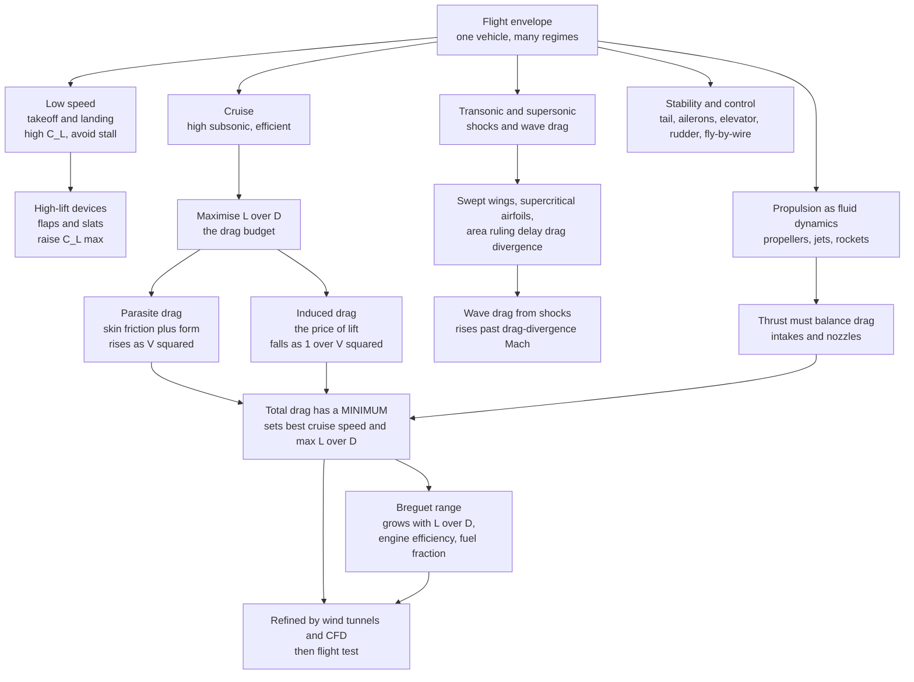

# ✈️ Aerodynamics and Aerospace Applications

> [!abstract] TL;DR
> **Aerospace aerodynamics** is fluid dynamics' most demanding engineering arena: a single vehicle must generate enough **lift** to haul hundreds of tonnes off the runway at low speed (without **stalling**), then cruise for hours near the speed of sound at maximum efficiency, and often push through the **transonic** or **supersonic** barrier — all while staying **stable and controllable**. The craft of design is the management of a **drag budget** that splits into **parasite** drag (skin friction plus form, rising as $V^2$) and **induced** drag (the unavoidable price of lift, falling as $1/V^2$); their sum has a **minimum** that fixes the best cruise speed and the maximum **lift-to-drag ratio** $L/D$. The **Breguet range equation** — $R \propto (L/D)\cdot\eta\cdot\ln(W_i/W_f)$ — shows why high $L/D$, efficient engines, and light structure are worth billions in fuel. Near Mach 1, local supersonic pockets terminate in **shocks** and drag spikes, tamed by **swept wings**, **supercritical airfoils**, and **area ruling**. **Propulsion** — propellers, jets, and rockets — is itself internal compressible fluid dynamics. The whole design is refined by **wind tunnels** (dynamic similarity) and **CFD**, because in aerospace the equations of flow carry the highest stakes: efficiency, safety, and flight itself.

---

## Intuition

**Analogy:** Designing an airliner is an exercise in taming fluid dynamics across a punishing range of conditions. The same wing must generate enough lift to haul 400 tonnes off the runway at 250 km/h, then cruise for eleven hours at 900 km/h — near the speed of sound — bleeding the absolute minimum of drag, all while staying stable, controllable, and never stalling. Every curve of the airfoil, every degree of sweep in the tail, every contour of the engine nacelle is a *negotiation with the air*: give the wing more camber and it lifts better at low speed but drags more at cruise; sweep it back to dodge shock waves and it stalls worse on approach; stretch its span to cut induced drag and the wing root wants to snap off in a hard turn.

This is where the abstract equations of flow meet the highest stakes. On a golf ball a modelling error costs a few metres of carry; on an airliner it costs millions of litres of fuel a year, or a hull loss. Aerospace is the field where fluid dynamics is forced to earn its keep across the *entire flight envelope* at once, and where the dream of flight lives or dies on a single number — the lift-to-drag ratio — being as large as the laws of the air will allow.

---

## How It Works

The physics of *how* a wing makes lift and *why* it drags — circulation, the Kutta-Joukowski theorem, angle of attack, the drag polar, stall — is developed in the companion note [[Lift_Drag_and_Aerodynamics]]. This note assumes that machinery and asks the *applied* question: how do you integrate lift, drag, stability, and propulsion into **one flying vehicle** that must work across radically different regimes?

### The flight envelope: one vehicle, many regimes

An aircraft lives in three (sometimes four) aerodynamic worlds, and a transport jet must serve all of them with a *single* fixed geometry:

1. **Low speed — takeoff and landing.** Air is slow, so dynamic pressure $q = \tfrac12\rho V^2$ is small and the wing must run at a **high lift coefficient** $C_L$ to hold the weight. The enemy is **stall**: push the angle of attack too far and the boundary layer separates (see [[The_Boundary_Layer]] and [[Flow_Separation_and_Drag_Crisis]]). The fix is **high-lift devices** — **flaps** that add camber and area, **slats** that re-energise the boundary layer — which raise $C_{L,\max}$ so the aircraft can fly slowly without departing.
2. **Cruise — efficient high-subsonic.** Here the wing runs at a modest $C_L$ and the whole game is **minimum drag / maximum $L/D$**. Airfoils are chosen for their *design lift coefficient* and *design Mach*; the finite wing is shaped to shed as little energy as possible.
3. **Transonic / supersonic.** Approaching Mach 1, local pockets of the flow go supersonic and terminate in **shock waves**, adding **wave drag** and control problems (this is the territory of [[Compressible_Flow_and_Gas_Dynamics]] and [[Shock_Waves_and_Supersonic_Flow]]). A vehicle meant to cruise here needs a fundamentally different shape.

No shape is optimal for all three, so every real aircraft is a **design compromise** frozen into aluminium and composite.

### Wing and airfoil design: the heart of it

- **Airfoil selection.** *Camber* buys lift at low angle of attack but raises the pitching moment and, at high speed, invites early shocks; *thickness* gives structural depth and fuel volume but adds wave drag. The airfoil is tuned to the design $C_L$ and Mach.
- **The finite wing.** **Aspect ratio** $AR = b^2/S$ (span squared over area) is the master trade: high $AR$ (long slender wings, like a glider or the U-2) slashes **induced drag** but adds structural weight and bending moment and hurts roll response, so fighters run low $AR$ for agility.
- **Planform.** **Sweep** delays compressibility effects (below); **taper** and **twist** shape the spanwise loading. The **elliptical lift distribution** minimises induced drag for a given span — the reason the Spitfire's wing was elliptical and modern wings approximate it.
- **Wingtip devices.** **Winglets** and raked tips weaken the trailing vortex, recovering a few percent of induced drag — worth a fortune over a fleet's life.

### The drag budget and efficiency

The total-drag curve of a whole aircraft in level flight is the sum of two competing pieces:

$$D = \underbrace{\tfrac12\rho V^2 S\,C_{D,0}}_{\text{parasite}\ \sim\ V^2} \;+\; \underbrace{\frac{2kW^2}{\rho V^2 S}}_{\text{induced}\ \sim\ 1/V^2}, \qquad k = \frac{1}{\pi e\,AR}.$$

Parasite drag (skin friction plus form drag) climbs as $V^2$; induced drag (the price of holding weight $W$ with lift) falls as $1/V^2$. Their sum is **U-shaped**, with a **minimum** at the speed where the two are equal — the point of **maximum $L/D$**. That single point governs cruise: the relentless pursuit of a higher $L/D$ (laminar-flow control, riblets that mimic sharkskin, obsessive weight reduction) is what fuel economy and range are made of. The **Breguet range equation** ties it all together:

$$R = \frac{\eta_o\,H}{g}\,\left(\frac{L}{D}\right)\,\ln\!\frac{W_i}{W_f},$$

where $\eta_o$ is overall engine efficiency, $H$ the fuel heating value, and $W_i/W_f$ the start-to-end weight ratio (set by the **fuel fraction**). Range scales *linearly* with $L/D$ and *logarithmically* with weight — which is exactly why aerodynamicists fight for every drag count and structures engineers fight for every kilogram.

### Transonic aerodynamics: taming the sound barrier

Long before the aircraft itself reaches Mach 1, the flow *accelerating over the wing* does. Beyond the **critical Mach number** a supersonic pocket forms and closes with a shock; past the **drag-divergence Mach number** the wave drag rises steeply — the "sound barrier" that stopped early jets. Three inventions made efficient high-subsonic airliners possible:

- **Swept wings.** Only the velocity component *normal* to the wing leading edge matters for compressibility, so sweeping the wing back by an angle $\Lambda$ delays effective compressibility roughly by $1/\cos\Lambda$, pushing the drag rise to a higher flight Mach.
- **Supercritical airfoils.** A flattened top and aft camber keep the supersonic pocket weak and its terminating shock gentle, delaying divergence.
- **Area ruling.** The **transonic area rule** says wave drag depends on how the *total* cross-sectional area of the whole aircraft varies along its length; pinching the fuselage where the wing joins — the famous **coke-bottle** waist — smooths that distribution and can halve transonic drag.

### Supersonic and hypersonic flight

For steady flight above Mach 1 the design flips: **thin, sharp airfoils** and slender bodies minimise wave drag, and every surface is drawn to keep shocks weak. Two hard problems dominate the frontier. First, the **sonic boom** — the shock system reaching the ground — is why civil supersonic flight over land is banned, and why quiet-boom shaping is an active research goal. Second, **hypersonic** flight ($M \gtrsim 5$, re-entry vehicles and spaceplanes) brings *extreme aerodynamic heating*: counter-intuitively, a **blunt body** is preferred because its strong detached **bow shock** stands off the surface and dumps most of the heat into the air rather than the vehicle, which still needs a **thermal protection system**.

### Stability, control, and propulsion

- **Stability and control.** Good *flying qualities* require **static stability** (disturb the aircraft and the aerodynamic moments push it back toward trim) and acceptable **dynamic stability** (the resulting oscillations damp out). The **horizontal and vertical stabilisers** provide the restoring moments; **control surfaces** — ailerons (roll), elevator (pitch), rudder (yaw) — locally manipulate the flow to manoeuvre; and **fly-by-wire** lets designers build deliberately relaxed-stability airframes that a computer stabilises for efficiency and agility.
- **Propulsion is fluid dynamics too.** **Propellers** are rotating wings generating thrust by the same lift physics; **jet engines** are chains of internal compressible-flow devices — intake, compressor, combustor, turbine, nozzle (turbomachinery and gas dynamics); **rockets** make thrust by expanding hot gas through a converging-diverging nozzle. Supersonic aircraft need **shock inlets** that decelerate the flow through a controlled shock train before the compressor, and **propulsion-airframe integration** (nacelle placement, boundary-layer diverters) is a first-order design driver.
- **Design tools.** The whole cycle is closed by **wind tunnels** (subsonic to hypersonic, relying on **dynamic similarity** in Reynolds and Mach — see [[Dimensional_Analysis_and_Similarity]]), by **computational fluid dynamics** (now central; turbulence closures per [[Turbulence_Modeling_RANS_LES_DNS]], and a full sibling note *Computational_Fluid_Dynamics* is planned for this section), and finally by **flight testing** — increasingly wrapped in **multidisciplinary optimisation** that trades aero against structures and controls simultaneously.



---

## Key Concepts

### Secondary Level

- **One wing, many jobs.** The same wing must lift a heavy jet off a runway *slowly* and then cruise *fast and efficiently*. It cannot be perfect at both, so an airliner is always a compromise — with **flaps** that slide out to help at takeoff and landing, then tuck away for cruise.
- **Two kinds of drag.** Push a plane faster and **friction/form drag** grows; fly it slower and it has to tilt up more to hold altitude, so **lift-related (induced) drag** grows. There is a sweet-spot speed in between where total drag is smallest — that is where planes cruise.
- **The sound barrier.** Near the speed of sound, invisible **shock waves** form on the wing and drag shoots up. **Swept-back wings** (angled like a dart) and a pinched "coke-bottle" fuselage were the tricks that let jets fly fast without hitting a wall of drag.
- **Range depends on efficiency.** How far a plane flies depends on how slippery it is (lift-to-drag), how thrifty its engines are, and how much of its weight is fuel. That is the essence of the range equation.

### Undergraduate Level

- **Drag budget.** $D = \tfrac12\rho V^2 S\,C_{D,0} + \dfrac{2kW^2}{\rho V^2 S}$ with $k = 1/(\pi e\,AR)$; minimum drag (max $L/D$) at $V_{md} = \sqrt{2W/(\rho S)}\,(k/C_{D,0})^{1/4}$, giving $(L/D)_{\max} = \tfrac12\sqrt{1/(kC_{D,0})}$.
- **Power required.** $P = D\,V$ is $U$-shaped too but bottoms out at a *lower* speed, $V_{mp} \approx 0.76\,V_{md}$; min-drag vs min-power speeds correspond to best range vs endurance (and swap between jets and props).
- **Breguet range.** $R = (\eta_o H/g)(L/D)\ln(W_i/W_f)$: linear in $L/D$, logarithmic in weight ratio. The jet form is $R = (V/(g\,c_t))(L/D)\ln(W_i/W_f)$.
- **Aspect ratio and induced drag.** $C_{D,i} = C_L^2/(\pi e\,AR)$; high $AR$ cuts induced drag but adds root bending moment and structural weight.
- **Drag divergence and sweep.** Effective normal Mach $\approx M\cos\Lambda$, so sweeping the wing raises the drag-divergence Mach roughly by $1/\cos\Lambda$.
- **Static stability.** Longitudinal stability requires the centre of gravity ahead of the neutral point, giving $dC_m/d\alpha < 0$ (a nose-down restoring moment when disturbed nose-up).

### Graduate Level

- **Lifting-line and induced drag minimisation.** Prandtl's theory gives minimum induced drag for the **elliptical** spanwise circulation distribution ($e = 1$); real planforms and winglets are attempts to approach it under structural constraints.
- **Transonic area rule.** Wave drag near $M=1$ depends on the second derivative of the equivalent-body cross-sectional area distribution $S(x)$ (Whitcomb); the Sears-Haack body minimises wave drag for given length and volume.
- **Supercritical and shock-free design.** Aft-loaded supercritical airfoils and inverse-design methods reduce the strength of the recompression shock, pushing $M_{dd}$ toward $M=1$; drag rise is the isentropic-to-shock transition of [[Compressible_Flow_and_Gas_Dynamics]].
- **Aeroelasticity.** Coupling of aerodynamic, inertial, and elastic forces gives **divergence**, **control reversal**, and the dynamic instability **flutter** — a fluid-structure interaction that can destroy a wing in seconds and sets flight-envelope limits.
- **Hypersonics.** Blunt-body **Newtonian** aerodynamics, real-gas and chemistry effects behind strong bow shocks, and thermal-protection ablation dominate; the entropy layer and viscous interaction blur the boundary-layer/inviscid split.
- **CFD closures and validation.** RANS, LES, and DNS trade fidelity for cost ([[Turbulence_Modeling_RANS_LES_DNS]]); transonic and separated flows stress turbulence models, so wind-tunnel and flight validation remain essential (Reynolds- and Mach-scaling via [[Dimensional_Analysis_and_Similarity]]).

---

## Python Demo

```python
# Aerospace flight physics, three ways:
#  (A) the DRAG BUDGET vs airspeed: parasite (~ V^2) + induced (~ 1/V^2)
#      -> a U-shaped total with a MINIMUM = max L/D = best cruise point
#  (B) the POWER-REQUIRED curve (drag * speed): min-drag vs min-power speeds
#  (C) the BREGUET RANGE equation: range vs L/D for several fuel fractions
#  (D) the TRANSONIC DRAG RISE and how WING SWEEP delays it
# Requires: numpy, matplotlib
import numpy as np
import matplotlib.pyplot as plt

g = 9.81

# ---- A mid-size jet at cruise altitude (approximate numbers) --------
W    = 700e3     # weight [N]  (~71 tonnes)
S    = 125.0     # reference wing area [m^2]
rho  = 0.38      # air density at ~11 km [kg/m^3]
CD0  = 0.020     # zero-lift (parasite) drag coefficient
AR   = 9.5       # aspect ratio
e    = 0.85      # Oswald efficiency factor
k    = 1.0 / (np.pi * e * AR)     # induced-drag factor:  CDi = k * CL^2

# ====================================================================
# (A) DRAG BUDGET and (B) POWER REQUIRED vs true airspeed
# ====================================================================
V = np.linspace(120, 320, 600)             # true airspeed [m/s]
q = 0.5 * rho * V**2                        # dynamic pressure
CL = W / (q * S)                            # CL needed to hold level flight
D_par = q * S * CD0                         # parasite drag   (rises as V^2)
D_ind = k * W**2 / (q * S)                  # induced  drag   (falls as 1/V^2)
D_tot = D_par + D_ind                       # total drag
P_req = D_tot * V                           # power required = drag * speed

i_dmin = np.argmin(D_tot)                   # min-drag speed  -> max L/D
i_pmin = np.argmin(P_req)                   # min-power speed
V_dmin, V_pmin = V[i_dmin], V[i_pmin]
LD_max = W / D_tot[i_dmin]

# analytic cross-checks
V_dmin_th = np.sqrt(2 * W / (rho * S)) * (k / CD0)**0.25
LD_max_th = 0.5 * np.sqrt(1.0 / (k * CD0))
print("=== Drag budget ===")
print(f"Max L/D          = {LD_max:5.1f}  (theory {LD_max_th:.1f})")
print(f"Best-range speed = {V_dmin:5.0f} m/s (theory {V_dmin_th:.0f}) "
      f"= {V_dmin*3.6:.0f} km/h")
print(f"Min-power speed  = {V_pmin:5.0f} m/s = {V_pmin/V_dmin:.2f} x V_min-drag")

# ====================================================================
# (C) BREGUET RANGE:  R = (eta_o * H / g) * (L/D) * ln(1 / (1 - f))
# ====================================================================
eta_o = 0.35            # overall (thermal x propulsive) efficiency
H     = 43e6            # jet-fuel heating value [J/kg]
LD_axis = np.linspace(8, 24, 200)
fuel_fracs = [0.20, 0.35, 0.50]            # fuel mass fraction of takeoff weight
range_km = {f: (eta_o * H / g) * LD_axis * np.log(1.0 / (1.0 - f)) / 1000.0
            for f in fuel_fracs}
R_here = (eta_o * H / g) * LD_max * np.log(1.0 / (1.0 - 0.35)) / 1000.0
print("=== Breguet range ===")
print(f"At L/D={LD_max:.1f}, fuel fraction 0.35 -> range ~ {R_here:,.0f} km")

# ====================================================================
# (D) TRANSONIC DRAG RISE and the effect of WING SWEEP
# ====================================================================
M = np.linspace(0.5, 1.6, 600)

def cd_vs_mach(M, M_dd):
    """Zero-lift drag vs Mach: baseline + transonic hump + supersonic plateau,
    all keyed to the drag-divergence Mach M_dd so sweep simply shifts it."""
    x = M - M_dd
    hump    = 0.045 * np.exp(-((x - 0.33) / 0.10)**2)   # transonic overshoot
    plateau = 0.030 * 0.5 * (1.0 + np.tanh(x / 0.04))    # supersonic wave drag
    return CD0 + hump + plateau

Lambda        = np.radians(35.0)               # wing sweep angle
M_dd_straight = 0.72
M_dd_swept    = M_dd_straight / np.cos(Lambda)  # sweep delays drag divergence
CD_straight = cd_vs_mach(M, M_dd_straight)
CD_swept    = cd_vs_mach(M, M_dd_swept)
print("=== Transonic ===")
print(f"Drag-divergence Mach: straight {M_dd_straight:.2f}, "
      f"swept 35 deg {M_dd_swept:.2f}")

# ====================================================================
# Plot: 2 x 2 grid
# ====================================================================
fig, ax = plt.subplots(2, 2, figsize=(14, 10))
fig.suptitle("Aerospace Flight Physics: Drag Budget, Range, and the Sound Barrier",
             fontsize=15, fontweight="bold")

# A. drag budget
axA = ax[0, 0]
axA.plot(V, D_par/1e3, color="#ff7f0e", lw=2, label="parasite  ~ V^2")
axA.plot(V, D_ind/1e3, color="#1f77b4", lw=2, label="induced  ~ 1 / V^2")
axA.plot(V, D_tot/1e3, color="k", lw=2.6, label="total drag")
axA.axvline(V_dmin, ls="--", color="#d62728", lw=1.2)
axA.annotate(f"min drag = max L/D\n~{V_dmin:.0f} m/s,  L/D={LD_max:.0f}",
             xy=(V_dmin, D_tot[i_dmin]/1e3),
             xytext=(V_dmin + 12, D_tot[i_dmin]/1e3 * 1.6),
             fontsize=9, color="#d62728",
             arrowprops=dict(arrowstyle="->", color="#d62728"))
axA.set_xlabel("true airspeed  V [m/s]")
axA.set_ylabel("drag [kN]")
axA.set_title("A. The drag budget: why a best cruise speed exists")
axA.legend(fontsize=8); axA.grid(alpha=0.3)

# B. power required
axB = ax[0, 1]
axB.plot(V, P_req/1e6, color="#9467bd", lw=2.6)
axB.axvline(V_pmin, ls="--", color="#2ca02c", lw=1.2)
axB.axvline(V_dmin, ls="--", color="#d62728", lw=1.2)
axB.annotate("min power\n(best endurance, prop)", xy=(V_pmin, P_req[i_pmin]/1e6),
             xytext=(V_pmin - 4, P_req[i_pmin]/1e6 * 1.35),
             fontsize=8.5, color="#2ca02c", ha="right",
             arrowprops=dict(arrowstyle="->", color="#2ca02c"))
axB.annotate("min drag\n(best range, prop)", xy=(V_dmin, P_req[i_dmin]/1e6),
             xytext=(V_dmin + 8, P_req[i_dmin]/1e6 * 0.80),
             fontsize=8.5, color="#d62728",
             arrowprops=dict(arrowstyle="->", color="#d62728"))
axB.set_xlabel("true airspeed  V [m/s]")
axB.set_ylabel("power required  P = D V [MW]")
axB.set_title("B. Power-required curve: min-power vs min-drag speeds")
axB.grid(alpha=0.3)

# C. Breguet range
axC = ax[1, 0]
colors = {0.20: "#1f77b4", 0.35: "#2ca02c", 0.50: "#d62728"}
for f in fuel_fracs:
    axC.plot(LD_axis, range_km[f], lw=2.4, color=colors[f],
             label=f"fuel fraction = {f:.2f}")
axC.axvline(LD_max, ls=":", color="k", lw=1.0)
axC.annotate("our jet's L/D", xy=(LD_max, range_km[0.35][np.argmin(np.abs(LD_axis-LD_max))]),
             xytext=(LD_max - 8, range_km[0.50].max()*0.75), fontsize=8.5,
             arrowprops=dict(arrowstyle="->"))
axC.set_xlabel("lift-to-drag ratio  L / D")
axC.set_ylabel("Breguet range [km]")
axC.set_title("C. Breguet range grows with L/D and fuel fraction")
axC.legend(fontsize=8); axC.grid(alpha=0.3)

# D. transonic drag rise
axD = ax[1, 1]
axD.plot(M, CD_straight, color="#d62728", lw=2.4, label="straight wing")
axD.plot(M, CD_swept,    color="#1f77b4", lw=2.4, label="swept 35 deg")
axD.axvline(1.0, ls=":", color="k", lw=1.0)
axD.annotate("Mach 1", xy=(1.0, CD0*1.2), xytext=(1.02, CD0*1.2), fontsize=8.5)
axD.axvline(M_dd_straight, ls="--", color="#d62728", lw=1.0)
axD.axvline(M_dd_swept,    ls="--", color="#1f77b4", lw=1.0)
axD.annotate("sweep delays\nthe drag rise",
             xy=(M_dd_swept, CD0*1.15),
             xytext=(M_dd_swept + 0.02, CD0*3.0), fontsize=8.5, color="#1f77b4",
             arrowprops=dict(arrowstyle="->", color="#1f77b4"))
axD.set_xlabel("flight Mach number  M")
axD.set_ylabel("zero-lift drag coefficient  C_D0")
axD.set_title("D. Transonic drag rise: swept wings tame the shocks")
axD.legend(fontsize=8); axD.grid(alpha=0.3)

plt.tight_layout(rect=[0, 0, 1, 0.95])
plt.show()
```

**What it shows.** Panel **A** decomposes a jet's level-flight drag into **parasite** drag (climbing as $V^2$) and **induced** drag (falling as $1/V^2$); their sum is $U$-shaped and its minimum is the max-$L/D$ point that fixes the efficient cruise speed — the printed value matches the analytic $V_{md}$ and $(L/D)_{\max}$. Panel **B** plots **power required** $P = DV$, which bottoms out at a *lower* speed than drag does; the two speeds are the classic best-endurance and best-range points (which swap roles between propeller and jet aircraft). Panel **C** is the **Breguet range** equation: range rises *linearly* with $L/D$ and jumps with **fuel fraction** — showing why aerodynamic slipperiness and light structure are worth so much. Panel **D** is the **transonic drag rise**: zero-lift drag stays flat, then spikes near Mach 1 as shocks form; sweeping the wing 35 degrees shifts the whole rise to a higher flight Mach ($M_{dd}$ from about $0.72$ to $0.88$), which is precisely why every airliner has swept wings.

---

## Real-World Applications

> **Example — the Boeing 787 / Airbus A350 wing.** These aircraft cruise near $M = 0.85$ at an $L/D$ around $19$–$21$. Their design stacks every idea in this note: a high-aspect-ratio **swept** wing with a **supercritical airfoil** to push drag divergence past the cruise Mach; large **raked wingtips / winglets** to shave induced drag; full-span **slats and multi-element flaps** to keep approach speeds safe; and an airframe shaped (with subtle area-ruling in the wing-body fairing) to smooth the transonic cross-section. Turbofan engines with very high bypass ratio raise $\eta_o$, and composite structure cuts $W_f$ — every term of the Breguet equation pushed at once, buying double-digit fuel-burn reductions per seat.

- **Supersonic and quiet-boom flight.** Concorde used a slender **ogival delta** and thin sharp sections for low wave drag at $M = 2$; the modern **NASA X-59 QueSST** reshapes the shock system to soften the **sonic boom** and reopen over-land supersonic travel.
- **Hypersonic re-entry.** The Space Shuttle, Apollo, and Dragon capsules use **blunt bodies** with strong detached bow shocks and thermal-protection tiles so most of the re-entry heat goes into the shock-heated air, not the vehicle.
- **Combat aircraft and fly-by-wire.** Fighters run low aspect ratio and **relaxed static stability**, using fly-by-wire to stabilise an otherwise divergent airframe for extreme agility.
- **Wind turbines, propellers, and rotorcraft.** Blades are rotating airfoils; helicopter rotors add the brutal complication of advancing/retreating blade asymmetry and compressibility at the tips.
- **Drones and urban air mobility.** eVTOL and small UAVs operate at low Reynolds number where laminar separation dominates, demanding airfoils and control laws quite different from full-scale aircraft.
- **Aeroelasticity and aeroacoustics.** Flutter clearance sets flight-envelope limits on every airliner, and airframe/engine **noise** reduction (chevron nozzles, landing-gear fairings) is now a first-order design driver near airports.

---

## Common Pitfalls

- **Optimising for cruise alone.** A wing tuned purely for maximum cruise $L/D$ can have a vicious low-speed stall or need impractically complex high-lift devices. Real design balances the *whole envelope*, not one operating point.
- **Confusing the drag components' fixes.** Winglets cut **induced** drag but do nothing for **wave** drag; sweep cuts wave drag but hurts low-speed lift and adds weight; laminar flow cuts **skin friction** but is fragile to roughness and insects. Applying the wrong remedy wastes weight and money.
- **Ignoring compressibility until Mach 1.** Wave drag and control changes begin at the **critical** Mach, well *below* Mach 1 — designers who wait for the "barrier" have already lost efficiency and may meet control reversal or tuck.
- **Treating aspect ratio as free.** Very high $AR$ minimises induced drag but drives up **wing-root bending moment**, structural weight, and flutter risk; the optimum is a multidisciplinary compromise, not an aerodynamic one.
- **Forgetting stability for performance.** A statically unstable layout can be more efficient but is unflyable without active control; losing the flight-control computer then means losing the aircraft.
- **Trusting CFD or a wind tunnel blindly.** RANS struggles with separated and transonic flows; tunnels rarely match full-scale **Reynolds** number. Results must be cross-validated and scaled via dynamic similarity, or the model quietly lies about drag and stall.
- **Neglecting propulsion-airframe integration.** Analysing the clean wing and the isolated engine separately misses intake spillage, nacelle interference, and jet effects that can dominate the real drag bookkeeping.

---

## Related Concepts

- [[Lift_Drag_and_Aerodynamics]] — the fundamentals this note builds on: how lift arises (circulation, Kutta-Joukowski), the drag polar, angle of attack, and stall. Start there for the mechanics; this note is the applied aerospace integration.
- [[Compressible_Flow_and_Gas_Dynamics]] — the compressibility, critical Mach, and isentropic/shock physics behind wave drag, supercritical airfoils, and engine internal flow.
- [[Shock_Waves_and_Supersonic_Flow]] — the shocks that cause transonic drag rise, sonic booms, hypersonic bow shocks, and supersonic-inlet shock trains.
- [[The_Boundary_Layer]] — skin-friction drag, laminar-flow control, and the separation that limits high-lift and drives stall.
- [[Flow_Separation_and_Drag_Crisis]] — form drag, streamlining, and the separation control (flaps, slats, vortex generators) that keeps the flow attached.
- [[Dimensional_Analysis_and_Similarity]] — Reynolds and Mach scaling that let wind-tunnel models stand in for full aircraft, and the limits of that trick.
- [[Turbulence_Modeling_RANS_LES_DNS]] — the turbulence closures at the heart of aerospace CFD and their fidelity-versus-cost trade.
- [[Fluid_Dynamics_Overview]] — the parent survey placing aerodynamics in the wider map of fluid flow.
- [[Newtons_Laws_and_Kinematics]] — the momentum and thrust-versus-drag force balance underlying flight dynamics and the range equation.
- [[Finite_Difference_Methods]] — a core numerical scheme behind discretising the flow equations for CFD.
- [[High_Performance_and_Parallel_Computing]] — the supercomputing that makes large aerospace CFD simulations feasible.
- [[Biomechanics_of_Movement]] — the parallel world of animal and insect flight, where the same aerodynamics is solved by evolution.
- [[Fluid_Dynamics_in_Biology]] — low-Reynolds and flapping-flight regimes relevant to small drones and biological flyers.

A dedicated *Computational_Fluid_Dynamics* sibling in this section (planned) will develop the numerical design toolchain referenced above.

---

## Review Questions

1. **Secondary:** An airliner's wings have flaps that extend for takeoff and landing but retract for cruise. Explain in plain language why one fixed wing shape cannot be best for both slow flight near the ground and fast flight at altitude, and what the flaps are doing.
2. **Undergraduate:** An aircraft has $W = 600$ kN, $S = 110\,\text{m}^2$, $C_{D,0} = 0.022$, $AR = 9$, $e = 0.82$, flying at $\rho = 0.4\,\text{kg/m}^3$. (a) Compute the induced-drag factor $k$ and the maximum $L/D$. (b) Find the best-range (min-drag) speed $V_{md}$. (c) Using the Breguet equation with $\eta_o = 0.33$, $H = 43\,\text{MJ/kg}$, and a fuel fraction of $0.4$, estimate the range. Which single change — a 10 percent higher $L/D$ or a 10 percent larger fuel fraction — buys more range, and why?
3. **Graduate:** A transport jet must cruise at $M = 0.85$. Discuss quantitatively how you would raise the drag-divergence Mach number to safely exceed this, naming at least three aerodynamic strategies and the physical mechanism of each. Then explain two *penalties* those strategies impose (one structural, one low-speed aerodynamic) and how relaxed static stability with fly-by-wire and multidisciplinary optimisation help reconcile the competing demands.

---

## Sources

- J. D. Anderson — *Fundamentals of Aerodynamics*, 6th ed. (McGraw-Hill, 2017), Chs. 5, 11–14 (finite wings, compressible and transonic flow, aircraft performance).
- J. D. Anderson — *Aircraft Performance and Design* (McGraw-Hill, 1999) — the drag polar, drag budget, and the Breguet range and endurance equations.
- D. P. Raymer — *Aircraft Design: A Conceptual Approach*, 6th ed. (AIAA, 2018) — integrated conceptual design across the flight envelope.
- R. T. Whitcomb — "A Study of the Zero-Lift Drag-Rise Characteristics of Wing-Body Combinations Near the Speed of Sound," NACA Report 1273 (1956) — the transonic area rule.
- NASA — X-59 QueSST program and Beginner's Guide to Aeronautics, nasa.gov (quiet supersonic and applied aerodynamics references).

---

#fluid-dynamics #aerospace #aircraft-design #propulsion #flight
