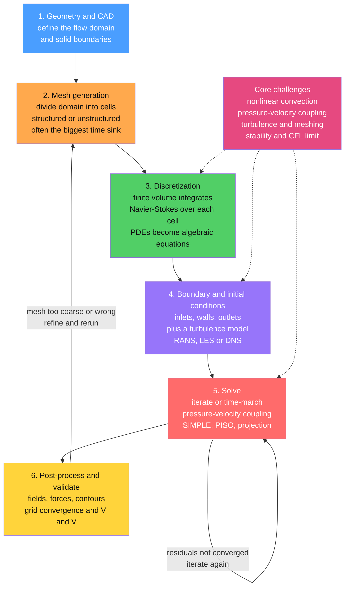

# 💻 Computational Fluid Dynamics (CFD)

> [!abstract] TL;DR
> The **Navier-Stokes equations** are analytically unsolvable for almost every real flow — nonlinear, in complicated geometry, and turbulent — so CFD does the next best thing: it **chops the fluid into millions of tiny cells** and lets a computer march the equations forward cell by cell, timestep by timestep, until a virtual wind tunnel emerges on screen. This turns a supercomputer into a wind tunnel, letting engineers "fly" an aircraft, "crash" a wave, or "forecast" a storm entirely *in silico*. The workflow is a **pipeline** — geometry, mesh, discretize (usually **finite volume**), apply boundary conditions and a **turbulence model**, solve the **pressure-velocity coupling**, then post-process and validate. Its hard cores — the nonlinear convective term, the expensive elliptic **pressure-Poisson** solve, and above all **turbulence modeling and meshing** — make CFD as much craft as science, demanding rigorous **verification and validation** to avoid beautiful-but-wrong results. Accelerated today by HPC, GPUs, and machine learning, CFD is the indispensable computational engine of modern fluid dynamics.

---

## Intuition

**Analogy:** Imagine you want to know how air swirls around a new car, but the equations that govern it — the Navier-Stokes equations — are a knot no human can untie by hand for anything more complicated than a straight pipe. So you cheat in the most productive way possible: you slice the air around the car into millions of tiny invisible boxes, write down the simple bookkeeping rule "whatever mass and momentum flows into a box must flow out or pile up," and let a computer enforce that rule in every box, over and over, thousands of times a second of simulated time. Slowly a picture forms — vortices peeling off the mirrors, a low-pressure bubble behind the rear window — a **virtual wind tunnel** built entirely from arithmetic.

That is CFD: the art of replacing an unsolvable *continuous* problem with a huge but *solvable* discrete one. The catch is that the fluid's most important behavior — **turbulence** — churns across a vast range of scales, from metres down to fractions of a millimetre, and no computer can resolve them all. So CFD is never a pure calculation; it is a series of judgement calls about which physics to resolve, which to model, how fine to mesh, and how far to trust the pretty colours on screen.

---

## How It Works

### Core Mechanics

1. **Why CFD exists — the unsolvable equations.** The [[The_Navier_Stokes_Equations|Navier-Stokes equations]] express conservation of mass and momentum for a fluid. They are **nonlinear** (the convective term $(\vec{u}\cdot\nabla)\vec{u}$ multiplies the unknown velocity by its own gradient), they live in **arbitrary geometry**, and at high Reynolds number their solutions are **turbulent**. There is no closed-form solution for flow over a wing, through an engine, or around a building. CFD is the *only* way to predict these flows quantitatively — and it is cheaper, faster, and safer than building physical prototypes and wind tunnels for every design iteration, while also revealing quantities (pressure at every point, wall shear, mixing rates) that are hard or impossible to measure experimentally.

2. **The CFD pipeline.** Every simulation follows the same workflow: **(1) Geometry / CAD** — define the flow domain and the solid surfaces. **(2) Mesh generation** — subdivide the domain into cells (a *structured* grid of nice hexahedra, or an *unstructured* mesh of tetrahedra that wraps complex shapes); mesh quality and resolution are decisive, and meshing is frequently the **most labor-intensive step** of the whole project. **(3) Discretization** — convert the governing PDEs into algebraic equations on the mesh. **(4) Boundary/initial conditions and a turbulence model** — specify inlets, outlets, and walls, and choose how turbulence is handled. **(5) Solve** — iterate or time-march to a converged solution, coupling velocity and pressure. **(6) Post-process and validate** — extract forces, fields, and contours, and check them for correctness.

3. **Discretization — turning PDEs into algebra.** Several schemes exist, but the CFD standard is the **finite-volume method (FVM)**: integrate the conservation laws over each cell so that what enters through a face must leave through a neighbour's face. This *guarantees conservation* of mass, momentum, and energy discretely (nothing is spuriously created), and it handles arbitrary cell shapes — ideal for complex geometry. Its cousin the **finite-difference method** (see [[Finite_Difference_Methods]]) approximates derivatives on a grid and is simpler but less flexible on unstructured meshes; **finite elements** dominate structural mechanics and appear in some CFD; **spectral methods** (see [[Spectral_Methods_and_the_FFT]]) offer superb accuracy on simple periodic domains. All produce a large sparse system of algebraic equations from the discrete Navier-Stokes equations.

4. **The pressure-velocity coupling — CFD's central numerical challenge.** For **incompressible** flow, pressure is peculiar: it has *no evolution equation of its own*. Instead pressure acts as a **Lagrange multiplier** that instantaneously adjusts to enforce incompressibility, $\nabla\cdot\vec{u}=0$. Taking the divergence of the momentum equation turns this into a **pressure-Poisson equation** $\nabla^2 p = \nabla\cdot(\text{momentum source})$ — an *elliptic* problem that couples the whole domain at once (see [[The_Poisson_and_Laplace_Equation]]). Solving it is the **most expensive operation** in most incompressible codes. Algorithms like **SIMPLE**, **PISO**, and **projection (fractional-step) methods** iterate velocity and pressure back to mutual consistency: guess a velocity, solve for the pressure that makes it divergence-free, correct the velocity, repeat.

5. **Turbulence modeling — the make-or-break issue.** Resolving *every* turbulent eddy (**DNS**) costs on the order of $Re^3$ and is affordable only for tiny academic flows. So practical CFD *models* turbulence: **RANS** solves only the mean flow and models all turbulence through a closure such as $k$-$\varepsilon$ or $k$-$\omega$ SST (roughly **99 percent of industrial CFD**); **LES** resolves the large energy-containing eddies and models only the small subgrid scales; and **hybrids** like DES blend the two. This single choice dominates both accuracy and cost — it is developed in depth in the companion note *[[Turbulence_Modeling_RANS_LES_DNS|Turbulence Modeling (RANS, LES, DNS)]]*.

6. **Stability, accuracy, and convergence — the craft.** A time-marching solver is only stable if the timestep respects the **CFL condition** ($C = u\,\Delta t/\Delta x \lesssim 1$): information must not cross more than one cell per step. Discretization schemes trade errors — **upwind** schemes are stable but add **numerical (artificial) diffusion** that smears sharp features, while **central** schemes are more accurate but can produce unphysical oscillations (dispersion). Two separate convergences matter: **iterative convergence** (do the solver residuals fall to near zero?) and **grid convergence** (does the answer *stop changing* as the mesh is refined?). Trustworthy CFD demonstrates both.

7. **Meshing — the practical bottleneck.** Good meshes are hard. Near walls the flow forms thin **boundary layers** with steep gradients, demanding stacked **prism layers** and a first cell placed at the right $y^{+}$; regions of strong gradients need **local refinement** or **adaptive mesh refinement (AMR)**; and poor cell quality (skewness, high aspect ratio) wrecks both accuracy and convergence. For complex industrial geometry, meshing can consume more engineering time than the solve itself.

8. **Compressible and specialized CFD.** When the flow approaches or exceeds the speed of sound, shocks appear and the equations become **hyperbolic**, demanding **shock-capturing schemes** — Godunov-type finite-volume methods with **flux limiters** or high-order **WENO** reconstruction — to resolve discontinuities without spurious oscillations. Free-surface and **multiphase** flows use interface-tracking methods such as **Volume of Fluid (VOF)**, and **reacting/combustion** CFD couples the flow to chemical kinetics. These specialized toolkits extend the same core pipeline.

9. **Verification and Validation (V&V) — the honest rigor.** CFD can produce gorgeous pictures that are physically *wrong*. **Verification** asks "are we solving the equations *right*?" — code correctness, grid convergence, and time-step independence. **Validation** asks "are we solving the *right* equations?" — comparison against trusted experiment or DNS. The failure modes are legion: garbage boundary conditions, an inappropriate turbulence model, a poor mesh. Serious practice adds **uncertainty quantification** and guards against **"colorful fluid dynamics"** — plausible-looking output that encodes the wrong physics.

10. **Software, HPC, and the ML frontier.** The ecosystem spans commercial codes (**ANSYS Fluent**, **STAR-CCM+**, **COMSOL**) and open-source ones (**OpenFOAM**, **SU2**). Large CFD runs are heavy consumers of **HPC and parallel computing** (see [[High_Performance_and_Parallel_Computing]]), increasingly on **GPUs**, and are now being accelerated by **machine learning** — surrogate models that emulate expensive solves, and data-driven turbulence closures (see [[Machine_Learning_in_Computational_Physics]]).

### Flow / Architecture



---

## Key Concepts

### Secondary Level

- **A computer wind tunnel.** CFD splits the air or water into a huge number of tiny cells and works out, cell by cell, how fast the fluid moves and what its pressure is — building a virtual wind tunnel inside a computer instead of a real one.
- **Why we cannot just solve it.** The equations for fluids are too tangled to solve with pencil and paper for real shapes like cars and planes, so we approximate them with arithmetic on the grid of cells.
- **The recipe (pipeline).** Draw the shape, chop the space into cells (**meshing**), tell the computer the rules and the conditions at the edges, let it grind through many small time steps, then look at the results.
- **The hard parts.** Two things make CFD tricky: **turbulence** (swirls of every size, too many to compute exactly) and **meshing** (making a good grid of cells is fiddly and slow). Pretty pictures can still be wrong, so results must be checked against real experiments.

### Undergraduate Level

- **Finite volume and conservation.** FVM integrates each conservation law over a control volume (cell), so face fluxes cancel between neighbours — mass, momentum, and energy are conserved *discretely* by construction. This is why FVM, not finite differences, is the CFD workhorse for complex geometry.
- **The incompressibility constraint.** With $\rho$ constant, continuity reduces to $\nabla\cdot\vec{u}=0$. Pressure has no time-derivative; it is whatever field makes the velocity divergence-free at each instant. Taking $\nabla\cdot$ of the momentum equation yields the **pressure-Poisson equation**, an elliptic solve coupling the whole domain.
- **Projection / fractional-step method.** (1) Advance velocity ignoring pressure to get an intermediate $\vec{u}^{*}$ (generally *not* divergence-free). (2) Solve $\nabla^2 p = \tfrac{\rho}{\Delta t}\nabla\cdot\vec{u}^{*}$. (3) Correct: $\vec{u}^{n+1}=\vec{u}^{*}-\tfrac{\Delta t}{\rho}\nabla p$. This enforces $\nabla\cdot\vec{u}^{n+1}=0$.
- **The CFL condition.** Explicit time-marching is stable only if $C=\dfrac{u\,\Delta t}{\Delta x}\lesssim 1$; the numerical domain of dependence must contain the physical one. Finer meshes force smaller timesteps and more cost.
- **Upwind vs central differencing.** Central schemes are second-order accurate but oscillate in convection-dominated flow; upwind schemes are stable but add first-order **numerical diffusion**. The choice trades accuracy against robustness.
- **Grid convergence.** Refine the mesh; a trustworthy result approaches a mesh-independent limit at the scheme's design order (a Richardson-extrapolation / grid-convergence-index study). A result that keeps changing with refinement is under-resolved.
- **Vorticity-streamfunction formulation.** In 2D incompressible flow you can eliminate pressure entirely: define the streamfunction $\psi$ (with $u=\partial_y\psi$, $v=-\partial_x\psi$, automatically divergence-free) and vorticity $\omega=\partial_x v-\partial_y u$. Then $\nabla^2\psi=-\omega$ (a Poisson solve) and $\partial_t\omega+\vec{u}\cdot\nabla\omega=\nu\nabla^2\omega$ (advection-diffusion) — the basis of the demo below and a bridge to [[Vorticity_and_Circulation]].

### Graduate Level

- **Elliptic-parabolic-hyperbolic split and its numerical consequences.** Incompressible Navier-Stokes is parabolic in time but carries an **elliptic** pressure constraint (instantaneous, global — a finite pressure signal everywhere at once), whereas compressible flow is **hyperbolic** with finite acoustic speed. This structural difference dictates the solver: pressure-based segregated schemes (SIMPLE/PISO) for low Mach number, density-based Riemann/Godunov schemes for compressible and supersonic flow (see [[Shock_Waves_and_Supersonic_Flow]]).
- **The checkerboard problem and staggered grids.** Collocating $p$ and $\vec{u}$ at the same nodes with central differences decouples odd/even pressures, admitting a spurious "checkerboard" mode. Harlow-Welch **staggered (MAC) grids** or **Rhie-Chow momentum interpolation** on collocated grids restore pressure-velocity coupling.
- **Numerical diffusion and dispersion (modified-equation analysis).** A Taylor expansion of a discrete scheme reveals its leading truncation error: first-order upwind adds a diffusive $\propto\Delta x\,\partial_{xx}$ term (excess dissipation), while second-order central adds a dispersive $\propto\Delta x^2\,\partial_{xxx}$ term (phase errors, Gibbs oscillations near discontinuities). High-resolution **TVD/flux-limited** and **WENO** schemes switch behaviour by local smoothness to get accuracy without oscillations.
- **Shock capturing.** For compressible flow, Godunov's method solves a local Riemann problem at each cell face; approximate Riemann solvers (Roe, HLLC) plus limiters or WENO reconstruction capture shocks over a few cells while preserving conservation and avoiding entropy-violating expansion shocks.
- **Time-integration stiffness.** Diffusion imposes $\Delta t \lesssim \Delta x^2/\nu$ (parabolic stability), often far more restrictive than the convective CFL on fine near-wall meshes; this motivates **implicit** or **semi-implicit (IMEX)** treatment of the viscous term and multigrid-accelerated pressure solves.
- **Verification, validation, and UQ.** Verification via the **Method of Manufactured Solutions** confirms the observed order of accuracy; the **Grid Convergence Index** bounds discretization error. Validation compares against benchmark experiment/DNS with quantified experimental uncertainty. Forward UQ (polynomial chaos, Monte Carlo over uncertain inputs and model constants) turns a single deterministic run into a distribution — the antidote to "colorful fluid dynamics."
- **HPC and ML acceleration.** Domain decomposition with MPI, GPU offload of the sparse pressure solve (multigrid, Krylov), and emerging **ML surrogates / physics-informed neural networks** and **data-driven closures** promise order-of-magnitude speedups (see [[Machine_Learning_in_Computational_Physics]] and [[GPU_Computing_and_Numerical_Libraries]]).

---

## Python Demo

```python
# Minimal CFD solver: 2D incompressible Navier-Stokes for the LID-DRIVEN CAVITY,
# using the VORTICITY-STREAMFUNCTION formulation on a uniform grid.
#
# The lid-driven cavity is THE canonical CFD benchmark: a square box of still
# fluid whose top wall (the "lid") slides at constant speed, dragging the fluid
# into a large recirculating vortex with weaker counter-rotating corner eddies.
#
# Governing equations (2D incompressible, pressure eliminated):
#     grad^2 psi = -omega                       (Poisson: streamfunction <- vorticity)
#     d(omega)/dt + u d(omega)/dx + v d(omega)/dy = nu grad^2 omega   (vorticity transport)
# with  u = d(psi)/dy,  v = -d(psi)/dx   (automatically divergence-free: enforces
# incompressibility WITHOUT a separate pressure solve).
#
# The core CFD loop below is: solve the elliptic Poisson problem for psi, set wall
# vorticity (Thom's formula = the boundary condition), then ADVECT + DIFFUSE the
# vorticity one explicit step -- repeated until the flow reaches steady state.
# We then VISUALIZE streamlines, the velocity field, and vorticity, and VALIDATE
# the centerline velocity against the classic Ghia et al. (1982) benchmark.
#
# numpy + matplotlib only.  Indexing convention: arrays are f[i, j] = f(x_i, y_j).

import numpy as np
import matplotlib.pyplot as plt

# ---------------------------------------------------------------- parameters
N     = 41            # grid nodes per side (modest, but resolves the vortex)
L     = 1.0           # square cavity side length
h     = L / (N - 1)   # uniform cell size
Re    = 100.0         # Reynolds number = U_lid * L / nu
U_lid = 1.0           # lid velocity (drives the flow)
nu    = U_lid * L / Re

# stable explicit timestep: satisfy BOTH diffusive and convective (CFL) limits
dt = 0.8 * min(0.25 * h * h / nu, h / U_lid)

n_steps   = 40000     # max time steps to reach steady state
tol       = 1e-7      # steady-state tolerance on vorticity change
n_poisson = 80        # SOR sweeps per step for the streamfunction Poisson solve
beta      = 1.7       # SOR over-relaxation factor (< optimal ~1.86 for N=41)

x = np.linspace(0.0, L, N)
y = np.linspace(0.0, L, N)

psi = np.zeros((N, N))   # streamfunction
w   = np.zeros((N, N))   # vorticity

# ---------------------------------------------------------------- time march
for step in range(n_steps):
    w_old = w.copy()

    # (1) VORTICITY BOUNDARY CONDITIONS -- Thom's formula from psi at the wall.
    #     Top wall is the moving lid (velocity U_lid); the others are no-slip.
    w[1:-1, -1] = -2.0 * psi[1:-1, -2] / h**2 - 2.0 * U_lid / h   # top (lid)
    w[1:-1,  0] = -2.0 * psi[1:-1,  1] / h**2                     # bottom
    w[ 0, 1:-1] = -2.0 * psi[ 1, 1:-1] / h**2                     # left
    w[-1, 1:-1] = -2.0 * psi[-2, 1:-1] / h**2                     # right

    # (2) ELLIPTIC POISSON SOLVE  grad^2 psi = -omega   (SOR, psi = 0 on walls).
    #     This is the pressure-Poisson analogue that couples the whole domain.
    for _ in range(n_poisson):
        psi[1:-1, 1:-1] = (1.0 - beta) * psi[1:-1, 1:-1] + beta * 0.25 * (
            psi[2:, 1:-1] + psi[:-2, 1:-1] +
            psi[1:-1, 2:] + psi[1:-1, :-2] + h**2 * w[1:-1, 1:-1])

    # (3) VELOCITY from the streamfunction:  u = d(psi)/dy,  v = -d(psi)/dx.
    u = np.zeros((N, N)); v = np.zeros((N, N))
    u[1:-1, 1:-1] =  (psi[1:-1, 2:] - psi[1:-1, :-2]) / (2.0 * h)
    v[1:-1, 1:-1] = -(psi[2:, 1:-1] - psi[:-2, 1:-1]) / (2.0 * h)

    # (4) VORTICITY TRANSPORT: advection + diffusion, explicit, central diff.
    adv_x = u[1:-1, 1:-1] * (w[2:, 1:-1] - w[:-2, 1:-1]) / (2.0 * h)
    adv_y = v[1:-1, 1:-1] * (w[1:-1, 2:] - w[1:-1, :-2]) / (2.0 * h)
    lap   = (w[2:, 1:-1] + w[:-2, 1:-1] + w[1:-1, 2:] + w[1:-1, :-2]
             - 4.0 * w[1:-1, 1:-1]) / h**2
    w[1:-1, 1:-1] += dt * (-adv_x - adv_y + nu * lap)

    # (5) steady-state check
    if step % 200 == 0 and step > 0:
        change = np.linalg.norm(w - w_old) / (np.linalg.norm(w) + 1e-12)
        if change < tol:
            print(f"Steady state reached at step {step}, residual {change:.2e}")
            break

# ---------------------------------------------- final velocity field for plots
u = np.zeros((N, N)); v = np.zeros((N, N))
u[1:-1, 1:-1] =  (psi[1:-1, 2:] - psi[1:-1, :-2]) / (2.0 * h)
v[1:-1, 1:-1] = -(psi[2:, 1:-1] - psi[:-2, 1:-1]) / (2.0 * h)
u[:, -1] = U_lid                      # impose lid velocity for display
speed = np.sqrt(u**2 + v**2)

# Ghia, Ghia & Shin (1982) benchmark: u along the vertical centerline, Re = 100.
ghia_y = np.array([0.0000, 0.0547, 0.0625, 0.0703, 0.1016, 0.1719, 0.2813,
                   0.4531, 0.5000, 0.6172, 0.7344, 0.8516, 0.9531, 0.9609,
                   0.9688, 0.9766, 1.0000])
ghia_u = np.array([0.00000, -0.03717, -0.04192, -0.04775, -0.06434, -0.10150,
                  -0.15662, -0.21090, -0.20581, -0.13641, 0.00332, 0.23151,
                   0.68717, 0.73722, 0.78871, 0.84123, 1.00000])
ic = (N - 1) // 2                     # column index of x = 0.5 (needs odd N)

# ---------------------------------------------------------------- figure
X, Y = np.meshgrid(x, y)              # shape (N, N), rows = y  -> transpose fields
fig, ax = plt.subplots(2, 2, figsize=(13, 11))

# (a) streamlines coloured by speed -- the primary + corner vortices
strm = ax[0, 0].streamplot(x, y, u.T, v.T, color=speed.T, cmap="viridis",
                           density=1.6, linewidth=1.0)
fig.colorbar(strm.lines, ax=ax[0, 0], label="speed |u|")
ax[0, 0].set_title(f"(a) Streamlines, lid-driven cavity  (Re = {Re:.0f})\n"
                   "primary vortex + weak corner eddies")
ax[0, 0].set_xlabel("x"); ax[0, 0].set_ylabel("y"); ax[0, 0].set_aspect("equal")

# (b) vorticity field (clipped for readability -- singular at top corners)
levels = np.linspace(-5, 5, 21)
cf = ax[0, 1].contourf(X, Y, w.T, levels=levels, cmap="RdBu_r", extend="both")
fig.colorbar(cf, ax=ax[0, 1], label="vorticity  omega")
ax[0, 1].set_title("(b) Vorticity field\nsheared layer under the lid, rotating core")
ax[0, 1].set_xlabel("x"); ax[0, 1].set_ylabel("y"); ax[0, 1].set_aspect("equal")

# (c) velocity vectors over speed magnitude
sp = ax[1, 0].contourf(X, Y, speed.T, levels=20, cmap="magma")
fig.colorbar(sp, ax=ax[1, 0], label="speed |u|")
skip = 2
ax[1, 0].quiver(X[::skip, ::skip], Y[::skip, ::skip],
                u.T[::skip, ::skip], v.T[::skip, ::skip],
                color="white", scale=15)
ax[1, 0].set_title("(c) Velocity field\nfluid dragged along the lid, recirculating")
ax[1, 0].set_xlabel("x"); ax[1, 0].set_ylabel("y"); ax[1, 0].set_aspect("equal")

# (d) VALIDATION: u on the vertical centerline vs the Ghia et al. benchmark
ax[1, 1].plot(u[ic, :], y, "b-", lw=2, label="this solver")
ax[1, 1].plot(ghia_u, ghia_y, "ro", ms=6, label="Ghia et al. (1982)")
ax[1, 1].axvline(0, color="0.7", lw=0.8)
ax[1, 1].set_title("(d) Validation: u on vertical centerline (x = 0.5)\n"
                   "agreement with the benchmark = trust")
ax[1, 1].set_xlabel("u velocity"); ax[1, 1].set_ylabel("y")
ax[1, 1].legend(loc="upper left")

plt.tight_layout()
plt.show()

# Takeaways:
#  * The vorticity-streamfunction loop IS a minimal CFD solver: an elliptic Poisson
#    solve (the pressure-coupling analogue) + explicit advection-diffusion, marched
#    to steady state -- exactly the pattern inside industrial codes, just tiny.
#  * (a)-(c) show the physics emerge from arithmetic: a big central vortex, a thin
#    high-vorticity shear layer under the lid, and weak counter-rotating corner eddies.
#  * (d) is the whole point of V&V: our modest 41x41 grid already tracks the Ghia
#    benchmark -- WITHOUT such a check, pretty streamlines prove nothing.
```

---

## Real-World Applications

> **Example — replacing the wind tunnel in aircraft design.** Modern aircraft are designed largely *in silico*. Aerodynamicists mesh the aircraft surface with boundary-layer prism layers, solve the RANS equations (almost always with the $k$-$\omega$ SST model) to predict the pressure distribution, lift, and drag across the flight envelope, and iterate the shape long before any metal is cut. Physical wind-tunnel tests — once the primary design tool — are now mainly for **validation** of the CFD. Where RANS is known to fail (buffet, deep stall, separated wakes), engineers escalate to LES or hybrid DES. This is the theme of the forthcoming sibling *Aerodynamics_and_Aerospace_Applications*, and it rests directly on the lift and drag physics of [[Lift_Drag_and_Aerodynamics]].

- **Automotive** — external aerodynamics (drag, lift, cooling airflow), cabin HVAC, and aeroacoustic wind noise are computed with RANS for fast design sweeps and LES/DES for the unsteady wake that dominates a car's pressure drag.
- **Weather and climate** — global models discretize the atmosphere and ocean into a grid and time-march the governing equations; they are CFD at planetary scale, resolving the large flow and *parameterizing* subgrid turbulence and convection exactly as RANS/LES do (see [[Numerical_Weather_Prediction]] and [[Climate_Models_and_Projections]]).
- **Energy** — gas-turbine and internal-combustion **combustion** CFD couples flow to chemistry to predict efficiency and emissions; **wind-turbine and wind-farm** LES predicts wake losses between turbines; hydro and steam turbomachinery is optimized blade-row by blade-row.
- **Biomedical** — patient-specific CFD of **blood flow** in arteries and aneurysms predicts wall shear stress and rupture risk, and **respiratory** CFD models drug-aerosol deposition in the lungs — flows squarely in the low-Reynolds and transitional regime.
- **Civil and marine** — wind loads on skyscrapers and bridges, pollutant dispersion in cities, and ship hull resistance and free-surface wave-making (a **multiphase** problem, the subject of the sibling *Multiphase_and_Free_Surface_Flows*) all rely on CFD.

---

## Common Pitfalls

- **Trusting a solution that has not been grid-converged.** A single run on one mesh proves nothing. Refining the grid should approach a mesh-independent answer; if the result keeps changing, it is under-resolved. Always run at least two or three mesh densities and report the trend (a grid-convergence-index study).
- **"Colorful fluid dynamics."** Beautiful contour plots can encode wrong physics — a bad turbulence model, garbage boundary conditions, or a skewed mesh. Pretty output is not validation. Compare against experiment or DNS before believing a number.
- **Choosing the wrong turbulence model — or forgetting $y^{+}$.** There is no universal model; eddy-viscosity RANS is unreliable on massive separation and strong curvature. Wall treatment compounds this: using wall functions with a first cell at $y^{+}<1$ (or a wall-resolved model at $y^{+}=100$) silently misapplies the near-wall assumption. Check $y^{+}$ against the model's requirement.
- **Ignoring stability limits.** Explicit schemes diverge if the timestep violates the CFL condition or the diffusive limit $\Delta t\lesssim\Delta x^2/\nu$. Symptoms are exploding residuals or NaNs. Reduce $\Delta t$, use an implicit viscous term, or switch to a bounded scheme.
- **Numerical diffusion masquerading as physics.** First-order upwind convection is rock-solid but smears vortices and shear layers into mush; a "clean, converged" result can be dominated by artificial dissipation rather than the fluid's actual viscosity. Use at least second-order schemes and confirm the physics survives mesh refinement.
- **Checkerboard pressure fields.** Collocating pressure and velocity with central differences on the same nodes admits a spurious oscillating pressure mode. Use a staggered (MAC) grid or Rhie-Chow interpolation.
- **Under-resolving the boundary layer or mesh corners.** Steep near-wall gradients and singular corners (like the lid-driven cavity's top corners, where vorticity is formally infinite) demand local refinement; a uniform coarse mesh quietly loses the very physics that matters.

---

## Related Concepts

- [[The_Navier_Stokes_Equations]] — the governing equations CFD discretizes and solves numerically; everything here is a numerical assault on this one system.
- [[Turbulence_Modeling_RANS_LES_DNS]] — the make-or-break sub-topic of CFD: how the unresolvable turbulent scales are modeled (RANS/LES/DNS), dominating both accuracy and cost.
- [[Vorticity_and_Circulation]] — the vorticity-streamfunction formulation used in the demo comes straight from this material; vorticity is the natural variable for 2D incompressible CFD.
- [[Finite_Difference_Methods]] — the sibling discretization to finite volume; the grid-based approximation of derivatives that underlies the demo solver and much of computational physics.
- [[The_Poisson_and_Laplace_Equation]] — the elliptic equation at the heart of incompressible CFD: the pressure-Poisson solve (and, in the demo, the streamfunction Poisson solve) that couples the whole domain.
- [[Classification_of_PDEs_and_Discretization]] — why incompressible flow is elliptic-parabolic while compressible flow is hyperbolic, dictating which solver and scheme to use.
- [[Spectral_Methods_and_the_FFT]] — the high-accuracy alternative to FVM on simple/periodic domains, favored in DNS of turbulence.
- [[Shock_Waves_and_Supersonic_Flow]] — the compressible regime that demands shock-capturing schemes (Godunov, flux limiters, WENO).
- [[Euler_Equations_and_Inviscid_Flow]] — the inviscid limit; the convective (hyperbolic) core that shock-capturing CFD must handle.
- [[The_Boundary_Layer]] — the thin near-wall region whose resolution (prism layers, $y^{+}$) dominates mesh cost and accuracy in wall-bounded CFD.
- [[Dimensional_Analysis_and_Similarity]] — the Reynolds number that sets the flow regime and, via the $Re^3$ scaling, why DNS is unaffordable and modeling is mandatory.
- [[High_Performance_and_Parallel_Computing]] — why large CFD runs live on supercomputers; domain decomposition and the parallel pressure solve.
- [[Machine_Learning_in_Computational_Physics]] — surrogate models and data-driven turbulence closures now accelerating CFD.
- [[Numerical_Weather_Prediction]] — CFD at planetary scale: the same discretize-and-march workflow with subgrid parameterization of turbulence.

---

## Review Questions

1. **Secondary** — In your own words, explain how CFD turns a fluid-flow problem a person cannot solve by hand into something a computer *can* solve. What are the six steps of the CFD pipeline, and why are turbulence and meshing usually the hardest parts?
2. **Undergraduate** — For **incompressible** flow, pressure has no evolution equation of its own. Explain how the incompressibility constraint $\nabla\cdot\vec{u}=0$ leads to a **pressure-Poisson equation**, and describe how a projection (fractional-step) method uses it to keep the velocity divergence-free each timestep. Separately, state the **CFL condition** and explain what goes wrong if it is violated.
3. **Graduate** — You run a RANS simulation of flow over a stalled airfoil. The solver residuals are converged and the mesh is grid-converged, yet the predicted drag disagrees badly with wind-tunnel data. Distinguish **verification** from **validation** and explain which one has failed here. Discuss how numerical diffusion, turbulence-model choice, and near-wall $y^{+}$ each could contribute, and outline a V&V-plus-UQ plan (including what you would escalate to, e.g. DES/LES) to establish a trustworthy answer.

---

## Sources

- Ferziger, J. H., Perić, M. & Street, R. L. — *Computational Methods for Fluid Dynamics*, 4th ed., Springer (2020). The standard graduate text on finite-volume CFD, pressure-velocity coupling, and SIMPLE/PISO.
- Versteeg, H. K. & Malalasekera, W. — *An Introduction to Computational Fluid Dynamics: The Finite Volume Method*, 2nd ed., Pearson (2007). Accessible, thorough FVM introduction.
- Ghia, U., Ghia, K. N. & Shin, C. T. — "High-Re Solutions for Incompressible Flow Using the Navier-Stokes Equations and a Multigrid Method," *Journal of Computational Physics* 48(3), 387-411 (1982). The lid-driven cavity benchmark used in the demo.
- Anderson, J. D. — *Computational Fluid Dynamics: The Basics with Applications*, McGraw-Hill (1995). Clear treatment of discretization, stability (CFL), and compressible/shock-capturing methods.
- Roache, P. J. — *Verification and Validation in Computational Science and Engineering*, Hermosa (1998). The reference on V&V, grid-convergence index, and the Method of Manufactured Solutions.

---

#fluid-dynamics #CFD #finite-volume #lid-driven-cavity #simulation
