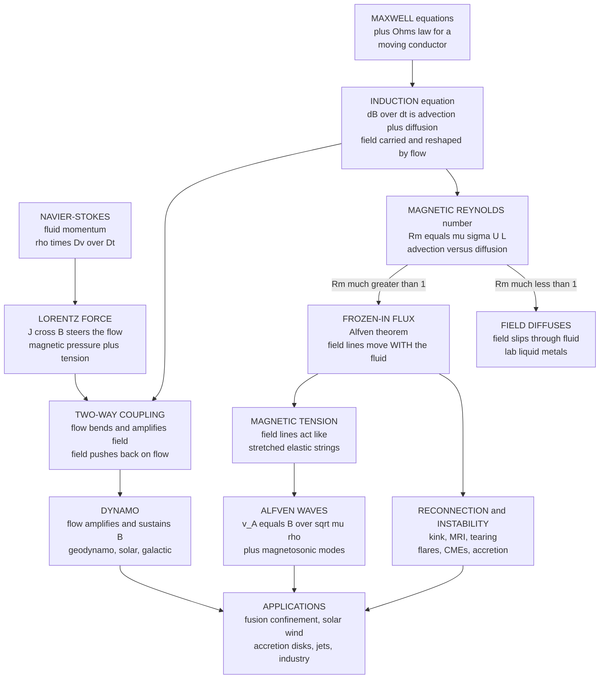

# 🧲 Magnetohydrodynamics and Plasma Flows

> [!abstract] TL;DR
> **Magnetohydrodynamics (MHD)** is the fluid dynamics of **electrically conducting fluids** -- plasmas, liquid metals, ionised or salty fluids -- where the flow and the **magnetic field** are inseparably coupled. It fuses the [[The_Navier_Stokes_Equations|Navier-Stokes equations]] with [[Maxwells_Equations|Maxwell's equations]] through two threads: the **Lorentz force** $\vec J\times\vec B$ steers the fluid (adding **magnetic pressure** $B^2/2\mu_0$ and **magnetic tension**), and the moving conductor reshapes the field through the **induction equation** $\partial_t\vec B = \nabla\times(\vec v\times\vec B) + \eta\nabla^2\vec B$. Whether the field is dragged with the flow or slips through it is decided by the **magnetic Reynolds number** $R_m = \mu_0\sigma U L$: at $R_m \gg 1$ the field lines are **frozen into** the fluid (Alfven's theorem) and behave like elastic strings threading it, giving **Alfven waves** $v_A = B/\sqrt{\mu_0\rho}$. This one theory governs the **dynamos** that generate Earth's and the Sun's magnetic fields, the **reconnection** that powers solar flares and auroras, the **magneto-rotational instability** that lets matter fall onto black holes, and the **magnetic confinement** of fusion plasmas -- so MHD is fluid dynamics' gateway to astrophysics, space weather, and fusion energy.

---

## Intuition

**Analogy:** Take an ordinary fluid and make it **electrically conducting** -- a plasma, a pot of liquid sodium, the salty sea -- and something magical happens: it becomes **wedded to magnetic fields**. Imagine the field lines as threads embedded in honey. Where the honey is a near-perfect conductor, the threads are **frozen in**: stir the honey and the threads are dragged along, stretched, twisted, and wound up wherever the fluid goes. But the threads push back -- they are under **tension**, like stretched elastic strings, and they resist being bent, so they steer and constrain the very flow that carries them. Flow and field are locked in a **two-way marriage**, and neither can be understood alone.

That marriage -- **magnetohydrodynamics** -- governs the Sun's violent surface, where twisted field lines snap and hurl billion-tonne clouds of plasma into space; the churning iron core that gives Earth its protective magnetic shield; the swirl of galaxies and the disks feeding black holes; and humanity's quest to **bottle a star** inside a fusion reactor by holding a hundred-million-degree plasma in a cage made of nothing but magnetic field. Where ordinary fluid dynamics ends -- at the edge of the conducting, magnetised universe -- MHD begins.

---

## How It Works

### Core Mechanics

**1. What makes a fluid "magnetohydrodynamic".** Most fluids ignore magnetism because they carry no free charge. But heat a gas until atoms ionise and you get a **plasma** -- a soup of free electrons and ions that conducts electricity; the same is true of **liquid metals** (molten iron, sodium, mercury) and strongly **ionised or salty** fluids. Any conductor that moves through a magnetic field feels an electromotive force and carries a current; any current feels a force from the field. So for a conducting fluid the equations of [[The_Navier_Stokes_Equations|fluid motion]] and the equations of [[Maxwells_Equations|electromagnetism]] can no longer be solved separately -- they must be solved **together**. That single combined theory is MHD.

**2. The coupling, thread one -- the Lorentz force steers the flow.** The magnetic field enters the momentum equation as a body force, the **Lorentz force density** $\vec J\times\vec B$, where $\vec J = (\nabla\times\vec B)/\mu_0$ is the current. The momentum balance becomes
$$\rho\frac{D\vec v}{Dt} = -\nabla p + \underbrace{\frac{1}{\mu_0}(\nabla\times\vec B)\times\vec B}_{\text{magnetic force}} + \mu\nabla^2\vec v .$$
The magnetic force splits into two mechanically intuitive pieces:
$$\frac{(\nabla\times\vec B)\times\vec B}{\mu_0} = \underbrace{\frac{1}{\mu_0}(\vec B\cdot\nabla)\vec B}_{\text{magnetic tension}} \;-\; \underbrace{\nabla\!\left(\frac{B^2}{2\mu_0}\right)}_{\text{magnetic pressure}} .$$
The **magnetic pressure** $B^2/2\mu_0$ acts like an ordinary isotropic pressure -- the field resists being compressed and pushes outward, which is exactly how a field *confines* a plasma. The **magnetic tension** acts *along* the field lines, straightening bent ones like a plucked string returning to true. The field, in short, behaves like an **elastic medium** threading the fluid.

**3. The coupling, thread two -- the flow reshapes the field.** Combine Faraday's law with Ohm's law for a moving conductor, $\vec J = \sigma(\vec E + \vec v\times\vec B)$, and eliminate $\vec E$ to get the **induction equation**, the master equation for the field:
$$\frac{\partial\vec B}{\partial t} = \underbrace{\nabla\times(\vec v\times\vec B)}_{\text{advection: field carried by flow}} + \underbrace{\eta\,\nabla^2\vec B}_{\text{diffusion: field slips through}},\qquad \eta = \frac{1}{\mu_0\sigma}.$$
The first term **advects** the field -- it is dragged, stretched, and amplified by the fluid motion. The second term lets the field **diffuse** through the fluid at finite conductivity, smoothing and decaying it. These are the two fates of a magnetic field, and their contest defines everything that follows.

**4. The magnetic Reynolds number -- who wins, advection or diffusion?** Non-dimensionalising the induction equation gives the **magnetic Reynolds number**, the exact analogue of the ordinary Reynolds number but for the field instead of momentum:
$$R_m = \frac{\text{advection}}{\text{diffusion}} = \frac{UL}{\eta} = \mu_0\sigma U L .$$
When $R_m \ll 1$ -- small, slow, or poorly conducting flows like a **laboratory liquid-metal** experiment -- diffusion dominates and the field simply leaks through the fluid. When $R_m \gg 1$ -- the huge scales of **astrophysics** or the strong conductivity of **fusion plasmas** -- advection overwhelmingly wins, and we enter the regime of **ideal MHD**.

**5. Frozen-in flux -- the pivotal idea.** In the ideal limit ($\sigma\to\infty$, so $\eta\to 0$ and $R_m\to\infty$) the diffusion term vanishes and the field obeys $\partial_t\vec B = \nabla\times(\vec v\times\vec B)$. **Alfven's theorem** then holds: the magnetic flux through any surface that moves *with the fluid* is conserved,
$$\frac{d}{dt}\iint_S \vec B\cdot d\vec A = 0 .$$
Physically, **field lines are frozen into the fluid** and move with it, exactly like the threads in honey. Grab the plasma and you grab the field; move the field and you move the plasma. This single fact -- that at high $R_m$ the field is a material property of the flow -- is the key that unlocks cosmic magnetism, from stretched galactic fields to the wound-up magnetism of the solar convection zone.

**6. MHD waves -- the elasticity rings.** Because the field carries tension, a magnetised fluid supports **new wave modes** unknown to ordinary fluids. Pluck a field line transversely and the tension provides a restoring force, launching an **Alfven wave** that travels *along* the field at the **Alfven speed**
$$v_A = \frac{B}{\sqrt{\mu_0\rho}} .$$
Add gas compressibility (the sound speed $c_s$) and the field's magnetic pressure and you also get **fast and slow magnetosonic waves**, which combine the two elasticities and propagate at angles to the field. This rich wave zoo carries and dissipates energy -- Alfven waves are a leading candidate for heating the Sun's million-degree corona -- and it connects MHD to the compressible wave physics of *Compressible_Flow_and_Gas_Dynamics*.

**7. Instabilities and reconnection -- the violent side.** Field-threaded flows go unstable in distinctive ways: the **kink** and **sausage** instabilities buckle current-carrying flux tubes; the **magneto-rotational instability (MRI)** destabilises a weakly magnetised rotating disk and drives the turbulence that transports angular momentum outward (see [[Hydrodynamic_Instabilities]] and *Turbulence_Fundamentals*); and magnetised **Rayleigh-Taylor** modes shape supernova remnants. Most dramatic is **magnetic reconnection**: where oppositely directed field lines are pressed together in a thin current sheet, the frozen-in condition locally breaks, the lines snap and reconnect to a lower-energy topology, and the stored magnetic energy is released explosively -- powering **solar flares**, **coronal mass ejections**, magnetospheric **substorms**, and the **aurora**.

**8. The dynamo -- where cosmic fields come from.** Magnetic fields diffuse and decay; left alone, Earth's field would vanish in tens of thousands of years. Yet it has persisted for billions. The resolution is the **dynamo**: turbulent, convective motion of a conducting fluid **amplifies and sustains** a field, converting kinetic energy into magnetic energy against ohmic decay. The **geodynamo** in Earth's liquid-iron outer core generates the field that shields the biosphere; the **solar dynamo** drives the roughly eleven-year sunspot cycle and periodic field reversals; **galactic dynamos** magnetise the interstellar medium. The classic mean-field picture uses the $\Omega$-effect (differential rotation stretching poloidal field into toroidal field) and the $\alpha$-effect (helical turbulence twisting it back). Dynamo action is a rotating, convecting, stratified problem, so it also links to *Convection_and_Thermal_Fluid_Dynamics* and [[Vorticity_and_Circulation]].

### Flow / Architecture



---

## Key Concepts

### Secondary Level

- **Conducting fluids feel magnetism.** A plasma or liquid metal carries electric current, so a magnetic field can push it around (the **Lorentz force**), and its motion can generate or bend the field. Ordinary water or air cannot do this.
- **Field lines get stuck in the fluid.** When the fluid conducts well and is large, magnetic field lines are **frozen in** -- dragged along like threads in honey. This is why the Sun's magnetism gets twisted and tangled by its churning surface.
- **The field acts springy.** A magnetic field pushes outward like a **pressure** and pulls straight like a **stretched string**. Pluck a field line and it vibrates -- an **Alfven wave**.
- **MHD runs the cosmos and the fusion dream.** It generates Earth's protective magnetic field, powers solar flares and the aurora, and is how we try to hold a fusion plasma too hot for any wall to touch.

### Undergraduate Level

- **Governing equations.** Momentum with the Lorentz force $\rho\,D\vec v/Dt = -\nabla p + \mu_0^{-1}(\nabla\times\vec B)\times\vec B + \mu\nabla^2\vec v$; the **induction equation** $\partial_t\vec B = \nabla\times(\vec v\times\vec B) + \eta\nabla^2\vec B$; plus $\nabla\cdot\vec v = 0$ (incompressible) and the always-true $\nabla\cdot\vec B = 0$.
- **Magnetic force split.** $\mu_0^{-1}(\nabla\times\vec B)\times\vec B = \mu_0^{-1}(\vec B\cdot\nabla)\vec B - \nabla(B^2/2\mu_0)$: **tension** along the lines plus **pressure** $B^2/2\mu_0$ across them.
- **Magnetic Reynolds number.** $R_m = \mu_0\sigma UL = UL/\eta$. $R_m\ll 1$: diffusion dominant (lab, $R_m\sim 10^{-2}$-$10^2$). $R_m\gg 1$: ideal, frozen-in (stars, $R_m\sim 10^{8}$-$10^{12}$).
- **Alfven's theorem.** In ideal MHD, flux through a co-moving surface is conserved; field lines are material lines of the flow.
- **Alfven speed.** $v_A = B/\sqrt{\mu_0\rho}$; transverse wave along $\vec B$ driven by tension. Plasma **beta** $\beta = p_{\text{gas}}/(B^2/2\mu_0)$ says whether gas ($\beta\gg1$) or field ($\beta\ll1$) dominates.
- **Magnetosonic waves.** Fast and slow modes combine sound speed $c_s$ and $v_A$; at high $R_m$ the field lines behave like an elastic net stretched through the gas.

### Graduate Level

- **Ideal-MHD conservation laws.** Frozen-in flux implies conserved magnetic **helicity** $H = \int \vec A\cdot\vec B\,dV$ and field-line topology; reconnection is precisely the breaking of these invariants in resistive layers.
- **Reconnection rates.** **Sweet-Parker** gives $v_{\text{in}}/v_A \sim R_m^{-1/2}$ -- far too slow for observed flares at coronal $R_m\sim10^{12}$; **Petschek** and plasmoid-unstable / turbulent reconnection give near-$R_m$-independent fast rates. Tearing modes seed the current sheets.
- **Magneto-rotational instability (MRI).** A weak field in a differentially rotating disk with $d\Omega/dr<0$ is linearly unstable (Balbus-Hawley), producing MHD turbulence and an outward angular-momentum flux -- the enabling mechanism of accretion onto stars and black holes.
- **Mean-field dynamo.** $\partial_t\bar{\vec B} = \nabla\times(\alpha\bar{\vec B}) + \nabla\times(\bar{\vec v}\times\bar{\vec B}) + \eta\nabla^2\bar{\vec B}$, with $\alpha$ the helicity of small-scale turbulence; **Cowling's theorem** forbids a steady axisymmetric dynamo, forcing three-dimensional flow.
- **Fusion stability.** Tokamak equilibria (Grad-Shafranov equation) are limited by ideal (kink, ballooning) and resistive (tearing, neoclassical tearing) MHD modes; the Kruskal-Shafranov and pressure ($\beta$) limits bound achievable confinement.
- **Relativistic and Hall MHD.** In pulsar magnetospheres and jets $v_A$ can approach $c$, requiring **relativistic MHD**; at ion-skin-depth scales the Hall term $\propto \vec J\times\vec B$ modifies reconnection and dispersive waves, bridging MHD to kinetic plasma physics.

---

## Python Demo

```python
# Magnetohydrodynamics: four windows on the coupling of flow and field.
#   (a) MAGNETIC REYNOLDS ladder Rm = mu0*sigma*U*L across systems, from a lab
#       liquid-metal beaker (Rm << 1, field DIFFUSES) to the galaxy (Rm >> 1,
#       field FROZEN into the flow) -- advection versus diffusion.
#   (b) ALFVEN speed v_A = B / sqrt(mu0*rho) vs field strength for several
#       plasma densities -- the wave that rides field lines like a plucked string.
#   (c) MAGNETIC PRESSURE p = B^2 / (2 mu0) vs field strength -- the field
#       pushing outward, the mechanism of magnetic confinement.
#   (d) HARTMANN flow: a transverse magnetic field flattens the velocity profile
#       of a conducting flow between two plates via the Lorentz force.
import numpy as np
import matplotlib.pyplot as plt

mu0 = 4 * np.pi * 1e-7      # vacuum permeability [H/m]
m_p = 1.6726e-27           # proton mass [kg]

# ------------------------------------------------------------------
# (a) MAGNETIC REYNOLDS NUMBER ladder:  Rm = mu0 * sigma * U * L
#     (name, sigma [S/m], U [m/s], L [m])
# ------------------------------------------------------------------
systems = [
    ("Lab liquid metal (beaker)", 1e7, 0.1,  0.1),
    ("Sodium dynamo experiment",  1e7, 5.0,  0.5),
    ("Earth's outer core",        5e5, 1e-3, 2e6),
    ("Sun (convection zone)",     1e3, 1e3,  1e8),
    ("Interstellar / galaxy",     1e3, 1e4,  3e19),
]
names = [s[0] for s in systems]
Rm = np.array([mu0 * sig * U * L for _, sig, U, L in systems])
print("Magnetic Reynolds number  Rm = mu0 * sigma * U * L")
for nm, r in zip(names, Rm):
    regime = "field FROZEN-IN (advection wins)" if r > 1 else "field DIFFUSES"
    print(f"  {nm:28s} Rm = {r:10.2e}   {regime}")

# ------------------------------------------------------------------
# (b) ALFVEN speed  v_A = B / sqrt(mu0 * rho)  vs field strength
# ------------------------------------------------------------------
B = np.logspace(-9, 1, 300)                 # 1 nT .. 10 T
dens = {
    "Solar corona  n=1e15 /m3": 1e15 * m_p,
    "Solar wind    n=1e7  /m3": 1e7  * m_p,
    "ISM           n=1e6  /m3": 1e6  * m_p,
}

# ------------------------------------------------------------------
# (c) MAGNETIC PRESSURE  p_mag = B^2 / (2 mu0)  vs field strength
# ------------------------------------------------------------------
p_mag = B**2 / (2 * mu0)

# ------------------------------------------------------------------
# (d) HARTMANN flow between plates y = -1..1 with a transverse field.
#     u(y)/u_max = [1 - cosh(Ha*y)/cosh(Ha)] / [1 - 1/cosh(Ha)]
#     Ha (Hartmann number) = B*a*sqrt(sigma/(rho*nu)); Ha -> 0 => Poiseuille.
# ------------------------------------------------------------------
yy = np.linspace(-1, 1, 400)
Ha_vals = [0.3, 2.0, 5.0, 20.0]

# ------------------------------------------------------------------
# PLOTS
# ------------------------------------------------------------------
fig, ax = plt.subplots(2, 2, figsize=(14, 11))

colors_a = ["#2a9d8f" if r > 1 else "#e76f51" for r in Rm]
ax[0, 0].barh(names, Rm, color=colors_a)
ax[0, 0].set_xscale("log")
ax[0, 0].axvline(1.0, color="k", ls="--", lw=1.5)
ax[0, 0].text(1.6, 1.6, "Rm = 1", rotation=90, va="bottom", fontsize=9)
ax[0, 0].set_title("(a) MAGNETIC REYNOLDS ladder: teal = frozen-in, orange = diffusive")
ax[0, 0].set_xlabel("Rm = mu0 * sigma * U * L   [log scale]")
ax[0, 0].grid(alpha=0.3, axis="x")

for label, rho in dens.items():
    vA = B / np.sqrt(mu0 * rho)
    ax[0, 1].loglog(B, vA, lw=1.8, label=label)
ax[0, 1].axhline(3e8, color="gray", ls=":", lw=1.2)
ax[0, 1].text(1e-8, 4e8, "speed of light", color="gray", fontsize=8)
ax[0, 1].set_title("(b) ALFVEN speed  v_A = B / sqrt(mu0 * rho)")
ax[0, 1].set_xlabel("magnetic field B [T]"); ax[0, 1].set_ylabel("v_A [m/s]")
ax[0, 1].legend(fontsize=8); ax[0, 1].grid(alpha=0.3, which="both")

ax[1, 0].loglog(B, p_mag, color="#6a4c93", lw=2)
ax[1, 0].axhline(1.01e5, color="gray", ls=":", lw=1.2)
ax[1, 0].text(1e-8, 1.5e5, "1 atmosphere", color="gray", fontsize=8)
ax[1, 0].set_title("(c) MAGNETIC PRESSURE  p = B^2 / (2 mu0)")
ax[1, 0].set_xlabel("magnetic field B [T]"); ax[1, 0].set_ylabel("p_mag [Pa]")
ax[1, 0].grid(alpha=0.3, which="both")

for Ha in Ha_vals:
    u = (1 - np.cosh(Ha * yy) / np.cosh(Ha)) / (1 - 1 / np.cosh(Ha))
    ax[1, 1].plot(u, yy, lw=1.8, label=f"Ha = {Ha:g}")
ax[1, 1].set_title("(d) HARTMANN flow: field flattens the velocity profile")
ax[1, 1].set_xlabel("normalised velocity  u / u_max"); ax[1, 1].set_ylabel("y / a")
ax[1, 1].legend(fontsize=9); ax[1, 1].grid(alpha=0.3)

plt.tight_layout()
plt.savefig("magnetohydrodynamics_and_plasma_flows.png", dpi=110)
print("\nSaved magnetohydrodynamics_and_plasma_flows.png")
```

**What it shows.** Panel **(a)** builds the **magnetic Reynolds ladder** $R_m = \mu_0\sigma UL$ across nine orders of magnitude: a **lab liquid-metal beaker** and a table-top sodium experiment sit near or below $R_m\sim 1$ (orange -- the field **diffuses** through the fluid), while **Earth's core**, the **solar convection zone**, and the **galaxy** tower to $R_m\sim10^{3}$-$10^{20}$ (teal -- the field is **frozen into** the flow, dragged and amplified). The dashed $R_m=1$ line is the great divide between diffusive lab MHD and ideal cosmic MHD. Panel **(b)** plots the **Alfven speed** $v_A = B/\sqrt{\mu_0\rho}$ against field strength for three densities; the tenuous solar corona reaches enormous Alfven speeds (approaching the light-speed line, where non-relativistic MHD breaks down), while the denser solar wind is far slower -- the wave rides the field lines like a plucked string, faster where the "string" is taut and light. Panel **(c)** shows **magnetic pressure** $B^2/2\mu_0$ climbing as $B^2$; a few tesla already exceed atmospheric pressure, which is exactly why a magnetic field can **confine** a plasma with no material wall. Panel **(d)** is the **Hartmann profile**: with no field ($Ha\to0$) the flow is parabolic Poiseuille, but as the transverse field strengthens the Lorentz force **flattens the core** into a plug and squeezes the shear into thin Hartmann boundary layers of thickness $\sim a/Ha$ -- the fingerprint of the Lorentz force acting on a conducting flow.

---

## Real-World Applications

> **Bottling a star -- magnetic confinement fusion.** A fusion plasma at $10^8$ K would vaporise any wall, so **tokamaks** and **stellarators** hold it in a cage of magnetic field, exploiting magnetic pressure and the fact that charged particles spiral along field lines. Whether the confinement holds is a pure MHD question: **kink, ballooning, and tearing instabilities** cap the achievable pressure ($\beta$ limit) and can trigger disruptions. Controlling MHD stability is *the* central plasma-physics challenge on the road to fusion power (ITER, and the astrophysical fuel of [[Nuclear_Reactions_Fission_Fusion|nuclear fusion]]).

- **The geodynamo and our magnetic shield.** Convective, rotating flow of liquid iron in [[Earth_Internal_Structure|Earth's outer core]] sustains the geomagnetic field ([[Geomagnetism_and_Paleomagnetism]]) that deflects the solar wind and protects the atmosphere and biosphere; the rock record shows the field has reversed hundreds of times, a signature of turbulent dynamo action.
- **The Sun, flares, and space weather.** [[The_Sun|The Sun]] is a ball of magnetised plasma: the solar dynamo drives the sunspot cycle, magnetic buoyancy erupts field into the corona, and **magnetic reconnection** unleashes flares and coronal mass ejections. When these strike Earth's magnetosphere they light the **aurora** and can knock out power grids and satellites -- the physics of space weather.
- **Accretion disks and jets.** The **magneto-rotational instability** turns a smooth disk into MHD turbulence that transports angular momentum outward, letting gas spiral onto stars and black holes -- powering [[Accretion_Disks_and_X_ray_Binaries|X-ray binaries]] and [[Active_Galactic_Nuclei_and_Quasars|quasars]] -- while twisted fields collimate relativistic **jets**. Extreme fields around [[Pulsars_Neutron_Stars_and_Magnetars|magnetars]] demand relativistic MHD.
- **The magnetised interstellar medium.** Frozen-in fields thread [[The_Interstellar_Medium|the interstellar medium]], regulating star formation by resisting cloud collapse and channeling cosmic rays; galactic dynamos maintain the microgauss fields observed across galaxies.
- **Industrial liquid-metal MHD.** In metallurgy, **electromagnetic stirring and braking** control the flow of molten steel during continuous casting; **MHD pumps and generators** move liquid-metal coolant with no moving parts; and rotating magnetic fields damp convection during **semiconductor crystal growth** to improve crystal quality.

---

## Common Pitfalls

- **Treating flow and field separately.** The whole point of MHD is that they are coupled: you cannot compute the flow, then "add" the field, or vice versa. The Lorentz force and the induction equation must be advanced together, or the frozen-in constraint is silently violated.
- **Assuming the field is always frozen in.** Frozen-in flux is the **ideal, high-$R_m$** limit. Reconnection, dynamos, and every laboratory liquid-metal flow depend on the *non-ideal* resistive term. In simulations, insufficient grid resolution injects spurious numerical diffusion that fakes reconnection where there should be none -- resolve the resistive layer or distrust the result.
- **Confusing magnetic pressure with magnetic tension.** They are different pieces of the same force: **pressure** ($B^2/2\mu_0$) acts isotropically across field lines and confines; **tension** acts along them and provides the restoring force for Alfven waves. Bundling them together destroys the wave physics.
- **Letting the Alfven speed exceed light speed.** In very low-density, strongly magnetised plasmas (pulsar magnetospheres) $v_A = B/\sqrt{\mu_0\rho}$ formally exceeds $c$. This is not physical -- it signals the breakdown of non-relativistic MHD; switch to relativistic MHD.
- **Ignoring the plasma beta.** Whether gas pressure or magnetic pressure dominates is set by $\beta = p_{\text{gas}}/(B^2/2\mu_0)$. Solar-interior intuition ($\beta\gg1$, gas rules) fails completely in the corona and magnetosphere ($\beta\ll1$, field rules), where nearly all the counterintuitive behaviour lives.
- **Forgetting MHD is a low-frequency, large-scale approximation.** MHD treats the plasma as a single conducting fluid; it is valid only for scales far larger than the ion gyroradius and frequencies far below the ion cyclotron frequency. At smaller scales, kinetic and Hall effects take over and MHD alone is wrong.

Deeper development lives in the sibling notes *Compressible_Flow_and_Gas_Dynamics* (the gas-dynamic waves and shocks that magnetosonic modes generalise), *Convection_and_Thermal_Fluid_Dynamics* (the buoyant, rotating convection that drives dynamos), and *Turbulence_Fundamentals* (the turbulent cascades underlying MHD turbulence, reconnection, and the mean-field $\alpha$-effect), alongside the existing [[Vorticity_and_Circulation]] and [[Hydrodynamic_Instabilities]].

---

## Related Concepts

- [[Magnetohydrodynamics]] -- the Physics-vault companion covering the same theory from the plasma-physics and electromagnetism side (kinetic limits, reconnection models, relativistic MHD); this note is the fluid-dynamics-focused deep dive.
- [[The_Navier_Stokes_Equations]] -- MHD *is* Navier-Stokes with the Lorentz body force added; the momentum balance is inherited directly.
- [[Maxwells_Equations]] -- the induction equation is Faraday's law combined with Ohm's law for a moving conductor; $\nabla\cdot\vec B=0$ is enforced throughout.
- [[Faradays_Law_and_Induction]] -- the electromagnetic induction that turns a moving conductor's motion into a field-evolving EMF, the heart of the induction equation.
- [[Electromagnetic_Waves_and_Radiation]] -- transverse light waves are the vacuum analogue of transverse Alfven waves that ride magnetic field lines.
- [[Vorticity_and_Circulation]] -- Alfven's frozen-flux theorem is the magnetic twin of Kelvin's frozen-vorticity theorem; both express material conservation of field lines.
- [[Hydrodynamic_Instabilities]] -- MHD adds kink, tearing, and the magneto-rotational instability to the ordinary hydrodynamic zoo; magnetic tension can also stabilise Rayleigh-Taylor and Kelvin-Helmholtz modes.
- [[Turbulence_Fundamentals]] -- MHD turbulence and its Alfvenic cascade underlie dynamo action, coronal heating, and angular-momentum transport in disks.
- [[Compressible_Flow_and_Gas_Dynamics]] -- fast and slow magnetosonic waves and MHD shocks generalise ordinary sound waves and gas-dynamic shocks to a magnetised medium.
- [[The_Sun]] -- a magnetised-plasma laboratory: the solar dynamo, sunspots, coronal heating by Alfven waves, and reconnection-driven flares.
- [[Accretion_Disks_and_X_ray_Binaries]] -- the magneto-rotational instability is what makes these disks accrete, feeding compact objects.
- [[Active_Galactic_Nuclei_and_Quasars]] -- magnetically launched, collimated relativistic jets extract rotational energy from spinning black holes.
- [[The_Interstellar_Medium]] -- frozen-in galactic magnetic fields regulate star formation and guide cosmic rays.
- [[Pulsars_Neutron_Stars_and_Magnetars]] -- ultra-strong fields where the Alfven speed nears $c$ and relativistic MHD is mandatory.
- [[Geomagnetism_and_Paleomagnetism]] -- the geodynamo that MHD explains, and the reversal record it leaves in rock.
- [[Earth_Internal_Structure]] -- the liquid-iron outer core whose convective MHD flow powers the geodynamo.
- [[Nuclear_Reactions_Fission_Fusion]] -- the fusion reactions that magnetic confinement seeks to sustain.

---

## Review Questions

1. **Secondary:** Explain, using the honey-and-threads picture, what it means for magnetic field lines to be "frozen into" a fluid, and why this happens in the Sun and Earth's core but *not* in a small beaker of stirred liquid metal. Name two things in nature that MHD is responsible for.
2. **Undergraduate:** Starting from the induction equation $\partial_t\vec B = \nabla\times(\vec v\times\vec B) + \eta\nabla^2\vec B$, define the magnetic Reynolds number $R_m$ and explain physically what the $R_m\gg1$ and $R_m\ll1$ limits mean. Then compute the Alfven speed in the solar corona ($B\sim0.01$ T, $n\sim10^{15}$ m$^{-3}$ of protons) and compare it to a typical sound speed of $\sim10^5$ m/s -- which elasticity dominates the wave physics there?
3. **Graduate:** A protoplanetary disk is nearly inviscid, yet matter accretes onto the central star. Explain how the **magneto-rotational instability** resolves this angular-momentum problem, why it requires only a *weak* magnetic field, and what role frozen-in flux and MHD turbulence play. Contrast this with the role MHD stability (kink, tearing) plays in a *tokamak*, where the goal is the opposite -- to *prevent* the plasma from moving.

---

## Sources

- Davidson, P. A. -- *An Introduction to Magnetohydrodynamics*, 2nd ed. Cambridge University Press (clear, fluid-dynamics-oriented treatment of induction, frozen-in flux, and liquid-metal MHD).
- Priest, E. R. -- *Magnetohydrodynamics of the Sun*. Cambridge University Press (waves, reconnection, coronal heating, and the solar dynamo).
- Moffatt, H. K. -- *Magnetic Field Generation in Electrically Conducting Fluids*. Cambridge University Press (dynamo theory, mean-field and $\alpha$-effect).
- Freidberg, J. P. -- *Ideal MHD*. Cambridge University Press (MHD equilibrium and stability for magnetic confinement fusion).
- Balbus, S. A. & Hawley, J. F. (1998) -- "Instability, turbulence, and enhanced transport in accretion disks", *Reviews of Modern Physics* 70, 1 (the magneto-rotational instability).

---

#fluid-dynamics #magnetohydrodynamics #plasma #frozen-in-flux #alfven-waves
