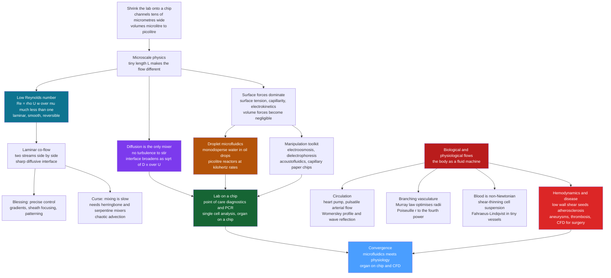

# 🔬 Microfluidics and Biological Flows

> [!abstract] TL;DR
> **Microfluidics** is the science and technology of handling microlitre-to-picolitre volumes of fluid in channels tens of micrometres wide — a whole **lab-on-a-chip**. Shrinking the plumbing flips the physics: the **Reynolds number** $\mathrm{Re}=\rho U w/\mu$ falls to $\sim10^{-3}$, so flow is perfectly **laminar** (smooth, predictable, reversible — see [[Low_Reynolds_Number_Flow]]); **surface and interfacial forces** dominate over volume forces; and **diffusion becomes the only mixer**, spreading a razor-sharp interface as $\sqrt{Dx/U}$ so blending is *slow* and must be forced by clever herringbone or serpentine **micromixers**. This regime powers point-of-care diagnostics, PCR chips, single-cell analysis, DNA sequencing, droplet reactors, and organ-on-a-chip. The same fluid physics runs your body: the heart drives **pulsatile blood flow** — a shear-thinning suspension of deformable red cells — through a **branching vasculature** optimised by **Murray's law** and governed by Poiseuille's ferocious $r^4$ resistance, where **hemodynamics** (wall shear stress) decides where atherosclerosis, aneurysms, and thrombi form, and CFD now guides surgery and device design.

---

## Intuition

**Analogy:** Imagine shrinking an entire chemistry lab — beakers, pipettes, mixing flasks — onto a chip the size of a postage stamp, threaded with channels thinner than a human hair. At this scale fluids stop behaving the way pouring and stirring taught you. Send two coloured streams down a shared channel and they refuse to mix: there is no turbulence to churn them, so they flow side by side as smooth parallel ribbons and meet only along a **razor-sharp boundary**, blending inch by inch through the patient crawl of **molecular diffusion**. That reluctance to mix is a gift — you get exquisitely precise, tiny, controllable reactions — and a curse — you must engineer the mixing back in.

Meanwhile, your own body is a masterpiece of fluid engineering. The heart is a pump that pushes **blood** — a strange living fluid, nearly half made of cells — through a branching network that steps down from the fist-sized aorta to capillaries *thinner than the red cells squeezing single-file through them*. The master dial in both worlds is the same: the balance between a fluid's **inertia** (its urge to keep moving and splash) and its **viscosity** (its internal stickiness). On a chip, viscosity wins utterly; in the aorta, inertia and pulsation matter; and reading that balance correctly is the whole game.

---

## How It Works

### Core Mechanics

1. **Why small is different.** Take the [[Dimensional_Analysis_and_Similarity|Reynolds number]] $\mathrm{Re}=\rho U L/\mu$. Shrink the length $L$ from metres to tens of micrometres and, at ordinary speeds, $\mathrm{Re}$ collapses from thousands to $\sim10^{-3}$. Three consequences follow immediately, and they define microfluidics: flow becomes **laminar and reversible**, **surface forces dominate volume forces**, and **diffusion becomes an effective — if slow — mixer**.

2. **Laminar, low-Reynolds flow.** At $\mathrm{Re}\ll1$ the nonlinear inertial term of the [[The_Navier_Stokes_Equations|Navier-Stokes equations]] is negligible and what survives is the **linear, time-reversible Stokes flow** treated in [[Low_Reynolds_Number_Flow]]. Streams are smooth, predictable, and repeatable; there is no turbulent chaos. Pressure-driven flow in a channel takes the parabolic **Poiseuille** profile of [[Laminar_Flow_and_Exact_Solutions]], and mixing by stirring is simply unavailable.

3. **Surface and interfacial forces dominate.** Forces that scale with **area** (surface tension, capillarity, electrostatics) shrink more slowly than forces that scale with **volume** (gravity, inertia). As $L\to0$ the area-to-volume ratio explodes, so **capillary rise**, **electrokinetics**, and **interfacial tension** become the governing physics — the reason paper wicks reagents on its own and why droplets are so easy to make and hold.

4. **The mixing problem — a blessing and a curse.** Because two co-flowing streams meet only by transverse molecular diffusion, the interface broadens as $\delta\sim\sqrt{Dx/U}$ with downstream distance $x$. Full mixing across a channel of width $w$ needs a length $L_\text{mix}\sim U w^2/D$ — often *centimetres* of channel. The **blessing**: laminar co-flow gives clean concentration gradients, hydrodynamic focusing (sheath flows), and precise laminar patterning. The **curse**: you must engineer mixing back in with **passive micromixers** (staggered herringbone ridges, serpentine channels that create *chaotic advection* — stretching and folding the interface) or **active** ones (acoustic, electrokinetic, magnetic stirring).

5. **Droplet microfluidics.** Exploiting interfacial physics, a flow-focusing or T-junction geometry pinches an aqueous stream into **monodisperse water-in-oil droplets** at kilohertz rates. Each droplet is an isolated picolitre reactor or compartment — perfect for single-cell encapsulation, digital PCR, directed-evolution screens, and barcoded sequencing. This droplet world is a whole subfield built on the multiphase and free-surface physics developed in the companion sibling *Multiphase_and_Free_Surface_Flows*.

6. **The manipulation toolkit.** Fluids and particles are driven and sorted on-chip by **pressure-driven flow**, **electroosmosis** and **electrophoresis** (electrokinetic pumping and separation), **dielectrophoresis** (polarising and steering cells in field gradients), **acoustofluidics** (standing-wave acoustic tweezers), and **capillary/paper** wicking. Integrated micro-valves and pumps (for example Quake-style elastomer valves) turn a chip into a programmable fluidic circuit.

7. **The body as a fluid machine.** In the **circulatory system**, the heart is a pulsatile pump; large-artery flow is not steady Poiseuille but **pulsatile**, characterised by the **Womersley number** $\alpha=r\sqrt{\omega\rho/\mu}$ that measures how much the beat's unsteadiness blunts and phase-lags the velocity profile. Elastic arteries act as a **Windkessel** (pressure reservoir) smoothing the pulse, and **wave reflections** shape the arterial pulse you feel at your wrist.

8. **An optimised branching tree.** From aorta to capillary the vasculature branches through many generations. **Murray's law** — $r_\text{parent}^3=r_{d1}^3+r_{d2}^3$ — is the design rule that minimises the combined cost of pumping power and the metabolic upkeep of blood volume; it makes flow scale as $Q\propto r^3$ and keeps **wall shear stress roughly constant** throughout the healthy tree. Poiseuille's $r^4$ resistance means the tiny arterioles are the body's flow valves.

9. **Blood is a complex fluid.** Blood is a $\sim45\%$ suspension of deformable red cells, so it is **shear-thinning** (viscosity drops as cells align and deform at higher shear) — a non-Newtonian rheology detailed in [[Non_Newtonian_and_Complex_Fluids]]. In vessels below $\sim300\,\mu\text{m}$ the **Fåhraeus-Lindqvist effect** lowers apparent viscosity as cells migrate to the centre and leave a cell-free plasma layer at the wall; in capillaries, cells fold and squeeze through single file.

10. **Hemodynamics and disease.** The medical stakes are enormous. **Low and oscillatory wall shear stress** at arterial bends and bifurcations seeds **atherosclerotic plaque**; disturbed flow drives **aneurysm** growth and rupture and promotes **thrombosis**. Engineers now run patient-specific **computational fluid dynamics** — the domain of the sibling *Computational_Fluid_Dynamics* — to plan surgery and design stents, grafts, and heart valves. Microfluidics and physiology converge in **organ-on-a-chip** devices and wearable diagnostics, closing the loop between the chip and the body.

### Flow / Architecture



---

## Key Concepts

### Secondary (intuitive)
- **A lab on a postage stamp.** Microfluidics moves droplets and streams through hair-thin channels to run whole experiments — a blood test, a DNA copy — on a chip you can hold on a fingertip.
- **Streams that refuse to mix.** At this size there is no turbulence, so two fluids flow side by side and blend only slowly, by drifting molecules crossing the boundary. Great for precision, annoying when you actually want them stirred.
- **Small worlds are sticky and surface-ruled.** Water clings, wicks, and beads into droplets because surface forces beat gravity when everything is tiny.
- **Your body is a plumbing marvel.** The heart pumps blood through branching pipes that shrink from garden-hose to hair-thin, and blood itself is a crowd of squishy cells, not plain water.
- **Radius rules blood flow.** A small narrowing of a vessel chokes the flow dramatically — which is why blocked arteries are so dangerous.

### Undergraduate (quantitative)
- **Channel Reynolds number** $\mathrm{Re}=\rho U w/\mu$. For $U\sim1\,\text{mm/s}$, $w\sim100\,\mu\text{m}$ in water, $\mathrm{Re}\sim0.1$ — deep in the laminar Stokes regime.
- **Diffusive mixing length.** Two co-flowing streams broaden their interface as $\delta(x)\approx\sqrt{2D\,x/U}$; complete mixing across width $w$ needs $L_\text{mix}\sim Uw^2/D$. The controlling ratio is the **Péclet number** $\mathrm{Pe}=Uw/D=L_\text{mix}/w$ — large $\mathrm{Pe}$ means slow mixing.
- **Hagen-Poiseuille law** $Q=\dfrac{\pi r^4\,\Delta P}{8\mu L}$, resistance $R_\text{flow}=8\mu L/(\pi r^4)\propto r^{-4}$; a $20\%$ radius drop cuts flow to $0.8^4\approx41\%$.
- **Murray's law.** Minimising pumping-plus-metabolic cost gives $Q\propto r^3$, hence $r_\text{parent}^3=\sum_i r_{d,i}^3$; a symmetric split gives daughters of radius $r_p/2^{1/3}\approx0.794\,r_p$, and **wall shear stress** $\tau=4\mu Q/(\pi r^3)$ stays constant.
- **Womersley number** $\alpha=r\sqrt{\omega\rho/\mu}$ measures pulsatility: $\alpha\ll1$ gives a quasi-steady parabola, $\alpha\gtrsim10$ (as in the aorta) gives a blunt, phase-lagged profile.

### Graduate (advanced)
- **Electrokinetics.** Electroosmotic flow above the electric double layer follows the **Helmholtz-Smoluchowski** slip velocity $u_\text{eo}=-\varepsilon\zeta E/\mu$, giving a near plug-flow profile — prized in capillary electrophoresis because it avoids the dispersion of parabolic pressure-driven flow.
- **Taylor-Aris dispersion.** In pressure-driven flow, the coupling of the parabolic profile to transverse diffusion yields an effective axial dispersion $D_\text{eff}=D(1+\mathrm{Pe}^2/48)$ for a tube — a key limit on separation resolution and band broadening.
- **Chaotic advection mixers.** Passive mixers (staggered herringbone, split-and-recombine) generate transverse Lagrangian chaos that stretches interfaces exponentially, cutting mixing length from $\sim\mathrm{Pe}\cdot w$ to $\sim\log(\mathrm{Pe})\cdot w$ despite $\mathrm{Re}\ll1$.
- **Blood rheology models.** Shear-thinning is captured by **Carreau-Yasuda** or **Casson** constitutive laws; the Fåhraeus and Fåhraeus-Lindqvist effects require two-phase or suspension modelling with a cell-free wall layer and deformable-capsule mechanics.
- **Pulsatile and FSI hemodynamics.** Arterial flow is a **fluid-structure interaction** problem: the **Womersley** solution (Bessel functions of complex argument) for a rigid tube must be coupled to compliant, viscoelastic walls; wall-shear-stress metrics (time-averaged WSS, oscillatory shear index) from patient-specific CFD localise atherogenesis and aneurysm risk.

---

## Python Demo

```python
# Microscale and physiological flow physics, in four panels:
#   (a) DIFFUSION-ONLY MIXING -- concentration profiles c(y) at increasing
#       downstream distance x for two co-flowing streams in a microchannel.
#       At low Re there is NO turbulence, so the sharp interface broadens only
#       by transverse molecular diffusion, as delta ~ sqrt(D x / U).
#   (b) the same co-flow as a 2D concentration MAP down the channel -- the
#       razor-sharp interface diffusing outward, showing why mixing is slow.
#   (c) BLOOD is NON-NEWTONIAN -- Carreau-Yasuda shear-thinning apparent
#       viscosity vs shear rate, contrasted with a Newtonian fluid.
#   (d) MURRAY'S LAW -- the pumping-plus-metabolic cost of a vessel is
#       minimised when Q ~ r^3, the rule that sets the branching vasculature.
import numpy as np
import matplotlib.pyplot as plt
from math import erfc                    # standard-library error function
erfc_vec = np.vectorize(erfc)            # vectorised, no SciPy needed

# ---------------------------------------------------------------------------
# (a) & (b)  LAMINAR CO-FLOW: two streams meet, mixing ONLY by diffusion
# ---------------------------------------------------------------------------
D   = 1.0e-10        # small-molecule diffusivity in water [m^2/s]
U   = 1.0e-3         # mean flow speed  1 mm/s
w   = 100e-6         # channel width  100 micrometre
rho = 1000.0         # water density  [kg/m^3]
mu  = 1.0e-3         # water viscosity [Pa.s]

Re    = rho * U * w / mu          # channel Reynolds number
Pe    = U * w / D                 # Peclet number (advection / diffusion)
L_mix = U * w**2 / D              # channel length needed for full mixing
print(f"Channel Reynolds number Re = {Re:.3g}   -> laminar, no turbulence")
print(f"Peclet number           Pe = {Pe:.3g}")
print(f"Mixing length  L_mix ~ U w^2 / D = {L_mix*100:.1f} cm "
      f"(need this much channel to blend by diffusion alone!)")

# concentration field: stream at y<0 has c=1, stream at y>0 has c=0
# analytic solution c(y,x) = 0.5 * erfc( y / (2 sqrt(D x / U)) )
y = np.linspace(-w/2, w/2, 400)
x_lines = np.array([1, 5, 10, 25, 50]) * 1e-3          # 1..50 mm downstream
def c_profile(yv, xv):
    sigma = np.sqrt(2.0 * D * xv / U)                  # interface half-width
    return 0.5 * erfc_vec(yv / (np.sqrt(2.0) * sigma))

# 2D map
xg = np.linspace(0.2e-3, 50e-3, 300)
Yg, Xg = np.meshgrid(y, xg)                            # note: rows=x, cols=y
Cmap = 0.5 * erfc_vec(Yg / (np.sqrt(2.0 * 2.0 * D * Xg / U)))

# ---------------------------------------------------------------------------
# (c)  BLOOD SHEAR-THINNING  (Carreau-Yasuda apparent viscosity)
#      mu(g) = mu_inf + (mu_0 - mu_inf) [1 + (lam*g)^a]^((n-1)/a)
# ---------------------------------------------------------------------------
mu0, mu_inf = 0.056, 0.0035     # low- and high-shear blood viscosity [Pa.s]
lam, n, a   = 3.313, 0.3568, 2.0
gdot   = np.logspace(-1, 3, 300)                        # shear rate [1/s]
mu_app = mu_inf + (mu0 - mu_inf) * (1 + (lam*gdot)**a)**((n-1)/a)
print(f"\nBlood apparent viscosity: {mu0*1e3:.1f} mPa.s at rest "
      f"-> {mu_inf*1e3:.1f} mPa.s at high shear "
      f"({mu0/mu_inf:.0f}x thinner as it flows fast).")

# ---------------------------------------------------------------------------
# (d)  MURRAY'S LAW: minimise pumping power + metabolic cost of blood volume
#      cost(r) = 8 mu L Q^2 / (pi r^4)  +  k * pi r^2 L   ->  optimum Q ~ r^3
# ---------------------------------------------------------------------------
mu_b, L, Q, k = 3.5e-3, 1.0e-3, 1.0e-9, 50.0            # blood, vessel, flow, cost
r_star = (16.0 * mu_b * Q**2 / (k * np.pi**2))**(1.0/6.0)   # analytic optimum
r      = np.linspace(0.4*r_star, 2.2*r_star, 400)
pump   = 8.0 * mu_b * L * Q**2 / (np.pi * r**4)         # viscous pumping power
metab  = k * np.pi * r**2 * L                           # metabolic upkeep
cost   = pump + metab
r_opt  = r[np.argmin(cost)]
print(f"\nMurray's law optimum radius r* = {r_star*1e6:.0f} um "
      f"(numeric min at {r_opt*1e6:.0f} um).")
print(f"Symmetric daughter/parent radius ratio = {2**(-1/3):.3f} "
      f"(so r_parent^3 = r_d1^3 + r_d2^3).")

# ---------------------------------------------------------------------------
# Plots
# ---------------------------------------------------------------------------
fig, ax = plt.subplots(2, 2, figsize=(14, 11))

# (a) concentration profiles broadening downstream
for xv in x_lines:
    ax[0, 0].plot(y*1e6, c_profile(y, xv), lw=2, label=f"x = {xv*1e3:.0f} mm")
ax[0, 0].set_xlabel("across-channel position  y  [micrometre]")
ax[0, 0].set_ylabel("concentration  c")
ax[0, 0].set_title("(a) Diffusion-only mixing of two co-flowing streams\n"
                   "sharp interface broadens as sqrt(D x / U)")
ax[0, 0].legend(fontsize=8); ax[0, 0].grid(alpha=0.3)

# (b) 2D concentration map down the channel
pcm = ax[0, 1].pcolormesh(xg*1e3, y*1e6, Cmap.T, cmap="coolwarm", shading="auto")
ax[0, 1].set_xlabel("distance down channel  x  [mm]")
ax[0, 1].set_ylabel("across-channel  y  [micrometre]")
ax[0, 1].set_title("(b) Laminar co-flow: the interface diffuses slowly\n"
                   "no turbulence -> mixing takes centimetres")
fig.colorbar(pcm, ax=ax[0, 1], label="concentration c")

# (c) blood shear-thinning
ax[1, 0].loglog(gdot, mu_app*1e3, color="#b91c1c", lw=2.5,
                label="blood (Carreau-Yasuda)")
ax[1, 0].axhline(mu_inf*1e3, color="#0e7490", ls="--", lw=1.5,
                 label="high-shear limit")
ax[1, 0].axhline(1.0, color="gray", ls=":", lw=1.5, label="water (Newtonian)")
ax[1, 0].set_xlabel("shear rate  [1/s]")
ax[1, 0].set_ylabel("apparent viscosity  [mPa.s]")
ax[1, 0].set_title("(c) Blood is shear-thinning\n"
                   "viscosity drops as cells align and deform")
ax[1, 0].legend(fontsize=8); ax[1, 0].grid(alpha=0.3, which="both")

# (d) Murray's law cost minimisation
ax[1, 1].plot(r*1e6, cost/cost.min(), color="#7c3aed", lw=2.5, label="total cost")
ax[1, 1].plot(r*1e6, pump/cost.min(), color="#dc2626", lw=1.6, ls="--",
              label="pumping power ~ 1/r^4")
ax[1, 1].plot(r*1e6, metab/cost.min(), color="#166534", lw=1.6, ls="--",
              label="metabolic cost ~ r^2")
ax[1, 1].axvline(r_star*1e6, color="k", ls=":", lw=1.5)
ax[1, 1].annotate("Murray optimum\nQ proportional to r^3",
                  xy=(r_star*1e6, 1.0), xytext=(r_star*1e6*1.15, 2.4),
                  arrowprops=dict(arrowstyle="->"), fontsize=9)
ax[1, 1].set_ylim(0, 5)
ax[1, 1].set_xlabel("vessel radius  r  [micrometre]")
ax[1, 1].set_ylabel("cost  (normalised)")
ax[1, 1].set_title("(d) Murray's law: optimal vessel radius\n"
                   "balances pumping against blood-volume upkeep")
ax[1, 1].legend(fontsize=8); ax[1, 1].grid(alpha=0.3)

plt.tight_layout()
plt.show()
```

**What you should see.** Panel (a) prints $\mathrm{Re}\approx0.1$ (laminar) and a mixing length of order **10 cm** — the punchline of microfluidics: with no turbulence, blending two streams by diffusion alone needs an absurdly long channel, which is exactly why engineers invent herringbone and serpentine micromixers. The profiles show the initially step-sharp interface smearing out only gradually with downstream distance, spreading as $\sqrt{Dx/U}$. Panel (b) renders the same co-flow as a 2D map: a knife-edge boundary at the inlet that diffuses lazily outward. Panel (c) shows blood's non-Newtonian character — apparent viscosity falling roughly $16\times$ from its resting value as shear rate climbs, unlike the flat line of Newtonian water. Panel (d) is Murray's law as an optimisation: the $1/r^4$ pumping cost and the $r^2$ metabolic cost trade off at a minimum where $Q\propto r^3$, the rule that shapes the entire vascular tree and keeps wall shear stress constant.

---

## Real-World Applications

> **Example — point-of-care diagnostics on a chip.** A modern lab-on-a-chip can run a blood test from a finger-prick droplet: on-chip channels split the sample, meter reagents by laminar co-flow, and read out an assay optically — no benchtop lab required. The paradigmatic mass-market device is the **lateral-flow rapid test** (pregnancy, COVID-19 antigen), pure capillary/paper microfluidics where surface tension wicks the sample across a nitrocellulose strip through antibody lines. The same physics — dominant surface forces, laminar flow, diffusion-limited binding — underlies the whole point-of-care revolution.

- **Droplet microfluidics and single-cell sequencing.** Platforms like 10x Genomics Chromium and Drop-seq encapsulate single cells with barcoded beads in picolitre water-in-oil droplets at kilohertz rates — each drop an isolated reaction vessel — enabling single-cell RNA sequencing at massive scale.
- **PCR and DNA chips.** On-chip thermal cyclers and digital PCR partition a sample into thousands of nanolitre wells or droplets for absolute nucleic-acid quantification; see [[PCR_and_DNA_Sequencing]] for the underlying amplification chemistry.
- **Organ-on-a-chip.** Microchannels lined with living cells and perfused with culture medium recreate the mechanical and fluidic microenvironment of lung, gut, liver, or blood-brain barrier — Emulate's lung-on-a-chip reproduces breathing-motion strain and is used for drug toxicity screening in place of some animal tests.
- **Cell and particle sorting.** Deterministic lateral displacement, dielectrophoresis, and acoustofluidic separation isolate circulating tumour cells, sort sperm, or purify cell populations by size and mechanical properties on-chip.
- **Cardiovascular surgery and device design.** Patient-specific CFD of pulsatile blood flow (for example the HeartFlow FFRct analysis of coronary arteries) computes fractional flow reserve non-invasively and guides stent, graft, and heart-valve design where **hemodynamics** predicts atherosclerosis and aneurysm risk — see [[Fluid_Dynamics_in_Biology]].
- **Inkjet printing and lab automation.** The same droplet-on-demand physics prints picolitre ink drops and dispenses reagents in high-throughput screening robots.

---

## Common Pitfalls

- **Expecting turbulent mixing on a chip.** At $\mathrm{Re}\sim10^{-3}$ there is no turbulence; two streams do *not* blend by stirring, only by slow diffusion. Devices designed as if reagents will "just mix" never actually mix — you must add a herringbone, serpentine, or active micromixer.
- **Ignoring the Péclet penalty.** Mixing length grows linearly with $\mathrm{Pe}=Uw/D$. Speeding up the flow to boost throughput *lengthens* the channel needed to mix, a counter-intuitive trap; chaotic-advection mixers break the scaling to $\log\mathrm{Pe}$.
- **Treating blood as water.** Blood is shear-thinning and cell-laden; in vessels below $\sim300\,\mu\text{m}$ its apparent viscosity *falls* (Fåhraeus-Lindqvist). A fixed water-like viscosity in Poiseuille mis-estimates resistance, badly in the microcirculation — use a [[Non_Newtonian_and_Complex_Fluids|non-Newtonian model]].
- **Forgetting the fourth power.** Because $Q\propto r^4$, a "small" $15$–$20\%$ stenosis is a major flow reduction. Reasoning linearly about a narrowed artery drastically underrates its severity.
- **Assuming steady Poiseuille in large arteries.** Aortic flow is pulsatile with a high Womersley number: the profile is blunt and phase-lagged, not the steady parabola. Static Poiseuille is fine for capillaries, wrong for the aorta.
- **Neglecting surface tension and bubbles at the microscale.** With surface forces dominant, a trapped air bubble can block a channel, wetting can drive spontaneous flow you did not intend, and evaporation from tiny volumes concentrates your sample. Microfabrication material and surface chemistry (hydrophilic vs hydrophobic) matter as much as the geometry.
- **Over-trusting CFD without validation.** Patient-specific hemodynamic CFD is only as good as its boundary conditions, wall-compliance model, and rheology; unvalidated wall-shear-stress numbers can mislead surgical planning.

---

## Related Concepts

- [[Low_Reynolds_Number_Flow]] — the parent regime: laminar, reversible Stokes flow is why microfluidic streams never turbulently mix and why microswimmers face the scallop theorem.
- [[Laminar_Flow_and_Exact_Solutions]] — the Poiseuille and Couette profiles that describe pressure-driven flow in both microchannels and blood vessels.
- [[Non_Newtonian_and_Complex_Fluids]] — blood's shear-thinning, cell-laden rheology and the constitutive models used to capture it.
- [[The_Navier_Stokes_Equations]] — the governing equations whose $\mathrm{Re}\to0$ limit yields the linear Stokes flow of the microscale.
- [[Dimensional_Analysis_and_Similarity]] — the Reynolds and Péclet numbers that decide the flow and mixing regimes on a chip.
- [[Viscosity_and_Stress_in_Fluids]] — where the viscosity that sets Poiseuille resistance and Stokes drag comes from.
- [[Mixing_Dispersion_and_Turbulent_Transport]] — the macroscale counterpart; contrast turbulent mixing with the diffusion-and-chaotic-advection mixing of microfluidics and Taylor-Aris dispersion.
- [[Fluid_Dynamics_in_Biology]] — the biophysics companion on life at low $\mathrm{Re}$, microswimmers, and hemodynamics across twelve decades of Reynolds number.
- [[Diffusion_and_Brownian_Motion_in_Cells]] — the transport process that does all the mixing when flow is laminar; the Péclet number weighs it against advection.
- [[The_Circulatory_and_Respiratory_Systems]] — the biology of the heart pump, vascular tree, and lungs that these physiological flows describe.
- [[Cell_Motility_and_Adhesion]] — how cells move, deform, and adhere in the viscosity-dominated microworld a chip recreates.
- [[PCR_and_DNA_Sequencing]] — the amplification and sequencing chemistry that PCR chips and droplet devices miniaturise.
- [[Nanofabrication_and_Self_Assembly]] — the soft-lithography and etching techniques used to make microfluidic chips.
- [[Nano_Electronics_and_MEMS_NEMS]] — the MEMS toolkit (micro-valves, pumps, sensors) integrated into lab-on-a-chip systems.
- [[Nanoparticles_and_Colloidal_Systems]] — colloids and beads manipulated and sorted on-chip, whose low-$\mathrm{Re}$ interactions govern their behaviour.
- [[Nanomedicine_and_Drug_Delivery_Systems]] — droplet reactors and organ-on-chip screens feed drug-delivery and nanomedicine development.
- [[Viscous_Fluids_and_Navier_Stokes]] — the physics-side treatment of viscosity, Poiseuille flow, and the Reynolds number.

---

## Review Questions

1. **(Secondary / conceptual)** On a microfluidic chip, why do two coloured streams flowing down the same channel refuse to mix and instead meet at a sharp line? Explain, without equations, why this is simultaneously useful and a design headache, and name one trick engineers use to force mixing.
2. **(Undergraduate / scenario)** A microchannel is $w=100\,\mu\text{m}$ wide with mean flow $U=1\,\text{mm/s}$; a dye has diffusivity $D=10^{-10}\,\text{m}^2/\text{s}$ in water. Estimate the Reynolds number, the Péclet number, and the channel length needed to fully mix the dye across the width by diffusion alone. If you double the flow speed to raise throughput, what happens to the required mixing length, and why is that counter-intuitive?
3. **(Graduate / trade-off)** A surgeon wants to predict where atherosclerotic plaque will form in a patient's carotid bifurcation using CFD. Explain why steady Poiseuille flow is inadequate (invoke the Womersley number and wall shear stress), what rheological model you would use for blood and why, and how Murray's law provides a baseline expectation for the healthy branch radii and shear stress against which diseased geometry is compared. What are the main sources of error that could invalidate the prediction?

---

## Sources

- George M. Whitesides, "The origins and the future of microfluidics," *Nature* **442**, 368–373 (2006).
- Todd M. Squires & Stephen R. Quake, "Microfluidics: Fluid physics at the nanoliter scale," *Reviews of Modern Physics* **77**, 977–1026 (2005).
- Abraham D. Stroock et al., "Chaotic Mixer for Microchannels," *Science* **295**, 647–651 (2002).
- Y. C. Fung, *Biomechanics: Circulation*, 2nd ed., Springer (1997).
- Cecil D. Murray, "The Physiological Principle of Minimum Work," *Proceedings of the National Academy of Sciences* **12**, 207–214 (1926).
- Steven Vogel, *Life in Moving Fluids: The Physical Biology of Flow*, 2nd ed., Princeton University Press (1994).

---

#fluid-dynamics #microfluidics #lab-on-a-chip #blood-flow #biological-flows
