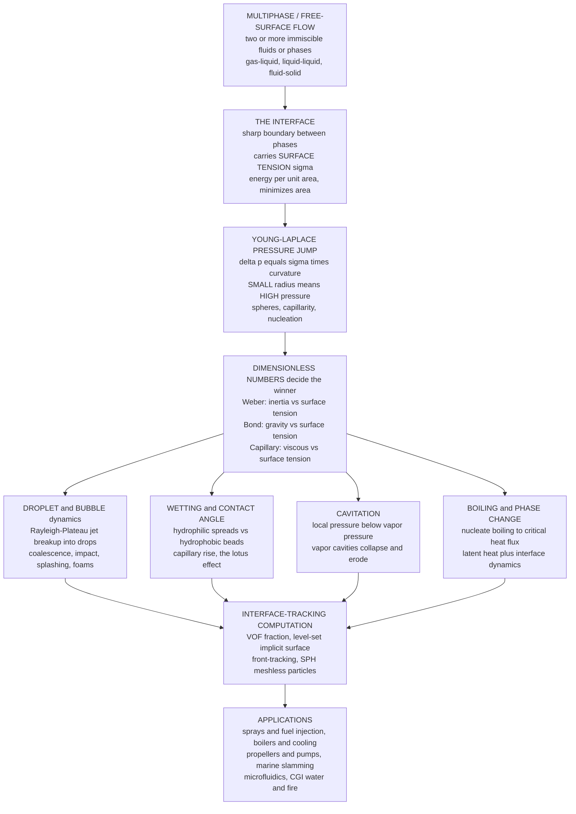

# 🫧 Multiphase and Free-Surface Flows

> [!abstract] TL;DR
> A breaking wave, a boiling pot, a splashing raindrop, and the bubbles in a glass of champagne all hide the same hard problem: the **interface** — the ever-shifting boundary between two immiscible fluids or phases (water and air, oil and water, liquid and vapor). That boundary carries **surface tension** $\sigma$, an energy-per-area that pulls interfaces into minimal-area shapes and imposes the **Young-Laplace pressure jump** $\Delta p = \sigma\,(1/R_1 + 1/R_2)$ across every curved surface — so **small bubbles hold higher pressure than large ones**. Whether inertia, gravity, or viscosity can overcome surface tension is decided by the **Weber, Bond, and capillary numbers**, and the resulting zoo includes droplet breakup (the **Rayleigh-Plateau instability** behind sprays and inkjets), bubbles and foams, **wetting** (the lotus effect), **cavitation** (vapor cavities that collapse and erode propellers), and **boiling** (with its heat-transfer crisis). Numerically tracking a violently deforming, topology-changing interface — via **VOF**, **level-set**, or **SPH** — is one of computational fluid dynamics' grand challenges and underpins both industrial multiphase CFD and the stunning water and fire of modern computer graphics.

## Intuition — analogy FIRST

Watch a single raindrop hit a puddle in slow motion. It flattens into a sheet, throws up a crown of tiny spikes, each spike pinches off into a bead, and a rebound jet leaps back up and beads off again — a whole cascade of shapes born and destroyed in milliseconds. Now watch bubbles stream up a champagne flute: they nucleate on a scratch, swell, detach, and pop at the top into a lace of foam. Or watch spray tear off the crest of a breaking wave, or steam bubbles churn in a rolling boil. These everyday sights are among the *hardest* problems in all of fluid dynamics.

The reason is always the same: the **interface**. In an ordinary single-phase flow you solve for velocity and pressure in a fixed region. In a multiphase flow you also have to answer a brutal question at every instant — **where exactly is the surface?** — when that surface is stretching, tearing, merging, and splitting into a thousand pieces. A droplet that shatters has no single well-defined boundary for more than a moment. Holding these violently deforming boundaries together is a thin invisible skin called **surface tension**, and reading the flow means asking, over and over, whether that skin is strong enough to win against the push of inertia, the pull of gravity, or the drag of viscosity.

This note opens the *Computation and Applications* arc of the *Fluid_Dynamics* vault. It builds on the surface-tension property introduced in [[The_Continuum_Hypothesis_and_Fluid_Properties]], borrows the growth-rate machinery of [[Hydrodynamic_Instabilities]], and uses the dimensionless-group thinking of [[Dimensional_Analysis_and_Similarity]]. It also foreshadows forthcoming siblings referenced here in prose — *Computational_Fluid_Dynamics* (the numerical backbone), *Surface_and_Internal_Waves* (the free surface as a wave-bearing medium), *Non_Newtonian_and_Complex_Fluids* (suspensions, emulsions, and slurries as fluid-solid multiphase systems), and *Microfluidics_and_Biological_Flows* (droplet microfluidics, where surface tension rules).

---

## How It Works

### The interface and surface tension

A molecule deep inside a liquid is pulled equally in all directions by its neighbors. A molecule *at the surface* is missing neighbors on the vapor side, so it feels a net inward pull. Creating new interface therefore *costs energy*, and the energy per unit area is the **surface tension** $\sigma$ (units $\text{N/m} = \text{J/m}^2$; water against air $\sigma \approx 0.072\ \text{N/m}$). Because the interface behaves like a stretched elastic skin, a fluid left to itself **minimizes interfacial area** — which is why free droplets and bubbles are spheres (the minimum-area shape enclosing a given volume).

### The Young-Laplace equation — the fundamental interface law

A curved interface must support a **pressure difference** between the two sides. Balancing the surface-tension pull around a curved patch gives the **Young-Laplace equation**:

$$\Delta p = p_{\text{in}} - p_{\text{out}} = \sigma\left(\frac{1}{R_1} + \frac{1}{R_2}\right) = \sigma\,\kappa$$

where $R_1, R_2$ are the two principal radii of curvature and $\kappa$ is the total curvature. For a **sphere** of radius $R$ (a droplet, or a bubble with one interface) both radii equal $R$, so $\Delta p = 2\sigma/R$; for a **soap bubble** with two interfaces (inner and outer) the jump doubles to $\Delta p = 4\sigma/R$. The crucial consequence: **smaller radius means larger pressure jump**. A tiny bubble has *higher* internal pressure than a big one, so given a chance the small ones dissolve or coalesce into large ones (Ostwald ripening), and forming a brand-new tiny bubble against that pressure barrier is exactly why **nucleation** needs sites, superheat, or dissolved gas. The same law explains why droplets are spherical and drives all of **capillarity**.

### Wetting and contact angles — the three-phase line

Bring a liquid, a gas, and a *solid* together and the liquid either spreads or beads. The equilibrium **contact angle** $\theta$ at the three-phase contact line follows **Young's relation**:

$$\cos\theta = \frac{\sigma_{sg} - \sigma_{sl}}{\sigma_{lg}}$$

balancing the solid-gas, solid-liquid, and liquid-gas tensions. Small $\theta$ means **wetting / hydrophilic** (water spreads and climbs — capillary *rise*); large $\theta$ means **non-wetting / hydrophobic** (water beads; mercury in glass shows capillary *depression*). Micro-textured surfaces that trap air push $\theta$ above $150^\circ$ into **superhydrophobicity** — the self-cleaning **lotus effect**.

### The dimensionless numbers — which effect wins

Surface tension competes with inertia, gravity, and viscosity. Four ratios tell you the winner:

$$We = \frac{\rho U^2 L}{\sigma}\ (\text{inertia vs surface tension}),\qquad Bo = \frac{\rho g L^2}{\sigma}\ (\text{gravity vs surface tension})$$

$$Ca = \frac{\mu U}{\sigma}\ (\text{viscous vs surface tension}),\qquad Oh = \frac{\mu}{\sqrt{\rho\sigma L}} = \frac{\sqrt{We}}{Re}\ (\text{viscous vs inertia and surface tension})$$

High **Weber** means inertia shreds a drop apart (atomization); the **Bond** (Eötvös) number decides whether a puddle beads up ($Bo < 1$, below the **capillary length** $\ell_c = \sqrt{\sigma/\rho g} \approx 2.7\ \text{mm}$ for water) or spreads under gravity ($Bo > 1$); the **capillary** number governs coating and displacement; the **Ohnesorge** number sets whether a breaking jet makes clean or satellite-laden drops.

### Droplets, bubbles, cavitation, and boiling

- **Droplet breakup** — a cylindrical liquid **jet** is unstable (the **Rayleigh-Plateau instability**): any perturbation whose wavelength exceeds the jet circumference lowers surface area by pinching the jet into drops. The fastest-growing mode fixes the drop size — the physics behind sprays, fuel atomization, and inkjet printing.
- **Bubbles and foams** — bubbles rise by buoyancy, oscillate, and pack into foams whose films drain and rupture; Young-Laplace sets the film pressures.
- **Cavitation** — where local pressure drops *below the vapor pressure* (fast flow over a propeller, pump, or hydrofoil, or under ultrasound), the liquid vaporizes into cavities that then **violently collapse**, producing shock waves, noise, light (sonoluminescence), and pitting **erosion** of metal surfaces.
- **Boiling and phase change** — liquid-vapor change with latent heat: **nucleate boiling** is an extraordinarily efficient heat-transfer mode, but push the heat flux past the **critical heat flux** and a vapor blanket forms (**film boiling** / the boiling crisis), heat transfer collapses, and surfaces burn out — a life-or-death constraint in power plants and electronics cooling.

### Interface-tracking computation — the grand challenge

How do you numerically follow a surface that stretches, tears, merges, and changes topology?

- **Volume-of-Fluid (VOF)** — store the *volume fraction* of one fluid in each cell ($0$ = gas, $1$ = liquid, in-between = interface); conserves mass exactly and handles merging/splitting, but the sharp interface must be *reconstructed* from the fractions.
- **Level-set** — represent the interface *implicitly* as the zero contour of a smooth signed-distance function $\phi$; gives accurate curvature (hence surface tension) and handles topology changes effortlessly, but needs re-initialization and can lose mass.
- **Front-tracking** — carry explicit marker points on the interface (very accurate, awkward at topology changes).
- **Smoothed-particle hydrodynamics (SPH)** — meshless particles that carry the fluid; superb for violent free surfaces (splashes, breaking waves) and the workhorse behind much CGI water and fire.

These methods, tied to the broader *Computational_Fluid_Dynamics* toolkit, power industrial multiphase CFD and film-quality fluid simulation alike.



---

## Key Concepts / Details

### Secondary Level

**The interface is the whole story.** A multiphase flow is any flow with two or more distinct fluids or phases that do not mix — air and water, oil and water, liquid and its vapor. The boundary between them is the **interface**, and almost all the interesting (and difficult) physics lives right there.

**Surface tension is a stretchy skin.** The surface of a liquid acts like an elastic membrane because surface molecules are pulled inward by their neighbors. This skin lets water striders walk on ponds, pulls raindrops into little spheres, and holds soap bubbles together. It always tries to make the surface **as small as possible** — and the smallest surface around a given volume is a sphere, which is why free drops and bubbles are round.

**Small bubbles squeeze harder.** A curved surface has higher pressure on its inside, and the *smaller* the bubble the *harder* it squeezes. That is the Young-Laplace idea, and it explains why tiny bubbles tend to shrink and disappear while big ones grow.

**Beading vs spreading.** Drop water on a freshly waxed car and it beads up; drop it on clean glass and it spreads out. Whether a liquid beads or spreads on a surface is set by the **contact angle** — the same effect that makes lotus leaves and rain jackets shed water (superhydrophobic surfaces).

**Cavitation and boiling.** Spin a boat propeller fast enough and the water can briefly boil at *room temperature* because the pressure drops so low — the bubbles then collapse and can chew holes in the metal. That is **cavitation**. Heat water on a stove and it **boils** — vapor bubbles nucleate, grow, and rise. Both are multiphase flows driven by turning liquid into vapor.

### Undergraduate Level

**Young-Laplace, quantitatively.** Across a curved interface the pressure jumps by $\Delta p = \sigma(1/R_1 + 1/R_2)$. For a spherical droplet or a single-surface bubble, $\Delta p = 2\sigma/R$; for a soap bubble (two surfaces), $\Delta p = 4\sigma/R$. Put in numbers for water ($\sigma = 0.072\ \text{N/m}$): a $1\ \text{mm}$ droplet holds only $\sim 144\ \text{Pa}$ of excess pressure, but a $1\ \mu\text{m}$ droplet holds $\sim 1.4\times10^{5}\ \text{Pa}$ — over an atmosphere. This steep $1/R$ dependence is why very small bubbles are so hard to nucleate and why they dissolve into larger ones.

**Capillary rise.** In a thin tube of radius $r$, a wetting liquid climbs to a height $h = 2\sigma\cos\theta / (\rho g r)$, balancing the Laplace suction of the curved meniscus against gravity. Narrower tubes pull the liquid higher — the mechanism behind wicking in paper, soil, and plant xylem.

**Reading a flow by its numbers.** The **capillary length** $\ell_c = \sqrt{\sigma/\rho g}$ ($\approx 2.7\ \text{mm}$ for water) is the length at which gravity and surface tension balance ($Bo = 1$). Below it, drops are nearly spherical and surface tension rules; above it, puddles flatten under gravity. For a *moving* drop or jet, the **Weber number** $We = \rho U^2 L/\sigma$ decides breakup: a falling raindrop stays intact at low $We$ but flattens and shatters once aerodynamic $We$ exceeds a critical value ($\sim 10\text{-}20$).

**Rayleigh-Plateau instability.** A liquid cylinder of radius $a$ is unstable to any axial perturbation whose **wavelength exceeds the circumference**, $\lambda > 2\pi a$ (i.e., dimensionless wavenumber $ka < 1$), because pinching then *reduces* total surface area. Rayleigh's inviscid analysis gives the fastest-growing mode at $ka \approx 0.697$, so $\lambda_{\max} \approx 9.0\,a$; conserving the volume of one wavelength into one drop yields a **drop radius $\approx 1.89\,a$** (drop diameter $\approx 1.9\times$ the jet diameter). This is why a smooth faucet stream breaks into evenly spaced drops and how inkjet nozzles meter picoliter droplets.

**Cavitation number.** Cavitation onset is governed by $\sigma_c = (p_\infty - p_v)/(\tfrac12\rho U^2)$: when the local pressure predicted by Bernoulli drops to the **vapor pressure** $p_v$, vapor cavities form. Their collapse concentrates energy into microjets and shock waves that pit propellers, pump impellers, and turbine blades.

### Graduate Level

**The full interfacial jump conditions.** At a fluid-fluid interface the stress balance couples both phases. The normal-stress jump is the Young-Laplace term plus viscous contributions, and the tangential balance introduces **Marangoni stress** when surface tension varies along the interface (from temperature or surfactant gradients): $[\![\boldsymbol{\tau}\cdot\mathbf{n}]\!] = \sigma\kappa\,\mathbf{n} - \nabla_s\sigma$. Marangoni flows drive the "tears of wine," thermocapillary convection, and surfactant-laden dynamics — and often *stabilize* or *rigidify* interfaces that a clean-interface model predicts wrong.

**Rayleigh-Plateau dispersion relation.** For an inviscid cylindrical jet the growth rate $\omega$ satisfies

$$\omega^2 = \frac{\sigma}{\rho a^3}\,(ka)\,\frac{I_1(ka)}{I_0(ka)}\,\bigl[1 - (ka)^2\bigr],$$

with $I_0, I_1$ modified Bessel functions. Growth ($\omega^2 > 0$) requires $ka < 1$; the maximum is at $ka \approx 0.697$. Viscosity (finite Ohnesorge number) shifts the fastest mode to *longer* wavelengths and slows growth, changing the drop size — the Ohnesorge number $Oh = \mu/\sqrt{\rho\sigma a}$ organizes the whole dripping-jetting-atomization map.

**Rayleigh-Plesset bubble dynamics.** A spherical cavitation/vapor bubble of radius $R(t)$ in a liquid obeys

$$R\ddot R + \tfrac32 \dot R^2 = \frac{1}{\rho}\left(p_B - p_\infty - \frac{2\sigma}{R} - \frac{4\mu\dot R}{R}\right),$$

capturing inertial collapse, the Laplace and viscous terms, and the near-singular velocities and pressures at collapse that drive erosion and sonoluminescence.

**Interface-capturing numerics.** **VOF** advects a color/fraction field $C$ and reconstructs the interface (PLIC — piecewise-linear); it conserves mass but computing accurate curvature (hence surface tension via the **Continuum Surface Force** model of Brackbill) is delicate and produces **spurious/parasitic currents**. **Level-set** carries a signed-distance $\phi$ with $|\nabla\phi| = 1$; curvature $\kappa = \nabla\cdot(\nabla\phi/|\nabla\phi|)$ is clean, but $\phi$ must be re-initialized and mass leaks. **Coupled Level-Set/VOF (CLSVOF)** marries the mass conservation of VOF to the smooth geometry of level-set. **SPH** and **front-tracking** offer meshless and explicit-marker alternatives. Getting surface tension, contact-line motion, and phase change all consistent at a moving interface remains an active research frontier.

**Contact-line singularity.** A moving contact line on a no-slip wall produces a *non-integrable stress singularity* in the classical continuum model — resolved only by slip models, precursor films, or diffuse-interface (Cahn-Hilliard phase-field) formulations. Dynamic contact angles depend on the capillary number ($\theta_d$ vs $\theta_e$ via Cox-Voinov), which matters for coating, printing, and imbibition.

---

## Python Demo

```python
# Interface physics of multiphase / free-surface flows, in four panels:
#   (a) YOUNG-LAPLACE law: pressure jump delta_p = 2*sigma/R across a curved
#       interface vs radius, for a droplet (one surface) and a soap bubble
#       (two surfaces). SMALL bubbles hold HIGHER pressure -> they dissolve
#       into big ones. The capillary length marks where gravity ties surface
#       tension (Bond number = 1).
#   (b) RAYLEIGH-PLATEAU instability: the inviscid growth rate of a perturbed
#       liquid jet vs wavenumber ka. Perturbations with wavelength > jet
#       circumference (ka < 1) GROW; the fastest-growing mode near ka = 0.697
#       sets the drop size.
#   (c) Illustration of the jet pinching into drops at the fastest mode.
#   (d) Resulting drop radius vs jet radius (volume conservation): drop
#       diameter is about 1.9x the jet diameter -- how inkjets meter droplets.
import numpy as np
import matplotlib.pyplot as plt
from math import factorial

# ---- physical constants (water against air, 20 C) --------------------------
sigma = 0.072      # surface tension [N/m]
rho   = 1000.0     # liquid density  [kg/m^3]
g     = 9.81       # gravity         [m/s^2]

# ============================================================================
# (a) YOUNG-LAPLACE:  delta_p = 2*sigma/R (droplet),  4*sigma/R (soap bubble)
# ============================================================================
R = np.logspace(-6, -2, 400)             # radius 1 micron -> 1 cm
dp_drop   = 2 * sigma / R                 # single interface
dp_bubble = 4 * sigma / R                 # two interfaces (soap film)
ell_c     = np.sqrt(sigma / (rho * g))    # capillary length ~ 2.7 mm (Bond=1)

# ============================================================================
# (b) RAYLEIGH-PLATEAU dispersion (inviscid, Rayleigh 1878):
#     omega^2 = (sigma/(rho a^3)) * (ka) * I1(ka)/I0(ka) * (1 - (ka)^2)
#     Dimensionless growth: sqrt( ka * I1/I0 * (1 - ka^2) ).
#     Modified Bessel functions I_n via their convergent series (numpy-only).
# ============================================================================
def besseli(n, x, terms=40):
    x = np.asarray(x, dtype=float)
    s = np.zeros_like(x)
    for m in range(terms):
        s += (x / 2.0) ** (2 * m + n) / (factorial(m) * factorial(m + n))
    return s

ka = np.linspace(1e-3, 1.5, 600)
ratio = besseli(1, ka) / besseli(0, ka)
growth2 = ka * ratio * (1.0 - ka ** 2)    # proportional to omega^2 (dimensionless)
growth = np.sqrt(np.clip(growth2, 0.0, None))
i_max = np.argmax(growth)
ka_max = ka[i_max]                        # fastest-growing mode ~ 0.697

# fastest-growing wavelength (in units of jet radius a) and resulting drop size
lam_over_a = 2 * np.pi / ka_max           # lambda_max / a  ~ 9.0
R_drop_over_a = (0.75 * lam_over_a) ** (1.0 / 3.0)   # volume: pi a^2 lambda = 4/3 pi R^3

# ============================================================================
# (c) jet-shape illustration at the fastest-growing mode (near pinch-off)
# ============================================================================
a = 1.0
eps = 0.85                                # perturbation amplitude (near breakup)
k = ka_max / a
z = np.linspace(0, 3 * lam_over_a * a, 600)
r_jet = a * (1 + eps * np.cos(k * z))     # modulated radius r(z)

# ============================================================================
# (d) drop radius vs jet radius (linear, slope = R_drop_over_a)
# ============================================================================
a_range = np.linspace(0.05e-3, 1.0e-3, 100)   # jet radius 0.05 -> 1 mm
R_drop  = R_drop_over_a * a_range

# ---------------------------------------------------------------------------
# PLOT
# ---------------------------------------------------------------------------
fig, ax = plt.subplots(2, 2, figsize=(13, 10))

# (a) Young-Laplace pressure jump
ax[0, 0].loglog(R * 1e3, dp_drop,   color="#1f5fa8", lw=2, label="droplet  2 sigma / R")
ax[0, 0].loglog(R * 1e3, dp_bubble, color="#e8590c", lw=2, label="soap bubble  4 sigma / R")
ax[0, 0].axvline(ell_c * 1e3, color="#2f9e44", ls="--", lw=1.5,
                 label=f"capillary length {ell_c*1e3:.1f} mm  (Bond=1)")
ax[0, 0].axhline(101325, color="gray", ls=":", lw=1)
ax[0, 0].text(2e-3, 1.3e5, "1 atm", color="gray", fontsize=8)
ax[0, 0].set_xlabel("radius R  [mm]")
ax[0, 0].set_ylabel("Laplace pressure jump  delta_p  [Pa]")
ax[0, 0].set_title("(a) Young-Laplace: small bubbles hold higher pressure")
ax[0, 0].legend(fontsize=8); ax[0, 0].grid(alpha=0.3, which="both")

# (b) Rayleigh-Plateau growth rate
ax[0, 1].plot(ka, growth, color="#1f5fa8", lw=2)
ax[0, 1].fill_between(ka, 0, growth, where=(ka < 1.0), color="#4a9eff", alpha=0.20,
                      label="UNSTABLE  ka < 1\nwavelength > circumference")
ax[0, 1].axvline(1.0, color="#e8590c", ls="--", lw=1.5, label="cutoff  ka = 1")
ax[0, 1].axvline(ka_max, color="#2f9e44", ls=":", lw=1.8,
                 label=f"fastest mode  ka = {ka_max:.3f}")
ax[0, 1].set_xlabel("dimensionless wavenumber  ka")
ax[0, 1].set_ylabel("growth rate  (dimensionless)")
ax[0, 1].set_title("(b) Rayleigh-Plateau: why a jet breaks into drops")
ax[0, 1].legend(fontsize=8); ax[0, 1].grid(alpha=0.3)

# (c) jet breakup illustration
ax[1, 0].fill_between(z, -r_jet, r_jet, color="#4a9eff", alpha=0.55)
ax[1, 0].plot(z,  r_jet, color="#1f5fa8", lw=1.5)
ax[1, 0].plot(z, -r_jet, color="#1f5fa8", lw=1.5)
# mark drops forming at the crests
crest_z = np.array([0, lam_over_a, 2 * lam_over_a, 3 * lam_over_a]) * a
for cz in crest_z:
    ax[1, 0].plot(cz, 0, "o", color="#e8590c", ms=6)
ax[1, 0].set_xlabel("axial position  z / a")
ax[1, 0].set_ylabel("jet radius  r / a")
ax[1, 0].set_title(f"(c) Jet pinches into drops every lambda ~ {lam_over_a:.1f} a")
ax[1, 0].set_aspect("equal"); ax[1, 0].grid(alpha=0.3)

# (d) drop radius vs jet radius
ax[1, 1].plot(a_range * 1e3, R_drop * 1e3, color="#9c36b5", lw=2)
ax[1, 1].plot(a_range * 1e3, a_range * 1e3, color="gray", ls=":", lw=1.2,
              label="R_drop = a (reference)")
ax[1, 1].set_xlabel("jet radius  a  [mm]")
ax[1, 1].set_ylabel("drop radius  R_drop  [mm]")
ax[1, 1].set_title(f"(d) Drop size from breakup:  R_drop ~ {R_drop_over_a:.2f} a")
ax[1, 1].legend(fontsize=8); ax[1, 1].grid(alpha=0.3)

plt.tight_layout()
plt.show()

# ---- console summary -------------------------------------------------------
print(f"Capillary length (Bond=1)      : {ell_c*1e3:.2f} mm")
print(f"Laplace jump, 1 um droplet     : {2*sigma/1e-6:,.0f} Pa "
      f"({2*sigma/1e-6/101325:.2f} atm)")
print(f"Laplace jump, 1 mm droplet     : {2*sigma/1e-3:,.0f} Pa")
print(f"Rayleigh-Plateau fastest mode  : ka = {ka_max:.3f}  "
      f"(lambda_max = {lam_over_a:.2f} a)")
print(f"Resulting drop radius          : R_drop = {R_drop_over_a:.2f} a  "
      f"(drop diameter ~ {2*R_drop_over_a:.2f} x jet radius)")
```

Panel (a) is the Young-Laplace law made visual: the $1/R$ curves climb steeply as the interface shrinks, so a micron-scale droplet holds more than an atmosphere of excess pressure while a millimeter drop holds only a whisper — the reason small bubbles surrender to big ones, and why nucleating a fresh tiny bubble is so hard. The green capillary-length line marks where gravity finally matches surface tension ($Bo = 1$). Panel (b) shows the Rayleigh-Plateau result: only long-wavelength perturbations ($ka < 1$, wavelength beyond the circumference) grow, with a clear fastest mode near $ka \approx 0.697$. Panel (c) turns that mode into a picture of a jet necking down into a regular train of drops, and panel (d) converts one wavelength of jet into one drop by volume, recovering the classic result that the drop radius is about $1.9\times$ the jet radius — the arithmetic behind every inkjet nozzle and spray.

---

## Real-World Applications

- **Sprays and atomization.** Diesel and gas-turbine **fuel injection**, agricultural spraying, spray drying, and paint atomization all rely on jet/sheet breakup governed by Weber and Ohnesorge numbers; drop-size distributions set combustion efficiency and emissions.
- **Inkjet and additive manufacturing.** Piezo/thermal **inkjet** nozzles exploit Rayleigh-Plateau breakup to meter picoliter drops on demand; suppressing satellite drops is a $Oh$-tuning problem. The same drop-on-demand physics drives bioprinting and metal-jetting.
- **Boiling and condensation heat transfer.** **Power plants**, boilers, refrigeration, and **electronics/CPU cooling** live or die by the boiling curve; staying below the **critical heat flux** (avoiding film boiling) prevents burnout, while dropwise condensation boosts efficiency.
- **Cavitation in machinery.** Ship **propellers**, pump impellers, hydro-turbines, and fuel injectors suffer **cavitation erosion** and noise; naval design fights it, while controlled cavitation is harnessed in ultrasonic cleaning, lithotripsy, and sonochemistry.
- **Marine and offshore.** Breaking waves, ship wakes, green-water on decks, and wave **slamming** on hulls and platforms are violent free-surface flows (see [[Surface_Gravity_Waves]]) modeled with VOF and SPH.
- **Coating, printing, and films.** Slot-die and dip coating, curtain coating, and photolithographic spin-coating are capillary-number-controlled interface flows; defects (ribbing, air entrainment) are contact-line and $Ca$ instabilities.
- **Microfluidics.** Droplet microfluidics generates monodisperse emulsion drops as picoliter reactors for single-cell assays and digital PCR — surface tension is the dominant force at these scales (a theme of the forthcoming *Microfluidics_and_Biological_Flows*).
- **Foams and emulsions.** Foods, cosmetics, firefighting foams, and oil-water **emulsions** are engineered multiphase materials whose stability is set by Laplace pressures, surfactants, and drainage.
- **Computer graphics.** Film and game **water, splashes, foam, and fire** use SPH, FLIP/PIC, and level-set solvers — the same interface-capturing math as industrial CFD (see [[Cloth_and_Fluid_Simulation]]).

---

## Common Pitfalls

1. **Forgetting the $1/R$ steepness of Young-Laplace.** Interface pressure jumps are negligible at human scales but enormous at micro scales. Ignoring the Laplace term makes bubble-nucleation, Ostwald ripening, and microfluidic-drop models qualitatively wrong.
2. **Using the wrong dimensionless number.** Weber (inertia), Bond (gravity), capillary (viscous), and Ohnesorge each answer a *different* "surface tension vs what?" question. Picking the wrong ratio mispredicts whether a drop beads, spreads, or shatters.
3. **Treating a clean interface when surfactants are present.** Real interfaces are almost never clean; surfactants and Marangoni stresses rigidify surfaces, slow drainage, and stabilize foams/emulsions. Clean-interface models over-predict coalescence and bubble mobility.
4. **Spurious currents in surface-tension CFD.** Poor curvature estimates in VOF generate non-physical **parasitic velocities** near interfaces that can swamp slow capillary flows. Use well-balanced schemes, height functions, or CLSVOF, and check the static-drop (Laplace) benchmark.
5. **Mass loss in level-set methods.** The signed-distance function drifts under advection; without conservative re-initialization or a coupled VOF field, a simulated droplet quietly shrinks or vanishes.
6. **The moving contact-line singularity.** Enforcing no-slip *and* a moving contact line gives an infinite viscous stress. You must introduce slip, a precursor film, or a diffuse-interface model, and a dynamic (capillary-number-dependent) contact angle — not the static one.
7. **Assuming cavitation needs heat.** Cavitation is *pressure*-driven vaporization at roughly constant temperature (Bernoulli lows), not boiling. Designing a pump against the vapor pressure margin ($\sigma_c$, NPSH) is different from a boiling calculation.

---

## Related Concepts

- [[The_Continuum_Hypothesis_and_Fluid_Properties]] — defines surface tension $\sigma$ as a fluid property and introduces the Weber and capillary numbers this note builds on.
- [[Hydrodynamic_Instabilities]] — the Rayleigh-Plateau jet breakup is a capillary instability; shares the growth-rate/dispersion-relation machinery with Rayleigh-Taylor and Kelvin-Helmholtz.
- [[Dimensional_Analysis_and_Similarity]] — the source of the Weber, Bond, capillary, and Ohnesorge groups that decide which force wins at an interface.
- [[Fluid_Statics_and_Buoyancy]] — buoyancy drives bubble rise and the hydrostatic pressure field against which cavitation and boiling nucleate.
- [[Fluid_Statics_and_Properties]] — Physics-vault companion on pressure, buoyancy, capillarity, and surface tension.
- [[Phase_Transitions_and_Critical_Phenomena]] — the liquid-vapor transition and latent heat underlying boiling, condensation, and cavitation.
- [[Phase_Equilibria_and_Colligative_Properties]] — vapor pressure and phase equilibria that set the boiling point and the cavitation threshold.
- [[States_of_Matter_and_Gas_Laws]] — the gas/liquid/vapor distinction and vapor pressure behind phase-change multiphase flows.
- [[Kinetic_Theory_of_Gases]] — the molecular origin of vapor pressure and the unbalanced surface attraction that produces surface tension.
- [[Nucleation_Growth_and_Solidification]] — the same curvature/energy-barrier (Young-Laplace-like) physics governs bubble and droplet nucleation.
- [[Nanoparticles_and_Colloidal_Systems]] — emulsions and particle-laden multiphase suspensions stabilized by interfacial forces.
- [[Liquid_Crystals_and_Colloids]] — colloidal and soft-matter interfaces where wetting and capillarity dominate.
- [[Intermolecular_Forces_and_the_Aqueous_Environment]] — the cohesive molecular attractions that give water its high surface tension.
- [[Surface_Gravity_Waves]] — breaking waves and ship slamming as violent free-surface multiphase flows.
- [[Cloth_and_Fluid_Simulation]] — SPH and grid-based fluid solvers that capture free surfaces for computer graphics.

---

## Review Questions

1. **Secondary.** In plain language, why is a free-falling water droplet spherical, and why does a small soap bubble connected to a large one *shrink* while the large one grows? Which everyday effect (lotus leaf, capillary wicking, or boiling) best illustrates surface tension winning over gravity, and why?
2. **Undergraduate.** (a) Compute the Young-Laplace pressure jump inside a water droplet of radius $10\ \mu\text{m}$ and inside a $2\ \text{mm}$ droplet ($\sigma = 0.072\ \text{N/m}$), and state the ratio. (b) Estimate the capillary length of water and explain what a Bond number of $1$ means physically. (c) A liquid jet of radius $a = 0.1\ \text{mm}$ breaks up by Rayleigh-Plateau; using the fastest mode $\lambda_{\max} \approx 9.0\,a$ and volume conservation, estimate the resulting drop diameter and compare it to the jet diameter.
3. **Graduate.** A centrifugal pump shows cavitation damage on its impeller. (a) Using the cavitation number $\sigma_c = (p_\infty - p_v)/(\tfrac12\rho U^2)$, explain what operating change would suppress it and why it is a *pressure*, not a *temperature*, phenomenon. (b) You must simulate the collapsing vapor bubbles: contrast VOF and level-set for capturing the interface, name one weakness of each (spurious currents; mass loss), and explain why accurate *curvature* is essential for the surface-tension term. (c) Sketch how the Ohnesorge number reshapes the Rayleigh-Plateau fastest mode and hence the drop-size distribution in an atomizer.

---

## Sources

- Batchelor, G. K. — *An Introduction to Fluid Dynamics* (surface tension, the Young-Laplace equation, and interfacial dynamics).
- de Gennes, P.-G., Brochard-Wyart, F., & Quéré, D. — *Capillarity and Wetting Phenomena: Drops, Bubbles, Pearls, Waves* (Springer). The definitive modern treatment of surface tension, wetting, contact angles, and capillarity.
- Eggers, J., & Villermaux, E. — "Physics of liquid jets," *Reports on Progress in Physics* 71, 036601 (2008). Rayleigh-Plateau breakup, drop formation, and atomization.
- Brennen, C. E. — *Cavitation and Bubble Dynamics* (Oxford University Press / Cambridge). Rayleigh-Plesset dynamics, cavitation inception, erosion, and sonoluminescence.
- Tryggvason, G., Scardovelli, R., & Zaleski, S. — *Direct Numerical Simulations of Gas-Liquid Multiphase Flows* (Cambridge University Press). VOF, level-set, and front-tracking methods for interfaces.
- Prosperetti, A., & Tryggvason, G. (eds.) — *Computational Methods for Multiphase Flow* (Cambridge University Press). Survey of interface-capturing and interface-tracking numerics.

#fluid-dynamics #multiphase-flow #free-surface #surface-tension #cavitation
