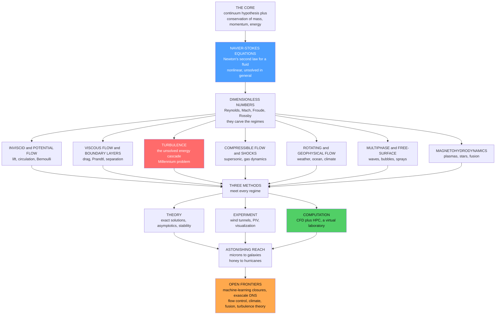

# 🌍 The Reach and Future of Fluid Dynamics

> [!abstract] TL;DR
> Fluid dynamics is the physics of the **flowing world**, and its scope is almost unreasonable: from a compact foundation — the **continuum hypothesis** plus conservation of mass, momentum, and energy, which distill into the nonlinear **Navier-Stokes equations** — springs a phenomenon list that spans **microns to galaxies** and **honey to hurricanes**. That single set of equations, Newton's laws written for a fluid, governs blood and microbes, aircraft and cars, weather and ocean currents, stars and magnetized galaxies. The chaos is organized by a **handful of dimensionless numbers** — above all the **Reynolds number** (inertia versus viscosity) and the **Mach number** (speed versus sound), joined by **Froude** and **Rossby** — which tile the entire field into regimes and let a wind-tunnel model stand in for a real aircraft. The field advances through the interplay of **theory, experiment, and computation** (CFD, now a co-equal virtual laboratory powered by HPC), and it sits at the heart of humanity's grand challenges: **climate prediction, sustainable transport, fusion energy, weather forecasting, and biomedicine**. Yet at its center remains a humbling mystery — **turbulence**, the churning cascade we can simulate and exploit but still cannot fully solve, whose mathematical face, the **Navier-Stokes existence-and-smoothness question**, is an unclaimed million-dollar Millennium problem. Fluid dynamics is thus one of physics' most beautiful, most consequential, and most enduringly **open** fields — a paradigm of how staggering complexity emerges from simple local laws through nonlinearity.

---

## Intuition

**Analogy:** From the blood in your veins to the swirl of a galaxy, from the wing that carries you across an ocean to the hurricane you flee, **one set of equations** quietly governs it all. Stir cream into coffee, watch smoke curl off a candle, feel a jet accelerate down a runway, look up at a spiral galaxy's dust lanes — these are not loosely related pictures. They are the *same physics*, the Navier-Stokes equations, playing out at absurdly different scales. Few fields can claim that a bacterium and a hurricane, a droplet and a star, obey a single law. Fluid dynamics can. It is the closest thing physics has to a **lingua franca** of the moving world.

And yet, at the heart of this triumphant universality sits a humbling secret. We have possessed the *exact* equations since the 1840s, and we still cannot fully solve the flow they produce whenever it becomes fast enough to churn. **Turbulence** — the cascade of swirls-within-swirls you watched in your coffee — remains classical physics' most important unsolved problem, and the question of whether the equations even stay smooth is a **million-dollar prize** still stirring, unclaimed, in every stream. This capstone steps back over the whole vault to celebrate that reach and to look honestly at that frontier.

---

## How It Works

### The Core and Its Branches

The entire field grows from a surprisingly small seed, and understanding fluid dynamics means seeing how that seed branches.

1. **The core.** Refuse to track $10^{16}$ molecules per cubic millimetre and instead treat the fluid as a **continuum** of smooth fields — density, velocity, pressure, temperature (the founding move of *[[The_Continuum_Hypothesis_and_Fluid_Properties]]*). Onto this continuum impose three conservation laws — **mass, momentum, energy** — over any control volume (*[[Conservation_Laws_and_Control_Volumes]]*, *[[Kinematics_of_Fluid_Flow]]*). Applying momentum conservation to a Newtonian fluid yields the centrepiece, the **Navier-Stokes equations** (*[[The_Navier_Stokes_Equations]]*). Their villain is a single nonlinear term, $(\vec v\cdot\nabla)\vec v$ — the fluid advecting its own momentum — the source of all the field's beauty and all its difficulty.

2. **The great regimes.** Because one nonlinear equation is intractable in general, the field organizes itself into **regimes**, each a limit in which some physics dominates and the equations simplify:
   - **Inviscid and potential flow** — drop viscosity and lift emerges from circulation and Bernoulli's principle (*[[Euler_Equations_and_Inviscid_Flow]]*, *[[Potential_Flow_and_Complex_Analysis]]*, *[[Bernoulli_and_Energy_in_Flows]]*, *[[Lift_Drag_and_Aerodynamics]]*).
   - **Viscous flow and boundary layers** — Prandtl's insight that viscosity concentrates into a thin wall layer that controls drag and separation (*[[Viscosity_and_Stress_in_Fluids]]*, *[[The_Boundary_Layer]]*, *[[Laminar_Flow_and_Exact_Solutions]]*, *[[Low_Reynolds_Number_Flow]]*, *[[Flow_Separation_and_Drag_Crisis]]*, *[[Non_Newtonian_and_Complex_Fluids]]*).
   - **Turbulence** — the unsolved cascade of energy from large eddies to the dissipating smallest scales (*[[Turbulence_Fundamentals]]*, *[[Kolmogorov_Theory_and_the_Energy_Cascade]]*, *[[Transition_to_Turbulence]]*, *[[Hydrodynamic_Instabilities]]*, *[[Turbulence_Modeling_RANS_LES_DNS]]*, *[[Mixing_Dispersion_and_Turbulent_Transport]]*).
   - **Compressible flow and shocks** — above Mach 1, information cannot outrun the flow and shock waves appear (*[[Compressible_Flow_and_Gas_Dynamics]]*, *[[Shock_Waves_and_Supersonic_Flow]]*).
   - **Rotating, stratified, and geophysical flow** — on a spinning, layered planet, Coriolis and buoyancy make weather, ocean currents, and climate (*[[Rotating_and_Stratified_Flows]]*, *[[Geophysical_Fluid_Dynamics]]*, *[[Convection_and_Thermal_Fluid_Dynamics]]*, *[[Surface_and_Internal_Waves]]*).
   - **Multiphase and free-surface flow** — bubbles, droplets, sprays, and waves at the interface between fluids.
   - **Magnetohydrodynamics** — flows of conducting fluids that carry their own magnetic fields, from fusion plasmas to the interstellar medium (*[[Magnetohydrodynamics]]*).

3. **Dimensionless numbers carve the regimes.** What decides *which* regime you are in is not the substance — air or water or plasma — but a handful of **pure numbers** obtained by non-dimensionalizing the equations (*[[Dimensional_Analysis_and_Similarity]]*). The **Reynolds number** $Re=\rho vL/\mu$ (inertia versus viscosity) decides laminar versus turbulent; the **Mach number** $Ma=v/c$ (speed versus sound) decides incompressible versus compressible; the **Froude number** $Fr=v/\sqrt{gL}$ governs free-surface waves; the **Rossby number** $Ro=U/(fL)$ governs rotation-dominated geophysical flow. Match these numbers and two utterly different flows become **dynamically similar** — the deep reason a scale model works and the organizing map of the whole field.

### The Three Methods and the Great Unsolved Problem

The field advances on **three legs**. **Theory** supplies exact solutions, asymptotics (boundary-layer theory), stability analysis, and dimensional reasoning. **Experiment** supplies wind tunnels, towing tanks, flow visualization, and modern **particle image velocimetry**. **Computation** — CFD, now co-equal — supplies a *virtual laboratory* where discretized Navier-Stokes are integrated on millions of cells, an ability that HPC and exascale hardware have transformed from a curiosity into an industrial and scientific workhorse (bridging to *[[Computational_Physics_Overview]]*, *[[Finite_Difference_Methods]]*, and *[[Spectral_Methods_and_the_FFT]]*). No leg is sufficient alone: CFD must be **validated** against experiment, experiment is interpreted through theory, and theory is tested by both.

The honest centrepiece of the whole edifice is **turbulence**. We have the exact equations and still cannot fully predict the flows they generate. Averaging Navier-Stokes to describe the mean flow produces more unknowns than equations — the **closure problem** — so turbulence must be *modeled* rather than solved. And whether smooth three-dimensional solutions even exist for all time is the **Navier-Stokes existence-and-smoothness** Millennium Prize problem. A mature, 180-year-old field with a genuine, million-dollar hole at its core: that humility is part of what makes fluid dynamics so alive.

### Flow / Architecture



---

## Key Concepts

### Secondary Level

- **One law for the whole flowing world.** The same physics moves blood, air over a wing, a hurricane, a river, and gas around a star. Fluid dynamics is the study of everything that flows.
- **A map made of two dials.** Turn the **Reynolds number** dial and smooth (laminar) flow becomes churning (turbulent) flow. Turn the **Mach number** dial past the speed of sound and shock waves appear. Almost the entire field is organized by a few dials like these.
- **We know the law but not the answer.** We have had the exact equations of flow for nearly two centuries, yet **turbulence** is so chaotic we still cannot fully predict it — one of the great open problems of all of physics.
- **Why it matters to you.** Fluid dynamics decides how planes fly, how weather is forecast, how the climate will change, how blood flows in your body, and whether fusion power can work.

### Undergraduate Level

- **The compact foundation.** Continuum fields plus conservation of mass, momentum, and energy give the Navier-Stokes equations; the nonlinear advection term $(\vec v\cdot\nabla)\vec v$ is the origin of both turbulence and the unsolved smoothness question.
- **The organizing numbers.** $Re=\rho vL/\mu$, $Ma=v/c$, $Fr=v/\sqrt{gL}$, $Ro=U/(fL)$. Matching them gives **dynamic similarity** — the principle behind every scale model and the coordinate system of the field's "map."
- **The regime map.** Real flows tile a $Re$–$Ma$ plane: creeping/Stokes flow at $Re<1$, laminar at $Re\lesssim 2000$, turbulent above; incompressible below $Ma\approx0.3$, compressible and shock-ridden above $Ma=1$.
- **The three methods.** Theory, experiment (wind tunnels, PIV), and computation (CFD) are complementary and mutually validating; none is complete alone.
- **The closure problem, briefly.** Averaging the nonlinear equations for turbulence produces the Reynolds stresses — more unknowns than equations — so turbulence is *modeled*, not solved (RANS, LES, DNS).

### Graduate Level

- **Degrees of freedom explode with $Re$.** Resolving all scales of 3-D turbulence requires $\sim Re^{9/4}$ degrees of freedom; this single scaling is why direct numerical simulation of a full aircraft or a climate is impossible, forcing modeling and parameterization.
- **The Millennium problem.** Global existence and smoothness of 3-D Navier-Stokes solutions given smooth initial data is unproven — the mathematical face of turbulence's unsolved status and a Clay Prize problem.
- **Multiphysics coupling.** Real frontier problems couple fluids to chemistry (combustion), electromagnetism (MHD, fusion), radiation (astrophysics, atmospheres), phase change (clouds, cavitation), and elasticity (fluid-structure interaction) — each breaking the clean single-fluid picture.
- **Data-driven turbulence.** Machine learning now supplies closure models, super-resolution of coarse fields, and reinforcement-learning flow control — a genuine paradigm shift layered on top of, not replacing, the governing equations (*[[Machine_Learning_in_Computational_Physics]]*).
- **Emergence and the limits of prediction.** Fluid dynamics is the canonical demonstration that simple, local, deterministic conservation laws generate globally unpredictable, scale-invariant complexity — a physics-of-flow window onto chaos, emergence, and the horizon of forecasting.

---

## Python Demo

```python
# THE REYNOLDS-AND-MACH MAP OF FLUID DYNAMICS  (numpy + matplotlib)
#
# A capstone synthesis: a handful of DIMENSIONLESS NUMBERS organize the ENTIRE
# field into regimes. We place real flows -- from a bacterium to a hurricane to
# convection inside a star -- on TWO maps:
#   (A) a Reynolds-number vs Mach-number plane, shaded into the classic regimes
#       (creeping/Stokes, laminar, turbulent; incompressible, subsonic, supersonic);
#   (B) a length-vs-velocity plane with diagonal iso-Reynolds lines,
#       showing how the same flows tile the parameter space the vault covers.
import numpy as np
import matplotlib.pyplot as plt

# Each flow:  (rho[kg/m^3], v[m/s], L[m], eta[Pa*s], c_sound[m/s])   (order-of-magnitude)
flows = {
    "Bacterium":        (1000.0, 3e-5,   1e-6,  1.0e-3, 1500.0),
    "Blood, capillary": (1060.0, 1e-3,   8e-6,  3.5e-3, 1570.0),
    "Flying insect":    (1.2,    1.0,    3e-3,  1.8e-5,  343.0),
    "Blood, aorta":     (1060.0, 1.0,    0.025, 3.5e-3, 1570.0),
    "Car":              (1.2,    30.0,   4.0,   1.8e-5,  343.0),
    "Airliner":         (0.41,   250.0,  5.0,   1.5e-5,  295.0),
    "Re-entry capsule": (0.02,   2000.0, 3.0,   1.5e-5,  300.0),
    "Hurricane":        (1.2,    50.0,   5e5,   1.8e-5,  343.0),
    "Ocean gyre":       (1025.0, 0.5,    1e6,   1.3e-3, 1500.0),
    "Stellar convection":(2e-4,  2000.0, 1e6,   1e-6,   8000.0),
}

names = list(flows.keys())
Re = np.array([rho * v * L / eta for (rho, v, L, eta, c) in flows.values()])
Ma = np.array([v / c            for (rho, v, L, eta, c) in flows.values()])
Lv = np.array([L                for (rho, v, L, eta, c) in flows.values()])
Vv = np.array([v                for (rho, v, L, eta, c) in flows.values()])

def regime(re):
    if re < 1.0:      return "creeping/Stokes", "#4a9eff"
    if re < 2300.0:   return "laminar",         "#51cf66"
    return "turbulent", "#ff6b6b"

print("=== The Reynolds-and-Mach map: a few numbers organize the whole field ===")
print(f"{'flow':20s} {'Re':>12s} {'Ma':>10s}   regime")
for n, r, m in zip(names, Re, Ma):
    reg, _ = regime(r)
    comp = "supersonic" if m > 1 else ("compressible" if m > 0.3 else "incompressible")
    print(f"{n:20s} {r:12.1e} {m:10.2e}   {reg:16s} / {comp}")

fig, (axA, axB) = plt.subplots(1, 2, figsize=(15, 7))
fig.suptitle("The Reach of Fluid Dynamics: a few dimensionless numbers map the whole field",
             fontsize=14, fontweight="bold")

# ------------------------- Panel A: Re vs Ma map -------------------------
axA.axhspan(1.0, 1e1, color="#ff6b6b", alpha=0.08)                 # supersonic band
axA.axhspan(0.3, 1.0, color="#ffa94d", alpha=0.10)                 # transonic band
axA.axhline(0.3, color="#e08a00", ls="--", lw=1)
axA.axhline(1.0, color="#c0392b", ls="--", lw=1.2)
axA.axvline(1.0,    color="#1f6fbf", ls=":", lw=1)
axA.axvline(2300.0, color="#2e8b57", ls="--", lw=1.2)

for n, r, m in zip(names, Re, Ma):
    _, col = regime(r)
    edge = "k" if m > 1 else "none"
    axA.scatter(r, m, s=90, color=col, edgecolors=edge, linewidths=1.4, zorder=5)
    axA.annotate(n, (r, m), textcoords="offset points", xytext=(6, 6), fontsize=8)

axA.text(3e-5, 5.0,  "SUPERSONIC  (Ma > 1): shock waves", fontsize=8, color="#c0392b")
axA.text(3e-5, 0.45, "compressible  (Ma > 0.3)",          fontsize=8, color="#e08a00")
axA.text(3e-5, 3e-8, "incompressible  (Ma < 0.3)",        fontsize=8, color="#555")
axA.text(1.3, 2e-2,  "Re = 1\nviscosity rules", fontsize=7, color="#1f6fbf", rotation=90, va="bottom")
axA.text(3000, 2e-2, "Re ~ 2300\nlaminar -> turbulent", fontsize=7, color="#2e8b57", rotation=90, va="bottom")
axA.set_xscale("log"); axA.set_yscale("log")
axA.set_xlim(1e-6, 1e18); axA.set_ylim(1e-8, 1e1)
axA.set_xlabel("Reynolds number  Re = rho v L / eta   (inertia vs viscosity)")
axA.set_ylabel("Mach number  Ma = v / c   (speed vs sound)")
axA.set_title("A. The regime map\nblue = creeping, green = laminar, red = turbulent")

# ------------------------- Panel B: length vs velocity, iso-Re lines -------------------------
nu = 1.5e-5                                    # kinematic viscosity of air [m^2/s]
Lgrid = np.logspace(-6, 7, 200)
for Re_iso in [1e0, 1e3, 1e6, 1e9, 1e12]:
    v_iso = Re_iso * nu / Lgrid                # Re = v L / nu  ->  v = Re nu / L
    axB.plot(Lgrid, v_iso, color="0.7", lw=1, ls="--")
    axB.text(Lgrid[5], v_iso[5], f"Re={Re_iso:.0e}", color="0.5", fontsize=7, rotation=-33)

for n, r, L, v in zip(names, Re, Lv, Vv):
    _, col = regime(r)
    axB.scatter(L, v, s=90, color=col, edgecolors="k", linewidths=0.6, zorder=5)
    axB.annotate(n, (L, v), textcoords="offset points", xytext=(6, 5), fontsize=8)

axB.set_xscale("log"); axB.set_yscale("log")
axB.set_xlim(1e-6, 1e7); axB.set_ylim(1e-6, 1e4)
axB.set_xlabel("characteristic length  L  [m]   (microns to planetary)")
axB.set_ylabel("characteristic speed  v  [m/s]")
axB.set_title("B. The same flows tile length-velocity space\ndashed = lines of constant Reynolds number")

plt.tight_layout(rect=[0, 0, 1, 0.95])
plt.savefig("reach_of_fluid_dynamics.png", dpi=110)
print("\nSaved reach_of_fluid_dynamics.png")
plt.show()
```

**What it shows.** The printed table and **Panel A** make the capstone point concrete: ten wildly different flows — a swimming bacterium at $Re\sim10^{-5}$ where the world is pure honey, an airliner at $Re\sim10^{7}$ and $Ma\sim0.85$ riding the transonic edge, a re-entry capsule punching through $Ma\sim7$ shock waves, a hurricane at $Re\sim10^{12}$, convection inside a star at $Re\sim10^{11}$ — all fall into their proper places on a single plane spanned by just **two dimensionless numbers**. The horizontal bands sort flows into incompressible, transonic, and supersonic; the vertical lines sort them into creeping, laminar, and turbulent. **Panel B** re-plots the same flows in raw length-versus-velocity coordinates and overlays diagonal **iso-Reynolds lines**, showing how the vault's topics — Stokes flow, boundary layers, turbulence, gas dynamics, geophysical flow — literally *tile* this parameter space. The figure is the field's map, and every note in this vault is a country on it.

---

## Real-World Applications

> **Example — a commercial flight is the whole vault in one machine.** A wing's **lift** is circulation and the Kutta condition (potential flow); its **drag** is set by the turbulent **boundary layer** and whether that layer stays attached or stalls; the airframe is validated at reduced scale in a **wind tunnel** by matching **Reynolds and Mach numbers**; the transonic shocks on the wing are **compressible gas dynamics**; and the final shape is refined by **CFD** solving discretized Navier-Stokes on hundreds of millions of cells. Aerodynamics, boundary layers, turbulence, compressibility, similarity, and computation — six chapters of this vault — meet in a single aircraft.

- **Climate and weather.** Numerical weather prediction and climate models integrate the rotating, stratified, moist Navier-Stokes equations over the whole atmosphere and ocean; unresolved turbulence and convection are parameterized, and that closure is a leading source of projection uncertainty (*[[Numerical_Weather_Prediction]]*, *[[Climate_Models_and_Projections]]*, *[[Global_Atmospheric_Circulation]]*, *[[Tropical_Cyclones_and_Hurricanes]]*, *[[Anthropogenic_Climate_Change]]*).
- **Oceans and Earth's heat engine.** The ocean's overturning, gyres, and eddies transport heat and carbon and set the pace of climate change (*[[Thermohaline_Circulation_and_AMOC]]*, *[[Wind_Driven_Circulation_and_Sverdrup_Balance]]*, *[[Mesoscale_Eddies_and_Ocean_Variability]]*, *[[Turbulence_and_Diapycnal_Mixing]]*).
- **Biomedicine.** Blood flow, wall shear stress, stent and valve design, and microfluidic lab-on-a-chip devices are low-to-moderate Reynolds flows where viscosity, not inertia, often rules (*[[Fluid_Dynamics_in_Biology]]*, *[[Low_Reynolds_Number_Flow]]*).
- **Energy.** Turbines, combustors, wind farms, and above all **magnetically confined fusion plasmas** are governed by turbulent, reacting, and magnetohydrodynamic flow (*[[Magnetohydrodynamics]]*, *[[Nuclear_Reactions_Fission_Fusion]]*, *[[Convection_and_Thermal_Fluid_Dynamics]]*).
- **Astrophysics.** Accretion disks, stellar convection, supernova blast waves, and the turbulent, magnetized interstellar medium are fluid and magnetofluid dynamics on cosmic scales (*[[Accretion_Disks_and_X_ray_Binaries]]*, *[[The_Interstellar_Medium]]*, *[[Star_Formation]]*, *[[Stellar_Structure_and_Energy_Generation]]*).

---

## Common Pitfalls

- **Mistaking universality for solvability.** The same equations *do* govern honey and hurricanes — but having the law is not the same as having the answer. Turbulence has an unsolved **closure problem** and no complete first-principles theory; the elegance of Navier-Stokes hides a genuine hole at the center of the field.
- **Forgetting the Navier-Stokes existence problem.** We cannot even prove that smooth 3-D solutions stay smooth for all time. This is not a technicality — it is a live Clay **Millennium Prize** problem, and it means the mathematical foundations of turbulence are literally incomplete.
- **Trusting CFD as an oracle.** A simulation that fails to resolve the boundary layer or the Kolmogorov dissipation scale ($\propto Re^{-3/4}$) can produce a beautiful, colourful, and completely **wrong** answer. Mesh convergence and validation against experiment are not optional — garbage in, garbage out, however pretty the render.
- **Expecting turbulence and weather to be predictable in detail.** Flows are deterministic yet **chaotic**: infinitesimal perturbations diverge exponentially, imposing hard horizons (the roughly two-week limit of weather forecasting). Only *statistical* quantities are reproducible; treating a turbulent trace as a fixable curve misreads the physics (*[[Chaos_Theory_and_Sensitive_Dependence]]*).
- **Believing the equations describe the messy world exactly.** Real flows are **multiscale and multiphysics** — phase change, chemistry, radiation, elasticity, magnetic fields — and the clean single-fluid Navier-Stokes picture is an idealization. The gap between elegant equations and messy reality is where most engineering difficulty and most open research live.
- **Assuming one turbulence model, or one regime, transfers everywhere.** A $k$-$\varepsilon$ closure tuned on a pipe can fail badly on a separated wing; incompressible intuition collapses past $Ma=1$; 3-D cascade logic reverses in 2-D. The regime map is not decoration — it tells you which physics, and which model, actually applies.

---

## Related Concepts

**The foundations and governing equations (the core of the vault)**
- [[Fluid_Dynamics_Overview]] — the vault's opening survey; this capstone is its closing bookend.
- [[The_Continuum_Hypothesis_and_Fluid_Properties]] — the founding modeling choice from which everything else grows.
- [[Conservation_Laws_and_Control_Volumes]] — mass, momentum, and energy bookkeeping that yields the equations.
- [[The_Navier_Stokes_Equations]] — the nonlinear centrepiece whose reach and unsolved status this note synthesizes.
- [[Dimensional_Analysis_and_Similarity]] — the source of the dimensionless numbers that map the entire field.
- [[Kinematics_of_Fluid_Flow]] — the description of motion underlying every regime.

**The great regimes (the vault's branches)**
- [[Euler_Equations_and_Inviscid_Flow]] and [[Potential_Flow_and_Complex_Analysis]] — the inviscid limit and the mathematics of lift.
- [[Lift_Drag_and_Aerodynamics]] and [[Bernoulli_and_Energy_in_Flows]] — how flight and drag arise from the equations.
- [[The_Boundary_Layer]], [[Viscosity_and_Stress_in_Fluids]], and [[Flow_Separation_and_Drag_Crisis]] — the viscous wall region that sets drag and stall.
- [[Turbulence_Fundamentals]] and [[Kolmogorov_Theory_and_the_Energy_Cascade]] — the unsolved cascade at the heart of this synthesis.
- [[Turbulence_Modeling_RANS_LES_DNS]] — the practical response to the closure problem and the engine of CFD.
- [[Compressible_Flow_and_Gas_Dynamics]] and [[Shock_Waves_and_Supersonic_Flow]] — the high-Mach regime and its shocks.
- [[Geophysical_Fluid_Dynamics]] and [[Rotating_and_Stratified_Flows]] — rotation and stratification that make weather and oceans.
- [[Magnetohydrodynamics]] — the conducting-fluid regime for plasmas, fusion, and cosmic flows.

**The astonishing reach (where the same equations reappear)**
- [[Numerical_Weather_Prediction]], [[Climate_Models_and_Projections]], and [[Tropical_Cyclones_and_Hurricanes]] — atmospheric fluid dynamics as a grand challenge.
- [[Thermohaline_Circulation_and_AMOC]] and [[Turbulence_and_Diapycnal_Mixing]] — the ocean as a rotating, stratified, turbulent fluid.
- [[Fluid_Dynamics_in_Biology]] — blood, swimming, and the low-Reynolds physics of life.
- [[Accretion_Disks_and_X_ray_Binaries]], [[The_Interstellar_Medium]], and [[Star_Formation]] — fluid and magnetofluid dynamics on cosmic scales.

**The computational leg and its frontiers**
- [[Computational_Physics_Overview]], [[Finite_Difference_Methods]], and [[Spectral_Methods_and_the_FFT]] — the numerical machinery of CFD.
- [[Machine_Learning_in_Computational_Physics]] — data-driven turbulence closures and flow control, the field's newest frontier.
- [[The_Reach_and_Future_of_Computational_Physics]] — the companion capstone on the computational side.

**The physics-of-emergence view**
- [[Chaos_Theory_and_Sensitive_Dependence]] — why deterministic flow is unpredictable in detail.
- [[Emergence_and_Self_Organization]] — coherent structures and complexity emerging from simple local laws.
- [[Nonlinearity_and_Feedback]] — the nonlinear advection term as the archetype of complexity-generating feedback.

---

## Review Questions

1. **Secondary:** Fluid dynamics is sometimes called "one law for the whole flowing world." Give three examples of things governed by the same fluid equations at completely different scales, and explain in plain language why turbulence is considered an unsolved problem even though we know the exact equations.
2. **Undergraduate:** Explain how just two dimensionless numbers — Reynolds and Mach — organize fluid dynamics into regimes. Place a bacterium, an airliner, and a hurricane on the $Re$–$Ma$ map, state which regime each occupies, and explain what "dynamic similarity" lets an engineer do with a scale model.
3. **Graduate:** Fluid dynamics is a mature field with a genuine hole at its center. Discuss (i) the closure problem and why turbulence must be modeled rather than solved, (ii) the Navier-Stokes existence-and-smoothness Millennium problem and what it does and does not claim, and (iii) how machine learning and exascale computation are changing the field without removing these fundamental limits. Conclude with why fluid dynamics is a paradigm of emergence and the limits of prediction.

---

## Sources

- G. K. Batchelor — *An Introduction to Fluid Dynamics* (Cambridge University Press, 1967; reissued 2000) — the classic unifying treatment.
- P. K. Kundu, I. M. Cohen & D. R. Dowling — *Fluid Mechanics*, 6th ed. (Academic Press, 2015) — regimes, dimensionless numbers, and applications.
- S. B. Pope — *Turbulent Flows* (Cambridge University Press, 2000) — the closure problem and the state of turbulence modeling.
- Clay Mathematics Institute — "Navier-Stokes Existence and Smoothness" Millennium Problem statement, claymath.org.
- S. L. Brunton, B. R. Noack & P. Koumoutsakos — "Machine Learning for Fluid Mechanics," *Annual Review of Fluid Mechanics* 52 (2020) — the data-driven frontier.

---

#fluid-dynamics #synthesis #capstone #turbulence #interdisciplinary
