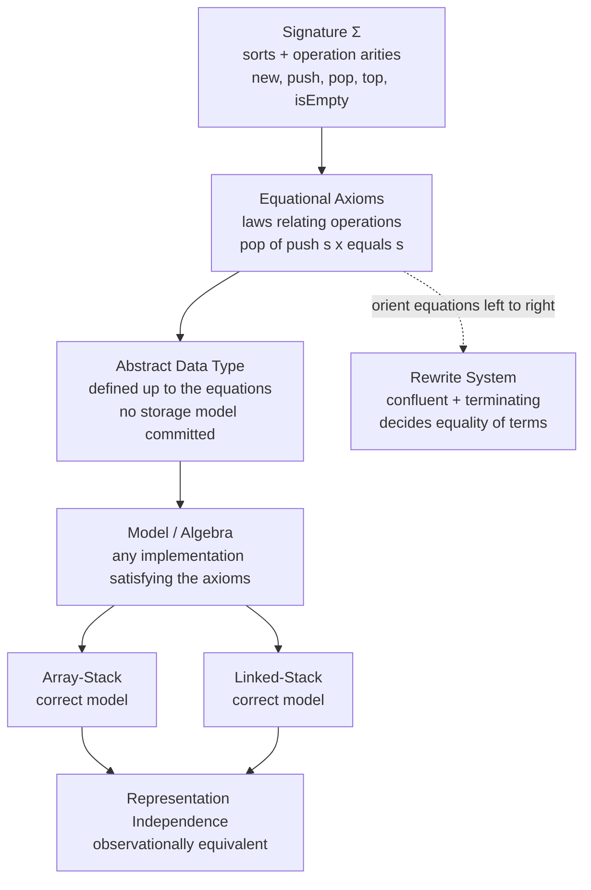

# 🧮 Algebraic Specification and Abstract Data Types

> [!abstract] TL;DR
> An **algebraic specification** defines a data type purely by the **equations its operations must satisfy** — a *signature* of sorts and operations plus *axioms* relating them — saying nothing about how values are stored, so that **any** implementation obeying the equations is correct by definition (representation independence).

---

## Intuition

**Analogy:** You can explain what a **stack** *is* without ever opening it up: *"the last thing you put in is the first thing you take out."* That single **law** — pop after push gives back exactly what you started with — captures a stack completely, whether it is built from an array, a linked list, or magic pixie dust. You never need to see the boxes; you only need the rule that governs them.

Algebraic specification does *exactly* this, made precise. It pins down a data type by the **equational laws** its operations obey and nothing else. Get the laws right, and every implementation that satisfies them is — provably, automatically — a correct realization of the type. The specification is the *contract*; the code is merely one of infinitely many ways to honour it.

This is the **property-oriented** (algebraic) style of formal specification, the natural complement to the **model-based** style (as in *Set_Based_Specification_Z_and_B* and *State_Based_Modeling_and_Invariants*), which instead describes a type by exhibiting an explicit state model and operations over it.

---

## How It Works

### Core Mechanics

1. **Declare a signature Σ.** A signature names the **sorts** (the types involved) and the **operations** with their **arities** (input sorts → result sort). For an unbounded stack of elements:
   - `new  :          → Stack`
   - `push : Stack × Elem → Stack`
   - `pop  : Stack      → Stack`
   - `top  : Stack      → Elem`
   - `isEmpty : Stack   → Bool`

2. **Give equational axioms.** Equations relate the operations, holding for all values of the free variables `s : Stack`, `x : Elem`:
   - `pop(push(s, x)) = s`
   - `top(push(s, x)) = x`
   - `isEmpty(new)        = true`
   - `isEmpty(push(s, x)) = false`

3. **The axioms define the ADT abstractly.** The pair *(signature, axioms)* is the specification. It never mentions arrays, pointers, or memory — only how operations transform one another.

4. **Any algebra satisfying the equations is a model.** An *implementation* assigns a carrier set to each sort and a function to each operation. If those functions make every axiom true, the implementation is a **correct model** of the specification. Two different models — an array-stack and a linked-stack — are then **observationally equivalent**: no sequence of operations can tell them apart.

5. **Constructors vs observers.** `new` and `push` are **constructors** — every stack value is some `push(push(...(new)...))` term. `top`, `pop`, and `isEmpty` are **observers** — they are *defined by equations on constructor terms*. A good spec makes every observer total on every constructor term (**sufficient completeness**) without contradiction (**consistency**).

### Flow / Architecture



---

## Key Concepts

**Secondary (intuition level)**
- An **ADT** is defined by *what its operations do*, not by *how values are stored*.
- A **signature** = the names of the sorts (types) plus the operations and their input/output types.
- **Axioms** = equations the operations must satisfy, like `pop(push(s, x)) = s`.
- **Representation independence**: array-stack and list-stack are both correct because both obey the same laws.

**Undergraduate (mechanism level)**
- **Constructors** build values (`new`, `push`); **observers** query them (`top`, `pop`, `isEmpty`). Axioms typically say what each observer returns when applied to a constructor term.
- **Sufficient completeness**: every observer is defined on every constructor term — no "stuck" or undefined observations (e.g., you must decide what `top(new)` means, often via an error sort or a precondition).
- **Consistency**: the axioms do not force distinct constructor values to collapse (e.g., must not make `true = false`).
- **Equational logic**: reasoning uses only reflexivity, symmetry, transitivity, congruence (replace equals by equals), and substitution — sound and complete for equational theories (Birkhoff).
- The same recipe specifies **Queue** (`front(enqueue(new, x)) = x`, FIFO axioms), **Set** (idempotence `add(add(s, x), x) = add(s, x)`, commutativity of membership), Booleans, naturals, and more.

**Graduate (theory level)**
- **Initial semantics** ("no junk, no confusion"): the canonical model is the **term algebra** of Σ **quotiented by provable equality**. *No junk* = every carrier element is denoted by some ground term; *no confusion* = two ground terms are equal iff the axioms prove them equal. This is the **initial object** in the category of Σ-algebras satisfying the axioms.
- **Loose vs final semantics**: *loose* semantics admits **all** models (used for parameterized/library specs where many implementations are acceptable); *final* semantics maximally identifies terms (behavioural view — collapse anything observation cannot distinguish).
- **Term rewriting**: orient each equation left→right into a **rewrite rule**. If the resulting system is **terminating** (no infinite rewrites) and **confluent** (Church–Rosser: overlapping rewrites re-converge), then every term has a unique **normal form**, giving a **decision procedure** for the word problem (equality of terms). **Knuth–Bendix completion** attempts to turn a set of equations into such a confluent, terminating system by adding derived rules.
- **Hidden vs visible sorts / behavioural specification**: distinguish *observable* sorts (Bool, Int) from *hidden* state sorts (Stack). Two states are behaviourally equal iff all observable experiments agree — the formal basis of representation independence and **observational equivalence** (see *Contextual_Equivalence_and_Reasoning*).
- **Universal-algebra roots**: equational classes are exactly **varieties** (Birkhoff's HSP theorem — closed under Homomorphic images, Subalgebras, Products). The **algebra of programs** (functor laws, monad laws) is algebraic specification applied to functional code.

---

## Python Demo

```python
# Algebraic axioms as EXECUTABLE PROPERTY TESTS.
# (a) Encode the STACK axioms as laws, run them against a CORRECT and a BUGGY
#     implementation over many random operation sequences, and count how often
#     each law holds -> the equations pin down correctness.
# (b) REPRESENTATION INDEPENDENCE: two different implementations (array-stack vs
#     linked-stack) both satisfy every law (observational equivalence).
import numpy as np
import matplotlib.pyplot as plt

rng = np.random.default_rng(2026)

# ---------- Three implementations of the SAME signature ----------
# All are immutable (pure functions), matching the algebraic style.

class ArrayStack:                       # backing store: a dynamic array (list)
    def __init__(self, items=None): self._it = list(items) if items else []
    @staticmethod
    def new(): return ArrayStack()
    def push(self, x): return ArrayStack(self._it + [x])
    def pop(self):     return ArrayStack(self._it[:-1])
    def top(self):     return self._it[-1]
    def is_empty(self):return len(self._it) == 0
    def observe(self):                  # canonical observation: tops, top->bottom
        s, out = self, []
        while not s.is_empty(): out.append(s.top()); s = s.pop()
        return out

class LinkedStack:                      # backing store: immutable cons-cells
    def __init__(self, node=None): self._n = node          # node = (val, rest)
    @staticmethod
    def new(): return LinkedStack(None)
    def push(self, x): return LinkedStack((x, self._n))
    def pop(self):     return LinkedStack(self._n[1])
    def top(self):     return self._n[0]
    def is_empty(self):return self._n is None
    def observe(self):
        n, out = self._n, []
        while n is not None: out.append(n[0]); n = n[1]
        return out

class BuggyStack:                       # looks like a stack, but pop removes the
    def __init__(self, items=None): self._it = list(items) if items else []
    @staticmethod                       # WRONG end (front) -> violates LIFO law L3
    def new(): return BuggyStack()
    def push(self, x): return BuggyStack(self._it + [x])
    def pop(self):     return BuggyStack(self._it[1:])     # BUG: drops the bottom
    def top(self):     return self._it[-1]
    def is_empty(self):return len(self._it) == 0
    def observe(self):
        s, out = self, []
        while not s.is_empty(): out.append(s.top()); s = s.pop()
        return out

# ---------- The algebraic axioms, as checkable predicates ----------
LAWS = ["L1  isEmpty(new)=true",
        "L2  isEmpty(push)=false",
        "L3  pop(push s x)=s",
        "L4  top(push s x)=x"]

def random_stack(Cls, max_ops=8):
    s = Cls.new()
    for _ in range(int(rng.integers(0, max_ops))):
        s = s.push(int(rng.integers(0, 100)))
    return s

def law_pass_rates(Cls, trials=4000):
    p = np.zeros(4)
    for _ in range(trials):
        s = random_stack(Cls)
        x = int(rng.integers(0, 100))
        p[0] += (Cls.new().is_empty() == True)
        p[1] += (s.push(x).is_empty() == False)
        p[2] += (s.push(x).pop().observe() == s.observe())   # observational eq.
        p[3] += (s.push(x).top() == x)
    return p / trials

correct_rates = law_pass_rates(ArrayStack)
buggy_rates   = law_pass_rates(BuggyStack)
array_rates   = law_pass_rates(ArrayStack)
linked_rates  = law_pass_rates(LinkedStack)

# ---------- Direct observational-equivalence test across representations ----------
def observationally_equal(A, B, trials=4000, max_ops=14):
    matches = 0
    for _ in range(trials):
        sa, sb = A.new(), B.new()
        for _ in range(int(rng.integers(0, max_ops))):
            if rng.random() < 0.6:
                v = int(rng.integers(0, 100)); sa, sb = sa.push(v), sb.push(v)
            else:
                if not sa.is_empty(): sa = sa.pop()
                if not sb.is_empty(): sb = sb.pop()
        matches += (sa.observe() == sb.observe())
    return matches / trials

obs_eq = observationally_equal(ArrayStack, LinkedStack)
print("Array vs Linked observational equivalence:", obs_eq)   # -> 1.0

# ---------- Plot ----------
fig, (ax1, ax2) = plt.subplots(1, 2, figsize=(13, 5))
idx, w = np.arange(4), 0.38

ax1.bar(idx - w/2, correct_rates, w, label="Correct (ArrayStack)", color="#2a9d8f")
ax1.bar(idx + w/2, buggy_rates,   w, label="Buggy (pop drops bottom)", color="#e76f51")
ax1.set_xticks(idx); ax1.set_xticklabels(LAWS, rotation=25, ha="right", fontsize=8)
ax1.set_ylabel("fraction of random tests the law holds")
ax1.set_ylim(0, 1.08); ax1.axhline(1.0, ls="--", c="gray", lw=0.8)
ax1.set_title("(a) Equational laws pin down correctness\nbuggy impl fails L3 (LIFO)")
ax1.legend(fontsize=8)

ax2.bar(idx - w/2, array_rates,  w, label="ArrayStack (array)",  color="#264653")
ax2.bar(idx + w/2, linked_rates, w, label="LinkedStack (cons)",  color="#e9c46a")
ax2.set_xticks(idx); ax2.set_xticklabels(LAWS, rotation=25, ha="right", fontsize=8)
ax2.set_ylim(0, 1.08); ax2.axhline(1.0, ls="--", c="gray", lw=0.8)
ax2.set_title(f"(b) Representation independence\nboth satisfy every law; obs-equiv = {obs_eq:.2f}")
ax2.legend(fontsize=8)

plt.tight_layout(); plt.savefig("algebraic_spec_laws.png", dpi=120)
print("Correct rates:", np.round(correct_rates, 3))
print("Buggy   rates:", np.round(buggy_rates,   3))   # L3 well below 1.0
```

**What the plot shows.** Panel (a): the correct implementation satisfies all four axioms on every random operation sequence (bars at 1.0), while the buggy one — identical signature, wrong `pop` — silently **fails law L3** `pop(push(s,x)) = s`, exactly the LIFO essence. The equation, not the code, is the arbiter of correctness. Panel (b): the array-backed and cons-cell-backed stacks *both* satisfy every law, and a direct experiment confirms they are **observationally equivalent** (equivalence = 1.0) — two representations, one abstract data type.

---

## Real-World Applications

> **Example:** **Maude** (an OBJ-family language) executes algebraic/rewriting specifications directly. Its rewriting engine underpins **Maude-NPA**, a cryptographic-protocol analyzer used to find attacks by rewriting protocol states modulo equational theories (e.g., exclusive-or, Diffie–Hellman) — algebraic specification turned into an automated verification tool.

- **QuickCheck-style property-based testing** (Haskell, `hypothesis` in Python, `proptest` in Rust): the "properties" you test are literally the algebraic laws of a type — `reverse (reverse xs) == xs`, `insert` commutes, functor/monad laws. The demo above *is* this idea in miniature.
- **Functional-programming laws / the algebra of programs**: `Functor`, `Applicative`, and `Monad` type-class laws (see *Monads_and_Effects*) are equational specifications; a lawful instance is a correct model. Compiler rewrite rules ("stream fusion", `map f . map g = map (f . g)`) are oriented equations.
- **CASL** (Common Algebraic Specification Language, from the CoFI initiative) and **Larch** (Guttag & Horning): industrial-strength languages for specifying data-type libraries and module interfaces independently of implementation.
- **Verified data structures & abstract-interpretation frameworks**: proving a concrete structure *refines* its algebraic spec is the correctness argument behind verified libraries (connecting to *Refinement_and_Correctness_by_Construction*).
- **Algebraic data types in ML/Haskell/Rust**: the `data` declaration gives constructors; pattern-matching functions are observer equations — initial-algebra semantics realized in a compiler.

---

## Common Pitfalls

- **Confusing algebraic with model-based specification.** Algebraic specs define a type by **equations over operations** with *no underlying state model*; Z/B specs give an explicit set-theoretic model plus invariants. Reaching for a hidden array or field variable in an "algebraic" spec defeats the whole point (representation independence).
- **Forgetting sufficient completeness.** If some observer is undefined on some constructor term (classic: `top(new)` or `pop(new)`), the specification is incomplete. You must decide the semantics — an error element, an `Option`/`Maybe` result sort, or an explicit precondition — *before* claiming implementations are correct.
- **Inconsistency (confusion).** Over-eager axioms can force distinct values to be provably equal (the dreaded `true = false`), collapsing the type. Consistency proofs (often via a term-rewriting normal-form or an exhibited model) are essential.
- **Ignoring the constructor/observer split.** Writing equations between observers without grounding them on constructor terms tends to under- or over-specify. Anchor each observer's meaning on `new` and on `push`-like constructors.
- **Assuming equations are automatically executable.** They only decide equality when oriented into a **terminating, confluent** rewrite system. Non-terminating rules (e.g., an unoriented commutativity axiom) or non-joinable critical pairs break the decision procedure — this is where **Knuth–Bendix completion** and rewriting *modulo* AC come in.
- **Mixing up initial vs loose/final semantics.** Initial semantics ("no junk, no confusion") is right for *defining* a concrete type; loose semantics is right for *library/parameterized* specs meant to admit many implementations; final/behavioural semantics is right when only observable behaviour matters. Choosing the wrong one over- or under-constrains implementers.
- **Visible/hidden-sort mistakes.** Treating a hidden state sort as if it were observable makes representation-dependent distinctions and destroys observational equivalence.

---

## Related Concepts

- [[Stack]] — the canonical worked example; its LIFO contract *is* the four stack axioms, independent of array-vs-list storage.
- [[Queue]] — a second ADT specified the same way, with FIFO axioms (`front(enqueue(new, x)) = x`).
- [[F_Algebras_and_Initial_Algebras]] — the categorical home of **initial semantics**: an ADT's constructors form an initial F-algebra, its recursion the unique catamorphism.
- [[Terminal_Initial_and_Zero_Objects]] — initial vs terminal objects mirror **initial vs final** algebraic semantics ("no junk/no confusion" vs maximal behavioural identification).
- [[Functional_Programming_Foundations]] — equational reasoning and referential transparency make functional code the natural setting for algebraic laws.
- [[Monads_and_Effects]] — the monad laws are an algebraic specification; a lawful instance is a correct model (algebra of programs).
- [[Contextual_Equivalence_and_Reasoning]] — the semantic backbone of **observational equivalence** / representation independence.
- [[Denotational_Semantics]] — the model-theoretic counterpart: meaning as an algebra/model, complementing the equational/syntactic view.
- [[Set_Theory_and_Relations]] — equivalence relations and quotients underpin the **term algebra quotiented by provable equality** (a congruence).
- [[Rings_and_Ideals]] — familiar signature-plus-axioms structures; algebraic specification generalizes universal-algebra ideas (varieties, homomorphisms) to arbitrary data types.

---

## Review Questions

1. **(Secondary)** Explain, without mentioning arrays or pointers, why an array-based stack and a linked-list-based stack are "the same" data type. Which specific law captures the LIFO behaviour, and how would you *test* it on a black-box implementation?
2. **(Undergraduate)** Write an algebraic specification (signature + axioms) for a **finite Set** with operations `empty`, `add`, `member`, and `isEmpty`. Which axioms encode that adding the same element twice has no effect, and that order of insertion does not matter? Is your observer `member` sufficiently complete on all constructor terms?
3. **(Graduate)** You are given a set of equations for a data type. Describe how to obtain a **decision procedure** for equality of terms. What must hold for the oriented rules (termination, confluence), what can go wrong, and how does **Knuth–Bendix completion** attempt to fix it? Contrast the resulting *initial* model with a *final/behavioural* model, and give an example where the two disagree.

---

## Sources

- [Guttag & Horning — *Larch: Languages and Tools for Formal Specification* (Springer, 1993)](https://link.springer.com/book/10.1007/978-1-4612-2704-5)
- [Ehrig & Mahr — *Fundamentals of Algebraic Specification 1: Equations and Initial Semantics* (Springer EATCS, 1985)](https://link.springer.com/book/10.1007/978-3-642-69962-7)
- [Wirsing — "Algebraic Specification", *Handbook of Theoretical Computer Science*, Vol. B, Ch. 13 (Elsevier, 1990)](https://doi.org/10.1016/B978-0-444-88074-1.50018-4)
- [Bidoit & Mosses — *CASL User Manual* (LNCS 2900, Springer, 2004)](https://link.springer.com/book/10.1007/b11968)
- [Goguen, Thatcher, Wagner & Wright — "Initial Algebra Semantics and Continuous Algebras", *JACM* 24(1), 1977](https://dl.acm.org/doi/10.1145/321992.321997)

---

#formal-methods #algebraic-specification #abstract-data-types #equational-logic #term-rewriting
