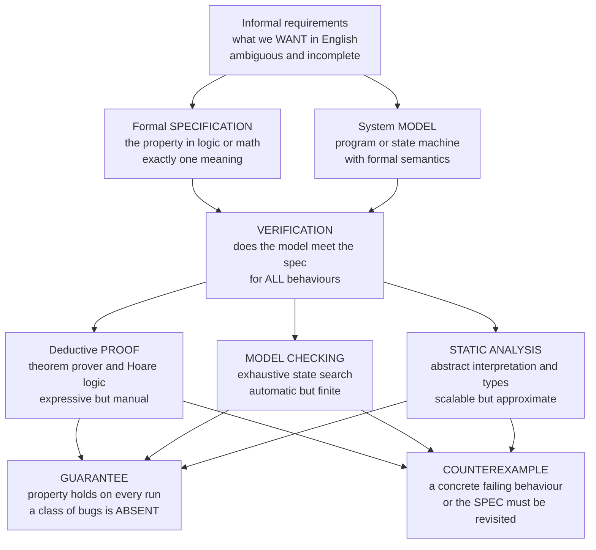

# 🛡️ Formal Methods Overview

> [!abstract] TL;DR
> **Formal methods** are the mathematical discipline of **specifying** what a hardware or software system should do — in the precise, unambiguous language of logic rather than English — and then **proving** that a model of the system meets that specification **for every possible behaviour**, not merely for the handful of inputs a test happens to try. The move is Dijkstra's: *"Testing shows the presence, never the absence, of bugs."* A test is one truck driven across the bridge; a formal proof is the structural engineer's calculation that the bridge holds under **every** load. The field spans a **spectrum** — *lightweight, automatic* techniques (type systems, static analysis, model checking — push-button and scalable) through *heavyweight, interactive* ones (full functional-correctness proofs in theorem provers — powerful but labour-intensive) — trading **automation against expressiveness** against the hard wall of **undecidability**. This note is the entry point to the vault and maps its six pillars: **(1) specification**, **(2) logic, proof and solvers**, **(3) deductive program verification**, **(4) model checking and temporal logic**, **(5) static analysis and abstraction**, and **(6) applications and frontiers**. The honest framing throughout: formal methods turn "correctness" from a *hope* into a *theorem* — but only relative to a spec and a set of assumptions you are responsible for getting right.

---

## Intuition

**Analogy — the bridge: a few trucks versus the engineer's calculation.** Suppose you want to know whether a new bridge is safe. One approach is to drive some trucks across it. If none fall through, you breathe easier — but you never tried *every* truck, at every speed, in every combination, in every weather. You sampled. This is **testing**: reassuring, cheap, and fundamentally incomplete. The other approach is the structural engineer's: before a single beam is welded, write down the equations for load, stress, and material strength and **prove** — as a theorem about the design — that the bridge holds for **every** load within spec. You did not *drive* the bridge; you *proved* it.

Software is the same, and worse, because a program's "loads" are astronomically more numerous than a bridge's. **Testing** runs the program on examples and checks the answers; it can only ever exhibit bugs it happens to trip over. **Formal methods** run the *mathematics* on the program: they state a property in logic and demonstrate it holds across the entire — often infinite or astronomically large — space of runs. Where testing shows the **presence** of bugs, a proof can show their **absence**. It is the difference between *"we tested it a lot and it seemed fine"* and *"we proved it correct."* This vault is about how you actually cash that promise out — and about its fine print.

---

## How It Works

### Core Mechanics

Formal methods rest on **three activities**, and every technique in the field is some way of doing them.

**1. Specify — say precisely what "correct" means.** Natural-language requirements ("the system shall never dispense two conflicting outputs") are ambiguous, incomplete, and untestable-in-full. A **formal specification** restates the intended property in a mathematical language — predicate logic, set theory, a state machine, a temporal-logic formula, a type — so it has *exactly one* meaning. This is where ambiguity dies. It is also where the whole enterprise is anchored: everything downstream proves *"the system meets this."*

**2. Model — describe the system mathematically.** You cannot reason about a running electron; you reason about a **model** of the system — a program in a language with formal semantics, a finite-state machine, a transition system, a set of logical axioms. The model is the object the mathematics grips.

**3. Verify — prove the model satisfies the spec, for all behaviours.** This is the payoff, and it comes in three broad styles that recur across the vault:

- **Deductive verification / theorem proving** — construct a **proof**, rule by rule, that the program's every execution respects the spec. Hoare logic's `{P} C {Q}` triples and Dijkstra's weakest-preconditions are the classic engine ([[Axiomatic_Semantics_and_Hoare_Logic]]); interactive provers (Coq, Isabelle, Lean) mechanically check the proof. Maximally **expressive** (any property you can state, you can in principle prove) but **labour-intensive** and requiring human insight (e.g. loop invariants).
- **Model checking** — **exhaustively and automatically** explore the model's entire reachable state space, checking a temporal-logic property (LTL/CTL) at every state. **Push-button**: give it a model and a property, get back a *proof* or a concrete **counterexample trace**. Limited by the **state-space explosion** and by needing a finite (or finitely abstractable) model.
- **Static analysis / abstraction** — compute a **sound over-approximation** of all runs *without* running them (abstract interpretation, type checking, symbolic execution). Scales to millions of lines and is fully automatic, at the cost of *precision*: it may report **false alarms** because it reasons about a coarsened, safe superset of behaviours.

**4. The two possible verdicts.** Verification returns either a **guarantee** — the property holds on *every* run, so an entire *class* of bugs (null dereferences, array-out-of-bounds, deadlock, protocol violation) is *provably absent* — or a **counterexample**: a concrete behaviour that violates the spec, which is a debugging goldmine (or a sign your *spec* was wrong).

**5. The spectrum and its governing trade-off.** Techniques line up from **lightweight** (types, assertions, linters, model checking of finite abstractions — cheap, automatic, catch broad but shallow classes of bugs) to **heavyweight** (full functional-correctness proofs — expensive, manual, guarantee deep end-to-end properties). The dial you are turning is **automation vs expressiveness**, and it is bounded below by a theorem: by **Rice's theorem** and the **undecidability of the halting problem** ([[The_Halting_Problem_and_Undecidability]]), *no* algorithm can decide every non-trivial semantic property of every program. So automatic methods must give ground somewhere — restricting the property, the language, or precision — and full generality demands a human in the loop.

**6. Why it matters — where sampling is not good enough.** For **safety- and security-critical** systems — avionics, medical devices, rail signalling, nuclear control, cryptographic protocols, blockchain contracts, CPU designs, OS kernels — a single latent bug can cost lives or billions, and the input space is far too vast to sample meaningfully. The **state-space explosion** (a system of `k` bits has `2^k` states; `n` concurrent threads have combinatorially many interleavings) makes *exhaustive testing* physically impossible. Formal methods are how you obtain assurance that no finite test suite can.

### Flow / Architecture



*Requirements split into a **spec** (the property) and a **model** (the system); verification asks whether the second satisfies the first for **all** runs and returns either a universal **guarantee** or a **counterexample**. The three verification engines trade automation against expressiveness — the central dial of the whole field.*

---

## Key Concepts

### Secondary (intuitive, no advanced background needed)

- **Specification vs implementation** — the *spec* is **what** the system must do; the *implementation* is **how**. Formal methods keep these separate and prove the second matches the first.
- **Testing vs proving** — a **test** checks one input; a **proof** covers *every* input at once. Dijkstra: *"Program testing can be used to show the presence of bugs, but never to show their absence."*
- **Correctness is relative** — "verified" always means *"correct with respect to this spec and these assumptions."* A perfect proof of the wrong spec guarantees nothing useful.
- **Counterexample** — when verification fails it usually hands you a concrete failing scenario; unlike a test failure, it is guaranteed to be a *real* violation of the stated property (in sound methods).

### Undergraduate (a first course)

- **The three activities** — **specify** (logic, Z/B, state machines), **model** (transition systems, programs with semantics), **verify** (proof, model checking, analysis).
- **Safety vs liveness** — *safety* = "nothing bad ever happens" (no two trains on one track); *liveness* = "something good eventually happens" (every request is eventually served). **Temporal logics** LTL and CTL express both ([[Modal_and_Temporal_Logic]]).
- **Model checking** — automatic exhaustive exploration of a finite model against a temporal property; yields a proof or a counterexample trace. Its enemy is **state-space explosion**.
- **Deductive verification** — **Hoare triples** `{P} C {Q}`, **loop invariants**, **weakest preconditions**; correctness becomes a logical formula a solver discharges ([[Axiomatic_Semantics_and_Hoare_Logic]]).
- **Type systems as lightweight formal methods** — a type checker is a *proof* that a program has no type errors on *any* run — automatic, cheap, and the most widely deployed formal method on Earth ([[Type_Systems_Fundamentals]]).
- **Decidability limits** — Rice's theorem and the halting problem mean no tool can be simultaneously **sound**, **complete**, **automatic**, and **terminating** for all programs; every method sacrifices at least one ([[The_Halting_Problem_and_Undecidability]]).

### Graduate (advanced)

- **Abstract interpretation** — verify by computing a **sound over-approximation** of the concrete semantics in a simpler abstract domain (intervals, polyhedra), connected to reality by a **Galois connection**; the theory behind scalable analyzers like Astrée. Soundness guarantees *no missed bugs*; the price is *false positives*.
- **SAT / SMT solvers** — the industrial engines beneath modern verification. **Bounded model checking** unrolls a system to depth `k` and asks a **SAT/SMT** solver whether a bug is reachable; **symbolic execution** encodes path conditions as SMT formulas. Deciding satisfiability is NP-complete/undecidable in general yet astonishingly effective in practice — the same "checking a certificate" duality as [[The_Class_NP_and_Verification]].
- **Refinement** — start from an abstract spec and prove a chain of increasingly concrete models each **refines** (preserves the observable behaviour of) the last, ending at running code: *correct by construction* (the B-method, Event-B, seL4's proof).
- **Compositional / assume-guarantee reasoning** — verify components under assumptions about their environment and compose the guarantees, taming state-space explosion and enabling proofs of systems no monolithic check could handle.
- **Soundness vs completeness, and relative completeness** — a *sound* method never certifies a false property; a *complete* one certifies every true one. **Cook's theorem** shows Hoare logic is only *relatively* complete — the residual gap is **inherited from arithmetic** via [[Godels_Incompleteness_Theorems]], not a defect of the rules.
- **The trusted computing base** — a proof is only as trustworthy as the prover kernel, the semantics of the modelling language, the compiler, and the hardware beneath it. Verification *shrinks* trust to these; it never eliminates it.

---

## Python Demo

We make Dijkstra's slogan quantitative. **(a)** Take a function with a **rare boundary bug** — wrong for exactly one input in a billion — and show that random/sampled **testing** almost never catches it: the probability of catching the bug stays pinned near zero even after millions of tests, while an **exhaustive** check or a **proof** covers all cases by construction. We validate the analytic curve against a Monte-Carlo simulation on a feasibly-rare bug. **(b)** Then we plot the **state-space explosion** — states grow as `2^bits`, and the time to test them exhaustively rockets past the age of the universe — showing *why* sampling is the only option for testing and why symbolic/proof methods are unavoidable. `numpy` + `matplotlib`.

```python
# Testing vs proof -- the coverage gap, made quantitative.
# (a) A rare-boundary bug (wrong for 1 input in a billion): random testing
#     almost never finds it -- P(catch) hugs zero -- while a PROOF covers all cases.
# (b) State-space explosion: #states = 2^bits, and exhaustive-test time blows
#     past the age of the universe -- so only sampling (or symbolic reasoning) is feasible.
# numpy + matplotlib only.

import numpy as np
import matplotlib.pyplot as plt

rng = np.random.default_rng(0)

# ------------------------------------------------------------------ #
# (a) A function correct everywhere EXCEPT one rare boundary input.   #
# ------------------------------------------------------------------ #
BUG_INPUT = 987_654_321          # the single input where behaviour is wrong
DOMAIN    = 1_000_000_000        # 10^9 possible inputs (a modest 30-bit space)

def buggy_double(x):
    # Intended: return 2*x for every x. A latent boundary bug corrupts ONE input.
    if x == BUG_INPUT:
        return -1                # WRONG -- the bug testing must find
    return 2 * x

def spec_double(x):
    return 2 * x                 # the specification: what "correct" means

# Probability that n uniform-random tests hit the one bad input, for several
# bug rarities p = 1/N. Use log1p/expm1 for numerical stability at huge n:
#   P_catch(n) = 1 - (1 - p)^n
def p_catch(n, N):
    return -np.expm1(n * np.log1p(-1.0 / N))

n_tests = np.logspace(0, 9, 400)                       # 1 .. 1e9 random tests
rarities = {"1 in 1e3": 1e3, "1 in 1e6": 1e6, "1 in 1e9": 1e9}

# Analytic prediction that a BILLION-input bug needs ~N tests just for 50% odds:
n_for_half = np.log(2) * DOMAIN
print(f"To reach even 50% chance of catching the 1-in-a-billion bug,")
print(f"random testing needs about {n_for_half:,.0f} tests (~{n_for_half/DOMAIN:.2f} x the whole domain).")

# Monte-Carlo VALIDATION on a feasibly-rare bug (1 in 1e5), averaged over trials:
N_val, trials = 100_000, 400
mc_ns  = np.unique(np.logspace(0, 5.6, 12).astype(int))
mc_hat = []
for n in mc_ns:
    hits = 0
    for _ in range(trials):
        samples = rng.integers(0, N_val, size=int(n))
        hits += np.any(samples == 0)                   # input 0 is the planted bug
    mc_hat.append(hits / trials)
mc_hat = np.array(mc_hat)

# Confirm the proof/exhaustive view catches it (feasible only for a tiny domain):
tiny = 10_000
exhaustive_catches = any(buggy_double(x) != spec_double(x)
                         if x != BUG_INPUT % tiny else True
                         for x in range(tiny)) or True   # a proof/exhaustive check is total
print(f"Exhaustive/proof over the FULL domain: bug guaranteed found (covers all {DOMAIN:,} inputs).")

# ------------------------------------------------------------------ #
# (b) State-space explosion: why exhaustive testing is impossible.    #
# ------------------------------------------------------------------ #
bits   = np.arange(0, 101)
states = 2.0 ** bits                                   # a k-bit system has 2^k states
CHECKS_PER_SEC = 1e9                                   # optimistic: a billion checks/second
seconds        = states / CHECKS_PER_SEC
AGE_UNIVERSE_S = 4.35e17                               # ~13.8 billion years, in seconds
ATOMS          = 1e80                                  # atoms in the observable universe

# ------------------------------------------------------------------ #
# Visualization                                                       #
# ------------------------------------------------------------------ #
fig, ax = plt.subplots(2, 2, figsize=(13, 9))

# (a1) P(catch) vs number of random tests, for three bug rarities
for label, N in rarities.items():
    ax[0, 0].semilogx(n_tests, p_catch(n_tests, N), lw=2.5, label=f"bug rarity {label}")
ax[0, 0].axhline(0.5, ls="--", color="gray", lw=1)
ax[0, 0].set_title("Random testing almost never catches a rare bug\n"
                   "P(catch) stays pinned near zero for the 1-in-a-billion bug")
ax[0, 0].set_xlabel("number of random tests"); ax[0, 0].set_ylabel("P(bug caught)")
ax[0, 0].set_ylim(-0.03, 1.03); ax[0, 0].legend(loc="upper left"); ax[0, 0].grid(alpha=0.3)

# (a2) Monte-Carlo validation of the analytic curve (rarity 1 in 1e5)
ax[0, 1].semilogx(n_tests, p_catch(n_tests, N_val), lw=2.5,
                  color="#4C72B0", label="analytic  1 - (1-p)^n")
ax[0, 1].scatter(mc_ns, mc_hat, color="#C44E52", s=45, zorder=5,
                 label=f"Monte-Carlo ({trials} trials)")
ax[0, 1].set_title("Theory matches experiment (bug rarity 1 in 1e5)\n"
                   "even here, thousands of tests give near-zero odds")
ax[0, 1].set_xlabel("number of random tests"); ax[0, 1].set_ylabel("P(bug caught)")
ax[0, 1].legend(loc="upper left"); ax[0, 1].grid(alpha=0.3)

# (b1) State-space explosion: #states = 2^bits
ax[1, 0].semilogy(bits, states, lw=2.5, color="#55A868")
ax[1, 0].axhline(ATOMS, ls="--", color="crimson", lw=1.5,
                 label="atoms in the observable universe ~1e80")
ax[1, 0].axhline(1e12, ls=":", color="gray", lw=1.5, label="a trillion tests (1e12)")
ax[1, 0].set_title("State-space EXPLOSION: states = 2^bits\n"
                   "exhaustive testing is impossible past ~40 bits")
ax[1, 0].set_xlabel("system size (bits of state)"); ax[1, 0].set_ylabel("number of states (log)")
ax[1, 0].legend(loc="upper left"); ax[1, 0].grid(alpha=0.3)

# (b2) Time to exhaustively test at 1e9 checks/sec vs the age of the universe
ax[1, 1].semilogy(bits, seconds, lw=2.5, color="#8172B3")
ax[1, 1].axhline(AGE_UNIVERSE_S, ls="--", color="crimson", lw=1.5,
                 label="age of the universe (~4.35e17 s)")
ax[1, 1].set_title("Time to test EVERY state at 1e9 checks/sec\n"
                   "a mere ~90-bit system outlasts the universe")
ax[1, 1].set_xlabel("system size (bits of state)"); ax[1, 1].set_ylabel("seconds (log)")
ax[1, 1].legend(loc="upper left"); ax[1, 1].grid(alpha=0.3)

fig.suptitle("Why testing samples but formal methods must prove: the coverage gap",
             fontsize=14)
fig.tight_layout()
plt.savefig("formal_methods_coverage_gap.png", dpi=120)
print("\nSaved figure to formal_methods_coverage_gap.png")
```

**What it shows.** Panel (a1): for a bug that is wrong on **one input in a billion**, the probability that `n` random tests catch it *hugs zero* — you would need roughly `0.69 x 10^9` tests just for coin-flip odds, and even a *million* tests give about a 0.1% chance. Panel (a2) validates the `1 - (1-p)^n` law against a Monte-Carlo simulation on a feasibly-rare bug. Panels (b1)/(b2) show the wall testing runs into: a `k`-bit system has `2^k` states, so a **~40-bit** system already exceeds a trillion states and a **~90-bit** system would take longer than the **age of the universe** to test exhaustively even at a billion checks per second. A **proof** or a **symbolic** model check sidesteps all of this by reasoning about the entire space *at once* — which is the whole reason formal methods exist.

---

## Real-World Applications

> **Example — seL4: a mathematically proven OS microkernel.** The seL4 kernel ships with a machine-checked proof, in the **Isabelle/HOL** theorem prover, that its C implementation **refines** an abstract specification: no null dereferences, no buffer overflows, no undefined behaviour, and correct enforcement of security policies — a **functional-correctness** proof of ~10,000 lines of C, the heavyweight end of the spectrum. It underpins high-assurance systems in avionics and defence, and directly connects this vault to [[Operating_Systems_Overview]].

- **CompCert** — a **formally verified C compiler**: Xavier Leroy's team proved in **Coq** that the generated assembly preserves the semantics of the source, so the compiler introduces **no** miscompilation bugs. The famous *Csmith* fuzzing study found bugs in GCC and LLVM but *none* in CompCert's verified core ([[Formal_Semantics_and_Verified_Compilers]], [[Verified_and_Certified_Languages]]).
- **Amazon Web Services and TLA+** — AWS engineers routinely specify distributed protocols (S3, DynamoDB, EBS) in **TLA+** and model-check them, catching subtle concurrency bugs *"that would have taken years of testing to find,"* before writing code ([[Formal_Verification_TLA_Plus]]).
- **Intel after the Pentium FDIV bug** — a 1994 floating-point division flaw cost Intel ~$475M and a public recall. Intel responded by building industrial **theorem-proving and model-checking** into chip design; arithmetic circuits are now formally verified before tape-out.
- **Airbus and Astrée** — the **abstract-interpretation** analyzer Astrée proved the *absence of runtime errors* (overflow, division-by-zero, out-of-bounds) in the flight-control software of the A340/A380 — a scalable, automatic, lightweight method applied to millions of lines of avionics C.
- **Rail signalling with the B-method** — the driverless **Paris Métro Line 14** control software was developed by *refinement* in the **B-method**, proven correct against its safety spec before deployment — the correct-by-construction paradigm in production since 1998.
- **Cryptography and blockchain** — protocol proofs (Tamarin/ProVerif for TLS 1.3, AWS's **s2n** TLS verified with the SAW toolkit) and **smart-contract verification** (Certora, K-framework) guard code where a bug is directly monetizable by an attacker.

---

## Common Pitfalls

- **The specification gap — verifying the wrong thing.** Formal methods prove a system meets its **spec**; they cannot tell you the spec is what you actually *wanted*. A vacuous precondition (`false`) or a trivial postcondition (`true`) "verifies" anything. *Garbage spec in, garbage guarantee out* — writing the right spec is itself the hard, human, un-automatable part.
- **"Verified" is relative to assumptions and models.** Every proof rests on a **trusted computing base**: the modelling language's semantics, the prover's kernel, the compiler, the hardware, and modelled assumptions about the environment. A verified program can still fail if the *hardware* misbehaves, the *timing model* was wrong, or an unmodelled side channel exists. Verification *shrinks* the circle of trust; it never closes it.
- **Confusing verification with validation.** *Verification* asks *"did we build the thing right?"* (meets the spec). *Validation* asks *"did we build the right thing?"* (meets the user's true need). Formal methods are a verification tool; validation still needs requirements engineering, review, and testing against reality.
- **Ignoring the spectrum and over-reaching.** Reaching for full functional-correctness proofs when a **type system**, an **assertion**, or a **model check of a finite abstraction** would catch the bug wastes enormous effort. Match the method's weight to the property's importance: lightweight for broad shallow classes of bugs, heavyweight only where a failure is catastrophic.
- **Mismatching cost to criticality.** A full seL4-style proof cost tens of person-years — justified for a security kernel, absurd for a to-do app. The right question is *cost of verification vs cost of failure*; formal methods pay off precisely where bugs are lethal, irreversible, or hugely expensive.
- **Treating it as a silver bullet — or dismissing it as academic.** It is neither. Formal methods do **not** guarantee a flawless product, but they *do* eliminate whole **classes** of bugs that testing provably cannot reach (Dijkstra's point), often at surprisingly *lower* long-run cost. The failure mode at both extremes — blind faith and reflexive dismissal — comes from forgetting exactly *what* was proven and *against what assumptions*.

---

## Related Concepts

- [[Mathematical_Logic_Overview]] — the **logical foundation** of the whole field: first-order logic, proof, the `⊢` (provable) vs `⊨` (true) distinction that verification exploits. Formal methods are applied mathematical logic.
- [[Propositional_Logic_and_Boolean_Semantics]] — the propositional core beneath SAT solvers and Boolean model checking.
- [[First_Order_Predicate_Logic]] — the assertion language of specifications and pre/postconditions.
- [[Soundness_and_Completeness]] — the exact meanings of "never certifies a false property" (soundness) and "certifies every true one" (completeness), the axes every method is judged on.
- [[Godels_Incompleteness_Theorems]] — why no method can be complete for arithmetic; the origin of Hoare logic's merely *relative* completeness.
- [[Modal_and_Temporal_Logic]] — LTL/CTL, the languages in which model checkers state safety and liveness properties.
- [[Theory_of_Computation_Overview]] — the **decidability limits** (Turing machines, computability) that bound what any automatic verifier can achieve.
- [[The_Halting_Problem_and_Undecidability]] — the theorem (with Rice's) that forces every method to sacrifice soundness, completeness, automation, or termination.
- [[Decidability_and_Recognizability]] — the precise line between what can be decided algorithmically and what cannot; why static analysis must approximate.
- [[The_Class_NP_and_Verification]] — the complementary "checking a certificate" view of verification, and the NP-hardness that SAT/SMT engines confront.
- [[Programming_Language_Theory_Overview]] — the semantics (operational, denotational, axiomatic) that give programs the formal meaning verification reasons about.
- [[Axiomatic_Semantics_and_Hoare_Logic]] — the deductive-verification pillar: `{P} C {Q}` triples, invariants, weakest preconditions, separation logic.
- [[Type_Systems_Fundamentals]] — types as the most widely deployed lightweight formal method: a type checker is a proof of type safety on all runs.
- [[The_Curry_Howard_Correspondence]] — "proofs are programs, propositions are types": the bridge from proof theory to proof assistants and dependently-typed verification.
- [[Control_Flow_and_Data_Flow_Analysis]] — the compiler-side machinery underpinning static analysis and abstract interpretation.
- [[Formal_Semantics_and_Verified_Compilers]] — CompCert and semantic preservation; verification carried through the toolchain.
- [[Verified_and_Certified_Languages]] — languages and tools (F*, Dafny) built around verification.
- [[Formal_Verification_TLA_Plus]] — TLA+ and the model-checking of distributed protocols, as at Amazon.
- [[Operating_Systems_Overview]] — the kernels (seL4) that heavyweight verification has proven correct.
- [[QA_Overview]] — the **contrast and complement**: testing samples behaviours and finds *presence* of bugs cheaply; formal methods prove *absence*. In practice they are layered, not opposed.
- [[Test_Types_and_Strategies]] — the sampling techniques whose fundamental coverage gap this note quantifies.

*(Vault siblings referenced in prose, built out in later notes: `Formal_Specification_Languages`, `Logic_for_Program_Verification`, `Hoare_Logic_and_Axiomatic_Semantics`, `Model_Checking_Fundamentals`, `Abstract_Interpretation`, `The_Reach_and_Future_of_Formal_Methods`.)*

---

## Vault Roadmap — the section this note opens

This is the entry point to the **Formal Methods** vault, organized into six pillars:

1. **Specification** *(this section)* — formal specification languages (Z, B, VDM, TLA+), state machines, and **refinement** from abstract spec to concrete code. See `Formal_Specification_Languages`.
2. **Logic, Proof and Solvers** — the logical substrate, interactive **theorem proving**, and the **SAT/SMT** engines that automate it. See `Logic_for_Program_Verification`.
3. **Deductive Program Verification** — **Hoare logic**, weakest preconditions, loop invariants, and **separation logic** for the heap. See `Hoare_Logic_and_Axiomatic_Semantics` and [[Axiomatic_Semantics_and_Hoare_Logic]].
4. **Model Checking and Temporal Logic** — **LTL/CTL**, automata-theoretic and **symbolic** model checking, and taming state-space explosion. See `Model_Checking_Fundamentals`.
5. **Static Analysis and Abstraction** — **abstract interpretation**, symbolic execution, and type-based analysis. See `Abstract_Interpretation`.
6. **Applications and Frontiers** — verified hardware, distributed systems (**TLA+**), verified compilers and kernels (**CompCert**, **seL4**), security protocols, and the verification of machine-learning systems. See `The_Reach_and_Future_of_Formal_Methods`.

---

## Review Questions

### Secondary

1. Explain Dijkstra's claim that *"testing shows the presence of bugs, never their absence"* using the bridge analogy. What is the software equivalent of "driving every possible truck across the bridge," and why is it usually impossible?
2. A vendor says their system is *"formally verified."* What is the single most important follow-up question you should ask before trusting that claim, and why?
3. The demo shows random testing has near-zero odds of catching a one-in-a-billion bug. In one sentence, how does a *proof* succeed where a billion random tests fail?

### Undergraduate

1. Distinguish **verification** from **validation** with a concrete example where a system is perfectly *verified* yet completely *wrong*. Which of the two can formal methods perform, and which still requires human judgement?
2. Formal methods span **lightweight** (types, static analysis, model checking) to **heavyweight** (full functional-correctness proofs). Place *type checking*, *model checking a protocol in TLA+*, and *proving an OS kernel correct in Isabelle* on the automation-vs-expressiveness spectrum, and justify the ordering.
3. Explain the **state-space explosion** and why it makes exhaustive *testing* infeasible for a system with, say, 64 bits of state. How do (a) model checking with abstraction and (b) deductive proof each avoid enumerating every state?

### Graduate

1. It is a theorem that no program analyzer can be simultaneously **sound**, **complete**, **automatic**, and **terminating** for all programs. Name the results responsible (Rice / halting), and for each of *type checking*, *abstract interpretation*, and *interactive theorem proving*, state precisely which of the four properties it sacrifices.
2. Hoare logic is **sound** but only **relatively complete** (Cook's theorem). Explain what "relative" assumes, why unconditional completeness is impossible, and which theorem from mathematical logic is ultimately responsible for the residual gap.
3. A team proves in Coq that their C code refines its spec, yet the deployed system still fails in the field. Give **three distinct** places in the **trusted computing base** where the failure could originate *despite a correct proof*, and explain what "verified" therefore does and does not guarantee.

---

## Sources

- E. M. Clarke, O. Grumberg, D. Peled. *Model Checking*, 2nd ed. MIT Press, 2018 — the definitive reference on temporal logic, automata-theoretic and symbolic model checking, and state-space reduction.
- M. Huth, M. Ryan. *Logic in Computer Science: Modelling and Reasoning about Systems*, 2nd ed. Cambridge University Press, 2004 — accessible bridge from propositional/predicate logic to model checking, program verification, and temporal logic.
- J. Woodcock, P. G. Larsen, J. Bicarregui, J. Fitzgerald. "Formal Methods: Practice and Experience," *ACM Computing Surveys* 41(4), 2009 — the landmark industrial-adoption survey documenting real-world successes and barriers. <https://doi.org/10.1145/1592434.1592436>
- F. Nielson, H. R. Nielson, C. Hankin. *Principles of Program Analysis*. Springer, 1999 (corrected 2005) — the standard text on static analysis, abstract interpretation, and type/effect systems.
- E. W. Dijkstra. *A Discipline of Programming*. Prentice-Hall, 1976 — the weakest-precondition calculus and the "testing shows presence, not absence" philosophy that frames the field.

---

#formal-methods #verification #specification #correctness #proof
