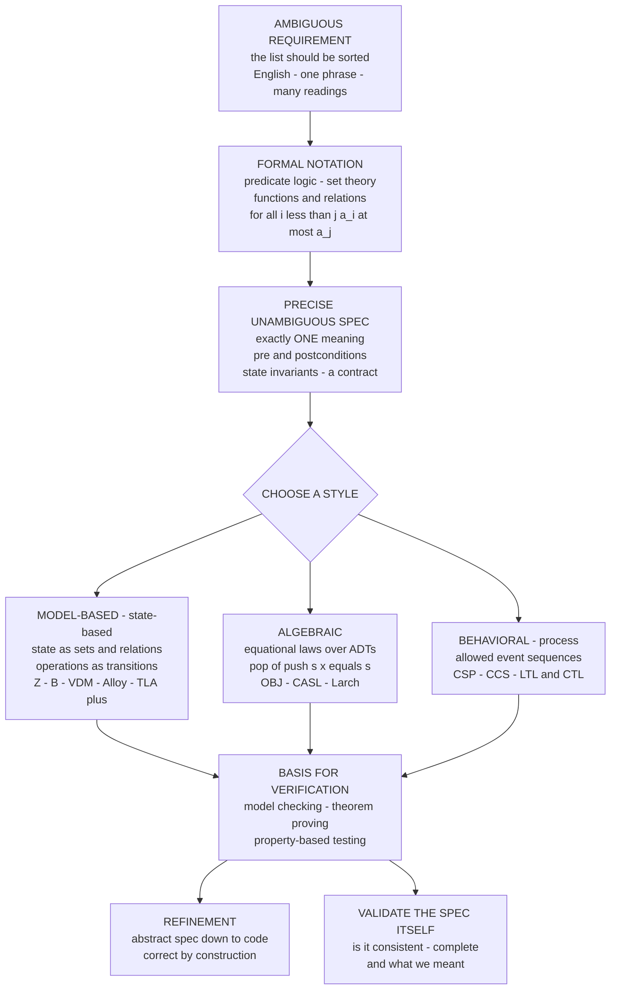

# 📐 Formal Specification Languages

> [!abstract] TL;DR
> A **formal specification language** replaces ambiguous English requirements with **mathematics** — logic, set theory, functions, and relations — so a system's intended behavior has **exactly one meaning**: unambiguous to every stakeholder, and mechanically checkable by a tool. It is the *starting point* of formal methods: you cannot verify code against a spec you never wrote down precisely. The field splits into three styles. **Model-based / state-based** notations describe the system **state** (as sets, relations, functions) and its **operations** as transitions with **pre/postconditions and invariants** — this is **Z** (schemas), the **B-Method** (abstract machines refined to code), **VDM**, **Alloy** (relational logic with a bounded model-finder that hands you instant counterexamples), and **TLA+** (Lamport's state-machines-plus-temporal-logic for concurrency). **Algebraic** specs describe abstract data types by **equational laws** over operations — `pop(push(s, x)) = s` — with no underlying state model (OBJ, CASL, Larch). **Behavioral / process** specs constrain **allowable event sequences and interaction** — CSP, CCS, and temporal logics (LTL/CTL). Every style is **declarative** (says *what*, not *how*) and forms the **contract** that verification and refinement then consume — but the spec itself can be wrong, incomplete, or inconsistent, so it too must be validated.

---

## Intuition

**Analogy — a blueprint, not a wish.** A builder cannot work from *"make the rooms big enough and put the stairs somewhere sensible."* That sentence means a different thing to every reader, and no inspector can ever declare it *satisfied* or *violated*. A **blueprint** replaces it with precise geometry: this wall is 4.2 metres, this beam bears this load, the stairs rise at exactly this angle. The precision is not bureaucracy — it is the *whole point*: it lets a builder construct without guessing and an inspector check without arguing.

A **formal specification is the blueprint for a program.** Instead of the ambiguous requirement *"the list should be sorted"* — which one reader takes to allow duplicates, another to require stability, another to permit an empty result — you write an **unambiguous mathematical statement**: *"for all `i` less than `j`, the element at position `i` is at most the element at position `j`, and the output is a permutation of the input."* That sentence means exactly **one** thing to everyone, and a machine can check a candidate program against it. The precision that makes the spec *checkable* is exactly what natural language throws away — so it is exactly what a specification language is built to preserve.

---

## How It Works

### Core Mechanics

1. **Start from an ambiguous requirement.** Real requirements arrive as prose: *"users can't withdraw more than their balance,"* *"the buffer never overflows,"* *"messages are delivered in order."* Each is open to multiple readings and has no test for whether an implementation *conforms*.
2. **Rewrite in mathematics.** A specification language supplies a fixed vocabulary — **predicate logic** (∀, ∃, ⇒), **set theory** (∈, ⊆, ∪, relations, functions), and arithmetic — with a single, standard **meaning**. The requirement becomes a formula: `withdraw(a) requires a ≤ balance` and `balance' = balance − a`.
3. **Pin down state and operations.** In a **model-based** spec you declare the **state space** (a set of variables constrained by a **state invariant** that must hold in every reachable state), plus each **operation** as a relation between the *before* state and the *after* state (marked `x'`), guarded by a **precondition** and guaranteeing a **postcondition**.
4. **Get one interpretation.** Because the notation has formal **semantics**, the spec now means *exactly one thing*. It is simultaneously a **contract** between stakeholders (everyone reads the same guarantee) and a **reference** against which any implementation is either correct or not.
5. **Choose the style that fits the problem.** **Model-based** for data-rich state (Z, B, VDM, Alloy, TLA+); **algebraic** when the *laws relating operations* matter more than any concrete representation (`top(push(s, x)) = x`); **behavioral/process** when the *ordering of events and interaction* is the essence (CSP, temporal logic).
6. **Feed verification and refinement.** The spec is not the destination. It is the **premise** for the next steps: **verification** (model checking, theorem proving, or property-based testing checks that behavior meets the spec) and **refinement** (systematically transforming an abstract spec into executable code that provably preserves it — *correctness by construction*).

A crucial distinction runs through all of this: a **property specification** states properties the system must satisfy (safety: *nothing bad happens*; liveness: *something good eventually happens*), while an **operational / model specification** gives a concrete abstract model whose behavior *is* the spec. And specs may be **executable** (you can run them or test against them) or **non-executable** (pure declarative constraints) — property-based testing is the bridge that makes many declarative specs checkable.

### Flow / Architecture



---

## Key Concepts

**Secondary (explain to a curious beginner).**
- A **formal specification** is a precise, mathematical description of what a program must do — a blueprint instead of a vague wish.
- It is **declarative**: it states *what* must be true, not *how* to achieve it.
- A **precondition** is what must hold before an operation runs; a **postcondition** is what the operation promises afterward; an **invariant** is a fact that stays true the whole time.
- The payoff is a **single interpretation**: everyone reads the same meaning, and a machine can check it.

**Undergraduate (requires a CS background).**
- **Model-based specification** (Z, B, VDM, TLA+, Alloy): describe the **state** as sets/relations/functions constrained by an **invariant**, and each **operation** as a before/after relation with pre/postconditions. Z organizes this into **schemas**; the **B-Method** adds stepwise **refinement** from abstract machine to code.
- **Algebraic specification**: define an abstract data type purely by **equational laws** relating its operations (`isEmpty(push(s, x)) = false`), with no chosen representation — the same laws hold for an array-backed or list-backed stack.
- **Behavioral / process specification**: constrain the **sequences of events** and interaction — **CSP** and **CCS** for communicating processes, **temporal logic** (LTL/CTL) for "always / eventually" properties over executions.
- **Safety vs liveness**: safety says *nothing bad ever happens* (violated by a finite prefix); liveness says *something good eventually happens* (violated only by an infinite run).

**Graduate (system-level and foundational thinking).**
- **Property specs vs operational/model specs**: the same requirement can be stated as *properties the system must satisfy* or as *an abstract model whose behavior is the spec*; TLA+ deliberately unifies both (a spec is itself a temporal formula).
- **Bounded vs unbounded analysis**: **Alloy**'s model finder checks all instances up to a size bound (fast, gives counterexamples, "small scope hypothesis"); **TLA+**'s TLC does exhaustive state-space model checking; theorem provers (Isabelle, Coq, PVS) prove over the *unbounded* domain but need human guidance.
- **Executable vs non-executable specs**: declarative specs may not be runnable, yet **property-based testing** turns a postcondition into an oracle that samples the input space — a practical bridge from spec to check (QuickCheck, Hypothesis).
- **The spec can be wrong**: consistency (no contradictions), completeness (all cases covered), and *validity* (it captures what we actually meant) are separate obligations — a vacuous precondition (`false`) or trivial postcondition (`true`) is "satisfiable" by anything. **Specification validation** is a first-class activity, not an afterthought.

---

## Python Demo

We treat a specification as an **executable predicate** and watch it earn its keep. Part **(a)** encodes the full postcondition of a sort — `is_sorted` **AND** `is_permutation` — as a Python predicate, then runs a **correct** implementation and a **buggy** one against thousands of random inputs, letting the spec-predicate *catch* the buggy one (property-based testing as an executable specification). Part **(b)** builds a **state model** of a bounded buffer with a **state invariant** `0 ≤ size ≤ CAP` and `push`/`pop` **pre/postconditions**, then runs a random operation sequence through a **guarded** executor (honors preconditions) and a **buggy** one (ignores them), plotting an **invariant-holds timeline** that flags every violation. Uses `numpy` + `matplotlib`.

```python
# A formal specification, made executable and checkable.
# (a) SPEC AS PREDICATE:   sort postcondition = is_sorted AND is_permutation,
#     run against a correct and a BUGGY sort over many inputs; count violations.
# (b) PRE/POST + INVARIANT: bounded-buffer state model with invariant 0 <= size <= CAP,
#     run a guarded (correct) and an unguarded (buggy) executor; plot the invariant timeline.
import numpy as np
import matplotlib.pyplot as plt
from collections import Counter

rng = np.random.default_rng(7)

# ============================================================
# PART (a): THE SORT SPECIFICATION AS AN EXECUTABLE PREDICATE
#   Postcondition (the WHOLE contract of a sort, declaratively):
#     result is sorted  AND  result is a permutation of the input.
# ============================================================
def is_sorted(xs):
    return all(xs[i] <= xs[i + 1] for i in range(len(xs) - 1))

def is_permutation(original, result):
    return Counter(original) == Counter(result)

def sort_spec(original, result):
    """Formal postcondition: BOTH conjuncts must hold."""
    return is_sorted(result) and is_permutation(original, result)

def correct_sort(xs):
    return sorted(xs)                       # satisfies the spec on every input

def buggy_sort(xs):
    # ONE bubble pass: floats the largest to the end but never repeats,
    # so most non-trivial inputs come out only partially sorted.
    a = list(xs)
    for i in range(len(a) - 1):
        if a[i] > a[i + 1]:
            a[i], a[i + 1] = a[i + 1], a[i]
    return a

# Property-based testing: run the spec-predicate over MANY random inputs.
N_TESTS = 2000
correct_violations = buggy_violations = 0
buggy_fail_sorted = buggy_fail_perm = 0
for _ in range(N_TESTS):
    n = int(rng.integers(0, 12))
    xs = rng.integers(0, 20, size=n).tolist()
    if not sort_spec(xs, correct_sort(xs)):
        correct_violations += 1
    r_bug = buggy_sort(xs)
    if not sort_spec(xs, r_bug):
        buggy_violations += 1
        buggy_fail_sorted += (not is_sorted(r_bug))
        buggy_fail_perm += (not is_permutation(xs, r_bug))

print(f"[sort spec] correct impl violations: {correct_violations}/{N_TESTS}")
print(f"[sort spec] buggy   impl violations: {buggy_violations}/{N_TESTS}")

# ============================================================
# PART (b): PRE/POST + STATE INVARIANT for a BOUNDED BUFFER
#   State:      size in 0..CAP
#   INVARIANT:  0 <= size <= CAP        (must hold after EVERY operation)
#   push: pre size < CAP   post size' = size + 1
#   pop : pre size > 0     post size' = size - 1
# ============================================================
CAP = 5

def invariant_ok(size):
    return 0 <= size <= CAP

def step(size, op, guard):
    """guard=True honors preconditions (correct); guard=False ignores them (buggy)."""
    if op == "push":
        if guard and size >= CAP:          # precondition size < CAP refuses overflow
            return size
        return size + 1
    else:  # pop
        if guard and size <= 0:            # precondition size > 0 refuses underflow
            return size
        return size - 1

ops = rng.choice(["push", "pop"], size=40, p=[0.6, 0.4])   # one shared sequence

def simulate(guard):
    size, sizes, inv = 0, [], []
    for op in ops:
        size = step(size, op, guard)
        sizes.append(size)
        inv.append(invariant_ok(size))
    return np.array(sizes), np.array(inv, dtype=bool)

sizes_ok,  inv_ok  = simulate(guard=True)     # honors pre/postconditions
sizes_bug, inv_bug = simulate(guard=False)    # ignores preconditions -> buggy
print(f"[buffer] guarded invariant violations: {(~inv_ok).sum()}")
print(f"[buffer] buggy   invariant violations: {(~inv_bug).sum()}")

# ============================================================
# VISUALIZE
# ============================================================
fig, ax = plt.subplots(2, 2, figsize=(13, 9))

# (a) spec-violation counts: correct vs buggy sort
bars = ax[0, 0].bar(["correct_sort", "buggy_sort"],
                    [correct_violations, buggy_violations],
                    color=["#55A868", "#C44E52"])
ax[0, 0].set_title("Sort-spec violations over 2000 random inputs")
ax[0, 0].set_ylabel("inputs failing  is_sorted AND is_permutation")
for b, v in zip(bars, [correct_violations, buggy_violations]):
    ax[0, 0].text(b.get_x() + b.get_width() / 2, v + 2, str(v),
                  ha="center", fontweight="bold")

# (b) which conjunct of the spec the buggy sort breaks
ax[0, 1].bar(["not is_sorted", "not is_permutation"],
             [buggy_fail_sorted, buggy_fail_perm], color=["#DD8452", "#8172B3"])
ax[0, 1].set_title("Which clause of the sort spec buggy_sort breaks")
ax[0, 1].set_ylabel("count of failing inputs")

# (c) bounded-buffer size trajectory with the legal band [0, CAP]
t = np.arange(len(ops))
ax[1, 0].axhspan(0, CAP, color="#DDEEDD", label="legal band  0..CAP")
ax[1, 0].step(t, sizes_ok,  where="post", color="#55A868", lw=2, label="guarded (honors pre)")
ax[1, 0].step(t, sizes_bug, where="post", color="#C44E52", lw=2, label="buggy (ignores pre)")
ax[1, 0].axhline(CAP, ls="--", color="gray"); ax[1, 0].axhline(0, ls="--", color="gray")
ax[1, 0].set_title("Bounded-buffer size across operations")
ax[1, 0].set_xlabel("operation index"); ax[1, 0].set_ylabel("size")
ax[1, 0].legend(fontsize=8)

# (d) invariant-holds timeline for the buggy executor, flagging violations
ax[1, 1].plot(t, inv_bug.astype(int), drawstyle="steps-post", color="#4C72B0", lw=1.5)
viol = t[~inv_bug]
ax[1, 1].scatter(viol, np.zeros_like(viol), marker="x", s=90, color="#C44E52",
                 zorder=5, label="INVARIANT VIOLATED")
ax[1, 1].set_ylim(-0.2, 1.2); ax[1, 1].set_yticks([0, 1])
ax[1, 1].set_yticklabels(["broken", "holds"])
ax[1, 1].set_title("Invariant-holds timeline (buggy executor)")
ax[1, 1].set_xlabel("operation index"); ax[1, 1].legend(fontsize=8)

fig.suptitle("Specifications as executable predicates: sort postcondition + buffer invariant",
             fontsize=14)
fig.tight_layout()
plt.savefig("formal_spec_demo.png", dpi=120)
print("Saved plot to formal_spec_demo.png")
```

**What it shows.** The sort **postcondition** — a two-line declarative predicate — passes `correct_sort` on *all* 2000 inputs and catches `buggy_sort` on the overwhelming majority, with the breakdown revealing it fails the `is_sorted` clause (a single bubble pass leaves inputs unsorted) while still being a permutation. That is **property-based testing acting as an executable specification**: the spec is the oracle, no hand-written expected outputs required. The buffer half shows the value of **invariants with pre/postconditions**: the guarded executor keeps `size` inside the legal band forever, while the buggy one — ignoring the `push` precondition — pushes past `CAP` and the **invariant-holds timeline lights up red** exactly where the state escapes `0 ≤ size ≤ CAP`. A production tool (TLA+/TLC, Alloy) replaces the *random* operation sequence with an *exhaustive* search over all reachable states.

---

## Real-World Applications

> **Amazon Web Services and TLA+.** AWS engineers write **TLA+** (and its PlusCal dialect) specifications of core distributed protocols — S3, DynamoDB, EBS, and internal replication and locking systems. Lamport's model checker **TLC** explored state spaces that revealed subtle concurrency bugs *in the design* — sequences of steps no human reviewer or test suite had imagined — **before** a line of production code was written. The spec is the state machine plus temporal (safety and liveness) properties; verification is exhaustive model checking of that spec.

- **Alloy for design exploration.** Daniel Jackson's **Alloy** uses relational logic plus a bounded SAT-backed model finder to give *instant counterexamples* to design assertions — used to check security policies, network configurations, Mars-rover flash file-system designs, and access-control models where a concrete violating instance is worth more than a proof.
- **The B-Method in rail safety.** **B** and **Event-B** drive safety-critical rail systems: the **Paris Métro Line 14** and many CBTC signalling systems were specified as abstract machines and **refined** down to provably correct code, with proof obligations discharged by the Atelier B / Rodin tools — a live example of *correctness by construction*.
- **Z and VDM in industry standards.** **Z notation** specified IBM's CICS transaction manager and the Mondex smart-card purse (a Common Criteria EAL-certified spec); **VDM** underpins tooling for control and financial systems. Both center on set-theoretic state plus operation schemas.
- **Algebraic specs and ADT reasoning.** Equational, algebraic specifications (OBJ, CASL, Larch) formalize the **laws** of abstract data types and interfaces, feeding term-rewriting and equational reasoning tools that check a stack, queue, or map obeys its algebraic contract independent of representation.

---

## Common Pitfalls

- **Confusing the three styles.** **Model-based** (Z, B, VDM, Alloy, TLA+) describes *state + operations over sets and relations*; **algebraic** describes *equational laws over ADTs* with no state model; **behavioral/process** (CSP, CCS, temporal logic) describes *allowed event sequences*. Picking the wrong style — e.g. an algebraic spec for a fundamentally stateful, concurrent protocol — makes the spec fight the problem.
- **Property vs operational confusion.** A **property spec** ("no two writers hold the lock at once") and an **operational/model spec** (an abstract machine whose runs define the behavior) answer different questions. Treating a partial list of properties as a *complete* model silently under-specifies the system.
- **Writing *how* instead of *what*.** Specifications are **declarative**. Sneaking implementation choices ("use a hash map," "iterate left to right") into a spec over-constrains it, rules out valid implementations, and defeats refinement — which needs freedom to choose the representation.
- **Missing pre/postconditions or invariants.** An operation with no precondition claims to work in *every* state (often false); a state with no invariant permits *illegal* states. Specs need explicit **preconditions, postconditions, and state invariants** to be meaningful and refinable.
- **Trusting a spec you never validated.** The spec can itself be **wrong, incomplete, or inconsistent**. A contradictory spec is satisfied by nothing; a vacuous precondition (`false`) or trivial postcondition (`true`) "verifies" any code. **Validate the spec** (consistency + completeness + "is this what we meant?") before verifying against it — garbage spec in, garbage guarantee out.
- **Over- vs under-specification.** **Over**-specifying bakes in accidental detail and forbids legitimate implementations; **under**-specifying leaves behavior open where it must be pinned down. Aim for *just enough* constraint — the observable contract, nothing more.
- **Assuming every spec is executable.** Many declarative specs are **non-executable** by design. Do not conflate "formal" with "runnable" — use **property-based testing** as the bridge when you need to *check* a declarative postcondition against real code.

---

## Related Concepts

- [[Axiomatic_Semantics_and_Hoare_Logic]] — the pre/postcondition + invariant discipline (`{P} C {Q}`) that turns a specification into a *provable* correctness statement over code.
- [[First_Order_Predicate_Logic]] — the assertion language every model-based spec is written in: quantifiers, predicates, and relations over a domain.
- [[Axiomatic_Set_Theory_ZFC]] — the sets, relations, and functions that Z, B, and VDM use to model system state.
- [[Modal_and_Temporal_Logic]] — LTL/CTL "always / eventually" operators behind behavioral specs and the temporal half of TLA+.
- [[Concurrency_and_Process_Calculi]] — CSP and CCS, the process-algebra style for specifying allowable event sequences and interaction.
- [[Test_Case_Design]] — property-based testing, the practical bridge that makes a declarative postcondition an executable oracle against real code.

*(Formal_Methods vault siblings referenced in prose, to be built alongside this note: `Formal_Methods_Overview`, `Set_Based_Specification_Z_and_B`, `Algebraic_Specification_and_Abstract_Data_Types`, `Refinement_and_Correctness_by_Construction`, `State_Based_Modeling_and_Invariants`.)*

---

## Review Questions

1. **(Secondary)** The requirement *"the search function should return the right result quickly"* is impossible to verify as written. Rewrite the *"right result"* part as a precise postcondition for a function that searches a sorted list for a value, and explain in one sentence why your version is checkable but the original is not.
2. **(Undergraduate)** A stack ADT can be specified **algebraically** (`pop(push(s, x)) = s`, `top(push(s, x)) = x`, `isEmpty(newStack) = true`) or **model-based** (state = a sequence, `push`/`pop` as operations with pre/postconditions over that sequence). Give one advantage of each style, and identify a situation where you would strongly prefer one over the other.
3. **(Graduate)** You have a TLA+ spec of a distributed lock and TLC reports *no violations up to 6 nodes and depth 20*. (a) What has and has **not** been established? (b) Distinguish the **safety** and **liveness** obligations you would want to state. (c) Explain why "the model checker found no counterexample" is *not* the same as "the specification is correct," and name the separate activity that addresses the gap.

---

## Sources

- J. M. Spivey, *The Z Notation: A Reference Manual*, 2nd ed., Prentice Hall, 1992 — the standard reference for schema-based, set-theoretic model specification. <https://spivey.oriel.ox.ac.uk/corner/Z_Reference_Manual>
- Jean-Raymond Abrial, *The B-Book: Assigning Programs to Meanings*, Cambridge University Press, 1996 — abstract machines and refinement from spec to code.
- Daniel Jackson, *Software Abstractions: Logic, Language, and Analysis*, 2nd ed., MIT Press, 2012 — Alloy, relational logic, and bounded model finding. <https://alloytools.org/book.html>
- Leslie Lamport, *Specifying Systems: The TLA+ Language and Tools for Hardware and Software Engineers*, Addison-Wesley, 2002 — state machines plus temporal logic for concurrent and distributed systems. <https://lamport.azurewebsites.net/tla/book.html>
- Jim Woodcock and Jim Davies, *Using Z: Specification, Refinement, and Proof*, Prentice Hall, 1996 — a working introduction to Z and refinement.

---

#formal-methods #specification #z-notation #alloy #tla-plus
