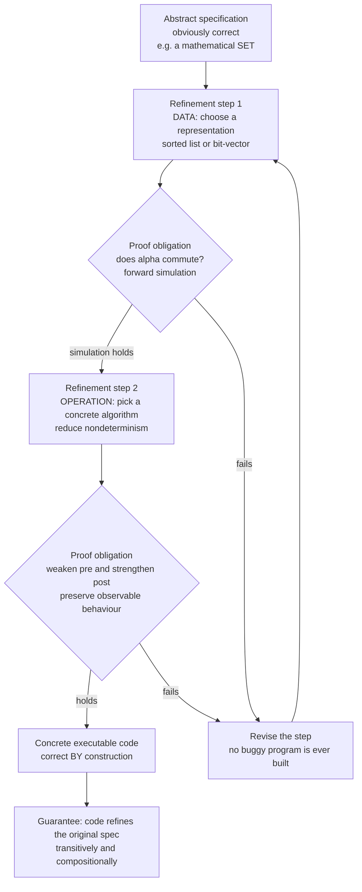

# 🏗️ Refinement and Correctness by Construction

> [!abstract] TL;DR
> **Refinement** turns program development upside-down. Instead of *writing code and then hunting for bugs*, you **start from an abstract, obviously-correct specification** and transform it in small steps toward efficient executable code — where **every step is proved to preserve the specified behaviour**. Two kinds of step do all the work: **data refinement** replaces an abstract data type (a mathematical `set`) by a concrete representation (a bit-vector, a hash table), linked by an **abstraction / retrieve function** and justified by a **simulation** relation (the *commuting-diagram* condition); **operation / algorithmic refinement** replaces a nondeterministic or abstract operation by a more deterministic, more defined implementation. The **refinement calculus** (Back, Morgan, von Wright) makes "`S` is refined by `T`" a formal order on a lattice of programs-and-specs — `T` **weakens preconditions, strengthens postconditions, and reduces nondeterminism** — and supplies algebraic laws so you can *derive* code from a spec. The **B-method** and **Event-B** industrialise the idea (Paris Métro Line 14 signalling), discharging **proof obligations** at each layer. The payoff is **correctness by construction**: you never introduce a bug, because each transformation is proved faithful — the opposite of post-hoc [[Axiomatic_Semantics_and_Hoare_Logic|Hoare-logic]] verification of a finished program.

---

## Intuition

**Analogy — the architect, not the bricklayer.** An architect does not jump from *"I want a house"* straight to laying bricks. She moves through faithful stages: a **rough sketch** (three bedrooms, south-facing garden) → **floor plans** (room dimensions, where the load-bearing walls go) → **detailed engineering drawings** (rebar spacing, plumbing runs, electrical loads). Each drawing adds concrete, buildable detail, yet **every one is faithful to the original vision** — you can lay a plan over the sketch and check that nothing about the client's intent was violated. Nobody builds the house and *then* discovers it has two bedrooms instead of three.

**Refinement is this discipline for programs.** You begin with an **abstract specification** so simple it is *obviously* correct — a `set` is literally a mathematical set, "sort" literally means "the output is an ordered permutation of the input." Then you refine: choose a **data structure**, pin down an **algorithm**, resolve **nondeterministic choices**, add **control flow** — each step adding implementation detail while you **prove** it still does what the spec said. Because every step is provably faithful, the final runnable program is **correct by construction**. You never write a buggy program and then debug it; you **grow a correct one**, and the proof grows with it.

---

## How It Works

### Core mechanics

1. **Write an abstract specification.** State *what* must be true, using the richest available mathematics — sets, relations, functions, quantifiers over [[First_Order_Predicate_Logic|first-order logic]] — with **no concern for efficiency or representability**. This spec is your ground truth; it is small enough to inspect and believe.

2. **Apply a refinement step.** Add exactly one kind of implementation detail:
   - **Data refinement** — replace the abstract state space (a [[Set_Theory_and_Relations|mathematical set]]) by a **concrete representation** (a sorted array, a bit-vector, a [[HashMap_vs_HashSet|hash set]]). You supply a **retrieve / abstraction function** `α` mapping each concrete state back to the abstract state it stands for.
   - **Operation / algorithmic refinement** — replace an abstract, possibly nondeterministic operation (`choose any minimal element`) by a concrete, deterministic algorithm (`scan left to right, remember the first minimum`).

3. **Discharge the proof obligation.** Prove the step **preserves observable behaviour**. For data refinement the obligation is a **simulation** (a *commuting diagram*, see [[Diagrams_and_Commutativity]]): running the abstract operation on the abstract state must agree with *running the concrete operation and then abstracting* — for every reachable state, `α(concrete_op(c)) = abstract_op(α(c))`, and every observation returns the same answer. This is **forward simulation**; its dual, **backward simulation**, is needed when the concrete side resolves a choice the abstract side made later.

4. **Repeat until executable.** Each layer is more concrete than the last. Refinement is **transitive** (`S ⊑ T` and `T ⊑ U` give `S ⊑ U`) and **monotone** (refining a part refines the whole), so the chain composes into a single guarantee: the final code refines the original spec.

5. **The refinement order itself.** In the **refinement calculus**, `S ⊑ T` ("`S` is refined by `T`") means `T` is **more defined** (it works wherever `S` was required to — it may **weaken the precondition**) and **more deterministic** (its results are a subset of what `S` permitted — it **strengthens the postcondition** and **reduces nondeterminism**). Specifications and programs live together in one **lattice**; `⊑` is its partial order, with a bottom `abort` and a top `magic`. Algebraic **refinement laws** let you rewrite a spec into code the way you rewrite an algebraic expression — this is Morgan's *programming from specifications*.

### Flow / architecture



---

## Key Concepts

**Secondary (intuitive core).**
- **Specification vs implementation** — the *what* (a set is a set) versus the *how* (a bit-vector). Refinement is a disciplined bridge from one to the other.
- **Small faithful steps** — like an architect moving sketch → plan → blueprint, each step adds detail without breaking the promise.
- **Correct by construction** — you *prove as you build*, so there is never a finished-but-buggy program to debug.

**Undergraduate (working machinery).**
- **Data refinement** — swap the representation of a data type; link concrete to abstract by a **retrieve / abstraction function** `α`.
- **Forward simulation (the commuting diagram)** — for every operation, *abstract-then-observe* equals *concrete-then-abstract-then-observe*. If the square commutes for all reachable states, the representation is provably faithful.
- **Operation / algorithmic refinement** — resolve nondeterminism and add control flow while preserving the input/output relation.
- **The refinement order `⊑`** — "more defined + more deterministic": **weaken the precondition, strengthen the postcondition**, shrink the set of allowed outputs.
- **Proof obligations** — the concrete verification conditions a tool generates per step; discharge them all and the layer is sound.

**Graduate (theory and practice).**
- **The refinement calculus** (Back 1978, Morgan 1990, von Wright) — a **lattice of predicate-transformers / commands** with `abort` (⊥) and `magic` (⊤); `⊑` is refinement, laws are proved once and reused, and **monotonicity** of every constructor gives compositional refinement.
- **Backward simulation and completeness** — forward simulation alone is *incomplete*; some correct data refinements need backward (downward) simulation, or an intermediate *history/prophecy* variable. Together they are complete (de Roever & Engelhardt).
- **Gluing invariant** — data refinement carries an invariant relating concrete and abstract state (the retrieve relation may be many-to-one and partial); the obligation is initialisation + applicability + correctness for each operation.
- **The methods** — **VDM** and Wirth/Dijkstra **stepwise refinement** are the ancestors; the **B-method** and **Event-B** (Abrial) industrialise it: abstract machines refined through layers to `B0` (translatable to C/Ada), each refinement generating proof obligations discharged in **Atelier B** / **Rodin**.
- **Refinement vs post-hoc verification** — Hoare-logic proof (see [[Axiomatic_Semantics_and_Hoare_Logic]]) *checks a program after it exists*; refinement *interleaves design and proof* so a bug is never introduced in the first place.

---

## Python Demo

```python
# Correctness by construction, made concrete: DATA REFINEMENT of an abstract SET.
#
# ABSTRACT SPEC : a mathematical set, with add(x) and member(x).  (Obviously correct.)
# CONCRETE REPS : (1) a bit-vector over a fixed universe, (2) a sorted list.
# RETRIEVE MAP  : alpha(concrete_state) -> the abstract set it represents.
# CHECK         : forward simulation / the COMMUTING DIAGRAM --
#                 for every operation, running the concrete op then abstracting
#                 must equal running the abstract op, AND observations must agree.
# We run many random operation sequences and confirm observable behaviour matches;
# a deliberately BUGGY representation shows the simulation check has teeth.
import numpy as np
import matplotlib.pyplot as plt
import bisect

UNIVERSE = 16  # elements live in 0..15

# ---------- ABSTRACT SPECIFICATION (the model of record) ----------
class AbstractSet:
    def __init__(self):        self.s = set()
    def add(self, x):          self.s.add(x)
    def member(self, x):       return x in self.s

# ---------- CONCRETE REFINEMENT 1: bit-vector over the universe ----------
class BitVectorSet:
    def __init__(self, n):     self.bits = np.zeros(n, dtype=np.int8)
    def add(self, x):          self.bits[x] = 1
    def member(self, x):       return bool(self.bits[x])

# ---------- CONCRETE REFINEMENT 2: sorted list (invariant: sorted, no dups) ----------
class SortedListSet:
    def __init__(self):        self.data = []
    def add(self, x):
        i = bisect.bisect_left(self.data, x)
        if i == len(self.data) or self.data[i] != x:
            self.data.insert(i, x)
    def member(self, x):
        i = bisect.bisect_left(self.data, x)
        return i < len(self.data) and self.data[i] == x

# ---------- A BUGGY "refinement" that silently drops large elements ----------
class BuggySet:
    def __init__(self, n):     self.bits = np.zeros(n, dtype=np.int8)
    def add(self, x):
        if x < 12:             # BUG: forgets to store x >= 12
            self.bits[x] = 1
    def member(self, x):       return bool(self.bits[x])

# ---------- RETRIEVE / ABSTRACTION FUNCTIONS: concrete state -> abstract set ----------
def alpha_bits(c):   return set(int(i) for i in np.nonzero(c.bits)[0])
def alpha_sorted(c): return set(c.data)

# ---------- The forward-simulation / commuting-diagram driver ----------
def simulate(make_concrete, alpha, n_steps=200, seed=0):
    rng = np.random.default_rng(seed)
    A, C = AbstractSet(), make_concrete()
    state_ok = np.zeros(n_steps, dtype=bool)  # alpha(C) == A.s  (states commute)
    obs_ok   = np.ones(n_steps,  dtype=bool)  # member outputs agree (obs commute)
    abs_size = np.zeros(n_steps, dtype=int)
    con_size = np.zeros(n_steps, dtype=int)
    for t in range(n_steps):
        x = int(rng.integers(0, UNIVERSE))
        if rng.random() < 0.55:               # an 'add' step
            A.add(x); C.add(x)
        else:                                  # a 'member' observation step
            obs_ok[t] = (A.member(x) == C.member(x))
        state_ok[t] = (alpha(C) == A.s)        # <-- the commuting-diagram check
        abs_size[t] = len(A.s)
        con_size[t] = len(alpha(C))
    return state_ok, obs_ok, abs_size, con_size

reps = {
    "BitVector (correct)":  (lambda: BitVectorSet(UNIVERSE), alpha_bits),
    "SortedList (correct)": (lambda: SortedListSet(),        alpha_sorted),
    "Buggy (drops x>=12)":  (lambda: BuggySet(UNIVERSE),     alpha_bits),
}

# ---------- Aggregate agreement over many random operation sequences ----------
N_SEQ = 200
agreement = {}
print("Forward-simulation check over", N_SEQ, "random operation sequences:")
for name, (make, alpha) in reps.items():
    frac = np.empty(N_SEQ)
    for seed in range(N_SEQ):
        s_ok, o_ok, *_ = simulate(make, alpha, n_steps=200, seed=seed)
        frac[seed] = float((s_ok & o_ok).mean())   # both squares commute every step
    agreement[name] = frac
    mismatches = int(np.sum(frac < 1.0))
    print(f"  {name:22s}: mean agreement {frac.mean():.3f} | "
          f"sequences containing a mismatch: {mismatches}/{N_SEQ}")

# ---------- Stepwise traces for one correct and one buggy run ----------
ok_state, _, ok_abs, ok_con = simulate(reps["BitVector (correct)"][0],
                                       reps["BitVector (correct)"][1], seed=7)
bug_state, bug_obs, _, _     = simulate(reps["Buggy (drops x>=12)"][0],
                                        reps["Buggy (drops x>=12)"][1], seed=7)

# ---------- Visualisation ----------
fig, ax = plt.subplots(1, 3, figsize=(16, 4.6))

# (1) Abstract vs concrete size agree, step for step (a correct refinement)
ax[0].plot(ok_abs, label="abstract |A|", lw=3, color="#1f77b4")
ax[0].plot(ok_con, label="alpha(concrete)", lw=1.4, ls="--", color="#ff7f0e")
ax[0].set_title("Correct data refinement:\nabstract and concrete agree at every step")
ax[0].set_xlabel("operation #"); ax[0].set_ylabel("set size"); ax[0].legend()

# (2) Commuting-diagram agreement per representation
names = list(agreement.keys())
means = [agreement[n].mean() for n in names]
colors = ["#2ca02c", "#2ca02c", "#d62728"]
ax[1].bar(range(len(names)), means, color=colors)
ax[1].axhline(1.0, color="gray", ls=":", lw=1)
ax[1].set_xticks(range(len(names)))
ax[1].set_xticklabels([n.split(" ")[0] for n in names], rotation=0)
ax[1].set_ylim(0.0, 1.08)
ax[1].set_title("Simulation holds -> agreement = 1.0\n(the buggy rep is caught)")
ax[1].set_ylabel("mean step-wise agreement")
for i, m in enumerate(means):
    ax[1].text(i, m + 0.02, f"{m:.2f}", ha="center", fontsize=10)

# (3) Stepwise commuting-diagram check: correct never breaks, buggy does
ax[2].step(range(len(ok_state)),  ok_state.astype(int) + 1.1,
           where="mid", color="#2ca02c", label="BitVector: diagram commutes")
ax[2].step(range(len(bug_state)), bug_state.astype(int),
           where="mid", color="#d62728", label="Buggy: diagram fails")
ax[2].set_yticks([0, 1, 1.1, 2.1])
ax[2].set_yticklabels(["fail", "hold", "fail", "hold"])
ax[2].set_title("Per-step alpha(concrete) == abstract ?\n(1 = square commutes)")
ax[2].set_xlabel("operation #"); ax[2].legend(loc="center right", fontsize=8)

plt.tight_layout()
plt.savefig("refinement_simulation.png", dpi=120)
print("\nSaved refinement_simulation.png")
print("Reading: correct representations commute at 100% -- they are provably faithful,")
print("so any program built on them is correct BY CONSTRUCTION; the buggy rep is exposed")
print("the moment alpha(concrete) diverges from the abstract set.")
```

**What the demo shows.** Both `BitVectorSet` and `SortedListSet` are *data refinements* of the abstract `set`: their `α` maps every concrete state back to exactly the abstract set it represents, and across 200 random operation sequences the **commuting diagram holds at every single step** (mean agreement `1.000`, zero mismatches). That is a machine-checked witness of **forward simulation** — the essence of "the representation is correct." The `BuggySet` breaks the square as soon as an element `x >= 12` is added: `α(concrete)` drops below the abstract set and the check flags it — exactly the mismatch a per-step proof obligation would refuse to discharge. Correct-by-construction is not faith; it is *this* square commuting, proved once per operation instead of tested after the fact.

---

## Real-World Applications

- **Railway signalling (the flagship).** The **B-method** was used by Alstom/Siemens to develop the safety-critical driverless signalling of **Paris Métro Line 14 (Météor)** and later systems — an abstract Event-B model refined layer by layer to `B0` code, with **tens of thousands of proof obligations** discharged in **Atelier B**. Decades of operation with **zero safety failures** attributable to a specification/coding defect in the proved core.
- **Aerospace and rail worldwide.** Event-B and the B-method (with the **Rodin** platform) are applied to CBTC train controllers, platform-screen-door logic, and automotive safety functions where a bug is measured in lives, not downtime.
- **Verified operating-system kernels.** The **seL4** microkernel proof is a refinement chain in Isabelle/HOL: an abstract spec ⊑ an executable spec ⊑ the C implementation, each link a **forward-simulation** proof — the kernel is *correct by construction* against its abstract model.
- **Verified compilers.** **CompCert** proves a *simulation* between source and generated assembly for each pass; correctness is compositional refinement, not testing (see [[Verified_and_Certified_Languages]]).
- **Everyday abstract-data-type reasoning.** Every time a library documents that its `HashSet` *behaves like a mathematical set*, it is implicitly claiming a data refinement with `α = "the set of stored keys"`; property-based testing (QuickCheck-style *model-based testing*) is the lightweight, unproved cousin of the simulation check in the demo.

---

## Common Pitfalls

- **Confusing the two kinds of refinement.** **Data refinement** changes the *representation* of state (set → bit-vector), justified by an abstraction/retrieve relation plus simulation. **Operation / algorithmic refinement** changes *behaviour* (nondeterministic spec → deterministic algorithm), justified by weakening the precondition and strengthening the postcondition. A real derivation interleaves both; conflating them makes the proof obligations look impossible.
- **Getting the direction of `⊑` backwards.** Refinement makes a program **more defined and more deterministic** — the *implementation* is the refined (bigger, lower) element, the *spec* is the abstract (freer) one. `S ⊑ T` reads "`T` is a valid implementation of `S`," not the reverse. Reducing nondeterminism is *allowed*; adding it is not.
- **Assuming forward simulation is enough.** Forward (upward) simulation is **incomplete**: some correct data refinements — typically where the concrete side commits to a choice the abstract side deferred — require **backward simulation** or an auxiliary history/prophecy variable. If your forward-simulation proof stubbornly fails on a correct refinement, you may need the backward direction, not a different `α`.
- **A wrong or too-weak retrieve function.** The abstraction function must actually pin the gluing invariant; a many-to-one or partial `α` still has to make *every* operation's square commute for *every reachable* concrete state. Forgetting reachability (proving over impossible concrete states) or ignoring initialisation is a classic gap.
- **Skipping a proof obligation.** Correctness-by-construction is only as strong as the *weakest discharged obligation*. An un-proved step (or one "checked" by a few examples) silently degrades the whole chain to post-hoc testing — precisely the verify-after-the-fact regime refinement was meant to replace.
- **Treating refinement as post-hoc verification.** The point is to **interleave design and proof**: grow the program *and* its correctness argument together. Writing the code first and reverse-engineering a refinement story afterward throws away the method's main benefit — never introducing the bug at all.

> [!note] Sibling notes (Formal Methods vault)
> This note sits beside *Set-Based Specification (Z and B)*, *Formal Specification Languages*, *State-Based Modeling and Invariants*, *Hoare Logic and Axiomatic Semantics*, and *Weakest Preconditions and Predicate Transformers*. Refinement is the *bridge* those specification notes lead to: you specify with sets/states/invariants, then refine toward code, discharging weakest-precondition obligations at each step.

---

## Related Concepts

- [[Axiomatic_Semantics_and_Hoare_Logic]] — the **post-hoc** counterpart: it *verifies a finished program* with `{P} C {Q}` triples, whereas refinement *interleaves design and proof*; both share the precondition/postcondition machinery, and the weakest-precondition calculus is the engine of the refinement calculus.
- [[Denotational_Semantics]] — refinement is an **order on meanings**; the refinement lattice generalises the domain-theoretic ordering, and "`S ⊑ T`" is a semantic inequality between the objects two programs denote.
- [[Diagrams_and_Commutativity]] — the **commuting diagram** is *exactly* the forward-simulation condition; data refinement is the statement that a particular square commutes.
- [[Isomorphisms_and_Special_Morphisms]] — a simulation is a **structure-preserving map** (a morphism) between abstract and concrete state machines; refinement is a morphism, not an isomorphism (it may lose information, one direction only).
- [[First_Order_Predicate_Logic]] — the **assertion language** for pre/postconditions, invariants, and the gluing relation; discharging a proof obligation means proving a first-order (often higher-order) formula.
- [[Set_Theory_and_Relations]] — abstract specifications live in the world of **sets, relations, and functions**; the retrieve function `α` is a relation from concrete to abstract states.
- [[HashMap_vs_HashSet]] — a concrete `HashSet` is a **data refinement** of the mathematical set, with `α` = "the set of stored keys"; the demo's bit-vector is the same idea over a fixed universe.
- [[Verified_and_Certified_Languages]] — CompCert, seL4, and proof-carrying toolchains realise refinement/simulation at scale; the "certified" guarantee *is* a discharged refinement chain.
- [[Type_Systems_Fundamentals]] — a kindred **correct-by-construction** discipline: a well-typed program cannot "go wrong" in specified ways, the type-checker discharging obligations as you write, much as refinement discharges them as you derive.

---

## Review Questions

1. **(Secondary)** Explain, using the architect analogy, why a program grown by refinement is said to be "correct by construction" rather than "debugged into correctness." What is the analogue of the client's original sketch, and what is the analogue of an engineering drawing?
2. **(Undergraduate)** You refine an abstract `set` to a bit-vector over `0..15`. State the retrieve/abstraction function `α`, and write the **forward-simulation (commuting-diagram) obligation** for the `add(x)` operation. Why must it hold for *every reachable* concrete state, and what goes wrong if `α` is only checked on the initial state?
3. **(Graduate)** Given the specification `x := any value with x*x <= n` (a nondeterministic square-root-floor), (a) argue that the deterministic implementation `x := isqrt(n)` is a valid **operation refinement** in terms of *weaken-precondition / strengthen-postcondition / reduce-nondeterminism*; and (b) describe a data-refinement scenario in which **forward simulation fails but backward simulation succeeds**, and explain what feature of the concrete implementation forces the backward direction.

---

## Sources

- Carroll Morgan, *Programming from Specifications*, 2nd ed., Prentice Hall International, 1994. (The refinement calculus as a practical derivation method; freely available from the author.)
- Ralph-Johan Back & Joakim von Wright, *Refinement Calculus: A Systematic Introduction*, Springer (Graduate Texts in Computer Science), 1998.
- Jean-Raymond Abrial, *The B-Book: Assigning Programs to Meanings*, Cambridge University Press, 1996; and *Modeling in Event-B: System and Software Engineering*, Cambridge University Press, 2010.
- Willem-Paul de Roever & Kai Engelhardt, *Data Refinement: Model-Oriented Proof Methods and their Comparison*, Cambridge University Press, 1998. (Forward vs backward simulation, completeness.)
- Niklaus Wirth, "Program Development by Stepwise Refinement," *Communications of the ACM* 14(4), 1971. (The founding paper of the stepwise-refinement idea.)

---

#formal-methods #refinement #correctness-by-construction #data-refinement #simulation
