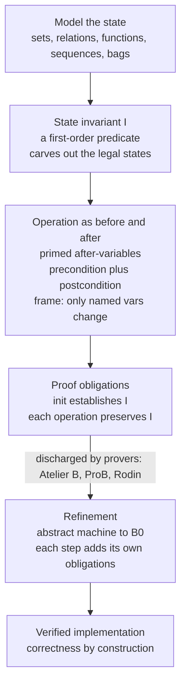

# 🧾 Set-Based Specification (Z and B)

> [!abstract] TL;DR
> **Set-based (model-based) specification** describes a software system as **pure mathematics**: its **state** is a bundle of **sets, relations, and functions**; a **state invariant** (a logical predicate) marks which states are legal; and each **operation** is written as a relation between the *before-state* and the *after-state* (using **primed** after-variables), with a **precondition** saying when it applies and a **postcondition** saying only *what changes*. **Z** (Spivey/Oxford) is the elegant **notation** for this — organizing specs into **schemas** with the `Δ`/`Ξ` conventions — while the **B-Method** (Abrial) is a full **method**: **abstract machines** are mechanically **refined** down to code (B0), every step generating **proof obligations** (initialization establishes the invariant; each operation preserves it) that tools like **Atelier B** and **ProB** discharge. This is *correctness by construction*, and it verified the driverless **Paris Metro Line 14**.

---

## Intuition

**Analogy:** Imagine describing a library not by writing any code, but by stating pure **facts** about it. You say: there is a *set* of books it holds; a *mapping* from each borrowed book to the member who has it; and a *rule* that no book is ever borrowed by two people at once and no book is simultaneously "on the shelf" and "checked out." Now you add an operation — "lend a book" — and you describe it by saying **only what changes**: this one book moves from the *available* set to the *borrowed* mapping, and **everything else stays exactly as it was**. You never say *how* to do it (no loops, no pointers); you state *what must be true afterward*, so precisely that a machine can check the lending rule can never be broken.

That is set-based specification. You model the system as mathematical **sets and relations**, you pin down its legality with an **invariant**, and you describe operations as **before/after snapshots** — precise enough that a tool proves every rule is preserved. This is the style behind **Z** and the **B-Method** that helped verify the trains running under Paris.

---

## How It Works

### Core Mechanics

1. **Model the state as mathematical objects.** Pick the right abstractions: a **set** for "the books we own," a **partial function** for "borrowed-by," a **relation** for "member likes genre," a **sequence** for an ordered log, a **bag** (multiset) for "copies in stock." The state is just a named tuple of these values — no implementation is committed.

2. **Constrain valid states with an invariant `I`.** The invariant is a **predicate** in first-order logic over the state variables (see [[First_Order_Predicate_Logic]]). Example: `available ∩ dom(borrowed) = ∅` and `available ∪ dom(borrowed) = books`. Only states satisfying `I` are "legal"; the invariant is the specification's notion of *correct*.

3. **Describe each operation as a before/after relation.** An operation relates the pre-state (unprimed variables `s`) to the post-state (**primed** variables `s'`). It has two parts:
   - **Precondition** — the states in which the operation is *defined* (a guard). Lending requires `book ∈ available`.
   - **Postcondition** — the effect, written as equations on primed variables: `available' = available \ {book}`, `borrowed' = borrowed ∪ {book ↦ member}`.

4. **Solve the framing problem — say what stays the same.** A spec that only lists what changes is dangerously ambiguous. You must state that everything *not* mentioned is unchanged. Z packages this: `Δ State` means "this operation *may* change the state," while `Ξ State` means "this operation *leaves the state unchanged*" (a pure query).

5. **Discharge proof obligations.** The specification is only *consistent* if you can prove:
   - **Initialization**: the initial state satisfies `I`.
   - **Invariant preservation**: for every operation, `I(s) ∧ pre(s) ∧ post(s, s') ⟹ I(s')`.
   These are the **proof obligations**. In B they are generated automatically and discharged by a prover.

6. **Refine toward code (the B-Method).** An **abstract machine** (state + invariant + operations) is rewritten as a more concrete machine — sets become arrays, non-determinism becomes choices — down to **B0**, an implementable subset that translates to C/Ada. Each refinement step generates *its own* proof obligations guaranteeing the concrete behaviour is a faithful realization of the abstract one: **correctness by construction**.

**Z vs B in one line.** *Z is a notation* — a rich mathematical language for writing the spec, read by humans and supported by proof tools, but not itself executable. *B is a method* — the same set-theoretic modeling *plus* a disciplined refinement pipeline and industrial tooling that carries the proof all the way to running code.

### Flow / Architecture



---

## Key Concepts

**Secondary (intuition-level)**
- **State as sets and mappings** — a system is modeled by *what it holds* (sets) and *how things relate* (maps), not by procedures.
- **Invariant** — a rule that must be true in every legal state; e.g. "a book is on the shelf **or** checked out, never both."
- **Operation = before/after** — you describe an action by comparing the picture before and the picture after.

**Undergraduate (mechanics-level)**
- **Relations and functions** — the state is built from `∈`, `⊆`, `∩`, domain/range, partial and total functions, and sequences (see [[Set_Theory_and_Relations]]).
- **Precondition / postcondition** — the guard that enables an operation and the primed-variable equations describing its effect.
- **The framing problem** — a spec must state what is *unchanged*; Z encodes this with `Δ` (may change state) and `Ξ` (leaves state fixed).
- **Z schemas** — the boxed unit of Z: a **state schema** declares variables + invariant; **operation schemas** import `Δ State`/`Ξ State`, add inputs `x?`, outputs `y!`, and primed after-variables. The **schema calculus** composes them with `∧`, `∨`, and schema piping.

**Graduate (foundations-level)**
- **Proof obligations** — mechanically generated verification conditions: *consistency* (initialization satisfies `I`), *invariant preservation* per operation, and *refinement correctness* per step.
- **Refinement** — a formal relation between an abstract machine and a concrete one (a *gluing invariant* links their states); B refines through intermediate machines to **B0** ⟶ code.
- **Abstract machines vs Event-B** — classic B centers on *operations called by an environment*; **Event-B** (Rodin) generalizes to *guarded events* for reactive/distributed systems, with the same invariant-preservation discipline.
- **Semantic underpinning** — operations denote predicate transformers / weakest preconditions; the whole edifice rests on **ZFC-style set theory** ([[Axiomatic_Set_Theory_ZFC]]) and first-order logic.

---

## Python Demo

We model a **library** as set-based state (a set of available books + a `borrowed` relation as a dict), define a **state invariant**, write `lend`/`return` as **guarded operations** (rejected when their precondition fails), and then run **proof-obligation-style checks** over many random states — comparing a *correct* operation against a deliberately *buggy* one that violates the invariant.

```python
# Set-based specification, executed: state as sets/relations, an invariant,
# guarded operations, and proof-obligation checks over random states.
import numpy as np
import matplotlib.pyplot as plt

rng = np.random.default_rng(7)
BOOKS = set(range(8))          # the universe of book ids
MEMBERS = set("ABCD")          # the universe of members

# ---- STATE INVARIANT I(state) -------------------------------------------
# state = (available: set, borrowed: dict book->member)
def invariant(state):
    available, borrowed = state
    all_books   = available | set(borrowed.keys())
    partition   = (available & set(borrowed.keys()) == set())  # disjoint...
    covers      = (all_books == BOOKS)                         # ...and total
    valid_holds = all(m in MEMBERS for m in borrowed.values()) # maps to real members
    return partition and covers and valid_holds

# ---- OPERATIONS as guarded before/after transitions ----------------------
def op_lend(state, book, member):                 # CORRECT operation
    available, borrowed = state
    if book not in available or member not in MEMBERS:   # precondition (guard)
        return state, False                              # rejected -> state unchanged
    available2 = available - {book}                      # postcondition: what changes
    borrowed2  = {**borrowed, book: member}              # ...everything else unchanged
    return (available2, borrowed2), True

def op_return(state, book):
    available, borrowed = state
    if book not in borrowed:                             # precondition
        return state, False
    borrowed2  = {b: m for b, m in borrowed.items() if b != book}
    return (available | {book}, borrowed2), True

def op_lend_buggy(state, book, member):           # BUGGY: forgets to remove from available
    available, borrowed = state
    if book not in available or member not in MEMBERS:
        return state, False
    return (available, {**borrowed, book: member}), True  # available NOT updated -> breaks I

# ---- (a) run a sequence, checking the invariant after each operation ------
state = (set(BOOKS), {})                                  # init: all available, none borrowed
assert invariant(state), "initialization must establish I"
plan = [("lend", 0, "A"), ("lend", 3, "B"), ("lend", 0, "C"),   # 3rd is rejected (0 not available)
        ("return", 0, None), ("lend", 0, "C"), ("return", 5, None), ("lend", 7, "D")]

inv_timeline, accepted_flags = [], []
for kind, book, member in plan:
    if kind == "lend":
        state, ok = op_lend(state, book, member)
    else:
        state, ok = op_return(state, book)
    inv_timeline.append(1 if invariant(state) else 0)
    accepted_flags.append(ok)

# ---- (b) proof obligation:  I(s) and pre(op)  =>  I(s')  over random states
def random_state():
    k = rng.integers(0, len(BOOKS) + 1)
    borrowed_books = set(rng.choice(list(BOOKS), size=k, replace=False)) if k else set()
    borrowed = {b: rng.choice(list(MEMBERS)) for b in borrowed_books}
    return (BOOKS - borrowed_books, borrowed)             # constructed to satisfy I

def discharge(op_fn, trials=4000):
    passed = 0
    for _ in range(trials):
        s = random_state()
        if not invariant(s):                              # only test legal pre-states
            continue
        book, member = int(rng.integers(0, len(BOOKS))), rng.choice(list(MEMBERS))
        s2, applied = op_fn(s, book, member)
        if not applied:                                   # precondition false -> obligation vacuous
            passed += 1
            continue
        passed += 1 if invariant(s2) else 0               # PO holds iff I(s') holds
    return passed / trials

po_correct = discharge(op_lend)
po_buggy   = discharge(op_lend_buggy)
print(f"lend  (correct)  proof obligations discharged: {po_correct:5.1%}")
print(f"lend  (buggy)    proof obligations discharged: {po_buggy:5.1%}")

# ---- plots ----------------------------------------------------------------
fig, (ax1, ax2) = plt.subplots(1, 2, figsize=(12, 4.4))

steps = np.arange(1, len(plan) + 1)
ax1.step(steps, inv_timeline, where="mid", color="#1f77b4", lw=2, label="invariant holds")
for i, ok in enumerate(accepted_flags):
    ax1.scatter(steps[i], inv_timeline[i],
                color=("#2ca02c" if ok else "#d62728"), s=90, zorder=3)
ax1.set_ylim(-0.2, 1.3); ax1.set_yticks([0, 1]); ax1.set_yticklabels(["broken", "holds"])
ax1.set_xlabel("operation #"); ax1.set_title("(a) Invariant across a run\ngreen = applied, red = rejected by precondition")
ax1.legend(loc="lower right")

bars = ax2.bar(["lend\n(correct)", "lend\n(buggy)"], [po_correct, po_buggy],
               color=["#2ca02c", "#d62728"])
ax2.axhline(1.0, ls="--", color="grey", lw=1)
ax2.set_ylim(0, 1.15); ax2.set_ylabel("fraction discharged")
ax2.set_title("(b) Proof obligation: I(s) and pre => I(s')")
for b, v in zip(bars, [po_correct, po_buggy]):
    ax2.text(b.get_x() + b.get_width()/2, v + 0.03, f"{v:.0%}", ha="center", fontweight="bold")

plt.tight_layout()
plt.savefig("set_based_spec_demo.png", dpi=110)
print("saved set_based_spec_demo.png")
```

**What it shows.** Panel (a): the invariant stays `holds` throughout the run because every operation that would break it is *rejected by its precondition* (red points = guard failed, state untouched). Panel (b): the **correct** `lend` discharges its proof obligation ~100% of the time (invariant preserved for every legal state), while the **buggy** `lend` — which forgets to remove the book from `available` — fails the obligation on exactly the states where it applies, exposing the defect the way Atelier B or ProB would flag it *before any code runs*.

---

## Real-World Applications

> **Example — Paris Metro Line 14 (Météor).** The safety-critical automatic train control software for the fully **driverless** Paris Metro Line 14 was developed with the **B-Method** by Matra Transport (now part of Siemens). The system was specified as abstract machines, refined step by step to B0, and every proof obligation was discharged with **Atelier B** — reportedly tens of thousands of them. The result: the safety-critical code was **proven correct by construction**, with no unit tests needed for the formally developed core, and it has run revenue service since 1998. The same B toolchain has since been used for CDGVAL, other metro lines, and mainline **rail signalling (ERTMS/ETCS)**.

- **IBM CICS (Z Notation).** Parts of IBM's **CICS transaction processing system** were specified and re-specified in **Z** at Oxford; the collaboration won a Queen's Award for Technological Achievement, and IBM reported measurable defect reductions in the affected components.
- **Event-B / Rodin.** Used for **distributed and reactive** systems — protocols, hybrid systems, and cyber-physical controllers — where guarded events and refinement model concurrency cleanly.
- **Hardware and security.** Set-based specs underpin security models (e.g., access-control state machines) and have been applied to smartcard and railway interlocking systems where a single missed edge case is unacceptable.

---

## Common Pitfalls

- **Confusing the state model with an implementation.** The state is **sets, relations, and functions** — a `partial function` for "borrowed-by," a `set` for "available." Writing it as arrays and loops too early loses the abstraction that makes proof tractable. Model in math first; refine to data structures later.
- **Forgetting the framing problem.** If an operation lists only what changes, a reader (and a prover) cannot assume the rest is fixed. In Z you *must* use `Δ`/`Ξ` and primed-variable equations for every state component; a missing frame condition silently allows anything.
- **An invariant no operation preserves.** The whole method hinges on the **state invariant being preserved by every operation** (the invariant-preservation **proof obligations**). A tempting-but-too-strong invariant leaves obligations that cannot be discharged; a too-weak one proves nothing useful. The invariant is design work, not decoration.
- **Weak or missing preconditions.** An operation with no guard is claimed **total**, forcing you to prove it preserves `I` even from states where it makes no sense. Preconditions/guards are how you *scope* an operation's obligation — omit them and proofs get harder or impossible.
- **Treating Z and B as interchangeable.** **Z is a notation** (expressive, human-readable, *not directly executable*) that stops at specification; **the B-Method is a full method** that carries the model through **stepwise refinement to B0/code** with mandatory tool-discharged obligations (Atelier B, ProB, Rodin for Event-B). Choosing Z when you actually need verified code — or vice versa — is a common mismatch.
- **Skipping the consistency/initialization obligation.** Before any operation matters, you must prove the **initial state satisfies the invariant**. A spec whose init state is already illegal is vacuously broken.

---

## Related Concepts

- [[Axiomatic_Set_Theory_ZFC]] — the set-theoretic foundation; Z and B's sets, relations, and functions are ultimately ZFC objects.
- [[First_Order_Predicate_Logic]] — the logic in which invariants, preconditions, and proof obligations are written and discharged.
- [[Set_Theory_and_Relations]] — the concrete toolkit (domain, range, partial functions, composition) used to build the state model.
- [[Logic_and_Proof_Techniques]] — the proof machinery behind discharging invariant-preservation obligations.
- [[Relational_Model]] — a sibling "everything is a relation" worldview; database relations are the same mathematical relations Z uses for state.
- [[Constraints_and_Integrity]] — database integrity constraints are, in effect, a state invariant enforced by the DBMS rather than proved by a tool.
- [[HashMap_vs_HashSet]] — the concrete data structures that *implement* the sets and partial functions of a set-based spec after refinement.

*(Siblings referenced in prose within this vault: Formal_Specification_Languages, State_Based_Modeling_and_Invariants, Refinement_and_Correctness_by_Construction, Formal_Methods_Overview, Logic_for_Program_Verification.)*

---

## Review Questions

1. **(Secondary)** In plain words, what are the three ingredients of a set-based specification, and why does describing an operation as a "before/after snapshot" force you to also say what *stays the same*?
2. **(Undergraduate)** Given a booking system with state `seats : set` (free seats) and `assigned : ROW ⇸ PASSENGER` (a partial function), write the invariant that a seat is either free or assigned but never both, and write the `book` operation's precondition and postcondition (primed variables). What is the invariant-preservation proof obligation for `book`?
3. **(Graduate)** You must ship *verified running code* for a train door controller. Compare **Z** and the **B-Method** for this task: which gives you refinement-to-B0 with tool-discharged obligations, what proof obligations arise at each refinement step, and how does a **gluing invariant** justify replacing an abstract `set` with a concrete bit-array? When would **Event-B/Rodin** be the better choice instead?

---

## Sources

- Spivey, J. M. — *The Z Notation: A Reference Manual* (2nd ed., Prentice Hall, 1992). [PDF](https://spivey.oriel.ox.ac.uk/corner/Z_Reference_Manual)
- Abrial, J.-R. — *The B-Book: Assigning Programs to Meanings* (Cambridge University Press, 1996).
- Woodcock, J. & Davies, J. — *Using Z: Specification, Refinement, and Proof* (Prentice Hall, 1996). [PDF](https://www.cs.cmu.edu/~15819/zedbook.pdf)
- Schneider, S. — *The B-Method: An Introduction* (Palgrave, 2001).
- Abrial, J.-R. — *Modeling in Event-B: System and Software Engineering* (Cambridge University Press, 2010).

---

#formal-methods #z-notation #b-method #set-theory #state-invariants
