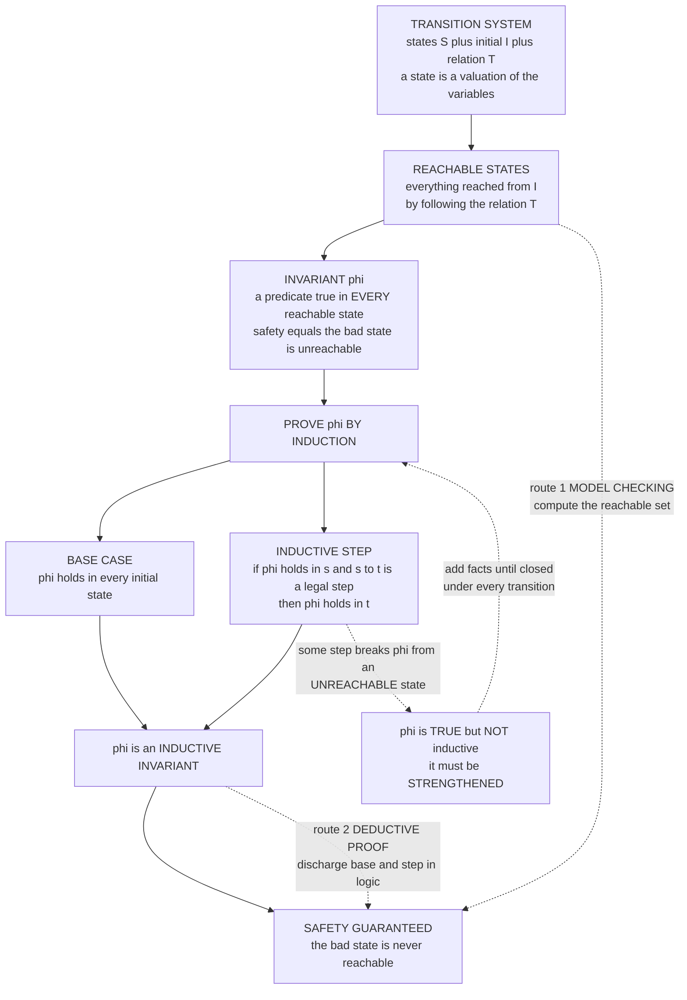

# 🚦 State-Based Modeling and Invariants

> [!abstract] TL;DR
> Almost every system worth verifying can be modeled as a **transition system**: a set of **states** (valuations of the system's variables), an **initial** state, and a **transition relation** saying which single steps are legal. A **safety property** — *nothing bad ever happens* (no two processes in the critical section, no buffer overflow, no deadlock) — is almost always an **invariant**: a predicate that is true in **every reachable state**, equivalently a statement that the "bad" states are **unreachable**. You prove an invariant by **induction** on the length of a run: show it holds in the initial state (**base**) and is **preserved by every transition** (**step**). The deep subtlety — and the single hardest part of verification — is that a property can be *true on all reachable states yet not inductive*: some **unreachable** state satisfies it but steps to a state that violates it, so the induction breaks. You must **strengthen** it into a genuinely **inductive invariant**. This one idea forks into the two great verification routes: **model checking** (compute the reachable set by exhaustive search) and **deductive proof** (prove the inductive invariant symbolically). Most of formal verification reduces to *"find and prove an inductive invariant."*

---

## Intuition

**Analogy — a system is a board game, and an invariant is a rule the board can never break.** Think of a system as a board game. At any instant the game is in some **position** — the full configuration of the board (whose turn, where every piece sits, what the score is). That position is the **state**. A **move** takes you from one position to another, and the rulebook says exactly which moves are legal — that is the **transition relation**. A **play-through** of the game is a sequence of positions, each reached from the previous by a legal move; the positions you can actually arrive at, starting from the opening setup, are the **reachable** states.

Now consider a traffic light at a crossroads. It cycles red, green, yellow — and the one rule you must never violate is *the two directions are never green at the same time*. That "never both green" statement is not about any single move; it is a property of **every position the light can ever be in, no matter how it got there.** That is an **invariant**. And notice the reframing that makes verification tractable: "the light is safe" means exactly "the *both-green* position is **unreachable**." Safety is unreachability of the bad state. To *prove* it, you do not replay infinitely many histories — you argue by induction: the opening position is safe, and *every legal move keeps you safe*, so safety propagates forever. The whole discipline of state-based verification is: draw the game as states and moves, phrase your safety goal as an invariant, and prove the bad position can never be reached.

---

## How It Works

### Core Mechanics

**1. The transition system — the universal model.** A transition system is a triple `TS = (S, I, T)`:
   - `S` — the **state space**. A state is a **valuation of the variables** — one concrete assignment of a value to every program counter, flag, counter, and memory cell. If a system has variables `x` over `{0,1}` and `pc` over three locations, its states are the assignments to `(x, pc)`.
   - `I ⊆ S` — the **initial** states (often a single state).
   - `T ⊆ S × S` — the **transition relation**: `(s, t) ∈ T` means "the system may step from `s` to `t` in one move." Nondeterminism is free — a state may have several successors.

   A **computation** (run, trace) is a sequence `s₀, s₁, s₂, …` with `s₀ ∈ I` and `(sᵢ, sᵢ₊₁) ∈ T` for all `i`. This model is *universal*: hardware circuits, concurrent protocols, program semantics, and automata all fit it.

**2. Reachable states.** `Reach(TS)` is the set of states appearing in **some** computation — everything you can get to from `I` by following `T`. It is the smallest set containing `I` and closed under `T`. Reachability is literally **graph reachability**: view states as nodes and transitions as directed edges, and `Reach` is the set of nodes reachable from the initial nodes — computed by [[BFS]] or [[DFS]].

**3. Safety as an invariant.** A **safety property** informally says *"nothing bad ever happens."* Formally it is captured by an **invariant** `φ`: a predicate over states such that `φ(s)` holds for **every** `s ∈ Reach(TS)`. Equivalently, let `Bad = { s : ¬φ(s) }`; the property holds iff `Bad ∩ Reach(TS) = ∅` — the bad states are **unreachable**. Mutual exclusion, no-overflow, no-null-dereference, no-deadlock: all are invariants.

**4. Liveness is the other half.** A **liveness property** says *"something good eventually happens"* — the program terminates, a request is eventually served, a hungry philosopher eventually eats, fairness holds. Liveness cannot be judged from any finite prefix (things can always still happen "later"), so it requires reasoning about **infinite behaviours** and is expressed in **temporal logic** rather than as a plain invariant. Every property decomposes into a *safety* part and a *liveness* part; this note is about the safety half.

**5. Proving an invariant by induction.** To show `φ` is an invariant, prove:
   - **Base case:** `φ(s)` for every `s ∈ I` — the property holds initially.
   - **Inductive step:** for every transition `(s, t) ∈ T`, `φ(s) ⟹ φ(t)` — every legal step **preserves** `φ`.

   If both hold, then by induction on the length of a run, `φ` holds along every computation, hence on all reachable states. This is exactly **mathematical induction** ([[Logic_and_Proof_Techniques]], [[Peano_Arithmetic_and_Formal_Number_Theory]]), but over the "reached-in-`n`-steps" measure instead of the natural numbers directly.

**6. The crucial subtlety — inductive vs merely-true.** The inductive step quantifies over **all** states `s`, *not just reachable ones*. So `φ` can be **true on every reachable state yet fail the induction**: there exists an **unreachable** state `s` with `φ(s)` true but a transition `s → t` with `φ(t)` false. Such a `φ` is a *true invariant* but **not an inductive invariant**. The fix is to **strengthen** it: find `ψ` with `ψ ⟹ φ`, `ψ` still true on all reachable states, and `ψ` closed under every transition. Discovering that strengthening — the **inductive invariant** — is the *art of verification* and the part machines struggle to automate.

**7. The two verification routes.** This single framework forks:
   - **Model checking** — *compute* `Reach(TS)` exhaustively (or symbolically) and check `Bad ∩ Reach = ∅`. Fully automatic; the limit is **state-space explosion** — `Reach` grows exponentially in the number of variables/components.
   - **Deductive verification** — never enumerate states; instead exhibit an **inductive invariant** and discharge the base and step as **logic** ([[First_Order_Predicate_Logic]]) obligations (today, via SMT solvers). Scales to infinite/huge state spaces but needs the invariant.

### Flow / Architecture



---

## Key Concepts

### Secondary (intuitive core)
- **State / position.** A snapshot of everything the system currently is — every variable's value at once.
- **Transition / move.** A single legal step from one state to the next; the rulebook of the system.
- **Reachable states.** The positions you can actually get to from the start by legal moves — nothing more.
- **Invariant.** A statement true in *every* reachable state, however you arrived — e.g. "the two lights are never both green."
- **Safety = unreachability of a bad state.** Proving something bad "never happens" means proving you can never reach a state where it is true.

### Undergraduate (formal machinery)
- **Transition system `(S, I, T)`.** State space, initial states, transition relation — the standard model of a reactive system.
- **Computation / trace.** A run `s₀ → s₁ → …` with `s₀ ∈ I` and consecutive states related by `T`.
- **Safety vs liveness.** Safety = "bad never happens" (invariant, refutable by a finite prefix). Liveness = "good eventually happens" (needs infinite behaviour, refutable only by an infinite run).
- **Proof by induction.** Base case (`φ` on `I`) plus inductive step (`φ` preserved by every transition) `⟹` `φ` holds on all of `Reach`.
- **Reachability as graph search.** `Reach` is computed by BFS/DFS over the state graph; the state graph is a relation ([[Set_Theory_and_Relations]], [[Graph_Theory]]).
- **Automata connection.** A finite transition system with labels/acceptance is exactly a finite automaton ([[Finite_Automata_DFA_and_NFA]]); reachability = which states the automaton's configuration can enter.

### Graduate (the hard subtleties)
- **Inductive invariant.** `φ` closed under `T` from *all* states: `φ(s) ∧ (s,t) ∈ T ⟹ φ(t)`, plus `I ⟹ φ`. Strictly stronger than "true on `Reach`."
- **Strengthening / invariant synthesis.** Given a true-but-not-inductive `φ`, find `ψ ⟹ φ` that *is* inductive. This is undecidable in general; heuristics include **k-induction**, **IC3/PDR** (incremental inductive generalization), **predicate abstraction**, and **Craig interpolation**.
- **`Reach` is the strongest inductive invariant.** The characteristic predicate of the reachable set is itself inductive and implies every true invariant; every inductive invariant is an over-approximation of `Reach`.
- **Symbolic vs explicit.** Explicit-state model checking enumerates states; **symbolic** methods represent state *sets* as formulas (BDDs, SAT/SMT) to fight state-space explosion.
- **Well-founded / ranking arguments.** Liveness and termination need a **well-founded ranking function** (a measure into a well-ordered set that strictly decreases), the dual of an inductive invariant — one bounds "bad," the other forces "progress."
- **Assume-guarantee & compositionality.** For concurrent systems, invariants of the whole are built from invariants of components under environment assumptions, taming explosion.

---

## Python Demo

We model a **lock-based mutual-exclusion protocol** as a transition system, compute its reachable states by BFS, and check the safety invariant *"never both processes in the critical section."* Then we expose the central subtlety: mutual exclusion is **true on all reachable states but not inductive** (a transition out of an *unreachable* state violates it), whereas a strengthened **token-counting** invariant *is* inductive — and it implies mutual exclusion.

```python
# Transition systems & inductive invariants: lock-based mutual exclusion.
# (a) build states + transition relation, BFS the reachable set, check an invariant
# (b) show a TRUE-but-NOT-inductive invariant vs a STRENGTHENED inductive one
import numpy as np
import matplotlib.pyplot as plt
from matplotlib.colors import ListedColormap
from matplotlib.patches import Patch
from itertools import product
from collections import deque

# --- State = (pc1, pc2, lock).  pc in {idle,wait,crit}, lock in {free,held} ---
IDLE, WAIT, CRIT = 0, 1, 2
FREE, HELD = 0, 1
PC = {IDLE: "idle", WAIT: "wait", CRIT: "crit"}
LK = {FREE: "free", HELD: "held"}
INIT = (IDLE, IDLE, FREE)

def successors(s):
    """The transition relation T: legal single steps of either process."""
    pc1, pc2, lock = s
    outs = []
    # process 1
    if   pc1 == IDLE:                    outs.append((WAIT, pc2, lock))
    elif pc1 == WAIT and lock == FREE:   outs.append((CRIT, pc2, HELD))   # take lock
    elif pc1 == CRIT:                    outs.append((IDLE, pc2, FREE))    # release
    # process 2 (symmetric)
    if   pc2 == IDLE:                    outs.append((pc1, WAIT, lock))
    elif pc2 == WAIT and lock == FREE:   outs.append((pc1, CRIT, HELD))
    elif pc2 == CRIT:                    outs.append((pc1, IDLE, FREE))
    return outs

# --- (a) BFS: compute the reachable set + the reachable-state graph edges ---
def bfs_reachable(init):
    seen, edges, q = {init}, [], deque([init])
    while q:
        s = q.popleft()
        for t in successors(s):
            edges.append((s, t))
            if t not in seen:
                seen.add(t); q.append(t)
    return seen, edges

R, edges = bfs_reachable(INIT)
ALL = list(product((IDLE, WAIT, CRIT), (IDLE, WAIT, CRIT), (FREE, HELD)))  # 18 states

# --- Two candidate invariants -------------------------------------------------
def mutual_exclusion(s):        # the SAFETY property we care about
    return not (s[0] == CRIT and s[1] == CRIT)

def token_inv(s):               # STRENGTHENED: free-token + in-crit count == 1
    pc1, pc2, lock = s
    return (1 if lock == FREE else 0) + (pc1 == CRIT) + (pc2 == CRIT) == 1

# --- Inductiveness test: base case + step over ALL states (not just reachable) -
def is_inductive(inv):
    if not inv(INIT):
        return False, ("INIT", INIT)
    for s in ALL:
        if inv(s):
            for t in successors(s):
                if not inv(t):
                    return False, (s, t)     # a step from an inv-state breaks inv
    return True, None

me_true   = all(mutual_exclusion(s) for s in R)
tok_true  = all(token_inv(s) for s in R)
me_ind,  me_wit  = is_inductive(mutual_exclusion)
tok_ind, _       = is_inductive(token_inv)
implies   = all((not token_inv(s)) or mutual_exclusion(s) for s in ALL)  # token => ME

print(f"reachable states                     : {len(R)} of {len(ALL)}")
print(f"mutual exclusion true on reachable   : {me_true}")
print(f"token invariant  true on reachable   : {tok_true}")
print(f"mutual exclusion INDUCTIVE           : {me_ind}   witness step: "
      f"{tuple(PC[me_wit[0][i]] if i<2 else LK[me_wit[0][2]] for i in range(3))}"
      f" -> {tuple(PC[me_wit[1][i]] if i<2 else LK[me_wit[1][2]] for i in range(3))}")
print(f"token invariant  INDUCTIVE           : {tok_ind}")
print(f"token invariant  IMPLIES mutual excl : {implies}")

# ============================ Visualization ==================================
fig, (axG, axS) = plt.subplots(1, 2, figsize=(14, 6))

# ---- Plot 1: the reachable-state graph (circular layout) --------------------
lbl = lambda s: f"{PC[s[0]][0]}{PC[s[1]][0]}/{LK[s[2]][0]}"
Rlist = sorted(R)
ang = np.linspace(0, 2*np.pi, len(Rlist), endpoint=False)
pos = {s: (np.cos(a), np.sin(a)) for s, a in zip(Rlist, ang)}
for s, t in edges:
    (x1, y1), (x2, y2) = pos[s], pos[t]
    axG.annotate("", xy=(x2, y2), xytext=(x1, y1),
                 arrowprops=dict(arrowstyle="-|>", color="0.6", alpha=0.6,
                                 shrinkA=16, shrinkB=16, lw=1.2))
for s, (x, y) in pos.items():
    is_init = (s == INIT)
    axG.scatter([x], [y], s=1500, zorder=3,
                color="crimson" if is_init else "steelblue",
                edgecolors="black")
    axG.text(x, y, lbl(s), ha="center", va="center", color="white",
             fontsize=9, fontweight="bold", zorder=4)
axG.set_title("Reachable-state graph (BFS from init)\n"
              "labels = p1p2/lock, e.g. iw/f = idle,wait,free   "
              "(red = initial)", fontsize=10)
axG.set_xlim(-1.4, 1.4); axG.set_ylim(-1.4, 1.4)
axG.axis("off")

# ---- Plot 2: reachable vs inductive-invariant vs merely-true sets -----------
# nesting:  Reachable  subset of  Token(inductive)  subset of  ME(true)  subset of  All
def category(s):
    if s in R:                 return 3   # reachable
    if token_inv(s):           return 2   # inductive-invariant, not reachable
    if mutual_exclusion(s):    return 1   # ME true but NOT inductive
    return 0                              # violates ME (a "bad" state)

grid = np.array([[category((p1, p2, lk)) for lk in (FREE, HELD)]
                 for p1, p2 in product((IDLE, WAIT, CRIT), (IDLE, WAIT, CRIT))])
cmap = ListedColormap(["#d62728", "#f7dc6f", "#7fb3d5", "#1b3b5f"])  # bad, ME-only, ind, reach
axS.imshow(grid, cmap=cmap, vmin=0, vmax=3, aspect="auto")
axS.set_xticks([0, 1]); axS.set_xticklabels(["lock=free", "lock=held"])
axS.set_yticks(range(9))
axS.set_yticklabels([f"{PC[p1]},{PC[p2]}"
                     for p1, p2 in product((IDLE, WAIT, CRIT), (IDLE, WAIT, CRIT))])
axS.set_title("Every state, coloured by set membership\n"
              "Reachable  <  Inductive(token)  <  MutualExcl(true)  <  All",
              fontsize=10)
# witness: (crit,wait,free) satisfies ME but steps to (crit,crit,held) which violates it
src = (CRIT, WAIT, FREE); dst = (CRIT, CRIT, HELD)
sr, sc = src[0]*3 + src[1], src[2]
dr, dc = dst[0]*3 + dst[1], dst[2]
axS.annotate("", xy=(dc, dr), xytext=(sc, sr),
             arrowprops=dict(arrowstyle="-|>", color="black", lw=2.5))
axS.text(sc + 0.05, sr - 0.45, "ME true here\nbut step breaks it",
         fontsize=8, ha="left", va="bottom")
legend = [Patch(facecolor="#1b3b5f", label="Reachable"),
          Patch(facecolor="#7fb3d5", label="Inductive (token), not reachable"),
          Patch(facecolor="#f7dc6f", label="ME true but NOT inductive"),
          Patch(facecolor="#d62728", label="Violates mutual exclusion (bad)")]
axS.legend(handles=legend, loc="upper center", bbox_to_anchor=(0.5, -0.08),
           ncol=1, fontsize=8, frameon=False)

plt.tight_layout()
plt.savefig("state_based_modeling_invariants.png", dpi=130, bbox_inches="tight")
print("\nsaved figure -> state_based_modeling_invariants.png")
```

**What the run shows.** Mutual exclusion is `True` on every reachable state, yet `is_inductive` returns `False` with the witness step `(crit, wait, free) -> (crit, crit, held)`: the source is **unreachable** (if a process is in `crit` the lock cannot be `free`), it *satisfies* mutual exclusion, but one legal step lands in a both-`crit` state that *violates* it. The **token invariant** `free_tokens + in_crit == 1` is `True` on all reachable states, **is** inductive (preserved by every step from every state), and **implies** mutual exclusion — so it is the strengthening that closes the proof. The right-hand plot makes the nesting visible: the reachable set sits strictly inside the inductive-invariant set, which sits strictly inside the merely-true mutual-exclusion set, with the "bad" both-`crit` states outside all of them.

---

## Real-World Applications

- **Concurrency & protocol verification.** Mutual exclusion (Peterson, Dekker, ticket locks), cache-coherence protocols, and consensus algorithms are modeled as transition systems; the key correctness guarantees are inductive invariants. TLA+ (Lamport) specifies systems precisely this way and AWS uses it to catch design bugs in S3, DynamoDB, and other services before implementation.
- **Hardware model checking.** Chip designs are finite transition systems over register/wire valuations; symbolic model checkers (SMV, and industrial tools at Intel/IBM) verify safety invariants like "these two bus masters never drive simultaneously" over astronomically large state spaces using BDD/SAT-based reachability.
- **Software safety & static analysis.** Abstract interpretation and tools like Facebook's Infer, Microsoft's SLAM/SDV (Windows driver verifier), and Astrée (used on Airbus flight-control code) all compute over-approximate inductive invariants to prove "no null dereference / no overflow / no array out-of-bounds" — safety = unreachability of an error state.
- **SMT-based deductive verification.** Dafny, Frama-C, Why3, and seL4's proof discharge base/step obligations to SMT solvers; the human supplies the inductive invariants (and loop invariants), the solver checks preservation.
- **IC3/PDR in modern engines.** The IC3/PDR algorithm — automatic incremental *strengthening* of a candidate into an inductive invariant — is the workhorse behind today's fastest hardware and software model checkers.

---

## Common Pitfalls

- **Confusing "true on reachable states" with "inductive."** This is *the* central trap. A predicate can hold on every state you can actually reach yet still fail the inductive step because some **unreachable** state satisfies it and steps out of it (exactly the `(crit,wait,free) -> (crit,crit,held)` witness above). Fix: **strengthen** until the invariant is closed under every transition from *every* state, reachable or not.
- **A state is a *valuation of all variables*, not one variable.** Beginners model "the state" as a single flag. The state is the **joint** assignment to *every* variable (all program counters, all flags, the lock, the buffer). Forgetting a variable produces an unsound or incomplete model.
- **Forgetting the base case.** An invariant that is preserved by every transition but *false initially* proves nothing. Both base and step are required.
- **Reachable states vs all states.** Reasoning "well, that state can't happen" during the inductive step is a bug — the inductive step must quantify over **all** states. If you *rely* on unreachability, you must first fold that fact into the invariant.
- **Mistaking safety for liveness (and vice versa).** "The system never deadlocks" reads like safety but "eventually makes progress" is liveness — the latter needs a **ranking/well-founded** argument or temporal logic, not a plain invariant. Trying to prove liveness with an invariant alone silently proves nothing.
- **State-space explosion.** The number of reachable states is exponential in the number of components; naive explicit enumeration blows up. This is *why* symbolic model checking and deductive (invariant-based) proof exist — and why they scale differently.
- **Under-specified transition relation.** Omitting legal transitions makes your reachable set too small, so an "invariant" may hold in your model but not in the real system. Over-specifying does the reverse. Model fidelity gates every conclusion.
- **Assuming model checking always terminates.** For infinite-state systems (unbounded integers, dynamic memory), the reachable set may be infinite; you *need* the deductive/inductive route or a finite abstraction.

---

## Related Concepts

- [[Finite_Automata_DFA_and_NFA]] — a finite automaton *is* a finite transition system with labels and acceptance; reachability of its configurations is precisely the reachable-state computation here.
- [[Set_Theory_and_Relations]] — the transition relation `T ⊆ S × S` is a binary relation; "reachable" is its reflexive-transitive closure from the initial states.
- [[Graph_Theory]] — the state space is a directed graph and reachability is graph reachability; state-space explosion is the graph growing exponentially.
- [[BFS]] — breadth-first search is the canonical way to compute the reachable set and find shortest counterexample traces to a bad state.
- [[DFS]] — depth-first search underlies explicit-state model checking and cycle detection used for liveness/fairness.
- [[Logic_and_Proof_Techniques]] — proving an invariant is mathematical induction (base + step) applied to the length of a computation.
- [[Peano_Arithmetic_and_Formal_Number_Theory]] — the induction principle formalized; the same schema licenses induction over run length.
- [[First_Order_Predicate_Logic]] — invariants are predicates over states, and the base/step obligations of deductive verification are first-order (today, SMT) entailments.

*Siblings in the Formal_Methods vault (prose references, not yet written): Formal_Specification_Languages, Set_Based_Specification_Z_and_B, Model_Checking_Fundamentals, Loop_Invariants_and_Termination_Proofs, and Linear_and_Branching_Temporal_Logic — the last extends the safety/invariant story to full temporal properties and liveness.*

---

## Review Questions

1. **(Secondary)** Using the traffic-light analogy, explain in your own words the difference between a *state*, a *transition*, and an *invariant*. Why is "the two directions are never both green" naturally an invariant rather than a statement about a single move?
2. **(Undergraduate)** Given a transition system `(S, I, T)` and a candidate safety property `φ`, write down the exact base case and inductive step you must prove to conclude `φ` holds on all reachable states. Explain precisely why proving these two facts justifies the conclusion for runs of *arbitrary* length.
3. **(Undergraduate)** Reframe "the system never deadlocks" and "the request is eventually served" as a safety property and a liveness property respectively. Which one can be refuted by a finite prefix of a run, and why can the other not?
4. **(Graduate)** Give a concrete example (you may reuse the mutex model) of a predicate that is true on all reachable states but is *not* an inductive invariant. Identify the unreachable state and the offending transition, then exhibit a strengthening that *is* inductive. Argue why the strongest possible inductive invariant is the characteristic predicate of the reachable set itself.
5. **(Graduate)** Contrast the model-checking route (compute the reachable set) with the deductive route (prove an inductive invariant) along three axes: automation, scalability to large/infinite state spaces, and the failure mode you hit first. When would you reach for IC3/PDR, and what problem is it automating?

---

## Sources

- Baier, C. & Katoen, J.-P. *Principles of Model Checking.* MIT Press, 2008 — transition systems, reachability, safety vs liveness, the definitive modern treatment.
- Clarke, E. M., Grumberg, O. & Peled, D. *Model Checking.* MIT Press, 1999 — foundational text on computing reachable sets and symbolic verification.
- Manna, Z. & Pnueli, A. *The Temporal Logic of Reactive and Concurrent Systems: Specification.* Springer, 1992 — invariants, inductive assertions, and the safety/liveness decomposition.
- Lamport, L. *Specifying Systems: The TLA+ Language and Tools.* Addison-Wesley, 2002 — state-based specification and invariance in industrial practice ([available online](https://lamport.azurewebsites.net/tla/book.html)).
- Bradley, A. R. "SAT-Based Model Checking without Unrolling" (IC3/PDR). *VMCAI*, 2011 — automatic inductive-invariant strengthening.

---

#formal-methods #transition-systems #invariants #safety-properties #induction
