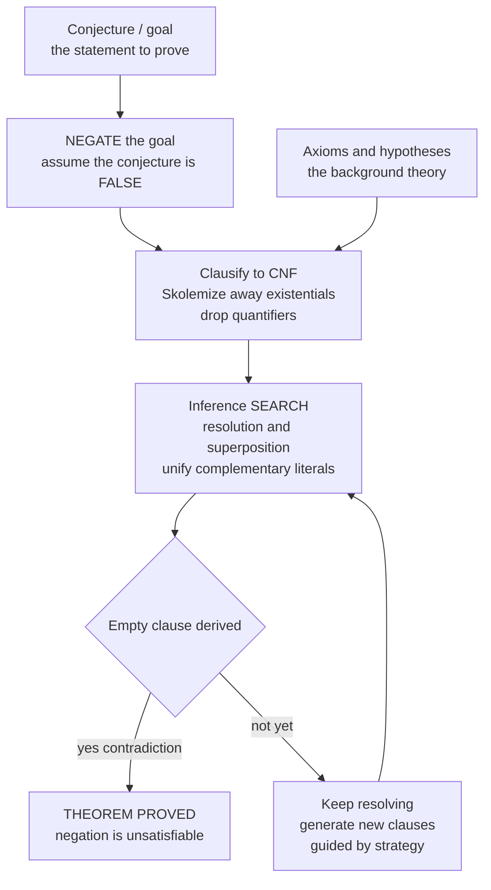

# 🤖 Automated Theorem Proving

> [!abstract] TL;DR
> **Automated theorem proving (ATP)** is the art of getting a machine to prove statements in **first-order logic** with *no human in the loop* — the fully-automatic counterpart to interactive proof assistants. The winning trick is **proof by refutation**: to prove a conjecture, the prover *assumes its negation*, throws it in with the axioms, converts everything to a uniform clause form, and then **mechanically grinds out logical consequences** searching for a contradiction — the **empty clause**. The classical engine is **resolution** (Robinson, 1965), which resolves complementary literals using **unification** to match first-order terms; modern systems (**Vampire, E, SPASS, iProver**) run the far stronger **superposition calculus** with term orderings and redundancy elimination. Resolution is **refutation-complete**: if the theorem is true, a proof *exists* and the search will *eventually* find it. But first-order validity is only **semi-decidable** — on a *non-theorem* the prover may run **forever**. That single fact places ATP between the decidable worlds of **SAT** (propositional) and **SMT** (theories) and the expressive, human-guided world of interactive proving. Remarkably, a purely mechanical clause-grind once cracked the **Robbins conjecture**, open for 60 years.

---

## Intuition

**Analogy — proving no one is both a bachelor and married.** How do you prove that *nobody* can be simultaneously a bachelor and married? You do **not** interview every person on Earth — that never terminates and never *proves* anything universal. Instead you do something sneaky: you *assume* someone **is** both, and you chase the consequences. "Bachelor" means *unmarried*; "married" means *married*; the same person is now both married and unmarried — a flat **contradiction**. Because the only thing you assumed was that such a person exists, that assumption must be **impossible**. You proved a universal statement by refuting its negation.

Automated theorem provers **weaponize exactly this move**. To prove a conjecture, they assume its **negation**, mix it with the axioms, and mechanically derive logical consequence after logical consequence — a blind, tireless search — hoping to hit an outright contradiction (a clause that says "*this* and *not this*", i.e. the empty clause). Hand the machine the axioms and let it *churn*. The astonishing part is that this dumb, mechanical grind is powerful enough that it has, on occasion, solved open mathematical problems no human had managed to crack.

---

## How It Works

### Core Mechanics

1. **Start from a conjecture and a theory.** You have axioms/hypotheses `A` and a goal `G`. You want to show `A ⊨ G` (the axioms *entail* the goal).
2. **Refute instead of prove.** `A ⊨ G` holds **iff** `A ∧ ¬G` is **unsatisfiable**. So the prover *negates the goal*, adds it to the axioms, and now has a single job: **show this set has no model**. Finding a contradiction in `A ∧ ¬G` proves `G`.
3. **Clausify (conjunctive normal form).** Every formula is mechanically rewritten into a set of **clauses** — disjunctions of literals, implicitly conjoined and universally quantified. Along the way, **Skolemization** eliminates existential quantifiers by replacing `∃x. P(x)` with a fresh **Skolem constant/function** (a witness), and quantifiers are dropped. Now everything is uniform: just clauses of literals.
4. **Resolve with unification.** The **resolution rule** takes two clauses containing **complementary literals** — one with `L`, one with `¬L'` — and, if `L` and `L'` can be made identical by a **most-general unifier (MGU)** substituting terms for variables, produces a new **resolvent** clause combining the rest. Unification is what lifts propositional resolution to *first-order* terms like `f(x)` vs `f(g(a))`.
5. **Saturate: keep deriving.** The prover repeatedly applies inference to pairs of clauses, adding new clauses to its set — the **saturation** or **given-clause loop**. Equality is handled by **paramodulation/superposition** (rewriting equals for equals).
6. **Win on the empty clause.** If resolution ever derives the **empty clause** `□` — a clause with *no* literals, meaning "unconditionally false" — the set is **unsatisfiable**, so the original goal is **proved**. Otherwise the prover keeps searching... possibly forever.
7. **Tame the explosion.** Naive saturation drowns in useless clauses, so real provers use **strategies**: literal **selection**, term **orderings** (only rewrite "bigger" to "smaller"), **redundancy elimination** (subsumption, tautology deletion), **set-of-support** (keep the goal in every derivation), and **unit preference**. These do not change *what* is provable, only *how fast* — the difference between seconds and heat-death.

### Flow / Architecture



*The conjecture is negated, merged with the axioms, and clausified; the prover then saturates by resolution/superposition, unifying complementary literals, until it derives the empty clause. On a genuine non-theorem, the "keep resolving" loop may never halt — the semi-decidability wall.*

---

## Key Concepts

### Secondary (intuitive, no advanced background needed)

- **Proof by contradiction, automated** — to prove a claim, *assume it is false* and show that assumption leads to nonsense. ATP does exactly this, mechanically.
- **The empty clause = "you contradicted yourself."** The prover is finished the instant it can derive a statement equivalent to *"false"* out of your assumptions.
- **No human in the loop** — unlike an interactive prover where a person supplies each step, an ATP is *push a button and wait*: it searches on its own.
- **It might not stop** — for a *true* statement it will eventually succeed; for a *false* one it can search forever without ever telling you "no". Patience is not always rewarded.

### Undergraduate (a first course)

- **Refutation completeness of resolution** — resolution will derive the empty clause from *any* unsatisfiable set of clauses (Robinson, 1965). It cannot generate *every* consequence, but it *can* always detect inconsistency, which is all refutation needs.
- **Clausal normal form + Skolemization** — the pre-processing pipeline: push negations in, Skolemize existentials into witness functions, drop universals, distribute to get a *conjunction of disjunctions*. This is where first-order structure gets flattened into clauses.
- **Unification and the MGU** — the algorithm that finds the *most general* substitution making two terms syntactically equal (`f(x, a)` and `f(b, y)` unify with `{x↦b, y↦a}`). It is the first-order generalization of "matching literals" and is itself a classic **search/backtracking** problem.
- **The given-clause loop** — the heartbeat of a saturation prover: pick one "given" clause, resolve it against everything kept so far, add the fresh non-redundant results, repeat. Splits clauses into *active* and *passive* sets.
- **Semi-decidability** — first-order validity is **recursively enumerable but not decidable**: there is a procedure that halts-and-says-yes on every theorem, but *no* procedure that always halts. This is a corollary of the undecidability of the halting problem and Church's theorem.
- **Contrast with SAT** — propositional satisfiability is **decidable** (always terminates), which is why SAT solvers give a definite yes/no; full first-order ATP trades that guarantee for expressive power.

### Graduate (advanced)

- **Superposition calculus** — the modern engine (Bachmair & Ganzinger): resolution + **ordered paramodulation** for equality, constrained by a **simplification ordering** on terms and **literal selection**, plus a powerful notion of **redundancy** so that provably-useless clauses can be deleted while preserving completeness. This is the basis of **Vampire, E, SPASS, iProver, Zipperposition**.
- **Ordering-based completeness** — a *reduction ordering* makes rewriting one-directional (big → small), which both terminates equality reasoning and yields **completeness modulo redundancy**: you can throw away subsumed and simplified clauses without losing proofs.
- **Fairness** — completeness requires the search to be **fair** (no ready inference is postponed forever). Strategy heuristics reorder work for speed but must preserve fairness, or the completeness guarantee evaporates.
- **Strategy scheduling / portfolio proving** — provers like Vampire run *dozens* of parameter configurations in a time-sliced schedule because no single strategy dominates; portfolio mode is how competition-grade systems win.
- **ATP vs SMT vs SAT** — a spectrum of **decidability vs expressiveness**: SAT (propositional, decidable, NP-complete), SMT (quantifier-free + decidable **theories** like arithmetic, arrays, bit-vectors via **decision procedures**), full first-order ATP (unrestricted quantifiers, only **semi-decidable**). "Hammers" bridge them: a proof assistant fires its goal at ATPs/SMT and reconstructs any proof found.
- **Machine learning for guidance** — modern research applies ML to **premise selection** (which of thousands of lemmas to even feed the prover) and to **clause selection** inside the loop (which given-clause to pick next), e.g. ENIGMA, TacticToe, and neural rerankers — learned heuristics steering an otherwise blind search.
- **Benchmarks and evaluation** — the **TPTP** problem library and the annual **CASC** competition standardize how provers are measured, driving decades of steady improvement.

---

## Python Demo

Two experiments in one figure. **(a) Propositional resolution refutation:** we implement the resolution rule on CNF clauses and feed it a small **unsatisfiable** clause set — the *negated theorem* for the entailment `p, p→q, q→r ⊨ r`. The prover repeatedly resolves complementary literals until it derives the **empty clause** (contradiction ⇒ theorem proved), and we draw the **resolution DAG** showing which clauses combine to produce which. **(b) Search blow-up:** we scale the problem to a chain of length `n` and count how many distinct clauses each strategy generates — **naive** saturation (resolve every compatible pair) versus **unit-preference** (only resolve when a parent is a unit clause). Naive resolution derives the whole *transitive closure* (`~n^2/2` clauses); unit-preference derives only the `~n` unit clauses it needs. That gap is *why* strategies exist. `numpy` + `matplotlib`.

```python
# Automated theorem proving by RESOLUTION REFUTATION (propositional core).
# (a) Prove  p, p->q, q->r  |=  r  by negating the goal (add ~r) and resolving
#     to the EMPTY clause; draw the resolution DAG.
# (b) Scale to a chain of length n and count clauses generated by NAIVE vs
#     UNIT-PREFERENCE strategies -> the combinatorial blow-up that motivates
#     search heuristics (set-of-support, unit preference, ordering).
# numpy + matplotlib only.

import numpy as np
import matplotlib.pyplot as plt

# ---- literals as strings: "p" (positive) / "~p" (negative); clause = frozenset ----
def negate(lit):
    return lit[1:] if lit.startswith("~") else "~" + lit

def is_tautology(clause):
    return any(negate(l) in clause for l in clause)

def resolvents(c1, c2):
    """All clauses obtainable by resolving c1 and c2 on one complementary literal."""
    out = []
    for lit in c1:
        if negate(lit) in c2:
            r = (c1 - {lit}) | (c2 - {negate(lit)})
            out.append(frozenset(r))
    return out

# ------------------------------------------------------------------ #
# (a) Refutation with DAG recording (deterministic, unit-preference). #
# ------------------------------------------------------------------ #
def prove_with_dag(initial, unit_pref=True):
    nodes, idx, parent = [], {}, {}
    def add(c, par):
        if c in idx:
            return idx[c]
        i = len(nodes); nodes.append(c); idx[c] = i; parent[i] = par
        return i
    for c in initial:
        add(frozenset(c), None)
    empty_id = None
    while empty_id is None:
        made = False
        snap = list(nodes)                     # snapshot for deterministic order
        for a in range(len(snap)):
            for b in range(a + 1, len(snap)):
                c1, c2 = snap[a], snap[b]
                if unit_pref and len(c1) != 1 and len(c2) != 1:
                    continue                   # unit preference: one parent must be a unit
                for r in resolvents(c1, c2):
                    if is_tautology(r) or r in idx:
                        continue
                    nid = add(r, (idx[c1], idx[c2]))
                    made = True
                    if len(r) == 0:
                        empty_id = nid
                    break
                if made:
                    break
            if made:
                break
        if not made:                           # saturated without empty clause
            break
    return nodes, parent, empty_id

# Negated theorem for  p, p->q, q->r  |=  r  :  {p}, {~p,q}, {~q,r}, and ~goal {~r}
theorem = [{"p"}, {"~p", "q"}, {"~q", "r"}, {"~r"}]
nodes, parent, empty_id = prove_with_dag(theorem)
print("THEOREM  p, p->q, q->r  |=  r")
print("Empty clause derived:", empty_id is not None,
      "  => PROVED" if empty_id is not None else "  => not proved")

def clause_label(c):
    return "[]  FALSE" if len(c) == 0 else "{" + ", ".join(sorted(c)) + "}"

def generation(i):
    p = parent[i]
    return 0 if p is None else max(generation(p[0]), generation(p[1])) + 1

# ------------------------------------------------------------------ #
# (b) Search blow-up: full closure size, naive vs unit-preference.   #
# ------------------------------------------------------------------ #
def closure_size(initial, unit_only):
    clauses = set(frozenset(c) for c in initial)
    while True:
        cur, new = list(clauses), set()
        for i in range(len(cur)):
            for j in range(i + 1, len(cur)):
                c1, c2 = cur[i], cur[j]
                if unit_only and len(c1) != 1 and len(c2) != 1:
                    continue
                for r in resolvents(c1, c2):
                    if not is_tautology(r) and r not in clauses:
                        new.add(r)
        if not new:
            return len(clauses)
        clauses |= new

def chain_theorem(n):
    # {x0}, {~x0,x1}, ..., {~x(n-2),x(n-1)}, {~x(n-1)}  -- unsatisfiable
    cl = [{"x0"}]
    for i in range(n - 1):
        cl.append({f"~x{i}", f"x{i+1}"})
    cl.append({f"~x{n-1}"})
    return cl

ns = np.arange(3, 13)
naive = np.array([closure_size(chain_theorem(n), unit_only=False) for n in ns])
unitp = np.array([closure_size(chain_theorem(n), unit_only=True)  for n in ns])
print("naive-strategy clause counts :", naive.tolist())
print("unit-preference clause counts:", unitp.tolist())

# ------------------------------------------------------------------ #
# Visualization                                                       #
# ------------------------------------------------------------------ #
fig, (axL, axR) = plt.subplots(1, 2, figsize=(14, 6))

# ---- (a) resolution DAG ----
gens = [generation(i) for i in range(len(nodes))]
by_gen = {}
for i, g in enumerate(gens):
    by_gen.setdefault(g, []).append(i)
pos = {}
for g, members in by_gen.items():
    for k, i in enumerate(members):
        x = k - (len(members) - 1) / 2.0
        pos[i] = (x, -g)

for i, (x, y) in pos.items():                  # edges parent -> child
    if parent[i] is not None:
        for p in parent[i]:
            x0, y0 = pos[p]
            axL.annotate("", xy=(x, y + 0.16), xytext=(x0, y0 - 0.16),
                         arrowprops=dict(arrowstyle="-|>", color="#888", lw=1.4))
for i, (x, y) in pos.items():                  # nodes
    empty = (len(nodes[i]) == 0)
    initial = parent[i] is None
    color = "#C44E52" if empty else ("#4C72B0" if initial else "#55A868")
    axL.scatter([x], [y], s=2200, marker="o", color=color,
                edgecolors="black", zorder=3, alpha=0.92)
    axL.text(x, y, clause_label(nodes[i]), ha="center", va="center",
             fontsize=9, color="white", fontweight="bold", zorder=4)
axL.set_title("Resolution refutation DAG\n"
              "blue = negated theorem (given), green = resolvent, red = EMPTY clause (proved)")
axL.set_xlim(-2.2, 2.2); axL.set_ylim(-len(by_gen) + 0.4, 0.7)
axL.axis("off")

# ---- (b) search blow-up ----
axR.plot(ns, naive, "o-", lw=2.4, color="#C44E52", label="naive saturation (all pairs)")
axR.plot(ns, unitp, "s-", lw=2.4, color="#4C72B0", label="unit-preference strategy")
axR.plot(ns, ns * (ns - 1) / 2.0, "--", color="#C44E52", alpha=0.5,
         label="reference  n(n-1)/2  (quadratic)")
axR.plot(ns, ns.astype(float), ":", color="#4C72B0", alpha=0.7,
         label="reference  n  (linear)")
axR.set_title("Search BLOW-UP: clauses generated vs problem size\n"
              "naive resolution derives the whole transitive closure; a strategy stays linear")
axR.set_xlabel("chain length n (problem size)")
axR.set_ylabel("distinct clauses generated")
axR.legend(loc="upper left"); axR.grid(alpha=0.3)

fig.suptitle("Automated theorem proving: refute by resolution, then fight the combinatorial explosion",
             fontsize=13)
fig.tight_layout()
plt.savefig("automated_theorem_proving.png", dpi=120)
print("\nSaved figure to automated_theorem_proving.png")
```

**What it shows.** Part (a): the prover negates `r`, and resolution walks the chain `{p}·{~p,q} → {q}`, `{q}·{~q,r} → {r}`, `{r}·{~r} → □` — deriving the **empty clause**, so `r` is **proved**; the DAG makes the derivation visible as a tree feeding into the red contradiction node. Part (b): on the same problem scaled to length `n`, **naive** saturation generates the entire *transitive closure* of implications — roughly `n(n-1)/2` clauses (it wastefully derives `~x_i ∨ x_j` for *every* `i<j`), while **unit-preference** derives only the `~n` unit facts it actually needs. Same answer, order-of-magnitude different work — a miniature of why real provers (Vampire, E) live and die by **selection, ordering, and redundancy** heuristics.

---

## Real-World Applications

> **Example — the Robbins conjecture, cracked by a machine (1996).** Whether every *Robbins algebra* is a Boolean algebra was an open problem for **~60 years**. William McCune's prover **EQP** (an equational descendant of Otter) found a proof by pure automated equational reasoning — superposition-style rewriting with orderings — that no human had produced. It remains the poster child for ATP solving genuine open mathematics, not just re-checking known results.

- **"Hammers" for interactive provers** — **Sledgehammer** (Isabelle/HOL) and **CoqHammer** ship the current goal plus a heuristically selected set of lemmas to background ATPs and **SMT** solvers (E, Vampire, Z3, CVC5); any proof found is *reconstructed* and checked by the assistant's trusted kernel. This is how much of large-scale formalized mathematics actually gets done.
- **Verification condition discharge** — deductive verifiers (Dafny, Why3, F*, VeriFast) compile Hoare-style **proof obligations** into logical formulas and fire them at ATP/SMT back-ends; the prover silently discharges the routine ones so the engineer only writes invariants, not proofs.
- **Ontology and knowledge-base reasoning** — description-logic and OWL reasoners, and first-order provers over large fact bases (e.g. SUMO, Cyc-style KBs), answer entailment queries — "does this follow from what we know?" — by refutation.
- **Hardware and protocol checking** — equivalence of arithmetic circuits and correctness of security/communication protocols are posed as first-order (or theory) entailments and handed to saturation provers.
- **The TPTP + CASC ecosystem** — the **Thousands of Problems for Theorem Provers** library and the **CADE ATP System Competition** are the shared benchmark and yearly proving-ground that have driven decades of steady engine improvement (Vampire, E, iProver, CVC5).
- **ML-guided proving (frontier)** — learned **premise selection** and neural **clause selection** (ENIGMA, learned rerankers, DeepMath-style models) are increasingly folded into the given-clause loop to steer the search toward productive inferences.

---

## Common Pitfalls

- **"Automated" ≠ "interactive" — know which you are using.** ATP means *fully automatic* first-order proof search (push a button, get a proof or a timeout). **Interactive** theorem proving (Coq, Isabelle, Lean) has a human drive each step in a rich higher-order logic. Confusing the two leads to wrong expectations: ATPs are limited in expressiveness but need no guidance; assistants are maximally expressive but need lots of it.
- **Forgetting that ATP proves by REFUTATION, not construction.** The prover does *not* build a forward proof of your goal; it **negates** the goal and seeks a **contradiction**. If you feed it a goal without negating (or without the axioms), it has nothing to contradict and will (correctly) find nothing.
- **Ignoring semi-decidability — expecting a "no".** First-order validity is only **semi-decidable**: on a *theorem* the prover halts with a proof, but on a **non-theorem** it may run **forever**. A timeout means "*I didn't find a proof in time*", **not** "the statement is false". Do not read a timeout as disproof.
- **Skolemization and clausification are not optional cosmetics.** Getting existentials wrong (Skolem functions must depend on the *enclosing* universally-quantified variables) or mishandling polarity during CNF conversion silently changes the problem — you may "prove" something that is not your theorem.
- **Completeness vs efficiency confusion.** Resolution/superposition are **complete** (a proof will be found *if one exists*), but completeness says nothing about *speed*. The enormous **search space** is the real enemy; **strategies** (literal selection, term ordering, set-of-support, unit preference, redundancy/subsumption) preserve completeness while pruning it — as the demo's naive-vs-unit gap shows. Turning off redundancy for "purity" can make a solvable problem hopeless.
- **Reaching for full ATP when a decidable fragment suffices.** If your goal is quantifier-free arithmetic, bit-vectors, or arrays, an **SMT** solver (Z3, CVC5) *decides* it and always terminates; propositional goals belong to a **SAT** solver. Using an unrestricted first-order prover throws away the termination guarantee those decidable theories give you for free.
- **Blind trust in equality handling.** Naive resolution does *not* reason about `=` efficiently; without **paramodulation/superposition** and term orderings, equational goals explode. Modern provers bake equality in — but if you encode equality as an ordinary predicate with axioms, expect the search to blow up.

*(Sibling notes in this section, referenced in prose and built out separately: `Logic_for_Program_Verification`, `Interactive_Theorem_Proving`, `SAT_Solving_and_DPLL`, `SMT_Solving_and_Satisfiability_Modulo_Theories`, `Decision_Procedures_and_Theories`.)*

---

## Related Concepts

- [[Formal_Methods_Overview]] — the parent field: ATP is the "logic, proof and solvers" engine that discharges proof obligations across specification, verification, and model checking.
- [[First_Order_Predicate_Logic]] — the exact logic ATPs target; quantifiers, terms, and predicates are what Skolemization and unification operate on.
- [[Formal_Systems_and_Proof_Calculi]] — resolution and superposition *are* proof calculi; this note is a machine-oriented calculus optimized for search rather than human readability.
- [[Soundness_and_Completeness]] — the twin guarantees at stake: resolution is **sound** (never proves a falsehood) and **refutation-complete** (finds a proof if one exists).
- [[Propositional_Logic_and_Boolean_Semantics]] — the propositional core the Python demo implements and the boundary with decidable **SAT** solving.
- [[Computability_and_Recursion_Theory]] — why first-order validity is **recursively enumerable but not recursive**, i.e. semi-decidable.
- [[The_Halting_Problem_and_Undecidability]] — the undecidability result (via Church/Turing) that forces provers to possibly loop forever on non-theorems.
- [[Undecidability_and_Reducibility]] — the reductions establishing that the *validity/entailment* problem cannot be decided in general.
- [[Decidability_and_Recognizability]] — the precise "recognizable but not decidable" line ATP sits exactly on top of.
- [[Reductions_and_Undecidable_Problems]] — how proving-related problems are classified as undecidable.
- [[The_Class_NP_and_Verification]] — the neighbouring *decidable* regime: SAT is NP-complete, the "check a certificate" world that SMT extends before full first-order ATP gives up termination.
- [[NP_Completeness_and_the_Cook_Levin_Theorem]] — Cook–Levin anchors propositional SAT, the decidable base of the SAT → SMT → ATP spectrum.
- [[Recursive_Functions_and_Lambda_Calculus]] — the computability substrate (Church's own theorem on the *Entscheidungsproblem*) underlying the semi-decidability limit.
- [[Backtracking]] — the search paradigm beneath unification and clause selection; proof search is a backtracking/tree search fighting combinatorial explosion.

---

## Review Questions

### Secondary

1. In the "bachelor and married" story, what do you *assume* at the start of the proof, and why does reaching a contradiction let you conclude the original universal statement? Relate this to how an ATP proves a conjecture.
2. A theorem prover runs for an hour and then times out on your conjecture. Does that mean the conjecture is **false**? Explain in one sentence why or why not.
3. What is the **empty clause**, and why is deriving it the moment the prover declares victory?

### Undergraduate

1. Explain the four-step pipeline **negate → clausify/Skolemize → resolve with unification → derive the empty clause**. At which step do existential quantifiers disappear, and what replaces them?
2. Resolution is *refutation-complete* but first-order validity is *semi-decidable*. Reconcile these two statements: what exactly is guaranteed to happen for a true theorem, and what can happen for a non-theorem?
3. Using the demo's chain example, explain why **naive** saturation generates roughly `n(n-1)/2` clauses while **unit-preference** generates only about `n`. What does this teach about the role of proof strategies?

### Graduate

1. Compare **resolution** and the **superposition calculus** on equality reasoning. Why does superposition need a **simplification ordering** and a notion of **redundancy**, and how do these preserve completeness while enabling clause deletion?
2. Place **SAT**, **SMT**, and **full first-order ATP** on a single **decidability–vs–expressiveness** axis. For each, state what is decidable, what the solver is complete for, and what termination guarantee (if any) it offers. Where do "hammers" like Sledgehammer sit?
3. Portfolio provers schedule dozens of strategies and prune aggressively with subsumption and selection. Explain why aggressive pruning does **not** compromise refutation completeness, and what property of the search (hint: **fairness**) must nonetheless be maintained.

---

## Sources

- J. A. Robinson. "A Machine-Oriented Logic Based on the Resolution Principle." *Journal of the ACM* 12(1):23–41, 1965 — the founding resolution + unification paper. <https://doi.org/10.1145/321250.321253>
- L. Bachmair, H. Ganzinger. "Rewrite-Based Equational Theorem Proving with Selection and Simplification." *Journal of Logic and Computation* 4(3):217–247, 1994 — the superposition calculus with orderings and redundancy.
- J. Harrison. *Handbook of Practical Logic and Automated Reasoning.* Cambridge University Press, 2009 — a hands-on, code-first treatment of unification, resolution, and decision procedures.
- M. Fitting. *First-Order Logic and Automated Theorem Proving*, 2nd ed. Springer, 1996 — rigorous foundations of first-order proving, tableaux, and resolution.
- L. Kovács, A. Voronkov. "First-Order Theorem Proving and Vampire." *CAV 2013*, LNCS 8044:1–35 — architecture of a state-of-the-art saturation prover (given-clause loop, selection, strategies).

---

#formal-methods #automated-theorem-proving #resolution #first-order-logic #unification
