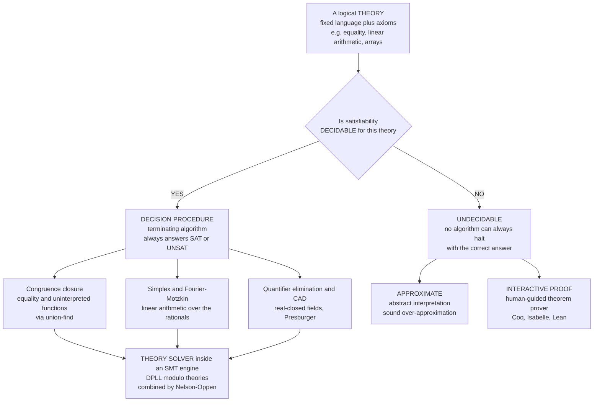

# ⚖️ Decision Procedures and Theories

> [!abstract] TL;DR
> A **decision procedure** is an algorithm that, for a **fixed logical theory** (equality-with-functions, linear arithmetic, arrays, bit-vectors, ...), **always terminates** and gives the **correct YES/NO answer** to whether a formula is satisfiable or valid — it is **sound**, **complete**, and **terminating** all at once, the gold standard of *fully automatic* reasoning. Such procedures exist only for *decidable* theories: **congruence closure** decides equality + uninterpreted functions (EUF) by merging terms with union-find; **Simplex** and **Fourier-Motzkin** decide linear arithmetic over the rationals; **Tarski's quantifier elimination / CAD** decides nonlinear real arithmetic; **Presburger arithmetic** (linear integer arithmetic) is decidable but super-exponential. On the other side of a hard wall drawn by **computability theory** sit the *undecidable* theories — **first-order logic** (only semi-decidable), **Peano / nonlinear integer arithmetic** (Hilbert's 10th, Matiyasevich), and the **halting problem** — for which no decision procedure can exist. These procedures are exactly the **theory solvers** that live inside modern **SMT** engines under a SAT search (`DPLL(T)`), combined by **Nelson-Oppen**. The whole field of automatic verification is a negotiation with this boundary: rich-enough logic is undecidable and needs a human in the loop, so tools deliberately aim at **decidable fragments** where a push-button answer is guaranteed.

---

## Intuition

**Analogy — a recipe that comes with a guarantee.** Most instructions are hopeful: *"stir until it looks right."* You might stir forever, unsure whether you are done. A **decision procedure** is a very different kind of recipe: follow these finitely many steps and you are *promised* a **definite yes-or-no answer, every time, in finite time** — no getting stuck, no "maybe," no infinite stirring. Ask *"do these linear inequalities have a common solution?"* and such a guaranteed recipe exists. Ask *"does this arbitrary program halt?"* and — provably — **no such recipe can ever exist**, no matter how clever the cook.

That contrast is the whole game. For some mathematical questions a terminating, always-correct recipe exists; for others it is a **theorem** that none can. Formal methods live or die by knowing **which questions have decision procedures and which don't** — it is the exact line between a *push-button tool* you can ship and a task that needs *human genius* (or at least a human steering an interactive prover). A verifier that targets a decidable theory is a vending machine; one that reaches into an undecidable logic is a research collaborator that may never return.

---

## How It Works

### Core Mechanics

Fix a **theory** `T`: a logical language (which functions, predicates, and constants exist) plus a set of **axioms** fixing their meaning. The **decision problem** for `T` is: given a formula `φ` in that language, algorithmically determine whether `φ` is **satisfiable** (some model of `T` makes it true) — equivalently, whether `¬φ` is **valid**. A **decision procedure for `T`** is an algorithm that solves this with three non-negotiable properties:

1. **Sound** — every answer it gives is correct. If it says UNSAT, the formula really is unsatisfiable.
2. **Complete** — it gives an answer for *every* input in the theory; it never dodges a case.
3. **Terminating** — it always halts, in finite time, on every input.

Drop any one and it stops being a decision procedure. (A prover that is sound and complete but may loop forever — like generic first-order proof search — is a *semi-decision* procedure, not a decision procedure.)

**The map of decidable theories and their procedures.** The craft is knowing which theories admit such algorithms and *how the algorithm works*:

- **Equality + Uninterpreted Functions (EUF)** — decided by **congruence closure**. Treat `=` as an equivalence relation and add the **congruence axiom**: if `a₁ ~ b₁, ..., aₙ ~ bₙ` then `f(a₁,...,aₙ) ~ f(b₁,...,bₙ)`. Implement equivalence classes over all subterms with a **union-find** structure; assert each equality by merging classes, then propagate congruences to a fixpoint; finally check every asserted **disequality** — if its two sides landed in the *same* class, the constraints are contradictory (**UNSAT**), otherwise **SAT**.
- **Linear arithmetic over ℚ/ℝ** — decided by the **Simplex** method or **Fourier-Motzkin elimination**. A conjunction of linear inequalities is satisfiable iff its **feasible polytope is nonempty**; Simplex finds a feasible point (or a certificate of infeasibility), Fourier-Motzkin projects variables away one at a time until only constant constraints remain.
- **Linear integer arithmetic (Presburger)** — **decidable** (Presburger 1929) via quantifier elimination / the **Omega test** / branch-and-bound, but the price is steep: worst-case **super-exponential** (doubly-exponential lower bound).
- **Nonlinear real arithmetic (real-closed fields)** — **decidable** by **Tarski's quantifier elimination**, made practical by **Cylindrical Algebraic Decomposition (CAD)** — but **doubly-exponential**.
- **Arrays** — decided using the **read-over-write** axioms (`read(write(a,i,v),j)` equals `v` if `i=j`, else `read(a,j)`). **Bit-vectors** — decided by **bit-blasting** to a propositional formula and handing it to a SAT solver. **Algebraic datatypes** and **strings** have their own procedures.

**The undecidable side — the hard wall.** Push the language a little further and decidability collapses, a boundary fixed by **computability theory**, not by lack of cleverness:

- **First-order logic** in general is only **semi-decidable** — valid formulas are enumerable (Gödel completeness) but there is no algorithm that always halts on the *invalid* ones (Church-Turing).
- **Peano arithmetic / nonlinear integer arithmetic** is **undecidable** — Hilbert's 10th problem (integer polynomial solvability) is unsolvable by **Matiyasevich's theorem**; multiplication of integer variables is what tips Presburger over the edge.
- **The halting problem** is the archetype: no procedure decides whether an arbitrary program terminates.

**Complexity even when decidable.** Decidable does not mean *cheap*. EUF congruence closure is near-linear; linear real arithmetic is polynomial; but Presburger is super-exponential and real-closed fields doubly-exponential. There is a relentless **trade-off between expressiveness and decidability/complexity** — the more your logic can *say*, the harder (or impossible) it is to *decide*.

**Where they live — theory solvers inside SMT.** A decision procedure for a single theory is a **theory solver**. Modern **SMT** solvers run a SAT engine over the Boolean skeleton of a formula and consult theory solvers on the atoms (`DPLL(T)`); the **Nelson-Oppen** method **combines** procedures for disjoint theories (say EUF + linear arithmetic + arrays) into one procedure for their union by exchanging **equalities over shared variables**. So congruence closure and Simplex are not museum pieces — they are the beating heart of every industrial verifier.

### Flow / Architecture



*A theory is first classified by decidability. **Decidable** theories get terminating decision procedures (congruence closure, Simplex, quantifier elimination) that plug in as **theory solvers** beneath an SMT search. **Undecidable** theories force a retreat to sound-but-approximate analysis or human-guided interactive proof — the eternal negotiation formal methods make with computability.*

---

## Key Concepts

### Secondary (intuitive, no advanced background needed)

- **Decision procedure = guaranteed recipe.** A finite list of steps that always ends with a definite **yes** or **no** — never "maybe," never running forever.
- **Some questions have one, some can't.** *"Do these inequalities share a solution?"* has a guaranteed recipe. *"Does this program stop?"* provably has none. The dividing line is the single most important fact in automatic verification.
- **Satisfiable vs valid** — *satisfiable* = "true in at least one world"; *valid* = "true in every world." Deciding one decides the other (`φ` valid iff `¬φ` unsatisfiable).
- **Push-button vs human genius** — a decidable theory gives you a vending machine; an undecidable one needs a person guiding the proof.

### Undergraduate (a first course)

- **The three pillars** — a decision procedure is **sound** (only correct answers) + **complete** (answers every case) + **terminating** (always halts). Lose termination and you have a mere *semi-decision* procedure (generic first-order proof search).
- **Congruence closure for EUF** — build **equivalence classes** of terms with **union-find**, assert equalities by **merging**, propagate the **congruence rule** (`aᵢ ~ bᵢ ⟹ f(...aᵢ...) ~ f(...bᵢ...)`) to a fixpoint, then a disequality whose sides share a class means **UNSAT**.
- **Linear arithmetic** — a system of linear inequalities is satisfiable iff its **feasible polytope is nonempty**; **Simplex** or **Fourier-Motzkin** decides this over ℝ/ℚ in the reals-friendly (polynomial) regime.
- **Decidable vs undecidable theories** — decidable: EUF, linear real/rational arithmetic, **Presburger** (linear integer), real-closed fields, arrays, bit-vectors. Undecidable: full first-order logic (semi-decidable), **Peano / nonlinear integer arithmetic**, halting.
- **Expressiveness vs decidability** — every step up in what the logic can *express* risks losing the guaranteed recipe. Multiplication of variables is the classic tipping point from Presburger (decidable) to full arithmetic (undecidable).

### Graduate (advanced)

- **`DPLL(T)` and theory solvers** — SMT runs a CDCL SAT search over the Boolean skeleton and calls a **theory solver** (a decision procedure) on the conjunction of theory atoms in each partial assignment, learning **theory lemmas** on conflict. Decision procedures *are* the `T` in `DPLL(T)`.
- **Nelson-Oppen combination** — decision procedures for **stably-infinite, signature-disjoint** theories combine into one for the union by **propagating entailed equalities** between shared variables; requires the theories to agree on cardinalities and (in the non-convex case) case-splitting over shared equalities.
- **Complexity landscape** — congruence closure `O(n log n)`; linear real arithmetic polynomial (Khachiyan); **Presburger** with a `2^{2^{cn}}` deterministic upper bound and a `2^{2^{cn}}`-ish lower bound (Fischer-Rabin); **real-closed fields** doubly-exponential in the number of variables. *Decidable* is a long way from *tractable*.
- **Quantifier elimination as the engine of decidability** — a theory admits QE when every formula reduces to an equivalent quantifier-free one; Presburger, real-closed fields, and dense linear orders all have it, and QE is the standard route to a decision procedure and to **model-completeness**.
- **Canonical / normal forms** — many procedures decide by computing a **canonizer** (a unique normal form per equivalence class) plus a **solver**; Shostak's method combines convex, canonizable theories this way. Normalization is what turns "are these equal?" into a syntactic check.
- **The computability boundary is fundamental** — the undecidability of first-order validity (Church, Turing), of Hilbert's 10th (Matiyasevich), and of halting are the *reasons* verification tools restrict to fragments; they are not engineering gaps but theorems, and they draw the outer limit of what *any* automation can reach.

---

## Python Demo

Two classic decision procedures, implemented from scratch and visualized. **(a) Congruence closure (EUF)** using **union-find**: given equalities over constants and an uninterpreted function `f`, we merge congruence classes to a fixpoint, then test a disequality — same class means a **contradiction (UNSAT)**, different classes means **SAT**. We run one UNSAT and one SAT instance and draw the resulting equivalence classes. **(b) Linear arithmetic feasibility** via **Fourier-Motzkin elimination**: we project variables away to decide whether a set of linear inequalities has a solution, then plot the **2D feasible polytope** (nonempty region = SAT) for a feasible and an infeasible instance. `numpy` + `matplotlib`.

```python
# Two decision procedures from scratch.
# (a) CONGRUENCE CLOSURE (EUF): union-find over subterms decides equality+functions.
# (b) LINEAR ARITHMETIC: Fourier-Motzkin elimination decides feasibility (SAT = nonempty polytope).
# numpy + matplotlib only.

import numpy as np
import matplotlib.pyplot as plt

# ------------------------------------------------------------------ #
# Term representation:  constant = ('c', name)                        #
#                       application = ('f', fname, (arg, arg, ...))   #
# ------------------------------------------------------------------ #
def Cst(name):        return ('c', name)
def App(fname, *args): return ('f', fname, tuple(args))

def pretty(t):
    return t[1] if t[0] == 'c' else f"{t[1]}(" + ",".join(pretty(a) for a in t[2]) + ")"

def collect_subterms(t, acc):
    acc.add(t)
    if t[0] == 'f':
        for a in t[2]:
            collect_subterms(a, acc)

# ------------------------------------------------------------------ #
# (a) Congruence-closure decision procedure for EUF.                 #
# ------------------------------------------------------------------ #
class CongruenceClosure:
    def __init__(self, equalities, disequalities):
        terms = set()
        for s, t in equalities + disequalities:
            collect_subterms(s, terms); collect_subterms(t, terms)
        self.terms = sorted(terms, key=pretty)
        self.idx   = {t: i for i, t in enumerate(self.terms)}
        self.parent = list(range(len(self.terms)))
        for s, t in equalities:              # assert equalities by merging
            self.union(self.idx[s], self.idx[t])
        self.close()                         # propagate congruences to a fixpoint

    def find(self, i):
        while self.parent[i] != i:
            self.parent[i] = self.parent[self.parent[i]]   # path compression
            i = self.parent[i]
        return i

    def union(self, i, j):
        ri, rj = self.find(i), self.find(j)
        if ri != rj:
            self.parent[ri] = rj

    def congruent(self, t1, t2):
        # f(a..) ~ f(b..) when same function, same arity, and args pairwise equal
        if t1[0] != 'f' or t2[0] != 'f' or t1[1] != t2[1] or len(t1[2]) != len(t2[2]):
            return False
        return all(self.find(self.idx[x]) == self.find(self.idx[y])
                   for x, y in zip(t1[2], t2[2]))

    def close(self):
        apps = [t for t in self.terms if t[0] == 'f']
        changed = True
        while changed:                       # iterate to fixpoint
            changed = False
            for i in range(len(apps)):
                for j in range(i + 1, len(apps)):
                    a, b = apps[i], apps[j]
                    if self.find(self.idx[a]) != self.find(self.idx[b]) and self.congruent(a, b):
                        self.union(self.idx[a], self.idx[b]); changed = True

    def equal(self, s, t):
        return self.find(self.idx[s]) == self.find(self.idx[t])

    def classes(self):
        buckets = {}
        for t in self.terms:
            buckets.setdefault(self.find(self.idx[t]), []).append(pretty(t))
        return list(buckets.values())

    def decide(self, disequalities):
        # UNSAT iff some asserted disequality has both sides in the same class
        for s, t in disequalities:
            if self.equal(s, t):
                return "UNSAT", (pretty(s), pretty(t))
        return "SAT", None

# --- EUF instance 1 (UNSAT):  a=b, b=c, f(a)=d,  f(c) != d --------- #
a, b, c, d = Cst('a'), Cst('b'), Cst('c'), Cst('d')
eqs1  = [(a, b), (b, c), (App('f', a), d)]
neqs1 = [(App('f', c), d)]                      # f(c) collapses to d -> contradiction
cc1   = CongruenceClosure(eqs1, neqs1)
verdict1, witness1 = cc1.decide(neqs1)

# --- EUF instance 2 (SAT):  a=b, f(a)=c,  f(b) != d --------------- #
eqs2  = [(a, b), (App('f', a), c)]
neqs2 = [(App('f', b), d)]                      # f(b)=f(a)=c, but c != d not forced
cc2   = CongruenceClosure(eqs2, neqs2)
verdict2, witness2 = cc2.decide(neqs2)

print("EUF 1  {a=b, b=c, f(a)=d, f(c)!=d} ->", verdict1, "  classes:", cc1.classes())
print("EUF 2  {a=b, f(a)=c, f(b)!=d}      ->", verdict2, "  classes:", cc2.classes())

# ------------------------------------------------------------------ #
# (b) Fourier-Motzkin decision procedure for linear feasibility.     #
#     Constraints given as rows A x <= b.                            #
# ------------------------------------------------------------------ #
def fourier_motzkin(A, bvec):
    n = A.shape[1]
    rows = [np.append(A[i].astype(float), float(bvec[i])) for i in range(A.shape[0])]
    for k in range(n):                          # eliminate variable k
        pos = [r for r in rows if r[k] >  1e-12]
        neg = [r for r in rows if r[k] < -1e-12]
        new = [r for r in rows if abs(r[k]) <= 1e-12]
        for P in pos:
            for N in neg:
                combo = (-N[k]) * P + P[k] * N   # positive combo cancels var k, keeps <=
                combo[k] = 0.0
                new.append(combo)
        rows = new
    for r in rows:                              # all vars gone: constraint is 0 <= rhs
        if r[-1] < -1e-9:
            return "UNSAT"
    return "SAT"

# Feasible polytope:  x>=0, y>=1, x+2y<=8, 2x+y<=8   (bounded nonempty region)
A_sat = np.array([[-1, 0], [0, -1], [1, 2], [2, 1]], float)
b_sat = np.array([0, -1, 8, 8], float)
# Infeasible:  x+y<=1, x>=1, y>=1   (x,y >= 1 forces x+y >= 2 > 1)
A_uns = np.array([[1, 1], [-1, 0], [0, -1]], float)
b_uns = np.array([1, -1, -1], float)

print("LINEAR feasible set   ->", fourier_motzkin(A_sat, b_sat))
print("LINEAR infeasible set ->", fourier_motzkin(A_uns, b_uns))

# ------------------------------------------------------------------ #
# Visualization                                                      #
# ------------------------------------------------------------------ #
fig, ax = plt.subplots(2, 2, figsize=(13, 9))
palette = ["#4C72B0", "#C44E52", "#55A868", "#8172B3", "#CCB974", "#64B5CD"]

def draw_classes(axis, cc, title, verdict, witness):
    cls = cc.classes()
    for ci, members in enumerate(cls):
        col = palette[ci % len(palette)]
        for mi, name in enumerate(sorted(members)):
            axis.scatter([ci], [-mi], s=1400, color=col, alpha=0.30, edgecolors=col)
            axis.text(ci, -mi, name, ha="center", va="center", fontsize=11, weight="bold")
    axis.set_xlim(-0.6, max(1, len(cls)) - 0.4)
    axis.set_ylim(-max(len(m) for m in cls) + 0.4, 0.7)
    tag = f"{verdict}" + (f"  ({witness[0]} = {witness[1]} forced)" if witness else "")
    colr = "#C44E52" if verdict == "UNSAT" else "#55A868"
    axis.set_title(title + f"\nverdict: {tag}", color=colr)
    axis.set_xlabel("each column = one congruence (equivalence) class")
    axis.set_yticks([]); axis.set_xticks(range(len(cls)))

draw_classes(ax[0, 0], cc1, "EUF  a=b, b=c, f(a)=d, f(c)!=d", verdict1, witness1)
draw_classes(ax[0, 1], cc2, "EUF  a=b, f(a)=c, f(b)!=d",       verdict2, witness2)

def draw_polytope(axis, A, bvec, title, verdict):
    xs = np.linspace(-1, 6, 500); ys = np.linspace(-1, 6, 500)
    XX, YY = np.meshgrid(xs, ys)
    feas = np.ones_like(XX, dtype=bool)
    for row, rhs in zip(A, bvec):
        feas &= (row[0] * XX + row[1] * YY <= rhs + 1e-9)
    colr = "#55A868" if verdict == "SAT" else "#C44E52"
    axis.contourf(XX, YY, feas.astype(float), levels=[0.5, 1.5], colors=[colr], alpha=0.45)
    for row, rhs in zip(A, bvec):               # constraint boundary lines
        if abs(row[1]) > 1e-9:
            axis.plot(xs, (rhs - row[0] * xs) / row[1], lw=1.6, color="gray")
        else:
            axis.axvline(rhs / row[0], lw=1.6, color="gray")
    axis.set_xlim(-1, 6); axis.set_ylim(-1, 6); axis.grid(alpha=0.3)
    axis.set_title(title + f"\nverdict: {verdict}  (feasible region {'nonempty' if verdict=='SAT' else 'EMPTY'})",
                   color=colr)
    axis.set_xlabel("x"); axis.set_ylabel("y")

draw_polytope(ax[1, 0], A_sat, b_sat,
              "Linear  x>=0, y>=1, x+2y<=8, 2x+y<=8", "SAT")
draw_polytope(ax[1, 1], A_uns, b_uns,
              "Linear  x+y<=1, x>=1, y>=1", "UNSAT")

fig.suptitle("Two decision procedures: congruence closure (EUF) and Fourier-Motzkin (linear arithmetic)",
             fontsize=14)
fig.tight_layout()
plt.savefig("decision_procedures.png", dpi=120)
print("\nSaved figure to decision_procedures.png")
```

**What it shows.** The **congruence-closure** panels print and draw the equivalence classes. In instance 1, asserting `a=b`, `b=c`, `f(a)=d` merges `{a,b,c}` into one class, and the **congruence rule** then forces `f(a) ~ f(c)` because `a ~ c` — so `f(c)` lands in the same class as `d`, contradicting `f(c) ≠ d`: verdict **UNSAT**. In instance 2 nothing forces `c = d`, so the classes stay separate and the disequality is consistent: verdict **SAT**. The **Fourier-Motzkin** panels decide linear feasibility by projecting variables away; the feasible instance yields a **nonempty polytope** (shaded green, **SAT**) while the infeasible instance yields an **empty region** (**UNSAT**) — and the projection algorithm returns exactly those verdicts without ever plotting. Both are complete, terminating, always-correct recipes: real decision procedures, and exactly the theory solvers an SMT engine calls.

---

## Real-World Applications

> **Example — Z3 and CVC5 deciding equality + arithmetic inside a verifier.** When a tool like Dafny, Boogie, or the seL4 proof pipeline discharges a verification condition, it hands a quantifier-free formula mixing **uninterpreted functions**, **linear integer/real arithmetic**, and **arrays** to an SMT solver. Internally, `DPLL(T)` runs a SAT search over the Boolean structure while **congruence closure** decides the EUF atoms and a **Simplex** variant decides the arithmetic atoms, combined by **Nelson-Oppen**. Each of those theory solvers is a decision procedure from this note — that is *why* the tool can give a definitive proof or a concrete counterexample rather than looping.

- **Compiler and hardware verification** — array/bit-vector decision procedures (bit-blasting to SAT) let SMT solvers prove or refute properties of machine arithmetic and memory; Intel and others use them in **equivalence checking** of circuits after the FDIV era.
- **Symbolic execution and test generation** — engines like KLEE and SAGE encode program paths as linear-arithmetic + bit-vector constraints and call a decision procedure to decide feasibility, generating an input for each reachable path.
- **Optimizing compilers** — **Presburger arithmetic** decision procedures (the **Omega test**) power the polyhedral model for loop dependence analysis and automatic parallelization.
- **Type checkers and refinement types** — Liquid Haskell and F* reduce refinement obligations to decidable arithmetic + EUF and decide them automatically, keeping type checking push-button.
- **Robotics, control, and geometry** — **CAD / real-closed-field** decision procedures verify nonlinear real constraints (reachability, collision-freedom) where the theory is decidable but doubly-exponential, so tools restrict problem size carefully.

---

## Common Pitfalls

- **Conflating "decidable" with "the procedure will finish before you retire."** A theory can be decidable yet have a **super-exponential** (Presburger) or **doubly-exponential** (real-closed fields) worst case. *Decidable* only promises termination in finite time — not tractable time. Always ask about **complexity**, not just decidability.
- **Assuming a decision procedure survives a small language extension.** Add **multiplication of variables** to Presburger and you leap from decidable to **undecidable** (Hilbert's 10th / Matiyasevich). Add **quantifiers** or **uninterpreted predicates over integers** and the same collapse happens. The **expressiveness ↔ decidability** trade-off is unforgiving; expressive fragments must be checked against the theory's known boundary.
- **Mistaking a semi-decision procedure for a decision procedure.** Generic first-order theorem proving (resolution, superposition) is **sound and complete** but **may not terminate** on invalid inputs — it is only *semi*-decidable. It is not a decision procedure; expecting a guaranteed "no" is a category error.
- **Forgetting the Nelson-Oppen side conditions when combining.** Two individually-decidable theories combine cleanly only under conditions — **disjoint signatures**, **stable infiniteness**, and (for **non-convex** theories) **case-splitting** on shared equalities. Naively gluing solvers together can be unsound or incomplete.
- **Skipping normalization / canonical forms.** Many procedures decide equality by computing a **canonical form** and comparing syntactically; feeding un-normalized terms (unshared subterms, un-flattened applications) breaks the congruence propagation or the canonizer and yields wrong verdicts.
- **Expecting a decision procedure where computability forbids one.** No procedure decides **halting**, full **first-order validity** (only semi-decidable), or **integer polynomial solvability**. Reaching for "just run a solver" on such problems ignores a **theorem**; the honest options are to restrict to a decidable fragment, over-approximate soundly, or move to **interactive proof**.

---

## Related Concepts

- [[Formal_Methods_Overview]] — the parent field; decision procedures are the engines that make the *automatic* end of verification possible, and the undecidability wall is exactly why the field spans automatic-to-interactive.
- [[Quantifier_Elimination_and_Decidability]] — the model-theoretic route by which Presburger arithmetic and real-closed fields become **decidable**; QE is the canonical way to *build* a decision procedure.
- [[Model_Theory_Foundations]] — theories, models, satisfiability, and validity — the semantic vocabulary a decision procedure is defined over.
- [[First_Order_Predicate_Logic]] — the base logic; full FOL validity is only **semi-decidable**, which is precisely why decidable *fragments* and *theories* matter.
- [[Peano_Arithmetic_and_Formal_Number_Theory]] — the undecidable theory of full integer arithmetic; contrast with decidable Presburger shows multiplication as the tipping point.
- [[Undecidability_and_Reducibility]] — how undecidability of one problem (halting, Hilbert's 10th) transfers to others by reduction, drawing the boundary these procedures cannot cross.
- [[Computability_and_Recursion_Theory]] — the theory of what algorithms can decide at all; the outer limit within which every decision procedure lives.
- [[Decidability_and_Recognizability]] — the Turing-machine formulation of "decidable" (always halts with the right answer) vs merely "recognizable" (semi-decidable).
- [[The_Halting_Problem_and_Undecidability]] — the archetypal problem with **no** decision procedure; the reason rich program properties are not push-button.
- [[Reductions_and_Undecidable_Problems]] — the machinery that propagates the undecidability boundary across theories.
- [[NP_Completeness_and_the_Cook_Levin_Theorem]] — propositional SAT, the decidable-but-NP-complete substrate under `DPLL(T)`; theory solvers ride on a SAT search.
- [[Time_and_Space_Complexity]] — the framework for "decidable but super-exponential"; why Presburger and CAD are decidable yet costly.
- [[Union_Find]] — the disjoint-set data structure that *is* the congruence-closure engine for EUF.
- [[Simplex_Method]] — the linear-programming algorithm that decides linear-arithmetic feasibility, the workhorse arithmetic theory solver.
- [[Integer_Programming]] — integer feasibility, the optimization cousin of Presburger arithmetic and its branch-and-bound decision procedure.

*(Vault siblings referenced in prose, built out in neighbouring notes: `SMT_Solving_and_Satisfiability_Modulo_Theories`, `SAT_Solving_and_DPLL`, `Logic_for_Program_Verification`, `Automated_Theorem_Proving`, `Abstract_Interpretation`.)*

---

## Review Questions

### Secondary

1. In your own words, what three promises does a "decision procedure" make that an ordinary set of instructions ("stir until it looks right") does not? Give one everyday question that has such a guaranteed recipe and one that provably cannot.
2. A tool claims it can *always* tell you, for any program, whether it will eventually stop. Why should you be suspicious, and what famous result backs up your suspicion?
3. The demo decides whether a set of linear inequalities has a common solution by looking at a shaded region. What does an **empty** region mean, and what does a **nonempty** one mean?

### Undergraduate

1. Walk through the **congruence-closure** verdict for `{a = b, b = c, f(a) = d, f(c) ≠ d}`. Which merges happen directly, which merge is forced by the **congruence rule**, and why does that produce **UNSAT**?
2. **Presburger arithmetic** (linear integer arithmetic) is decidable, but adding **multiplication of variables** makes arithmetic **undecidable**. Explain what "decidable" guarantees here, and name the result responsible for the undecidable side.
3. Distinguish a **decision procedure** from a **semi-decision procedure**, and classify each of the following: congruence closure for EUF, generic first-order resolution, and Simplex for linear real arithmetic.

### Graduate

1. In `DPLL(T)`, precisely where does a decision procedure (theory solver) sit relative to the SAT search, and what does it return to the SAT engine on a theory conflict? Why does this architecture require the theory solver to be *incremental* and *explanation-producing*, not just a black-box yes/no?
2. State the **Nelson-Oppen** side conditions (disjoint signatures, stable infiniteness, convexity) and explain what breaks — soundness or completeness — if the theories are **non-convex** and you *don't* case-split on shared equalities.
3. "Decidable" and "tractable" are different claims. Order EUF congruence closure, linear real arithmetic, Presburger arithmetic, and real-closed fields by worst-case complexity, and explain why each remains decidable despite its cost — and what a verification tool does when the decidable-but-expensive procedure is still too slow.

---

## Sources

- D. Kroening, O. Strichman. *Decision Procedures: An Algorithmic Point of View*, 2nd ed. Springer, 2016 — the standard modern text on EUF/congruence closure, linear arithmetic, arrays, bit-vectors, and their SMT integration.
- A. R. Bradley, Z. Manna. *The Calculus of Computation: Decision Procedures with Applications to Verification*. Springer, 2007 — decision procedures for equality, arithmetic, and arrays tied directly to program verification.
- G. Nelson, D. C. Oppen. "Fast Decision Procedures Based on Congruence Closure." *Journal of the ACM* 27(2), 1980, pp. 356–364 — the foundational congruence-closure algorithm and the theory-combination method. <https://doi.org/10.1145/322186.322198>
- A. Tarski. *A Decision Method for Elementary Algebra and Geometry*, 2nd ed. University of California Press, 1951 — quantifier elimination proving the decidability of real-closed fields.
- M. Presburger. "Über die Vollständigkeit eines gewissen Systems der Arithmetik ganzer Zahlen..." (1929); Eng. trans. in *History and Philosophy of Logic* 12(2), 1991 — the original proof that linear integer arithmetic is decidable.
- C. Barrett, R. Sebastiani, S. A. Seshia, C. Tinelli. "Satisfiability Modulo Theories," in *Handbook of Satisfiability*, 2nd ed., IOS Press, 2021 — how decision procedures serve as theory solvers in `DPLL(T)` SMT engines.

---

#formal-methods #decision-procedures #congruence-closure #presburger #decidability
