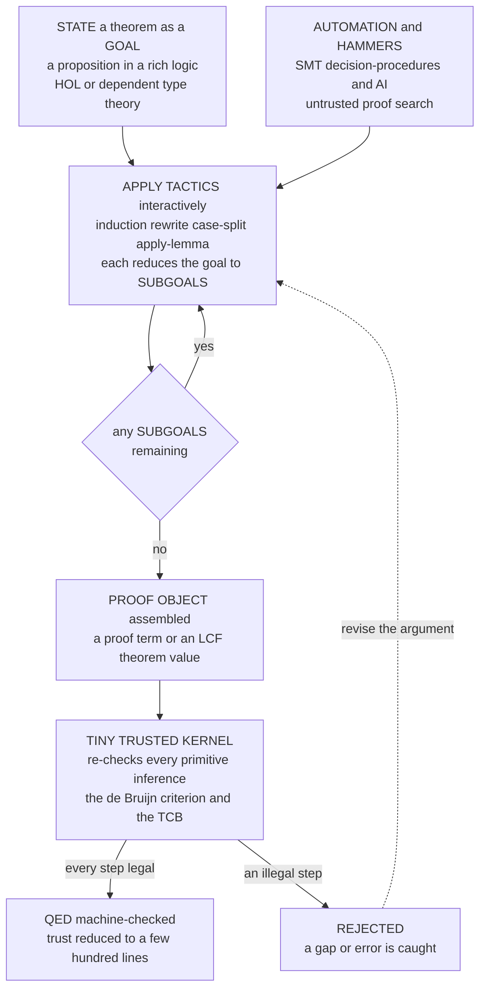

# ✅ Interactive Theorem Proving

> [!abstract] TL;DR
> **Interactive theorem proving (ITP)** is machine-checked proof where a **human guides** the high-level argument and the **computer verifies every step** — the most powerful, and most laborious, verification technique known. You state a theorem in a rich logic (**higher-order logic** or **dependent type theory**) and construct the proof interactively by applying **tactics** (proof commands — `induction`, `rewrite`, `case-split`, `apply-lemma`) that reduce a goal to **subgoals**, until nothing remains (**QED**). Trust rests on the **LCF architecture**: everything must pass through a *tiny, trusted* **kernel** implementing only the primitive inference rules, so correctness reduces to auditing a few hundred lines — the **de Bruijn criterion** (a proof is an independently checkable object). Two families dominate: **type-theory** provers (**Coq/Rocq, Lean, Agda, Idris**) built on the **Curry–Howard correspondence** (propositions = types, proofs = programs), and **higher-order-logic** provers (**Isabelle/HOL, HOL Light, HOL4**). It is the "heavyweight" end of the verification spectrum: person-years of effort for the strongest guarantee that exists — the payoff being a **verified C compiler (CompCert)**, a **verified OS microkernel (seL4)**, and machine-checked proofs of the **Four-Colour**, **Feit–Thompson**, and **Kepler** theorems.

---

## Intuition

**Analogy — a chess partner who never lets you make an illegal move.** Imagine playing chess with a partner who lets you choose *any* strategy — daring sacrifices, deep plans, whatever insight you can muster — but who mechanically checks *every single move* against the rules of the game. You cannot slide a bishop like a rook, cannot leave your king in check, cannot "assume" a piece onto a better square. If, guided by your ideas, you reach checkmate, it is *genuinely* checkmate: not a claim, but a fact, verified move by move.

An interactive theorem prover is that partner for **mathematical proof**. You supply the strategy and insight — the right induction, the key lemma, the clever case split — and the machine mechanically verifies each inference against the axioms of logic. It has no imagination and no mercy: a step that does not follow from the rules is simply *rejected*. The result is a proof checked down to the last atom — which is exactly how a whole **C compiler** and an **OS kernel** have been proven correct with essentially **zero trust required**. Testing can show the presence of bugs; a machine-checked proof shows their *absence*.

---

## How It Works

### Core Mechanics

1. **State the theorem as a goal.** You express the claim in the prover's logic — **higher-order logic** (Isabelle/HOL, HOL Light) or **dependent type theory** (Coq, Lean, Agda). The unproved theorem becomes the current **goal**, together with the hypotheses in scope.

2. **Apply tactics to reduce the goal to subgoals.** Instead of writing a raw proof, you issue **tactics** — `intro`, `apply`, `induction`, `rewrite`, `cases`, `simp`, `auto`. Each tactic transforms the goal, typically *splitting* it into simpler **subgoals** (e.g. induction yields a base case and a step case) and recording the inference it performed. Proof search runs **backward**, from the conclusion toward the axioms.

3. **The prover checks each inference against the logical kernel.** Every step a tactic takes is ultimately reduced to a **primitive inference rule**. In the **LCF architecture**, tactics cannot fabricate theorems; they can only combine primitive rules exposed by a small **kernel**. Whatever automation produced a step, the kernel is what makes it *legal*.

4. **Repeat until no subgoals remain — QED.** You keep applying tactics (and lemmas you proved earlier) until the goal list is empty. At that point the system has assembled a **proof object**: in type-theory provers a **proof term** (a program whose *type* is the theorem, by Curry–Howard); in HOL provers an LCF `theorem` value that could only have been built by legal rule applications.

5. **Trust reduces to a tiny kernel (the de Bruijn criterion).** The final proof object is **re-checkable independently**. Coq's kernel is a few thousand lines; HOL Light's is famously tiny. Everything above it — the tactic language, elaborator, automation, IDE — is **untrusted**, because its output is re-verified from scratch by the kernel. You audit the kernel and the theorem *statement*; nothing else needs your trust. This is the **de Bruijn criterion**: proofs are concrete objects a small checker can validate.

6. **Automation shrinks the manual burden.** Modern provers call powerful automation *inside* an interactive session — **hammers** (Isabelle's **Sledgehammer**, **CoqHammer**) that dispatch goals to external ATPs and **SMT** solvers and then *reconstruct* a kernel-checkable proof, decision procedures (`ring`, `omega`, `decide`), and emerging **ML/AI** proof search. The checking always remains the trusted last word.

**Interactive vs automated.** This is the defining contrast: an *automated* theorem prover or SMT solver *searches* for a proof on its own (fully automatic, but limited to decidable or semi-decidable fragments); an *interactive* prover lets a **human supply the ideas** while the **machine only checks** — so it can verify *arbitrarily deep* mathematics that no automatic search could find.

### Flow / Architecture



---

## Key Concepts

**Secondary (explain to a curious beginner).**
- An **interactive theorem prover** is a program where *you* build the proof and the *computer* checks every step, so no mistake gets through.
- **Interactive** means *human guides, machine checks* — the opposite of an *automated* prover that searches on its own.
- You only have to trust a **tiny checking core** (the *kernel*), even when the smart tools that helped you are huge.

**Undergraduate (requires a CS background).**
- **Tactics and subgoals** — proof commands (`induction`, `rewrite`, `apply`) that reduce a goal to simpler subgoals, working *backward* from the conclusion.
- **The LCF architecture** — theorems are an abstract data type; only the kernel's primitive rules can create one, so tactics *cannot* forge a proof.
- **The de Bruijn criterion** — a proof is a concrete, independently checkable object; trust reduces to a *small* kernel (the Trusted Computing Base).
- **Curry–Howard** — in type-theory provers, *propositions are types* and *proofs are programs*, so **proof-checking is type-checking** ([[The_Curry_Howard_Correspondence]]).
- **The two families** — type-theory based (Coq, Lean, Agda, Idris) vs higher-order-logic based (Isabelle/HOL, HOL Light, HOL4).

**Graduate (foundational and system-level thinking).**
- **Dependent type theory** — `Π` (dependent function = `∀`), `Σ` (dependent pair = `∃`), and **identity** types; **Martin-Löf type theory** and the **Calculus of Inductive Constructions** ([[Dependent_Types_and_Advanced_Type_Systems]]).
- **Constructive vs classical** — a constructive proof carries *computational content* (a witness you can extract as code); adding excluded middle or choice sacrifices extraction and must stay *consistent* ([[Intuitionistic_and_Constructive_Logic]]).
- **Tactic languages** — `Ltac`/`Ltac2` (Coq), Isar (Isabelle), Lean's metaprogramming — the untrusted layer that *builds* proofs the kernel then re-checks.
- **The residual TCB** — you still trust the **kernel**, the **axioms** you added, and that the **statement** says what you meant; decidable type-checking forces **termination/strong-normalization** and **strict positivity** for consistency.
- **Reflection and hammers** — verified decision procedures run *inside* the logic; hammers reconstruct external ATP/SMT results as kernel proofs, and **Gödel's incompleteness** ([[Godels_Incompleteness_Theorems]]) bounds what any single consistent system can prove.

---

## Python Demo

We build interactive theorem proving in miniature. **(a)** A **trusted kernel** validates a **natural-deduction** proof line by line — every branch is exactly one primitive inference rule (*premise*, *modus ponens*, *and-intro*, *and-elim*). We prove a small propositional theorem **step by step**, watching the kernel **accept** each legal line and **reject** a deliberately invalid one. **(b)** We then illustrate the **de Bruijn criterion**: an *untrusted* forward-chaining **tactic** builds a proof automatically, and the *same tiny trusted kernel* re-checks it — after which we measure the **trust base** by counting kernel lines vs tactic/library lines. Pure `numpy` + `matplotlib`.

```python
# Interactive theorem proving in miniature: a TRUSTED KERNEL that checks a
# natural-deduction proof line by line, plus an UNTRUSTED tactic that builds
# proofs -- the LCF / de Bruijn architecture. numpy + matplotlib.
import numpy as np
import matplotlib.pyplot as plt
import inspect

# ---------- Propositions as nested tuples ----------
def atom(a):    return ('atom', a)
def imp(p, q):  return ('imp', p, q)
def conj(p, q): return ('and', p, q)

def show(f):
    k = f[0]
    if k == 'atom': return f[1]
    if k == 'imp':  return "(%s->%s)" % (show(f[1]), show(f[2]))
    if k == 'and':  return "(%s&%s)"  % (show(f[1]), show(f[2]))

# ================= THE TRUSTED KERNEL (the entire TCB) =================
# Validate ONE proof line against already-established lines. Each branch is
# exactly one primitive inference rule. Nothing else is trusted.
def kernel_check(formula, rule, refs, env):
    if rule == 'premise':                                   # a given assumption
        return True
    if rule == 'MP':                                        # ->-elim (modus ponens)
        a, ab = env[refs[0]], env[refs[1]]
        return ab[0] == 'imp' and ab[1] == a and ab[2] == formula
    if rule == 'andI':                                      # &-intro
        l, r = env[refs[0]], env[refs[1]]
        return formula == ('and', l, r)
    if rule == 'andEl':                                     # &-elim (left)
        c = env[refs[0]]
        return c[0] == 'and' and c[1] == formula
    if rule == 'andEr':                                     # &-elim (right)
        c = env[refs[0]]
        return c[0] == 'and' and c[2] == formula
    return False
# ======================================================================

def check_proof(lines):
    """Driver (UNTRUSTED): feed each line to the kernel; collect verdicts."""
    env, verdicts = {}, []
    for i, (formula, rule, refs) in enumerate(lines, start=1):
        ok = all(r in env for r in refs) and kernel_check(formula, rule, refs, env)
        if ok:
            env[i] = formula
        verdicts.append(ok)
    return verdicts

# ---------- TACTIC / LIBRARY layer (UNTRUSTED): forward proof search ----------
def forward_prove(premises, goal):
    """Chain modus-ponens + and-elim/-intro to build a proof of `goal`."""
    lines = [(p, 'premise', ()) for p in premises]
    known = {p: i + 1 for i, p in enumerate(premises)}
    changed = True
    while changed and goal not in known:
        changed = False
        for i, (f, _, _) in enumerate(list(lines), start=1):
            if f[0] == 'imp' and f[1] in known and f[2] not in known:       # MP
                lines.append((f[2], 'MP', (known[f[1]], i)))
                known[f[2]] = len(lines); changed = True
            if f[0] == 'and':                                               # and-elim
                if f[1] not in known:
                    lines.append((f[1], 'andEl', (i,))); known[f[1]] = len(lines); changed = True
                if f[2] not in known:
                    lines.append((f[2], 'andEr', (i,))); known[f[2]] = len(lines); changed = True
        if goal[0] == 'and' and goal[1] in known and goal[2] in known and goal not in known:
            lines.append((goal, 'andI', (known[goal[1]], known[goal[2]])))  # and-intro
            known[goal] = len(lines); changed = True
    return lines

# ---------- (a) a hand-written proof WITH a deliberately invalid step ----------
P, Q, R, S = atom('P'), atom('Q'), atom('R'), atom('S')
manual = [
    (P,            'premise', ()),      # 1  given
    (imp(P, Q),    'premise', ()),      # 2  given
    (imp(Q, R),    'premise', ()),      # 3  given
    (Q,            'MP',   (1, 2)),     # 4  modus ponens 1,2         -> accept
    (R,            'MP',   (4, 3)),     # 5  modus ponens 4,3         -> accept
    (conj(P, R),   'andI', (1, 5)),     # 6  and-intro 1,5            -> accept
    (R,            'andEr',(6,)),       # 7  and-elim right 6         -> accept
    (S,            'MP',   (4, 3)),     # 8  BOGUS: 4,3 yield R not S -> REJECT
]
verdicts = check_proof(manual)
print("=== (a) kernel checks each proof line ===")
for i, ((f, rule, refs), ok) in enumerate(zip(manual, verdicts), start=1):
    print("  line %d  %-9s %-14s  =>  %s"
          % (i, rule, show(f), "ACCEPT" if ok else "REJECT"))

# ---------- (b) de Bruijn: untrusted tactic builds it, trusted kernel re-checks ----------
auto = forward_prove([P, imp(P, Q), imp(Q, R)], conj(P, R))
auto_ok = check_proof(auto)
print("\n=== (b) tactic builds a proof of (P&R); the SAME kernel re-checks ===")
print("  tactic produced %d lines; kernel accepts all: %s"
      % (len(auto), all(auto_ok)))

# trust base = kernel lines only; everything else is re-checked, hence untrusted
kernel_loc  = len(inspect.getsourcelines(kernel_check)[0])
library_loc = sum(len(inspect.getsourcelines(fn)[0])
                  for fn in (check_proof, forward_prove))
print("  TRUSTED kernel: %d lines   |   UNTRUSTED tactics/driver: %d lines"
      % (kernel_loc, library_loc))

# ---------- plots ----------
fig, (ax1, ax2) = plt.subplots(1, 2, figsize=(13, 4.6))

x = np.arange(1, len(manual) + 1)
colors = ['#2ca02c' if ok else '#d62728' for ok in verdicts]
ax1.bar(x, np.ones_like(x), color=colors, edgecolor='black')
ax1.set_xticks(x)
ax1.set_xticklabels(["%d\n%s\n%s" % (i, manual[i-1][1], show(manual[i-1][0]))
                     for i in x], fontsize=7)
ax1.set_yticks([]); ax1.set_ylim(0, 1.35)
ax1.set_title("(a) Kernel verdict per proof step\ngreen = legal inference, red = rejected")
for xi, ok in zip(x, verdicts):
    ax1.text(xi, 1.06, "OK" if ok else "X", ha='center', fontweight='bold',
             color=('#2ca02c' if ok else '#d62728'))

bars = ax2.bar(["trusted\nKERNEL", "untrusted\ntactics + driver"],
               [kernel_loc, library_loc], color=['#1f77b4', '#bbbbbb'],
               edgecolor='black')
ax2.set_ylabel("lines of code")
ax2.set_title("(b) de Bruijn criterion\ntrust reduces to a tiny kernel")
for b, v in zip(bars, [kernel_loc, library_loc]):
    ax2.text(b.get_x() + b.get_width()/2, v + 0.4, str(v), ha='center',
             fontweight='bold')
ratio = library_loc / kernel_loc
ax2.text(0.5, 0.9, "you re-check %.1fx more code\nthan you must trust" % ratio,
         transform=ax2.transAxes, ha='center', va='top',
         bbox=dict(boxstyle='round', fc='#fff3cd', ec='#b8860b'))

plt.tight_layout()
plt.savefig("interactive_theorem_proving_demo.png", dpi=110)
print("\nsaved interactive_theorem_proving_demo.png")
```

**What it shows.** In panel (a) the kernel walks the proof line by line: lines 4–7 are **accepted** because *modus ponens*, *and-intro*, and *and-elim* are applied legally to earlier lines, while line 8 is **rejected** — it claims `S` from `MP 4,3`, but those lines only yield `R`, so the machine catches the gap a human might skim past. Panel (b) makes the **de Bruijn** trust story concrete: a completely separate, *untrusted* forward-chaining **tactic** discovers a proof of `(P&R)` automatically, yet the *same tiny trusted kernel* re-validates every line — and the bar chart shows the **trust base** (the kernel) is a fraction of the tactic/driver code it re-checks. Real systems (Coq, Lean, Isabelle) swap atoms for `Π`/`Σ`/inductive types and this ~15-line kernel for a few-thousand-line one, but the *architecture is identical*: trust the small checker, not the big prover.

---

## Real-World Applications

> **Example — seL4, a verified OS microkernel (Isabelle/HOL).** The **seL4** microkernel carries a machine-checked proof, developed in **Isabelle/HOL**, that its C implementation *refines* its abstract specification — full **functional correctness**, extended later to **integrity** and **confidentiality**. Roughly 10k lines of C are matched by a proof of order 200k lines, built over person-years. The result is the strongest assurance any operating-system kernel has ever had: not "we tested it hard," but a proof, checked by a tiny kernel, that the code does exactly what the spec says. It now runs in avionics, automotive, and defence systems.

- **CompCert — a verified C compiler (Coq).** Xavier Leroy's **CompCert** is proven in **Coq** to *preserve the semantics* of the C it compiles; its verified core is extracted from the proof. A famous fuzzing study (Csmith) found *zero* miscompilation bugs in CompCert's verified passes while finding many in GCC and LLVM. (Sibling note, prose only: *Verified_Compilers_and_Operating_Systems*.)
- **The Four-Colour Theorem (Coq).** Gonthier's team replaced a computer-assisted proof no one could fully audit with a *fully machine-checked* argument (2005), then formalized the monumental **Feit–Thompson odd-order theorem** (2012) — hundreds of pages of group theory, entirely checked.
- **The Kepler conjecture — Flyspeck (HOL Light + Isabelle).** Thomas Hales's proof of optimal sphere packing relied on computation referees could not certify by hand; the **Flyspeck** project (2014) formalized the *entire* proof, settling the doubt with a machine-checked certificate.
- **Verified cryptography and mathlib.** **HACL\***/Everest and **Fiat-Crypto** ship formally-verified, constant-time crypto in **F\*** and **Coq** (used in Firefox, Linux, WireGuard); **Lean 4**'s **mathlib** is a unified, fast-growing library of formalized mathematics, and researchers including **Terence Tao** formalize recent results with it — increasingly with **AI-assisted** search that uses the prover as the ground-truth checker.
- **Where ITP sits on the spectrum.** ITP is the *heavyweight* end. Lighter automatic techniques — SAT/SMT (siblings, prose only: *Automated_Theorem_Proving*, *SMT_Solving_and_Satisfiability_Modulo_Theories*), model checking, and deductive verifiers (*Deductive_Verification_Tools*, *Logic_for_Program_Verification*) — are push-button but bounded; ITP demands human effort but has essentially *no* bound on what it can prove.

---

## Common Pitfalls

- **Confusing *interactive* with *automated*.** A **proof assistant** = human guides, machine *checks*; an **automated prover / SMT solver** = machine *searches* on its own. ITP is chosen precisely when the mathematics is too deep for automatic search — the human supplies the ideas.
- **Trusting the wrong thing.** The **LCF/kernel architecture** and the **de Bruijn criterion** mean you trust only a *tiny kernel* — but a "proof" is still only as good as the **theorem statement** and the **axioms** you assumed. "It compiles/checks" guarantees the *proof object has the claimed type*, not that the *statement says what you meant*.
- **Forgetting that tactics are untrusted.** **Tactics *build* proofs; the kernel *checks* them.** A buggy tactic cannot produce a false theorem (the kernel re-checks its output), but it can *fail*, loop, or produce a proof of the *wrong* goal — never mistake a tactic succeeding for the theorem being the one you wanted.
- **Missing the two families' foundations.** Type-theory provers (**Coq, Lean, Agda**) rest on the **Curry–Howard** basis — *proofs = programs, propositions = types* — so proof-checking *is type-checking*; HOL-family provers (**Isabelle/HOL, HOL Light, HOL4**) build LCF `theorem` values instead. The trust philosophy is shared; the mechanics differ.
- **Underestimating the effort.** Proof effort is **HIGH** — formalizing a "one-page" human proof can take *weeks* and expand it 4–20×, because every "clearly" must be made explicit. This is the field's central cost, and the reason **automation (hammers/SMT, AI)** to shrink it is a hot frontier.
- **Classical vs constructive confusion.** In constructive provers a proof of `∃x. P x` yields an *extractable* witness (verified code for free); adding **excluded middle** or **choice** is convenient but breaks extraction and must remain *consistent*. Beginners reach for classical axioms and lose the computational payoff.
- **Disabling termination/positivity checks.** Decidable type-checking needs all type-level functions to **terminate** and inductive definitions to be **strictly positive**; switch these off and you can "prove" `False` — total soundness collapse.

---

## Related Concepts

- [[Proof_Assistants_and_Dependent_Type_Theory]] — the companion deep-dive on the type-theory family (Coq/Lean/Agda) and the `Π`/`Σ`/identity machinery this note frames from the verification-spectrum angle.
- [[The_Curry_Howard_Correspondence]] — the propositions-as-types, proofs-as-programs dictionary that makes proof-checking *be* type-checking in Coq/Lean/Agda.
- [[Dependent_Types_and_Advanced_Type_Systems]] — the dependent-type foundation (Martin-Löf, Calculus of Inductive Constructions) underlying type-theory provers.
- [[Intuitionistic_and_Constructive_Logic]] — the constructive logic whose proofs carry computational content and enable program extraction; classical-vs-constructive is a core ITP choice.
- [[Formal_Systems_and_Proof_Calculi]] — natural deduction and sequent calculi are exactly the primitive inference rules a prover's kernel implements.
- [[Godels_Incompleteness_Theorems]] — the fundamental limit: no single consistent, sufficiently strong system proves all truths, bounding what any prover can achieve.

*(Siblings referenced in prose within this Formal_Methods vault: Logic_for_Program_Verification, Automated_Theorem_Proving, SMT_Solving_and_Satisfiability_Modulo_Theories, Deductive_Verification_Tools, Verified_Compilers_and_Operating_Systems.)*

---

## Review Questions

1. **(Secondary)** In one or two sentences, explain the difference between an **interactive** theorem prover (like Coq or Isabelle) and an **automated** one (like an SMT solver). Who supplies the ideas, and who does the checking, in each?
2. **(Undergraduate)** Explain the **de Bruijn criterion** and the **LCF architecture**: why can a proof assistant safely use a huge, buggy, *untrusted* tactic and automation layer while remaining fully trustworthy? What exactly is left in the Trusted Computing Base?
3. **(Graduate)** Contrast the **type-theory** family (Coq/Lean/Agda, built on Curry–Howard) with the **HOL** family (Isabelle/HOL, HOL Light). Explain why *decidable type-checking* forces **termination** and **strict positivity**, and describe one concrete way soundness collapses if those checks are disabled. Then argue when the person-years cost of ITP is justified over automatic SAT/SMT/model-checking.

---

## Sources

- Benjamin C. Pierce et al., *Software Foundations* (Vol. 1, *Logical Foundations*) — Coq, Curry–Howard, tactics, and the kernel idea taught from scratch. <https://softwarefoundations.cis.upenn.edu/>
- Adam Chlipala, *Certified Programming with Dependent Types* — engineering large machine-checked proofs and automation in Coq. <http://adam.chlipala.net/cpdt/>
- Tobias Nipkow, Lawrence C. Paulson & Markus Wenzel, *Isabelle/HOL: A Proof Assistant for Higher-Order Logic* (Springer LNCS 2283). <https://isabelle.in.tum.de/doc/tutorial.pdf>
- John Harrison, *Handbook of Practical Logic and Automated Reasoning* (Cambridge University Press, 2009) — LCF architecture, HOL Light, and the trusted-kernel discipline. <https://www.cl.cam.ac.uk/~jrh13/atp/>

---

#formal-methods #theorem-proving #coq #isabelle #curry-howard
