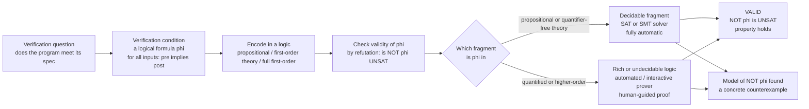

# ⚖️ Logic for Program Verification

> [!abstract] TL;DR
> Program verification **is** logic wearing a hard hat. A correctness claim — *"for every input satisfying the **precondition**, the output satisfies the **postcondition**"* — is not English hand-waving; it is a **logical formula** called a **verification condition (VC)**. Proving the program correct means proving that formula is **valid** (true in *every* model). By the **refutation duality** that every automated tool exploits, `φ is VALID  ⟺  ¬φ is UNSATisfiable` — so checkers instead hunt for a model of `¬φ`, which is exactly a **counterexample**. The catch, and the whole drama of formal methods, is **decidability**: **propositional logic** is decidable (NP-complete — the realm of **SAT** solvers); **first-order theories** with quantifier-free fragments are often decidable (the realm of **SMT** solvers); but **full first-order logic** is only **semi-decidable**, and richer logics are outright **undecidable** (Church–Turing). Every verification tool is therefore a negotiated settlement with the boundary of what machines can decide at all — automation below the line, human-guided proof above it.

---

## Intuition

**Analogy — logic is the language verification *speaks*.** When an engineer says "this sorting routine is correct," they *sound* like they are making an engineering claim, but they are really uttering a **mathematical sentence**: *for all input lists, if the input is a finite array then the output is a sorted permutation of it.* That sentence is either **true in every possible world** or it isn't — and "proving the program correct" means **manipulating that sentence** the way algebra manipulates equations, pushing symbols under fixed rules until its truth is settled. The program is the story; the **verification condition is the theorem**; the solver is the mathematician.

And here is the twist that makes the field deep rather than merely tedious. You might hope a machine could always settle any such sentence. It cannot. Deciding whether an *arbitrary* logical formula is satisfiable can be **undecidable** — there is provably no algorithm that always halts with the right yes/no. So every verification tool is a **clever negotiation with the boundary of computability**: pick a fragment of logic small enough to be decidable, throw a fast solver at it, and reach for a human only when the claim escapes into the undecidable wilds.

---

## How It Works

### Core Mechanics

1. **A correctness claim becomes a formula.** The Hoare triple `{P} C {Q}` ("starting in a state satisfying `P`, running `C` ends in a state satisfying `Q`") is compiled by a **verification-condition generator** into a pure logical formula — no program left, just symbols. Loops contribute their **invariants**; the result is one big implication `P ∧ (semantics of C) ⟹ Q`.

2. **"Correct" means VALID.** The program meets its spec **iff** that VC is **valid** — true under *every* interpretation of its free symbols. Validity (`⊨ φ`) is the semantic gold standard: no input, no state, no model can break the claim.

3. **The refutation duality — the master trick.** Checking validity directly ("try all infinitely many models") is hopeless, so tools flip it: **`φ is valid  ⟺  ¬φ is unsatisfiable`**. A solver assumes the property is *false* and searches for a single **satisfying model of `¬φ`**. If it finds one, that model is a **concrete counterexample** (a failing input/trace); if it exhausts the search and finds none, `¬φ` is UNSAT, so `φ` is valid — **the property holds**. Every SAT and SMT solver on Earth runs this refutation loop.

4. **Which logic? — the fragment decides the tool.**
   - **Propositional (Boolean) logic** — variables are just true/false. **Decidable**, and satisfiability is the canonical **NP-complete** problem (Cook–Levin). This is the home of **SAT** solvers (see *SAT_Solving_and_DPLL* in prose).
   - **First-order theories** — add equality, linear arithmetic, arrays, bit-vectors, algebraic datatypes. Many have **decidable quantifier-free fragments**, so their VCs can be dispatched automatically by **SMT** solvers (*SMT_Solving_and_Satisfiability_Modulo_Theories*).
   - **Full first-order logic** — quantifiers over unbounded domains, uninterpreted functions and predicates. **Expressive but only semi-decidable**: validity is recursively enumerable (a proof, if one exists, will be found) but **undecidable** in general. This is the province of **automated theorem provers** (*Automated_Theorem_Proving*) and, for the richest logics, **interactive** ones (*Interactive_Theorem_Proving*).

5. **Syntax vs semantics — two independent worlds that must agree.** **Semantics** (`⊨`) is about *truth in models*; **syntax** (`⊢`) is about *derivations in a proof system*. **Soundness** guarantees a solver only certifies genuinely valid things (`⊢ ⟹ ⊨`); **completeness** guarantees every valid thing is in principle provable (`⊨ ⟹ ⊢` — Gödel's completeness theorem for FO). A verifier is only trustworthy if it is **sound**; it is only *fully automatic on a fragment* if that fragment is **decidable**.

### Flow / Architecture



---

## Key Concepts

### Secondary (intuitive)
- **A correctness claim is a sentence that is either true everywhere or not.** Verifying = deciding which.
- **Valid vs satisfiable vs unsatisfiable.** *Valid* = true in every world (a tautology). *Satisfiable* = true in at least one world. *Unsatisfiable* = true in no world (a contradiction). "The program is correct" means the claim is **valid**.
- **Look for a counterexample instead.** Rather than prove "always works," a tool tries to build one case where it **breaks**. Fail to find one after an exhaustive search, and you have a proof.
- **Some questions have no algorithm.** For rich logics, no machine can always answer yes/no — so humans still have to help with the hardest proofs.

### Undergraduate (formal)
- **Verification condition (VC).** A formula, generated from a Hoare triple or symbolic execution, whose **validity is equivalent to the program meeting its specification**.
- **Semantic notions.** `M ⊨ φ`: formula `φ` is true in model `M`. **Valid** (`⊨ φ`): true in all models. **Satisfiable**: true in some model. **Entailment** `Γ ⊨ φ`: every model of `Γ` satisfies `φ`.
- **The refutation principle.** `⊨ φ  ⟺  ¬φ is unsatisfiable`, and more generally `Γ ⊨ φ  ⟺  Γ ∪ {¬φ}` is unsatisfiable. Reduces validity/entailment to a single **SAT/UNSAT** query.
- **The three logical layers of tooling.** Propositional (SAT, decidable/NP-complete) ⊂ first-order theories with QF-decidable fragments (SMT) ⊂ full first-order logic (theorem provers, semi-decidable).
- **Proof systems.** Natural deduction, sequent calculus, Hilbert systems, and **resolution** (the machine-friendly one). **Soundness** = only valid formulas provable; **completeness** = all valid formulas provable.

### Graduate (deep)
- **Decidability landscape as engineering constraint.** Propositional SAT is `NP`-complete; quantifier-free linear real arithmetic (QF-LRA) is decidable in polynomial-ish time (feasibility of linear programs), QF-LIA is `NP`-complete; **Presburger arithmetic** (FO linear integer arithmetic *with* quantifiers) is decidable but has a **doubly/triply exponential** lower bound; **full FO validity** is `Σ₁`-complete — semi-decidable, undecidable (Church, Turing); **true arithmetic** (FO + multiplication) is not even arithmetical.
- **Nelson–Oppen and theory combination.** SMT works because decidable theories combine: the Nelson–Oppen procedure builds a decision procedure for the union of stably-infinite, signature-disjoint theories — the reason a single SMT call reasons about arrays *and* bit-vectors *and* arithmetic at once.
- **Completeness of the LOGIC vs decidability of VALIDITY.** Gödel completeness makes FO theoremhood *recursively enumerable* — a proof search that halts on valid inputs — but by Church–Turing, validity is **not decidable**: on invalid inputs the search may run forever. Semi-decidable ≠ decidable is the exact gap that forces interactive proof.
- **Refutation-completeness.** Resolution and superposition are not complete for deriving arbitrary consequences but are **refutation-complete**: if a set is unsatisfiable, the empty clause is derivable. This is *why* solvers phrase everything as UNSAT of a negation.

---

## Python Demo

Two experiments. **(a)** A tiny truth-table engine classifies propositional formulas as **VALID / SAT / UNSAT** and demonstrates the **refutation duality** `VALID(φ) ⟺ UNSAT(¬φ)` — the basis of every refutation-based checker — on a handful of real verification conditions (including a deliberately *buggy* one that the checker catches). **(b)** A chart of the **decidability-and-cost ladder**: which logics solvers can decide automatically, at what price, and where automation gives way to human-guided proof.

```python
# Logic for verification:
#  (a) classify propositional formulas VALID / SAT / UNSAT via truth tables,
#      and confirm the refutation duality  VALID(phi) <=> UNSAT(not phi);
#  (b) chart the decidability-and-cost landscape that decides WHICH solver a logic needs.
import numpy as np
import matplotlib.pyplot as plt
import itertools

# ---------- (a) a tiny truth-table engine over propositional logic ----------
# AST: ('var',n) | ('not',f) | ('and',f,g) | ('or',f,g) | ('imp',f,g) | ('iff',f,g)
def variables(f):
    if f[0] == 'var': return {f[1]}
    if f[0] == 'not': return variables(f[1])
    return variables(f[1]) | variables(f[2])

def evaluate(f, a):
    op = f[0]
    if op == 'var': return a[f[1]]
    if op == 'not': return not evaluate(f[1], a)
    x = evaluate(f[1], a)
    if op == 'and': return x and evaluate(f[2], a)
    if op == 'or':  return x or  evaluate(f[2], a)
    if op == 'imp': return (not x) or evaluate(f[2], a)
    if op == 'iff': return x == evaluate(f[2], a)

def model_counts(f):
    "How many of the 2**n assignments satisfy f (the whole truth table)."
    vs = sorted(variables(f))
    rows = list(itertools.product([False, True], repeat=len(vs)))
    n_true = sum(1 for bits in rows if evaluate(f, dict(zip(vs, bits))))
    return n_true, len(rows)

def classify(f):
    t, n = model_counts(f)
    if t == n: return 'VALID'   # true in EVERY model  -> a tautology / theorem
    if t == 0: return 'UNSAT'   # true in NO model     -> a contradiction
    return 'SAT'                # true in some, not all -> satisfiable, not valid

# The refutation duality every SAT/SMT solver exploits:  VALID(phi) <=> UNSAT(not phi)
def valid_by_refutation(f):
    return classify(('not', f)) == 'UNSAT'

# ---------- candidate verification conditions, written as formulas ----------
p, q, r = ('var','p'), ('var','q'), ('var','r')
VCs = {
    "excluded middle":   ('or', p, ('not', p)),                                   # VALID
    "modus ponens":      ('imp', ('and', p, ('imp', p, q)), q),                   # VALID
    "hypo. syllogism":   ('imp', ('and', ('imp',p,q), ('imp',q,r)), ('imp',p,r)), # VALID
    "contrapositive":    ('iff', ('imp',p,q), ('imp',('not',q),('not',p))),       # VALID
    "BUGGY VC":          ('imp', ('or', p, q), p),                                # SAT (not valid): p=F,q=T breaks it
    "contradiction":     ('and', p, ('not', p)),                                  # UNSAT
}

print("classification of candidate verification conditions")
print("-" * 64)
labels, statuses, fracs = [], [], []
for name, f in VCs.items():
    t, n = model_counts(f)
    cls = classify(f)
    dual = valid_by_refutation(f)
    duality_ok = (cls == 'VALID') == dual
    print(f"{name:<18} {cls:<6}  models {t}/{n}   valid_by_refutation={dual}   duality_ok={duality_ok}")
    labels.append(name); statuses.append(cls); fracs.append(t / n)

# ---------- (b) the decidability-and-cost ladder ----------
# (logic, decidability class, relative cost/undecidability rank, short note)
logics = [
    ("Propositional\n(SAT)",                    "decidable",      3,  "NP-complete"),
    ("QF linear arithmetic\n(LRA / LIA, SMT)",  "decidable",      4,  "P to NP-complete"),
    ("Presburger arithmetic\n(FO linear int.)", "decidable",      7,  "super-exponential"),
    ("Full first-order\nlogic",                 "semi-decidable", 9,  "r.e., undecidable"),
    ("FO + full arithmetic /\nhigher-order",    "undecidable",    11, "no decision proc."),
]
dcolor = {'decidable': '#16a34a', 'semi-decidable': '#f59e0b', 'undecidable': '#dc2626'}

# ---------- plot both panels ----------
fig, ax = plt.subplots(1, 2, figsize=(15, 6))

# panel (a): VALID vs SAT vs UNSAT
cmap = {'VALID': '#16a34a', 'SAT': '#2563eb', 'UNSAT': '#dc2626'}
y = np.arange(len(labels))
ax[0].barh(y, fracs, color=[cmap[s] for s in statuses])
ax[0].set_yticks(y); ax[0].set_yticklabels(labels)
ax[0].invert_yaxis()
ax[0].set_xlim(0, 1.12)
ax[0].axvline(1.0, ls='--', color='#16a34a', lw=1)
ax[0].set_xlabel('fraction of models where the formula is TRUE')
ax[0].set_title('(a) VALID vs SAT vs UNSAT\nfull bar = VALID (holds) | 0 = UNSAT | partial = SAT (counterexample)')
for yi, (fr, st) in enumerate(zip(fracs, statuses)):
    ax[0].text(min(fr + 0.02, 1.0), yi, st, va='center', fontsize=9, fontweight='bold')

# panel (b): the decidability / cost ladder
names  = [x[0] for x in logics]
costs  = [x[2] for x in logics]
colors = [dcolor[x[1]] for x in logics]
notes  = [x[3] for x in logics]
xx = np.arange(len(names))
ax[1].bar(xx, costs, color=colors)
ax[1].set_xticks(xx); ax[1].set_xticklabels(names, fontsize=8)
ax[1].set_ylim(0, 13)
ax[1].set_ylabel('relative worst-case cost  /  undecidability rank')
ax[1].set_title('(b) decidability-and-cost ladder\ngreen = decidable (SAT/SMT) | orange = semi-decidable | red = undecidable')
for xi, (c, nt) in enumerate(zip(costs, notes)):
    ax[1].text(xi, c + 0.2, nt, ha='center', va='bottom', fontsize=7)
ax[1].axhline(8, ls='--', color='gray', lw=1)
ax[1].text(-0.4, 8.2, 'automation frontier: below = automatic solvers,  above = interactive proof',
           fontsize=7, color='gray')

plt.tight_layout()
plt.savefig('logic_for_verification.png', dpi=120)
plt.show()
```

Panel **(a)** shows the buggy VC `(p ∨ q) → p` landing in the **SAT** (not VALID) column: a checker refuting its negation would return the model `p=False, q=True` — a **counterexample** exposing the bug. The `duality_ok` column prints `True` on every row, confirming `VALID(φ) ⟺ UNSAT(¬φ)`. Panel **(b)** is the field's fundamental map: propositional and quantifier-free theories sit **below** the automation frontier (hand them to SAT/SMT), while full first-order and richer logics rise **above** it into semi-decidable and undecidable territory where interactive proof is unavoidable.

---

## Real-World Applications

> **Example — Amazon Web Services runs SMT in production.** AWS's **Zelkova** service encodes IAM access-control policies as **first-order theory** formulas and asks the **Z3** SMT solver a validity question: *"is it valid that no principal outside the account can reach this bucket?"* Internally Z3 checks the **negation for satisfiability** — a satisfying model is precisely a policy loophole (a counterexample access path). Because the fragment is **decidable**, the answer is automatic and sound; this powers the "public bucket" warnings and the **s2n** TLS proofs.

- **Software model checking (CBMC, SLAM, SPIN).** Programs are unrolled into propositional or bit-vector formulas; a **SAT/SMT** solver decides reachability of an error state, returning a failing trace as the satisfying model. Microsoft's Static Driver Verifier shipped this to Windows driver authors.
- **Proof assistants for critical software (Coq, Isabelle, Lean).** The **seL4** microkernel and the **CompCert** C compiler carry machine-checked correctness proofs in **higher-order logic** — the undecidable end of the ladder, where humans supply the proof and a *sound* kernel checks it.
- **Auto-active verifiers (Dafny, Frama-C, Why3).** Programmers annotate pre/postconditions and invariants; a VC generator emits first-order theory obligations that **SMT** solvers discharge automatically, escalating to interactive proof only for the residue.
- **Hardware equivalence & security.** Chip vendors prove two circuit designs logically **equivalent** by checking a propositional formula is a tautology (SAT); side-channel and crypto tools (e.g. cryptol/SAW) reduce constant-time claims to solver queries.

---

## Common Pitfalls

- **Conflating VALIDITY, SATISFIABILITY, and ENTAILMENT.** *Satisfiable* = true in **some** model; *valid* = true in **every** model; they are duals through negation, not synonyms. "The program can succeed on some input" (SAT) is a vastly weaker claim than "the program is correct on every input" (VALID). Entailment `Γ ⊨ φ` folds the assumptions into the question. Muddling these is the #1 source of bogus "verification."
- **Forgetting the refutation duality — or applying it to the wrong formula.** Tools decide **validity by proving `¬φ` UNSAT**. If you hand the solver `φ` and it reports SAT, that only means the property *can* hold sometimes — it does **not** mean the property is valid. To verify `φ`, negate it first. Getting the negation wrong (especially around quantifiers and implications) silently verifies the wrong thing.
- **Confusing SYNTAX with SEMANTICS.** A **derivation** (`⊢`, a proof-system artifact) is not the same as **truth in all models** (`⊨`, a semantic fact). They coincide only because the calculus is **sound and complete**. Trusting a tool's output requires **soundness**; expecting it to *always* find a proof requires **completeness** — and for undecidable logics, even completeness does not buy termination.
- **Assuming "logic is logic," so any solver handles any theory.** Different tools live in different **decidable fragments**. SAT handles Booleans; SMT handles chosen first-order theories (arithmetic, arrays, bit-vectors) *and their quantifier-free combination*; a quantified nonlinear-integer VC may fall into an **undecidable** class no solver can dispatch. Picking a spec that leaves the decidable fragment turns "push button" into "prove by hand."
- **Believing everything is automatable.** The **decidability boundary** is real and permanent (Church–Turing): full first-order validity is **semi-decidable**, true arithmetic worse. A solver that "hangs" on a rich VC may not be slow — it may be on the wrong side of an undecidable line. Recognizing which fragment you are in is the core skill.

---

## Related Concepts

- [[Propositional_Logic_and_Boolean_Semantics]] — the pure-logic parent of the Boolean layer; this note is its verification-applied companion, where truth tables become SAT queries.
- [[First_Order_Predicate_Logic]] — the expressive logic whose quantifiers, functions, and predicates give VCs their power and their semi-decidability; the theory behind theorem provers and SMT.
- [[Soundness_and_Completeness]] — the syntax-vs-semantics contract (`⊢` vs `⊨`) that makes a verifier *trustworthy* (soundness) and *complete on a fragment*; Gödel's completeness sits at its heart.
- [[Formal_Systems_and_Proof_Calculi]] — natural deduction, sequent calculus, Hilbert systems and resolution: the `⊢` machinery a prover mechanizes.
- [[Compactness_and_Lowenheim_Skolem]] — downstream corollaries of completeness that shape what first-order specifications can and cannot pin down.
- [[Decidability_and_Recognizability]] — the recursive-vs-recursively-enumerable gap that *is* the automation frontier: decidable fragments get solvers, semi-decidable ones get proof search.
- [[NP_Completeness_and_the_Cook_Levin_Theorem]] — the result that propositional SAT is the archetypal NP-complete problem, fixing the cost of the decidable Boolean layer.
- [[The_Class_NP_and_Verification]] — "verification" in the complexity sense (checking a certificate) mirrors "verification" here (checking a VC); SAT is where the two meanings meet.
- [[The_Halting_Problem_and_Undecidability]] — the root undecidability result that forces full FO validity below "decidable" and makes interactive proof unavoidable.
- [[Set_Based_Specification_Z_and_B]] — the sibling S01 note whose set-theoretic invariants and proof obligations are exactly the first-order VCs this note reasons about.

---

## Review Questions

**Secondary.** In your own words, what is the difference between a formula being **valid**, **satisfiable**, and **unsatisfiable**? When someone claims "this program is correct for all inputs," which of the three are they asserting about its verification condition, and why?

**Undergraduate.** State the **refutation duality** and explain why a SAT/SMT solver checks `¬φ` for satisfiability rather than checking `φ` for validity directly. Given the buggy VC `(p ∨ q) → p`, show it is *not* valid by exhibiting the satisfying model of its negation, and explain how that model is reported to a programmer.

**Graduate.** Place these logics on the decidability-and-cost ladder and justify each: propositional logic, quantifier-free linear integer arithmetic, Presburger arithmetic, full first-order logic, and first-order logic with multiplication. Explain precisely why Gödel's *completeness* theorem does **not** make first-order validity *decidable*, and what that gap implies for the division of labor between SAT/SMT solvers and interactive theorem provers.

---

## Sources

- Huth, M. & Ryan, M. (2004). *Logic in Computer Science: Modelling and Reasoning about Systems* (2nd ed.). Cambridge University Press. — the standard bridge from propositional/predicate logic and proof systems to verification and model checking.
- Bradley, A. R. & Manna, Z. (2007). *The Calculus of Computation: Decision Procedures with Applications to Verification*. Springer. — VCs, first-order theories, and the decision procedures behind SMT.
- Harrison, J. (2009). *Handbook of Practical Logic and Automated Reasoning*. Cambridge University Press. — hands-on syntax/semantics, proof systems, and automated reasoning with working code.
- Kroening, D. & Strichman, O. (2016). *Decision Procedures: An Algorithmic Point of View* (2nd ed.). Springer. — the decidable-fragment toolbox (equality, arithmetic, arrays, bit-vectors) and their combination.
- Barrett, C. & Tinelli, C. (2018). "Satisfiability Modulo Theories," in *Handbook of Model Checking*, Springer. — authoritative survey of SMT and the theories solvers decide.

---

#formal-methods #logic #satisfiability #decidability #proof-systems
