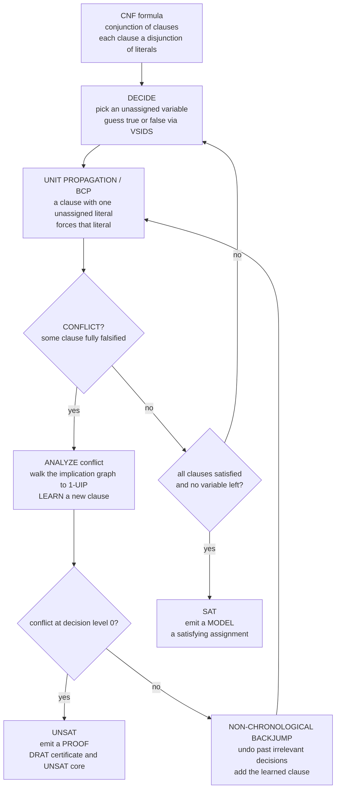

# 🧩 SAT Solving and DPLL

> [!abstract] TL;DR
> **SAT** — Boolean **satisfiability** — asks: given a propositional formula in **conjunctive normal form** (a conjunction of *clauses*, each a disjunction of *literals*), is there an assignment of true/false to the variables that makes the **whole formula true**? SAT is the **canonical NP-complete problem** — the very first problem proven NP-complete by **Cook and Levin (1971)** — so in the worst case it is exponentially hard, the archetype of intractability. Yet the punchline of modern computer science is that **it does not matter**: today's SAT solvers routinely dispatch industrial instances with **millions of variables in seconds**. The engine is **DPLL** (Davis-Putnam-Logemann-Loveland, 1962): a backtracking search that alternates **deciding** a variable with **unit propagation** and **pure-literal** elimination, backtracking on **conflict**. Its modern descendant **CDCL** (Conflict-Driven Clause Learning) supercharges it — on every conflict it **learns a new clause** so it never repeats the same mistake, performs **non-chronological backjumping**, and uses activity heuristics (VSIDS), restarts, and the two-watched-literals data structure. SAT is the **universal back-end** of formal methods: bounded model checking, hardware equivalence, planning, dependency resolution, and the Boolean core of [[SMT_Solving_and_Satisfiability_Modulo_Theories|SMT]] all *compile down to SAT*. The honest summary: SAT is the theoretical worst case of hard problems and, simultaneously, one of engineering's most spectacular practical conquests.

---

## Intuition

**Analogy — a giant wall of wired-up light switches.** Imagine a room with dozens (or millions) of light switches, each either **on** or **off**. Now imagine a thick rulebook wiring them together with constraints like *"if switch A is on then switch B must be off,"* *"at least one of C, D, E must be on,"* *"F and G cannot both be off."* The question is brutally simple to state and maddening to answer: **is there ANY setting of every switch at once that breaks none of the rules?** That is the **SAT problem**. Each rule is a **clause** ("at least one of these switches is in the required position"), each switch-in-a-position is a **literal**, and the whole rulebook is a formula in **CNF** — you must satisfy rule-1 **and** rule-2 **and** ... every rule together.

Two facts make SAT the most important toy in computer science. First, it is the **theoretical worst case**: the *first* problem ever proven **NP-complete**, meaning every problem in NP can be re-expressed as a SAT instance — solve SAT fast and you solve *all of them* fast. Second, and astonishingly, we *can* solve it fast in practice. A modern solver does **not** try all `2^n` switch settings by brute force. It makes a tentative guess, follows the forced consequences ("A is on, so the rule forces B off, which forces..."), and the moment it hits a contradiction it does something a human puzzle-solver does instinctively but rarely writes down: it **figures out *why* it failed, records that reason as a brand-new rule, and jumps straight back past every irrelevant guess** — turning each dead end into a permanent shortcut. It **learns from its mistakes**, and that single idea is why a machine can crack a puzzle with millions of switches in the time it takes to sneeze.

---

## How It Works

### Core Mechanics

A SAT instance is a CNF formula: a set of **clauses**, each clause a set of **literals** (a variable `x` or its negation `¬x`). An assignment **satisfies** a clause if it makes at least one literal true, and satisfies the **formula** if it satisfies **every** clause. **DPLL** is a depth-first backtracking search over partial assignments, made fast by two cheap inference rules:

1. **Decide.** Pick an unassigned variable and tentatively assign it a value (true or false). This opens a new **decision level**.
2. **Unit propagation (Boolean Constraint Propagation, BCP).** If a clause has all-but-one of its literals already false and the last literal unassigned, that literal is **forced** — assign it. This cascades: each forced assignment can make other clauses unit. BCP is where solvers spend most of their time and is the single most important operation.
3. **Pure-literal elimination.** If a variable appears with only one polarity across all remaining clauses (always positive, or always negative), assign it that way — it can never cause a conflict and only helps satisfy clauses.
4. **Conflict / backtrack.** If some clause becomes **fully false** (all literals assigned false), the current partial assignment is doomed: a **conflict**. Plain DPLL **backtracks** — undo the most recent decision and try its other value (chronological backtracking).
5. **Terminate.** If every clause is satisfied, output **SAT** with the assignment as a **model**. If backtracking exhausts the root decision with no value working, output **UNSAT**.

**From DPLL to CDCL — learning from failure.** Plain DPLL forgets *why* a branch failed and may re-discover the same conflict thousands of times. **CDCL** fixes this. It maintains an **implication graph** recording which decisions and propagations forced which assignments. On a conflict it **analyzes** this graph — typically to the *first unique implication point* (1-UIP) — to derive a **learned clause**: a new clause, logically entailed by the original formula, that *forbids the exact combination of decisions* that caused the failure. Then:

- **Non-chronological backjumping** — instead of undoing just the last decision, jump back to the earliest level where the learned clause becomes unit, skipping over decisions irrelevant to the conflict.
- **VSIDS** (Variable State Independent Decaying Sum) — bump the "activity" of variables involved in recent conflicts and branch on the most active ones, steering search toward the hard core.
- **Restarts** — periodically abandon the current search tree (keeping learned clauses) to escape unlucky early decisions.
- **Two-watched literals** — a lazy data structure that lets BCP inspect only two literals per clause, making propagation blazingly fast and backtracking free.

**Certificates.** A **SAT** answer is trivially checkable — just evaluate the formula on the model. An **UNSAT** answer emits a machine-checkable **DRAT proof** (a resolution-style derivation of the empty clause) and an **UNSAT core** (a minimal subset of clauses that is already unsatisfiable) — indispensable for trusting verification results.

### Flow / Architecture



*The DPLL/CDCL loop: decide, propagate, and on conflict either learn-and-backjump or — if the conflict is forced with no decisions left — conclude **UNSAT with a proof**. Reaching a total satisfying assignment yields **SAT with a model**. Plain DPLL omits the ANALYZE/learn box and simply flips the last decision.*

---

## Key Concepts

### Secondary (intuitive, no advanced background needed)

- **Satisfiable vs unsatisfiable** — a formula is **SAT** if *some* switch-setting obeys every rule, **UNSAT** if *no* setting does. The solver's whole job is to decide which.
- **Clause and literal** — a **literal** is a switch in a position (`x` or `¬x`); a **clause** is an "at least one of these" rule; a **CNF formula** is a big **AND** of clauses you must satisfy simultaneously.
- **Guess, propagate, backtrack** — the human puzzle-solving loop: make a guess, follow the forced moves, and if you hit a contradiction, back up and try something else.
- **Model** — a satisfying setting of all switches; the "answer" a SAT solver hands back when it succeeds.

### Undergraduate (a first course)

- **CNF and normal forms** — every propositional formula can be converted to CNF; **Tseitin encoding** does so with only a linear blow-up by introducing auxiliary variables (naive distribution can explode exponentially).
- **DPLL rules** — **unit propagation** (a clause of length 1 forces its literal), **pure-literal elimination**, **decision**, and **conflict-driven backtracking**; the 1962 algorithm still at the heart of every solver.
- **NP-completeness** — SAT is NP-complete by the **Cook-Levin theorem**; verifying a *model* is polynomial-time, but *finding* one is (worst-case) exponential. This is the concrete anchor of [[The_Class_NP_and_Verification|NP verification]].
- **Search tree** — DPLL explores a binary tree of decisions; unit propagation and learned clauses **prune** vast subtrees so the *effective* tree is far smaller than `2^n`.
- **Certificates** — SAT is self-certifying (check the model); UNSAT needs a **resolution proof** (DRAT) to be independently trusted.

### Graduate (advanced)

- **CDCL as resolution** — learned-clause derivation is exactly **propositional resolution**; CDCL is a resolution proof system, and its power is bounded by resolution's — some formulas (e.g. **pigeonhole**) provably require exponential-size resolution proofs, so even CDCL cannot escape them.
- **Conflict analysis and 1-UIP** — cutting the implication graph at the **first unique implication point** yields short, highly reusable learned clauses; the choice of cut is central to solver performance.
- **VSIDS, restarts, and phase saving** — activity-based branching plus Luby/geometric **restart** schedules and **phase saving** produce the empirically dominant configuration (MiniSat, Glucose, CaDiCaL, Kissat); **clause-database cleaning** with the **LBD/glue** metric keeps learned clauses manageable.
- **Two-watched literals** — the lazy invariant "watch two non-false literals per clause" makes propagation cost-proportional to actual changes and makes backtracking a no-op on the clause store.
- **Incremental SAT** — solve a sequence of related instances under **assumptions**, reusing learned clauses across calls; the backbone of bounded model checking and the SMT `check-sat` loop.
- **Phase transition and hardness** — random k-SAT exhibits a sharp SAT/UNSAT **threshold** (density ~4.267 clauses/variable for 3-SAT) with a **hardness peak** right at the threshold — an **easy-hard-easy** pattern that mirrors a physical [[Criticality_and_Phase_Transitions|phase transition]] and connects to spin-glass statistical mechanics and **survey propagation**.
- **Beyond SAT** — SAT is decidable but NP-complete; adding first-order theories (arithmetic, arrays, bit-vectors) gives **SMT**, and quantifiers push toward undecidability — SAT is the tractable Boolean floor of that tower.

---

## Python Demo

Two experiments. **(a)** A from-scratch **DPLL solver** — unit propagation, pure-literal elimination, decision branching, and backtracking — that returns a satisfying assignment or reports UNSAT, while recording the **recursion-depth trace** so we can *see* the backtracking sawtooth of the search. **(b)** The famous **random 3-SAT phase transition**: sweeping the clause-to-variable ratio `m/n`, we plot the **probability of satisfiability** (a sharp drop through the ~4.26 threshold) and overlay the **median solver effort** (decisions), which **peaks exactly at the threshold** — the celebrated **easy-hard-easy** pattern. `numpy` + `matplotlib`.

```python
# SAT solving: a DPLL solver + the random 3-SAT phase transition & hardness peak.
# (a) A small DPLL solver (unit propagation + pure literal + branch + backtrack)
#     that returns a model or UNSAT, and records the search's recursion-depth trace.
# (b) Random 3-SAT: P(satisfiable) vs ratio m/n shows a sharp threshold near 4.26,
#     and median DECISIONS peaks right there -- the easy-hard-easy pattern.
# numpy + matplotlib only.

import numpy as np
import matplotlib.pyplot as plt

rng = np.random.default_rng(7)

# ------------------------------------------------------------------ #
# CNF representation: a clause is a frozenset of ints (x -> +x, not x -> -x); #
# a formula is a list of clauses. simplify() assigns a literal true.  #
# ------------------------------------------------------------------ #
def simplify(clauses, lit):
    """Assign `lit` = true. Drop satisfied clauses, remove -lit from others.
    Return the new clause list, or None if an empty (falsified) clause appears."""
    new = []
    for c in clauses:
        if lit in c:
            continue                      # clause already satisfied
        if -lit in c:
            reduced = c - {-lit}
            if not reduced:
                return None               # empty clause => conflict
            new.append(reduced)
        else:
            new.append(c)
    return new

def dpll(clauses, assignment, stats, depth=0):
    """Recursive DPLL. Returns a satisfying dict {var: bool} or None (UNSAT)."""
    stats["calls"] += 1
    stats["trace"].append(depth)          # record recursion depth for visualization

    # --- unit propagation (BCP): repeatedly force length-1 clauses ---
    while True:
        unit = next((next(iter(c)) for c in clauses if len(c) == 1), None)
        if unit is None:
            break
        stats["propagations"] += 1
        assignment[abs(unit)] = unit > 0
        clauses = simplify(clauses, unit)
        if clauses is None:
            return None                   # conflict during propagation

    # --- pure-literal elimination ---
    if clauses:
        lits = set().union(*clauses)
        pure = [l for l in lits if -l not in lits]
        for l in pure:
            stats["pure"] += 1
            assignment[abs(l)] = l > 0
            clauses = simplify(clauses, l)
            if clauses is None:
                return None

    if not clauses:                       # no clauses left => SATISFIED
        return dict(assignment)

    # --- decide: branch on a variable from the first clause, try both values ---
    var = abs(next(iter(next(iter(clauses)))))
    stats["decisions"] += 1
    for val in (True, False):
        child = simplify(clauses, var if val else -var)
        if child is None:
            continue
        a2 = dict(assignment); a2[var] = val
        res = dpll(child, a2, stats, depth + 1)
        if res is not None:
            return res
    return None                           # both branches failed => backtrack

def solve(clauses):
    stats = {"calls": 0, "decisions": 0, "propagations": 0, "pure": 0, "trace": []}
    model = dpll([frozenset(c) for c in clauses], {}, stats)
    return model, stats

def random_3sat(n, m, rng):
    """m random 3-clauses over n variables, each with 3 distinct vars & random signs."""
    clauses = []
    while len(clauses) < m:
        vs = rng.choice(np.arange(1, n + 1), size=3, replace=False)
        signs = rng.choice([-1, 1], size=3)
        clauses.append(frozenset(int(s * v) for s, v in zip(signs, vs)))
    return clauses

# ------------------------------------------------------------------ #
# (a) Solve a concrete instance and capture the search trace.        #
# ------------------------------------------------------------------ #
demo = [[1, 2, -3], [-1, 2], [-2, 3], [1, -3], [-1, -2, 3], [2, 3, 1]]
model, st = solve(demo)
print("Demo formula:", [sorted(c) for c in demo])
print("Result:", "SAT" if model else "UNSAT",
      "| model:", model, "| decisions:", st["decisions"],
      "propagations:", st["propagations"])

# A larger satisfiable instance whose backtracking is worth watching:
inst = random_3sat(14, int(4.2 * 14), rng)
m2, st2 = solve(inst)
trace = np.array(st2["trace"])
print(f"Random n=14 instance: {'SAT' if m2 else 'UNSAT'} in {st2['calls']} calls, "
      f"{st2['decisions']} decisions, {st2['propagations']} propagations")

# ------------------------------------------------------------------ #
# (b) Phase transition: sweep the clause/variable ratio m/n.         #
# ------------------------------------------------------------------ #
n = 22                                    # variables per instance
ratios = np.arange(2.6, 6.4, 0.2)         # clause-to-variable ratios to scan
trials = 120                              # random instances per ratio
p_sat, med_decisions = [], []
for r in ratios:
    m = int(round(r * n))
    sat_flags, decisions = [], []
    for _ in range(trials):
        model, s = solve(random_3sat(n, m, rng))
        sat_flags.append(model is not None)
        decisions.append(s["decisions"])
    p_sat.append(np.mean(sat_flags))
    med_decisions.append(np.median(decisions))
p_sat, med_decisions = np.array(p_sat), np.array(med_decisions)
THRESHOLD = 4.267                         # theoretical 3-SAT threshold

# ------------------------------------------------------------------ #
# Visualization                                                      #
# ------------------------------------------------------------------ #
fig, ax = plt.subplots(2, 2, figsize=(13, 9))

# (a) DPLL search: recursion depth over time -> the backtracking sawtooth
ax[0, 0].plot(trace, lw=1.4, color="#4C72B0")
ax[0, 0].fill_between(np.arange(len(trace)), trace, alpha=0.25, color="#4C72B0")
ax[0, 0].set_title("DPLL search trace (random n=14 instance)\n"
                   "depth rises on DECIDE, drops on BACKTRACK -- the sawtooth of search")
ax[0, 0].set_xlabel("recursive call index"); ax[0, 0].set_ylabel("decision depth")
ax[0, 0].grid(alpha=0.3)

# (b1) Phase transition: probability of satisfiability vs ratio
ax[0, 1].plot(ratios, p_sat, "o-", lw=2.3, color="#55A868")
ax[0, 1].axvline(THRESHOLD, ls="--", color="crimson", lw=1.6,
                 label=f"threshold ~ {THRESHOLD}")
ax[0, 1].axhline(0.5, ls=":", color="gray", lw=1)
ax[0, 1].set_title("Random 3-SAT phase transition\n"
                   "P(satisfiable) drops sharply through the threshold")
ax[0, 1].set_xlabel("clause-to-variable ratio  m / n"); ax[0, 1].set_ylabel("P(satisfiable)")
ax[0, 1].set_ylim(-0.03, 1.03); ax[0, 1].legend(); ax[0, 1].grid(alpha=0.3)

# (b2) Hardness peak: median decisions vs ratio -> easy-hard-easy
ax[1, 0].plot(ratios, med_decisions, "s-", lw=2.3, color="#C44E52")
ax[1, 0].axvline(THRESHOLD, ls="--", color="crimson", lw=1.6, label=f"threshold ~ {THRESHOLD}")
ax[1, 0].set_title("Solver EFFORT peaks at the threshold\n"
                   "median DPLL decisions -- the easy-hard-easy pattern")
ax[1, 0].set_xlabel("clause-to-variable ratio  m / n"); ax[1, 0].set_ylabel("median decisions")
ax[1, 0].legend(); ax[1, 0].grid(alpha=0.3)

# (b3) Overlay: hardness peak sits exactly at the SAT/UNSAT crossover
ax2 = ax[1, 1]
ln1 = ax2.plot(ratios, p_sat, "o-", color="#55A868", lw=2.2, label="P(satisfiable)")
ax2.set_xlabel("clause-to-variable ratio  m / n")
ax2.set_ylabel("P(satisfiable)", color="#55A868"); ax2.set_ylim(-0.03, 1.03)
ax3 = ax2.twinx()
ln2 = ax3.plot(ratios, med_decisions / med_decisions.max(), "s--", color="#C44E52",
               lw=2.2, label="normalized effort")
ax3.set_ylabel("normalized median effort", color="#C44E52")
ax2.axvline(THRESHOLD, ls="--", color="black", lw=1.4)
ax2.set_title("The hardness peak coincides with the SAT/UNSAT crossover\n"
              "hardest instances live exactly where the answer is most uncertain")
ax2.legend(ln1 + ln2, [l.get_label() for l in ln1 + ln2], loc="center left")
ax2.grid(alpha=0.3)

fig.suptitle("SAT solving: DPLL search and the 3-SAT phase transition / hardness peak",
             fontsize=14)
fig.tight_layout()
plt.savefig("sat_dpll_phase_transition.png", dpi=120)
print("\nSaved figure to sat_dpll_phase_transition.png")
```

**What it shows.** Panel (a) plots the DPLL **recursion depth** against call index for a random instance: depth climbs on each **decision** and collapses on **backtrack**, producing the characteristic **sawtooth** of a backtracking search — the algorithm literally digging into the tree and retreating from dead ends. Panels (b1)/(b2) are the classic result: as the ratio `m/n` rises past **~4.26**, the probability of satisfiability **crashes from near 1 to near 0**, and the **median solver effort spikes right at the transition** and falls off on both sides — **easy** when under-constrained (many solutions, quick to find one), **easy** when over-constrained (contradictions surface fast), and **hard** in the narrow critical band where the answer is genuinely in doubt. Panel (b3) overlays the two curves to make the punchline vivid: the **hardness peak sits exactly at the SAT/UNSAT crossover** — the hardest problems are the ones whose answer is most uncertain, the same **[[Criticality_and_Phase_Transitions|critical phenomenon]]** studied in statistical physics.

---

## Real-World Applications

> **Example — Bounded Model Checking of hardware and software.** A model checker asks *"can this circuit or program reach a bad state within `k` steps?"* It **unrolls** the system's transition relation `k` times and conjoins the negation of the safety property, producing one giant CNF formula. Handing that to a SAT solver, a **SAT** answer is a concrete **counterexample trace** (a bug), and **UNSAT** proves the bug is unreachable within `k` steps. This is exactly the workflow in prose siblings `Bounded_Model_Checking` and `Symbolic_Model_Checking_and_BDDs`, and it is how a mountain of hardware verification actually gets done.

- **Electronic Design Automation (EDA)** — **combinational equivalence checking** (does the optimized netlist compute the same function as the reference?) and property checking are bit-blasted to SAT; Intel, Synopsys, and Cadence tools lean on SAT/SMT after the Pentium FDIV era made formal checks mandatory before tape-out.
- **Software verification back-ends** — CBMC, Dafny, and the [[SMT_Solving_and_Satisfiability_Modulo_Theories|SMT]] solvers Z3 and CVC5 use CDCL SAT as their Boolean core, with theory solvers layered on top (the "CDCL(T)" architecture).
- **AI planning and scheduling** — SATPlan and modern planners **encode** "is there a plan of length `k`?" as SAT; timetabling, routing, and configuration problems follow the same recipe.
- **Package dependency resolution** — `apt`, `dnf`, Eclipse's p2, and Debian's tooling model "which set of package versions satisfies all dependency and conflict constraints?" as SAT (or MaxSAT for the optimizing variant).
- **Cryptanalysis** — SAT solvers attack reduced-round ciphers and hash collisions by encoding the primitive as CNF; **DRAT proofs** even resolved long-standing combinatorial questions such as the Boolean Pythagorean Triples problem (a 200-terabyte machine-checkable proof).
- **Combinatorics and mathematics** — SAT has produced verified answers to Schur-number and Ramsey-adjacent problems, with the UNSAT certificate serving as a formally checkable proof.

---

## Common Pitfalls

- **"NP-complete so it's hopeless."** The worst case is exponential and SAT is the canonical NP-complete problem via **Cook-Levin** — but *worst case is not typical case*. CDCL solvers exploit structure (locality, symmetry, few "backbone" variables) that real instances have and random worst cases lack. Judging a solver by the pigeonhole principle is like judging quicksort by its `O(n^2)` worst case.
- **Feeding the solver a bad encoding.** How you translate your problem into CNF dominates performance. Naive DNF-to-CNF distribution explodes exponentially — use **Tseitin** encoding. Sloppy **cardinality constraints** ("at most k of these") can blow up; use sequential/totalizer encodings. A good solver on a bad encoding still loses.
- **Confusing "no model returned" with "proved UNSAT."** A solver that times out returns *unknown*, not UNSAT. Only an emitted **DRAT proof** or **UNSAT core** certifies unsatisfiability. Trust-critical pipelines must *check* the proof with an independent verifier, not take the solver's word.
- **Ignoring the phase transition when generating tests/benchmarks.** Random instances far from the ~4.26 ratio are trivially easy (under- or over-constrained) and give a false sense of solver speed. Meaningful stress tests live **at** the threshold — precisely where hardness peaks.
- **Reaching for SAT when you needed SMT.** Bit-blasting integers, arrays, and arithmetic into pure SAT is possible but often wasteful or wildly large. If your constraints are naturally over theories (linear arithmetic, uninterpreted functions), use an **SMT** solver — SAT is the Boolean floor, not always the right level (`Decision_Procedures_and_Theories`, `SMT_Solving_and_Satisfiability_Modulo_Theories`).
- **Forgetting incrementality.** Solving a family of closely-related formulas from scratch each time discards a fortune in learned clauses. **Incremental SAT** under assumptions reuses that work and is the difference between usable and unusable in model-checking and optimization loops.
- **Mistaking DPLL for the state of the art.** Textbook DPLL (chronological backtracking, pure-literal) is *decades* behind. The modern engine is **CDCL** — clause learning, non-chronological backjumping, VSIDS, restarts, two-watched literals. Pure-literal elimination is often *dropped* in real solvers because it is not worth its cost next to fast BCP.

---

## Related Concepts

- [[Formal_Methods_Overview]] — SAT/SMT is pillar 2's automation engine; this note fills in the "solvers" the overview promises beneath model checking and program verification.
- [[Propositional_Logic_and_Boolean_Semantics]] — the object SAT decides: syntax, truth tables, CNF, and the semantics of satisfaction the whole algorithm manipulates.
- [[NP_Completeness_and_the_Cook_Levin_Theorem]] — the theorem that made SAT the *first* NP-complete problem and the reference point every hardness reduction starts from.
- [[The_Class_NP_and_Verification]] — the "easy to check, hard to find" duality: verifying a SAT model is polynomial, the essence of NP.
- [[Reductions_and_NP_Complete_Problems]] — how *every* NP problem re-expresses as SAT; the practical flip-side is **encoding** problems *into* SAT to reuse the engine.
- [[P_versus_NP]] — a polynomial SAT algorithm would collapse P = NP; SAT's practical speed is engineering triumph, not a resolution of the open question.
- [[Time_and_Space_Complexity]] — the worst-case exponential bound DPLL inherits and the resource lens for comparing solver strategies.
- [[Backtracking]] — DPLL *is* backtracking search with unit propagation and clause learning bolted on; the DSA note is the algorithmic skeleton.
- [[DFS]] — the depth-first traversal underlying both the DPLL search tree and the implication-graph walk used in conflict analysis.
- [[Criticality_and_Phase_Transitions]] — the SAT threshold at ~4.26 is a genuine phase transition, with peak hardness at criticality; the deepest cross-vault bridge here.
- [[Phase_Transitions_in_Learning_and_Inference]] — the statistical-mechanics view of the same threshold (replica/cavity methods, survey propagation) linking SAT to spin glasses.
- [[Logic_and_Proof_Techniques]] — resolution and proof by contradiction; CDCL's learned-clause derivation is exactly propositional resolution producing a refutation.

*(Formal Methods siblings referenced in prose, built out in adjacent notes: `Logic_for_Program_Verification`, `SMT_Solving_and_Satisfiability_Modulo_Theories`, `Decision_Procedures_and_Theories`, `Bounded_Model_Checking`, `Symbolic_Model_Checking_and_BDDs`.)*

---

## Review Questions

### Secondary

1. Using the "wall of wired-up switches" analogy, explain in your own words what it means for a SAT instance to be **satisfiable** versus **unsatisfiable**.
2. A solver makes a guess, follows the forced consequences, and hits a contradiction. In plain language, what are the two things a *modern* solver does next that a naive brute-force search would not?
3. The demo shows random 3-SAT is easy when there are very few rules and easy when there are very many, but hard in between. Give an intuitive reason each of the two "easy" regimes is easy.

### Undergraduate

1. Define **unit propagation** and **pure-literal elimination**, and give a two-clause example where unit propagation forces a variable's value. Why is BCP the operation solvers spend most of their time on?
2. Explain why SAT is **NP-complete** by separating the two claims: (a) SAT is *in* NP, and (b) SAT is *NP-hard*. Which of these is the content of the Cook-Levin theorem?
3. Convert `(a ∧ b) ∨ c` to CNF two ways — by naive distribution and conceptually via a Tseitin-style auxiliary variable — and explain why the Tseitin approach avoids exponential blow-up on large formulas.

### Graduate

1. Describe **conflict-driven clause learning**: what is the implication graph, what does cutting it at the **1-UIP** produce, and why does the learned clause justify **non-chronological backjumping** rather than a simple flip of the last decision?
2. CDCL is a **resolution** proof system. State one consequence of this for its power (name a formula family it cannot handle in polynomial time) and one consequence for **trust** (how an UNSAT result is made independently checkable).
3. The random 3-SAT hardness peak coincides with the SAT/UNSAT threshold near ratio 4.26. Explain the **easy-hard-easy** pattern in terms of the number of solutions and the tightness of constraints, and describe how this critical behavior parallels a physical phase transition.

---

## Sources

- M. Davis, G. Logemann, D. Loveland. "A Machine Program for Theorem-Proving," *Communications of the ACM* 5(7), 1962 — the original **DPLL** algorithm (unit propagation, splitting, backtracking). <https://doi.org/10.1145/368273.368557>
- S. A. Cook. "The Complexity of Theorem-Proving Procedures," *STOC 1971* — the **Cook-Levin theorem** establishing SAT as the first NP-complete problem. <https://doi.org/10.1145/800157.805047>
- J. P. Marques-Silva, K. A. Sakallah. "GRASP: A Search Algorithm for Propositional Satisfiability," *IEEE Transactions on Computers* 48(5), 1999 — introduces **conflict-driven clause learning** and non-chronological backjumping (CDCL). <https://doi.org/10.1109/12.769433>
- A. Biere, M. Heule, H. van Maaren, T. Walsh (eds.). *Handbook of Satisfiability*, 2nd ed. IOS Press, 2021 — the comprehensive reference on DPLL/CDCL, encodings, proofs, and applications.
- N. Eén, N. Sörensson. "An Extensible SAT-solver" (**MiniSat**), *SAT 2003* — the compact modern-solver blueprint: two-watched literals, VSIDS, and clause learning. <https://doi.org/10.1007/978-3-540-24605-3_37>

---

#formal-methods #sat-solving #dpll #cdcl #np-complete
