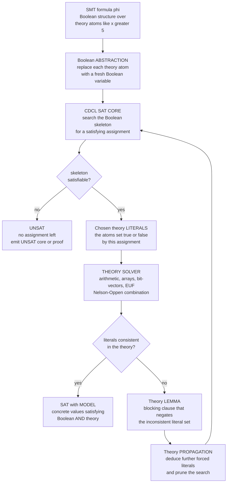

# 🧮 SMT Solving and Satisfiability Modulo Theories

> [!abstract] TL;DR
> A plain **SAT solver** decides whether a Boolean formula can be made true, but it knows *nothing* about what its variables *mean* — to it, `x > 5` and `x < 3` are just two independent switches, and it will happily flip both on. **Satisfiability Modulo Theories (SMT)** fixes this by deciding the satisfiability of first-order formulas whose atoms are drawn from **background theories** that give symbols their intended meaning: **EUF** (equality + uninterpreted functions), **linear/nonlinear arithmetic**, **bit-vectors** (machine words), **arrays** (memory), **datatypes**, **strings**, and **floating-point** — exactly the vocabulary needed to model real programs. The architecture is **DPLL(T)**: a **CDCL SAT core** searches over the Boolean *skeleton* (which atoms are true or false) while dedicated **theory solvers** check whether the chosen literals are jointly consistent *in their theory*; on a theory conflict the solver returns a **lemma** (a blocking clause) to the SAT core, and **theory propagation** deduces further forced literals — the two loops interleave until **SAT** (with a concrete **model**) or **UNSAT** (with an **UNSAT core** or proof). Disjoint theories combine via the **Nelson–Oppen** method (exchanging equalities). Quantifier-free arithmetic, bit-vectors, arrays, and EUF are **decidable**; quantifiers and nonlinear integer arithmetic are **undecidable** and handled incompletely (E-matching, MBQI). Standardized by **SMT-LIB** and embodied by **Z3**, SMT is the universal back-end of modern verification: it discharges the verification conditions of Hoare-logic verifiers (Dafny, Why3, Frama-C, F\*), powers **symbolic execution** (KLEE) and **bounded model checking**, and checks refinement/liquid types. SMT is the practical bridge from decidable logic to real program reasoning — and **Z3** is its emblematic face.

---

## Intuition

**Analogy — bolting experts onto a Boolean detective.** Picture a brilliant but *narrow* detective who reasons only in raw yes/no switches. Hand her the clues "*the suspect is over 6 feet*" and "*the suspect is under 5 feet*" and, because to her these are just two independent lamps she can switch on, she declares the case *solvable*: flip both lamps on, done. She has no idea the two statements describe a **height** and therefore contradict each other — she does not understand measurement. That detective is a **pure SAT solver**: masterful at juggling the *logical structure* of a case, utterly blind to what the clues *mean*.

An **SMT solver** keeps that detective as the core but bolts **domain experts** onto her: one who understands **arithmetic**, one who understands **arrays and memory**, one who understands **bit-vectors** and two's-complement overflow. The detective proposes a consistent-looking set of switch settings; before accepting it she phones the relevant expert — *"can `x > 5` and `x < 3` both hold?"* — and the arithmetic expert instantly replies *"no, that's impossible, and here's the reason you can hand back."* She records that reason as a new rule and keeps searching. This marriage of **Boolean search** with **domain theories** is the quiet engine inside almost every modern program verifier — and **Z3** is its most famous face.

---

## How It Works

### Core Mechanics

An SMT problem is a **first-order formula** (usually **quantifier-free**) built from a Boolean skeleton of connectives (`∧`, `∨`, `¬`) over **theory atoms** — predicates like `x + 2*y ≤ 7`, `a = f(b)`, `select(store(A, i, v), j) = w`, or `bvadd(x, y) = z`. The theory fixes the meaning of `+`, `≤`, `=`, `f`, `select`, `bvadd`, and so on. Deciding satisfiability means: *is there an assignment of concrete values (from the theory's domain) to the variables that makes the whole formula true?*

**1. Boolean abstraction.** Replace each distinct theory atom with a fresh Boolean variable. `(x > 5) ∧ ((x < 3) ∨ y=z)` becomes `A ∧ (B ∨ C)`. This throws away all arithmetic meaning but exposes the pure **propositional structure**.

**2. The SAT core searches the skeleton.** A **CDCL** (conflict-driven clause-learning) SAT solver — the descendant of **DPLL** — finds a satisfying Boolean assignment of the abstraction, e.g. `A=⊤, B=⊤`. This is a *candidate*: the atoms it says are true and false.

**3. The theory solver checks the candidate.** Translate the chosen truth assignment back into a **conjunction of theory literals** — here `(x > 5) ∧ (x < 3)` — and ask a **dedicated decision procedure** for that theory: *is this set of literals jointly consistent?* For linear arithmetic the solver runs a variant of the **simplex** method or Fourier–Motzkin; for EUF it runs **congruence closure** (a union-find over terms, see [[Union_Find]]); for arrays it applies the read-over-write axioms; for bit-vectors it typically **bit-blasts** to SAT.

**4. Conflict → theory lemma → back to SAT.** If the literals are **inconsistent** (as `x>5 ∧ x<3` is), the theory solver returns a **theory lemma**: a clause, valid in the theory, that *blocks* this assignment — here `¬(x>5) ∨ ¬(x<3)`. The SAT core adds it and resumes search. If the literals are **consistent**, and the Boolean formula is satisfied, the solver reports **SAT** and can produce a **model** (concrete values). If the SAT core exhausts the search space, it reports **UNSAT**, and can emit an **UNSAT core** (a minimal contradictory subset) or a **proof**.

**5. Theory propagation.** Rather than only *checking* full assignments, a good theory solver **propagates**: given `x > 5` is already decided, it can *deduce* `x > 2` and hand that literal to the SAT core early, pruning the search dramatically. Interleaving *deduction* with *search* is what makes DPLL(T) fast in practice.

**6. Combining theories — Nelson–Oppen.** Real programs mix theories: `a[i] + 2 = f(x)` touches arrays, arithmetic, and uninterpreted functions at once. The **Nelson–Oppen** procedure combines decision procedures for **disjoint, stably-infinite** theories by having them **exchange equalities** between shared variables — each solver reasons about its own symbols, and they agree by propagating equalities until a fixpoint. This modularity is why solvers can support a growing zoo of theories.

**7. Decidability is the ceiling.** Quantifier-free EUF, linear arithmetic (over reals and integers), arrays, and bit-vectors are **decidable** — the theory solver always terminates with a definite answer. But **quantifiers** (`∀x. P(x)`) and **nonlinear integer arithmetic** are **undecidable** (the latter by Hilbert's 10th problem). SMT solvers handle them **incompletely** via **E-matching** with user/heuristic **triggers** and **model-based quantifier instantiation (MBQI)** — powerful, but they may return `unknown`, loop, or miss instantiations.

### Flow / Architecture



*The SAT core owns the **logical structure**; the theory solver owns the **meaning**. A conflict does not restart the search — it **teaches** the SAT core a new clause (the lemma), so each round permanently narrows the space. This lazy, lemma-driven cooperation is DPLL(T).*

---

## Key Concepts

### Secondary (intuitive, no advanced background)

- **SAT vs SMT** — **SAT** asks "can these true/false switches be set to make the formula hold?" **SMT** asks the same but the "switches" are *statements about numbers, arrays, or bit-patterns*, so the answer must respect what those statements *mean*.
- **The skeleton vs the meaning** — SMT splits a formula into its **Boolean shape** (handled by search) and its **arithmetic/array content** (handled by an expert). Neither alone is enough.
- **Model and counterexample** — a **SAT** answer comes with a **model**: actual values (`x = 7`) that satisfy everything — often a concrete bug-triggering input. An **UNSAT** answer is a *proof* that no such values exist.
- **Why programmers care** — checking "can this array index go out of bounds?" or "can these two code paths disagree?" *is* an SMT query; the solver either finds the failing input or proves it can't happen.

### Undergraduate (a first course)

- **Background theories** — the menu of meaning: **EUF** (equality + uninterpreted functions), **LIA/LRA** (linear integer/real arithmetic), **NIA/NRA** (nonlinear), **BV** (fixed-width bit-vectors with two's-complement), **arrays** (`select`/`store`), **datatypes** (lists, trees, enums), **strings**, and **floating-point** (IEEE-754).
- **DPLL(T) architecture** — a **CDCL SAT core** drives the search; **theory solvers** validate assignments and return **lemmas**; **theory propagation** feeds forced literals back. "Lazy" SMT means theories are consulted *on demand*.
- **Congruence closure for EUF** — from `a = b` and `b = c`, deduce `f(a) = f(c)`. Implemented as **union-find** over the term graph ([[Union_Find]]) — the canonical decidable theory and the substrate under many others.
- **Linear arithmetic as feasibility** — deciding a conjunction of linear inequalities is exactly asking whether a **polytope is non-empty** — the same feasibility question at the heart of [[LP_Standard_Form]] and [[Systems_of_Linear_Equations]]; solvers use a simplex variant or Fourier–Motzkin elimination.
- **SMT-LIB and the ecosystem** — a **standard input language** and a menu of **logics** (`QF_LIA`, `QF_BV`, `QF_AUFLIA`, …); the annual **SMT-COMP** competition; solvers **Z3** (Microsoft), **CVC5**, **Yices**, **MathSAT**, **Bitwuzla**.
- **The back-end role** — verification tools reduce their questions to SMT queries: a **verification condition** from Hoare logic ([[Axiomatic_Semantics_and_Hoare_Logic]]), a **path condition** from symbolic execution, or a **transition-relation unrolling** from bounded model checking.

### Graduate (advanced)

- **Nelson–Oppen combination** — combines decision procedures for **signature-disjoint, stably-infinite** theories in NP by propagating **entailed equalities** over shared variables; requires **convexity** handling (case-splitting on disjunctions of equalities) for non-convex theories like integer arithmetic and arrays.
- **Lazy vs eager SMT** — **lazy** (DPLL(T)) keeps theories separate and consults them incrementally; **eager** encodes the whole problem into pure SAT up front (e.g. **bit-blasting** all bit-vector operations). Bit-vectors often go eager; arithmetic and arrays go lazy.
- **Quantifier handling** — **E-matching** instantiates `∀`-formulas by pattern-matching **triggers** against ground terms in the current E-graph; **MBQI** (model-based quantifier instantiation) refutes a candidate model by finding a violating instance. Both are **incomplete** — hence `unknown`, matching-loop divergence, and trigger-sensitivity.
- **Decidable fragments vs the wall** — quantifier-free LIA/LRA/BV/arrays/EUF are decidable (and **NP-complete** or in NP — the same certificate-checking duality as [[The_Class_NP_and_Verification]] and [[NP_Completeness_and_the_Cook_Levin_Theorem]]); adding quantifiers or nonlinear *integer* arithmetic crosses into **undecidability**. **Quantifier elimination** ([[Quantifier_Elimination_and_Decidability]]) explains why *linear real* arithmetic (Presburger over reals) stays decidable while integers plus multiplication do not.
- **Proofs, UNSAT cores, and interpolants** — beyond a yes/no, solvers can emit **checkable proofs**, **minimal UNSAT cores** (which assumptions cause the contradiction), and **Craig interpolants** (used in software model checking to synthesize invariants).
- **Incrementality and optimization** — real verifiers issue thousands of related queries; **incremental** solving with `push`/`pop` reuses learned clauses. **MaxSMT / OMT** (optimization modulo theories) extends satisfiability to *optimal* models — bridging toward [[Integer_Programming]].

---

## Python Demo

We build **DPLL(T) in miniature** to make the SAT-vs-SMT gap concrete. **(a)** Take the classic formula `(x > 5) ∧ (x < 3)`: its Boolean *skeleton* is trivially satisfiable (two independent switches, both `⊤`), so a **pure SAT solver wrongly reports SAT**. We then run a tiny **linear-arithmetic theory check** — 1-variable **interval propagation** (a degenerate Fourier–Motzkin) — which intersects `(5, ∞)` with `(−∞, 3)`, finds the **empty** set, and returns a **theory lemma** `¬(x>5) ∨ ¬(x<3)` that flips the verdict to **UNSAT**. **(b)** We visualize the theory reasoning as **geometry**: the feasible region of a set of linear constraints is a **2D polytope**, and we contrast a **satisfiable** constraint set (non-empty polytope) against an **unsatisfiable** one (empty intersection). `numpy` + `matplotlib` only.

```python
# DPLL(T) in miniature: why a SAT core alone is not enough, and what a THEORY solver adds.
#
# (a) THEORY COMBINATION on linear arithmetic. Formula: (x > 5) AND (x < 3).
#     - A pure Boolean SAT solver treats "x>5" and "x<3" as independent switches
#       A and B, finds A = B = True, and WRONGLY reports SAT.
#     - A linear-arithmetic THEORY solver runs interval propagation (1-var
#       Fourier-Motzkin): (5, inf) intersect (-inf, 3) = empty  -> inconsistent
#       -> emit a theory LEMMA (NOT A OR NOT B) -> SAT core -> UNSAT.
#
# (b) The theory check IS geometry: a conjunction of linear atoms is feasible iff
#     its polytope is non-empty. We show one SAT set and one UNSAT set in 2D.
#
# numpy + matplotlib only.

import numpy as np
import matplotlib.pyplot as plt

# ----------------------------------------------------------------- #
# A tiny linear-arithmetic THEORY SOLVER over ONE variable.         #
# Each atom is (op, c) meaning  x op c,  op in {">", ">=", "<", "<="} #
# Interval propagation = degenerate Fourier-Motzkin elimination.     #
# ----------------------------------------------------------------- #
def theory_consistent_1d(atoms):
    """Return (is_consistent, (lo, hi)) for a conjunction of 1-variable atoms."""
    lo, hi = -np.inf, np.inf
    lo_strict = hi_strict = False
    for op, c in atoms:
        if op in (">", ">="):                 # lower bound
            if c > lo or (c == lo and op == ">"):
                lo, lo_strict = c, (op == ">")
        else:                                 # "<", "<="  -> upper bound
            if c < hi or (c == hi and op == "<"):
                hi, hi_strict = c, (op == "<")
    if lo < hi:
        feasible = True
    elif lo == hi:
        feasible = not (lo_strict or hi_strict)   # x = c allowed only if non-strict
    else:
        feasible = False
    return feasible, (lo, hi)

# ---------------------------------------------------------------- #
# (a) (x > 5) AND (x < 3): Boolean-SAT verdict vs DPLL(T) verdict.  #
# ---------------------------------------------------------------- #
unsat_atoms = [(">", 5), ("<", 3)]
boolean_verdict = "SAT"                        # a pure SAT solver's WRONG answer
consistent, (lo, hi) = theory_consistent_1d(unsat_atoms)
smt_verdict = "SAT" if consistent else "UNSAT"
theory_lemma = "(NOT(x>5) OR NOT(x<3))"

print("Formula:  (x > 5) AND (x < 3)")
print(f"  Boolean SAT core alone : {boolean_verdict:5s}  <-- WRONG (ignores arithmetic)")
print(f"  Theory interval check  : lower={lo}, upper={hi}  -> empty, no x satisfies both")
print(f"  Theory LEMMA returned  : {theory_lemma}")
print(f"  DPLL(T) final verdict  : {smt_verdict:5s}  <-- CORRECT\n")

# A satisfiable companion for contrast: (x > 1) AND (x < 4)
sat_atoms = [(">", 1), ("<", 4)]
c2, (lo2, hi2) = theory_consistent_1d(sat_atoms)
print("Formula:  (x > 1) AND (x < 4)")
print(f"  Theory interval check  : lower={lo2}, upper={hi2}  -> non-empty")
print(f"  DPLL(T) final verdict  : {'SAT' if c2 else 'UNSAT':5s}  (model: x = 2.5)\n")

# ---------------------------------------------------------------- #
# (b) 2D polytopes: a SATISFIABLE vs an UNSATISFIABLE constraint set.
# Constraints as rows a*x + b*y <= c.                                #
# ---------------------------------------------------------------- #
def feasible_mask(A, bvec, X, Y):
    mask = np.ones_like(X, dtype=bool)
    for (a, b), c in zip(A, bvec):
        mask &= (a * X + b * Y <= c + 1e-9)
    return mask

# SAT set: x>=0, y>=0, x+y<=6, x<=4, y<=4  (a bounded non-empty polytope)
A_sat = [(-1, 0), (0, -1), (1, 1), (1, 0), (0, 1)]
b_sat = [0, 0, 6, 4, 4]

# UNSAT set: x>=0, y>=0, x+y<=1, x+y>=5  (contradictory half-planes)
A_unsat = [(-1, 0), (0, -1), (1, 1), (-1, -1)]
b_unsat = [0, 0, 1, -5]

xs = np.linspace(-1, 7, 500)
ys = np.linspace(-1, 7, 500)
X, Y = np.meshgrid(xs, ys)
mask_sat   = feasible_mask(A_sat,   b_sat,   X, Y)
mask_unsat = feasible_mask(A_unsat, b_unsat, X, Y)

print(f"(b) SAT   constraint set : feasible grid cells = {mask_sat.sum():6d}  -> SAT (polytope non-empty)")
print(f"(b) UNSAT constraint set : feasible grid cells = {mask_unsat.sum():6d}  -> UNSAT (empty region)")

# ---------------------------------------------------------------- #
# Visualization                                                     #
# ---------------------------------------------------------------- #
fig, ax = plt.subplots(2, 2, figsize=(13, 9))

# (a1) number line: (x>5) and (x<3) do not overlap; (x>1 & x<4) does.
a0 = ax[0, 0]
a0.hlines(2.4, 5, 8.6, color="#C44E52", lw=11)
a0.text(6.8, 2.62, "x > 5", color="#C44E52", fontsize=11, ha="center")
a0.hlines(2.0, -0.6, 3, color="#4C72B0", lw=11)
a0.text(1.1, 2.18, "x < 3", color="#4C72B0", fontsize=11, ha="center")
a0.axvspan(3, 5, color="gray", alpha=0.18)
a0.text(4, 1.55, "gap: no x\n=> UNSAT", ha="center", fontsize=9)
a0.hlines(1.1, 1, 4, color="#55A868", lw=11)
a0.text(2.5, 1.28, "x>1 AND x<4 : interval (1,4) => SAT", color="#2f6b45",
        fontsize=9, ha="center")
a0.set_xlim(-1, 9); a0.set_ylim(0.7, 3.0); a0.set_yticks([])
a0.set_xlabel("x (the number line)")
a0.set_title("(a) Theory check on 1-D arithmetic\nintersect the intervals")

# (a2) the verdict comparison, as text
a1 = ax[0, 1]; a1.axis("off")
a1.set_title("(a) SAT core vs DPLL(T) verdict", fontsize=12)
lines = [
    ("Formula:  (x > 5)  AND  (x < 3)", "black", 12),
    ("", "black", 6),
    ("Boolean SAT core   ->  SAT", "#C44E52", 12),
    ("   (both switches on; WRONG)", "#C44E52", 10),
    ("", "black", 6),
    ("Theory solver: (5, inf) ^ (-inf, 3) = empty", "#4C72B0", 11),
    ("Theory lemma:  NOT(x>5) OR NOT(x<3)", "#4C72B0", 11),
    ("", "black", 6),
    ("DPLL(T) verdict    ->  UNSAT", "#2f6b45", 13),
    ("   (theory refutes the model; CORRECT)", "#2f6b45", 10),
]
yv = 0.92
for txt, col, fs in lines:
    a1.text(0.03, yv, txt, color=col, fontsize=fs, family="monospace",
            transform=a1.transAxes)
    yv -= 0.092

# (b1) SATISFIABLE polytope
b1 = ax[1, 0]
b1.imshow(mask_sat, extent=[xs.min(), xs.max(), ys.min(), ys.max()],
          origin="lower", cmap="Greens", alpha=0.55, aspect="auto")
b1.plot([0, 6], [6, 0], "k-", lw=1.2)              # x+y = 6
b1.plot([4, 4], [-1, 4], "k--", lw=1.0)            # x = 4
b1.plot([-1, 4], [4, 4], "k--", lw=1.0)            # y = 4
b1.scatter([2], [2], color="#C44E52", zorder=5, s=60)
b1.text(2.15, 2.1, "model (2, 2)", color="#C44E52", fontsize=10)
b1.set_xlim(-1, 7); b1.set_ylim(-1, 7)
b1.set_xlabel("x"); b1.set_ylabel("y")
b1.set_title("(b) SAT: feasible polytope is non-empty\nx>=0, y>=0, x+y<=6, x<=4, y<=4")

# (b2) UNSATISFIABLE: two half-planes that cannot both hold
b2 = ax[1, 1]
b2.imshow(mask_unsat, extent=[xs.min(), xs.max(), ys.min(), ys.max()],
          origin="lower", cmap="Reds", alpha=0.55, aspect="auto")
b2.plot([0, 1], [1, 0], color="#4C72B0", lw=2.2, label="x + y <= 1")
b2.plot([0, 5], [5, 0], color="#C44E52", lw=2.2, label="x + y >= 5")
b2.text(3.4, 3.6, "no point satisfies both\n=> UNSAT", ha="center", fontsize=10)
b2.set_xlim(-1, 7); b2.set_ylim(-1, 7)
b2.set_xlabel("x"); b2.set_ylabel("y")
b2.legend(loc="upper right")
b2.set_title("(b) UNSAT: empty intersection\nx+y<=1 AND x+y>=5 contradict")

fig.suptitle("SMT = SAT skeleton + theory reasoning: the arithmetic a SAT solver cannot see",
             fontsize=14)
fig.tight_layout()
plt.savefig("smt_sat_vs_theory.png", dpi=120)
print("\nSaved figure to smt_sat_vs_theory.png")
```

**What it shows.** The console output makes the gap explicit: on `(x>5) ∧ (x<3)` the Boolean SAT core says **SAT** (both atoms can be `⊤`), but the theory solver intersects the intervals into the **empty** set, returns the lemma `¬(x>5) ∨ ¬(x<3)`, and DPLL(T) corrects the verdict to **UNSAT** — while the companion `(x>1) ∧ (x<4)` stays genuinely **SAT** with model `x = 2.5`. Panel (a1) draws the two number-line intervals and their tell-tale **gap**; panel (a2) contrasts the two verdicts; panels (b1)/(b2) reveal that the theory check is really **geometry** — a conjunction of linear atoms is satisfiable *exactly when its polytope is non-empty*, so the SAT case shades a real region (with an explicit model at `(2,2)`) and the UNSAT case shades **nothing** because `x+y ≤ 1` and `x+y ≥ 5` can never co-exist. Scaling this idea from intervals to simplex, congruence closure, and bit-blasting — and lifting it from checking to *learning lemmas* — is exactly what industrial SMT solvers do.

---

## Real-World Applications

> **Example — Z3 behind Microsoft's verification stack.** Z3, de Moura and Bjørner's SMT solver, is the shared back-end for a remarkable range of Microsoft tools: the **Dafny** and **F\*** verifiers translate `assert`/`requires`/`ensures` obligations into SMT queries Z3 discharges; the **SAGE** whitebox fuzzer solves **path conditions** from symbolic execution to synthesize new test inputs (it found deep security bugs across Windows); the **SLAM/SDV** driver verifier and the **Boogie** intermediate verification language both bottom out in Z3. One decision-procedure engine, many verifiers.

- **Symbolic execution — KLEE.** The KLEE engine executes programs on **symbolic** inputs, accumulating a **path condition** per branch, and hands it to an SMT solver (STP/Z3) to decide feasibility and generate concrete crashing inputs — it found bugs in the GNU Coreutils that had survived decades of testing.
- **Deductive verifiers — Dafny, Why3, Frama-C, F\*.** These encode **Hoare-logic verification conditions** ([[Axiomatic_Semantics_and_Hoare_Logic]]) — loop invariants, pre/postconditions, framing — as SMT formulas; the solver either proves the obligation or returns a counterexample model pinpointing the failing state. AWS's **s2n** TLS and parts of Azure have been verified this way.
- **Bounded model checking — CBMC.** Hardware and C model checkers **unroll** a system to depth `k` and ask SMT/SAT whether a bad state is reachable within `k` steps; a **SAT** answer is a concrete counterexample trace, an **UNSAT** answer proves the bug is absent up to that bound.
- **Refinement/liquid types.** Liquid Haskell and refinement-type checkers attach logical predicates to types (`{v:Int | v > 0}`) and discharge the resulting subtyping obligations to SMT, turning rich type checking into automated theorem proving.
- **Smart-contract and protocol verification.** Certora and the K-framework verify Ethereum contracts by reducing safety properties to SMT; cryptographic-protocol analyzers lean on the same engines where a missed corner case is directly monetizable by an attacker.
- **Program synthesis and superoptimization.** **CEGIS** (counterexample-guided inductive synthesis) alternates an SMT "does a program satisfy the spec on all inputs?" query with a "find a counterexample" query — the loop that powers tools like Sketch and instruction superoptimizers.

---

## Common Pitfalls

- **Expecting decidability where there is none.** Quantifier-free EUF, LIA/LRA, arrays, and bit-vectors are **decidable**; the moment you add **quantifiers** or **nonlinear integer arithmetic**, you are in **undecidable** territory. The solver may return `unknown`, time out, or diverge — and a `unknown` is *not* a proof of anything. Know which **logic** (`QF_LIA` vs `LIA` vs `NIA`) your query lives in.
- **Trigger sensitivity with quantifiers.** Quantified axioms are instantiated by **E-matching** against **triggers** (term patterns). Bad triggers cause **matching loops** (unbounded instantiation → timeout) or **incompleteness** (the needed instance is never generated). Two logically equivalent encodings can differ by orders of magnitude in solve time purely because of triggers — this is the single most common cause of "my verifier is flaky today."
- **Trusting SAT over the theory.** The whole point of SMT is that the **Boolean skeleton lies**: a skeleton-satisfiable formula can be theory-**UNSAT** (the demo's `x>5 ∧ x<3`). Never reason about satisfiability from the propositional structure alone — the theory has the final word.
- **Ignoring theory combination boundaries.** **Nelson–Oppen** requires the combined theories to be **signature-disjoint** and **stably-infinite**; mixing theories that share function symbols, or a finite-domain theory, can break the combination's completeness. Non-convex theories (integers, arrays) force extra case-splitting the naive combiner forgets.
- **Reading `unsat` as "my code is correct."** SMT proves the **verification condition** UNSAT (its *negation* is unsatisfiable), which certifies the property **only relative to the spec, the invariants you supplied, and the accuracy of the encoding**. A too-weak spec, a missing side condition, or a modeling bug (e.g. treating machine ints as unbounded mathematical integers instead of **bit-vectors** with wraparound) yields a hollow "proof."
- **Bit-vectors vs integers vs reals.** Modeling a 32-bit machine `int` as an unbounded integer silently **discards overflow**; a solver will "prove" `x + 1 > x` universally — false in `QF_BV` where wraparound makes it fail at `INT_MAX`. Pick the theory that matches the real semantics, or the model is a fiction.
- **Non-determinism and portability.** Different solvers (or versions, or random seeds) may return **different but equally valid models**, and quantified queries may flip between `sat`/`unknown`. Pin versions and avoid depending on a *specific* model when a spec should hold for *all* of them.

---

## Related Concepts

- [[Formal_Methods_Overview]] — the parent field: SMT is the **industrial engine** beneath deductive verification, bounded model checking, and symbolic execution described there.
- [[Propositional_Logic_and_Boolean_Semantics]] — the **Boolean skeleton** SMT abstracts to and the SAT core that searches it; SMT is "propositional SAT plus meaning."
- [[First_Order_Predicate_Logic]] — SMT decides satisfiability of (mostly quantifier-free) **first-order** formulas; theories are first-order theories with fixed intended models.
- [[Quantifier_Elimination_and_Decidability]] — *why* linear real arithmetic (Presburger over reals) stays decidable while integers-plus-multiplication does not — the exact boundary SMT lives against.
- [[Model_Theory_Foundations]] — "theory," "model," and "satisfiability" are model-theoretic notions; a **model** returned by an SMT solver is a model in this precise sense.
- [[Soundness_and_Completeness]] — decision procedures are **sound**; quantifier handling is deliberately **incomplete** — the axes on which every SMT technique is judged.
- [[The_Class_NP_and_Verification]] — quantifier-free SMT sits in **NP** (a satisfying model is a checkable certificate); the same "check a witness" duality that defines NP.
- [[NP_Completeness_and_the_Cook_Levin_Theorem]] — SAT is the original NP-complete problem; SMT inherits the worst-case hardness the CDCL core confronts (yet solves in practice).
- [[Decidability_and_Recognizability]] — the computability line that separates SMT's **decidable** theory fragments from its **undecidable** quantified/nonlinear extensions.
- [[Axiomatic_Semantics_and_Hoare_Logic]] — the primary **client**: Hoare-triple verification conditions and weakest preconditions are discharged as SMT queries.
- [[Union_Find]] — the disjoint-set data structure that implements **congruence closure**, the decision procedure for EUF.
- [[LP_Standard_Form]] — linear-arithmetic satisfiability *is* polytope feasibility; SMT arithmetic solvers use simplex variants from the same theory.
- [[Systems_of_Linear_Equations]] — the equality core of linear arithmetic; Gaussian elimination and Fourier–Motzkin underlie the theory solver's consistency check.
- [[Integer_Programming]] — integer-arithmetic SMT and ILP share the discrete-feasibility difficulty; **OMT/MaxSMT** extends satisfiability to optimization.
- [[The_Curry_Howard_Correspondence]] — the *interactive*-proof counterpart to SMT's *automated* proof: proof assistants where humans build proofs SMT cannot fully automate.
- [[Verified_and_Certified_Languages]] — F\*, Dafny, and friends whose verification back-end **is** an SMT solver.

*(Vault siblings referenced in prose, built out elsewhere in this section: `SAT_Solving_and_DPLL`, `Logic_for_Program_Verification`, `Decision_Procedures_and_Theories`, `Deductive_Verification_Tools`, `Symbolic_Execution`.)*

---

## Review Questions

### Secondary

1. A friend says "a SAT solver could just check `x > 5` and `x < 3` — set both to true, done, it's satisfiable." Using the height-detective analogy, explain in one or two sentences why that answer is **wrong** and what an SMT solver does differently.
2. When an SMT solver returns **SAT**, it can also hand you a **model**. Why is that model often exactly what a programmer wants when hunting a bug?
3. In the demo, the constraints `x + y ≤ 1` and `x + y ≥ 5` shade an **empty** region. In plain words, what does an empty feasible region tell you about the formula's satisfiability?

### Undergraduate

1. Explain the **DPLL(T)** loop end to end: what does the SAT core do, what does the theory solver do, and what is a **theory lemma**? Why does adding the lemma make the search **strictly progress** rather than loop forever?
2. Name **four** background theories an SMT solver supports and give one program feature each is needed to model faithfully (e.g. which theory is required to correctly capture 32-bit integer **overflow**, and why is plain integer arithmetic wrong there?).
3. Deciding a conjunction of linear inequalities is the same question as "is this **polytope** non-empty?" Connect this to [[LP_Standard_Form]]: what does the linear-arithmetic **theory solver** compute, and what does an **UNSAT** answer correspond to geometrically?

### Graduate

1. State the requirements the **Nelson–Oppen** method places on the theories it combines (disjointness, stable-infiniteness) and describe what the component solvers **exchange**. Why does **non-convexity** (as in integer arithmetic or arrays) force case-splitting, and what breaks if a requirement is violated?
2. Quantifier-free LIA is **decidable** but full LIA with quantifiers and **nonlinear integer** arithmetic is **undecidable**. Explain the roles of **E-matching/triggers** and **MBQI** in handling quantifiers, and characterize precisely what "**incomplete**" means for the verdicts a solver may return.
3. A team's Dafny proof reports `unsat` for every verification condition, yet the deployed program still crashes. Give **three distinct** reasons — spanning the **spec**, the **theory encoding** (e.g. `Int` vs bit-vector), and **quantifier instantiation** — that an SMT `unsat` can fail to imply real-world correctness. Relate this to [[Soundness_and_Completeness]].

---

## Sources

- L. de Moura, N. Bjørner. "Z3: An Efficient SMT Solver." *TACAS 2008*, LNCS 4963, pp. 337–340. Springer — the paper introducing the field's emblematic solver. <https://doi.org/10.1007/978-3-540-78800-3_24>
- C. Barrett, R. Sebastiani, S. A. Seshia, C. Tinelli. "Satisfiability Modulo Theories." In *Handbook of Satisfiability*, 2nd ed., IOS Press, 2021 (Ch. 33) — the authoritative survey of DPLL(T), theory solvers, and combination.
- G. Nelson, D. C. Oppen. "Simplification by Cooperating Decision Procedures." *ACM TOPLAS* 1(2), 1979, pp. 245–257 — the original theory-combination method. <https://doi.org/10.1145/357073.357079>
- D. Kroening, O. Strichman. *Decision Procedures: An Algorithmic Point of View*, 2nd ed. Springer, 2016 — the standard textbook on EUF/congruence closure, linear arithmetic, bit-vectors, arrays, and combination.
- C. Barrett, P. Fontaine, C. Tinelli. *The SMT-LIB Standard, Version 2.6*. 2021 — the input language, theory definitions, and logics used by all major solvers. <https://smtlib.cs.uiowa.edu>

---

#formal-methods #smt #z3 #dpll-t #decision-procedures
