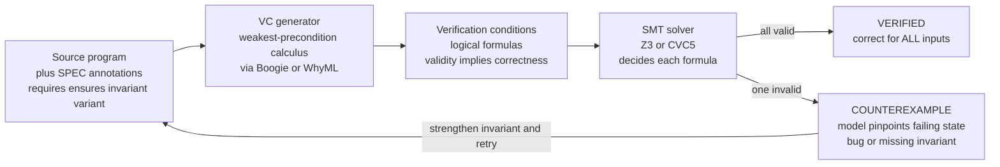

# 🛠️ Deductive Verification Tools

> [!abstract] TL;DR
> **Deductive verification tools** are the practical toolchains that *prove* a program meets its specification for **every possible input** — the place where **Hoare logic**, **weakest preconditions**, and **SMT solvers** finally come together as usable software. The workflow is **auto-active**: the programmer **annotates** the source with a specification — **pre/postcondition contracts** (`requires` / `ensures`), **loop invariants**, and **variants** for termination — and the tool's **VC generator** mechanically turns the annotated program into **verification conditions (VCs)**: logical formulas whose validity *implies* the program is correct. Those VCs are shipped to an **SMT solver** (**Z3**, **CVC5**); if all are valid the program is **verified** (full functional correctness), and if one fails the solver's model becomes a concrete **counterexample** pinpointing the bug or the missing/wrong invariant. The headline tools are **Dafny** (a verification-aware language from Microsoft/Leino), **Why3** (a platform dispatching WhyML to many provers), **Boogie** (the shared VC-generation intermediate layer), **Frama-C/WP + ACSL** for C, industrial **SPARK-Ada**, heap-aware **VeriFast / Viper** (separation logic), and the **Rust** verification wave (**Verus, Creusot, Prusti**) plus **F\*** for verified crypto (**HACL\* / EverCrypt**). The catch is the **annotation burden** — writing loop invariants is the human bottleneck — plus **SMT incompleteness** (timeouts, `unknown`) and a **trusted computing base** (you trust the VC generator, the solver, and the axioms). Deductive verification sits between **automatic-but-limited model checking** and **powerful-but-manual interactive proving**: substantial push-button automation with rich functional specs, paid for in annotations.

---

## Intuition

**Analogy — code that ships with a promise, and a robot notary that checks it.** Imagine that next to every function you write, you also write down what the function **promises**: "*give me a non-negative `n` (the requirement), and I will return exactly the sum `0+1+...+(n-1)` (the guarantee)*." Now a tireless robot notary reads your code *and* your promise, and **silently proves** that the code keeps that promise for **every conceivable input** — not by running a few tests, but by reasoning about all of them at once. If it can prove it, it stamps **VERIFIED**. If it can't, it doesn't shrug — it hands you the **exact input and program state** where the promise would break, often pointing at the precise line.

That robot notary is a **deductive verifier** like **Dafny**. You supply the **insight** — the pre/postconditions and, crucially, the **loop invariants** (what stays true every time around a loop). The tool mechanically generates the logical **proof obligations**, ships them to an **SMT solver**, and either says *verified* or produces a *counterexample*. It is **autopilot for program proof**: the human provides the invariants, the machine grinds out the tedium.

---

## How It Works

### Core Mechanics

1. **Annotate the source.** The programmer adds a **specification** to the code: a **precondition** (`requires`) constraining valid inputs, a **postcondition** (`ensures`) stating the guaranteed result, **loop invariants** (a property true before and after every iteration), a **variant / decreasing measure** to prove **termination**, and **framing/assertions** to bound side effects. This is the *only* creative work the human must do.
2. **Generate verification conditions.** The tool's **VC generator** walks the annotated program using a **weakest-precondition (wp) calculus** — usually by first translating into an **intermediate verification language** like **Boogie** or **WhyML** so many front-ends can share one VC engine. `wp(S, Q)` is the weakest predicate that, if true before `S`, guarantees `Q` after. Assignment substitutes; sequencing composes; a **loop uses its annotated invariant** and emits *side conditions* (invariant holds on entry, is preserved by the body, and on exit establishes the postcondition).
3. **Emit logical formulas.** Each proof obligation becomes a **VC**: a first-order formula (over arithmetic, arrays, bit-vectors, uninterpreted functions) whose **validity implies** the corresponding part of the spec. A correct program with good annotations produces a *bundle* of VCs, each of which must be valid.
4. **Discharge with an SMT solver.** The VCs are handed to an **SMT solver** (**Z3**, **CVC5**). SMT = *Satisfiability Modulo Theories*: SAT search wrapped around decision procedures for arithmetic, arrays, and more. To check a VC `φ` is **valid**, the solver checks `¬φ` is **unsatisfiable**.
5. **Verified, or a counterexample.** If **all** VCs are valid → the program is **verified**: it satisfies its spec for *all* inputs. If some VC is **invalid**, the solver returns a **model of its negation** — a concrete state that violates the obligation. That model is surfaced as a **counterexample**, pinpointing a genuine bug *or* an invariant that is too weak / wrong.
6. **Iterate.** The engineer reads the counterexample, **strengthens the invariant** or fixes the code, and re-runs. Verification is a *conversation* with the tool, not a one-shot batch.
7. **Modularity is what scales.** Each function is verified **once, against its own contract**, and callers are verified using only the *contract* (not the callee's body). This **per-function modularity** is what lets deductive verification handle real codebases.

### Flow / Architecture



*The annotated program flows through wp-based VC generation into a bundle of formulas; the SMT solver decides each one. All-valid means verified for every input; one-invalid returns a concrete counterexample state that the engineer uses to fix the code or repair the invariant, then re-runs.*

---

## Key Concepts

### Secondary (intuitive, no advanced background needed)

- **A contract is a promise.** `requires` says what the caller must guarantee; `ensures` says what the function guarantees back. Verification proves the promise is *always* kept.
- **A loop invariant is "what never stops being true."** It is the single fact that survives every trip around the loop — the human's key contribution and the hardest to get right.
- **Proof, not testing.** Tests check *some* inputs; a deductive verifier reasons about **all** inputs at once, so a "verified" result has no untested corner cases (within its spec).
- **A counterexample is a gift.** When the tool fails, it usually hands you the exact broken state — far more useful than a red test with no explanation.
- **The tool does the boring part.** You write the invariant; the machine grinds out the thousands of tiny logical checks.

### Undergraduate (a first course)

- **Weakest-precondition calculus.** `wp(x := e, Q) = Q[x := e]`; `wp(S1; S2, Q) = wp(S1, wp(S2, Q))`; conditionals split on the guard. A **Hoare triple** `{P} S {Q}` reduces to the single VC `P ⇒ wp(S, Q)` plus loop side conditions.
- **Loop VCs.** For `while b invariant I { body }` targeting `Q`: (1) `I` holds on entry, (2) **preservation** `(I ∧ b) ⇒ wp(body, I)`, (3) **exit** `(I ∧ ¬b) ⇒ Q`. A wrong or too-weak `I` makes (2) or (3) fail.
- **Termination via variants.** A **decreasing measure** (a well-founded, strictly decreasing quantity) proves the loop halts — separating *partial* correctness (if it terminates, the answer is right) from *total* correctness.
- **Intermediate verification languages.** **Boogie** and **WhyML** are minimal imperative languages with contracts; front-ends (Dafny, Frama-C, Viper) translate *into* them so the heavy VC-gen + SMT machinery is written once.
- **SMT as the discharge engine.** VCs are validity queries in decidable-ish **theories** (linear arithmetic, arrays, bit-vectors, uninterpreted functions). Checking `φ` valid = checking `¬φ` unsatisfiable in the solver.
- **Auto-active verification.** The style between *fully automatic* and *fully interactive*: the human guides only through **annotations in the source**, never by stepping through a proof.

### Graduate (advanced)

- **Modular / assume-guarantee reasoning.** Each function is verified against its contract; call sites **assume** the callee's `ensures` and **discharge** its `requires`. This decomposition is what makes verification scale to large systems and enables **frame conditions** (`modifies` clauses) to control the heap.
- **Separation logic and the heap.** **VeriFast** and **Viper** encode ownership of memory as **separating conjunction** (`P * Q`), enabling local reasoning about pointers, aliasing, and concurrency — the hard part that pure Hoare logic fumbles.
- **The Trusted Computing Base (TCB).** A deductive verifier's "proof" is only as trustworthy as its **VC generator + SMT solver + background axiomatization**. Unlike **foundational** proof-assistant verification (a small trusted kernel checks every step), you trust a *large* toolchain — a real, if usually acceptable, difference in assurance.
- **SMT incompleteness and brittleness.** First-order logic with quantifiers is only semi-decidable; solvers rely on **quantifier instantiation** heuristics (E-matching, triggers) that can **time out** or return **`unknown`**. Small annotation changes can flip a proof from instant to hopeless — the notorious **verification brittleness**.
- **Invariant inference.** Auto-generating loop invariants (abstract interpretation, Houdini, ICE-learning, Daikon-style dynamic inference, and ML-guided synthesis) attacks the annotation bottleneck but remains fundamentally limited by undecidability.
- **Positioning on the assurance/automation spectrum.** **Model checking** (automatic, explores a finite state space) ↔ **deductive verification** (semi-automatic, rich functional specs, needs invariants) ↔ **interactive proving** (Coq/Isabelle/Lean, maximal power, maximal manual effort). Deductive verifiers are the *workhorse middle*.
- **Refinement-based deductive verification.** Tools can prove an executable implementation **refines** an abstract spec (see B/Event-B, Dafny's abstraction), tying VC discharge to correctness-by-construction.

---

## Python Demo

We **build a tiny deductive verifier** for a mini imperative language, then use it exactly like Dafny/Why3 would.
**(a) Toolchain:** we represent an **annotated program** (with `requires`/`ensures` and a **loop invariant**) as a small AST, run **weakest-precondition VC generation** to produce the verification conditions, and **"discharge"** each VC by *bounded exhaustive checking over a grid of integer states* — a transparent stand-in for the SMT solver. We run it on a **correct** sum-of-`0..n-1` program (all VCs valid → **VERIFIED**) and on a **buggy** version with a **wrong loop invariant** (a VC fails → concrete **COUNTEREXAMPLE** state).
**(b) Annotation burden:** we scale up a family of programs (`k` chained loops) and count how the number of **VCs** and required **annotations** grows with program size — the reason automation and good invariants matter. `numpy` + `matplotlib`.

```python
# A minimal DEDUCTIVE VERIFIER: wp-based VC generation + a bounded "SMT stand-in".
# (a) Verify a CORRECT program (sum of 0..n-1); catch a BUGGY one (WRONG invariant)
#     by producing a concrete counterexample state.
# (b) Show VC count / annotation burden growing with program size.
# numpy + matplotlib only.

import numpy as np
import matplotlib.pyplot as plt
from itertools import product

# ---------- predicate / expression combinators (shallow embedding) ----------
# predicate: state(dict)->bool ;  expression: state(dict)->int
def P_and(A, B):     return lambda s: A(s) and B(s)
def P_not(A):        return lambda s: not A(s)
def P_implies(A, B): return lambda s: (not A(s)) or B(s)
def lit(v):          return lambda s: v

# ---------- mini imperative language (AST) ----------
def Skip():                   return ("skip",)
def Assign(x, e):             return ("assign", x, e)      # e: state->int
def Seq(*stmts):              return ("seq", list(stmts))
def While(inv, guard, body):  return ("while", inv, guard, body)

# ---------- weakest-precondition VC GENERATION ----------
def wp(stmt, Q, vcs):
    kind = stmt[0]
    if kind == "skip":
        return Q
    if kind == "assign":                       # wp(x:=e, Q) = Q[x := e]
        _, x, e = stmt
        return lambda s, Q=Q, x=x, e=e: Q({**s, x: e(s)})
    if kind == "seq":                          # wp(S1;S2, Q) = wp(S1, wp(S2, Q))
        pre = Q
        for st in reversed(stmt[1]):
            pre = wp(st, pre, vcs)
        return pre
    if kind == "while":                        # loop uses its annotated invariant
        _, inv, guard, body = stmt
        wp_body = wp(body, inv, vcs)
        vcs.append(("loop: invariant preserved",
                    P_implies(P_and(inv, guard), wp_body)))          # (I & b) => wp(body,I)
        vcs.append(("loop: exit establishes postcondition",
                    P_implies(P_and(inv, P_not(guard)), Q)))         # (I & !b) => Q
        return inv                                                    # wp(while,Q) = I
    raise ValueError(kind)

def generate_vcs(P, stmt, Q):
    side = []
    weakest = wp(stmt, Q, side)
    return [("entry: precondition implies wp", P_implies(P, weakest))] + side

# ---------- "SMT stand-in": bounded exhaustive discharge over an integer grid ----------
def discharge_each(vcs, variables, K=6):
    grid = range(0, K + 1)
    results = []                                # (name, valid?, counterexample_or_None)
    for name, vc in vcs:
        cex = None
        for combo in product(grid, repeat=len(variables)):
            s = dict(zip(variables, combo))
            try:
                ok = vc(s)
            except Exception:
                ok = True                       # undefined term -> treat as vacuous
            if not ok:
                cex = s
                break
        results.append((name, cex is None, cex))
    return results

def verify(name, P, stmt, Q, variables, K=6):
    vcs = generate_vcs(P, stmt, Q)
    results = discharge_each(vcs, variables, K)
    ok = all(r[1] for r in results)
    print(f"\n=== {name} ===")
    print(f"  VCs generated: {len(vcs)}")
    for nm, valid, cex in results:
        tag = "valid" if valid else f"INVALID  counterexample={cex}"
        print(f"    - {nm:42s}: {tag}")
    print("  RESULT:", "VERIFIED (correct for all inputs)" if ok
          else "COUNTEREXAMPLE FOUND (spec violated)")
    return ok, results, len(vcs)

# ---------- (a) two programs: correct + buggy (wrong invariant) ----------
VARS = ["i", "n", "sum"]
body    = Seq(Assign("sum", lambda s: s["sum"] + s["i"]),
              Assign("i",   lambda s: s["i"] + 1))
guard   = lambda s: s["i"] < s["n"]
P_spec  = lambda s: s["n"] >= 0                                   # requires n >= 0
Q_spec  = lambda s: s["sum"] == s["n"] * (s["n"] - 1) // 2        # ensures sum = n(n-1)/2

inv_ok  = lambda s: (0 <= s["i"] <= s["n"]) and (s["sum"] == s["i"] * (s["i"] - 1) // 2)
inv_bug = lambda s: (0 <= s["i"] <= s["n"]) and (s["sum"] == s["i"] * (s["i"] + 1) // 2)  # off by one

prog_ok  = Seq(Assign("sum", lit(0)), Assign("i", lit(0)), While(inv_ok,  guard, body))
prog_bug = Seq(Assign("sum", lit(0)), Assign("i", lit(0)), While(inv_bug, guard, body))

ok_res,  res_ok,  nvc_ok  = verify("CORRECT program  (invariant sum == i*(i-1)/2)",
                                   P_spec, prog_ok,  Q_spec, VARS)
bug_res, res_bug, nvc_bug = verify("BUGGY program    (WRONG invariant sum == i*(i+1)/2)",
                                   P_spec, prog_bug, Q_spec, VARS)

# ---------- (b) annotation / VC burden vs program size ----------
def build_program(k):
    """k chained independent counter loops -> a program of 'size' k."""
    stmts, invs = [], 0
    for j in range(k):
        c, m = f"c{j}", f"m{j}"
        inv   = lambda s, c=c, m=m: 0 <= s[c] <= s[m]
        grd   = lambda s, c=c, m=m: s[c] < s[m]
        bdy   = Assign(c, lambda s, c=c: s[c] + 1)
        stmts += [Assign(c, lit(0)), While(inv, grd, bdy)]
        invs  += 1
    return (lambda s: True), Seq(*stmts), (lambda s: True), invs

ks   = np.arange(1, 9)
nvcs = np.array([len(generate_vcs(*build_program(int(k))[:3])) for k in ks])
anns = np.array([build_program(int(k))[3] + 2 for k in ks])   # k invariants + pre + post

# ---------- visualization ----------
fig, (axL, axR) = plt.subplots(1, 2, figsize=(14, 6))

# (a) verified-vs-counterexample panel
progs = ["CORRECT\nprogram", "BUGGY\nwrong invariant"]
passed = [sum(r[1] for r in res_ok), sum(r[1] for r in res_bug)]
failed = [sum(not r[1] for r in res_ok), sum(not r[1] for r in res_bug)]
x = np.arange(2)
axL.bar(x, passed, color="#55A868", label="VCs discharged VALID")
axL.bar(x, failed, bottom=passed, color="#C44E52", label="VC that FAILED")
axL.set_xticks(x); axL.set_xticklabels(progs, fontsize=11)
axL.set_ylabel("verification conditions")
axL.set_title("Discharge result: VERIFIED vs COUNTEREXAMPLE")
axL.legend(loc="upper left")
axL.text(0, passed[0] + 0.15, "VERIFIED\nall inputs", ha="center",
         color="#2A6F3B", fontweight="bold")
cex_state = next(r[2] for r in res_bug if not r[1])
axL.text(1, passed[1] + failed[1] + 0.15,
         f"COUNTEREXAMPLE\nstate = {cex_state}", ha="center",
         color="#8B2E32", fontweight="bold", fontsize=9)
axL.set_ylim(0, max(passed) + 1.4)

# (b) annotation / VC burden vs program size
axR.plot(ks, nvcs, "o-", lw=2.4, color="#4C72B0", label="verification conditions  (1 + 2k)")
axR.plot(ks, anns, "s-", lw=2.4, color="#DD8452", label="required annotations  (k invariants + 2 contracts)")
axR.set_title("Annotation / VC burden grows with program size\n(why automation & good invariants matter)")
axR.set_xlabel("program size  k  (number of loops)")
axR.set_ylabel("count")
axR.legend(loc="upper left"); axR.grid(alpha=0.3)

fig.suptitle("Deductive verification: annotate -> generate VCs -> discharge -> verified or counterexample",
             fontsize=13)
fig.tight_layout()
plt.savefig("deductive_verification_tools.png", dpi=120)
print("\nSaved figure to deductive_verification_tools.png")
```

**What it shows.** Part (a): the **correct** program generates 3 VCs (entry, invariant-preserved, exit) and the bounded solver finds **no violating state** for any of them → **VERIFIED for every input**. The **buggy** program uses an invariant that is off by one (`sum == i*(i+1)/2` instead of `i*(i-1)/2`); the **invariant-preserved** VC fails and the solver returns a concrete **counterexample state** (e.g. `{i:0, n:1, sum:0}`) — exactly the debugging signal a real tool gives you, telling you the invariant is wrong, not the code. Part (b): as the program grows to `k` loops, the **VC count** scales as `1 + 2k` and the **annotation burden** as `k` invariants plus the two contracts — both **linear in program size**, a miniature of why the loop invariant is the human bottleneck and why **modular** (per-function) verification and **invariant inference** are what keep the effort tractable.

---

## Real-World Applications

> **Example — HACL\* / EverCrypt: verified cryptography that ships.** The **HACL\*** library and Mozilla/Microsoft's **EverCrypt** provider implement mainstream crypto (Curve25519, ChaCha20-Poly1305, SHA-2/3, Ed25519) in **F\***, where each routine is verified for **functional correctness, memory safety, and secret-independent timing** by generating proof obligations discharged partly through **SMT (Z3)**. The verified code is extracted to C and **runs in Firefox, the Linux kernel, and mbedTLS** — a landmark showing deductive verification producing real, deployed, high-assurance software.

- **Dafny at Amazon Web Services.** AWS uses **Dafny** to verify security-critical components — authorization logic, the **s2n-bignum** and cryptographic routines, and parts of the encryption SDK — turning specifications into machine-checked guarantees for code that gates access to cloud resources.
- **SPARK-Ada in avionics, rail, and space.** Industrial **SPARK** (a verifiable Ada subset with a Why3/GNATprove back-end) proves absence of runtime errors and functional properties in **certified safety-critical systems** (aircraft, railway signaling, secure hardware) where testing alone cannot meet certification standards.
- **Frama-C / WP for C.** Using **ACSL** contracts, **Frama-C's WP plugin** proves properties of embedded and systems C code (e.g. verified components in industrial and defense software), discharging VCs via Alt-Ergo, Z3, and CVC5.
- **Why3 as a verification platform.** **Why3** and **WhyML** provide the VC engine and multi-prover dispatch beneath many front-ends, letting the *same* obligation be tried against Z3, CVC5, Alt-Ergo, and even interactive provers when SMT gives up.
- **The Rust verification wave.** **Verus, Creusot, Prusti** (and Kani for bounded checking) bring contracts and invariants to Rust, exploiting its **ownership** discipline to tame heap reasoning — verifying data structures and OS/kernel components with far less separation-logic pain.
- **Verified systems components.** Deductive verification underpins pieces of verified operating systems and hypervisors (e.g. seL4-adjacent tooling, Microsoft's IronFleet/IronClad built on Dafny) where a mechanically checked contract replaces a mountain of tests.

---

## Common Pitfalls

- **The loop invariant *is* the work.** VC generation and SMT discharge are automatic; **finding the right invariant is not**. Too weak and preservation/exit VCs fail; too strong and it can't be established on entry. Most "the tool can't prove my obvious code" frustration is a missing or wrong invariant — read the counterexample, it usually says which.
- **Reading a timeout as "false".** SMT over quantified formulas is only semi-decidable; a solver may return **`unknown`** or **time out**. That means *"I couldn't decide"*, **not** "your program is wrong". Distinguish a genuine **counterexample** (a real model) from a **non-answer**.
- **Verification brittleness.** Proofs can be alarmingly sensitive to trigger selection and quantifier instantiation: a trivial refactor can turn a 2-second proof into a timeout. Stabilize with explicit triggers, `assert` lemmas to guide the solver, and by splitting large VCs.
- **Forgetting termination.** A `requires`/`ensures` proof usually establishes only **partial correctness**. Without a **variant / decreasing measure**, a non-terminating loop can be "correct" yet never return. Total correctness needs the termination argument.
- **Trusting the whole toolchain blindly.** Your guarantee rests on the **TCB**: the VC generator, the SMT solver, and the **axiomatization** of the language/memory model. A bug or an unsound axiom there voids the proof — unlike **foundational** proof-assistant verification with a tiny checked kernel. Know what you are trusting.
- **Under-specifying the frame.** Omitting `modifies`/framing clauses lets the tool assume a method changes *nothing*, "proving" callers correct on false premises. Specify what the heap may change.
- **Confusing the three regimes.** **Model checking** is automatic but explores a (bounded) state space; **interactive proving** (Coq/Isabelle/Lean) is maximally powerful but maximally manual; **deductive verification** is the middle — push-button *per VC* with rich specs, at the cost of annotations. Reaching for the wrong one wastes enormous effort.

*(Sibling notes in this section, referenced in prose and built out separately: `Hoare_Logic_and_Axiomatic_Semantics`, `Weakest_Preconditions_and_Predicate_Transformers`, `Loop_Invariants_and_Termination_Proofs`, `SMT_Solving_and_Satisfiability_Modulo_Theories`, `Design_by_Contract_and_Assertions`.)*

---

## Related Concepts

- [[Formal_Methods_Overview]] — the parent field; deductive verification is the "prove the code, not just the model" branch that discharges obligations with solvers.
- [[Axiomatic_Semantics_and_Hoare_Logic]] — the logical foundation: `{P} S {Q}` triples and wp are exactly what the VC generator mechanizes.
- [[Logic_for_Program_Verification]] — the first-order + theory logic in which verification conditions are expressed and decided.
- [[Automated_Theorem_Proving]] — the sibling engine; ATP/SMT back-ends are what actually discharge the VCs, and "hammers" bridge the two worlds.
- [[Interactive_Theorem_Proving]] — the powerful-but-manual neighbor; deductive tools fall back to it (or embed in it) when SMT gives up on a hard obligation.
- [[SAT_Solving_and_DPLL]] — the propositional core beneath every SMT solver that decides the VCs.
- [[State_Based_Modeling_and_Invariants]] — invariants are the shared currency: here they are loop invariants the human must supply.
- [[Refinement_and_Correctness_by_Construction]] — the complementary route; deductive verifiers can prove an implementation refines an abstract spec.
- [[Verified_and_Certified_Languages]] — languages (Dafny, F\*, verified compilers) built so correctness is a first-class, machine-checked property.
- [[Proof_Assistants_and_Dependent_Type_Theory]] — the foundational alternative with a tiny trusted kernel, contrasting with the larger TCB of a VC-gen + SMT toolchain.
- [[Type_Systems_Fundamentals]] — a lightweight, always-on cousin: types prove *some* properties automatically; contracts prove the rest.
- [[Dependent_Types_and_Advanced_Type_Systems]] — where specifications live *in the types*, blurring the line with deductive verification (F\*, Idris, Agda).
- [[Formal_Semantics_and_Verified_Compilers]] — verified compilers (CompCert) extend the trust chain so the proof about source code survives compilation.
- [[Ownership_and_Borrowing]] — Rust's discipline that makes heap-aware deductive verification (Verus, Creusot, Prusti) dramatically more tractable.
- [[Applied_Cryptography_Engineering]] — the domain of the landmark HACL\*/EverCrypt verified-crypto libraries built with F\*.

---

## Review Questions

### Secondary

1. In the "robot notary" analogy, what does the programmer supply and what does the tool supply? Why is a **loop invariant** the programmer's job and not the machine's?
2. A deductive verifier says **VERIFIED**. How is that guarantee stronger than a passing test suite — and what part of the specification is it *not* checking?
3. When the tool fails, it prints a **counterexample state**. Why is that more useful for debugging than a plain "verification failed"?

### Undergraduate

1. Write the three verification conditions a tool generates for `while b invariant I { body }` targeting postcondition `Q`. In the Python demo's buggy program, *which* of these VCs fails and why?
2. Explain the pipeline **annotate → VC generation (wp / Boogie) → SMT discharge → verified / counterexample**. What role does an **intermediate verification language** like Boogie or WhyML play?
3. Using the demo's part (b), explain how VC count and annotation burden scale with program size, and why **modular per-function verification** is essential for real codebases.

### Graduate

1. Contrast the **trusted computing base** of a deductive verifier (VC-gen + SMT + axioms) with that of a **foundational proof assistant** (small kernel). What assurance is gained or lost, and when does the difference matter?
2. SMT solvers can return **`unknown`** or time out on quantified VCs. Explain the source of this incompleteness (quantifier instantiation), how "verification brittleness" arises, and two engineering techniques to mitigate it.
3. Position **model checking**, **deductive verification**, and **interactive theorem proving** on a single automation-vs-expressiveness axis. For a heap-manipulating concurrent data structure with a rich functional spec, which would you reach for, and what would each demand of you?

---

## Sources

- K. R. M. Leino. "Dafny: An Automatic Program Verifier for Functional Correctness." *LPAR-16*, LNCS 6355:348–370, 2010 — the Dafny language and its Boogie/Z3 verification pipeline. <https://doi.org/10.1007/978-3-642-17511-4_20>
- K. R. M. Leino. *Program Proofs.* MIT Press, 2023 — a full modern textbook teaching verification through Dafny (contracts, invariants, termination).
- J.-C. Filliâtre, A. Paskevich. "Why3 — Where Programs Meet Provers." *ESOP 2013*, LNCS 7792:125–128 — the Why3 platform and WhyML dispatching VCs to many provers. <https://doi.org/10.1007/978-3-642-37036-6_8>
- M. Barnett, B.-Y. E. Chang, R. DeLine, B. Jacobs, K. R. M. Leino. "Boogie: A Modular Reusable Verifier for Object-Oriented Programs." *FMCO 2005*, LNCS 4111:364–387 — the shared VC-generation intermediate language. <https://doi.org/10.1007/11804192_17>
- F. Kirchner, N. Kosmatov, V. Prevosto, J. Signoles, B. Yakobowski. "Frama-C: A Software Analysis Perspective." *Formal Aspects of Computing* 27:573–609, 2015 — the Frama-C platform, WP plugin, and ACSL for C. <https://doi.org/10.1007/s00165-014-0326-7>
- J. Protzenko et al. "Verified Low-Level Programming Embedded in F\* / HACL\*." *ICFP 2017 / IEEE S&P 2020* — verified cryptography (HACL\*/EverCrypt) deployed in production.

---

#formal-methods #deductive-verification #dafny #why3 #smt
