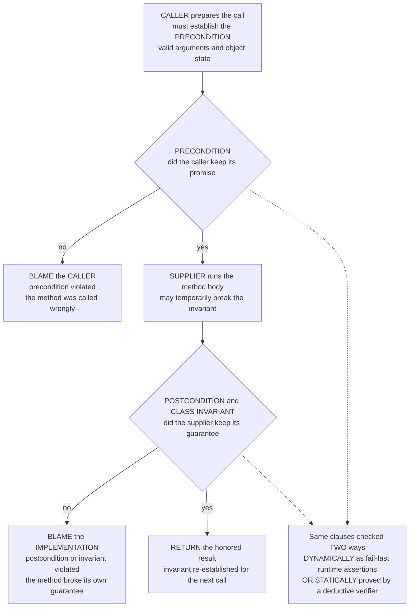

# 📜 Design by Contract and Assertions

> [!abstract] TL;DR
> **Design by Contract** (Bertrand Meyer, Eiffel) treats every method as a **legal agreement between a caller and a supplier**. The **precondition** is the *caller's obligation* — what must be true of the arguments and object state *before* the call; the **postcondition** is the *supplier's guarantee* — what the method promises about the result and state *after* it returns; the **class invariant** is what stays true of an object *between* method calls. The payoff is **blame assignment**: if a precondition is violated, the **caller** has the bug (it called wrongly); if a postcondition or invariant is violated *given a satisfied precondition*, the **implementation** has the bug — turning "who crashed this?" from a shouting match into a checkable clause. Contracts are literally the **pre/postconditions of Hoare logic written inside the program**, so they can be checked two ways: **dynamically**, as runtime **assertions** that fail fast at the exact point of violation (the everyday `assert`, plus richer frameworks), or **statically**, proved once for *all* executions by deductive verifiers (**JML** for Java, **ACSL/Frama-C** for C, **Spec#**/Code Contracts, **Dafny**, **SPARK/Ada**). That makes contracts the **gradual on-ramp** from testing to full verification — the *lightweight, most-adopted face of formal methods*, usable by everyday programmers, and a bridge to the heavyweight machinery. In OO they interact with the **Liskov Substitution Principle**: a subtype may **weaken** the precondition and **strengthen** the postcondition/invariant (behavioral subtyping). Contracts double as **executable specifications, test oracles, and documentation that cannot go stale**.

---

## Intuition

**Analogy — the two-way business contract.** A commercial contract spells out obligations in *both* directions: *"IF you pay by Friday (your duty), THEN I deliver the goods on Monday (my duty)."* Each party has something to *promise* and something to *expect*. If you fail to pay, my non-delivery is **your** fault — you broke your end. If you pay on time and I still fail to deliver, the breach is **mine**. The genius of the arrangement is not that nothing ever goes wrong; it is that **when something goes wrong, the contract says exactly whose fault it is**.

Design by Contract makes every function such an agreement. The **caller** promises the **precondition** (valid inputs, object in a sane state) — that is the caller's "pay by Friday." In return the function **guarantees** the **postcondition** (a correct result, a well-defined state change) — the supplier's "deliver on Monday." If the caller breaks its promise, the fault is the caller's; if the function breaks its guarantee *after* the caller kept theirs, the fault is the function's. This turns the perennial debugging question — *"who is responsible for this crash?"* — from a blame-shifting argument into a precise, mechanically **checkable clause** that lives right there in the code. It is the everyday, in-your-source-file face of the same pre/postcondition reasoning that heavyweight verification does with proofs.

---

## How It Works

### Core Mechanics

**1. Three clauses define the contract of a class.** For each method:
- **Precondition (`require`)** — the *caller's obligation*: a boolean assertion over the arguments and current object state that must hold **before** the body runs. `withdraw(amt)` might require `0 < amt <= balance`.
- **Postcondition (`ensure`)** — the *supplier's guarantee*: an assertion over the *result* and the state change (often relating the new state to the `old` state) that the method promises **on return**. `withdraw` ensures `balance == old balance - amt`.
- **Class invariant** — a property true of every object of the class **between** any two method calls (and after construction). A bank account might invariant `0 <= balance <= limit`. Methods may *temporarily* break it inside their body but must **re-establish** it before returning.

**2. Blame assignment is the whole point.** With the contract in place, responsibility partitions cleanly:
- **Precondition violated** → the **caller** has the bug. It invoked the method outside the domain the supplier ever agreed to handle. The supplier is entitled to do *anything*.
- **Postcondition or invariant violated**, *given the precondition held* → the **implementation** has the bug. The caller kept its promise and the supplier still failed to deliver.

This is exactly why contracts are *not* the same as defensive programming: a defensive routine validates its inputs and returns error codes to *tolerate* bad callers; a contract *declares* bad callers to be broken and refuses to paper over them, so the bug surfaces at its true source.

**3. Contracts are Hoare pre/postconditions embedded in the program.** A method with precondition `P`, body `S`, and postcondition `Q` is precisely the Hoare triple `{P} S {Q}` — the subject of the sibling note *Hoare_Logic_and_Axiomatic_Semantics*. The class invariant `I` is conjoined to both sides (`{P ∧ I} S {Q ∧ I}`). Everything Design by Contract does is *write those assertions where the code is*, rather than in a separate proof document. This is why contracts are the **lightweight end of formal methods**: the same rigor, delivered incrementally.

**4. Two ways to check the very same clauses.**
- **Dynamically (runtime assertions).** The compiler or a library inserts checks: evaluate the precondition on entry, run the body, evaluate the postcondition and invariant on exit, and **fail fast** with a precise error the instant a clause is broken. This is what the everyday `assert` statement and contract frameworks do. Cheap, incremental, catches real violations on real inputs — but only for the inputs you actually run.
- **Statically (deductive verification).** A verifier generates **verification conditions** from the same contracts (via weakest-precondition reasoning — see the sibling *Weakest_Preconditions_and_Predicate_Transformers*) and discharges them with an SMT solver, proving them for **all** executions at once. **Dafny**, **SPARK/Ada**, **Frama-C/ACSL**, **JML+OpenJML**, and **Spec#** live here; the sibling *Deductive_Verification_Tools* surveys them.

**5. The gradual spectrum.** Because the *same* pre/postconditions serve both checking modes, contracts are a **continuous on-ramp**: start with runtime `assert`s during development, promote the hottest or most safety-critical to a static verifier, and — where a contract is written in a formal specification language (see the sibling *Formal_Specification_Languages*) — drive a full machine-checked proof. Types are one especially cheap, always-on flavor of this idea (the sibling *Type_Based_Verification* angle): a type is a precondition/postcondition the compiler proves *by construction*.

**6. Inheritance and the Liskov Substitution Principle.** When a subclass overrides a method, its contract may not be arbitrary: to keep subtype objects usable everywhere a supertype is expected (**behavioral subtyping**, Liskov & Wing), the override may only **weaken the precondition** (accept at least as much) and **strengthen the postcondition and invariant** (promise at least as much). Break this and a caller written against the base contract can be silently betrayed by a subtype — the contract-level statement of the Liskov Substitution Principle.

### Flow / Architecture



*The precondition gate assigns blame to the caller; the postcondition/invariant gate assigns blame to the implementation. The dashed link records that both gates are literally Hoare pre/postconditions — checked dynamically as assertions or proved statically for every execution.*

---

## Key Concepts

### Secondary (explain to a curious beginner)

- A **contract** on a function has two halves: what the **caller must promise** (the precondition) and what the **function guarantees back** (the postcondition).
- A **class invariant** is a fact about an object that is *always* true when you are not in the middle of one of its methods — like "a bank balance is never negative."
- **Blame is decided automatically**: break the precondition and it's the *caller's* bug; break the guarantee after keeping your promise and it's the *function's* bug.
- An **assertion** (`assert`) is the everyday way to write a contract clause: the program stops the instant the fact it states turns out false, pointing straight at the problem.

### Undergraduate (requires a CS background)

- A method contract `{P} body {Q}` is a **Hoare triple written inside the code**; the class invariant `I` is conjoined on both ends — contracts *are* axiomatic semantics made executable.
- **Dynamic vs static checking**: runtime assertions catch violations on the inputs you actually run and *fail fast*; static verifiers prove the same clauses for **all** inputs but demand more from you (formal specs, sometimes loop invariants).
- **Contracts vs defensive programming**: a contract *declares* an out-of-domain call to be the caller's bug and refuses to handle it; defensive code *tolerates* bad input with validation and error codes. Contracts push the fix to the true source.
- **Contracts as oracles**: a postcondition is a ready-made **test oracle** — feed random inputs (property-based testing) and let the postcondition decide pass/fail, no hand-written expected values needed.
- **The gradual path**: `assert` → contract library → runtime-checked spec language → statically verified spec. The same pre/postconditions travel the whole way.

### Graduate (system-level and foundational thinking)

- **Behavioral subtyping (Liskov & Wing, 1994)**: an override may **weaken the precondition** and **strengthen the postcondition/invariant**; the *contract* formalizes when `S <: T` is safe to substitute. Contravariant preconditions, covariant postconditions — the same variance discipline that governs function subtyping.
- **Contracts and weakest preconditions**: a static contract checker computes `wp(body, Q ∧ I)` and emits the verification condition `P ∧ I ⟹ wp(body, Q ∧ I)`; loops inside the body still need supplied **loop invariants** and **variants** for total correctness — the contract fixes the *interface*, not the internal proof.
- **Purity and framing**: postconditions that mention `old` state, and *frame conditions* ("this method modifies only `balance`"), are essential for sound modular reasoning — JML's `assignable`, ACSL's `assigns`, separation logic's frame rule. Side-effecting contract expressions are unsound (they change what they claim to observe).
- **Soundness of the discipline vs of the checker**: dynamic contracts are *sound-if-triggered* (they only witness violations on executed paths); static verification is *sound-for-all-paths* but inherits the relative incompleteness of the underlying logic (Cook/Gödel), so a valid contract can still defeat the solver.
- **Contracts as the adoption bridge**: the reason DbC is the most *deployed* formal-methods idea is precisely that it is **incremental and local** — one method's contract is meaningful with zero others written — unlike whole-program model checking or global specifications.

---

## Python Demo

Two experiments make the ideas executable. **(a) Pre/Post/Invariant and blame.** We build a `contract` decorator that wraps each method of a `BankAccount` with a **precondition** check (caller's obligation), a **postcondition** check (supplier's guarantee, relating the new state to a captured `old` snapshot), and a **class-invariant** check on entry *and* exit. We then run two call sequences: a **correct implementation driven by a sloppy caller** (issuing over-limit deposits and overdrafts) and a **buggy implementation driven by a careful caller** (only valid calls). The decorator raises a *typed* exception per clause, and we **classify the blame** — precondition failures are the caller's, postcondition/invariant failures are the implementation's. **(b) Contract as oracle.** We reuse the postcondition as the **test oracle** for property-based testing: across thousands of random *valid* inputs, the contract catches the buggy implementation on every violating call, while **assertion-free code has no oracle and detects nothing**. We plot the blame classification and the cumulative bug-catch. `numpy` + `matplotlib`.

```python
# Design by Contract, made executable: a contract decorator enforcing
# PRECONDITION (caller's duty), POSTCONDITION (supplier's guarantee), and CLASS INVARIANT,
# with automatic BLAME classification, plus the postcondition reused as a property-based
# testing ORACLE versus assertion-free code. numpy + matplotlib.

import functools
import numpy as np
import matplotlib.pyplot as plt

# ---------- Typed violations, each tagged with WHO is to blame ----------
class PreconditionError(AssertionError):   blame = "caller"           # caller called wrongly
class PostconditionError(AssertionError):  blame = "implementation"   # supplier broke its guarantee
class InvariantError(AssertionError):      blame = "implementation"   # object left inconsistent

# ---------- The contract decorator: wrap a method with pre / post / invariant ----------
def contract(pre=None, post=None):
    """pre(self, *args) -> bool ;  post(self, old, result, *args) -> bool ."""
    def decorator(method):
        @functools.wraps(method)
        def wrapper(self, *args, **kwargs):
            # 1. PRECONDITION -- the caller's obligation, checked in the PRE-state
            if pre is not None and not pre(self, *args, **kwargs):
                raise PreconditionError(f"{method.__name__}: precondition violated")
            # 2. CLASS INVARIANT must hold on entry (object arrived consistent)
            if not self.invariant():
                raise InvariantError(f"{method.__name__}: invariant broken on entry")
            old = self.snapshot()                       # capture PRE-state for the postcondition
            result = method(self, *args, **kwargs)      # 3. SUPPLIER runs the body
            # 4. POSTCONDITION -- the supplier's guarantee, relating old-state / args / result
            if post is not None and not post(self, old, result, *args, **kwargs):
                raise PostconditionError(f"{method.__name__}: postcondition violated")
            # 5. CLASS INVARIANT must be RE-ESTABLISHED on exit
            if not self.invariant():
                raise InvariantError(f"{method.__name__}: invariant broken on exit")
            return result
        return wrapper
    return decorator

# ---------- A small class under contract: a bounded bank account ----------
class BankAccount:
    LIMIT = 1000
    def __init__(self, balance=0):
        self.balance = balance
    def invariant(self):                # 0 <= balance <= LIMIT, always, between calls
        return 0 <= self.balance <= self.LIMIT
    def snapshot(self):
        return {"balance": self.balance}

    @contract(
        pre=lambda self, amt: amt > 0 and self.balance + amt <= self.LIMIT,
        post=lambda self, old, res, amt: self.balance == old["balance"] + amt,
    )
    def deposit(self, amt):
        self.balance += amt

    @contract(
        pre=lambda self, amt: 0 < amt <= self.balance,
        post=lambda self, old, res, amt: self.balance == old["balance"] - amt,
    )
    def withdraw(self, amt):
        self.balance -= amt

class BuggyAccount(BankAccount):
    """Same CONTRACT, broken IMPLEMENTATION: withdraw is off by one."""
    @contract(
        pre=lambda self, amt: 0 < amt <= self.balance,
        post=lambda self, old, res, amt: self.balance == old["balance"] - amt,
    )
    def withdraw(self, amt):
        self.balance -= (amt + 1)       # BUG: removes one extra unit -> breaks the postcondition

# ---------- Driver: run a sequence, record blame, roll back on any breach ----------
def drive(acct, ops):
    blames = []
    for name, amt in ops:
        saved = acct.balance
        try:
            getattr(acct, name)(amt)
        except (PreconditionError, PostconditionError, InvariantError) as e:
            blames.append(type(e).blame)     # "caller" or "implementation"
            acct.balance = saved             # restore consistency and continue
    return blames

rng = np.random.default_rng(7)

# ===== SCENARIO A: correct code, SLOPPY caller (over-limit deposits, overdrafts) =====
def sloppy_ops(n):
    ops = []
    for _ in range(n):
        name = "deposit" if rng.random() < 0.5 else "withdraw"
        amt  = int(rng.integers(1, 2 * BankAccount.LIMIT))   # often violates the precondition
        ops.append((name, amt))
    return ops

# ===== SCENARIO B: BUGGY code, careful caller (every call satisfies the precondition) =====
def careful_ops(acct, n):
    ops, bal = [], acct.balance
    for _ in range(n):
        can_dep = bal < BankAccount.LIMIT
        can_wd  = bal > 0
        name = "deposit" if (can_dep and (not can_wd or rng.random() < 0.5)) else "withdraw"
        if name == "deposit":
            amt = int(rng.integers(1, BankAccount.LIMIT - bal + 1)); bal += amt
        else:
            amt = int(rng.integers(1, bal + 1)); bal -= amt      # careful caller tracks true balance
        ops.append((name, amt))
    return ops

acctA = BankAccount(balance=300)
blamesA = drive(acctA, sloppy_ops(400))

acctB = BuggyAccount(balance=300)
blamesB = drive(acctB, careful_ops(BuggyAccount(balance=300), 400))

def counts(blames): return blames.count("caller"), blames.count("implementation")
cA, iA = counts(blamesA)
cB, iB = counts(blamesB)
print(f"Scenario A (correct code, sloppy caller):  caller={cA:3d}  implementation={iA:3d}")
print(f"Scenario B (buggy code,  careful caller):  caller={cB:3d}  implementation={iB:3d}")

# ===== (b) POSTCONDITION AS ORACLE for property-based testing =====
def property_test(trials):
    """Each trial: fresh BUGGY account + one random VALID op. The contract's postcondition
    is the ORACLE. Assertion-free code has NO oracle, so it detects nothing."""
    caught_contract = np.zeros(trials, dtype=int)
    caught_asserts  = np.zeros(trials, dtype=int)
    for t in range(trials):
        bal = int(rng.integers(1, BankAccount.LIMIT))           # so both ops are possible
        acct = BuggyAccount(balance=bal)
        if bal < BankAccount.LIMIT and (bal == 0 or rng.random() < 0.5):
            name, amt = "deposit", int(rng.integers(1, BankAccount.LIMIT - bal + 1))
        else:
            name, amt = "withdraw", int(rng.integers(1, bal + 1))
        try:
            getattr(acct, name)(amt)                            # contract oracle may fire
        except (PostconditionError, InvariantError):
            caught_contract[t] = 1                              # bug detected by the contract
        # assertion-free variant: run the raw buggy op, keep no oracle -> never flags a bug
    return np.cumsum(caught_contract), np.cumsum(caught_asserts)

TRIALS = 3000
cum_contract, cum_assert = property_test(TRIALS)
print(f"\nProperty-based testing over {TRIALS} random VALID inputs:")
print(f"  bugs caught by CONTRACT oracle : {cum_contract[-1]}")
print(f"  bugs caught by ASSERTION-FREE  : {cum_assert[-1]}")

# ================= VISUALIZE =================
fig, ax = plt.subplots(2, 2, figsize=(13, 9))

# (0,0) Blame by scenario: A -> caller, B -> implementation
labels = ["Scenario A\ncorrect code\nsloppy caller", "Scenario B\nbuggy code\ncareful caller"]
x, w = np.arange(2), 0.38
b1 = ax[0, 0].bar(x - w/2, [cA, cB], w, color="#C44E52", label="caller's bug (precondition)")
b2 = ax[0, 0].bar(x + w/2, [iA, iB], w, color="#4C72B0", label="implementation's bug (post / invariant)")
ax[0, 0].set_xticks(x); ax[0, 0].set_xticklabels(labels, fontsize=9)
ax[0, 0].set_title("Blame assignment: WHO broke the contract")
ax[0, 0].set_ylabel("violations detected"); ax[0, 0].legend(fontsize=8)
for bars in (b1, b2):
    for bar in bars:
        ax[0, 0].text(bar.get_x() + bar.get_width()/2, bar.get_height() + 1,
                      f"{int(bar.get_height())}", ha="center", fontsize=8, fontweight="bold")

# (0,1) Overall blame classification: precondition vs post/invariant across everything
tot_caller = cA + cB
tot_impl   = iA + iB
ax[0, 1].bar(["precondition\n(caller)", "post / invariant\n(implementation)"],
             [tot_caller, tot_impl], color=["#C44E52", "#4C72B0"])
ax[0, 1].set_title("Contract violations classified by fault")
ax[0, 1].set_ylabel("total violations")
for i, v in enumerate([tot_caller, tot_impl]):
    ax[0, 1].text(i, v + 1, str(v), ha="center", fontsize=10, fontweight="bold")

# (1,0) Contract-as-oracle: cumulative bugs caught vs assertion-free
ax[1, 0].plot(cum_contract, color="#4C72B0", lw=2.5, label="postcondition as ORACLE")
ax[1, 0].plot(cum_assert,  color="#C44E52", lw=2.5, ls="--", label="assertion-free (no oracle)")
ax[1, 0].set_title("Contract as test oracle: cumulative bugs caught")
ax[1, 0].set_xlabel("random valid test inputs"); ax[1, 0].set_ylabel("bugs detected")
ax[1, 0].legend(fontsize=9)

# (1,1) Final detection rate: contract vs assertion-free
rate_c = 100.0 * cum_contract[-1] / TRIALS
rate_a = 100.0 * cum_assert[-1]  / TRIALS
bars = ax[1, 1].bar(["contract\noracle", "assertion-\nfree"], [rate_c, rate_a],
                    color=["#4C72B0", "#C44E52"])
ax[1, 1].set_title("Bug-detection rate over random inputs")
ax[1, 1].set_ylabel("percent of inputs on which a bug was caught")
ax[1, 1].set_ylim(0, 100)
for bar in bars:
    ax[1, 1].text(bar.get_x() + bar.get_width()/2, bar.get_height() + 2,
                  f"{bar.get_height():.0f}", ha="center", fontsize=11, fontweight="bold")

fig.suptitle("Design by Contract: pre/post/invariant, blame assignment, and contracts as oracles",
             fontsize=14)
fig.tight_layout()
plt.savefig("design_by_contract.png", dpi=120)
print("\nSaved figure to design_by_contract.png")
```

**What it shows.** In **Scenario A** the implementation is correct but the caller is sloppy: every failure is a **precondition** violation, so the blame counter lands entirely on `caller`. In **Scenario B** the caller is careful (every precondition holds) but the code has an off-by-one `withdraw`: every failure is a **postcondition/invariant** violation, so the blame lands entirely on `implementation` — the decorator has *mechanically decided fault* with no human argument. In part **(b)** the same postcondition becomes the **oracle** for property-based testing: across 3000 random *valid* inputs it flags the buggy `withdraw` every time it is exercised, while **assertion-free code — running the identical buggy op but with no oracle — detects nothing** (the flat red line), the crux of why executable specifications matter. Promote these exact clauses to Dafny or Frama-C and the runtime *test* becomes a static *proof* over all inputs at once.

---

## Real-World Applications

> **Eiffel (Bertrand Meyer).** Design by Contract is a *first-class language construct* in Eiffel: `require` (precondition), `ensure` (postcondition, with `old` for pre-state), and `invariant` (class invariant) are compiled into checks and, crucially, **inherited** along the class hierarchy under the weaken-pre / strengthen-post rule. This is the origin of the whole discipline and the reference implementation of behavioral subtyping.

- **SPARK / Ada** — a verifiable subset of Ada where `Pre`, `Post`, and type predicates drive **static proof** with the GNATprove toolchain; deployed in avionics, rail, and security (e.g. NVIDIA's security firmware, the Muen separation kernel) under DO-178C / Common Criteria.
- **JML (Java Modeling Language)** — `//@ requires` / `//@ ensures` / `//@ invariant` annotations checked either dynamically (runtime assertion compiler) or statically (OpenJML → SMT); the academic-industrial standard for contract-based Java verification.
- **Frama-C / ACSL (C)** — the ANSI/ISO C Specification Language expresses `requires`, `ensures`, and `assigns` frame clauses; the WP plugin discharges them via SMT for safety-critical C, and Meta's **Infer** brings related contract/heap reasoning to millions of lines at commit time.
- **Dafny (Microsoft Research)** — `requires` / `ensures` / `invariant` / `decreases` are the language's spine; Amazon has used Dafny to verify authorization and storage components and parts of the AWS Encryption SDK. Contracts here *are* the specification the SMT solver proves.
- **Spec# and .NET Code Contracts** — brought `Contract.Requires` / `Contract.Ensures` into mainstream C#, with a static checker (Clousot) and a runtime rewriter — the clearest example of the *gradual* dynamic-to-static path in an industrial language.
- **Everyday `assert` and property-based testing** — even without a solver, `assert` statements, `@invariant`-style decorators, and frameworks like Hypothesis/QuickCheck (postconditions as oracles) are Design by Contract in its lightest, most widely used form.

---

## Common Pitfalls

- **Confusing contracts with defensive programming.** Defensive code *validates inputs and returns error codes* to survive bad callers; a contract *declares* an out-of-domain call to be the **caller's bug** and refuses to handle it, surfacing the fault at its source. Wrapping every method in input-validation *and* contracts duplicates logic and hides who is really responsible — pick the contract and let the precondition speak.
- **Side-effecting contract expressions.** A precondition or postcondition that mutates state, consumes an iterator, advances a cursor, or logs changes the very thing it claims to observe — the check becomes unsound and un-removable. Contract expressions must be **pure** (and cheap enough to leave on).
- **Carelessly disabling checks in production.** Runtime contracts are often stripped for speed (Python's `-O` removes `assert`; many frameworks default off in release). Fine — *if* the code was also statically verified or the contract is a mere sanity net. But disabling a precondition that guards a security or safety boundary turns a fail-fast into a silent corruption. Decide per-clause; never blanket-strip safety-critical contracts.
- **Violating Liskov substitution in overrides.** A subclass that **strengthens** a precondition (demands more than the base) or **weakens** a postcondition/invariant (promises less) silently betrays callers coded against the base contract — the classic `Rectangle`/`Square` trap. Overrides may only weaken pre and strengthen post/invariant (behavioral subtyping).
- **Over- or under-constraining the contract.** A **vacuous precondition** (`False`) or a **trivial postcondition** (`True`) "verifies" anything — garbage spec in, garbage guarantee out. Conversely an *over-strong* precondition makes the method almost uncallable and pushes complexity onto every caller. Aim for the weakest precondition that still lets the postcondition be met.
- **Forgetting the `old`/frame part of postconditions.** A postcondition that only mentions the *new* state ("`balance >= 0`") is far weaker than one relating new to **old** ("`balance == old balance - amt`"). Without `old` and a **frame condition** ("modifies only `balance`"), modular reasoning is unsound — callers cannot know what *else* changed.
- **Treating runtime contracts as a proof.** Dynamic assertions only witness violations on the paths you actually execute — they are testing with a great oracle, not verification. For an "all inputs" guarantee you must promote the same clauses to a static verifier (Dafny/SPARK/Frama-C); that is the *gradual on-ramp*, not an automatic property of writing `assert`.
- **Confusing DbC method contracts with API "contract testing."** Consumer-driven contract testing (Pact and friends) verifies that two *services* agree on message shapes; Design by Contract specifies one *method's* pre/postconditions. Related spirit, different granularity — do not assume one gives you the other.

---

## Related Concepts

- [[Formal_Methods_Overview]] — the vault entry point; Design by Contract is the *lightweight, most-adopted* member of the deductive-verification pillar.
- [[Axiomatic_Semantics_and_Hoare_Logic]] — the PLT companion: a method contract `{P} body {Q}` *is* a Hoare triple, so DbC is Hoare logic embedded in the program.
- [[State_Based_Modeling_and_Invariants]] — invariants as a specification technique; the class invariant is exactly the object-level version of this idea.
- [[Loop_Invariants_and_Termination_Proofs]] — the *internal* proof a method still needs when its body loops, even after the *interface* contract is fixed.
- [[Refinement_and_Correctness_by_Construction]] — building implementations that satisfy their contracts by construction, the top-down counterpart to bolting contracts onto existing code.
- [[Subtyping_and_Variance]] — the contravariant-precondition / covariant-postcondition rule that makes contract inheritance and the Liskov Substitution Principle sound.
- [[Object_Oriented_Language_Theory]] — where behavioral subtyping, inheritance, and interfaces live; contracts are how "is-a" gets a checkable meaning.
- [[Type_Systems_Fundamentals]] — types are the always-on, statically-proved flavor of a contract; DbC generalizes them to arbitrary predicates.
- [[Gradual_and_Optional_Typing]] — the same "dynamic-to-static, adopt incrementally" philosophy that makes contracts a gradual on-ramp to full verification.
- [[Test_Case_Design]] — property-based testing and oracle design; a postcondition is a free, always-correct test oracle.
- [[Test_Types_and_Strategies]] — where assertion-based and property-based checks sit in a broader test strategy.
- [[Contract_Testing]] — the *service-to-service* (consumer-driven) sense of "contract"; a useful contrast in granularity with method-level DbC.
- [[Stack]] — a canonical bounded data structure whose "never overflow / never pop empty" rules are textbook preconditions and invariants.

*(Section siblings referenced in prose, part of this pillar: `Hoare_Logic_and_Axiomatic_Semantics`, `Weakest_Preconditions_and_Predicate_Transformers`, `Deductive_Verification_Tools`, `Formal_Specification_Languages`, and the `Type_Based_Verification` angle.)*

---

## Review Questions

### Secondary

1. A parking garage sign reads: *"If you take a ticket on entry, then the gate opens and your spot is reserved."* Rewrite this as a contract, naming the **precondition** and the **postcondition**. If a driver crashes the gate *without* taking a ticket and no spot is reserved, whose fault is it under the contract — and why?
2. What is a **class invariant**, and how is it different from a precondition? Give one invariant for a "traffic light" object.
3. You add `assert balance >= 0` to a `withdraw` method and it stops the program during a test. In one sentence, explain why an assertion that *fails* is a *good* thing.

### Undergraduate

1. Explain, using the bank-account demo, how the contract decorator **assigns blame**: which exception type means the *caller* is buggy, which means the *implementation* is buggy, and what precondition-must-hold assumption is required before you can blame the implementation. Then give a concrete `deposit` call that is the caller's fault and one that would be the implementation's fault.
2. A postcondition can serve as a **test oracle** in property-based testing. Explain what "assertion-free code has no oracle" means, why that makes random testing far weaker, and how writing `ensures balance == old balance - amt` fixes it — connecting to why the demo's red curve stays flat at zero.
3. Distinguish **checking a contract dynamically** from **verifying it statically**. What does each one guarantee, what does each one cost you, and why are contracts called a "gradual on-ramp" from one to the other? Name one tool at each end.

### Graduate

1. State the **behavioral subtyping** rule for contract inheritance (how preconditions and postconditions/invariants may change in an override) and connect it to **variance**: which clause is contravariant, which is covariant, and why substitutability fails if you get it backward. Illustrate with the `Rectangle`/`Square` or a `require`-strengthening example.
2. A static contract checker turns a method contract `{P ∧ I} body {Q ∧ I}` into a verification condition. Sketch how it uses **weakest preconditions** to do so, why **frame conditions** and **`old`-state** references are needed for *modular* soundness, and what remains human-supplied when the body contains a loop.
3. Design by Contract is called the "most adopted formal method." Argue *why* — appealing to **locality** (one method's contract is meaningful in isolation), **incrementality** (dynamic-to-static), and **blame** — and contrast this adoption story with whole-program model checking. Where does the dynamic-checking guarantee stop being a proof, and what must you do to close that gap?

---

## Sources

- B. Meyer, *Object-Oriented Software Construction*, 2nd ed., Prentice Hall, 1997 — the definitive treatment of Design by Contract, pre/postconditions, class invariants, and contract inheritance in Eiffel.
- B. Meyer, "Applying 'Design by Contract'," *IEEE Computer* 25(10), 1992 — the classic article that named and popularized the discipline. <https://doi.org/10.1109/2.161279>
- B. Liskov and J. Wing, "A Behavioral Notion of Subtyping," *ACM TOPLAS* 16(6), 1994 — the formal basis for the Liskov Substitution Principle and contract inheritance (weaken pre, strengthen post). <https://doi.org/10.1145/197320.197383>
- G. T. Leavens, A. L. Baker, C. Ruby, "Preliminary Design of JML," *ACM SIGSOFT Software Engineering Notes* 31(3), 2006 — the Java Modeling Language: `requires`/`ensures`/`invariant` for runtime and static checking. <https://doi.org/10.1145/1127878.1127884>
- Eiffel Software, *Design by Contract and Assertions* (Eiffel language documentation) — reference for `require`/`ensure`/`invariant` semantics and inheritance. <https://www.eiffel.org/doc/eiffel/ET-_Design_by_Contract_%28tm%29%2C_Assertions_and_Exceptions>

---

#formal-methods #design-by-contract #assertions #preconditions #liskov
