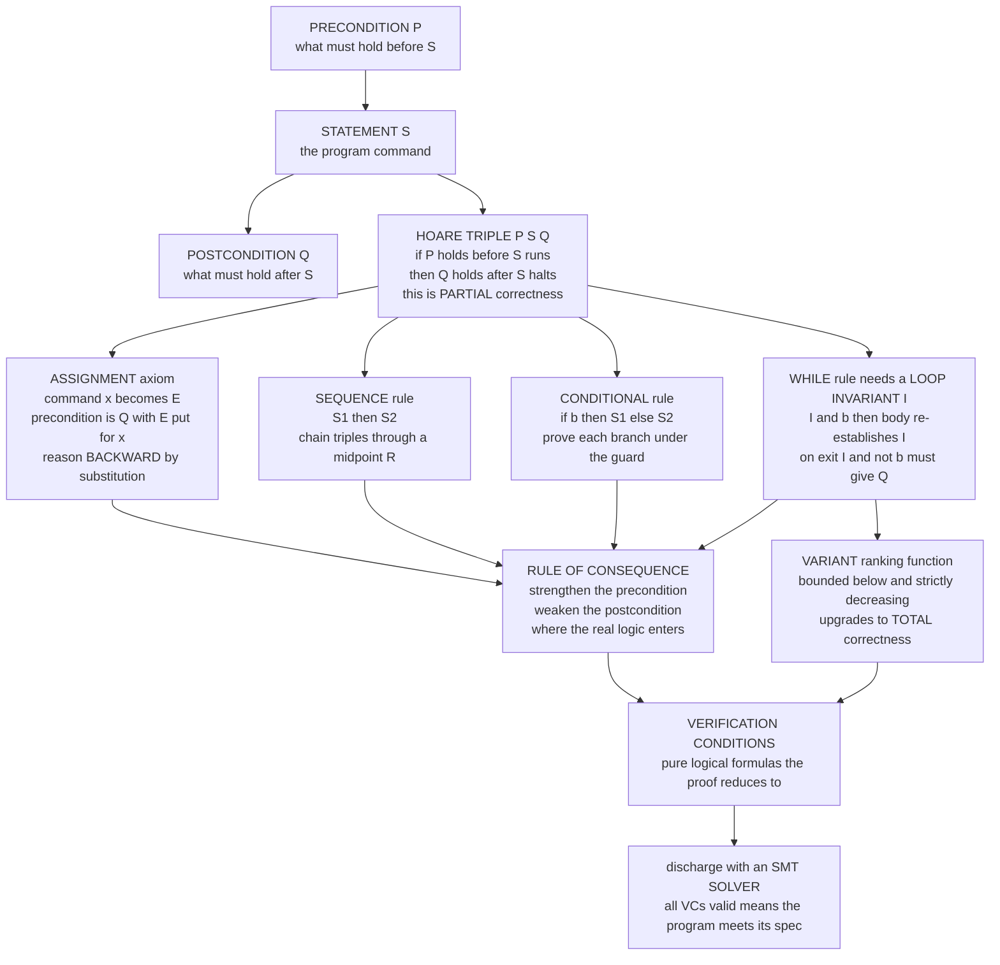

# 📐 Hoare Logic and Axiomatic Semantics

> [!abstract] TL;DR
> **Hoare logic** is the proof system that lets you *prove* an imperative program correct — statement by statement — instead of merely testing it. Its atom is the **Hoare triple** `{P} S {Q}`: *"if precondition `P` holds before running statement `S`, then postcondition `Q` holds after `S` finishes."* A handful of **compositional, syntax-directed inference rules** — the **assignment** axiom (backward substitution `{Q[E/x]} x:=E {Q}`), **sequence**, **conditional**, the **while** rule (which needs a hand-supplied **loop invariant**), and the **rule of consequence** (strengthen the pre, weaken the post) — reduce *"is this program correct?"* to *"is this logical formula valid?"* Those residual formulas are the **verification conditions**, discharged today by an **SMT solver**. Two flavours matter: **partial** correctness (`Q` holds *if* `S` halts) versus **total** correctness (it also *halts*). The framework is **sound** (every provable triple is true) and, by **Cook's theorem**, only **relatively complete** — the residual gap is inherited from arithmetic via Gödel, not a flaw in the rules. This is **axiomatic** semantics: a language's meaning *defined by* its Hoare rules, and the theoretical backbone of the entire **deductive verification** pillar — weakest preconditions, termination proofs, separation logic, design-by-contract, and tools like **Dafny**, **Why3**, and **Frama-C**.

---

## Intuition

**Analogy — the ironclad guarantee sticker.** Imagine a machine that ships with a warranty sticker welded to its side: *"IF you feed in a positive number, THEN the output is its exact square root."* You do not trust that sticker by pressing the button a thousand times and eyeballing the results — that is *testing*, and it only ever samples. You trust it because an engineer *proved* the sticker true, once and for all, by reasoning about the mechanism itself. Hoare logic is the **rulebook for proving such stickers**. Its central object is exactly a sticker written in logic: a **precondition** (what must be true going in) and a **postcondition** (what is promised coming out), wrapped around a piece of program.

The trick that makes it powerful is that you **never run the program**. Instead you *calculate with the guarantees themselves*. Every kind of statement — an assignment, a sequence, an `if`, a `while` — comes with its own rule for how it transforms the "before" fact into the "after" fact. You chain those rules together, exactly as you would chain algebra steps, until you have an airtight derivation that the whole program honours its sticker **for every input at once**. Where a test drives one truck across the bridge, a Hoare proof is the structural calculation that the bridge holds under every load. This note opens the **deductive program verification** section: the discipline of turning "we hope it's correct" into "we proved it's a theorem."

---

## How It Works

### Core Mechanics

**1. The Hoare triple is the unit of specification.** Written `{P} S {Q}`, it asserts: *if `P` holds in the state before executing statement `S`, and `S` terminates, then `Q` holds in the resulting state.* Here `P` (precondition) and `Q` (postcondition) are formulas of [[First_Order_Predicate_Logic|first-order predicate logic]] over the program's variables — `x > 0`, `r == x - q*y`, `∀k. 0 ≤ k < i → a[k] ≤ a[k+1]`. They describe **states**, not values. The triple is the atom from which every larger correctness claim is assembled.

**2. Two flavours of correctness live in the fine print.**
- **Partial correctness** `{P} S {Q}` — `Q` holds *provided `S` terminates*. A program that loops forever vacuously satisfies **every** partial triple, because it never reaches an "after."
- **Total correctness** `[P] S [Q]` — additionally *guarantees termination*. Partial correctness **plus** a termination argument (a **variant** / ranking function).

**3. The inference rules are compositional and syntax-directed** — one per construct, so a proof of a program is assembled from proofs of its parts, exactly the way [[Formal_Systems_and_Proof_Calculi|a formal proof calculus]] derives theorems.

- **Assignment axiom** `{Q[E/x]} x := E {Q}`. To make `Q` true *after* assigning `E` to `x`, require *before* that `Q` holds with `E` substituted for `x`. To achieve `{ ? } x := x+1 { x > 5 }`, substitute `x+1` into `x > 5`, giving precondition `x > 4`. You reason **backward**, from goal to requirement — the surprising-but-correct heart of the whole system, and the seed of the weakest-precondition calculus.
- **Sequence** — chain two triples through a shared intermediate assertion `R`: from `{P} S1 {R}` and `{R} S2 {Q}` derive `{P} S1;S2 {Q}`.
- **Conditional** — prove each branch under the guard's truth value: from `{P ∧ b} S1 {Q}` and `{P ∧ ¬b} S2 {Q}` derive `{P} if b then S1 else S2 {Q}`.
- **While** — a loop has unboundedly many iterations, so it needs a **loop invariant** `I`: an assertion true on entry and *preserved by every pass of the body*. From `{I ∧ b} S {I}` derive `{I} while b do S {I ∧ ¬b}`. Finding `I` is the one genuinely creative, un-mechanizable step.
- **Rule of consequence** — the glue between program and logic: you may **strengthen** the precondition and **weaken** the postcondition using logical implication. From `P ⟹ P'`, `{P'} S {Q'}`, and `Q' ⟹ Q`, derive `{P} S {Q}`. This is where the *actual mathematics* enters — those implications are discharged by a theorem prover.

**4. Termination via a variant.** The invariant buys *partial* correctness. To upgrade to *total*, supply a **variant**: an integer expression that is **bounded below** (say `≥ 0`) while the guard holds and **strictly decreases** every iteration. A strictly descending sequence in a well-founded order cannot fall forever, so the loop must stop. No algorithm finds variants in general — termination is undecidable ([[The_Halting_Problem_and_Undecidability|the halting problem]]); humans supply them, tools check them.

**5. From triples to a pipeline: verification conditions.** Deductive verification is mechanical bookkeeping around these rules. Annotate a program with pre/postconditions and loop invariants; apply the rules (in practice via **weakest preconditions**) to generate a set of purely logical **verification conditions** (VCs); discharge each VC with an **SMT solver**. The Hoare rules turn correctness into a finite pile of validity questions.

**6. Meta-properties.** **Soundness** — every provable triple is genuinely true against the [[Operational_Semantics|operational semantics]] (proved by induction over the execution rules). **Relative completeness** ([[Soundness_and_Completeness|Cook, 1978]]) — *given an oracle that decides validity in the assertion logic*, every true triple is provable. Unconditional completeness is impossible because the assertion language is arithmetic and, by [[Godels_Incompleteness_Theorems|Gödel]], no effective system captures all arithmetic truths. The incompleteness is **inherited from arithmetic**, not a defect of Hoare's rules.

**7. This is *axiomatic* semantics.** A language can be given meaning three ways: **operational** (*how it runs* — a trace), **denotational** (*what it is* — a mathematical object), or **axiomatic** (*what it guarantees* — the assertions it makes true). Defining a language *by* its Hoare rules is the axiomatic view, developed in depth in the PLT companion [[Axiomatic_Semantics_and_Hoare_Logic]]. Verification tools are built on it precisely because the thing you want to establish — correctness — *is already* the meaning. The historical arc runs **Floyd (1967)** → **Hoare (1969)**: Robert Floyd annotated flowcharts with assertions; Tony Hoare recast the idea as a clean, compositional logic of triples.

### Flow / Architecture



*The triple splits by the syntactic form of `S`: each construct has one rule, the consequence rule bridges program and logic, and the whole derivation collapses into verification conditions an SMT solver decides.*

---

## Key Concepts

### Secondary (explain to a curious beginner)

- A **Hoare triple** `{P} S {Q}` is a contract: *"if `P` is true before, then `Q` is true after."*
- A **precondition** is what you must promise going in; a **postcondition** is what the program promises coming out.
- A **loop invariant** is a fact that stays true every time around a loop — it is how you reason about a loop without unrolling it forever.
- You prove correctness by *calculating with the guarantees*, never by running the code on examples.

### Undergraduate (requires a CS background)

- The **assignment axiom** `{Q[E/x]} x := E {Q}` works **backward** by substitution — the single most counter-intuitive-then-obvious rule in the subject.
- **Partial vs total correctness**: partial ignores non-termination; total adds a **variant** (ranking function) proving the loop halts.
- The **rule of consequence** — strengthen the precondition, weaken the postcondition — is exactly where program logic meets ordinary logical implication (the part a solver actually reasons about).
- **Verification conditions**: applying the rules mechanically (via weakest preconditions) emits logical formulas whose validity *is* the program's correctness.
- **Axiomatic vs operational vs denotational** semantics — three lenses on one program; Hoare logic is the "what it guarantees" lens ([[Axiomatic_Semantics_and_Hoare_Logic]]).

### Graduate (system-level and foundational thinking)

- **Cook's relative completeness (1978)**: with an oracle for the assertion theory, all true triples are provable; the residual incompleteness is inherited from arithmetic via [[Godels_Incompleteness_Theorems|Gödel]], and rides on induction in [[Peano_Arithmetic_and_Formal_Number_Theory|Peano arithmetic]] for expressing invariants.
- **Soundness** is proved by structural induction over the operational semantics — the discipline that makes a proof *mean* something.
- **Weakest preconditions** turn the rules into an algorithmic predicate transformer `wp(S, Q)` — the VC-generation engine (opened in the sibling note on predicate transformers).
- **Separation logic** extends the framework to the mutable **heap** with the separating conjunction `P * Q` and the **frame rule**, enabling *local* reasoning about pointer programs — a whole sibling note.
- **Annotations are the human input**: the spec, the invariants, and the variants are supplied by the engineer; the tool only *checks*. This is the load-bearing asymmetry of deductive verification.

---

## Python Demo

We build a tiny **Hoare-logic verification-condition generator** over a mini imperative language (**assign, sequence, if, while**), then use it to verify a classic annotated program — **integer division by repeated subtraction** — and to *catch a bug* in a broken variant. The engine implements the **assignment axiom as AST-level backward substitution** and the **while rule with a supplied loop invariant**, emitting three VCs (*entry*, *preserved*, *exit*). We discharge each VC by **evaluating it on thousands of random states** generated with `numpy` (a stand-in for the SMT solver), showing the correct program's VCs are **all valid** while the buggy program **violates the "preserved" VC on every invariant state**. We then trace both programs and visualize the invariant holding (or breaking) along execution and the variant driving termination.

```python
# Hoare-logic verification-condition generator for a tiny imperative language.
# ASSIGNMENT axiom = backward AST substitution; WHILE rule uses a supplied INVARIANT.
# We VERIFY integer division by repeated subtraction, then CATCH a bug, discharging
# each verification condition by random-state testing (a proxy for an SMT solver).
# numpy + matplotlib.

import ast, copy
import numpy as np
import matplotlib.pyplot as plt

# ---------- Assertion language: the assignment axiom IS substitution ----------
def substitute(pred, var, expr):
    """Return `pred` with every occurrence of `var` replaced by expression `expr`."""
    tree = ast.parse(pred, mode="eval").body
    repl = ast.parse(f"({expr})", mode="eval").body
    class Sub(ast.NodeTransformer):
        def visit_Name(self, node):
            return copy.deepcopy(repl) if node.id == var else node
    return ast.unparse(ast.fix_missing_locations(Sub().visit(tree)))

def holds(pred, state):
    """Evaluate a predicate string on one concrete integer state."""
    return bool(eval(pred, {"__builtins__": {}}, dict(state)))

# ---------- Abstract syntax of the mini language ----------
class Assign:
    def __init__(self, var, expr): self.var, self.expr = var, expr
class Seq:
    def __init__(self, cmds): self.cmds = cmds
class If:
    def __init__(self, cond, then, els): self.cond, self.then, self.els = cond, then, els
class While:
    def __init__(self, cond, inv, body): self.cond, self.inv, self.body = cond, inv, body

# ---------- wp calculator: applies the Hoare RULES, collecting verification conditions ----------
def wp(cmd, Q, vcs):
    if isinstance(cmd, Assign):                       # ASSIGNMENT: wp(x:=E, Q) = Q[E/x]
        return substitute(Q, cmd.var, cmd.expr)
    if isinstance(cmd, Seq):                          # SEQUENCE: compose right-to-left
        for c in reversed(cmd.cmds):
            Q = wp(c, Q, vcs)
        return Q
    if isinstance(cmd, If):                           # CONDITIONAL: split on the guard
        wt, we = wp(cmd.then, Q, vcs), wp(cmd.els, Q, vcs)
        return f"(({cmd.cond}) and ({wt})) or ((not ({cmd.cond})) and ({we}))"
    if isinstance(cmd, While):                        # WHILE: consume the supplied INVARIANT
        I, b = cmd.inv, cmd.cond
        wbody = wp(cmd.body, I, vcs)
        vcs.append(("preserved", f"({I}) and ({b})", wbody))          # I and b  =>  wp(body, I)
        vcs.append(("exit",      f"({I}) and (not ({b}))", Q))        # I and not b  =>  Q
        return I                                                       # wp of the loop is the invariant
    raise TypeError(cmd)

# ---------- Concrete interpreter (to trace real executions) ----------
def run_trace(incr, x0, y0, max_steps=10_000):
    """Integer division q,r of x0 by y0; `incr` is how much q gains per pass (1=correct, 2=buggy)."""
    q, r, hist, step = 0, x0, [], 0
    hist.append((0, q, r))
    while r >= y0 and step < max_steps:
        r = r - y0
        q = q + incr
        step += 1
        hist.append((step, q, r))
    return hist

# ================= 1. THE PROGRAM, ITS SPEC, AND ITS ANNOTATIONS =================
#   q := 0; r := x; while r >= y do (r := r - y; q := q + INCR)
INV  = "x == q*y + r and r >= 0"          # loop invariant: quotient/remainder relation
PRE  = "x >= 0 and y > 0"
POST = "x == q*y + r and 0 <= r and r < y"

def division_program(incr):
    return Seq([
        Assign("q", "0"),
        Assign("r", "x"),
        While("r >= y", inv=INV,
              body=Seq([Assign("r", "r - y"),
                        Assign("q", f"q + {incr}")])),
    ])

# ================= 2. GENERATE VERIFICATION CONDITIONS FOR CORRECT + BUGGY =================
def make_vcs(program):
    vcs = []
    entry_wp = wp(program, POST, vcs)                       # thread wp backward through the program
    vcs.insert(0, ("entry", PRE, entry_wp))                # entry: PRE => wp(program, POST)
    return vcs

vcs_correct = make_vcs(division_program(1))
vcs_buggy   = make_vcs(division_program(2))                # bug: q gains 2 per pass, not 1

print("=== Verification conditions (correct program) ===")
for name, ante, cons in vcs_correct:
    print(f"\n[{name}]  assume: {ante}\n         prove : {cons}")

# ================= 3. DISCHARGE EACH VC BY RANDOM-STATE TESTING (SMT proxy) =================
rng = np.random.default_rng(0)
def sample_pool(n):
    """Mostly states ON the invariant manifold x==q*y+r (r>=0), plus arbitrary states."""
    states = []
    for _ in range(n):
        y = int(rng.integers(1, 12)); q = int(rng.integers(0, 20)); r = int(rng.integers(0, 40))
        states.append({"x": q*y + r, "y": y, "q": q, "r": r})     # sits on the invariant
    for _ in range(n // 4):
        states.append({"x": int(rng.integers(0, 500)), "y": int(rng.integers(1, 12)),
                       "q": int(rng.integers(-5, 25)), "r": int(rng.integers(-5, 45))})
    return states

pool = sample_pool(20_000)

def discharge(vcs):
    fracs = {}
    for name, ante, cons in vcs:
        rel = [s for s in pool if holds(ante, s)]            # states satisfying the assumption
        frac = np.mean([holds(cons, s) for s in rel]) if rel else 1.0
        fracs[name] = float(frac)
    return fracs

frac_correct = discharge(vcs_correct)
frac_buggy   = discharge(vcs_buggy)
print("\n=== Fraction of relevant states where each VC holds ===")
for name in ["entry", "preserved", "exit"]:
    print(f"  {name:10s}  correct: {frac_correct[name]:.2%}   buggy: {frac_buggy[name]:.2%}")

# ================= 4. TRACE BOTH PROGRAMS ON A CONCRETE INPUT =================
X0, Y0 = 17, 5
tc = run_trace(1, X0, Y0)          # correct
tb = run_trace(2, X0, Y0)          # buggy
def residual(hist):  return [X0 - (q*Y0 + r) for _, q, r in hist]   # 0 iff invariant's equation holds
def inv_ok(hist):    return [1 if (X0 == q*Y0 + r and r >= 0) else 0 for _, q, r in hist]
def variant(hist):   return [r for _, _, r in hist]                 # r is the ranking function

# ================= 5. VISUALIZE THE PROOF =================
fig, ax = plt.subplots(2, 2, figsize=(13, 9))
names = ["entry", "preserved", "exit"]
xi, w = np.arange(len(names)), 0.38

# (a) VC validity: correct vs buggy -- the buggy program violates "preserved"
b1 = ax[0, 0].bar(xi - w/2, [frac_correct[n] for n in names], w, color="#4C72B0", label="correct program")
b2 = ax[0, 0].bar(xi + w/2, [frac_buggy[n]   for n in names], w, color="#C44E52", label="buggy program")
ax[0, 0].set_xticks(xi); ax[0, 0].set_xticklabels(names)
ax[0, 0].set_ylim(0, 1.15); ax[0, 0].axhline(1.0, ls="--", color="gray")
ax[0, 0].set_title("Verification conditions: valid (1.0) vs violated")
ax[0, 0].set_ylabel("fraction of relevant states passing"); ax[0, 0].legend()
for bars in (b1, b2):
    for bar in bars:
        ax[0, 0].text(bar.get_x() + bar.get_width()/2, bar.get_height() + 0.03,
                      f"{bar.get_height():.0%}", ha="center", fontsize=8, fontweight="bold")

# (b) invariant residual x-(q*y+r) along the trace: flat 0 (correct) vs drifting (buggy)
ax[0, 1].plot(residual(tc), "o-", color="#4C72B0", lw=2, label="correct  q += 1")
ax[0, 1].plot(residual(tb), "s-", color="#C44E52", lw=2, label="buggy  q += 2")
ax[0, 1].axhline(0, ls="--", color="gray")
ax[0, 1].set_title("Invariant equation residual  x - (q*y + r)  along execution")
ax[0, 1].set_xlabel("loop iteration"); ax[0, 1].set_ylabel("residual (0 = invariant holds)")
ax[0, 1].legend()

# (c) variant r strictly decreases to below y -> loop terminates (total correctness)
ax[1, 0].plot(variant(tc), "^-", color="#55A868", lw=2, label="variant  r")
ax[1, 0].axhline(Y0, ls=":", color="crimson", label=f"guard threshold y = {Y0}")
ax[1, 0].axhline(0, ls="--", color="gray", label="lower bound 0")
ax[1, 0].set_title("Variant r strictly decreases -> the loop terminates")
ax[1, 0].set_xlabel("loop iteration"); ax[1, 0].set_ylabel("ranking function r"); ax[1, 0].legend()

# (d) does the loop invariant hold at each step? correct: always; buggy: breaks after step 0
ax[1, 1].step(range(len(inv_ok(tc))), inv_ok(tc), where="mid", lw=2.5, color="#4C72B0", label="correct")
ax[1, 1].step(range(len(inv_ok(tb))), inv_ok(tb), where="mid", lw=2.5, color="#C44E52", label="buggy")
ax[1, 1].set_ylim(-0.15, 1.15); ax[1, 1].set_yticks([0, 1]); ax[1, 1].set_yticklabels(["broken", "holds"])
ax[1, 1].set_title("Loop invariant along the trace")
ax[1, 1].set_xlabel("loop iteration"); ax[1, 1].legend()

fig.suptitle("Hoare-logic VC generation: proving integer division correct, catching a bug", fontsize=14)
fig.tight_layout()
plt.savefig("hoare_division_vc.png", dpi=120)
print("\nSaved figure to hoare_division_vc.png")
```

**What it shows.** The `wp` engine threads **backward** from the postcondition through the two initial assignments and the loop, emitting three verification conditions: *entry* (`PRE ⟹` invariant on entry), *preserved* (`I ∧ guard ⟹ wp(body, I)`), and *exit* (`I ∧ ¬guard ⟹ POST`). For the **correct** program all three hold on 100% of relevant states; for the **buggy** program (`q += 2`), the *preserved* VC is violated on **every** invariant state — the drift shows up as a growing residual `x - (q*y + r)` in the top-right panel and as the invariant flipping to "broken" in the bottom-right. The bottom-left panel shows the **variant `r`** strictly decreasing below the guard `y`, the termination half of *total* correctness. A production tool (Dafny, Why3) replaces our 20,000-state *test* with an SMT *proof* that quantifies over **all** states at once — but the VCs it discharges are exactly the ones generated here.

---

## Real-World Applications

> **Dafny (Microsoft Research).** Dafny is a verification-oriented language whose `requires` / `ensures` / `invariant` / `decreases` clauses are lifted **directly** from Hoare logic: they are the precondition, postcondition, loop invariant, and variant of this note. Its compiler generates verification conditions by weakest-precondition reasoning and ships them to the **Z3** SMT solver. Amazon has used Dafny to verify authorization and storage components, and the AWS Encryption SDK.

- **Frama-C / ACSL (C) and SPARK/Ada.** Contract-based verification for safety-critical C and Ada: engineers annotate functions with ACSL or SPARK pre/postconditions and loop invariants, and the toolchain discharges the resulting VCs. Deployed in avionics, rail, and nuclear software under DO-178C and EN 50128.
- **Why3.** A verification *platform* whose language WhyML is a direct implementation of weakest-precondition VC generation, dispatching to many provers; it is the backend beneath Frama-C and SPARK.
- **Design by contract.** Eiffel pioneered `require` / `ensure` / `invariant` as first-class constructs; the idea survives everywhere as `assert`, contract libraries, and property-based specs — Hoare triples as an everyday engineering discipline even without a solver.
- **Separation logic in industry.** Meta's **Infer** analyzer uses separation logic (via bi-abduction) to flag null-dereference and memory bugs across millions of lines at commit time; the **Iris** framework mechanizes concurrent separation logic in Coq. These extend the plain Hoare rules to the mutable heap — the subject of a sibling note in this section.
- **Verified kernels and compilers.** seL4 and CompCert use Hoare-style refinement and axiomatic reasoning as part of end-to-end machine-checked correctness proofs.

---

## Common Pitfalls

- **Misreading the assignment axiom's direction.** Beginners expect forward reasoning and write `{x > 5} x := x+1 {x > 5}`. The axiom substitutes into the **post**condition: the weakest precondition of `x := x+1` for `x > 5` is `x + 1 > 5`, i.e. `x > 4`. Reason backward, not forward.
- **A wrong or too-weak loop invariant.** If `I` is not actually preserved, the *preserved* VC fails (as with the demo's `q += 2` bug). If it is preserved but too weak, the *exit* VC `I ∧ ¬b ⟹ Q` fails because it does not pin down enough. The invariant must be *just strong enough* to imply the postcondition yet still hold on entry — the hardest, most human step, and the one no tool finds for you in general.
- **Confusing partial and total correctness.** Partial correctness silently "succeeds" on infinite loops — `Q` holds *if* the loop halts. A triple that looks proven says nothing about a program that never terminates. Always ask whether you supplied a **variant**, or you have only partial correctness.
- **Off-by-one invariants at the boundary.** The invariant must survive the *final* iteration together with the exit test. Get the bound wrong (e.g. `r >= 0` vs `r > 0`) and the exit VC collapses even though the loop body is fine.
- **Aliasing without separation logic.** Plain Hoare logic assumes variables are independent boxes; on pointer/heap code, updating `*p` may silently change `*q` when they alias. Applying classic rules to heap-mutating programs "proves" false things — reach for **separation logic** instead.
- **Trusting the spec blindly.** Verification proves *the code meets the contract* — never that the contract is what you wanted. A vacuous precondition (`false`) or a trivial postcondition (`true`) "verifies" anything. Garbage spec in, garbage guarantee out.
- **Expecting unconditional completeness.** By **Cook's theorem** Hoare logic is only *relatively* complete; the gap is inherited from arithmetic ([[Godels_Incompleteness_Theorems|Gödel]]). In practice the "assertion oracle" is an SMT solver, which is powerful but necessarily incomplete on undecidable fragments — a valid triple can still defeat the solver.

---

## Related Concepts

- [[Formal_Methods_Overview]] — the vault entry point; this note opens its **deductive verification** pillar (pillar 3 of 6).
- [[Axiomatic_Semantics_and_Hoare_Logic]] — the **PLT semantics-theory companion**: the same logic viewed as one of the three semantic styles (operational / denotational / axiomatic), with weakest preconditions and separation logic in depth.
- [[Operational_Semantics]] — the "how it runs" trace semantics that Hoare logic is proved *sound* against.
- [[Denotational_Semantics]] — the "what it is" semantics; predicate transformers are its axiomatic face.
- [[First_Order_Predicate_Logic]] — the assertion language of pre/postconditions and invariants.
- [[Formal_Systems_and_Proof_Calculi]] — Hoare logic *is* a proof calculus; a verified program is a proof tree built from axioms and rules.
- [[Soundness_and_Completeness]] — the exact meanings behind "every provable triple is true" and Cook's *relative* completeness.
- [[Godels_Incompleteness_Theorems]] — why no effective system captures all arithmetic truths; the origin of Hoare logic's merely relative completeness.
- [[Peano_Arithmetic_and_Formal_Number_Theory]] — the arithmetic and induction in which loop invariants and variants are expressed and proved.
- [[The_Halting_Problem_and_Undecidability]] — why no algorithm supplies loop variants in general; verification must lean on human insight plus incomplete solvers.
- [[Decidability_and_Recognizability]] — the decidability line that bounds what any automatic VC discharger can achieve.
- [[The_Class_NP_and_Verification]] — the complementary "checking a certificate" sense of verification, and the NP-hardness SMT engines confront.
- [[State_Based_Modeling_and_Invariants]] — invariants as a specification technique, the sibling-vault view of the same idea.
- [[Refinement_and_Correctness_by_Construction]] — building code from a spec so it is correct by construction, the top-down counterpart to bottom-up triple proofs.
- [[Formal_Specification_Languages]] — where the preconditions and postconditions come from before the rules discharge them.
- [[Binary_Search]] — a canonical DSA algorithm whose correctness argument *is* a loop invariant; a concrete place to apply this machinery.

*(Section siblings referenced in prose, built out next: `Weakest_Preconditions_and_Predicate_Transformers`, `Loop_Invariants_and_Termination_Proofs`, `Separation_Logic_and_Heap_Reasoning`, `Deductive_Verification_Tools`.)*

---

## Review Questions

### Secondary

1. A vending machine's manual says: *"If you insert exact change and press a button, then after a few seconds the chosen drink is dispensed."* Rewrite this as a Hoare triple `{P} S {Q}`, naming `P`, `S`, and `Q`. In one sentence each, explain the difference between *partial* and *total* correctness for this machine.
2. What is a **loop invariant**, and why does it let you reason about a loop without unrolling it? Give a fact that stays true on every pass of a loop that adds `1..n`.
3. Why does a Hoare-logic *proof* establish correctness for every input at once, where a thousand tests cannot?

### Undergraduate

1. Compute the weakest precondition of `x := x * 2` for the postcondition `x >= 10` using the assignment axiom, and explain why substituting into the *post*condition (backward reasoning) gives the right answer where forward reasoning fails. Then, for `while i < n do i := i + 1`, propose an invariant **and** a variant that together prove *total* correctness.
2. For the integer-division program in the demo (`q:=0; r:=x; while r>=y do (r:=r-y; q:=q+1)`), state the three verification conditions (*entry*, *preserved*, *exit*) that the while rule and the invariant `x == q*y + r ∧ r ≥ 0` generate, and explain which one the `q += 2` bug violates and why.
3. Distinguish the three semantic styles — operational, denotational, axiomatic — and explain why verification tools are built on the *axiomatic* one.

### Graduate

1. Hoare logic is **sound** but only **relatively complete** (Cook, 1978). (a) Precisely what does "relative" assume? (b) Why is unconditional completeness impossible, and which theorem of mathematical logic is ultimately responsible? (c) In a real tool, what plays the role of the assumed "assertion oracle," and why is it still incomplete in practice?
2. Explain why plain Hoare logic is *unsound in practice* for heap-mutating programs with aliasing, and how separation logic's **frame rule** restores *local* reasoning. What does the separating conjunction `P * Q` assert that ordinary conjunction does not?
3. Deductive verification reduces correctness to discharging verification conditions. Sketch the full pipeline from an annotated program to a solver verdict, identifying at each stage (a) what is human-supplied, (b) what is mechanical, and (c) where undecidability forces a compromise.

---

## Sources

- C. A. R. Hoare, "An Axiomatic Basis for Computer Programming," *Communications of the ACM* 12(10), 1969 — the founding paper; introduces the Hoare triple and the inference rules. <https://dl.acm.org/doi/10.1145/363235.363259>
- R. W. Floyd, "Assigning Meanings to Programs," *Proceedings of Symposia in Applied Mathematics* 19, 1967 — the flowchart-assertion method Hoare logic was built upon (the "Floyd" of Floyd-Hoare).
- S. A. Cook, "Soundness and Completeness of an Axiom System for Program Verification," *SIAM Journal on Computing* 7(1), 1978 — the relative-completeness theorem.
- G. Winskel, *The Formal Semantics of Programming Languages*, MIT Press, 1993 — operational, denotational, and axiomatic semantics with soundness of Hoare logic, in one text.
- K. R. Apt, F. S. de Boer, E.-R. Olderog, *Verification of Sequential and Concurrent Programs*, 3rd ed., Springer, 2009 — the definitive modern treatment of Hoare-style proof systems, soundness/completeness, and total correctness.

---

#formal-methods #hoare-logic #axiomatic-semantics #program-verification #loop-invariants
