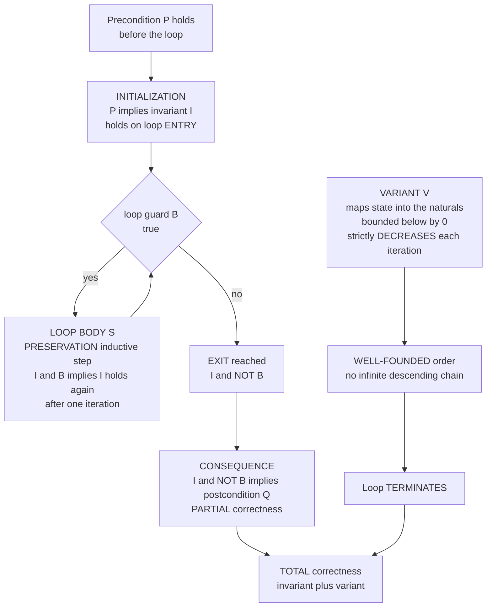

# 🪜 Loop Invariants and Termination Proofs

> [!abstract] TL;DR
> A loop can run **any** number of times, so you cannot verify it case-by-case. Instead you find a **loop invariant** — a predicate `I` that is **true every time execution reaches the top of the loop** — and prove three things: it **holds on entry** (initialization), it is **preserved by the body** whenever the guard is true (the inductive step), and `I ∧ ¬guard` **implies the postcondition** on exit. Those three obligations are exactly the **Hoare `while` rule**, and together they prove **partial correctness** — *correct if it halts*. To prove it actually **halts**, add a **variant** (a **ranking function**): an expression mapping the state into a **well-founded order** (usually the naturals) that is **bounded below** and **strictly decreases every iteration**. A well-founded order has no infinite descending chain, so the loop must stop. **Invariant + variant = total correctness.** Finding the invariant is the creative, **undecidable-in-general** heart of the whole enterprise — and the frontier that abstract interpretation, Houdini, Daikon, and ML-guided synthesis are racing to automate.

---

## Intuition

**Analogy — conquering an infinitely tall ladder you can never fully inspect.** You are handed a ladder that vanishes into the clouds; you can never climb every rung to check it. Yet you can *prove* you have conquered it by establishing just two facts. **First**, you are safely on the bottom rung (the property holds at the start). **Second**, whenever you are safely on *any* rung, you can step safely to the next one (each step preserves safety). By induction, you are safe on **every** rung, no matter how high — without ever inspecting them one by one. That "you are safely on a rung" property is the **loop invariant**: a fact that stays true every single time around the loop, however many iterations there turn out to be.

But safety alone does not tell you the climb ever *ends* — you could be safely climbing forever. So you add one more thing: a **"distance to the top" measure that strictly shrinks with every rung** and can never drop below the ground. A quantity that decreases by at least one each step, yet cannot go negative, can only decrease finitely often — so the climb **must terminate**. That shrinking measure is the **variant** (the **ranking function**). Invariant tells you *nothing bad happens*; variant tells you *it finishes*. Put them together and the loop is **totally correct**.

---

## How It Works

### Core Mechanics

1. **Why loops need a special trick.** A straight-line program has finitely many steps you can reason through directly. A `while` loop has an execution length that depends on the input and may be **unbounded** — you cannot enumerate iterations. The escape is to find one statement that is true *at the loop head on every pass*, so a single argument covers all passes at once. This is **Floyd's inductive-assertion method** (1967), formalized as **Hoare's `while` rule** (1969).

2. **The three proof obligations of an invariant `I`.** For the loop `while B do S` sitting between precondition `P` and postcondition `Q`:
   - **Initialization** — the code before the loop establishes `I` from `P`: `P ⟹ I` at the loop head.
   - **Preservation (the inductive step)** — one execution of the body from any state where `I ∧ B` holds re-establishes `I`: the Hoare triple `{I ∧ B} S {I}`. This is what makes `I` an *invariant* rather than just a one-time fact.
   - **Consequence on exit** — when the loop exits, the guard is false, and the invariant plus that fact must be **strong enough** to give the goal: `I ∧ ¬B ⟹ Q`.
   All three are non-negotiable; the `while` rule is precisely their conjunction.

3. **This proves only PARTIAL correctness.** The invariant argument shows: *if the loop terminates, the postcondition holds.* It says nothing about whether the loop terminates at all — an invariant is perfectly happy to be preserved forever by a loop that never exits.

4. **The variant closes the gap — TERMINATION.** Choose an expression `V` over the program state (the **variant** or **ranking function**) such that, whenever the guard is true, executing the body **strictly decreases** `V` and `V` is **bounded below** (typically `V ≥ 0`, ranging over the naturals). Because the target order is **well-founded** — it admits **no infinite strictly-descending chain** — `V` can only decrease finitely many times, so the loop must reach the guard-false state. Nested loops need a **lexicographic** tuple or an **ordinal** variant, still into a well-founded order.

5. **Invariant + variant = TOTAL correctness.** Partial correctness (from `I`) plus guaranteed termination (from `V`) gives *total* correctness: the program halts **and** delivers `Q`. The remaining difficulty — and it is the whole difficulty — is that **discovering** `I` and `V` is a creative act with no complete algorithm (see the automation frontier and the halting-problem limit below).

### Flow / Architecture



The left spine is the **partial-correctness** loop (initialization, the preservation cycle, and the exit consequence — the three obligations of the `while` rule). The right spine is the **termination** argument bolted on via the variant. Only when both meet does the loop earn the label **totally correct**.

---

## Key Concepts

### Secondary (intuitive)
- **Loop invariant** — a fact that is true *every* time you arrive back at the top of the loop, no matter how many times you have gone around. Like "I am safely on a rung."
- **The two-step ladder proof** — true at the start, and each step keeps it true, therefore true forever (that is just **induction**).
- **Variant** — a countdown that gets strictly smaller each pass and can never go below zero, so the loop cannot run forever.
- **Partial vs total** — the invariant says "*if* it stops, the answer is right"; the variant says "it *does* stop." You need both.

### Undergraduate (formal)
- **Hoare `while` rule.** From `{I ∧ B} S {I}` infer `{I} while B do S {I ∧ ¬B}`. The user supplies `I`; the three side conditions are `P ⟹ I`, the premise triple, and `I ∧ ¬B ⟹ Q`.
- **Inductive assertion (Floyd).** Annotate the loop head with `I`; verification reduces to checking the local triples — the loop's global correctness follows by induction on iteration count.
- **Ranking function into a well-founded set.** `V : State → (W, ≺)` with `≺` well-founded, such that `I ∧ B ⟹ V(after body) ≺ V(before body)`. The naturals under `<` are the canonical choice; `V ≥ 0` is the boundedness condition.
- **Too weak vs too strong.** *Too weak*: `I` is preserved but `I ∧ ¬B` fails to imply `Q`. *Too strong*: `I` implies `Q` but the body does not preserve `I`. The right invariant threads the needle.
- **Verification conditions.** Discharging the obligations produces logical formulas (VCs) handed to a solver — see [[Logic_for_Program_Verification]].

### Graduate (deep)
- **Well-foundedness and ordinal variants.** Termination needs a well-founded order, not merely a lower bound. Nested/mutually-recursive loops use **lexicographic** tuples of naturals or **ordinal** rankings; the machinery of transfinite descent connects to **ordinal analysis** of proof strength (Goodstein sequences, the Hydra game — decreasing ordinals below `ε₀` that a naive natural variant cannot capture).
- **Invariant inference is undecidable in general.** By reduction from the halting problem, no algorithm produces adequate invariants for *all* programs; practical tools are **semi-algorithms**. **Abstract interpretation** (Cousot & Cousot, 1977) computes *sound over-approximating* invariants as least fixed points in an abstract lattice (intervals, octagons, polyhedra), trading precision for guaranteed termination of the *analysis* via widening.
- **Guess-and-check families.** **Houdini** and **predicate abstraction** search a candidate space for a maximal conjunction that is inductive; **Daikon** *detects* likely invariants dynamically from runs (unsound, but great hints); **Craig interpolation** and **IC3/PDR** synthesize inductive strengthenings from spurious counterexamples; ML/LLM-guided guessing proposes candidates a checker then verifies.
- **Termination as its own research program.** Automated tools (Terminator, T2, AProVE) synthesize ranking functions via **disjunctive well-founded relations** (Podelski–Rybalchenko), transition invariants, and size-change analysis — reducing termination to a sequence of safety (invariant) checks.

---

## Python Demo

Two experiments on **Euclid's gcd**, the archetypal loop, using the same instrumented run. **(a) INVARIANT** — we track the *correct* invariant `gcd(x, y) == gcd(a, b)` and a *subtly wrong* one, `x * y == a * b` (a tempting confusion with the identity `gcd·lcm = a·b`), checking both **before the loop and after every iteration** across many inputs. The correct invariant holds on **100%** of iterations (it is inductive); the wrong one is true **on entry** but the body immediately breaks it — a live demonstration of a failed *preservation* step. **(b) VARIANT** — we track the ranking function `V = y`, plot it against iteration for several inputs (strictly decreasing, monotone down to the well-founded bound `0`), and contrast a **non-terminating** loop whose variant never decreases.

```python
# Loop invariants & termination on Euclid's gcd:
#  (a) INVARIANT: check a CORRECT invariant (always holds = inductive) vs a
#      subtly WRONG one (true on entry, NOT preserved by the body);
#  (b) VARIANT: a ranking function bounded below by 0 that strictly DECREASES
#      each iteration => termination; contrast a loop whose variant never drops.
import numpy as np
import matplotlib.pyplot as plt
from math import gcd as math_gcd

# Loop:  while y != 0:  (x, y) = (y, x % y)   ->  returns x = gcd(a, b)
#   CORRECT invariant  I_ok :  gcd(x, y) == gcd(a, b)   (entry + preserved + => post)
#   WRONG   invariant  I_bad:  x * y == a * b           (true on ENTRY, body breaks it)
#   VARIANT             V    :  y   (bounded below by 0, strictly decreasing)
def gcd_trace(a, b):
    x, y = a, b
    g = math_gcd(a, b)
    ok, bad, variant = [], [], []
    # record state at the loop HEAD on entry, then after EVERY iteration
    ok.append(math_gcd(x, y) == g); bad.append(x * y == a * b); variant.append(y)
    while y != 0:
        x, y = y, x % y
        ok.append(math_gcd(x, y) == g)   # invariant re-checked after the body runs
        bad.append(x * y == a * b)
        variant.append(y)
    return np.array(ok), np.array(bad), np.array(variant)

inputs = [(48, 36), (1071, 462), (17, 5), (270, 192), (100, 96), (13, 21)]
traces = [gcd_trace(a, b) for (a, b) in inputs]
maxlen = max(len(t[0]) for t in traces)

# fraction of inputs whose invariant still holds at iteration index k
ok_frac  = np.array([np.mean([t[0][k] for t in traces if k < len(t[0])]) for k in range(maxlen)])
bad_frac = np.array([np.mean([t[1][k] for t in traces if k < len(t[1])]) for k in range(maxlen)])

print("Euclid's gcd -- invariant instrumentation (True = holds on EVERY iteration)")
print("-" * 68)
for (a, b), t in zip(inputs, traces):
    print(f"gcd({a:>4},{b:>4}):  correct invariant = {bool(t[0].all())!s:>5}   "
          f"wrong invariant = {bool(t[1].all())!s:>5}   variant = {list(t[2])}")

# a NON-terminating loop: while x > 0: x = x   (state frozen)
#   candidate 'variant' = x never decreases -> no ranking function -> loop hangs
nonterm = np.full(12, 6)   # constant at 6 for 12 (capped) steps; never reaches the bound 0

# ---------------- plots ----------------
fig, ax = plt.subplots(1, 2, figsize=(15, 6))

# (a) invariant holds per iteration
it = np.arange(maxlen)
ax[0].plot(it, ok_frac,  'o-', color='#16a34a', lw=2, label='CORRECT  gcd(x,y) == gcd(a,b)')
ax[0].plot(it, bad_frac, 's--', color='#dc2626', lw=2, label='WRONG    x*y == a*b')
ax[0].axhline(1.0, color='gray', ls=':', lw=1)
ax[0].set_ylim(-0.08, 1.15)
ax[0].set_xlabel('loop iteration   (0 = loop head on ENTRY)')
ax[0].set_ylabel('fraction of inputs where the invariant holds')
ax[0].set_title('(a) INVARIANT checked every iteration\n'
                'correct = always 1 (inductive) | wrong = true on entry, NOT preserved')
ax[0].legend(loc='center right', fontsize=9)

# (b) variant strictly decreasing to the well-founded bound
colors = plt.cm.viridis(np.linspace(0.0, 0.85, len(inputs)))
for (a, b), t, c in zip(inputs, traces, colors):
    v = t[2]
    ax[1].plot(np.arange(len(v)), v, 'o-', color=c, lw=1.8, label=f'gcd({a},{b})  V=y')
ax[1].plot(np.arange(len(nonterm)), nonterm, 'x--', color='#dc2626', lw=2.2,
           label='non-terminating: V constant')
ax[1].axhline(0, color='#16a34a', ls='-', lw=1.6)
ax[1].text(0.3, 0.5, 'well-founded lower bound  V = 0', color='#16a34a', fontsize=9)
ax[1].set_xlabel('loop iteration')
ax[1].set_ylabel('variant / ranking function value')
ax[1].set_title('(b) VARIANT strictly DECREASES to the bound => TERMINATION\n'
                'flat red = variant never decreases => loop may run forever')
ax[1].legend(fontsize=8, loc='upper right')

plt.tight_layout()
plt.savefig('loop_invariants_and_termination.png', dpi=120)
plt.show()
```

Panel **(a)**: the green line pins to `1.0` at every iteration — the correct invariant is genuinely **inductive**. The red line starts at `1.0` (the wrong invariant *is* true on entry) then collapses to `0.0` the moment the body runs: `x * y == a * b` **fails preservation**, so it is not an invariant at all — precisely the trap of a plausible-but-non-inductive guess. Panel **(b)**: every gcd run's variant `y` marches **strictly down to `0`** (the well-founded floor), certifying termination in finitely many steps; the flat red trace is a loop whose variant never decreases — no ranking function exists, and it can run forever.

---

## Real-World Applications

> **Example — SPARK/Ada in avionics and rail.** Safety-critical vendors (e.g. Airbus flight-control code, the Muen separation kernel, NVIDIA firmware) write **loop invariants** and **loop variants** as annotations (`pragma Loop_Invariant`, `pragma Loop_Variant`) that the **GNATprove** tool turns into verification conditions and discharges with SMT solvers. The `Loop_Variant` pragma *literally* asks the programmer for a quantity that strictly increases or decreases toward a bound — a direct, industrial instance of the ranking-function argument, mandated because "no unbounded loop may run forever" is a certification requirement (DO-178C).

- **Auto-active verifiers (Dafny, Frama-C/ACSL, Why3, Viper).** Every non-trivial loop must carry an `invariant` clause (and a `decreases` clause for termination); the tool proves the three `while`-rule obligations automatically once the human supplies the creative annotation. Amazon, Microsoft, and ConsenSys use these on production code and smart contracts.
- **Proof assistants for systems software.** The **seL4** microkernel and **CompCert** C compiler carry machine-checked proofs whose loop reasoning rests on explicit invariants and well-founded `Fixpoint`/`Function` termination measures in Coq.
- **Invariant *inference* in compilers and analyzers.** **Abstract interpretation** engines (Astrée, which certified Airbus A340/A380 control code free of runtime errors; Facebook/Meta's Infer) compute loop invariants *automatically* as fixed points, no annotation required — the automation frontier in shipping form.
- **Dynamic invariant detection.** **Daikon** observes program runs and reports likely invariants; engineers use its guesses as starting candidates for the (sound) static proof.

---

## Common Pitfalls

- **Satisfying only two of the three obligations.** A valid loop invariant must be **all** of: (1) **true on entry**, (2) **preserved by the body** (inductive), and (3) **strong enough that `I ∧ ¬guard ⟹ postcondition`**. A predicate that is inductive but too weak to imply `Q` is useless; one that implies `Q` but is not preserved is not an invariant. In the demo, `x*y == a*b` passes (1) and fails (2); a classic *too-weak* miss passes (1) and (2) but fails (3).
- **Confusing "true at some point" with "invariant."** The invariant must hold at the loop **head on every pass**, including the moment of exit. A fact that is true only *after* the loop, or only on the first iteration, is not an invariant. Beginners often assert the *postcondition* as the invariant and then cannot preserve it.
- **Too-weak vs too-strong.** Strengthening an invariant to reach the postcondition can break preservation; weakening it to stay preserved can lose the postcondition. Finding the sweet spot is the **hard, creative core** of deductive verification — and exactly why it is the **automation frontier** (abstract interpretation, Houdini, Daikon, interpolation, ML-guided synthesis).
- **Proving preservation but forgetting termination.** An invariant delivers only **partial correctness** — *correct if it halts*. Termination is a **separate** obligation requiring a **variant / ranking function** into a **well-founded** order. Shipping "verified" code that can silently hang is the direct consequence of skipping the variant.
- **A lower bound is not well-foundedness.** A variant that decreases but by shrinking amounts (e.g. real values `1, 1/2, 1/4, …`) has an infinite descending chain and does **not** prove termination. Map into the **naturals** (or another well-founded order) where strict descent is finite. Non-integer or non-well-founded "measures" are a subtle termination bug.
- **Nested and mutually-recursive loops.** A single natural variant rarely works; you need a **lexicographic** tuple (outer, inner) or an **ordinal** variant so that resetting an inner counter is dominated by the strict decrease of an outer one. Missing this yields false "does not terminate" or unprovable goals.
- **Expecting full automation.** The **halting problem** guarantees no algorithm finds invariants and variants for *all* programs. Tools are **semi-automatic**: they succeed on large practical fragments and hand the residue back to a human. A solver that "hangs" on your loop may be on the wrong side of an undecidable line, not merely slow.

---

## Related Concepts

- [[Logic_for_Program_Verification]] — the three `while`-rule obligations become **verification conditions**; this note supplies the loop-shaped VCs that solver-based verification must discharge.
- [[Binary_Search]] — the textbook invariant example: "if the target exists it lies within `[lo, hi]`," with variant `hi - lo` strictly shrinking to prove termination.
- [[Number_Theory]] — Euclid's gcd (used in the demo): the invariant `gcd(x,y) = gcd(a,b)` and the strictly decreasing remainder are the canonical invariant/variant pair.
- [[Quick_Sort]] — the partition loop maintains a segment invariant (elements below/above the pivot boundary), a classic imperative-correctness argument.
- [[Logic_and_Proof_Techniques]] — **mathematical induction** is *precisely* the reasoning principle behind invariant preservation; the loop proof is induction on iteration count.
- [[Peano_Arithmetic_and_Formal_Number_Theory]] — the naturals and their induction axiom are the standard well-founded codomain of a ranking function.
- [[Ordinals_and_Cardinals]] — **well-foundedness** and **ordinal** variants for nested loops; ordinals below `ε₀` rank terminations no natural variant can.
- [[Proof_Theory_and_Ordinal_Analysis]] — measures termination strength via ordinals (Goodstein/Hydra), the deep end of "how large a variant do you need."
- [[The_Halting_Problem_and_Undecidability]] — the root result that makes invariant and variant synthesis **undecidable in general**, forcing semi-automation.
- [[Refinement_and_Correctness_by_Construction]] — Dijkstra's stance: *derive* the loop and its invariant together, so correctness is built in rather than checked after the fact.

*(Siblings referenced in prose above — `Hoare_Logic_and_Axiomatic_Semantics`, `Weakest_Preconditions_and_Predicate_Transformers`, `State_Based_Modeling_and_Invariants`, `Abstract_Interpretation`, `Deductive_Verification_Tools` — complete this section of the Formal Methods vault.)*

---

## Review Questions

**Secondary.** Using the ladder analogy, explain the two things you must prove to be sure a loop invariant holds on every iteration, and the *one extra* thing you must add to be sure the loop ever stops. Why can you not simply check every iteration directly?

**Undergraduate.** State the three proof obligations of a loop invariant `I` for `while B do S` between `P` and `Q`, and identify each in the Hoare `while` rule. For Euclid's gcd, give the invariant and the variant, and show that the candidate `x * y == a * b` is *not* an invariant by pinpointing which obligation it violates.

**Graduate.** Explain precisely why an invariant proves only **partial** correctness and what a variant adds. Why must the variant's codomain be **well-founded** rather than merely bounded below, and where do **lexicographic** or **ordinal** variants become necessary? Finally, argue from the halting problem why no algorithm can synthesize adequate invariants and variants for all programs, and describe how abstract interpretation nonetheless computes *sound* invariants automatically.

---

## Sources

- Floyd, R. W. (1967). "Assigning Meanings to Programs." *Proceedings of Symposia in Applied Mathematics* 19. — the origin of the inductive-assertion (loop-invariant) method.
- Hoare, C. A. R. (1969). "An Axiomatic Basis for Computer Programming." *Communications of the ACM* 12(10). — the `while` rule and the three loop obligations.
- Dijkstra, E. W. (1976). *A Discipline of Programming*. Prentice-Hall. — invariants and variant functions as the engine of correctness-by-construction.
- Gries, D. (1981). *The Science of Programming*. Springer. — the definitive pedagogical treatment of developing loops from their invariants.
- Manna, Z. & Pnueli, A. (1974). "Axiomatic Approach to Total Correctness of Programs." *Acta Informatica* 3. — well-founded ranking functions and the theory of termination.
- Cousot, P. & Cousot, R. (1977). "Abstract Interpretation: A Unified Lattice Model for Static Analysis of Programs by Construction or Approximation of Fixpoints." *POPL '77*. — automatic inference of sound loop invariants.

---

#formal-methods #loop-invariants #termination #ranking-functions #total-correctness
