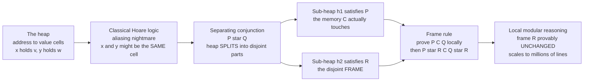

# 🧩 Separation Logic and Heap Reasoning

> [!abstract] TL;DR
> **Separation logic** is the extension of **[[Axiomatic_Semantics_and_Hoare_Logic|Hoare logic]]** that finally made verifying **pointer-manipulating programs** tractable and modular. The problem it solves is **aliasing**: two pointers may reference the *same* heap cell, so an assignment through one silently changes what the other sees — and classical Hoare logic drowns in bookkeeping about what-might-alias-what. Reynolds, O'Hearn and Yang (~2002) added new connectives over **heaps**: the **points-to** predicate `x ↦ v` ("the heap is *exactly* one cell at address `x` holding `v`"), the empty heap `emp`, and — the master stroke — the **separating conjunction** `P * Q` ("the heap **splits** into two **disjoint** parts, one satisfying `P`, the other `Q`"). Disjointness is *asserted*, not assumed, so there is *no aliasing* between the parts. The payoff is the **frame rule**: if `{P} C {Q}` then `{P * R} C {Q * R}` — a command that operates on the `P`-part provably leaves any disjoint frame `R` **unchanged**, enabling **local, modular reasoning**. That single idea is the theoretical basis of scalable industrial analyzers — Meta's **Infer**, **VeriFast**, **Viper**, and the **Iris** framework — and the conceptual cousin of **[[Ownership_and_Borrowing|Rust's ownership]]** for memory safety.

---

## Intuition

**Analogy — separate boxes you can reason about one at a time.** Imagine a warehouse of numbered boxes, and you hold two shipping labels that each point to "your box." Reasoning about pointers is a nightmare precisely because those two labels might *sneakily point to the very same box* — so when you repaint "box A," you have silently repainted "box B" too. This is **aliasing**, and it is why classical Hoare logic, which reasons over a single flat memory, spends most of its energy on paranoid bookkeeping: *for every fact I know, could this write have invalidated it?* The proofs explode.

Separation logic's trick is beautifully simple. It introduces a special **"and"** — the **separating conjunction** `*` — whose whole job is to **assert that two pieces of memory are DISJOINT**, genuinely separate boxes. Once you can write "this heap splits into an independent part I care about *and* the rest," you reason about your part in total isolation, and the rest is **guaranteed untouched** — no aliasing can leak across the seam. That **local reasoning** is what turned heap verification from a research curiosity into something that runs on **millions of lines** of code at Meta every day.

---

## How It Works

### Core Mechanics

1. **The heap is a finite partial function `address → value`.** The *store* holds program variables; the **heap** holds dynamically allocated cells. A **heap predicate** is a set of heaps — an assertion about *which cells exist and what they hold*, not just about integer values.

2. **`emp` and the points-to `x ↦ v`.** `emp` describes *only* the empty heap. The **points-to** assertion `x ↦ v` describes a heap with **exactly one** cell, at address `x`, holding `v`. Crucially `x ↦ 3` says the heap is a *singleton* — it forbids any other cell, which is what makes the next connective meaningful.

3. **The separating conjunction `P * Q`.** `P * Q` holds of a heap `h` iff `h` can be **split into two disjoint sub-heaps** `h = h1 ⊎ h2` with `P(h1)` and `Q(h2)`. The `⊎` is defined *only* when domains are disjoint. So `x ↦ 3 * y ↦ 4` asserts two cells that **cannot alias** — `x ≠ y` comes for free, because a single cell cannot be split into two non-empty singletons. This is the exact opposite of classical `∧`, where `x ↦ 3 ∧ y ↦ 4` would force `x = y` (same one-cell heap described twice).

4. **Inductive heap predicates describe data structures.** A singly-linked list segment is defined *recursively over the heap*: `list(x) ≜ (x = null ∧ emp) ∨ (∃ v, n. x ↦ (v, n) * list(n))`. The `*` guarantees every node occupies **distinct** memory — an acyclic, non-aliased list. Trees, doubly-linked lists, and DAGs are defined the same way.

5. **The frame rule — the whole point.** If `{P} C {Q}` is valid *and* `C` modifies no free variable of `R`, then `{P * R} C {Q * R}` is valid. Read it plainly: **prove a routine correct against only the memory it touches (`P`), then plug it into any larger heap and the disjoint remainder `R` is automatically preserved.** This is *local reasoning* — the reason separation logic is modular and scalable.

6. **The magic wand `P -* Q`** (separating implication): a heap that, *when combined with any disjoint heap satisfying `P`*, yields one satisfying `Q`. It is the adjoint of `*` and models "a resource-shaped hole" — indispensable for reasoning about ownership transfer and partial data structures.

7. **Substructural roots.** Separation logic is the assertion language of the **logic of Bunched Implications (BI)** — a **[[Nonclassical_and_Substructural_Logics|substructural logic]]** where assertions behave like *resources*: `P` is not freely duplicable, because owning one cell is not the same as owning two. This is the same resource-sensitivity that powers **[[Linear_Logic_and_Resource_Types|linear types]]** and Rust's borrow checker.

### Flow / Architecture



---

## Key Concepts

### Secondary (intuitive)
- **Aliasing** is the villain: two names for one box, so changing one changes the other behind your back.
- The **separating conjunction `*`** is a promise that two chunks of memory are *separate* — different boxes, no overlap.
- The **frame rule** says: if you only touched *your* boxes, everybody else's boxes are exactly as you left them.

### Undergraduate (mechanistic)
- **Heap model** `h : Addr ⇀ Val`; the **store** holds variables, the **heap** holds cells.
- **`x ↦ v`** = exactly-one-cell heap; **`emp`** = empty heap; **`P * Q`** = disjoint split `h1 ⊎ h2`.
- Small-axiom rules for the four heap commands: **allocation** `x := cons(...)`, **lookup** `x := [e]`, **mutation** `[e] := e'`, **deallocation** `dispose(e)`. Each has a *tight* local specification touching one cell.
- **Inductive predicates** `list`, `tree` define data structures; `*` enforces node-disjointness.
- The **frame rule** `{P} C {Q} ⊢ {P * R} C {Q * R}` (side condition: `C` does not modify variables free in `R`).

### Graduate (deep)
- **Semantics of BI**: assertions form a *resource monoid* `(Heaps, ⊎, emp)`; `*` is the monoidal conjunction, `-*` its right adjoint (Kripke resource semantics).
- **Soundness of the frame rule** rests on the **frame property** / **locality** of the operational semantics — safe commands have *local action* and *safety monotonicity*.
- **Concurrent Separation Logic (CSL)**: `{P1} C1 {Q1}` and `{P2} C2 {Q2}` with `P1 * P2` gives `{P1 * P2} C1 || C2 {Q1 * Q2}` — disjoint ownership means *no interference*, so parallel composition is sound. Shared state is handled via **resource invariants** and later **fictional separation** / **ghost state**.
- **Iris**: a higher-order, impredicative CSL with *user-defined ghost resources* (a general resource algebra), *invariants*, and *step-indexing* to tame recursion — mechanized in Coq.
- **Bi-abduction** (Calcagno–Distefano–O'Hearn–Yang): infer *both* the missing precondition (`?M`) and the leftover frame (`?F`) in `P * ?M ⊢ Q * ?F`, enabling **compositional, whole-program** analysis without user annotations — the engine inside **Infer**.

---

## Python Demo

```python
"""
Separation logic in miniature: the HEAP, the SEPARATING CONJUNCTION (P * Q),
and the FRAME RULE  {P} C {Q}  =>  {P * R} C {Q * R}.

We model the heap as a dict {address: (data, next)} where each key is a node
address and `next == 0` denotes null.  Everything below is executable.
"""
import numpy as np
import matplotlib.pyplot as plt
from matplotlib.colors import ListedColormap

rng = np.random.default_rng(2)
NULL = 0

# ----------------------------------------------------------------------
# (a) HEAP MODEL, POINTS-TO, and the SEPARATING CONJUNCTION P * Q
# ----------------------------------------------------------------------

def dom(h):
    "Domain of a heap = the set of allocated addresses."
    return set(h.keys())

def disjoint(h1, h2):
    "The heart of separation: two heaps that share NO address."
    return dom(h1).isdisjoint(dom(h2))

def hunion(h1, h2):
    "Disjoint union h1 (+) h2 -- defined ONLY when the heaps are disjoint."
    assert disjoint(h1, h2), "aliasing! heaps overlap, (+) is undefined"
    return {**h1, **h2}

def points_to(h, addr, val):
    "x |-> v : the heap is EXACTLY one cell at `addr` holding `val`."
    return dom(h) == {addr} and h[addr] == val

def is_emp(h):
    "emp : the empty heap."
    return len(h) == 0

def star(h, P, Q):
    """P * Q : does `h` split into DISJOINT h1 (+) h2 with P(h1) and Q(h2)?
    We search over all subsets of the domain (fine for small demo heaps)."""
    addrs = list(dom(h))
    n = len(addrs)
    for mask in range(1 << n):
        left  = {a: h[a] for i, a in enumerate(addrs) if (mask >> i) & 1}
        right = {a: h[a] for i, a in enumerate(addrs) if not (mask >> i) & 1}
        if P(left) and Q(right):
            return True
    return False

def list_seg(h, start):
    """Inductive heap predicate: does `h` represent EXACTLY one acyclic
    singly-linked list from `start`, using every cell in dom(h)?
    Detects aliasing/cycles as a violation. Returns (ok, visited_order)."""
    visited, seen, cur = [], set(), start
    while cur != NULL:
        if cur not in h:        # dangling pointer -- not covered by the heap
            return False, visited
        if cur in seen:         # revisiting a node = cycle / aliasing
            return False, visited
        seen.add(cur); visited.append(cur)
        _, nxt = h[cur]; cur = nxt
    return (seen == dom(h)), visited   # a TIGHT list uses the WHOLE heap

def make_list(addrs, rng):
    "Chain the given addresses into a linked list in random order."
    order = [int(x) for x in rng.permutation(list(addrs))]
    h = {}
    for i, a in enumerate(order):
        nxt = order[i + 1] if i + 1 < len(order) else NULL
        h[a] = (int(rng.integers(0, 100)), nxt)
    return h, order[0]

# --- sanity checks: the axioms behave as advertised --------------------
assert points_to({7: (3, 0)}, 7, (3, 0))           # x |-> v is a singleton
assert is_emp({})                                   # emp
two = {1: (10, 2), 2: (20, 0)}                      # a 2-node list 1 -> 2 -> nil
assert star(two, lambda h: points_to(h, 1, (10, 2)),
                 lambda h: points_to(h, 2, (20, 0)))  # splits disjointly
ok, order = list_seg(two, 1)
assert ok and order == [1, 2]
cyclic = {1: (10, 2), 2: (20, 1)}                   # 1 -> 2 -> 1  (aliased cycle)
assert not list_seg(cyclic, 1)[0]                   # predicate REJECTS aliasing
print("axioms OK: points-to, emp, separating conjunction, list predicate")

# ----------------------------------------------------------------------
# (b) THE FRAME RULE:  {P} C {Q}  =>  {P * R} C {Q * R}
# C = mutation of one node's data field -- touches EXACTLY one address.
# ----------------------------------------------------------------------

def mutate(h, addr, newdata):
    "Command C:  [addr].data := newdata   -- writes ONLY address `addr`."
    h2 = dict(h)
    _, nxt = h2[addr]
    h2[addr] = (newdata, nxt)
    return h2

def restrict(h, addrs):
    return {a: h[a] for a in h if a in addrs}

TRIALS = 400
disjoint_actual      = []   # frame rule holds  -> should be 100%
aliased_naive_claim  = []   # naive frame rule BLINDLY claims preserved -> 100%
aliased_actual       = []   # reality when aliasing sneaks in           -> ~0%

for _ in range(TRIALS):
    addrs = [int(x) for x in rng.permutation(np.arange(1, 21))]
    npn, nrn = int(rng.integers(2, 6)), int(rng.integers(2, 6))
    hP, _ = make_list(addrs[:npn], rng)              # the P-part
    hR, _ = make_list(addrs[npn:npn + nrn], rng)     # the disjoint FRAME R
    heap  = hunion(hP, hR)                            # legal: disjoint union

    target = int(rng.choice(list(hP.keys())))        # mutate a node in P
    heap_after = mutate(heap, target, -1)
    # Frame rule: the R-part must be byte-for-byte unchanged.
    disjoint_actual.append(restrict(heap_after, dom(hR)) == hR)

    # --- ALIASING sneaks in: R secretly shares the mutated node ---------
    hR_alias = dict(hR); hR_alias[target] = hP[target]   # R now ALIASES a P-node
    heap_alias       = {**hP, **hR_alias}                # NOT a disjoint union!
    heap_alias_after = mutate(heap_alias, target, -1)
    aliased_naive_claim.append(True)                     # naive: "frame untouched"
    aliased_actual.append(restrict(heap_alias_after, dom(hR_alias)) == hR_alias)

print(f"disjoint  : frame preserved in {100*np.mean(disjoint_actual):.0f}% of trials")
print(f"aliased   : naive CLAIMS preserved in {100*np.mean(aliased_naive_claim):.0f}%")
print(f"aliased   : ACTUALLY preserved in {100*np.mean(aliased_actual):.0f}%")
print("=> the gap between claim and reality is the FALSE POSITIVE aliasing causes")

# ----------------------------------------------------------------------
# VISUALIZATION
# ----------------------------------------------------------------------
fig, (ax0, ax1) = plt.subplots(1, 2, figsize=(13, 4.6))

# Left: heap split / disjointness picture (addresses 1..10)
N = 10
P_set, R_set, Ralias_set = {1, 2, 3, 4}, {6, 7, 8, 9}, {3, 6, 7, 8}  # 3 = overlap
codes = np.zeros((2, N), dtype=int)                  # 0 = unallocated (gray)
for a in range(1, N + 1):
    if   a in P_set: codes[0, a - 1] = 1             # P     (blue)
    elif a in R_set: codes[0, a - 1] = 2             # R     (green)
for a in range(1, N + 1):
    if   a in P_set and a in Ralias_set: codes[1, a - 1] = 3   # OVERLAP (red)
    elif a in P_set:                     codes[1, a - 1] = 1
    elif a in Ralias_set:                codes[1, a - 1] = 2
cmap = ListedColormap(["#eeeeee", "#4c72b0", "#55a868", "#c44e52"])
ax0.imshow(codes, cmap=cmap, vmin=0, vmax=3, aspect="auto")
ax0.set_xticks(range(N)); ax0.set_xticklabels(range(1, N + 1))
ax0.set_yticks([0, 1]); ax0.set_yticklabels(["P * R\n(disjoint, legal)",
                                             "P and R alias\n(overlap = bug)"])
ax0.set_xlabel("heap address")
ax0.set_title("Separating conjunction: the heap splits into disjoint parts")
for (r, c), v in np.ndenumerate(codes):
    lbl = {0: "", 1: "P", 2: "R", 3: "P&R"}[v]
    ax0.text(c, r, lbl, ha="center", va="center",
             color="white" if v else "#999", fontsize=9, fontweight="bold")

# Right: frame-rule preservation vs naive false positives
labels = ["disjoint\nframe (actual)", "aliased\nnaive CLAIM", "aliased\nframe (actual)"]
vals   = [100 * np.mean(disjoint_actual),
          100 * np.mean(aliased_naive_claim),
          100 * np.mean(aliased_actual)]
bars = ax1.bar(labels, vals, color=["#55a868", "#dd8452", "#c44e52"])
ax1.set_ylabel("% of trials frame is preserved"); ax1.set_ylim(0, 110)
ax1.set_title("Frame rule holds under separation;\nnaive reasoning gives false positives")
for b, v in zip(bars, vals):
    ax1.text(b.get_x() + b.get_width() / 2, v + 2, f"{v:.0f}%",
             ha="center", fontweight="bold")

plt.tight_layout()
plt.savefig("separation_logic_frame_rule.png", dpi=120)
print("saved separation_logic_frame_rule.png")
```

**What it shows.** Part (a) builds the whole assertion language from a dict-of-cells: `points_to` is a *singleton* heap, `star` verifies a heap genuinely **splits into disjoint parts**, and the `list_seg` predicate **rejects** a cyclic/aliased heap — exactly what `*` buys you. Part (b) runs the **frame rule** on hundreds of random heaps: when `P` and the frame `R` are **disjoint**, mutating a `P`-node preserves `R` in **100%** of trials (the frame rule is *sound*). But the moment **aliasing sneaks in** — `R` secretly shares the mutated cell — a *naive* non-separating check still *claims* the frame is untouched (100%) while it is *actually* preserved in ~0%. That gap is the class of **false positives** separation logic was invented to eliminate.

---

## Real-World Applications

- **Meta / Facebook Infer** — the flagship success. Infer uses **bi-abduction** over separation logic to *infer* pre/postconditions compositionally and flag **null-dereferences, memory leaks, use-after-free, and resource leaks** across **billions of lines** of C/C++/Java/Objective-C, running on every code change.
- **VeriFast** — modular verification of C and Java via user-written separation-logic contracts; used to prove memory safety and functional correctness of low-level code (crypto, embedded).
- **Viper** — an intermediate verification infrastructure (ETH Zürich) whose permission model is a **fractional separation logic**; back-end for tools verifying Rust (**Prusti**), Go, Python, and more.
- **Iris (Coq)** — the modern research workhorse: a higher-order **concurrent separation logic** used to give the first rigorous safety proofs for **Rust's type system** (**RustBelt**), lock-free data structures, and weak-memory concurrency.
- **Rust's borrow checker** — not separation logic per se, but the *same core insight*: an `&mut` reference is an **exclusive, separated** capability over a region of memory, so ownership guarantees the disjointness that makes local reasoning (and data-race freedom) sound. See **[[Ownership_and_Borrowing]]** and **[[Memory_and_Ownership_Models]]**.
- **seL4 / CertiKOS-style OS verification** — separation logic (and its permission variants) underpins machine-checked proofs of pointer-heavy kernel code manipulating page tables and allocators.

---

## Common Pitfalls

- **`*` is NOT classical `∧`.** `P * Q` asserts the heap **splits into disjoint parts**; `P ∧ Q` asserts *the same heap* satisfies both. Writing `x ↦ 3 ∧ y ↦ 4` secretly forces `x = y`; `x ↦ 3 * y ↦ 4` forces `x ≠ y`. Confusing them is the single most common beginner error.
- **`x ↦ v` is a *tight* singleton, not "somewhere in the heap".** It says the heap is **exactly** that one cell. To describe one cell inside a bigger heap you *frame the rest off* with `* R`. Forgetting the tightness makes `*` meaningless.
- **Aliasing is why pointer reasoning is hard.** The whole discipline exists to make aliasing *impossible by construction between separated conjuncts* — never assume disjointness; *assert* it with `*` and let the split-existence carry the proof obligation.
- **Frame-rule side condition.** `{P * R} C {Q * R}` requires that `C` **modifies no program variable free in `R`**. Skipping this check reintroduces exactly the interference you were trying to rule out.
- **Leaks and double-free are heap-*shape* bugs, not value bugs.** A postcondition `list(x) * garbage` reveals a **leak** (unreachable cells left over); deallocating a cell you no longer own (its `↦` is gone) is a **double-free**. Separation logic makes these *provable* obligations, whereas classical Hoare logic can't even state them cleanly.
- **The magic wand `P -* Q` is easy to misread.** It is *not* implication over the same heap; it is "a heap that, combined with a **disjoint** `P`-heap, yields a `Q`-heap." It models holes/ownership-transfer and needs the resource semantics to interpret correctly.
- **Concurrent separation logic needs ownership discipline.** Parallel composition is sound *only* when threads hold **disjoint** resources (`P1 * P2`); shared state must be routed through **resource invariants** — treating shared memory as freely separable is unsound.

---

## Related Concepts

- [[Axiomatic_Semantics_and_Hoare_Logic]] — the parent logic; separation logic is Hoare logic re-based over heaps with `*` and the frame rule.
- [[Logic_for_Program_Verification]] — separation-logic assertions become **verification conditions**; disjointness sits inside the formulas SMT/proof back-ends must discharge.
- [[Nonclassical_and_Substructural_Logics]] — separation logic is the assertion language of **Bunched Implications (BI)**, a substructural (resource-sensitive) logic.
- [[Linear_Logic_and_Resource_Types]] — the same "assertions are resources, not freely duplicable" idea that powers linear types and ownership.
- [[Memory_and_Ownership_Models]] — the language-design lens on the same problem: making aliasing tractable via ownership.
- [[Ownership_and_Borrowing]] — Rust's borrow checker enforces the disjointness separation logic *proves*, delivering memory safety and data-race freedom.
- [[Singly_Linked_List]] — the canonical inductive heap predicate `list(x)` is exactly this structure, defined recursively with `*`.
- [[Memory_Management_and_Allocation]] — separation logic reasons about `cons`/`dispose` over the OS-managed heap; leaks and double-frees are the target bugs.

*Siblings referenced in prose (same section): Hoare_Logic_and_Axiomatic_Semantics, Weakest_Preconditions_and_Predicate_Transformers, Deductive_Verification_Tools, Static_Program_Analysis, Concurrency_Verification_and_Process_Calculi.*

---

## Review Questions

1. **(Secondary)** In one sentence, what does `P * Q` assert that `P ∧ Q` does not, and why does that distinction make reasoning about pointers easier?
2. **(Undergraduate)** State the frame rule precisely, including its side condition. Given `{ list(x) } reverse(x) { list(x) }`, use the frame rule to derive a specification for calling `reverse` on one list while a *second, disjoint* list `list(y)` exists in the heap. What guarantees the second list is untouched?
3. **(Graduate)** Concurrent separation logic soundly concludes `{P1 * P2} C1 || C2 {Q1 * Q2}` from the two threads' specs. Explain *why the `*` is essential here* — what unsound conclusion would you reach if you replaced it with classical `∧`, and how do resource invariants recover soundness when the threads must share state?

---

## Sources

- [Reynolds, *Separation Logic: A Logic for Shared Mutable Data Structures* (LICS 2002)](https://www.cs.cmu.edu/~jcr/seplogic.pdf)
- [O'Hearn, Reynolds & Yang, *Local Reasoning about Programs that Alter Data Structures* (CSL 2001)](https://www.cs.cmu.edu/~jcr/localreasoning.pdf)
- [O'Hearn, *Resources, Concurrency, and Local Reasoning* (Theoretical Computer Science, 2007)](https://www.cs.cmu.edu/~brookes/papers/tcs07CSL.pdf)
- [Jung, Krebbers, Jourdan, Bizjak, Birkedal & Dreyer, *Iris from the ground up* (JFP 2018)](https://iris-project.org/pdfs/2018-jfp-iris-final.pdf)
- [Calcagno, Distefano, O'Hearn & Yang, *Compositional Shape Analysis by means of Bi-Abduction* (POPL 2009 / JACM 2011)](https://dl.acm.org/doi/10.1145/2049697.2049700)

---

#formal-methods #separation-logic #heap-reasoning #pointers #frame-rule
