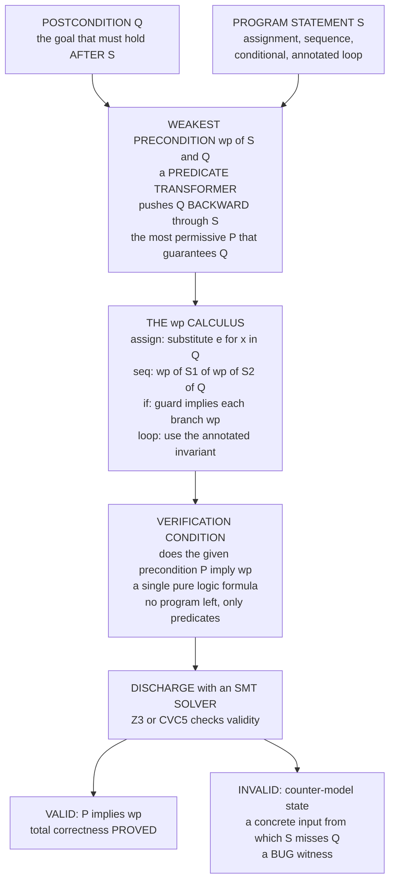

# 🔁 Weakest Preconditions and Predicate Transformers

> [!abstract] TL;DR
> The **weakest precondition** `wp(S, Q)` is the **most permissive** predicate `P` such that running statement `S` from *any* state satisfying `P` is **guaranteed to terminate in a state satisfying `Q`** — total correctness in one formula. Where [[Axiomatic_Semantics_and_Hoare_Logic|Hoare logic]] hands you *rules you apply by hand* (and asks you to guess the intermediate assertions), Dijkstra's **wp calculus** hands you an **algorithm**: push the postcondition **backward** through the code by pure substitution and case analysis, mechanically computing the required precondition. Correctness then collapses to a *single* **verification condition** — *does the given precondition imply `wp(S, Q)`?* — a pure logic formula you discharge with an **SMT solver**. `wp` is a **predicate transformer**: a monotone function mapping postcondition-predicates to precondition-predicates. Its liberal sibling **`wlp`** drops termination (partial correctness); its dual, the **strongest postcondition** `sp`, runs **forward** (symbolic execution). Loops have no closed-form `wp` (it would decide the halting problem), so you supply an **annotated invariant**. This backward transformer is the engine literally inside **Dafny, Why3, Boogie, ESC/Java, and Frama-C's WP plugin**: annotate → generate VCs by `wp` → prove.

---

## Intuition

**Analogy — plan the trip backward from the destination.** You must end a journey at one exact address. The naive method is *forward guessing*: pick a starting point, drive the route, see if you arrive, and retry if you missed. Hopeless for a program with astronomically many possible starts. The disciplined method is to work **backward**: stand at the destination and ask, *"From which set of starting points would this exact route land me here?"* Trace the last road segment in reverse to find every point that feeds into the destination; trace the segment before that in reverse; keep going. When you reach the trailhead you hold the **complete, most-permissive set of valid starting points** — and you never guessed once. If your actual starting point lies in that set, arrival is *guaranteed*; if it lies outside, you were doomed from the first step.

Dijkstra's weakest precondition does exactly this for programs. Give it the **goal** (the postcondition `Q`) and the **code** (`S`), and it **mechanically computes** the weakest condition on the input that *guarantees* the goal — the largest possible set of "good starting states." Run this backward transformer through the whole program and a correctness proof stops being an act of inspiration and becomes a **calculation**. That is precisely why push-button verifiers can generate correctness proofs without a human inventing intermediate assertions at every step: the backward transformer produces them.

---

## How It Works

### Core Mechanics

`wp(S, Q)` is defined as the **weakest** predicate `P` such that the Hoare triple for *total* correctness holds: `{P} S {Q}`, where "total" means `S` both **terminates** and lands in `Q`. "Weakest" means most permissive — `wp(S, Q)` is implied by every *other* valid precondition, so it describes **exactly** the set of states from which `S` is guaranteed to reach `Q`. The whole calculus is five compositional rules, applied **backward**:

1. **Skip:** `wp(skip, Q) = Q`. Doing nothing changes nothing; the goal is already the requirement.

2. **Assignment (the surprising one):** `wp(x := e, Q) = Q[e/x]` — take `Q` and **substitute `e` for every `x`**. To make `x > 5` hold *after* `x := x + 1`, require `x + 1 > 5`, i.e. `x > 4`, *before*. You reason from the goal to the requirement, not forward.

3. **Sequence (compose right-to-left):** `wp(S1; S2, Q) = wp(S1, wp(S2, Q))`. First find what `S2` needs to reach `Q`; *that* becomes the goal `S1` must establish. The postcondition flows **backward** through the code.

4. **Conditional (case-split on the guard):** `wp(if b then S1 else S2, Q) = (b ⇒ wp(S1, Q)) ∧ (¬b ⇒ wp(S2, Q))`. Whichever branch runs must reach `Q`.

5. **Loop (the wall):** `wp(while b do S, Q)` has **no closed form** — computing it in general would decide the halting problem. So the loop is **annotated with an invariant `I`** (and a **variant** for termination); `wp` treats the loop's precondition as `I` and emits two side **verification conditions**: `(I ∧ b) ⇒ wp(S, I)` (the body preserves `I`) and `(I ∧ ¬b) ⇒ Q` (exit implies the goal).

Once `wp` has been threaded backward through the program, the top-level correctness claim `{P_given} S {Q}` reduces to a **single verification condition (VC)**: `P_given ⇒ wp(S, Q)`. There is **no program left** in this formula — only predicates over the input variables. Hand it to an **SMT solver**: *valid* means the program is correct; a *counter-model* is a concrete input state exhibiting a bug.

Two variants matter. **`wp`** demands termination (**total** correctness) and, for nondeterministic choice, is **demonic** — every branch must reach `Q`. Its liberal sibling **`wlp(S, Q)`** (**weakest liberal precondition**) drops termination: it only guarantees *"if `S` halts, `Q` holds"* (**partial** correctness), so `wp(S, Q) = wlp(S, Q) ∧ wp(S, true)`, where `wp(S, true)` is exactly the termination condition. The **dual** transformer is the **strongest postcondition** `sp(S, P)` — the tightest predicate true *after* running `S` from `P`, computed **forward**; that is the engine of **symbolic execution**.

### Flow / Architecture



---

## Key Concepts

**Secondary (explain to a curious beginner).**
- A **postcondition** is the goal — what you want true when the program finishes. A **precondition** is what must be true before it starts.
- **Weakest precondition** = work backward from the goal to find the *biggest* set of starting states that are guaranteed to reach it. Anything in that set is safe; anything outside is doomed.
- Because it is computed by a fixed recipe, a machine can find it for you — you do not have to guess.

**Undergraduate (requires a CS background).**
- The **assignment rule** `wp(x := e, Q) = Q[e/x]` works by **backward substitution** — the single most counter-intuitive-then-obvious rule.
- **Sequence composes backward:** `wp(S1; S2, Q) = wp(S1, wp(S2, Q))`; the postcondition is transformed step by step through the code, ending as one **verification condition** `P ⇒ wp(S, Q)`.
- **`wp` vs `wlp`:** `wp` is **total** correctness (includes termination), `wlp` is **partial** (halts ⇒ `Q`); the difference is exactly the termination predicate `wp(S, true)`.
- **Loops need an invariant** (and a **variant** for termination) because closed-form loop `wp` is uncomputable — the point where the calculus stops being fully automatic.

**Graduate (system-level and foundational thinking).**
- **Predicate transformers as semantics:** `wp(S, ·)` is a **monotone function** on the lattice of predicates ordered by implication — the *denotational* face of axiomatic semantics (a program **is** the transformer it induces on postconditions; see [[Denotational_Semantics]] and [[Domain_Theory_and_Fixed_Points]]).
- **Healthiness conditions (Dijkstra):** legitimate transformers satisfy laws — *law of the excluded miracle* `wp(S, false) = false`, *monotonicity*, *distribution over conjunction*, and (for deterministic `S`) *distribution over disjunction*; these characterize which predicate maps correspond to real programs.
- **Demonic vs angelic nondeterminism:** `wp` of guarded-command choice is **demonic** (must work for *all* branches, `∧`); the angelic dual (some branch works, `∨`) gives a different transformer used in refinement and games.
- **The dual `sp`:** the strongest postcondition runs **forward** (symbolic execution); `wp` and `sp` form a Galois connection, and `sp` grows unboundedly along loops where `wp` needs the invariant to close the gap.

---

## Python Demo

We build a tiny **weakest-precondition calculator** for a mini imperative language — assignment (`wp` by AST substitution), sequence (backward composition), conditional (guard case-split), and while (annotated invariant → verification conditions). We then (a) compute `wp` **symbolically** for a small straight-line program and check the **verification condition** `P ⇒ wp(S, Q)` across a grid of input states — *valid* for a correct program, *violated* for a buggy one with the **same** asserted precondition — and (b) enumerate the **set of input states satisfying `wp(S, Q)`** and show it coincides **exactly** with the states from which `S` actually reaches `Q`, so that any *weaker* precondition admits a failing input and any *stronger* one throws away valid inputs. `numpy` + `matplotlib`.

```python
# Weakest-precondition calculator + verification-condition checker for a mini language.
# wp(x:=e, Q) = Q[e/x] ; wp(S1;S2, Q) = wp(S1, wp(S2, Q)) ;
# wp(if b then S1 else S2, Q) = (b => wp(S1,Q)) and (not b => wp(S2,Q)) ; loops use an invariant.
# We (a) generate the VC  P => wp(S,Q)  and test it over a grid (valid vs buggy),
# and (b) show wp(S,Q) is EXACTLY the set of inputs from which S reaches Q.
import ast, copy
import numpy as np
import matplotlib.pyplot as plt

# ---------- assertion language: substitute expression e for variable x (the assignment axiom) ----------
def substitute(pred, var, expr):
    body = ast.parse(pred, mode="eval").body
    repl = ast.parse(f"({expr})", mode="eval").body
    class Sub(ast.NodeTransformer):
        def visit_Name(self, node):
            return copy.deepcopy(repl) if node.id == var else node
    return ast.unparse(ast.fix_missing_locations(Sub().visit(body)))

def holds(pred, state):                       # evaluate a predicate string on a concrete state
    return bool(eval(pred, {"__builtins__": {}}, dict(state)))

# ---------- abstract syntax ----------
class Assign:
    def __init__(s, v, e): s.var, s.expr = v, e
class Seq:
    def __init__(s, cs): s.cmds = cs
class If:
    def __init__(s, c, t, e): s.cond, s.then, s.els = c, t, e
class While:
    def __init__(s, c, inv, b): s.cond, s.inv, s.body = c, inv, b

# ---------- the weakest-precondition transformer (collects loop VCs) ----------
def wp(cmd, Q, vcs):
    if isinstance(cmd, Assign):                          # wp(x:=e, Q) = Q[e/x]
        return substitute(Q, cmd.var, cmd.expr)
    if isinstance(cmd, Seq):                             # wp(S1;S2, Q) = wp(S1, wp(S2,Q))
        for c in reversed(cmd.cmds):
            Q = wp(c, Q, vcs)
        return Q
    if isinstance(cmd, If):                              # case-split on the guard
        wt, we = wp(cmd.then, Q, vcs), wp(cmd.els, Q, vcs)
        return f"(({cmd.cond}) and ({wt})) or ((not ({cmd.cond})) and ({we}))"
    if isinstance(cmd, While):                           # loop: use the annotated invariant I
        I, b = cmd.inv, cmd.cond
        vcs.append(("preserved: (I and b) => wp(body, I)", f"({I}) and ({b})", wp(cmd.body, I, vcs)))
        vcs.append(("exit:      (I and not b) => Q",       f"({I}) and (not ({b}))", Q))
        return I
    raise TypeError(cmd)

def run(cmd, st):                                        # concrete interpreter (to confirm reachability)
    if isinstance(cmd, Assign):  st[cmd.var] = eval(cmd.expr, {"__builtins__": {}}, dict(st))
    elif isinstance(cmd, Seq):   [run(c, st) for c in cmd.cmds]
    elif isinstance(cmd, If):    run(cmd.then if holds(cmd.cond, st) else cmd.els, st)
    elif isinstance(cmd, While):
        while holds(cmd.cond, st): run(cmd.body, st)
    return st

# =================== 1. TWO PROGRAMS, ONE SPEC ===================
#   double-the-sum:  z := x + y ; z := z * 2      with postcondition  z >= 10
correct = Seq([Assign("z", "x + y"), Assign("z", "z * 2")])
buggy   = Seq([Assign("z", "x + y"), Assign("z", "z + 2")])   # bug: +2 instead of *2
POST    = "z >= 10"
P_ASSERT = "x + y >= 5"                                        # the precondition we CLAIM is enough

wp_ok  = wp(correct, POST, [])       # -> "(x + y) * 2 >= 10"   i.e. region  x+y >= 5
wp_bad = wp(buggy,   POST, [])       # -> "x + y + 2 >= 10"     i.e. region  x+y >= 8
print("wp(correct, z>=10) =", wp_ok)
print("wp(buggy,   z>=10) =", wp_bad)

# =================== 2. THE wp CALCULUS ALSO HANDLES if AND while ===================
mx = If("x < y", Assign("m", "y"), Assign("m", "x"))          # max into m
print("\nwp(max, m>=x and m>=y) =", wp(mx, "m >= x and m >= y", []))
loop = Seq([Assign("s", "0"), Assign("i", "1"),
            While("i <= n", inv="s == (i - 1) * i // 2 and i <= n + 1",
                  body=Seq([Assign("s", "s + i"), Assign("i", "i + 1")]))])
loop_vcs = []; entry = wp(loop, "s == n * (n + 1) // 2", loop_vcs)
print("\nannotated sum-loop generates these verification conditions:")
for name, ante, cons in loop_vcs:
    print(f"   [{name}]  assume {ante!r}  =>  prove {cons!r}")

# =================== 3. GRID OF INPUT STATES (x, y) ===================
xs = np.arange(-2, 11); ys = np.arange(-2, 11)
def mask(pred):                                              # boolean grid where a predicate holds
    return np.array([[holds(pred, {"x": int(xv), "y": int(yv)}) for xv in xs] for yv in ys])
def reach_mask(prog):                                        # states from which prog actually reaches Q
    return np.array([[holds(POST, run(prog, {"x": int(xv), "y": int(yv)})) for xv in xs] for yv in ys])

WP   = mask(wp_ok)                                           # wp input-state set (correct program)
REACH = reach_mask(correct)                                  # true reachability set
print("\nwp region == reachability set for correct program:", np.array_equal(WP, REACH))

VC_ok  = mask(f"(not ({P_ASSERT})) or ({wp_ok})")           # P => wp   (correct): valid everywhere
VC_bad = mask(f"(not ({P_ASSERT})) or ({wp_bad})")          # P => wp   (buggy):  has a violation band
viol   = mask(P_ASSERT) & ~mask(wp_bad)                     # concrete counter-examples for the buggy VC
print(f"correct VC valid on all {VC_ok.size} states: {VC_ok.all()}")
print(f"buggy   VC violated on {viol.sum()} states (band 5 <= x+y < 8)")

# too-STRONG precondition: sound but not weakest (discards valid inputs);
# too-WEAK precondition: admits a failing input.
strong = mask("x >= 3 and y >= 3"); weak = mask("x + y >= 3")
lost   = WP & ~strong        # valid states the too-strong precondition wrongly excludes
admits = weak & ~WP          # failing states the too-weak precondition wrongly admits
print(f"too-strong wrongly EXCLUDES {lost.sum()} valid inputs; too-weak wrongly ADMITS {admits.sum()} failing inputs")

# =================== 4. VISUALIZE:  wp input-state set  +  the VC check ===================
ext = [xs[0] - .5, xs[-1] + .5, ys[0] - .5, ys[-1] + .5]
fig, ax = plt.subplots(2, 2, figsize=(13, 11))

# (a) the weakest-precondition input set = exactly the states from which S reaches Q
ax[0, 0].imshow(WP, origin="lower", extent=ext, cmap="Greens", alpha=.85, vmin=0, vmax=1)
ax[0, 0].contour(xs, ys, REACH.astype(int), levels=[.5], colors="black", linewidths=2)
ax[0, 0].plot(xs, 5 - xs, "b--", lw=2, label="boundary  x + y = 5")
ax[0, 0].set(title="(a) wp input-state set == reachability of Q\n(green = wp holds; black contour = S reaches Q)",
             xlabel="x", ylabel="y", xlim=(ext[0], ext[1]), ylim=(ext[2], ext[3])); ax[0, 0].legend(loc="lower left")

# (b) the 'weakest' idea: too-strong loses valid inputs, too-weak admits failures
ax[0, 1].imshow(WP, origin="lower", extent=ext, cmap="Greens", alpha=.5, vmin=0, vmax=1)
ys_lost, xs_lost = np.where(lost);   ax[0, 1].scatter(xs[xs_lost], ys[ys_lost], c="orange", marker="s", s=45,
                                                      label="valid, EXCLUDED by too-strong P")
ys_adm, xs_adm = np.where(admits);   ax[0, 1].scatter(xs[xs_adm], ys[ys_adm], c="red", marker="x", s=55,
                                                      label="failing, ADMITTED by too-weak P")
ax[0, 1].plot(xs, 5 - xs, "b--", lw=2)
ax[0, 1].set(title="(b) wp is the EXACT boundary\nstronger discards valid inputs; weaker admits bugs",
             xlabel="x", ylabel="y", xlim=(ext[0], ext[1]), ylim=(ext[2], ext[3])); ax[0, 1].legend(loc="lower left", fontsize=8)

# (c) VC check for the CORRECT program: P => wp holds on every state
ax[1, 0].imshow(VC_ok, origin="lower", extent=ext, cmap="RdYlGn", vmin=0, vmax=1)
ax[1, 0].set(title=f"(c) VC  P => wp  for CORRECT program\nvalid on all {VC_ok.size} states (all green)",
             xlabel="x", ylabel="y")

# (d) VC check for the BUGGY program: same P, but a violation band appears
ax[1, 1].imshow(VC_bad, origin="lower", extent=ext, cmap="RdYlGn", vmin=0, vmax=1)
ys_v, xs_v = np.where(viol); ax[1, 1].scatter(xs[xs_v], ys[ys_v], c="black", marker="x", s=55,
                                              label="counter-model (P holds, wp fails)")
ax[1, 1].set(title="(d) VC  P => wp  for BUGGY program\nred band 5 <= x+y < 8 = SMT counter-models",
             xlabel="x", ylabel="y"); ax[1, 1].legend(loc="lower left", fontsize=8)

fig.suptitle("Weakest precondition: backward VC generation + the 'weakest' input-state set", fontsize=14)
fig.tight_layout()
plt.savefig("weakest_precondition.png", dpi=120)
print("\nSaved plot to weakest_precondition.png")
```

**What it shows.** The transformer threads `Q = z >= 10` **backward** through both programs by substitution, yielding the symbolic `wp` regions `x + y >= 5` (correct) and `x + y >= 8` (buggy). Panel **(a)** confirms the punchline of "weakest": the set of inputs satisfying `wp(correct, Q)` (green) **coincides exactly** with the set from which the program actually reaches `Q` (black contour) — `np.array_equal` returns `True`. Panel **(b)** shows why it is *the* boundary: a **too-strong** precondition (`x≥3 ∧ y≥3`) is sound but throws away valid inputs (orange), while a **too-weak** one (`x+y≥3`) admits inputs that *fail* the goal (red) — only `wp` is tight. Panels **(c)–(d)** are the verification-condition check with the *same* asserted precondition `x+y≥5`: for the correct program `P ⇒ wp` is valid on **every** state, but the buggy program exposes a **counter-model band** (`5 ≤ x+y < 8`) — exactly the concrete inputs an SMT solver would return as a bug witness. A production verifier replaces this finite grid test with an SMT *proof* quantifying over **all** states.

---

## Real-World Applications

> **Dafny + Boogie + Z3 (Microsoft Research).** Dafny is the canonical wp-in-production stack. You annotate methods with `requires` / `ensures` / `invariant` / `decreases`; Dafny translates to the **Boogie** intermediate verification language, Boogie runs **weakest-precondition VC generation** over it, and ships the resulting formulas to the **Z3** SMT solver. The `invariant` and `decreases` clauses in Dafny source are *literally* the loop invariant and variant the wp rules demand. Amazon used Dafny to verify authorization and storage components.

- **Why3 / WhyML.** A verification *platform* whose core is a wp-based VC generator; WhyML programs annotated with contracts produce VCs dispatched to *many* provers (Z3, CVC5, Alt-Ergo, Coq). It is the backend for both Frama-C and SPARK.
- **Frama-C WP plugin (C / ACSL).** Annotate C functions with ACSL pre/postconditions and loop invariants; the **WP plugin** generates weakest-precondition verification conditions and discharges them — used for avionics and safety-critical C under DO-178C.
- **SPARK / Ada.** Contract-based verification for Ada with wp-style VC generation (GNATprove on a Why3 core), deployed in rail signalling, aerospace, and defense.
- **ESC/Java and ESC/Modula-3.** The original "extended static checking" tools that popularized *pushing postconditions backward through code to generate VCs* — the direct ancestors of Dafny (all Leino-led).
- **Boogie as shared infrastructure.** Because Boogie encapsulates wp VC generation once, many front-ends (Dafny, Corral, VCC for concurrent C, Move Prover for smart contracts) reuse the exact same predicate-transformer engine.

---

## Common Pitfalls

- **Reading the assignment rule forward.** `wp(x := e, Q) = Q[e/x]` substitutes into the **post**condition. Beginners expect `wp(x := x+1, x>5)` to be `x>5`; it is `x+1>5`, i.e. `x>4`. Reason **backward**, from goal to requirement — the whole calculus depends on this direction.
- **Confusing `wp` with `wlp`.** `wp` guarantees **termination + `Q`** (total correctness); `wlp` only *"if it halts, `Q`"* (partial). Prove a triple with `wlp` and you have said **nothing** about an infinite loop. Always know which correctness you are establishing: `wp(S,Q) = wlp(S,Q) ∧ wp(S,true)`.
- **Expecting a closed-form loop `wp`.** There is none in general — computing it decides the halting problem (see [[The_Halting_Problem_and_Undecidability]]). Loops **require** an annotated **invariant** (plus a **variant** for termination). A verifier that "can't prove your loop" usually means a missing or too-weak invariant, not a tool bug.
- **A too-weak invariant.** If `I` is preserved but does not capture enough, the *exit* VC `(I ∧ ¬b) ⇒ Q` fails; if `I` is not actually preserved, the *preserved* VC fails. The invariant must be **just strong enough** yet still hold on entry — the one genuinely creative step the calculus cannot mechanize.
- **Forgetting demonic nondeterminism.** For nondeterministic or guarded choice, `wp` must hold for **every** branch (`∧`, demonic) — designing as if *some* lucky branch suffices (angelic, `∨`) proves the wrong thing.
- **Ignoring healthiness conditions.** A predicate map that violates the *law of the excluded miracle* (`wp(S, false)` must be `false`) or monotonicity is **not** a real program's transformer; "proofs" built on such a map are vacuous — the source of many spurious "verified" results.
- **Trusting the spec blindly.** `wp` proves *code meets contract*, never that the *contract* is what you meant. A `requires false` (vacuous precondition) or `ensures true` (trivial postcondition) "verifies" anything. Garbage spec in, garbage guarantee out.

---

## Related Concepts

- [[Axiomatic_Semantics_and_Hoare_Logic]] — the source of the triples `{P} S {Q}`; wp turns Hoare's *hand-applied rules* into an *algorithmic* backward VC generator.
- [[Formal_Methods_Overview]] — situates wp/VC generation as pillar (3), **deductive program verification**, in the formal-methods spectrum.
- [[Denotational_Semantics]] — predicate transformers *are* a denotational semantics: a program is the monotone function it induces on postconditions.
- [[Domain_Theory_and_Fixed_Points]] — the lattice-of-predicates and least-fixed-point machinery behind loop `wp` and the monotonicity of transformers.
- [[First_Order_Predicate_Logic]] — the assertion language of pre/postconditions and the logic in which every verification condition is stated and discharged.
- [[The_Halting_Problem_and_Undecidability]] — why closed-form loop `wp` cannot exist, forcing human-supplied invariants and variants.
- [[Refinement_and_Correctness_by_Construction]] — the dual, forward, top-down discipline; refinement *weakens preconditions and strengthens postconditions*, the same partial order wp lives on.

*(Vault siblings referenced in prose, not yet built: `Hoare_Logic_and_Axiomatic_Semantics`, `Loop_Invariants_and_Termination_Proofs`, `Deductive_Verification_Tools`, `Design_by_Contract_and_Assertions`, `SMT_Solving_and_Satisfiability_Modulo_Theories`.)*

---

## Review Questions

1. **(Secondary)** You want to arrive at one specific house. Explain, in the "plan-the-trip-backward" spirit, why computing the **weakest precondition** gives you the *largest* possible set of safe starting points — and why a starting point *outside* that set is doomed no matter how you drive.
2. **(Undergraduate)** Compute `wp(x := x * 2; x := x + 1, x >= 7)` step by step, showing the backward substitution at each stage. Then, for `while i < n do i := i + 1`, explain why `wp` cannot be written in closed form and give an **invariant** and a **variant** that let a tool discharge it.
3. **(Graduate)** (a) Distinguish `wp(S, Q)`, `wlp(S, Q)`, and `sp(S, P)` — direction, what each guarantees, and their relationship. (b) State two of Dijkstra's **healthiness conditions** and explain what goes wrong if a purported predicate transformer violates the *law of the excluded miracle*. (c) Explain why the choice between **demonic** and **angelic** nondeterminism changes `wp` of guarded-command choice from a conjunction to a disjunction, and which one corresponds to *guaranteed* correctness.

---

## Sources

- Edsger W. Dijkstra, *A Discipline of Programming*, Prentice-Hall, 1976 — the founding text on weakest preconditions, guarded commands, and predicate transformers.
- Edsger W. Dijkstra, "Guarded Commands, Nondeterminacy and Formal Derivation of Programs," *Communications of the ACM* 18(8), 1975. <https://dl.acm.org/doi/10.1145/360933.360975>
- Edsger W. Dijkstra and Carel S. Scholten, *Predicate Calculus and Program Semantics*, Springer, 1990 — the rigorous predicate-transformer / healthiness-conditions treatment.
- David Gries, *The Science of Programming*, Springer, 1981 — the accessible textbook development of wp and deriving programs from specifications.
- K. Rustan M. Leino, "Dafny: An Automatic Program Verifier for Functional Correctness," *LPAR-16*, 2010 — wp/VC generation via Boogie and Z3 in a modern verifier. <https://www.microsoft.com/en-us/research/publication/dafny-automatic-program-verifier-functional-correctness/>

---

#formal-methods #weakest-precondition #predicate-transformers #dijkstra #verification-conditions
