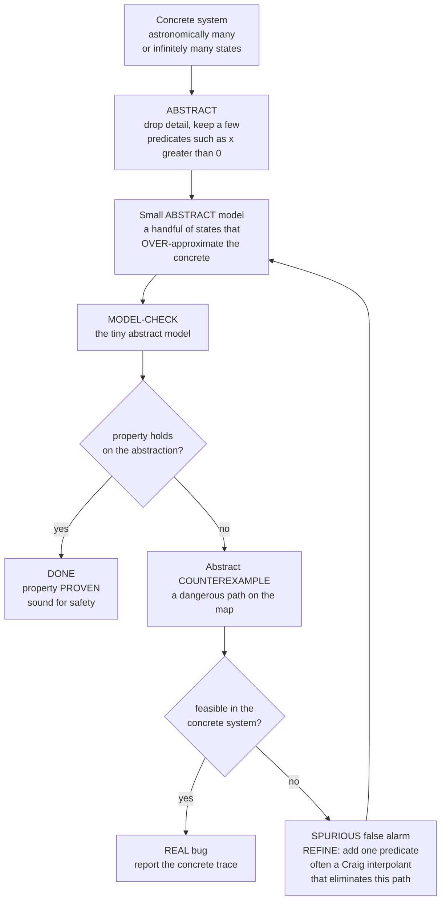

# 🗺️ Abstraction Refinement and CEGAR

> [!abstract] TL;DR
> A real program over 64-bit integers has more states than atoms in the universe, and one with unbounded data has *infinitely* many — you cannot enumerate them, so **classical model checking cannot even start**. **Abstraction** rescues it: replace the huge concrete system with a tiny **abstract model** that **over-approximates** it — the abstract model admits *at least* every concrete behavior, and usually many extra ones. Over-approximation is **sound for safety** (a *universal* property): if the abstract model has **no** bad behavior, neither does the concrete system — you have a *proof*. But the extra behaviors can produce **spurious counterexamples**: alarms on paths that no real execution follows. **CEGAR** — **Counterexample-Guided Abstraction Refinement** (Clarke, Grumberg, Jha, Lu, Veith, 2000) — turns this into an automatic loop: **(1)** build a coarse abstraction; **(2)** **model-check** it; **(3)** if the property holds → **done, proven**; **(4)** if a counterexample appears → **check whether it is feasible** in the concrete system; **(5)** if **real** → a genuine **bug**, report it; if **spurious** → **refine** the abstraction by adding *just enough* detail to kill that one false path, and go back to (2). The dominant scheme is **predicate abstraction**: track a handful of Boolean **predicates** (facts like `x > 0`, `lock == held`) computed with an **SMT solver**, and let **refinement** discover new predicates — often via **Craig interpolation**, whose interpolant reads the exact fact needed off the proof that the spurious path is infeasible; **lazy abstraction** refines only the part of the state space where the alarm occurred. The loop may **not terminate** (the underlying problem is undecidable) and predicate choice is an art — yet **CEGAR + predicate abstraction is how software model checkers scale to real code**: Microsoft's **SLAM/SDV** verified Windows device drivers (a landmark industrial success), and **BLAST**, **CPAchecker**, and **SATABS** followed. It is the hinge that connects **model checking**, **SMT**, and **abstract interpretation**.

---

## Intuition

**Analogy — a subway map is a brilliant lie.** A subway map throws away almost everything true about a city: real distances, angles, geography, the curve of every tunnel. It keeps exactly one thing — *which stations connect to which*. That deliberate blurring is what makes a hopelessly complex city **navigable**: you plan a trip on a diagram with forty dots instead of a satellite photo with a million streets. The map is a **lie** in every literal sense, but a *useful, structure-preserving* lie.

**Abstraction** does this for verification. The real system has billions of states (or infinitely many); you replace it with a coarse "map" — a handful of abstract states that keep only the facts relevant to the property you care about — and you **check the map instead of the city**. Because the map is *blurry in the safe direction* (it never hides a real connection, only invents extra ones), a clean map is a *guarantee*: **if no route on the map reaches the danger zone, no route in the real city does either.** The catch is the invented connections: sometimes the map shows a scary-looking route that does not exist underground. So when the map flags a danger, you **walk it in the real city**. If it is real, you have found a genuine hazard. If the map lied — the route was an artifact of blurring — you **add back exactly the one detail** that removes that false line (a single new station distinction), then re-check the slightly sharper map. **Abstract, check, refine on false alarms, repeat.** That loop is **CEGAR**, and it is how model checkers tame real software.

---

## How It Works

### Core Mechanics

The **problem**: a concrete system `M` (software over integers, a large hardware design) has an astronomically large or *infinite* state space, so directly exploring its reachable states — the job of a classical model checker (see `Model_Checking_Fundamentals`, `Symbolic_Model_Checking_and_BDDs`) — is impossible. CEGAR makes verification *automatic* by never touching `M` in full.

1. **Abstract (build a coarse over-approximation).** Choose an **abstraction function** that maps the huge concrete state space onto a small **abstract** one. In **predicate abstraction** — the dominant scheme — you pick a set of Boolean **predicates** `P = {p1, p2, ...}` (facts such as `x > 0`, `i < n`, `lock == held`); an abstract state is just the *bit-vector of which predicates hold*, collapsing all concrete states that agree on `P` into one abstract state. The abstract transition relation is **existential** ("**may**"): there is an abstract edge `A → B` whenever *some* concrete transition goes from a state in `A` to a state in `B`. This makes the abstraction an **over-approximation**: it contains **at least** every concrete behavior, plus extra spurious ones. An SMT solver (see `SMT_Solving_and_Satisfiability_Modulo_Theories`) computes these predicate valuations and edges.

2. **Model-check the tiny abstraction.** Run an ordinary (finite-state) model checker on the small abstract model. Because it has only a handful of states, this is cheap.

3. **Property holds → done.** Over-approximation is **sound for safety / universal properties**: if the abstract model satisfies the property (no abstract path reaches a bad state), then — since every concrete behavior is *among* the abstract ones — **the concrete system satisfies it too.** You have a genuine **proof**, produced without ever enumerating `M`.

4. **Counterexample → validate it.** If the model checker returns an **abstract counterexample** (a path to a bad abstract state), it may be a real bug *or* an artifact of blurring. **Check feasibility**: does there exist a concrete execution that follows this abstract path all the way to a real bad state? This is a satisfiability query — an SMT solver checks whether the conjunction of the path's concrete transition constraints is *consistent*.

5. **Real → bug; spurious → refine.** If the path is **feasible**, it is a **genuine counterexample** — report the bug with a concrete trace. If it is **infeasible** (**spurious**), the abstraction was too blurry: it merged two concrete states that *should* have been distinguished. **Refine** by adding a new predicate that separates them, eliminating this one false path, and return to step 2 with a slightly sharper abstraction.

**The art is choosing the refinement predicate.** Add too little and the same false alarm returns; add too much and the abstraction blows up. The elegant answer is **Craig interpolation**: from the *proof* that the spurious path is infeasible, a **Craig interpolant** extracts a formula that is exactly "enough" — implied by the path's prefix, contradicting its suffix — and *that* interpolant, turned into a predicate, is precisely the fact needed to rule out the path (and often a family of similar ones). **Lazy / localized abstraction** (BLAST) goes further: rather than refining the *whole* model uniformly, it adds the new predicate **only at the program locations on the failing path**, keeping the abstraction coarse everywhere else.

**The ceiling.** The underlying reachability question is **undecidable** (it subsumes the halting problem), so the CEGAR loop **may not terminate** — refinement can keep adding predicates forever without ever proving or refuting. In practice, good interpolants, widening, and heuristics make it converge on an enormous class of real programs.

### Flow / Architecture



*The abstraction owns **tractability** (few states); the concrete system owns the **truth** (feasibility). A spurious counterexample does not restart from scratch — it **teaches** the abstraction one new predicate, so each round permanently sharpens the map. This is the counterexample-**guided** loop.*

---

## Key Concepts

### Secondary (intuitive, no advanced background)

- **Abstraction = a useful lie.** Replace a system too big to check with a small "map" that keeps only what matters for the property. Checking the map is cheap.
- **Over-approximation is safe.** The map is blurred so it shows *at least* every real behavior (and some fake ones). So if the **map is clean, the real system is clean** — that direction never lies.
- **Spurious counterexample = false alarm.** The map's extra fake routes can trigger an alarm on a path that no real execution takes. You must *check the alarm against reality*.
- **Refinement = sharpen exactly where it lied.** On a false alarm, add back the single detail that removes that fake route, then re-check. Do this only when needed.
- **The CEGAR loop.** Abstract → check → if clean, *proven*; if alarm, is it real? real = bug, fake = refine and repeat. Fully automatic.

### Undergraduate (a first course)

- **Concrete vs abstract state space.** An **abstraction function** `α` maps concrete states to abstract ones; a **concretization** `γ` maps back to the set of concrete states an abstract state stands for. `α`/`γ` form a **Galois connection** — the same backbone as `Abstract_Interpretation`.
- **Existential (may) vs universal (must) abstraction.** The **may**-abstraction (an abstract edge exists if *some* concrete edge does) **over-approximates** and is **sound for safety**; the **must**-abstraction (an edge only if *all* concrete states have one) **under-approximates** and is sound for finding real bugs / liveness. CEGAR for safety uses **may**.
- **Predicate abstraction.** Track a finite set of Boolean predicates; the abstract state is their truth-vector. `k` predicates give at most `2^k` abstract states — exponential in predicates but *independent of the concrete data size*. An **SMT solver** decides which predicate combinations are reachable and how transitions map between them.
- **Soundness, one-sided.** "Abstract says safe ⟹ concrete is safe" always holds (soundness for universal properties). "Abstract says buggy ⟹ concrete is buggy" does **not** — hence the feasibility check. See `[[Soundness_and_Completeness]]`.
- **The refinement question.** A spurious counterexample means the abstraction is *too coarse on that path*. Refinement adds predicate(s) that make the abstract path infeasible — restoring the distinction the abstraction erased.
- **Where it lives.** CEGAR sits alongside the other scaling tricks for the **state-explosion problem**: `Symbolic_Model_Checking_and_BDDs` (represent huge sets symbolically) and `Bounded_Model_Checking` (unroll to depth `k` and hand to SAT/SMT). CEGAR is the *abstraction* answer.

### Graduate (advanced)

- **Craig interpolation as the refinement engine.** For an infeasible (spurious) path split into prefix `A` and suffix `B` with `A ∧ B` unsatisfiable, a **Craig interpolant** `I` satisfies `A ⟹ I`, `I ∧ B` unsatisfiable, and `I` uses only symbols common to `A` and `B`. `I` is a *localized* invariant: adding its atomic predicates rules out the path **and** its generalizations, giving fast convergence (Henzinger, Jhala, Majumdar, McMillan). Interpolants come "for free" from the SMT **UNSAT proof**.
- **Lazy abstraction (BLAST).** Do not build one global abstraction and re-abstract on every refinement. Instead build an **abstract reachability tree**, and on a spurious path add the new predicates **only at the nodes along that path** (per-location predicate sets), leaving the rest coarse. This makes the abstraction *non-uniform* and dramatically smaller.
- **Cartesian vs Boolean predicate abstraction.** The exact (**Boolean**) abstract post is expensive (`2^k` SMT calls); the **Cartesian** abstraction and **large-block encoding** trade precision for far fewer solver queries — a central engineering axis in tools like CPAchecker.
- **Spurious-path analysis and pivot selection.** Refinement must locate the **failure state** — the earliest point on the abstract path where concrete feasibility breaks — and separate the reachable prefix from the unreachable suffix. Interpolation at that cut yields the separating predicate; the choice of cut affects both precision and termination.
- **Termination and undecidability.** Because reachability for infinite-state systems is **undecidable** (`[[The_Halting_Problem_and_Undecidability]]`, `[[Decidability_and_Recognizability]]`), no CEGAR procedure is a decision procedure: the predicate sequence may diverge. **Widening** (borrowed from abstract interpretation) and **acceleration** can force convergence at some cost in precision.
- **The unifying view.** CEGAR is the operational bridge between **model checking** (the check), **SMT / decision procedures** (feasibility + interpolants), and **abstract interpretation** (the abstract domain and Galois connection). "Software model checking" is essentially this triangle.

---

## Python Demo

We implement a **faithful, runnable CEGAR loop** on a concrete integer transition system. **(a)** The concrete system is a program over two integer variables `(x, y)`; its exact reachable set `R` (a diamond) is computed by BFS — the *ground truth* we are never allowed to enumerate in real life. We then run predicate abstraction with **half-plane predicates** (`d·(x,y) ≤ c`, the template a solver would learn): the over-approximation is the region *not yet excluded* by any learned predicate, starting as the whole state space. Each CEGAR round **model-checks the abstraction** (is any *bad* state still inside the over-approximation?); if so it returns that bad state as a **counterexample** and **checks feasibility** against `R`; **real** (`in R`) → bug reported and the loop stops; **spurious** (`not in R`) → we **refine** by learning a **separating half-plane** — the supporting hyperplane of `R` that excludes the spurious point, exactly the role a **Craig interpolant** plays. **(b)** As predicates accumulate, the over-approximation **shrinks monotonically toward `R`**. We plot the shrinking region, the growing abstract-state count, the per-round **spurious-vs-real** verdict for a **SAFE** run (all spurious → *proven*) and a **BUGGY** run (spurious refinements → a *real* counterexample), and the over-approximation size tightening toward `|R|`. `numpy` + `matplotlib` only.

```python
# CEGAR in miniature: abstract -> model-check -> validate counterexample -> refine.
#
# Concrete system: a transition system over integer (x, y). Its EXACT reachable
# set R is a diamond (computed by BFS = the ground truth we may not enumerate for
# real infinite systems). Predicate abstraction uses HALF-PLANE predicates
# d.(x,y) <= c. The over-approximation O = states not excluded by learned predicates;
# it starts as the whole space and, because it is an OVER-approximation, always O ⊇ R.
#
#   round:  model-check  -> is any BAD state still in O?  (the abstraction cannot rule it out)
#           if no        -> PROVEN (O clean => R clean, since O ⊇ R)   [sound for safety]
#           if yes       -> counterexample = that bad state
#                           feasibility check: is it in R (the concrete system)?
#                             in R      -> REAL BUG (report, stop)
#                             not in R  -> SPURIOUS -> REFINE:
#                                          learn a SEPARATING half-plane (interpolant-like)
#                                          that R satisfies but the spurious point violates.
#
# We run a SAFE scenario (all spurious -> proven) and a BUGGY scenario (a reachable
# bad state -> real counterexample), and visualize the over-approximation tightening.
#
# numpy + matplotlib only.

import numpy as np
import matplotlib.pyplot as plt

# ------------------------------------------------------------------ #
# Concrete system: (x, y) on a 32x32 grid. The reachable set is a     #
# diamond of radius 8 about the centre, generated by 4-neighbour moves #
# that stay inside the diamond. We compute R by BFS (the semantics).   #
# ------------------------------------------------------------------ #
G, CX, CY, RAD = 32, 16, 16, 8
xs = np.arange(G)
GX, GY = np.meshgrid(xs, xs, indexing="xy")
grid_pts = np.column_stack([GX.ravel(), GY.ravel()])        # (1024, 2)

def in_diamond(x, y):
    return abs(x - CX) + abs(y - CY) <= RAD

# BFS over the concrete transition relation -> exact reachable set R.
start = (CX, CY)
R_set = {start}
frontier = [start]
while frontier:
    nxt = []
    for (x, y) in frontier:
        for nx, ny in ((x+1, y), (x-1, y), (x, y+1), (x, y-1)):
            if 0 <= nx < G and 0 <= ny < G and in_diamond(nx, ny) and (nx, ny) not in R_set:
                R_set.add((nx, ny)); nxt.append((nx, ny))
    frontier = nxt
R_arr = np.array(sorted(R_set))
print(f"Concrete states = {G*G};  exact reachable |R| = {len(R_set)} (a diamond)")

# ------------------------------------------------------------------ #
# Predicate abstraction with half-plane predicates d.(x,y) <= c.      #
# DIRS = candidate normals; the SEPARATOR of a spurious point b is the #
# supporting hyperplane of R (max margin) that b violates -> the       #
# interpolant-like predicate that kills the false path.               #
# ------------------------------------------------------------------ #
DIRS = np.array([(dx, dy) for dx in (-1, 0, 1) for dy in (-1, 0, 1) if (dx, dy) != (0, 0)])

def support_c(d):                      # largest d.r over R -> half-plane d.p <= c contains R
    return int(np.max(R_arr @ d))

def separating_halfplane(b):           # Craig-interpolant analogue: separate spurious b from R
    b = np.asarray(b); best, best_margin = None, 0
    for d in DIRS:
        c = support_c(d)
        margin = int(d @ b) - c        # > 0 : R satisfies d.p<=c but b violates it
        if margin > best_margin:
            best, best_margin = (d, c), margin
    return best

def over_approx_mask(halfplanes):      # states NOT excluded by any learned predicate
    mask = np.ones(len(grid_pts), dtype=bool)
    for d, c in halfplanes:
        mask &= (grid_pts @ d <= c)
    return mask

def abstract_state_count(halfplanes):  # distinct predicate-valuations realized on the grid
    if not halfplanes:
        return 1
    vals = np.column_stack([(grid_pts @ d <= c).astype(int) for d, c in halfplanes])
    return len(np.unique(vals, axis=0))

def cegar(bad_list):
    """Run the CEGAR loop; return per-round history."""
    halfplanes, history = [], []
    while True:
        Omask = over_approx_mask(halfplanes)
        Oset  = set(map(tuple, grid_pts[Omask]))
        bad_in_O = [b for b in bad_list if tuple(b) in Oset]     # model-check the abstraction
        rec = dict(rnd=len(history), preds=len(halfplanes),
                   asc=abstract_state_count(halfplanes),
                   Osize=int(Omask.sum()), Omask=Omask.copy())
        if not bad_in_O:                                          # over-approx clean
            rec.update(cex=None, verdict="PROVEN"); history.append(rec); break
        cex = bad_in_O[0]                                         # abstract counterexample
        if tuple(cex) in R_set:                                   # feasibility check in concrete
            rec.update(cex=cex, verdict="REAL_BUG"); history.append(rec); break
        rec.update(cex=cex, verdict="SPURIOUS"); history.append(rec)
        halfplanes.append(separating_halfplane(cex))             # refine
    return history, halfplanes

# ------------------------------------------------------------------ #
# Two scenarios.                                                      #
#   SAFE : four spurious bad states, one beyond each diamond facet.   #
#   BUGGY: three spurious + one genuinely reachable bad state (18,18).#
# ------------------------------------------------------------------ #
badA = [(28, 28), (4, 4), (28, 4), (4, 28)]        # all outside R -> all spurious -> PROVEN
badB = [(28, 28), (4, 4), (28, 4), (18, 18)]       # (18,18) is IN R -> real bug

histA, _ = cegar(badA)
histB, _ = cegar(badB)

print("\nSAFE run (should be PROVEN):")
for h in histA:
    print(f"  round {h['rnd']}: preds={h['preds']} abstract_states={h['asc']:2d} "
          f"|O|={h['Osize']:4d}  cex={h['cex']}  -> {h['verdict']}")
print("\nBUGGY run (should end in REAL_BUG):")
for h in histB:
    print(f"  round {h['rnd']}: preds={h['preds']} abstract_states={h['asc']:2d} "
          f"|O|={h['Osize']:4d}  cex={h['cex']}  -> {h['verdict']}")

# ------------------------------------------------------------------ #
# Visualization                                                      #
# ------------------------------------------------------------------ #
fig, ax = plt.subplots(2, 2, figsize=(14, 11))

# (top-left) Over-approximation shrinking toward the exact reachable set R.
O_masks = [h["Omask"] for h in histA]              # [whole grid, ..., final = R]
excl = np.full(len(grid_pts), len(O_masks), dtype=float)   # default: survives to end (in R)
for i, m in enumerate(O_masks):
    excl[(~m) & (excl == len(O_masks))] = i        # round at which each cell left O
excl_img = excl.reshape(G, G)
a = ax[0, 0]
im = a.imshow(excl_img, origin="lower", cmap="YlOrRd_r", extent=[0, G, 0, G])
diamond = np.array([(CX+RAD, CY), (CX, CY+RAD), (CX-RAD, CY), (CX, CY-RAD), (CX+RAD, CY)])
a.plot(diamond[:, 0] + .5, diamond[:, 1] + .5, "k-", lw=2.5, label="exact reachable set R")
a.scatter([CX+.5], [CY+.5], c="k", s=40, marker="s", label="init")
for b in badA:
    a.scatter(b[0]+.5, b[1]+.5, c="magenta", s=70, marker="X", zorder=5)
a.set_title("(b) Over-approximation shrinks toward R\ndarker = excluded earlier; centre survives = R")
a.set_xlabel("x"); a.set_ylabel("y"); a.legend(loc="upper left", fontsize=8)
fig.colorbar(im, ax=a, fraction=0.046, label="refinement round cell left over-approx")

# (top-right) Abstraction GROWING: predicates and abstract-state count (SAFE run).
a = ax[0, 1]
rounds = [h["rnd"] for h in histA]
a.plot(rounds, [h["preds"] for h in histA], "o-", color="#4C72B0", lw=2, label="learned predicates")
a.plot(rounds, [h["asc"] for h in histA], "s-", color="#C44E52", lw=2, label="abstract states realized")
a.set_title("(a) Abstraction grows each refinement\n(SAFE run)")
a.set_xlabel("CEGAR round"); a.set_ylabel("count"); a.set_xticks(rounds)
a.legend(); a.grid(alpha=0.3)

# (bottom-left) Counterexample classification per round, both scenarios.
a = ax[1, 0]
style = {"SPURIOUS": ("#4C72B0", "o", "spurious (refine)"),
         "REAL_BUG": ("#C44E52", "X", "real bug (stop)"),
         "PROVEN":   ("#55A868", "*", "proven (stop)")}
seen = set()
for row, (name, hist) in enumerate([("SAFE", histA), ("BUGGY", histB)]):
    for h in hist:
        col, mk, lab = style[h["verdict"]]
        a.scatter(h["rnd"], row, c=col, marker=mk, s=260 if mk == "*" else 170,
                  edgecolors="k", zorder=4, label=lab if lab not in seen else None)
        seen.add(lab)
a.set_yticks([0, 1]); a.set_yticklabels(["BUGGY run", "SAFE run"])
a.set_xlabel("CEGAR round"); a.set_title("(a) Each round: spurious vs real vs proven")
a.set_xlim(-0.5, max(len(histA), len(histB)) - 0.5); a.set_ylim(-0.6, 1.6)
a.legend(loc="center right", fontsize=8); a.grid(alpha=0.3, axis="x")

# (bottom-right) Over-approximation SIZE tightening toward |R|.
a = ax[1, 1]
a.plot([h["rnd"] for h in histA], [h["Osize"] for h in histA], "o-",
       color="#55A868", lw=2, label="SAFE run  |O|")
a.plot([h["rnd"] for h in histB], [h["Osize"] for h in histB], "s--",
       color="#C44E52", lw=2, label="BUGGY run |O|")
a.axhline(len(R_set), color="k", ls=":", lw=2, label=f"exact |R| = {len(R_set)}")
a.set_title("(b) Over-approximation |O| tightens toward |R|\nO ⊇ R every round (sound)")
a.set_xlabel("CEGAR round"); a.set_ylabel("states in over-approximation |O|")
a.set_xticks(range(max(len(histA), len(histB)))); a.legend(); a.grid(alpha=0.3)

fig.suptitle("CEGAR: abstract → model-check → validate counterexample → refine on spurious",
             fontsize=15)
fig.tight_layout()
plt.savefig("cegar_loop.png", dpi=120)
print("\nSaved figure to cegar_loop.png")
```

**What it shows.** The console traces both loops. In the **SAFE** run every counterexample is **spurious** — each bad state lies outside the concrete reachable diamond `R`, so feasibility fails and CEGAR learns one separating half-plane per round; after four refinements the over-approximation has tightened *exactly* to `R`, no bad state remains inside it, and the loop reports **PROVEN** — a real safety proof obtained without ever enumerating the concrete system. In the **BUGGY** run the first three counterexamples are refined away as spurious, but the fourth, `(18, 18)`, **is** reachable (`in R`); the feasibility check passes, and CEGAR halts with a **REAL_BUG**. Panel (b, top-left) visualizes the central invariant: the over-approximation `O` is drawn shrinking from the whole `32×32` grid inward — cells shaded darker were excluded in earlier rounds — until only the diamond `R` survives; crucially `O ⊇ R` at *every* round (top-right and bottom-right confirm `|O|` decreasing monotonically toward `|R| = 145`), which is exactly why "abstract says safe" implies "concrete is safe." Panel (a, top-right) shows the abstraction *growing* — predicates and realized abstract states climb with each refinement — the price of precision. Panel (a, bottom-left) contrasts the two runs' per-round verdicts: SAFE ends in a green *proven* star, BUGGY in a red *real-bug* cross. Scaling this picture from half-planes to SMT-computed predicates, and from "pick the max-margin separator" to "read a **Craig interpolant** off the infeasibility proof," is precisely what industrial software model checkers do.

---

## Real-World Applications

> **Example — SLAM and the Static Driver Verifier (Windows device drivers).** Microsoft Research's **SLAM** (Ball & Rajamani) is the canonical CEGAR success story. Windows device drivers must obey subtle kernel API-usage rules (acquire/release locks in order, do not call a blocking routine at raised IRQL, do not free memory twice). SLAM abstracts the driver's C code into a **Boolean program** via **predicate abstraction** — tracking only predicates relevant to the rule — model-checks that Boolean program, and on a spurious counterexample uses its **Newton** module to discover a new predicate and refine. Shipped as the **Static Driver Verifier (SDV)** in the Windows Driver Kit, it checks third-party drivers *automatically* against dozens of rules and became one of the most cited industrial deployments of formal verification. The whole pipeline — `c2bp` (predicate abstraction), `bebop` (Boolean-program model checker), `newton` (feasibility + refinement) — *is* the CEGAR loop.

- **BLAST and lazy abstraction.** The Berkeley Lazy Abstraction Software verification Tool introduced **lazy abstraction** (refine predicates only on the failing path, per location) and **interpolation-based refinement**, verifying safety properties of Linux and Windows C code with far smaller abstractions than uniform CEGAR.
- **CPAchecker.** A configurable framework built around **Configurable Program Analysis** that unifies predicate abstraction, interpolation, and value analysis; a perennial top performer at **SV-COMP** (the software-verification competition), used across academia and industry for C verification.
- **SATABS and CBMC.** SATABS performs predicate-abstraction CEGAR using a SAT/SMT back-end; its sibling **CBMC** is a bounded model checker — together they cover the *abstraction* and *bounded* strategies for C and concurrent programs (see `Bounded_Model_Checking`).
- **Hardware and Uclid5 / IC3-PDR neighbors.** CEGAR-style abstraction (localization reduction, counterexample-guided) is standard in hardware model checking, complementing **IC3/PDR** and interpolation-based invariant generation used in industrial EDA flows.
- **Beyond safety — CEGAR as a pattern.** The abstract-check-refine loop recurs widely: **CEGAR for termination** (refining ranking abstractions), **CEGIS** (counterexample-guided inductive *synthesis*), and **abstraction refinement in planning and MDPs** — all instances of "start coarse, sharpen only where a counterexample proves you must."

---

## Common Pitfalls

- **Forgetting which direction is sound.** Over-approximation is sound for **universal / safety** properties: *abstract-safe ⟹ concrete-safe*. It is **not** sound the other way — an abstract counterexample may be **spurious**, and an abstract *"unsafe"* proves nothing until validated. Dually, an **under-approximation** (must-abstraction) soundly witnesses real bugs but cannot prove safety. Mixing these up ("the abstraction found a bug, ship the fix") without the **feasibility check** reports phantom bugs.
- **Treating a spurious counterexample as real.** The whole point of step (4) is that the abstract model *invents behaviors*. Skipping the concrete-feasibility check turns a verifier into a false-alarm generator; the classic `x > 5 ∧ x < 3`-style path is feasible on the blurred map but impossible underground.
- **Bad refinement — divergence and thrashing.** Adding an *irrelevant* predicate leaves the same false path (or a cousin) alive, so the loop re-derives it forever; adding *too many* predicates explodes the abstraction to `2^k` states. This is why **Craig interpolation** matters: the interpolant is provably "just enough," implied by the prefix and refuting the suffix, using only shared vocabulary — it targets the exact missing fact and generalizes.
- **Expecting termination.** Software reachability is **undecidable** (`[[The_Halting_Problem_and_Undecidability]]`), so **CEGAR is a semi-algorithm, not a decision procedure** — on some programs the predicate sequence never stabilizes. Tools mitigate with **widening**, bounded refinement, and timeouts; a timeout is *"don't know,"* never a proof.
- **Uniform (eager) re-abstraction blowup.** Rebuilding one global abstraction after every refinement recomputes exponentially many abstract transitions with SMT. **Lazy / localized** abstraction (BLAST) and **Cartesian / large-block** encodings exist precisely to avoid this; a naive CEGAR that re-abstracts everything each round does not scale.
- **Predicate choice is genuinely an art.** Even with interpolation, the *cut point* on the spurious path, the interpolation strength (weakest vs strongest interpolant), and the block encoding all change convergence dramatically. Two logically equivalent encodings can differ by orders of magnitude — the same trigger-sensitivity pathology seen in the underlying SMT solver.
- **Confusing `may` and `must` edges in liveness.** CEGAR-for-safety uses the **may** (existential) abstraction; naively reusing it for **liveness**/`∃`-properties is unsound. Modal (may/must) abstractions and three-valued model checking exist for exactly this reason.

---

## Related Concepts

- [[Formal_Methods_Overview]] — the parent field; CEGAR is the automation that carried model checking from finite protocols to real **software**.
- [[Decision_Procedures_and_Theories]] — the engine of step (4)/(5): checking a counterexample's **feasibility** and computing refinement predicates are decision-procedure / SMT queries.
- [[SAT_Solving_and_DPLL]] — the abstraction's model checking and the feasibility check ultimately bottom out in SAT/SMT search; interpolants are read off the UNSAT proof.
- [[State_Based_Modeling_and_Invariants]] — the concrete system is a transition system with invariants; a discovered predicate set that proves safety **is** an inductive invariant.
- [[Soundness_and_Completeness]] — over-approximation is deliberately **sound but incomplete** for safety (spurious counterexamples); the exact axis on which every abstraction is judged.
- [[First_Order_Predicate_Logic]] — **predicate** abstraction tracks first-order predicates; the abstract state is a valuation of FOL atoms over program variables.
- [[Compactness_and_Lowenheim_Skolem]] — **Craig interpolation** is a classical metatheorem of first-order logic in this model-theoretic family; interpolants are what make refinement precise.
- [[Model_Theory_Foundations]] — "abstraction," "over-approximation," and "model" are model-theoretic notions; the abstract system is a *coarser model* of the same signature.
- [[Decidability_and_Recognizability]] — why the CEGAR loop **may not terminate**: the underlying reachability problem is undecidable.
- [[The_Halting_Problem_and_Undecidability]] — the specific undecidability CEGAR bumps against; no finite predicate set suffices for all programs.
- [[Reductions_and_Undecidable_Problems]] — the reduction from halting to program reachability that pins the loop's non-termination.
- [[Time_and_Space_Complexity]] — abstraction is the answer to **state explosion**: trade an intractable concrete state space for a tiny abstract one.
- [[Control_Flow_and_Data_Flow_Analysis]] — the compiler-side cousin: abstract interpretation over CFGs; CEGAR adds *counterexample-guided* refinement to static analysis.
- [[IO_Systems_and_Device_Drivers]] — the flagship application domain: SLAM/SDV verified **Windows device drivers** against kernel API-usage rules.

*(Vault siblings in section 04 and neighbors, referenced in prose and built out elsewhere: `Model_Checking_Fundamentals`, `Symbolic_Model_Checking_and_BDDs`, `Bounded_Model_Checking`, `Abstract_Interpretation`, `SMT_Solving_and_Satisfiability_Modulo_Theories`.)*

---

## Review Questions

### Secondary

1. Using the subway-map analogy, explain why a **clean map guarantees a clean city** but a **scary route on the map** does *not* guarantee a real hazard. Which of these two facts is "abstraction is sound for safety"?
2. A verifier reports "the program can reach a bad state," but when engineers try to reproduce it, no real input triggers it. In CEGAR terms, what is this called, and what does the tool do next instead of reporting a bug?
3. In the demo's SAFE run, the shaded over-approximation shrinks round by round until only the diamond remains. Why is it *safe* to conclude the program is correct the moment no bad state is left inside the over-approximation — even though the over-approximation started as the entire state space?

### Undergraduate

1. State precisely what it means for an abstraction to **over-approximate** a system, and prove the one-line argument that "abstract model satisfies safety property ⟹ concrete system does." Where exactly does this argument *fail* to run in the other direction, and what step of CEGAR compensates?
2. Describe **predicate abstraction**: what is an abstract state, how many abstract states can `k` predicates induce, and why is that count **independent of the size of the concrete data domain**? What role does the SMT solver play?
3. Walk through one full CEGAR round on a spurious counterexample: what is checked, what is discovered, and what is added. Why does refining on the counterexample guarantee that *this particular* false path cannot recur, and why does that still not guarantee termination?

### Graduate

1. Define a **Craig interpolant** for an infeasible path split into prefix `A` and suffix `B`, and explain the three properties (`A ⟹ I`, `I ∧ B` unsatisfiable, shared vocabulary). Why does using interpolant atoms as refinement predicates give *better convergence* than adding arbitrary predicates from the spurious path, and where does the interpolant come from computationally?
2. Contrast **eager/global** re-abstraction with **lazy/localized** abstraction (BLAST). What does "refine only along the failing path, per location" buy you in abstract-model size, and what data structure (abstract reachability tree) makes it possible? Relate the precision/cost trade-off to **Cartesian** vs **Boolean** predicate abstraction.
3. CEGAR is a **semi-algorithm**, not a decision procedure. Tie this to undecidability (`[[The_Halting_Problem_and_Undecidability]]`, `[[Reductions_and_Undecidable_Problems]]`): give a class of programs on which the predicate sequence provably cannot stabilize, and explain how **widening** restores termination and what it sacrifices. Why is a CEGAR **timeout** epistemically different from both a proof and a bug?

---

## Sources

- E. Clarke, O. Grumberg, S. Jha, Y. Lu, H. Veith. "Counterexample-Guided Abstraction Refinement." *CAV 2000*, LNCS 1855, pp. 154–169. Springer — the paper that named and formalized CEGAR. <https://doi.org/10.1007/10722167_15>
- T. Ball, S. K. Rajamani. "The SLAM Project: Debugging System Software via Static Analysis." *POPL 2002*, pp. 1–3. ACM — predicate-abstraction CEGAR for Windows device drivers (SLAM/SDV). <https://doi.org/10.1145/503272.503274>
- T. A. Henzinger, R. Jhala, R. Majumdar, G. Sutre. "Lazy Abstraction." *POPL 2002*, pp. 58–70. ACM — the BLAST approach; later paired with interpolation-based refinement. <https://doi.org/10.1145/503272.503279>
- P. Cousot, R. Cousot. "Abstract Interpretation: A Unified Lattice Model for Static Analysis of Programs by Construction or Approximation of Fixpoints." *POPL 1977*, pp. 238–252. ACM — the theory of sound over-approximation underlying all abstraction. <https://doi.org/10.1145/512950.512973>
- E. M. Clarke, O. Grumberg, D. Kroening, D. Peled, H. Veith. *Model Checking*, 2nd ed. MIT Press, 2018 — the standard textbook; chapters on abstraction, CEGAR, and interpolation.

---

#formal-methods #cegar #abstraction #predicate-abstraction #software-model-checking
