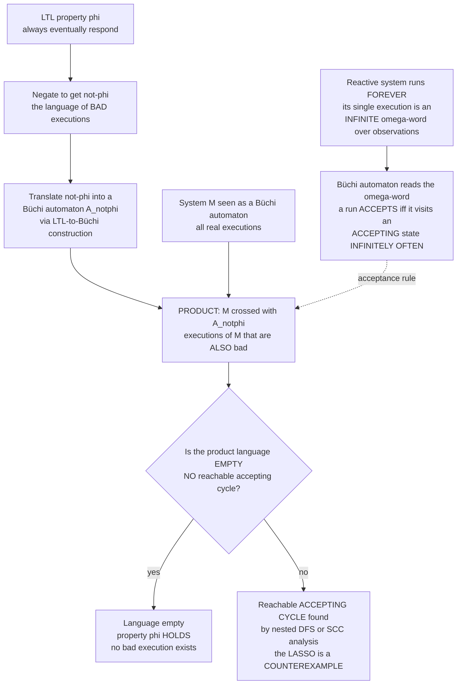

# ♾️ Automata on Infinite Words

> [!abstract] TL;DR
> A **finite-word** automaton (a **DFA/NFA**, the subject of [[Finite_Automata_DFA_and_NFA]]) reads a string, **stops**, and **accepts if it halts in a final state**. But a server, an operating-system kernel, a network protocol, or a traffic controller is *never supposed to stop* — its execution is an **infinite word** (an **ω-word**) over an alphabet of observations. So "end in a final state" is meaningless: there is no end. The fix, due to **J. R. Büchi (1962)**, is one of the most elegant moves in logic: a **Büchi automaton** reads an infinite word and **accepts a run iff that run visits some accepting state *infinitely often*** — like a train line judged *healthy* only if it keeps returning to the depot forever. These ω-automata recognize exactly the **ω-regular languages**, and they are the mathematical machinery that turns a fuzzy specification like *"the system always eventually responds"* into something a machine can **mechanically decide**. A crucial surprise breaks the finite-word intuition: **nondeterministic Büchi automata are strictly more expressive than deterministic ones** — you cannot always determinize them — which forces richer acceptance conditions (**generalized Büchi, Rabin, Streett, parity, Muller**) when determinization or complementation is needed. Their killer application is the **automata-theoretic approach to model checking** (**Vardi–Wolper**): to check a system `M` against an LTL property `φ`, **negate** `φ`, **translate** `¬φ` into a Büchi automaton, take the **product** with `M`, and ask a single graph question — *is there a reachable **accepting cycle**?* If yes, that cycle is a **lasso-shaped counterexample** — a concrete infinite execution violating `φ`; if no, the property holds. Model checking of temporal logic thereby collapses into **reachability plus cycle detection** — [[DFS]], nested DFS, and [[Strongly_Connected_Components|SCC]] analysis — with the algorithm's PSPACE-completeness flowing from the exponential LTL-to-Büchi translation.

---

## Intuition

**Analogy — the train line that must keep returning to the depot.** An ordinary automaton is like a delivery courier who reads an address (a *finite* string), drives there, **stops**, and is judged a success or failure by *where they ended up*. That model is useless for a subway line, because a subway line is *never supposed to arrive and stop* — it runs **forever**. So how do you decide whether an *endless* train schedule is "good"? You cannot look at "the final stop" — there is none. Büchi's insight is to change the question from *"where does it end?"* to *"what does it keep doing forever?"* Declare one station the **depot** (an **accepting state**). The infinite schedule is **healthy** exactly when the train **returns to the depot infinitely often** — it keeps coming back forever, no matter how far out it wanders. A schedule that visits the depot a few times and then drifts away, never to return, is **rejected**. That single rule — *accept iff some accepting state recurs infinitely often* — is the whole idea of a **Büchi automaton**, and it is precisely what lets us make mathematical sense of a **liveness** promise like *"every request is eventually served."*

Technically, an execution of a never-terminating system is an **ω-word**: an infinite sequence `a₀ a₁ a₂ …` of observed labels (which states hold, which events fire). A Büchi automaton is the *same* finite state machine as a DFA/NFA — states, transitions, a start state, a set of "good" states — but with an **infinitary acceptance condition** bolted on top: a run (an infinite path through the automaton driven by the ω-word) is **accepting** iff it passes through the good set **infinitely often**. Everything hard and beautiful about this theory comes from that one twist: finiteness of the *machine* meeting infiniteness of the *input*.

---

## How It Works

### Core Mechanics

Fix a finite alphabet `Σ` (think: the set of possible observations at one instant). An **ω-word** is an element of `Σ^ω`, an infinite sequence over `Σ`. An **ω-language** is a set of ω-words. A **(nondeterministic) Büchi automaton** is a tuple `(Q, Σ, δ, q₀, F)` — states `Q`, transitions `δ ⊆ Q × Σ × Q`, initial state `q₀`, and **accepting set** `F ⊆ Q` — read with the Büchi acceptance rule:

1. **A run** on an ω-word `w = a₀a₁a₂…` is an infinite state sequence `ρ = r₀ r₁ r₂ …` with `r₀ = q₀` and `(rᵢ, aᵢ, rᵢ₊₁) ∈ δ` for every `i`. A nondeterministic automaton may have *many* runs on the same word.
2. **`inf(ρ)`** is the set of states that occur **infinitely often** in `ρ`. Because `Q` is finite but `ρ` is infinite, `inf(ρ)` is always nonempty (pigeonhole: some state must recur forever).
3. **Büchi acceptance.** The run `ρ` is **accepting** iff `inf(ρ) ∩ F ≠ ∅` — it visits at least one accepting state **infinitely often**. A *word* is accepted iff *some* run on it is accepting.
4. **The recognized language** `L(A) ⊆ Σ^ω` is the set of accepted ω-words. A language expressible this way is called **ω-regular** — the infinite-word counterpart of the regular languages from [[Regular_Expressions_and_Kleenes_Theorem]].

**The finite-word intuition breaks — determinism is weaker.** For finite words, DFA = NFA: every nondeterministic finite automaton can be *determinized* by the subset construction. **This fails for Büchi automata.** The language *"only finitely many `a`'s"* (i.e. `FG¬a`, eventually always not-`a`) is recognized by a *nondeterministic* Büchi automaton but by **no deterministic** one — the deterministic machine cannot "guess" the moment after which `a` never recurs. So **nondeterministic Büchi are strictly more expressive than deterministic Büchi.** To recover determinizability, closure, and clean complementation, richer **acceptance conditions** are used:

- **Generalized Büchi** — several accepting sets `F₁,…,Fₖ`; accept iff *each* `Fᵢ` is hit infinitely often (convenient for the LTL translation; degeneralizes back to plain Büchi with a counter).
- **Rabin / Streett** — pairs `(Eᵢ, Fᵢ)`; Rabin accepts iff for some pair `Eᵢ` is hit finitely and `Fᵢ` infinitely; Streett is its dual. **Deterministic Rabin/Streett** capture all ω-regular languages.
- **Parity** — states carry integer priorities; accept iff the *least* (or greatest) priority seen infinitely often is even. Parity is the **algorithmic sweet spot** — deterministic parity automata capture ω-regular languages and parity *games* underlie synthesis and μ-calculus checking.
- **Muller** — an explicit list of *exactly which* recurring sets are accepting; maximally expressive, used in theory (McNaughton's theorem: NBA determinize to deterministic Muller/Rabin/parity).

**Witnesses are finite — the lasso.** A foundational fact makes everything computable: **every nonempty ω-regular language contains an *ultimately periodic* word** `u·v^ω` — a finite **stem** `u` followed by a finite **cycle** `v` repeated forever. Its run has a **lasso** shape: a finite tail into a repeating loop. So even though the objects are infinite, **counterexamples are finite data** — a stem plus a loop — which is exactly what a model checker prints when it finds a bug.

**The automata-theoretic model-checking pipeline (Vardi–Wolper).** This is where ω-automata earn their keep. To decide whether a system `M` satisfies an LTL property `φ`:

1. **Negate.** Build `¬φ`, whose language is the set of **bad** executions (those violating `φ`).
2. **Translate.** Convert `¬φ` into a Büchi automaton `A_{¬φ}` recognizing exactly those bad ω-words. (This step is where the blow-up lives: `A_{¬φ}` can be **exponential** in `|φ|`.)
3. **Product.** Form `M ⊗ A_{¬φ}`, whose runs are executions of `M` that are *also* accepted by `A_{¬φ}` — i.e. real system behaviors that are bad.
4. **Emptiness check.** Ask: is `L(M ⊗ A_{¬φ}) = ∅`? By the lasso fact, the product is **nonempty iff it has a reachable cycle that passes through an accepting state.** Find one with **nested depth-first search** or **[[Strongly_Connected_Components|SCC]] analysis**; the lasso you extract is a **counterexample**. If it is empty, **no bad behavior exists** — the property **holds**.

This reduces the whole of LTL model checking to **graph reachability + cycle detection**. Its worst-case cost — **PSPACE-complete** for LTL — comes not from the graph search (linear in the product) but from the *exponential* automaton in step 2, and the product is only ever built *on the fly*. **Complementation** of Büchi automata (needed if you were handed the property automaton directly instead of `φ`) is notoriously hard: the state blow-up is `2^{O(n log n)}`, a bound that is essentially tight.

### Flow / Architecture



*The pipeline: an endless execution is an ω-word; Büchi acceptance ("accepting state infinitely often") gives it meaning; the LTL property is negated, translated to a Büchi automaton, and producted with the system; the model-checking core is a single emptiness question — a reachable accepting cycle is a lasso counterexample, its absence a proof.*

---

## Key Concepts

### Secondary (intuitive, no advanced background needed)

- **Infinite runs need a new "accept."** A normal automaton stops and checks its last state. A system that runs forever has no last state, so we ask what it does *forever* instead of *at the end*.
- **Visit the depot infinitely often.** A Büchi automaton accepts an endless run when it keeps returning to a special "good" state again and again, without end — the depot analogy.
- **Liveness vs safety, informally.** *Safety* = "nothing bad ever happens" (a finite prefix already violates it). *Liveness* = "something good eventually keeps happening" — genuinely about the infinite future, exactly what Büchi acceptance captures.
- **The lasso.** A bug in an endless system is reported as a **stem** (how you get into trouble) plus a **loop** (the bad behavior repeating forever) — a finite picture of an infinite misbehavior.

### Undergraduate (a first course)

- **ω-words and ω-languages** — `Σ^ω` is the set of infinite sequences over `Σ`; ω-automata recognize subsets of it, the **ω-regular** languages, the infinitary sibling of the regular languages in [[Regular_Expressions_and_Kleenes_Theorem]].
- **Büchi acceptance formally** — `inf(ρ) ∩ F ≠ ∅`: the set of infinitely-recurring states meets the accepting set. Contrast squarely with DFA acceptance `δ*(q₀, w) ∈ F` from [[Finite_Automata_DFA_and_NFA]].
- **NBA ≠ DBA** — nondeterministic Büchi are *strictly* stronger than deterministic; `FG¬a` is the standard witness. This is the single most important departure from the finite-word world.
- **ω-regular = LTL-expressible ∪ more** — every LTL formula defines an ω-regular language, but LTL is a *strict subset* of ω-regular (LTL = star-free / first-order-definable ω-languages); properties like *"`p` holds at every even position"* are ω-regular but not LTL.
- **Emptiness = reachable accepting cycle** — the algorithmic heart: `L(A) ≠ ∅` iff some accepting state lies on a cycle reachable from the start. Decidable by **nested DFS** or by finding an accepting state inside a nontrivial **[[Strongly_Connected_Components|SCC]]**.
- **The Vardi–Wolper recipe** — negate `φ`, translate to `A_{¬φ}`, product with `M`, check emptiness; a found lasso is a counterexample.

### Graduate (advanced)

- **Closure and the complementation cost** — ω-regular languages are closed under union, intersection, and complement, but Büchi **complementation** is `2^{O(n log n)}` (Safra-style / rank-based constructions; a tight lower bound of the same order). Intersection with a *deterministic* system is cheap; complementing a *nondeterministic* property automaton is the expensive corner you avoid by negating `φ` at the *logic* level instead.
- **Acceptance-condition hierarchy** — Büchi ⊂ generalized Büchi ≡ Büchi (degeneralization), and deterministic **Rabin/Streett/parity/Muller** all capture ω-regular; **McNaughton's theorem** gives NBA → deterministic Muller. **Parity** is preferred algorithmically (memoryless determinacy of parity games; the engine behind μ-calculus model checking and reactive synthesis).
- **On-the-fly emptiness** — the product `M ⊗ A_{¬φ}` is never materialized; **nested DFS** (Courcoubetis–Vardi–Wolper–Yannakakis) explores it lazily in `O(|M|·|A_{¬φ}|)` time and *linear* space, or **Tarjan-style SCC** decomposition (Couvreur, generalized-Büchi variants) finds an accepting SCC — the two dominant strategies in SPIN and in symbolic tools.
- **Complexity accounting** — LTL model checking is **PSPACE-complete** ([[Space_Complexity_and_PSPACE]]); the exponential is entirely in `|A_{¬φ}| = 2^{O(|φ|)}` from the LTL-to-Büchi translation, while the graph search is linear in the (exponential) product — hence PSPACE, not EXPTIME.
- **LTL-to-Büchi translations** — the classic tableau/closure construction, and the far leaner **alternating-automata** route (LTL → very-weak alternating Büchi → NBA, the basis of `ltl2ba`/Spot), which keeps state counts small in practice.
- **Branching-time contrast** — CTL/CTL\* and the modal **μ-calculus** are checked via **tree automata** and **parity games** rather than word automata; the linear-vs-branching split governs which automaton model applies (see the sibling `Linear_and_Branching_Temporal_Logic`).
- **Büchi's theorem (S1S)** — Büchi introduced these automata to prove that the **monadic second-order logic of one successor (S1S)** is decidable, by showing S1S-definable = ω-regular; ω-automata are the decision procedure for a whole logic, not just a model-checking gadget.

---

## Python Demo

Two experiments capture the whole story. **(a) Büchi acceptance on a lasso word.** A lasso `stem · loop^ω` is the shape of *every* ultimately-periodic ω-word. For a **deterministic** Büchi automaton the run is itself ultimately periodic, so acceptance reduces to a finite check: does the **recurring** part of the run touch an **accepting** state (i.e. hit it *infinitely often*)? We build the "infinitely-many `a`" automaton and test three words. **(b) Emptiness = reachable accepting cycle.** We take the product of a tiny system with a negated-property Büchi automaton and run the **model-checking core**: a **nested DFS** that hunts for a reachable **accepting cycle**. Scenario A has one — the lasso it returns is a **liveness counterexample**; scenario B has none — the language is **empty**, so the property **holds**. We visualize both the lasso acceptance and the two product graphs. `numpy` + `matplotlib`.

```python
# Automata on infinite words: Büchi acceptance + the automata-theoretic
# model-checking core (emptiness = reachable accepting cycle).
#
# (a) BÜCHI ACCEPTANCE ON A LASSO WORD.
#     A lasso word  stem . loop^omega  is the shape of every ultimately-periodic
#     infinite word. For a DETERMINISTIC Büchi automaton the run is itself
#     ultimately periodic, so acceptance reduces to: does the RECURRING part of
#     the run visit an ACCEPTING state (i.e. infinitely often)?
#
# (b) EMPTINESS = REACHABLE ACCEPTING CYCLE.
#     The product of a system and a (negated-)property Büchi automaton is
#     non-empty iff it has a reachable cycle through an accepting state.
#     A nested DFS finds one -> that lasso is a COUNTEREXAMPLE (a liveness
#     violation). No accepting cycle -> language empty -> property holds.
#
# numpy + matplotlib only.

import numpy as np
import matplotlib.pyplot as plt

# =================================================================== #
# (a) Büchi acceptance on a lasso word (deterministic automaton)      #
# =================================================================== #

def buchi_accepts_lasso(delta, init, accept, stem, loop):
    """Decide Büchi acceptance of the ultimately-periodic word stem . loop^omega.
    delta : dict[(state, symbol)] -> state   (deterministic, total)
    Returns (accepted, recurring_states)."""
    s = init
    for sym in stem:                       # run the finite stem
        s = delta[(s, sym)]

    # Read the loop repeatedly. Deterministic automaton + fixed loop => the
    # state at each loop-start eventually repeats, so the run is ultimately
    # periodic. Track loop-start states to detect the period.
    seen, iters = {}, []                   # loop-start state -> index ; states per iter
    while s not in seen:
        seen[s] = len(iters)
        visited, cur = [], s
        for sym in loop:
            cur = delta[(cur, sym)]
            visited.append(cur)
        iters.append(visited)
        s = cur                            # state entering the next loop iteration

    # Iterations from seen[s] onward repeat forever -> their states recur
    # infinitely often. Acceptance = some recurring state is accepting.
    start = seen[s]
    loop_start_states = list(seen.keys())
    recurring = set(loop_start_states[start:])
    for vis in iters[start:]:
        recurring.update(vis)
    return (len(recurring & accept) > 0), recurring

def run_prefix(delta, init, stem, loop, nsteps):
    """State sequence of the run for nsteps, for plotting the (in)finite run."""
    s, states = init, [init]
    for i in range(nsteps):
        sym = stem[i] if i < len(stem) else loop[(i - len(stem)) % len(loop)]
        s = delta[(s, sym)]
        states.append(s)
    return np.array(states)

# "infinitely-many a" DBA over {a, b}: state 1 (accepting) reached exactly on 'a'.
# So state 1 recurs infinitely often  <=>  'a' occurs infinitely often  ==  GF a.
delta_a = {(0, 'a'): 1, (0, 'b'): 0, (1, 'a'): 1, (1, 'b'): 0}
init_a, accept_a = 0, {1}

tests = [
    ("(ab)^w",  [],          ['a', 'b']),   # infinitely many a -> ACCEPT
    ("b^w",     [],          ['b']),        # no a at all        -> reject
    ("aab^w",   ['a', 'a'],  ['b']),        # finitely many a    -> reject
]
print("=== (a) Büchi acceptance on lasso words (property: infinitely-many a) ===")
for name, stem, loop in tests:
    ok, rec = buchi_accepts_lasso(delta_a, init_a, accept_a, stem, loop)
    print(f"  {name:8s}  stem={stem!s:10s} loop={loop!s:10s} "
          f"recurring={sorted(rec)}  ->  {'ACCEPT' if ok else 'reject'}")

# =================================================================== #
# (b) Emptiness of a product = reachable accepting cycle (nested DFS) #
# =================================================================== #

def nested_dfs(succ, start, accept):
    """CVWY-style nested DFS for Büchi emptiness.
    Returns (seed, cycle_path, stem_path) for a reachable accepting cycle,
    else None (language empty). succ: dict[node] -> list of successor nodes."""
    blue, red, parent = set(), set(), {start: None}

    def stem_to(node):
        p, cur = [], node
        while cur is not None:
            p.append(cur); cur = parent[cur]
        return p[::-1]

    def red_dfs(v, seed):                  # inner: seek a path back to `seed`
        red.add(v)
        for w in succ.get(v, []):
            if w == seed:
                return [w]
            if w not in red:
                sub = red_dfs(w, seed)
                if sub is not None:
                    return [w] + sub
        return None

    def blue_dfs(v):                       # outer: explore, then close cycles
        blue.add(v)
        for w in succ.get(v, []):
            if w not in blue:
                parent[w] = v
                r = blue_dfs(w)
                if r is not None:
                    return r
        if v in accept:                    # accepting state on the DFS stack?
            cyc = red_dfs(v, v)            # can it reach itself? -> accepting cycle
            if cyc is not None:
                return (v, cyc, stem_to(v))
        return None

    return blue_dfs(start)

# Scenario A -- a BUGGY product: accepting state p2 sits on a reachable cycle.
#   p0 -> p1 -> p2 -> p1 -> p2 -> ...   accept = {p2}  => accepting cycle exists.
succ_A   = {'p0': ['p1'], 'p1': ['p2'], 'p2': ['p1']}
accept_A = {'p2'}

# Scenario B -- a CORRECT product: accepting state r2 is a sink, the only cycle
#   r0 <-> r1 contains NO accepting state  =>  no reachable accepting cycle.
succ_B   = {'r0': ['r1'], 'r1': ['r0', 'r2'], 'r2': []}
accept_B = {'r2'}

print("\n=== (b) Model-checking core: emptiness = reachable accepting cycle ===")
resA = nested_dfs(succ_A, 'p0', accept_A)
resB = nested_dfs(succ_B, 'r0', accept_B)
if resA:
    seed, cyc, stem = resA
    print(f"  Scenario A: ACCEPTING CYCLE found -> property VIOLATED (counterexample)")
    print(f"             lasso stem = {' -> '.join(stem)} ,  loop = {seed} -> "
          f"{' -> '.join(cyc)}  (repeat forever)")
print(f"  Scenario B: {'accepting cycle' if resB else 'NO accepting cycle -> language EMPTY -> property HOLDS'}")

# =================================================================== #
# Visualization                                                       #
# =================================================================== #

def draw_digraph(ax, pos, edges, accept, start, highlight=None, title=""):
    highlight = set(highlight or [])
    edgeset = set(edges)
    for (u, v) in edges:
        x1, y1 = pos[u]; x2, y2 = pos[v]
        hl = (u, v) in highlight
        color = 'crimson' if hl else '#7f7f7f'
        lw = 2.8 if hl else 1.5
        rad = 0.28 if (v, u) in edgeset and u != v else 0.0   # curve if bidirectional
        ax.annotate("", xy=(x2, y2), xytext=(x1, y1),
                    arrowprops=dict(arrowstyle='-|>', color=color, lw=lw,
                                    shrinkA=15, shrinkB=15,
                                    connectionstyle=f"arc3,rad={rad}"))
    for n, (x, y) in pos.items():
        fc = '#55A868' if n in accept else '#e6e6e6'
        ax.add_patch(plt.Circle((x, y), 0.17, fc=fc, ec='black', lw=1.7, zorder=3))
        ax.text(x, y, n, ha='center', va='center', fontsize=10, fontweight='bold', zorder=4)
        if n == start:
            ax.annotate("", xy=(x - 0.17, y), xytext=(x - 0.6, y),
                        arrowprops=dict(arrowstyle='-|>', color='black', lw=1.6))
    xs = [p[0] for p in pos.values()]; ys = [p[1] for p in pos.values()]
    ax.set_xlim(min(xs) - 0.9, max(xs) + 0.6)
    ax.set_ylim(min(ys) - 0.9, max(ys) + 0.9)
    ax.set_aspect('equal'); ax.axis('off'); ax.set_title(title, fontsize=10)

fig, ax = plt.subplots(2, 2, figsize=(13, 9))

# (a1) accepted lasso  (ab)^w : state 1 (accepting) recurs forever
run_acc = run_prefix(delta_a, init_a, [], ['a', 'b'], 16)
t = np.arange(len(run_acc))
ax[0, 0].step(t, run_acc, where='post', lw=2.0, color="#4C72B0")
acc_hits = t[run_acc == 1]
ax[0, 0].scatter(acc_hits, np.ones_like(acc_hits), color='crimson', zorder=5,
                 label='accepting-state visit')
ax[0, 0].axhspan(0.92, 1.08, color='#55A868', alpha=0.12)
ax[0, 0].set_yticks([0, 1]); ax[0, 0].set_yticklabels(['q0', 'q1 (accept)'])
ax[0, 0].set_title("(a) ACCEPTED lasso  (ab)^w\n"
                   "q1 visited INFINITELY OFTEN -> Büchi accepts")
ax[0, 0].set_xlabel("position in the infinite run  ->"); ax[0, 0].legend(loc='center right')
ax[0, 0].grid(alpha=0.3)

# (a2) rejected lasso  b^w : run trapped in q0, accepting state never recurs
run_rej = run_prefix(delta_a, init_a, [], ['b'], 16)
ax[0, 1].step(t, run_rej, where='post', lw=2.0, color="#C44E52")
ax[0, 1].axhspan(0.92, 1.08, color='#55A868', alpha=0.12)
ax[0, 1].set_yticks([0, 1]); ax[0, 1].set_yticklabels(['q0', 'q1 (accept)'])
ax[0, 1].set_ylim(-0.15, 1.15)
ax[0, 1].set_title("(a) REJECTED lasso  b^w\n"
                   "q1 never recurs -> Büchi rejects")
ax[0, 1].set_xlabel("position in the infinite run  ->"); ax[0, 1].grid(alpha=0.3)

# (b1) Scenario A product: reachable accepting cycle = counterexample
pos_A = {'p0': (0, 0), 'p1': (1, 0), 'p2': (2, 0)}
edges_A = [('p0', 'p1'), ('p1', 'p2'), ('p2', 'p1')]
draw_digraph(ax[1, 0], pos_A, edges_A, accept_A, 'p0',
             highlight=[('p1', 'p2'), ('p2', 'p1')],
             title="(b) Scenario A: PRODUCT with a reachable ACCEPTING CYCLE (red)\n"
                   "lasso p0->p1 then loop p1<->p2 -> COUNTEREXAMPLE (property violated)")

# (b2) Scenario B product: accepting sink, only non-accepting cycle -> empty
pos_B = {'r0': (0, 0), 'r1': (1, 0), 'r2': (2, 0)}
edges_B = [('r0', 'r1'), ('r1', 'r0'), ('r1', 'r2')]
draw_digraph(ax[1, 1], pos_B, edges_B, accept_B, 'r0',
             title="(b) Scenario B: accepting state r2 is a SINK\n"
                   "only cycle r0<->r1 has no accepting state -> language EMPTY -> property HOLDS")

fig.suptitle("Automata on infinite words: Büchi acceptance (infinitely often) "
             "and emptiness = reachable accepting cycle", fontsize=13)
fig.tight_layout()
plt.savefig("buchi_omega_automata_model_checking.png", dpi=120)
print("\nSaved figure to buchi_omega_automata_model_checking.png")
```

**What it shows.** Part (a) prints `ACCEPT` for `(ab)^ω` (the accepting state `q1` sits in the recurring part, so it is hit infinitely often), and `reject` for both `b^ω` (never accepting) and `aab^ω` (accepting only *finitely* often) — the essence of Büchi acceptance, decided on finite lasso data. Panels (a1)/(a2) plot the run as a step function over positions: for `(ab)^ω` the run keeps bouncing up to `q1` forever (red dots recurring without end), while for `b^ω` it is trapped in `q0` and `q1` never recurs. Part (b) runs the **model-checking core**: **Scenario A** returns a reachable accepting cycle and reconstructs the **lasso counterexample** `p0 → p1` then `p1 ⇄ p2` forever — a concrete infinite execution that violates the liveness property; **Scenario B** finds **no accepting cycle** (the accepting state is a sink, the only loop is non-accepting), so the product language is **empty** and the property **holds**. Panels (b1)/(b2) draw the two product automata with the offending accepting cycle highlighted in red — the exact object a real model checker like SPIN hunts for with nested DFS.

---

## Real-World Applications

> **Example — SPIN and the on-the-fly nested-DFS core.** Gerard Holzmann's **SPIN** model checker (used to verify flight-control and mission-critical protocol software at NASA JPL, and a 2001 ACM Software System Award winner) is the automata-theoretic pipeline made industrial. You write the system in Promela and a property in LTL; SPIN translates the *negated* LTL to a **Büchi automaton**, forms the **product** with the system's state graph, and runs a **nested depth-first search** *on the fly* — generating product states lazily so it never stores the whole space. The instant it finds a reachable **accepting cycle**, it prints the **lasso** as an executable counterexample trail. Bitstate hashing and partial-order reduction let it push the reachable-state count into the billions. This is precisely the `nested_dfs` in the demo, scaled up.

- **Liveness and fairness verification of protocols** — cache-coherence, mutual-exclusion, and leader-election protocols are checked for *"every request is eventually granted"* and *"the token keeps circulating"* — pure liveness, only expressible via infinitely-often acceptance. The distributed-systems analogue is exercised by tools in the sibling `Formal_Verification_TLA_Plus` note ([[Formal_Verification_TLA_Plus]]), whose TLC checker verifies temporal (liveness) properties over infinite behaviors.
- **Reactive synthesis** — going beyond *checking* to *building*: from an LTL/ω-regular specification, synthesis derives a correct-by-construction controller by solving a **parity game** on a deterministic ω-automaton (tools like Strix, ltlsynt). The determinization that Büchi automata *cannot* always achieve is exactly why parity/Rabin automata are essential here.
- **Runtime verification / monitoring** — a Büchi (or its finite-trace cousin) automaton compiled from a temporal spec runs *alongside* a live system, flagging violations of *"always eventually"* patterns in logs and telemetry.
- **Hardware and RTL property checking** — SystemVerilog Assertions and PSL properties over infinite clock cycles compile to ω-automata; the product-with-emptiness check is the semantic backbone even where the industrial engine is symbolic/BDD- or SAT-based (the prose siblings `Symbolic_Model_Checking_and_BDDs` and `Bounded_Model_Checking`).
- **Decision procedures for logic** — Büchi automata are the *algorithm* behind the decidability of **S1S** and of LTL satisfiability: to test whether a temporal spec is even self-consistent, translate it to a Büchi automaton and check nonemptiness (a reachable accepting cycle).

---

## Common Pitfalls

- **Treating ω-automata like DFAs on long strings.** ω-automata read *genuinely infinite* words, and acceptance is *not* "end in a final state" — there is no end. It is **visit an accepting state *infinitely often***. Carrying over finite-word intuitions from [[Finite_Automata_DFA_and_NFA]] silently produces wrong reasoning about liveness.
- **Assuming you can determinize.** The reflex "just apply the subset construction" fails: **nondeterministic Büchi are strictly more expressive than deterministic** (`FG¬a` is the canonical counterexample). When you *need* a deterministic machine — for complementation, for synthesis, for games — you must move to **Rabin/Streett/parity/Muller**, not deterministic Büchi.
- **Underestimating complementation.** Complementing a Büchi automaton costs `2^{O(n log n)}` states — far worse than the finite-word `2^n` subset construction, and essentially tight. This is *why* model checking negates the property at the **logic** level (`¬φ`) rather than complementing the property *automaton*.
- **Forgetting the "infinitely often" quantifier.** *"`q1` is visited"* is not acceptance; *"`q1` is visited **infinitely often**"* is. A run that touches an accepting state a million times and then never again is **rejected** — the demo's `aab^ω` case makes this concrete.
- **Losing the lasso witness.** Every nonempty ω-regular language has an **ultimately periodic (lasso)** member, so counterexamples are finite stem+loop objects. Report tools that "find a bad state" without the *loop* have not actually witnessed a **liveness** violation — you need the repeating cycle, not just reachability.
- **Confusing safety with liveness.** A **safety** violation is a *finite* bad prefix (reachability suffices). A **liveness** violation *requires* an infinite witness — a reachable **accepting cycle**. Mixing them leads to checking the wrong thing with the wrong algorithm; the automata-theoretic method handles both uniformly only because the accepting-cycle test subsumes plain reachability.
- **Believing LTL = ω-regular.** LTL is a *proper subset* of the ω-regular languages (the star-free / first-order fragment). Properties like *"`p` at every even step"* are ω-regular but **not** LTL-expressible — reach for ω-regular expressions, the μ-calculus, or an automaton written directly.
- **Blaming the graph search for PSPACE.** The emptiness check (nested DFS / SCC) is *linear* in the product. The exponential — and the PSPACE-completeness ([[Space_Complexity_and_PSPACE]]) — lives entirely in the **LTL-to-Büchi translation** (`2^{O(|φ|)}` states). Optimizing the graph algorithm without shrinking the automaton misses the real cost.

---

## Related Concepts

- [[Finite_Automata_DFA_and_NFA]] — the **finite-word** foundation; ω-automata are the *same machines* (states, transitions, start, accepting set) with acceptance changed from "end in `F`" to "hit `F` infinitely often." Read this first.
- [[Regular_Expressions_and_Kleenes_Theorem]] — regular languages and their algebra; **ω-regular** languages generalize them (adding the `ω`-power operator), and Büchi automata are their acceptors.
- [[Applications_of_Finite_Automata]] — the finite-word application catalogue (lexing, search, protocols); model checking of endless systems is the *infinite-word* entry in that same family of ideas.
- [[Modal_and_Temporal_Logic]] — **LTL** is the specification logic that the pipeline translates into a Büchi automaton; the modal/temporal operators (`G`, `F`, `X`, `U`) are exactly what "infinitely often" acceptance was invented to capture.
- [[DFS]] — depth-first search is the engine of the emptiness check; **nested DFS** (two interleaved DFS passes) detects the reachable accepting cycle in linear time and space.
- [[Strongly_Connected_Components]] — the alternative emptiness test: `L(A) ≠ ∅` iff an accepting state lies in a **nontrivial SCC** reachable from the start; Tarjan/Couvreur SCC algorithms are the SCC-based counterpart to nested DFS.
- [[Space_Complexity_and_PSPACE]] — LTL model checking is **PSPACE-complete**; the classification comes from the exponential automaton met by a linear, small-space graph search.
- [[Formal_Methods_Overview]] — the parent map; ω-automata are the semantic core of pillar-3 model checking, sitting beneath every temporal-logic verifier.
- [[SAT_Solving_and_DPLL]] — **bounded model checking** unrolls the same accepting-lasso search to a fixed depth and hands it to a SAT solver — an alternative back-end for the identical emptiness question.
- [[Formal_Verification_TLA_Plus]] — a working temporal-logic model checker (TLA+/TLC) whose liveness checking rests on exactly this reachable-accepting-cycle machinery over infinite behaviors.
- [[Theory_of_Computation_Overview]] — the home of finite-word automata theory; this note is its infinite-word, model-checking-applied companion.

*(Formal Methods siblings referenced in prose, built out in adjacent notes: `Linear_and_Branching_Temporal_Logic`, `Model_Checking_Fundamentals`, `Symbolic_Model_Checking_and_BDDs`, `Bounded_Model_Checking`, `State_Based_Modeling_and_Invariants`.)*

---

## Review Questions

### Secondary

1. Using the "train line and the depot" analogy, explain why "accept if you end in a good state" makes no sense for a system that never stops, and what rule replaces it.
2. A bug in an endless system is reported as a **stem** plus a **loop** (a lasso). In plain words, what does each of the two parts represent about the misbehavior?
3. The demo accepts the word `(ab)^ω` but rejects `aab^ω`. Both contain the letter `a`. Why does one pass and the other fail?

### Undergraduate

1. State the Büchi acceptance condition formally using `inf(ρ)`, and contrast it precisely with DFA acceptance `δ*(q₀, w) ∈ F`. Why must `inf(ρ)` always be nonempty?
2. Give the standard example showing **nondeterministic Büchi automata are strictly more expressive than deterministic ones**, and explain intuitively why the deterministic machine cannot recognize that language.
3. Describe the four steps of the **Vardi–Wolper** pipeline for checking a system `M` against an LTL property `φ`. At which step does the exponential blow-up occur, and why is the final emptiness test nonetheless only linear in the product?

### Graduate

1. Emptiness of a Büchi automaton reduces to finding a reachable accepting cycle. Describe **both** the nested-DFS and the SCC-based algorithms, and argue why each runs in time linear in the product automaton.
2. Explain why **Büchi complementation** costs `2^{O(n log n)}` and how the automata-theoretic method *sidesteps* it by negating `φ` at the logic level. Then explain why **synthesis** cannot sidestep determinization, and which acceptance condition (Rabin/Streett/parity/Muller) it turns to and why.
3. LTL model checking is PSPACE-complete while the graph search is linear. Locate the exponential precisely, and explain why the overall complexity lands in **PSPACE** rather than **EXPTIME**. How does the alternating-automata LTL-to-Büchi route help in practice?

---

## Sources

- J. R. Büchi. "On a Decision Method in Restricted Second Order Arithmetic," *Proc. International Congress on Logic, Methodology and Philosophy of Science 1960* (Stanford Univ. Press, 1962) — the **original** paper introducing Büchi automata and proving S1S decidable via ω-automata. <https://doi.org/10.1007/978-1-4613-8928-6_23>
- M. Y. Vardi, P. Wolper. "An Automata-Theoretic Approach to Automatic Program Verification," *LICS 1986* — the foundational statement of the **negate → translate → product → emptiness** model-checking pipeline. <https://doi.org/10.1109/LICS.1986.9022> (see also Vardi–Wolper, *Information and Computation* 115(1), 1994, "Reasoning about Infinite Computations").
- W. Thomas. "Automata on Infinite Objects," in *Handbook of Theoretical Computer Science, Vol. B* (Elsevier, 1990), pp. 133–191 — the standard survey of ω-automata, acceptance conditions, and ω-regular languages.
- C. Baier, J.-P. Katoen. *Principles of Model Checking* (MIT Press, 2008), ch. 4–5 — the definitive textbook treatment of Büchi automata, the LTL-to-Büchi translation, nested DFS, and the persistence/liveness checking algorithms.
- C. Courcoubetis, M. Vardi, P. Wolper, M. Yannakakis. "Memory-Efficient Algorithms for the Verification of Temporal Properties," *Formal Methods in System Design* 1, 1992 — the **nested depth-first search** algorithm at the heart of SPIN. <https://doi.org/10.1007/BF00121128>

---

#formal-methods #buchi-automata #omega-automata #ltl-model-checking #liveness
