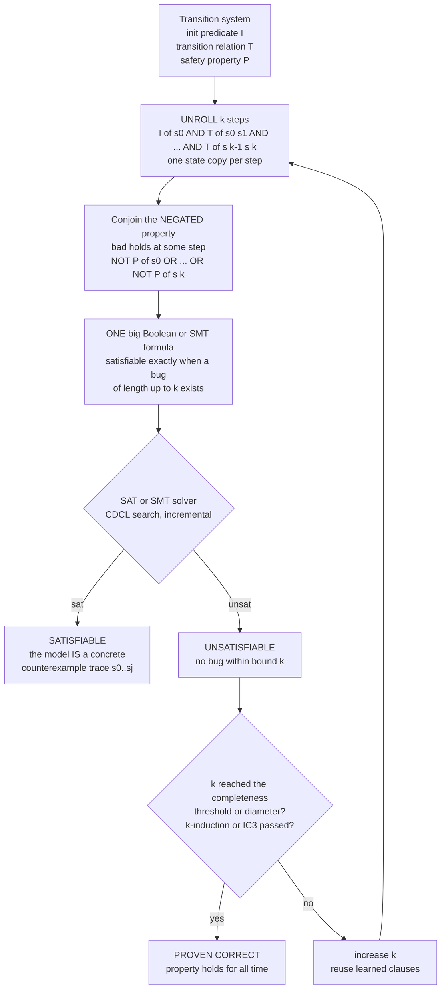

# 🔍 Bounded Model Checking

> [!abstract] TL;DR
> **Bounded Model Checking (BMC)** trades an impossible question for a tractable one. Instead of asking *"is this system correct for ALL time?"* — often undecidable or astronomically expensive — it asks *"can anything go wrong within the next `k` steps?"* To answer, it **unrolls** the system's transition relation `k` times into **one giant logical formula** that is **satisfiable exactly when a bug exists within horizon `k`**, then hands that formula to a **blazing-fast SAT (or SMT) solver**. Concretely (Biere, Cimatti, Clarke, Zhu 1999 — *"Symbolic Model Checking without BDDs"*) you build `I(s0) ∧ T(s0,s1) ∧ … ∧ T(s_{k-1},s_k)` — the initial state chained through `k` transition steps — and conjoin **"the bad condition holds at some step"**; a **satisfying assignment IS a concrete counterexample trace**, while **UNSAT means no bug within bound `k`**. The catch: plain BMC is a phenomenal **bug hunter** but is **incomplete** — finding no bug at depth `k` does *not* prove correctness. The fixes turn it into a prover too: the **completeness threshold / recurrence diameter** (unroll far enough that all reachable states are covered), **k-induction** (Sheeran-Singh-Stålmarck), **interpolation** (McMillan — mine an inductive invariant from the UNSAT proof), and **IC3/PDR** (Bradley — build an inductive invariant incrementally *without any unrolling*, the modern state of the art). By riding the **SAT/SMT revolution**, BMC scales to arithmetic datapaths and large software where BDD-based symbolic model checking blows up — it is the pragmatic, SAT-powered workhorse behind tools like **CBMC** (C/C++) and **ESBMC**, and behind a mountain of hardware verification.

---

## Intuition

**Analogy — a security guard checking the next few moves, not eternity.** Suppose you run a nuclear reactor with a rulebook that must *never* be violated. The dream question is *"will this control system be safe forever?"* — but "forever" is a brutally hard, sometimes literally impossible question to answer exactly. So a pragmatic safety inspector asks something far easier: **"starting from a valid initial state, is there ANY sequence of at most 20 operations that lands the reactor in a forbidden state?"** If yes, they hand you the exact 20-step recipe for disaster — a concrete, replayable **counterexample**. If no, you at least know nothing bad happens in the next 20 moves. That bounded, answerable question is **Bounded Model Checking**.

The trick that makes it fast is to convert the whole "next 20 moves" search into **a single enormous logic puzzle**. Lay out **20 copies** of the reactor's state, side by side like frames of a film strip: frame 0, frame 1, … frame 20. Wire consecutive frames together with the machine's **transition rules** ("if frame `i` looks like this, frame `i+1` must look like that"), pin frame 0 to a legal starting state, and add one final demand: **"at least one frame shows a forbidden state."** Now the question *"can disaster happen in 20 steps?"* becomes *"is there any way to fill in all 20 frames at once obeying every rule?"* — which is **exactly a [[SAT_Solving_and_DPLL|SAT]] problem**. A satisfying assignment is a filled-in film strip: the smoking-gun counterexample. UNSAT means the film strip is impossible: no disaster within 20 frames. BMC is a **bug hunter first** — but wind the film strip out far enough (to the system's *diameter*) and "no counterexample" quietly upgrades into a **proof of eternal safety**.

---

## How It Works

### Core Mechanics

A system is a **transition system** `(I, T, P)`: a predicate `I(s)` describing **initial states**, a **transition relation** `T(s, s')` (`s'` is a legal successor of `s`), and a **safety property** `P(s)` that every reachable state should satisfy. BMC checks whether `P` can be **violated within `k` steps** by constructing one propositional (or SMT) formula and testing its satisfiability.

1. **Introduce `k+1` copies of the state variables** — `s0, s1, …, sk`. Each `s_i` is a full snapshot of the system at step `i` (in hardware, one copy of every latch/register per step; in software, the program's variables at each unrolled statement).
2. **Encode the path constraint** — pin the first frame to an initial state and chain the frames with the transition relation:
   `path_k  =  I(s0) ∧ T(s0,s1) ∧ T(s1,s2) ∧ … ∧ T(s_{k-1}, sk)`.
   A satisfying assignment to `path_k` is precisely a **valid execution of length `k`**.
3. **Encode the failure condition** — the property is *violated at some step along the path*:
   `bad_k  =  ¬P(s0) ∨ ¬P(s1) ∨ … ∨ ¬P(sk)`.
4. **Form the BMC formula** — `BMC_k  =  path_k ∧ bad_k`. This single formula is **satisfiable if and only if there is a real execution of length ≤ `k` that reaches a bad state**.
5. **Call a SAT/SMT solver.**
   - **SAT** → the returned model *is* a concrete **counterexample trace** `s0 → s1 → … → sj` (a bug, with a replayable witness). BMC naturally finds the **shortest** counterexample if you search increasing `k`.
   - **UNSAT** → **no counterexample of length ≤ `k` exists**. This is *not yet* a correctness proof — only an assurance up to horizon `k`.
6. **Bump `k` and repeat.** Increase the bound and re-solve. Because successive formulas share most of their structure, solvers run **incrementally**, reusing learned clauses across calls — the same trick that makes [[SAT_Solving_and_DPLL|CDCL]] fast.

**Why it works — riding the SAT revolution.** BMC delegates all the hard search to a modern **CDCL SAT solver** (or **[[SMT_Solving_and_Satisfiability_Modulo_Theories|SMT]]** solver for word-level reasoning over integers, bit-vectors, and arrays). This sidesteps the Achilles heel of the older **BDD-based** symbolic model checking: BDDs need a *canonical* representation of state sets and a good *variable ordering*, and they **blow up** on arithmetic datapaths (multipliers) and wide software state. SAT has no canonical-form requirement and no ordering problem — it just searches — so BMC **scales to designs where BDDs die**, and it produces **deep, concrete counterexamples** rather than abstract fixpoints.

**From bug-finder to prover — closing the incompleteness gap.** Plain BMC only ever certifies "no bug up to `k`." Four routes reach full correctness:
- **Completeness threshold (CT).** If you unroll to the system's **reachability/recurrence diameter** — the longest *loop-free* shortest path needed to reach any state — then UNSAT at that depth means the bad state is reachable at *no* depth, hence **proven safe**. The catch: the diameter can be huge and hard to compute.
- **k-induction** (Sheeran, Singh, Stålmarck 2000). Prove `P` is inductive over `k` consecutive steps: (base) no violation in the first `k` steps, and (step) if `P` held for `k` steps it holds on the `k+1`-th, *restricting to loop-free paths*. If both pass, `P` holds forever — no diameter needed.
- **Interpolation** (McMillan 2003). From the **UNSAT proof** of a BMC query, extract a **Craig interpolant** that over-approximates the reachable states — an inductive invariant strong enough to prove safety, computed *for free* from the refutation.
- **IC3 / PDR** (Bradley 2011). **Property-Directed Reachability** builds an inductive invariant **incrementally, frame by frame, with no unrolling at all** — repeatedly strengthening a sequence of over-approximations until one becomes inductive. It is the modern state of the art, often outperforming BMC-with-interpolation on hardware.

### Flow / Architecture



*The BMC loop: unroll `k` steps and conjoin the negated property into one formula whose satisfiability the solver decides. SAT yields a concrete counterexample of length ≤ `k`; UNSAT proves no bug within `k`. Only when `k` reaches the completeness threshold — or a k-induction / IC3 argument succeeds — does UNSAT upgrade to a proof of correctness for all time.*

---

## Key Concepts

### Secondary (intuitive, no advanced background needed)

- **The bounded question** — instead of *"is it safe forever?"* (hard), ask *"can it break within `k` steps?"* (answerable). BMC answers the second question extremely well.
- **Unrolling the film strip** — lay out `k+1` snapshots of the system, wire consecutive ones with the machine's rules, and demand at least one snapshot be "bad." Solvability of that puzzle = a bug exists.
- **Counterexample = the smoking gun** — when the solver says SAT, it hands back the *exact* step-by-step trace that reaches the bad state. That concreteness is what makes BMC beloved by engineers.
- **Bug-finder, not (yet) a proof** — finding no bug within 20 steps does **not** mean the system is safe forever; the bug might hide at step 21. BMC's honest default output is "no bug *so far*."

### Undergraduate (a first course)

- **Transition system `(I, T, P)`** — initial predicate, transition relation, safety property; the formal object BMC unrolls.
- **The BMC formula** — `I(s0) ∧ ⋀_{i<k} T(s_i, s_{i+1}) ∧ ⋁_{i≤k} ¬P(s_i)`; satisfiable **iff** a bad state is reachable in ≤ `k` steps.
- **Reduction to SAT** — every part of that formula is Boolean (once bits are fixed), so BMC is literally an instance of the [[NP_Completeness_and_the_Cook_Levin_Theorem|NP-complete]] SAT problem; the solver does the heavy lifting.
- **Shortest counterexample** — searching `k = 0, 1, 2, …` and stopping at the first SAT finds the **minimal-length** bug, a debugging gift.
- **SAT-based vs BDD-based** — BDDs represent state *sets* canonically and compute exact fixpoints (great for proofs, prone to blow-up); SAT-based BMC searches for a *single* faulty path (great for deep bugs, incomplete by default).
- **Incompleteness** — the fundamental limitation: absence of a bug at depth `k` ≠ correctness. Everything advanced is about repairing this.

### Graduate (advanced)

- **Completeness threshold** — the smallest `k` for which UNSAT implies unconditional safety, bounded by the **recurrence diameter** (longest loop-free path from an initial state) and the **reachability diameter** (max over states of shortest distance from init). Computing it exactly is itself hard; hence the appeal of induction-based methods.
- **k-induction** — strengthen ordinary induction to `k` consecutive states and add a **simple-path (loop-free) constraint** to make the induction step provable; a property that is not 1-inductive is often `k`-inductive for modest `k`, with **auxiliary invariants** closing the rest.
- **Craig interpolation** (McMillan) — given `A ∧ B` UNSAT, an interpolant `I` with `A ⇒ I`, `I ∧ B` UNSAT, and `I` over `A`'s and `B`'s shared variables. Iterating interpolants of BMC queries computes an **over-approximate inductive invariant** — a proof — without ever computing exact reachability.
- **IC3 / PDR** (Bradley) — maintains a monotone sequence of **over-approximating frames** `F_0 ⊇ reach_0, …`; on a counterexample-to-induction it **generalizes** blocked cubes (inductive relative to `F_{i-1}`) and pushes clauses forward until two adjacent frames coincide, yielding an inductive invariant. **No unrolling, fully incremental** — the current champion on many hardware benchmarks.
- **Word-level BMC via SMT** — instead of bit-blasting to pure SAT, encode transitions in theories of **bit-vectors, arrays, and linear arithmetic** and use an SMT solver (CDCL(T)); preserves high-level structure and often scales far better on software.
- **SAT-based vs BDD-based tradeoffs** — BDDs give *quantifier elimination* and image computation for full proofs but suffer variable-ordering fragility and datapath blow-up; SAT/SMT-based methods dominate modern model checking, complemented by **[[NP_Completeness_and_the_Cook_Levin_Theorem|abstraction-refinement]]** (CEGAR) and predicate abstraction on the software side.
- **Liveness via BMC** — safety unrolls naturally; **liveness/`ω`-regular** properties need a **loop/lasso** encoding (a reachable cycle through a fair state), turning "bad forever" into a bounded lasso-shaped counterexample.

---

## Python Demo

Two experiments make BMC's twin faces concrete. **(a) Unrolling finds deep bugs** — we take a tiny transition system (a **modular counter** that increments by a fixed stride, standing in for any finite-state machine) and encode *"reach a bad state within `k` steps"* as the unrolled reachability formula `I(s0) ∧ ⋀ T ∧ ⋁ bad`. We *decide* that formula by bounded exploration (exactly what a SAT solver does symbolically), and watch a bug that **shallow bounds miss** get caught only once `k` reaches the bug's true depth `d`. **(b) Completeness threshold** — for a *safe* system we compute the **reachability diameter** (the depth at which the reachable-state set reaches a fixpoint) and show that unrolling to the diameter with **no counterexample proves the property forever** — the k-induction / diameter idea. `numpy` + `matplotlib`.

```python
# Bounded Model Checking by unrolling into a satisfiability check.
# (a) UNROLLING catches a deep bug: a mod-16 counter (stride +3) can reach a
#     bad state only at depth d=11; BMC with bound k<d finds NOTHING (which is
#     NOT a proof!), and only k>=d exposes the concrete counterexample trace.
# (b) COMPLETENESS THRESHOLD: a safe system (stride +2 reaches only even states,
#     so the odd bad-state is unreachable). Its reachable set hits a FIXPOINT at
#     the reachability diameter; unrolling to that depth with no counterexample
#     PROVES safety for all time (the k-induction / diameter argument).
# numpy + matplotlib only.

import numpy as np
import matplotlib.pyplot as plt

N = 16  # state space {0,...,15}; a state is a full snapshot of the machine.

# ------------------------------------------------------------------ #
# BMC decision procedure: is the unrolled formula                     #
#   I(s0) AND AND_i T(s_i, s_{i+1}) AND OR_i bad(s_i)                  #
# satisfiable for horizon k? We explore the transition RELATION up to  #
# depth k (BFS with parent pointers). This bounded reachability IS what #
# a SAT solver decides on the symbolic unrolling -- run here explicitly.#
# `successors` returns a LIST, so nondeterministic relations work too.  #
# ------------------------------------------------------------------ #
def bmc(successors, init, is_bad, k):
    """Return (True, counterexample_trace) if a bad state is reachable within k
    steps, else (False, None)."""
    if is_bad(init):
        return True, [init]
    parent = {init: None}
    frontier = {init}
    for step in range(1, k + 1):
        nxt = set()
        for s in frontier:
            for t in successors(s):
                if t not in parent:
                    parent[t] = s
                    nxt.add(t)
                    if is_bad(t):                      # bad reached -> SAT
                        trace = [t]
                        while parent[trace[-1]] is not None:
                            trace.append(parent[trace[-1]])
                        return True, list(reversed(trace))
        frontier = nxt
        if not frontier:                               # no new states -> fixpoint
            break
    return False, None

def reachable_growth(successors, init, max_depth):
    """Cumulative reachable-state count at each depth 0..max_depth, plus the
    reachability diameter = last depth at which a NEW state is discovered."""
    seen, frontier, counts, diameter = {init}, {init}, [1], 0
    for step in range(1, max_depth + 1):
        nxt = {t for s in frontier for t in successors(s) if t not in seen}
        seen |= nxt
        if nxt:
            diameter = step
        counts.append(len(seen))
        frontier = nxt        # empties at the fixpoint -> counts stay constant
    return np.array(counts), diameter

# ---- (a) BUGGY system: stride +3 visits every state (gcd(3,16)=1);
#          bad = state 1, first reachable at depth 11. ----
buggy_succ = lambda s: [(s + 3) % N]
K = 20
buggy_found = np.array([1 if bmc(buggy_succ, 0, lambda s: s == 1, k)[0] else 0
                        for k in range(K + 1)])
d_bug = int(buggy_found.argmax())                      # first k with a counterexample
_, cex = bmc(buggy_succ, 0, lambda s: s == 1, K)
buggy_counts, _ = reachable_growth(buggy_succ, 0, K)

# ---- (b) SAFE system: stride +2 reaches only EVEN states; bad = 7 (odd) is
#          unreachable. Completeness threshold = reachability diameter. ----
safe_succ = lambda s: [(s + 2) % N]
safe_found = np.array([1 if bmc(safe_succ, 0, lambda s: s == 7, k)[0] else 0
                       for k in range(K + 1)])
safe_counts, CT = reachable_growth(safe_succ, 0, K)    # CT = completeness threshold

print("== (a) BUGGY system: stride +3 mod 16, bad = state 1 ==")
print(f"  shortest counterexample first found at bound k = d = {d_bug}")
print(f"  counterexample trace: {cex}")
print(f"  (bounds k < {d_bug} report 'no bug' -- which is NOT a proof of safety)")
print("\n== (b) SAFE system: stride +2 mod 16, bad = state 7 (odd, unreachable) ==")
print(f"  reachable states saturate at {safe_counts.max()} (the even states)")
print(f"  reachability diameter / completeness threshold CT = {CT}")
print(f"  UNSAT at every k, and k >= CT ({CT}) upgrades UNSAT to a PROOF of safety")

# ------------------------------------------------------------------ #
# Visualization                                                      #
# ------------------------------------------------------------------ #
ks = np.arange(K + 1)
fig, ax = plt.subplots(2, 2, figsize=(13, 9))

# (a1) bug caught only once the horizon reaches depth d
ax[0, 0].step(ks, buggy_found, where="post", lw=2.4, color="#C44E52")
ax[0, 0].fill_between(ks, buggy_found, step="post", alpha=0.2, color="#C44E52")
ax[0, 0].axvline(d_bug, ls="--", color="black", lw=1.6, label=f"bug depth d = {d_bug}")
ax[0, 0].set_title("BMC is a BUG HUNTER\n"
                   "no counterexample until the horizon k reaches the bug's depth d")
ax[0, 0].set_xlabel("unrolling bound k"); ax[0, 0].set_ylabel("counterexample found?")
ax[0, 0].set_yticks([0, 1]); ax[0, 0].set_yticklabels(["no (unknown!)", "yes (bug!)"])
ax[0, 0].legend(); ax[0, 0].grid(alpha=0.3)

# (a2) reachable-state growth for the buggy system; bad enters the set at d
ax[0, 1].plot(ks, buggy_counts, "o-", lw=2.2, color="#4C72B0")
ax[0, 1].axvline(d_bug, ls="--", color="crimson", lw=1.6,
                 label=f"bad state enters at depth {d_bug}")
ax[0, 1].set_title("Buggy system: reachable states vs unrolling depth\n"
                   "shallow bounds simply have not reached the bad state yet")
ax[0, 1].set_xlabel("unrolling depth k"); ax[0, 1].set_ylabel("reachable states so far")
ax[0, 1].legend(); ax[0, 1].grid(alpha=0.3)

# (b1) safe system: no counterexample ever; CT marks where UNSAT => PROVEN
ax[1, 0].step(ks, safe_found, where="post", lw=2.4, color="#55A868")
ax[1, 0].axvline(CT, ls="--", color="black", lw=1.8,
                 label=f"completeness threshold = {CT}")
ax[1, 0].axvspan(CT, K, alpha=0.12, color="#55A868")
ax[1, 0].text((CT + K) / 2, 0.5, "UNSAT here\n=> PROVEN safe", ha="center",
              va="center", fontsize=10, weight="bold")
ax[1, 0].set_title("SAFE system: no counterexample at any bound\n"
                   "past the completeness threshold, UNSAT PROVES correctness")
ax[1, 0].set_xlabel("unrolling bound k"); ax[1, 0].set_ylabel("counterexample found?")
ax[1, 0].set_yticks([0, 1]); ax[1, 0].set_ylim(-0.15, 1.15)
ax[1, 0].legend(loc="upper right"); ax[1, 0].grid(alpha=0.3)

# (b2) safe system reachable set reaches a FIXPOINT at the diameter = CT
ax[1, 1].plot(ks, safe_counts, "s-", lw=2.2, color="#8172B3")
ax[1, 1].axhline(safe_counts.max(), ls=":", color="gray", lw=1.2,
                 label=f"all {safe_counts.max()} reachable states")
ax[1, 1].axvline(CT, ls="--", color="black", lw=1.8,
                 label=f"diameter / CT = {CT}")
ax[1, 1].set_title("Reachable set reaches a FIXPOINT at the diameter\n"
                   "no new states past CT => unrolling further cannot find a bug")
ax[1, 1].set_xlabel("unrolling depth k"); ax[1, 1].set_ylabel("reachable states so far")
ax[1, 1].legend(loc="lower right"); ax[1, 1].grid(alpha=0.3)

fig.suptitle("Bounded Model Checking: unrolling finds deep bugs; "
             "the completeness threshold turns UNSAT into a proof", fontsize=14)
fig.tight_layout()
plt.savefig("bounded_model_checking.png", dpi=120)
print("\nSaved figure to bounded_model_checking.png")
```

**What it shows.** Panel (a1) is BMC's defining behavior: the buggy counter's forbidden state is reachable **only at depth `d = 11`**, so every bound `k < 11` returns *"no counterexample"* — and the y-axis label spells out the trap: that answer is **"unknown," not "safe."** The instant the horizon reaches `k = 11`, the solver flips to SAT and hands back the concrete 11-step trace `0 → 3 → 6 → … → 1`. Panel (a2) explains *why* shallow bounds miss it: the reachable-state set simply has not grown far enough to include the bad state. Panels (b1)/(b2) are the completeness story on a **safe** system whose bad state (an odd value) is genuinely unreachable: no counterexample appears at any bound, and the reachable set **saturates at a fixpoint** exactly at the **reachability diameter** (`CT`). That fixpoint is the punchline — once no *new* states appear, unrolling further can never surface a bug, so **UNSAT at `k ≥ CT` upgrades from "no bug so far" to a genuine proof of correctness for all time**. Together the panels capture BMC's dual identity: an unbeatable deep-bug hunter that, wound out to the diameter (or armed with k-induction / IC3), also proves.

---

## Real-World Applications

> **Example — CBMC verifying C/C++ software.** CBMC (the C Bounded Model Checker) unrolls a C program's loops and recursion a fixed number of times, converts the result to **static single assignment**, and bit-blasts the whole thing — pointers, arithmetic overflow, array bounds, assertions — into **one SAT/SMT formula**. A satisfying assignment is a concrete input plus execution path that triggers the failing assertion (a buffer overflow, a null deref, an overflow); UNSAT means no such bug exists within the unrolling bound. Amazon's s2n TLS library, the Linux kernel, and countless embedded firmware images have been checked this way. Its sibling **ESBMC** layers SMT theories on top for tighter arithmetic and concurrency reasoning.

- **Hardware verification (EDA)** — BMC is a staple of commercial property checking and equivalence checking at Intel, Synopsys, Cadence, and Siemens/Mentor. Post-Pentium-FDIV, formal checks became mandatory before tape-out; BMC finds deep corner-case bugs in pipelines, arbiters, and protocols that random simulation never reaches, and IC3/PDR closes many of them into full proofs.
- **The SAT/SMT engine underneath** — every BMC tool is only as strong as its back-end [[SAT_Solving_and_DPLL|CDCL SAT]] or [[SMT_Solving_and_Satisfiability_Modulo_Theories|SMT]] solver (MiniSat/CaDiCaL/Kissat; Z3, Bitwuzla, CVC5). BMC is one of the killer apps that drove two decades of solver progress.
- **Firmware and safety-critical embedded systems** — automotive (ISO 26262), avionics (DO-178C), and medical-device code use BMC to discharge assertion checks and arithmetic-safety obligations with concrete counterexamples engineers can debug.
- **Security bug-finding** — BMC-style symbolic unrolling underpins tools that hunt memory-safety violations and integer overflows; it also powers **concolic/whitebox fuzzing** hybrids where the unrolled path condition is solved to force execution down new branches.
- **Concurrency and protocol bugs** — bounded exploration of interleavings (context-bounded model checking) finds data races and atomicity violations that manifest only after a specific, deep schedule.

---

## Common Pitfalls

- **Mistaking "no bug at depth `k`" for correctness.** This is *the* cardinal BMC error. Plain BMC is **incomplete**: UNSAT at bound `k` only certifies the horizon `k`; the bug may lurk at `k+1`. Absence of a shallow counterexample is *not* a proof — you must reach the **completeness threshold**, or use **k-induction / interpolation / IC3**, to claim safety. Reporting "verified" after a fixed unrolling is a classic false assurance.
- **Assuming the diameter is reachable in practice.** The completeness threshold is sound but can be **astronomically large** (exponential in the state bits), and computing it exactly is itself expensive. For real systems, induction-based routes (k-induction, IC3/PDR) usually terminate far sooner — don't wait on a diameter you can never unroll to.
- **Formula blow-up from over-unrolling.** Each extra step adds a full copy of the state and the transition relation. Deep bugs need deep unrollings, and the CNF can explode. Mitigations: **incremental SAT** (reuse learned clauses across `k`), stronger encodings, abstraction, and reaching for **IC3/PDR** which needs **no unrolling at all**.
- **Bit-blasting when you should stay word-level.** Flattening 64-bit arithmetic, arrays, and memory into pure SAT is often wasteful and gigantic. **Word-level BMC via SMT** keeps structure (bit-vectors, arrays, linear arithmetic) and frequently scales dramatically better on software — use the right level.
- **Treating BMC and BDD-based model checking as rivals rather than complements.** BMC (SAT-based) is a superb **bug-finder** with deep, concrete counterexamples; BDD-based symbolic model checking is **proof-oriented** with exact fixpoints but blows up on datapaths. Modern practice combines SAT/SMT-based BMC, IC3/PDR, interpolation, and **abstraction-refinement (CEGAR)** — pick the tool per problem, not per dogma.
- **Forgetting liveness needs a lasso.** Safety unrolls into a straight path, but **liveness / `ω`-regular** properties ("something good eventually always happens") require encoding a reachable **loop (lasso)**; naively unrolling a fixed depth cannot express "forever."
- **Non-minimal or non-replayable counterexamples.** If you jump straight to a large `k` instead of searching increasing bounds, you may get a longer-than-necessary trace. Iterating `k = 0, 1, 2, …` yields the **shortest** counterexample — far easier to debug.

---

## Related Concepts

- [[Formal_Methods_Overview]] — situates BMC within the verification landscape: model checking as the automated, push-button counterpart to deductive proof.
- [[SAT_Solving_and_DPLL]] — the engine BMC rides on; the unrolled formula is handed straight to a CDCL solver, and incremental SAT is what makes bumping `k` cheap.
- [[SMT_Solving_and_Satisfiability_Modulo_Theories]] — word-level BMC encodes transitions in bit-vector/array/arithmetic theories and solves with CDCL(T) instead of bit-blasting to pure SAT.
- [[Decision_Procedures_and_Theories]] — the theory solvers (bit-vectors, arrays, linear arithmetic) that make software BMC tractable at the word level.
- [[Modal_and_Temporal_Logic]] — the language of the properties BMC checks; LTL/CTL safety and liveness specifications are what the "bad condition" encodes.
- [[State_Based_Modeling_and_Invariants]] — the transition-system `(I, T, P)` view BMC unrolls; IC3/interpolation ultimately synthesize the **inductive invariants** this note relies on.
- [[Loop_Invariants_and_Termination_Proofs]] — the deductive dual: where BMC unrolls loops a bounded number of times, invariants summarize them for unbounded proofs; k-induction bridges the two.
- [[NP_Completeness_and_the_Cook_Levin_Theorem]] — the BMC formula is a SAT instance, so bug-finding inherits SAT's NP-completeness; worst-case hardness, spectacular practical speed.
- [[The_Class_NP_and_Verification]] — "a counterexample is easy to check, hard to find" is exactly NP; a BMC witness trace is the polynomial-time-checkable certificate.
- [[Backtracking]] — the DPLL/CDCL search inside the solver, and the explicit bounded exploration in the demo, are backtracking over the unrolled state space.
- [[Logic_and_Proof_Techniques]] — ordinary mathematical induction generalizes to **k-induction**, the route that turns BMC's UNSAT into an unbounded correctness proof.
- [[Sequential_Circuits_and_FSMs]] — the finite-state hardware (latches, registers, next-state logic) that hardware BMC unrolls step by step.

*(Formal Methods siblings referenced in prose, built out in adjacent notes: `Model_Checking_Fundamentals`, `Symbolic_Model_Checking_and_BDDs`, `Abstraction_Refinement_and_CEGAR`.)*

---

## Review Questions

### Secondary

1. Using the "film strip of reactor snapshots" analogy, explain what it means for the unrolled BMC puzzle to be **solvable** versus **unsolvable**, and what each answer tells you about the reactor.
2. BMC checks 20 steps and finds no problem. A colleague concludes *"the system is proven safe."* Why is that conclusion wrong, and what would you actually be entitled to say?
3. When BMC does find a bug, why is engineers' favorite feature the **counterexample trace** rather than just a yes/no answer?

### Undergraduate

1. Write the general BMC formula for horizon `k` given `(I, T, P)`, and explain precisely why it is **satisfiable if and only if** a bad state is reachable in at most `k` steps.
2. In the demo, a bug reachable only at depth 11 is invisible to every bound `k < 11`. Explain, in terms of the **reachable-state set**, why increasing `k` eventually exposes it, and why searching `k = 0, 1, 2, …` yields the *shortest* counterexample.
3. Contrast **SAT-based BMC** with **BDD-based symbolic model checking**: which is naturally a bug-finder, which is naturally a prover, and what makes each blow up?

### Graduate

1. Define the **completeness threshold** and relate it to the recurrence and reachability **diameters**. Why does UNSAT at the completeness threshold prove unbounded safety, and why is this often impractical to reach directly?
2. Explain how **k-induction** and **Craig interpolation** each convert an incomplete BMC procedure into a complete one. What does k-induction's *simple-path (loop-free) constraint* accomplish, and where does interpolation's inductive invariant come from?
3. **IC3/PDR** builds an inductive invariant **without any unrolling**. Sketch how its frame sequence and inductive-generalization step work, and argue why avoiding unrolling can beat BMC-with-interpolation on hardware with deep counterexamples.

---

## Sources

- A. Biere, A. Cimatti, E. M. Clarke, Y. Zhu. "Symbolic Model Checking without BDDs," *TACAS 1999* — the founding paper that introduces **Bounded Model Checking** via SAT unrolling. <https://doi.org/10.1007/3-540-49059-0_14>
- M. Sheeran, S. Singh, G. Stålmarck. "Checking Safety Properties Using Induction and a SAT-Solver," *FMCAD 2000* — introduces **k-induction** for completing BMC. <https://doi.org/10.1007/3-540-40922-X_8>
- K. L. McMillan. "Interpolation and SAT-Based Model Checking," *CAV 2003* — deriving inductive invariants from UNSAT proofs via **Craig interpolation**. <https://doi.org/10.1007/978-3-540-45069-6_1>
- A. R. Bradley. "SAT-Based Model Checking without Unrolling," *VMCAI 2011* — the **IC3 / Property-Directed Reachability (PDR)** algorithm. <https://doi.org/10.1007/978-3-642-18275-4_7>
- A. Biere, M. Heule, H. van Maaren, T. Walsh (eds.). *Handbook of Satisfiability*, 2nd ed. IOS Press, 2021 — comprehensive reference including the BMC and completeness-threshold chapters.

---

#formal-methods #bounded-model-checking #sat #k-induction #ic3
