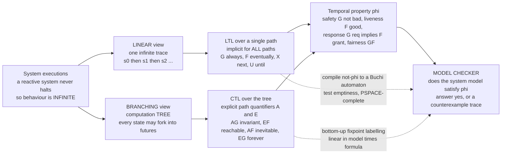

# ⏳ Linear and Branching Temporal Logic

> [!abstract] TL;DR
> Ordinary logic decides what is true **now**; the correctness of a controller, protocol, or operating-system kernel is about what happens **over time** across an unbounded execution — *the door will eventually open*, *the system never deadlocks*, *every request is always eventually granted*. **Temporal logic** is the missing vocabulary: it bolts **modalities over time** — **G** (globally/always), **F** (finally/eventually), **X** (neXt), **U** (until), **R** (release) — onto propositional logic so a machine can check timing promises. Two flavours dominate. **LTL** (Pnueli 1977) reasons about a **single infinite trace**, implicitly quantified over *all* execution paths; it states **safety** `G ¬bad`, **liveness** `F good`, **response** `G(req ⇒ F grant)`, and **fairness** `GF enabled ⇒ GF taken`. **CTL** reasons about the **branching computation tree** with explicit **path quantifiers** `A` (for **A**ll paths) and `E` (there **E**xists a path) paired with a temporal operator: `AG` (invariant everywhere), `EF` (reachable on *some* path — "possibility"), `AF` (inevitable), `EG` (some path forever). LTL and CTL are **incomparable** in expressiveness — `AG EF reset` ("from anywhere it is *possible* to reach reset") is CTL-only, while the fairness formula `GF p ⇒ GF q` is LTL-only — and **CTL\*** subsumes both. LTL model checking is **PSPACE-complete** (compile the formula to a **Büchi automaton**, then test emptiness), whereas CTL model checking is **linear** in `|model| × |formula|`. Temporal logic is the *specification language of model checking*, and in industry it hardens into **PSL** and **SystemVerilog Assertions (SVA)**.

---

## Intuition

**Analogy — words for time, not just for now.** Ordinary logic is a snapshot: "the light is red," "the buffer is full," "process 1 holds the lock." Each is a claim about a single instant, and a truth table settles it. But the systems we most need to trust never stop running — a lift, a router, a heart-pacemaker firmware — and what we care about is not any one snapshot but the *unfolding story*: "the lift door will **eventually** open," "two trains are **never** on the same track," "**every** request is **always eventually** answered." Natural language already has this vocabulary — *always, eventually, until, next, never, forever* — but it is fatally vague. Temporal logic makes those very words **precise enough for a machine to check**. It is the difference between saying "this is a good state" (a snapshot) and saying "**good things keep happening forever**" (a promise about the whole infinite run) — and the latter is exactly what matters for a system that is designed never to halt.

Once you have the words, one more question splits the field in two. When you say "eventually," do you mean *along the one run that actually happens* — a **single line** of time — or *across the whole tree of runs the system might take* when it faces nondeterministic choices? The **linear** view (LTL) treats behaviour as one infinite trace and asks whether the promise holds on it (and, by implicit universal quantification, on *every* possible trace). The **branching** view (CTL) treats behaviour as a *tree* that forks at every choice point and lets you quantify over the branches: "on **all** futures," "on **some** future." That single fork — one timeline versus a tree of timelines — is why "from every state, a **reset** is still **reachable**" is expressible in the branching logic but has no linear-time equivalent, and it is the source of the surprisingly deep differences that follow.

---

## How It Works

### Core Mechanics

**1. Why temporal logic exists — reactive systems run forever.** A batch program computes an answer and halts, so its correctness is a Hoare-triple relation between input and output. A **reactive** system (controller, protocol, OS) maintains an ongoing interaction and is *designed* not to terminate. Its behaviour is an **infinite execution** — a sequence of states `π = s₀ s₁ s₂ …`. Correctness is a property of such infinite sequences: "never enter a bad state," "always eventually respond." Plain propositional or [[First_Order_Predicate_Logic|first-order]] logic describes single states; temporal logic extends it with **modalities over the time index**.

**2. LTL — one infinite trace.** **Linear Temporal Logic** (Pnueli 1977) is evaluated at a **position `i` of a single trace `π`**. On top of the Boolean connectives it adds:
   - **X φ** (neXt): φ holds at the *next* position, `π, i+1 ⊨ φ`.
   - **F φ** (Finally / eventually): φ holds at *some* position `j ≥ i`.
   - **G φ** (Globally / always): φ holds at *every* position `j ≥ i`. Dual: `G φ ≡ ¬F ¬φ`.
   - **φ U ψ** (Until): ψ holds at some future `j ≥ i`, and φ holds at *every* position from `i` up to (but not including) `j`.
   - **φ R ψ** (Release): the dual of `U` — ψ holds up to and including the point where φ first releases it; `φ R ψ ≡ ¬(¬φ U ¬ψ)`. **Weak until** `φ W ψ ≡ (φ U ψ) ∨ G φ` allows ψ to never arrive.

   An LTL formula is a property of a *whole trace* (evaluate at `i = 0`), and a **system** satisfies it iff it holds on **every** trace the system can produce — so LTL carries an **implicit "for all paths."**

**3. CTL — the branching computation tree.** Unwind the transition system from its initial state without merging: every nondeterministic choice **forks**, producing an infinite **computation tree**. **Computation Tree Logic** places an explicit **path quantifier** before every temporal operator:
   - **A** — "for **A**ll paths out of this state"; **E** — "there **E**xists a path."
   Pairing gives the eight CTL operators; the four that matter most:
   - **AG φ** — φ holds on all states of all paths (a true **invariant**).
   - **EF φ** — some path reaches a φ-state (**reachability / possibility**).
   - **AF φ** — every path eventually hits φ (**inevitability**).
   - **EG φ** — some path keeps φ forever.
   In CTL *every* temporal operator must be immediately guarded by a path quantifier (`AG`, `EF`, …); you cannot write a bare `F p`.

**4. The taxonomy of properties.** Temporal formulas name the classic property classes:
   - **Safety** — "nothing bad ever happens": `G ¬bad` (LTL) / `AG ¬bad` (CTL). Refutable by a **finite** prefix.
   - **Liveness** — "something good eventually happens": `F good` / `AF good`. Refutable only by an **infinite** run.
   - **Response** — the workhorse pattern: `G(request ⇒ F grant)` — every request is eventually granted.
   - **Fairness** — "if a choice is enabled infinitely often it is taken infinitely often": `GF enabled ⇒ GF taken`, used to rule out pathological schedulers.

**5. Expressiveness — LTL and CTL are incomparable.** Neither subsumes the other. `AG EF reset` ("from every reachable state, a reset is still **possible**") is a **CTL** property with **no LTL equivalent** — LTL cannot say "there exists a branch." Conversely the fairness/persistence formula `GF p ⇒ GF q` (and `F G p`, "eventually permanently") is **LTL-only** — CTL cannot express the "along the same path" correlation between two liveness claims. **CTL\*** removes the pairing restriction (a path quantifier may prefix an arbitrary LTL formula) and **contains both**.

**6. Model checking and complexity.** Given a finite model `M` and a formula φ, a **model checker** decides `M ⊨ φ`, returning **yes** or a concrete **counterexample trace**.
   - **CTL** — a bottom-up fixpoint labelling of states runs in **O(|M| × |φ|)**, *linear* in the model.
   - **LTL** — compile `¬φ` to a **Büchi automaton** over infinite words, take the product with `M`, and test **language emptiness** (find a reachable accepting cycle). This is **PSPACE-complete** in the formula (linear in `|M|`, exponential in `|φ|`).
   The automata-theoretic pipeline is the bridge to the theory of computation and is developed in the sibling note *Automata_on_Infinite_Words*.

### Flow / Architecture



---

## Key Concepts

### Secondary (intuitive core)
- **Always / eventually / next / until.** *Always* p = p is true at every moment from now on. *Eventually* p = p becomes true at some future moment. *Next* p = p is true at the very next step. *p until q* = p keeps holding right up to the moment q takes over.
- **Never and forever.** "The system **never** deadlocks" = *always* not-deadlock. "Good things happen **forever**" = *always eventually* good.
- **Safety vs liveness.** *Safety* = a bad thing never happens (you can catch a violation in a finite prefix — you saw the bad state). *Liveness* = a good thing eventually happens (you can only be "still waiting," never certain it failed, from a finite prefix).
- **One line vs a tree of futures.** If the system makes choices, its future is a *tree*. "On **every** branch…" and "on **some** branch…" are different promises — that distinction is the whole point of branching-time logic.

### Undergraduate (formal machinery)
- **LTL syntax + semantics.** Formulas over atoms with `¬ ∧ ∨ ⇒` plus `X, F, G, U, R, W`. Evaluated at position `i` of a trace `π`; a trace models φ iff `π, 0 ⊨ φ`. Dualities: `G φ ≡ ¬F ¬φ`, `F φ ≡ ⊤ U φ`, `φ R ψ ≡ ¬(¬φ U ¬ψ)`.
- **CTL syntax + semantics.** State formulas built from `AX, EX, AG, EG, AF, EF, A[φ U ψ], E[φ U ψ]`. Path quantifier `A`/`E` **must** precede every temporal operator. Truth is at a *state*, defined over the branching tree.
- **Specification patterns (Dwyer et al.).** Reusable templates: **invariance** `G p`, **response** `G(p ⇒ F q)`, **precedence** `¬q W p` (p before q), **stabilization** `F G p` (eventually permanently), **existence/absence**. Most industrial specs are instances of a handful of patterns.
- **Safety/liveness/fairness in symbols.** Safety `G ¬bad` / `AG ¬bad`; liveness `F good` / `AF good`; **strong fairness** `GF en ⇒ GF taken`, **weak fairness** `FG en ⇒ GF taken`.
- **Model checking as a decision procedure.** Input: finite transition system + temporal formula. Output: satisfied, or a counterexample (a **lasso**: a finite stem plus a looping cycle — the finite witness of an infinite bad run).

### Graduate (the hard subtleties)
- **LTL/CTL incomparability, formally.** `AG EF p` is not equivalent to any LTL formula (LTL cannot quantify existentially over branches — its models are trace sets closed under a "linear" reading). `A[GF p ⇒ GF q]` and `A F G p` have no CTL equivalents. **CTL\*** (Emerson–Halpern) drops CTL's pairing restriction and strictly contains LTL ∪ CTL; the **μ-calculus** subsumes CTL\*.
- **Complexity gap.** LTL satisfiability and model checking are **PSPACE-complete** (via Büchi automata of size `2^{O(|φ|)}`; see [[Space_Complexity_and_PSPACE]]). CTL model checking is **P** — precisely `O(|M|·|φ|)` by iterative fixpoint labelling (`EF` = least fixpoint / backward reachability, `EG` = greatest fixpoint / cycle detection). Counter-intuitively the *branching* logic is *cheaper* to check.
- **Automata on infinite words.** Every LTL formula is equivalent to a **nondeterministic Büchi automaton** (ω-regular); model checking = emptiness of the product of system and `¬φ`-automaton (find a reachable accepting cycle). Generalizes [[Finite_Automata_DFA_and_NFA|finite automata]] from finite to ω-words. Not every Büchi-recognizable ω-language is LTL-definable — LTL is exactly the **star-free / first-order-definable** ω-languages (Kamp's theorem: LTL ≡ FO over `(ℕ, <)`).
- **Safety/liveness topology (Alpern–Schneider).** Over the space of infinite traces, **safety** properties are the **closed** sets and **liveness** the **dense** sets; **every** property is the intersection of a safety and a liveness property. This is the rigorous root of the informal split.
- **Fairness as a first-class assumption.** Realistic liveness holds only under fairness (no process is starved forever). In LTL, fairness is stated *inside* the formula (`fair ⇒ φ`); in CTL it cannot be expressed and must be handled as **fair-CTL** (fairness constraints in the checker), a genuine expressiveness limitation.
- **Stuttering and `X`.** The `X` (next) operator is fragile under **stuttering** (inserting idle steps) — problematic for asynchronous/distributed models where "one step" is not globally meaningful. **Stuttering-invariant LTL** (LTL without `X`, i.e. LTL∖X) and [[Formal_Verification_TLA_Plus|TLA+]] deliberately avoid or restrict `X`.
- **Industrial temporal logics.** **PSL** (Property Specification Language, IEEE 1850) and **SystemVerilog Assertions (SVA)** extend LTL with **regular-expression** sequences (`a ##1 b`), clocks, and reset semantics for hardware verification — LTL's ω-regular core made usable by chip designers.

---

## Python Demo

Two things made concrete with pure `numpy`/`matplotlib`. **(a) LTL semantics:** implement checkers for the core operators — **G** (globally), **F** (eventually), **X** (next), **U** (until) — over an infinite **lasso** trace (a finite stem plus a loop), then evaluate real properties: **response** `G(req ⇒ F grant)`, **safety** `G ¬(cs1 ∧ cs2)`, an over-strong `G(req ⇒ X grant)`, and `¬grant U grant`, showing which hold and which fail. **(b) LTL vs CTL:** on a small **branching** Kripke structure, model-check the CTL property **`AG EF reset`** ("from every state it is *possible* to reach reset") — which has **no LTL equivalent** — and show how adding one **trap** state (a dead end that can never reset) makes it fail, exactly the branching-time/possibility feature that linear-time logic cannot see. The figure plots the trace-with-operator-truth timeline and the branching-tree CTL illustration.

```python
# Linear vs Branching Temporal Logic:
# (a) LTL semantics (G, F, X, U) over an infinite lasso trace + property checks
# (b) CTL model checking of AG EF reset on a branching structure (not LTL-expressible)
import numpy as np
import matplotlib.pyplot as plt
from matplotlib.patches import FancyArrowPatch, Circle

# ================================================================
# (a) LTL over a lasso (ultimately-periodic) trace
#     infinite word = s0 s1 ... s_{n-1} (s_loop ... s_{n-1})^omega
# ================================================================
trace = [
    set(),        # s0  quiet
    {'req'},      # s1  request raised
    set(),        # s2  working
    {'grant'},    # s3  request granted
    {'cs1'},      # s4  process 1 in critical section
    {'cs2'},      # s5  process 2 in critical section
]
loop_start = 0                       # after s5 jump back to s0 -> everything repeats
n = len(trace)
succ = lambda i: i + 1 if i < n - 1 else loop_start

def reach(i):
    """Forward-reachable positions from i on the lasso (a functional graph)."""
    seen, j = set(), i
    while j not in seen:
        seen.add(j); j = succ(j)
    return seen

# LTL AST: ('ap',name) ('not',a) ('and',a,b) ('or',a,b) ('imp',a,b)
#          ('X',a) ('F',a) ('G',a) ('U',a,b)   -> returns bool array v[i]
def ltl(f):
    op = f[0]
    if op == 'ap':  return np.array([f[1] in trace[i] for i in range(n)])
    if op == 'not': return ~ltl(f[1])
    if op == 'and': return ltl(f[1]) & ltl(f[2])
    if op == 'or':  return ltl(f[1]) | ltl(f[2])
    if op == 'imp': return (~ltl(f[1])) | ltl(f[2])
    if op == 'X':   a = ltl(f[1]); return np.array([a[succ(i)] for i in range(n)])
    if op == 'F':   a = ltl(f[1]); return np.array([any(a[j] for j in reach(i)) for i in range(n)])
    if op == 'G':   a = ltl(f[1]); return np.array([all(a[j] for j in reach(i)) for i in range(n)])
    if op == 'U':
        a, b = ltl(f[1]), ltl(f[2]); out = np.zeros(n, bool)
        for i in range(n):
            j, vis = i, set()
            while j not in vis:                 # walk the unique forward path
                vis.add(j)
                if b[j]:              out[i] = True; break     # psi holds -> satisfied
                if not a[j]:          break                    # phi failed before psi
                j = succ(j)                                    # loop back -> stays False
        return out
    raise ValueError(op)

req, grant   = ('ap', 'req'),  ('ap', 'grant')
cs1, cs2     = ('ap', 'cs1'),  ('ap', 'cs2')
P_response   = ('G', ('imp', req, ('F', grant)))        # G(req -> F grant)   response
P_safety     = ('G', ('not', ('and', cs1, cs2)))        # G !(cs1 & cs2)      mutual excl
P_immediate  = ('G', ('imp', req, ('X', grant)))        # G(req -> X grant)   too strong
P_liveness   = ('F', grant)                             # F grant             liveness
P_until      = ('U', ('not', grant), grant)             # (!grant) U grant

props = [("G(req -> F grant)   [response]", P_response),
         ("G !(cs1 & cs2)      [safety]  ", P_safety),
         ("G(req -> X grant)   [strong]  ", P_immediate),
         ("F grant             [liveness]", P_liveness),
         ("(!grant) U grant    [until]   ", P_until)]

print("=== (a) LTL properties on the lasso trace (holds iff true at position 0) ===")
for name, f in props:
    print(f"  {name} : {'HOLDS' if ltl(f)[0] else 'FAILS'}")

# ================================================================
# (b) CTL on a BRANCHING structure: AG EF reset  (NOT LTL-expressible)
#     states 0..3, 'reset' holds at state 2, state 3 is a trap (never resets)
# ================================================================
statesB = [0, 1, 2, 3]
edgesB  = [(0, 1), (0, 2), (1, 2), (1, 3), (2, 0), (3, 3)]
reset   = {2}

def EF(target):                      # states that CAN reach a target (backward reach)
    R, changed = set(target), True
    while changed:
        changed = False
        for u, v in edgesB:
            if v in R and u not in R:
                R.add(u); changed = True
    return R

def AG(prop):                        # AG p = NOT EF(NOT p)
    ef_not = EF([s for s in statesB if s not in prop])
    return set(s for s in statesB if s not in ef_not)

EF_reset    = EF(reset)              # states from which reset is POSSIBLE
AG_EF_reset = AG(EF_reset)           # states from which reset stays possible EVERYWHERE

print("\n=== (b) CTL model checking on the branching structure ===")
print(f"  EF reset      (reset reachable)   holds at states: {sorted(EF_reset)}")
print(f"  AG EF reset   (always re-reachable) holds at states: {sorted(AG_EF_reset)}")
print(f"  -> from the initial state 0, AG EF reset : "
      f"{'HOLDS' if 0 in AG_EF_reset else 'FAILS  (trap state 3 is a dead end)'}")
print("  Note: AG EF reset has NO equivalent LTL formula -- LTL cannot say")
print("  'there EXISTS a branch to reset'; it only speaks of single paths.")

# ============================ Visualization ==============================
fig, (axT, axB) = plt.subplots(1, 2, figsize=(17, 7))

# ---- Panel (a): trace timeline with atom + operator truth per position ----
rows = [("req",              ltl(req)),
        ("grant",            ltl(grant)),
        ("cs1",              ltl(cs1)),
        ("cs2",              ltl(cs2)),
        ("X grant",          ltl(('X', grant))),
        ("F grant",          ltl(('F', grant))),
        ("(!grant) U grant", ltl(P_until)),
        ("G !(cs1 & cs2)",   ltl(P_safety)),
        ("G(req -> F grant)", ltl(P_response))]
M = np.array([r[1].astype(int) for r in rows])
axT.imshow(M, cmap=plt.cm.RdYlGn, vmin=0, vmax=1, aspect="auto")
axT.set_xticks(range(n)); axT.set_xticklabels([f"s{i}" for i in range(n)], fontsize=10)
axT.set_yticks(range(len(rows))); axT.set_yticklabels([r[0] for r in rows], fontsize=9,
                                                      family="monospace")
for i in range(M.shape[0]):
    for j in range(M.shape[1]):
        axT.text(j, i, "T" if M[i, j] else "F", ha="center", va="center",
                 fontsize=9, fontweight="bold",
                 color="#14532d" if M[i, j] else "#7f1d1d")
axT.axhline(3.5, color="black", lw=1.2)          # separate atoms from operators
axT.text(-0.9, 1.5, "atoms",     rotation=90, va="center", fontsize=9, color="#334155")
axT.text(-0.9, 6.5, "operators", rotation=90, va="center", fontsize=9, color="#334155")
# loop-back annotation (s5 -> s0)
axT.annotate("", xy=(0, len(rows) - 0.3), xytext=(n - 1, len(rows) - 0.3),
             arrowprops=dict(arrowstyle="-|>", color="#1d4ed8", lw=1.6,
                             connectionstyle="arc3,rad=0.35"))
axT.text((n - 1) / 2, len(rows) + 0.1, "lasso loop:  s5 back to s0  (repeats forever)",
         ha="center", fontsize=8, color="#1d4ed8")
axT.set_title("(a) LTL over an infinite lasso trace\n"
              "green T = holds at that position   (G/F/X/U checked directly)",
              fontsize=10, fontweight="bold")

# ---- Panel (b): branching structure, nodes coloured by AG EF reset ----
pos = {0: (0.50, 0.86), 1: (0.16, 0.48), 2: (0.84, 0.48), 3: (0.16, 0.12)}
def edge(a, b, rad=0.16, col="#475569"):
    if a == b:                                    # self-loop (the trap)
        x, y = pos[a]
        axB.add_patch(FancyArrowPatch((x - 0.05, y - 0.06), (x + 0.05, y - 0.06),
                      connectionstyle="arc3,rad=-3.0", arrowstyle="-|>",
                      mutation_scale=13, lw=1.6, color=col))
    else:
        axB.add_patch(FancyArrowPatch(pos[a], pos[b],
                      connectionstyle=f"arc3,rad={rad}", arrowstyle="-|>",
                      mutation_scale=16, lw=1.7, color=col, shrinkA=18, shrinkB=18))
for a, b in edgesB:
    edge(a, b)
for s in statesB:
    x, y = pos[s]
    holds = s in AG_EF_reset
    fill = "#bbf7d0" if holds else "#fecaca"
    axB.add_patch(Circle((x, y), 0.11, fc=fill, ec="#334155", lw=2.0, zorder=3))
    tag = "reset" if s in reset else ("TRAP" if s == 3 else "")
    axB.text(x, y + 0.015, f"s{s}", ha="center", va="center", fontsize=12,
             fontweight="bold", zorder=4)
    if tag:
        axB.text(x, y - 0.05, tag, ha="center", va="center", fontsize=8,
                 color="#065f46" if tag == "reset" else "#7f1d1d", zorder=4)
axB.text(0.5, 0.985,
         "AG EF reset  holds where GREEN  (reset stays reachable from everywhere)",
         ha="center", fontsize=9, color="#334155")
axB.text(0.5, -0.02,
         "trap s3 can never reset  ->  states that may fall into it FAIL AG EF reset\n"
         "this 'exists-a-branch' property is CTL-only; LTL sees single paths, not the tree",
         ha="center", fontsize=8.5, color="#7f1d1d")
axB.set_title("(b) Branching-time CTL:  AG EF reset\n"
              "linear (LTL) = all paths   vs   branching (CTL) = quantify over branches",
              fontsize=10, fontweight="bold")
axB.set_xlim(0, 1); axB.set_ylim(-0.06, 1.02); axB.axis("off")

plt.tight_layout()
plt.savefig("linear_and_branching_temporal_logic.png", dpi=130, bbox_inches="tight")
print("\nsaved figure -> linear_and_branching_temporal_logic.png")
```

**What the run shows.** In **(a)**, `G(req ⇒ F grant)` **holds** (the request at `s1` is followed by `grant` at `s3`, on every cycle of the loop) and `G ¬(cs1 ∧ cs2)` **holds** (the two critical sections never coincide), while the over-strong `G(req ⇒ X grant)` **fails** — `grant` is not the *immediate* next step after `req`. The `X grant` row is true only one position before each `grant`, whereas `F grant` is true everywhere the grant is still ahead on the loop; that visual contrast is exactly the difference between "next" and "eventually." In **(b)**, `EF reset` holds at states 0, 1, 2 (all can reach the reset state) but the CTL property `AG EF reset` holds **only at state 2**: from 0 and 1 you might wander into the **trap** `s3`, a dead end from which reset is impossible, so it is *not* the case that reset stays reachable *everywhere*. This "there exists a branch to reset, from every reachable state" is precisely the branching-time property that **has no LTL equivalent** — LTL reasons about one path at a time and cannot existentially quantify over the tree of futures.

---

## Real-World Applications

> **Example — hardware property verification with SVA/PSL.** Every modern CPU, GPU, and SoC is verified against thousands of temporal assertions written in **SystemVerilog Assertions (SVA)** or **PSL** — industrial dialects of LTL extended with regular-expression sequences and clocking. A designer writes, e.g., `assert property (@(posedge clk) req |-> ##[1:4] grant);` — a bounded **response** property ("a request is granted within 1–4 cycles"). Formal-property-verification tools (Cadence JasperGold, Synopsys VC Formal, Siemens Questa) exhaustively prove these hold for *all* input sequences or return a waveform counterexample. Intel adopted formal model checking after the 1994 **Pentium FDIV** bug; temporal-logic property checking is now standard in the sign-off flow for arithmetic units, cache-coherence protocols, and bus arbiters — catching corner-case deadlocks and livelocks that simulation misses.

- **Protocol and concurrency model checking.** **SPIN** (Holzmann) checks **LTL** properties of Promela models of network and mutual-exclusion protocols; **NuSMV / nuXmv** check both **CTL** and **LTL**. They found subtle bugs in flight-control (NASA), the Mars rover, and telephone-switching software, always producing a concrete counterexample trace.
- **Distributed-systems specification (TLA+).** Lamport's **Temporal Logic of Actions** writes a whole system as `Init ∧ □[Next] ∧ Fairness` — a stuttering-invariant, `X`-free temporal formula; the **TLC** model checker verifies safety and liveness of Paxos, Raft, and production services, and [[Formal_Verification_TLA_Plus|AWS uses it]] to find design bugs in S3, DynamoDB, and EBS before implementation.
- **Software model checking.** **Java PathFinder**, Microsoft's **SLAM/SDV** (Windows driver verifier), and **BLAST** check temporal safety/liveness of source code — "the lock is always released," "the API is called in the right order" — reducing to reachability of an error state.
- **Robotics and cyber-physical planning.** LTL is used as a **specification language for motion planning** and controller synthesis ("patrol regions A and B infinitely often while avoiding C"), where an LTL formula is compiled to a Büchi automaton and combined with the robot's transition system to synthesize a correct-by-construction strategy.
- **Runtime verification.** When exhaustive checking is infeasible, LTL formulas are compiled into **monitors** that watch a live execution and flag the first violation — temporal logic as an online safety net.

---

## Common Pitfalls

- **LTL vs CTL confusion.** **LTL** speaks of a *single* path with an *implicit* "for all paths" — it has **no** path quantifiers. **CTL** *requires* an explicit `A`/`E` before **every** temporal operator (`AG`, `EF`, `A[p U q]`); writing a bare `F p` in CTL is a syntax error, and reading an LTL `G F p` as "on all paths" silently changes its meaning. Know which logic your tool speaks.
- **Assuming one subsumes the other.** They are **incomparable**. `AG EF reset` (reset always re-reachable — a "no deadlock / can always recover" property) is **CTL-only**; `GF p ⇒ GF q` and `F G p` (eventually-permanently) are **LTL-only**. Only **CTL\*** (and above it the μ-calculus) subsumes both. Choosing the wrong logic can make a property literally *inexpressible*.
- **Muddling safety, liveness, and fairness.** *Safety* (`G ¬bad`) is refuted by a finite prefix; *liveness* (`F good`) only by an infinite run; *fairness* (`GF en ⇒ GF taken`) is an **assumption** you add so that liveness becomes provable. Trying to prove liveness *without* a fairness assumption typically fails because an unfair scheduler starves progress — the counterexample is a real but "unfair" run.
- **Forgetting fairness cannot be stated in plain CTL.** Fairness is naturally an LTL antecedent; in CTL it must be pushed into the checker as **fair-CTL** constraints. Writing `AG AF served` and expecting it to hold ignores the unfair path that never schedules the server.
- **Response is not immediacy.** `G(req ⇒ F grant)` ("eventually granted") is a **liveness/response** property; `G(req ⇒ X grant)` ("granted *next* step") is a far stronger, often false, **safety-like** timing constraint. Confusing "eventually" with "next" (or with "within k") over-constrains the spec, as the demo's failing `G(req ⇒ X grant)` shows.
- **Misreading the complexity.** Intuition says the richer branching logic must be harder, but **CTL** model checking is **linear** (`O(|M|·|φ|)`) while **LTL** is **PSPACE-complete** (exponential Büchi blow-up in the formula). The cost lives in *different* places — don't assume LTL is "cheaper because simpler."
- **Overusing `X` (next) in asynchronous models.** `X` is not **stuttering-invariant**: inserting idle steps changes its truth, so it is meaningless for asynchronous/distributed systems where "one step" is not globally defined. This is why [[Formal_Verification_TLA_Plus|TLA+]] restricts `X` and favours `□`/`◇` — a subtlety absent from the pure treatment in [[Modal_and_Temporal_Logic]].
- **Checking φ instead of ¬φ.** Automata-theoretic LTL model checking builds the automaton for **¬φ** and looks for an accepting run in the product; a common conceptual slip is to expect the tool to synthesize a *witness* of φ rather than a *counterexample* (an accepting **lasso**) — the counterexample is the deliverable that makes model checking so useful.

---

## Related Concepts

- [[Modal_and_Temporal_Logic]] — the **pure modal-logic foundation**: `G`/`F` are the box/diamond of a Kripke frame whose accessibility relation is "later than." That note gives the semantics, S4/S5, and completeness; **this** note is the verification-applied treatment (LTL vs CTL, model checking, safety/liveness).
- [[Modal_Logic]] — the informal/philosophical companion (Logic & Critical Thinking): necessity/possibility as reasoning tools, upstream of the temporal reading here.
- [[First_Order_Predicate_Logic]] — the base logic temporal operators extend; Kamp's theorem equates LTL with first-order logic over `(ℕ, <)`, and atomic state predicates are first-order.
- [[Space_Complexity_and_PSPACE]] — LTL satisfiability and model checking are **PSPACE-complete**; the exponential Büchi construction is the source of the space bound.
- [[Finite_Automata_DFA_and_NFA]] — **Büchi automata** generalize finite automata from finite to *infinite* words; LTL-to-Büchi translation turns model checking into language emptiness.
- [[Formal_Verification_TLA_Plus]] — Lamport's Temporal Logic of Actions: an entire distributed system as one (stuttering-invariant, `X`-free) temporal formula, model-checked by TLC — temporal logic in industrial practice.
- [[Formal_Methods_Overview]] — the parent map: where temporal specification sits among specification, deductive proof, and model checking.
- [[Logic_for_Program_Verification]] — the sibling logic-of-verification note; temporal logic is the property language while Hoare/first-order logic handles sequential correctness.

*Siblings in this Formal_Methods section, referenced in prose (temporal logic is the property language they consume): [[State_Based_Modeling_and_Invariants]] (safety as an inductive invariant — this note extends it to liveness and full temporal properties), **Model_Checking_Fundamentals** (the algorithmic core), **Automata_on_Infinite_Words** (the Büchi machinery behind LTL), **Symbolic_Model_Checking_and_BDDs** (fighting state-space explosion), and **Bounded_Model_Checking** (SAT-based unrolling for shallow counterexamples).*

---

## Review Questions

1. **(Secondary)** In plain words, explain the difference between "the door **eventually** opens," "the door opens at the **next** step," and "the door is **always** closed." Which one is a *safety* promise and which is a *liveness* promise, and why can you catch a violation of safety after only a finite amount of time?
2. **(Undergraduate)** Write in LTL: (a) "every request is eventually granted"; (b) "two processes are never simultaneously in the critical section"; (c) "once the alarm sounds it stays on until reset." For each, state whether it is safety, liveness, or neither, and give the dual identity relating `G` and `F`.
3. **(Undergraduate)** Explain why, in CTL, every temporal operator must be immediately preceded by a path quantifier. Translate `AG EF p` and `AF p` into English, and describe a system state that satisfies `EF p` but not `AF p`.
4. **(Graduate)** Give one property expressible in CTL but not LTL and one expressible in LTL but not CTL, and justify each inexpressibility informally. Where does CTL\* sit relative to both, and why is `AG EF reset` the canonical example of the branching/possibility gap?
5. **(Graduate)** LTL model checking is PSPACE-complete while CTL is linear in the model. Sketch *why*: describe the LTL-to-Büchi-automaton pipeline and the product-emptiness check, and contrast it with the bottom-up fixpoint labelling used for CTL. Where does the exponential blow-up enter, and why does a counterexample take the shape of a **lasso**?

---

## Sources

- Pnueli, A. (1977). *The Temporal Logic of Programs.* Proc. 18th IEEE Symposium on Foundations of Computer Science (FOCS), 46–57. — the paper that introduced LTL for reasoning about reactive/concurrent programs.
- Clarke, E. M., Grumberg, O. & Peled, D. A. (1999). *Model Checking.* MIT Press. — the definitive account of LTL/CTL, automata-theoretic model checking, and safety/liveness.
- Baier, C. & Katoen, J.-P. (2008). *Principles of Model Checking.* MIT Press. — the modern textbook: LTL and CTL semantics, expressiveness, complexity, and Büchi automata.
- Manna, Z. & Pnueli, A. (1992/1995). *The Temporal Logic of Reactive and Concurrent Systems* (Specification; Safety). Springer. — the deep treatment of the safety/liveness/fairness hierarchy and temporal proof.
- Emerson, E. A. & Halpern, J. Y. (1986). *"Sometimes" and "Not Never" Revisited: On Branching versus Linear Time Temporal Logic.* Journal of the ACM 33(1), 151–178. — the classic on LTL/CTL incomparability and CTL\*.

---

#formal-methods #temporal-logic #ltl #ctl #liveness
