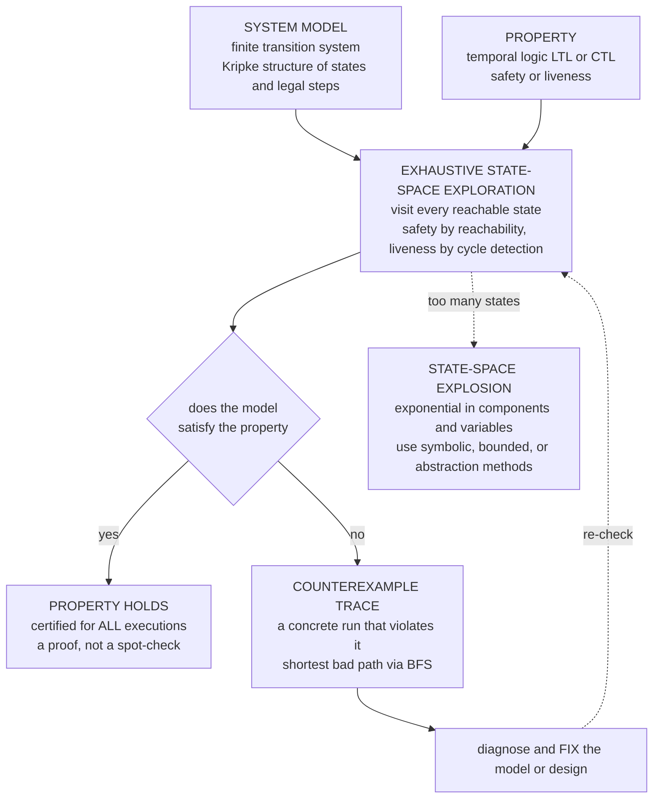

# 🔍 Model Checking Fundamentals

> [!abstract] TL;DR
> **Model checking** is the automatic, *exhaustive* verification technique that takes a finite **model** of a system (a **transition system** / Kripke structure) and a formal **property** (typically in **temporal logic** — LTL or CTL) and algorithmically explores **every reachable state** to decide whether the model satisfies the property. If it does not, the checker returns a **concrete counterexample**: an actual execution trace demonstrating the violation. That last feature — automatic bug-finding *with a witness*, no hand-written proof and no invariant to invent — is why engineers fell in love with it. **Safety** properties ("nothing bad happens" — mutual exclusion, no deadlock) reduce to **reachability**; **liveness** properties ("something good eventually happens" — progress, termination) reduce to finding bad **cycles** in the state graph. The central obstacle is the **state-space explosion** problem: the number of states grows *exponentially* in the number of concurrent components and variables, so naive enumeration hits a wall — and taming that wall (symbolic model checking, bounded model checking, partial-order reduction, abstraction/CEGAR) is what the rest of this section is about. Model checking earned Clarke, Emerson, and Sifakis the **2007 Turing Award** and is the most industrially successful heavyweight formal method.

---

## Intuition

**Analogy — clone yourself into every possible future and check whether *any* of them ends in disaster.** Imagine you could split yourself into a copy for every choice you might make, and each of those copies could split again at its next choice, and so on — a vast branching tree of every future that could unfold from right now. Then imagine you could inspect all of those futures *at once* and ask a single question: "does **any** branch of any future lead to catastrophe?" If none do, you have certified — with total confidence, not a spot-check — that the catastrophe is impossible. If one does, you don't just get a yes/no: you get the **exact sequence of choices** that walks you into it, step by step.

That is precisely what a model checker does for a system. You hand it a **model** — the states the system can be in and the legal steps between them — and a **property** — the bad thing that must never happen, or the good thing that must eventually happen. The checker then *exhaustively* explores every reachable state (every branch of every future) and returns one of two answers: **"this holds in all executions"**, or a concrete **counterexample trace** — an actual run of the system showing exactly how it goes wrong. No manual proof, no clever invariant to guess, no theorem to discharge: build the model, state the property, and let the machine explore every corner. It is a **push-button oracle** for concurrent and reactive systems — and the counterexample it hands back is a debugging gift you rarely get from any other method.

---

## How It Works

### Core Mechanics

**1. The model — a finite transition system (Kripke structure).** The system under scrutiny is abstracted to a finite [[State_Based_Modeling_and_Invariants|transition system]] `M = (S, S₀, R, L)`: a finite set of **states** `S` (each state a valuation of all the system's variables — program counters, flags, buffers), **initial** states `S₀ ⊆ S`, a **transition relation** `R ⊆ S × S` (which single steps are legal, nondeterminism allowed), and a **labeling** `L` marking which atomic propositions hold in each state. A **Kripke structure** is exactly this labeled graph: states are worlds, transitions are the accessibility relation, and temporal logic is interpreted over its infinite paths.

**2. The property — temporal logic.** What must be true is written in **temporal logic**, which adds operators for *time* on top of ordinary logic: **G** ("globally / always"), **F** ("eventually"), **X** ("next"), **U** ("until"). **LTL** (Linear Temporal Logic) talks about individual executions ("on *every* run, `G ¬(crit₁ ∧ crit₂)`" — the two processes are never simultaneously critical). **CTL** (Computation Tree Logic) quantifies over the *branching* tree of futures ("`AG EF reset`" — from every reachable state it is always *possible* to reach a reset). This is the property language the section develops next; here it is enough that a property is a precise, checkable formula over the model's paths.

**3. The algorithm — exhaustive state-space exploration.** The checker computes the set of **reachable states** by systematic graph search from `S₀` following `R` — literally [[BFS]] or [[DFS]] over the state graph — and evaluates the property against what it finds. Because the exploration is *exhaustive*, a "holds" answer is a genuine proof over *all* executions, not a sampled test. This is the decisive difference from testing/simulation, which only ever exercises a handful of paths.

**4. Safety = reachability; liveness = cycle detection.** Properties split into two kinds:
   - **Safety** ("nothing bad ever happens" — mutual exclusion, no deadlock, no overflow) is refuted by a **finite** trace to a bad state, so checking it reduces to **reachability**: is any state violating the invariant reachable? Compute `Reach(M)` and intersect with the bad set.
   - **Liveness** ("something good eventually happens" — progress, termination, every request served) cannot be refuted by any finite prefix; a violation is an *infinite* run that avoids the good thing forever. In a finite graph such a run is a **lasso** — a path leading into a **reachable cycle** on which the good thing never occurs. So liveness reduces to detecting a *bad reachable cycle*, done by nested [[DFS]] and requiring **fairness** assumptions to rule out unrealistic starvation. This is where **automata on infinite words** (Büchi automata) enter: the negated LTL property becomes a Büchi automaton, and model checking becomes an emptiness check on the product with the model.

**5. The counterexample — the killer feature.** When a property fails, the checker does not merely say "false." It extracts a **concrete counterexample**: for safety, the **shortest** path from an initial state to a bad state (BFS gives the minimal trace); for liveness, a lasso. This witness is an actual, replayable execution — the engineer can single-step it, watch the exact interleaving that triggers the bug, and fix the design. Automatic verification *plus* automatic debugging is the whole value proposition.

**6. The central challenge — state-space explosion.** The number of reachable states is roughly the *product* of the ranges of all variables and the interleavings of all components: a system of `n` concurrent processes each with `k` local states has up to `kⁿ` global states. The state count therefore grows **exponentially** in the number of components and variables. Naive explicit enumeration exhausts memory long before real systems are covered — this is *the* problem the entire field organizes around. LTL model checking is [[Space_Complexity_and_PSPACE|PSPACE]]-complete precisely because of this blow-up.

**7. Two families of engines.** Approaches to fighting explosion split into:
   - **Explicit-state** (e.g. **SPIN** with the **Promela** language): enumerate states one at a time, *on-the-fly*, with **partial-order reduction** (skip redundant interleavings) and hashing/bitstate compression. Strong for asynchronous software protocols.
   - **Symbolic**: never enumerate individual states; represent *sets* of states as formulas — **BDDs** in classic symbolic model checking (NuSMV, hardware), or **SAT/SMT** in **bounded model checking** (unroll `k` steps, ask a solver for a bug of length `≤ k`). Strong for synchronous hardware and deep bug-hunting. **Abstraction/CEGAR** collapses irrelevant detail and refines only when a counterexample turns out spurious.

**8. The modeling gap.** A model checker verifies the **model**, not the running code. If the abstraction is unfaithful — a missing transition, a wrong atomic-step boundary — the verdict is about a system that isn't quite yours. Faithful modeling (or extracting the model directly from code) is therefore part of the method, not an afterthought.

### Flow / Architecture



---

## Key Concepts

### Secondary (intuitive core)
- **Model.** A map of every situation the system can be in and every step it can take — a graph of states and moves.
- **Property.** The rule you want to guarantee: a *bad* thing that must never happen, or a *good* thing that must eventually happen.
- **Exhaustive exploration.** The checker visits *every* reachable situation, not a random sample — so a "safe" verdict is a real guarantee.
- **Counterexample.** When the rule is broken, the checker hands you the exact step-by-step story of how it broke — a debugging trace.
- **State-space explosion.** Add more parts to the system and the number of situations grows *explosively* — the core reason the problem is hard.

### Undergraduate (formal machinery)
- **Transition system / Kripke structure `(S, S₀, R, L)`.** The standard model: states, initial states, transition relation, and labels for atomic propositions.
- **LTL vs CTL.** Linear-time (properties of each individual path, `G`/`F`/`X`/`U`) versus branching-time (path quantifiers `A`/`E` over the computation tree, e.g. `AG`, `EF`).
- **Safety ↔ reachability.** A safety violation is a finite trace to a bad state; check by computing `Reach(M)` with [[BFS]]/[[DFS]] and intersecting with the bad set.
- **Liveness ↔ cycles + fairness.** A liveness violation is a reachable *lasso* (path into a cycle) that avoids the goal forever; detected by nested DFS, valid only under fairness assumptions.
- **Counterexample extraction.** BFS yields the *shortest* safety counterexample; the automaton-product construction yields lassos for liveness.
- **Explicit vs symbolic.** Enumerate states one by one (SPIN/Promela) versus represent state *sets* as BDD/SAT formulas (NuSMV, bounded model checking).

### Graduate (the hard subtleties)
- **Automata-theoretic LTL model checking.** Negate the LTL property, translate to a **Büchi automaton** `A_{¬φ}`, form the product with the model, and check **language emptiness** — a nonempty accepting run is a counterexample. This is the bridge to **automata on infinite words**.
- **Complexity.** CTL model checking is `O(|M|·|φ|)` (linear in the model); LTL model checking is `O(|M|·2^{|φ|})` and [[Space_Complexity_and_PSPACE|PSPACE]]-complete in the formula — the model, not the property, is the usual bottleneck.
- **Symbolic fixpoints.** CTL operators are least/greatest fixpoints of monotone predicate transformers; symbolic model checking computes them over BDD-represented state sets (the μ-calculus generalizes both LTL and CTL).
- **State-space explosion, formally.** `n` components of `k` states give `kⁿ` global states; mitigations — **partial-order reduction** (independent interleavings collapsed), **symmetry reduction**, **compositional / assume-guarantee**, **abstraction/CEGAR**, **bounded model checking** (SAT, completeness via a computed bound).
- **Safety/liveness decomposition (Alpern–Schneider).** Every linear-time property is the intersection of a safety property (closed prefixes) and a liveness property (dense continuations); the two demand different algorithms (invariance vs cycle detection).
- **Fairness.** Weak/strong fairness constraints prune unrealistic infinite runs so liveness verdicts reflect real schedulers rather than pathological starvation.

---

## Python Demo

We build a **concurrent mutual-exclusion protocol** as a transition system, **exhaustively** explore its reachable state graph by BFS, and **check the safety invariant** *"never two processes in the critical section."* The protocol is a classic *buggy first attempt*: each process **tests** whether any other is critical, and — as a **separate, non-atomic step** — then **enters**. The gap between test and enter is a race, so the model checker finds a genuine violation and returns the **shortest counterexample path** (the killer feature). Part (b) generalizes to `n` processes and plots the **state-space explosion**: reachable states vs component count, exponential, motivating symbolic methods.

```python
# Model checking fundamentals: explicit-state exploration + counterexample + state explosion.
# (a) buggy mutual exclusion -> BFS reachable graph -> check safety -> shortest counterexample
# (b) state-space explosion: reachable states vs number of concurrent processes (exponential)
import numpy as np
import matplotlib.pyplot as plt
from collections import deque
from itertools import product

# --- Per-process program counter: 0 = idle, 1 = tested (saw no one critical), 2 = crit ---
IDLE, TEST, CRIT = 0, 1, 2
NAME = {IDLE: "I", TEST: "T", CRIT: "C"}

def successors(s):
    """Transition relation R for the (buggy) protocol over an n-tuple of program counters.
       Bug: the guard 'no other in crit' is checked at TEST, but ENTER is a later step,
       so two processes can both pass the test and then both enter -> mutual-exclusion race."""
    n = len(s)
    outs = []
    for i in range(n):
        pc = s[i]
        if pc == IDLE:                                   # test: proceed only if nobody critical now
            if all(s[j] != CRIT for j in range(n) if j != i):
                t = list(s); t[i] = TEST;  outs.append(tuple(t))
        elif pc == TEST:                                 # enter (no re-check) -- THIS is the bug
            t = list(s); t[i] = CRIT;  outs.append(tuple(t))
        elif pc == CRIT:                                 # leave critical section
            t = list(s); t[i] = IDLE;  outs.append(tuple(t))
    return outs

def bfs(init):
    """Exhaustively explore the reachable state graph; keep BFS parents for shortest traces."""
    seen, parent, edges, order = {init}, {init: None}, [], [init]
    q = deque([init])
    while q:
        s = q.popleft()
        for t in successors(s):
            edges.append((s, t))
            if t not in seen:
                seen.add(t); parent[t] = s; order.append(t); q.append(t)
    return seen, parent, edges, order

def counterexample(parent, order, is_bad):
    """First bad state in BFS order = closest to init -> reconstruct the shortest bad trace."""
    for s in order:
        if is_bad(s):
            path = []
            while s is not None:
                path.append(s); s = parent[s]
            return path[::-1]
    return None

# ---------- (a) two-process instance: explore, check safety, extract counterexample ----------
N = 2
init = tuple([IDLE] * N)
bad  = lambda s: sum(pc == CRIT for pc in s) >= 2        # two or more in critical section
R, parent, edges, order = bfs(init)
cex = counterexample(parent, order, bad)

print(f"reachable states (n={N})      : {len(R)}")
print(f"safety 'never 2 in crit' holds: {not any(bad(s) for s in R)}")
print("COUNTEREXAMPLE (shortest bad trace):")
for k, s in enumerate(cex):
    print(f"   step {k}: {''.join(NAME[p] for p in s)}"
          + ("   <-- BOTH CRITICAL (violation)" if bad(s) else ""))

# ---------- (b) state-space explosion: reachable states vs number of processes ----------
ns   = list(range(1, 8))
reach_counts, full_space = [], []
for n in ns:
    Rn, *_ = bfs(tuple([IDLE] * n))
    reach_counts.append(len(Rn))
    full_space.append(3 ** n)                            # naive product space |S| = 3^n

# ============================== Visualization ==============================
fig, (axG, axE) = plt.subplots(1, 2, figsize=(14, 6))

# ---- Plot 1: reachable-state graph (n=2) with the counterexample path highlighted ----
lbl   = lambda s: "".join(NAME[p] for p in s)
Rlist = sorted(R)
ang   = np.linspace(0, 2 * np.pi, len(Rlist), endpoint=False)
pos   = {s: (np.cos(a), np.sin(a)) for s, a in zip(Rlist, ang)}
cex_edges = set(zip(cex[:-1], cex[1:]))

for s, t in edges:
    (x1, y1), (x2, y2) = pos[s], pos[t]
    on_cex = (s, t) in cex_edges
    axG.annotate("", xy=(x2, y2), xytext=(x1, y1),
                 arrowprops=dict(arrowstyle="-|>",
                                 color="crimson" if on_cex else "0.75",
                                 lw=2.6 if on_cex else 1.0,
                                 alpha=0.95 if on_cex else 0.5,
                                 shrinkA=16, shrinkB=16, zorder=3 if on_cex else 1))
for s, (x, y) in pos.items():
    if bad(s):            col = "crimson"
    elif s == init:       col = "seagreen"
    elif s in cex:        col = "orange"
    else:                 col = "steelblue"
    axG.scatter([x], [y], s=1400, color=col, edgecolors="black", zorder=4)
    axG.text(x, y, lbl(s), ha="center", va="center",
             color="white", fontsize=11, fontweight="bold", zorder=5)
axG.set_title("Reachable-state graph (n=2)  |  red path = shortest COUNTEREXAMPLE\n"
              "labels = (p1)(p2), I=idle  T=tested  C=crit   "
              "(green=init, red=bad: both critical)", fontsize=10)
axG.set_xlim(-1.4, 1.4); axG.set_ylim(-1.4, 1.4); axG.axis("off")

# ---- Plot 2: state-space explosion (log scale) ----
axE.semilogy(ns, full_space,   "o--", color="crimson",  lw=2, label=r"naive product space $3^{\,n}$")
axE.semilogy(ns, reach_counts, "s-",  color="steelblue", lw=2, label="reachable states (explored)")
for x, y in zip(ns, reach_counts):
    axE.annotate(str(y), (x, y), textcoords="offset points", xytext=(0, 8),
                 ha="center", fontsize=8, color="steelblue")
axE.set_xlabel("number of concurrent processes  n")
axE.set_ylabel("number of states (log scale)")
axE.set_title("STATE-SPACE EXPLOSION\nstates grow EXPONENTIALLY in components "
              "-> motivates symbolic / bounded / abstraction methods", fontsize=10)
axE.grid(True, which="both", ls=":", alpha=0.5)
axE.legend(loc="upper left", fontsize=9)

plt.tight_layout()
plt.savefig("model_checking_fundamentals.png", dpi=130, bbox_inches="tight")
print("\nsaved figure -> model_checking_fundamentals.png")
```

**What the run shows.** For two processes the checker explores the whole reachable graph and reports that the safety property **fails**, handing back the shortest violating run — `II -> TI -> TT -> CT -> CC` — which reads as: process 1 tests (nobody critical, ok), process 2 tests (process 1 is only *tested*, not critical, so also ok), process 1 enters `crit`, process 2 enters `crit` on its stale test — **both critical**. That concrete counterexample *is* the bug report; you can see the exact interleaving where the non-atomic test-then-enter races. The left plot draws the reachable graph with this shortest bad path in red. The right plot then generalizes to `n` processes: the reachable-state count climbs exponentially (tracking `3ⁿ`), so even this toy protocol shows why explicit enumeration cannot scale — the empirical motivation for the symbolic, bounded, and abstraction techniques that follow in this section.

---

## Real-World Applications

- **Hardware verification.** After the 1994 **Pentium FDIV** bug cost Intel a ~$475M recall, chipmakers made model checking standard: **Intel** and **IBM** verify floating-point units, cache-coherence protocols, and bus arbiters with symbolic (BDD) and SAT-based checkers, proving safety invariants like "two masters never drive the bus simultaneously" over astronomically large state spaces.
- **Concurrent & protocol software with SPIN.** Holzmann's **SPIN** (explicit-state, Promela, on-the-fly, partial-order reduction) verified the control software of the **Mars Pathfinder** and Deep Space flight missions, telephone call-processing (Lucent/Bell Labs), and network protocols — finding priority-inversion and interleaving bugs that testing missed.
- **Symbolic model checking with NuSMV / SMV.** CTL/LTL checking over BDD-encoded transition relations verifies embedded controllers, avionics logic, and railway interlocking systems where every reachable state must be certified safe.
- **Distributed protocols with TLA+.** [[Formal_Verification_TLA_Plus|TLA+]] and its **TLC** model checker let **Amazon (AWS)** find design-level bugs in S3, DynamoDB, and internal consensus protocols *before* implementation — catching subtle races in replication and consensus that would be near-impossible to reproduce in production.
- **Software model checking & driver verification.** Microsoft's **SLAM/SDV** (Static Driver Verifier) model-checks Windows device drivers against API-usage rules via predicate abstraction and **CEGAR**; **CBMC** (bounded model checking, [[SAT_Solving_and_DPLL|SAT]]-based) checks C/C++ for assertion and memory-safety violations by unrolling loops into SAT.
- **The recognition.** Edmund **Clarke**, Allen **Emerson**, and Joseph **Sifakis** received the **2007 ACM Turing Award** "for their roles in developing model checking into a highly effective verification technology, widely adopted in the hardware and software industries."

---

## Common Pitfalls

- **Confusing exhaustive model checking with testing.** Model checking is **automatic *and* exhaustive** — it visits *every* reachable state, so a "holds" verdict is a proof over all executions, unlike testing/simulation which samples a few paths. Do not treat a passed model-check as "we ran a lot of cases."
- **Underusing the counterexample.** The concrete counterexample trace is the *point* — automatic bug-finding *with a witness*. A failed check that you only read as "false" throws away the debugging gift; replay and single-step the trace instead.
- **A finite (or finitely abstracted) model is required.** Explicit-state exploration needs a finite state space. Unbounded integers, dynamic memory, or unbounded message queues must be **bounded or abstracted** first — otherwise exploration never terminates. This is the modeling responsibility, not the tool's.
- **Ignoring state-space explosion until it bites.** States grow *exponentially* in components and variables; the naive explicit approach dies on real systems. This is the *central* challenge — reach for **symbolic** (BDD), **bounded** (SAT), **partial-order reduction**, **symmetry**, or **abstraction/CEGAR** *by design*, not as a rescue.
- **Picking the wrong engine.** **Explicit-state** (SPIN/Promela) suits asynchronous software protocols with lots of interleaving; **symbolic** (NuSMV/BDD, or SAT-based bounded checking) suits synchronous hardware and deep counterexamples. Using an explicit checker on a wide synchronous circuit — or a BDD tool on a highly asynchronous protocol — wastes the method's strengths.
- **Treating safety and liveness the same.** **Safety** ("never bad") is *reachability* and is refuted by a finite trace. **Liveness** ("eventually good") needs **cycle detection** on the state graph *and* **fairness** assumptions; a bare invariant check silently proves nothing about liveness.
- **Forgetting the modeling gap.** The checker verifies the **model**, not the code. An unfaithful abstraction — a missing transition, a wrong atomic-step boundary — yields a verdict about a system that isn't yours. Model fidelity gates every conclusion; prefer extracting the model from the artifact when possible.
- **Assuming BDDs or SAT always win.** BDD sizes can blow up with variable ordering; SAT-based bounded model checking finds bugs up to depth `k` but needs a *completeness bound* to prove their absence. Each scaling technique trades one hard case for another.

---

## Related Concepts

- [[State_Based_Modeling_and_Invariants]] — the transition-system / Kripke-structure foundation and the safety-as-reachability framing that model checking automates; this note turns "prove the invariant" into "explore the state space."
- [[Modal_and_Temporal_Logic]] — the property language: LTL/CTL are temporal modal logics interpreted over the model's paths; the next notes in this section develop them in depth.
- [[Finite_Automata_DFA_and_NFA]] — a Kripke structure is a labeled finite automaton, and automata-theoretic LTL checking turns the negated property into a (Büchi) automaton whose product emptiness *is* the check.
- [[BFS]] — computes the reachable set and yields the *shortest* safety counterexample trace, the minimal bug report.
- [[DFS]] — depth-first (and nested DFS) underlies explicit-state exploration and the cycle detection that decides liveness.
- [[Formal_Verification_TLA_Plus]] — model checking applied to distributed protocols; TLC exhaustively checks TLA+ specifications, as AWS does for S3/DynamoDB.
- [[SAT_Solving_and_DPLL]] — the engine behind **bounded model checking**: unroll `k` steps and ask a SAT solver for a bug of length `≤ k`, a leading answer to state-space explosion.
- [[Space_Complexity_and_PSPACE]] — LTL model checking is PSPACE-complete; the complexity is a direct formalization of the state-explosion wall.
- [[Deadlocks_Detection_and_Avoidance]] — deadlock-freedom is a canonical *safety* property that model checkers verify by searching for reachable stuck states.

*Siblings in this section (04 — Model Checking & Temporal Logic), referenced here in prose and developed next: **Linear_and_Branching_Temporal_Logic** (the LTL/CTL property language), **Automata_on_Infinite_Words** (Büchi automata — the theory behind liveness checking), **Symbolic_Model_Checking_and_BDDs** (representing state sets as formulas to fight explosion), and **Abstraction_Refinement_and_CEGAR** (collapse irrelevant detail, refine on spurious counterexamples).*

---

## Review Questions

1. **(Secondary)** Using the "clone yourself into every possible future" analogy, explain what a model checker actually does and why its answer is stronger than running a lot of tests. What extra thing does it give you when a property *fails*, and why is that so useful to an engineer?
2. **(Undergraduate)** Distinguish a **safety** property from a **liveness** property with one concrete example of each. For each, describe the algorithmic problem the checker solves (reachability vs cycle detection) and explain why a *finite prefix* can refute one but never the other.
3. **(Undergraduate)** Given the buggy mutual-exclusion model in the demo, hand-trace the interleaving that reaches "both critical." Identify exactly which step is non-atomic and why BFS (rather than DFS) is the right search to report the *shortest* counterexample.
4. **(Graduate)** Explain the **state-space explosion** problem quantitatively for `n` concurrent components of `k` local states each, and describe how *two different* mitigation strategies (say symbolic/BDD encoding versus partial-order reduction) attack it — one by changing the *representation* of states, the other by changing the *set of paths* explored.
5. **(Graduate)** Outline the automata-theoretic approach to **LTL** model checking: how a negated formula becomes a Büchi automaton, why the product with the model reduces checking to language emptiness, and how this yields a *lasso* counterexample. Why is LTL model checking PSPACE-complete in the formula while linear in the model?

---

## Sources

- Clarke, E. M., Grumberg, O. & Peled, D. *Model Checking.* MIT Press, 1999 — the foundational textbook on reachability, CTL/LTL algorithms, symbolic (BDD) methods, and state-space reduction.
- Baier, C. & Katoen, J.-P. *Principles of Model Checking.* MIT Press, 2008 — the definitive modern treatment of transition systems, temporal logic, automata on infinite words, and explosion-fighting techniques.
- Holzmann, G. J. *The SPIN Model Checker: Primer and Reference Manual.* Addison-Wesley, 2003 — explicit-state, on-the-fly model checking with Promela and partial-order reduction.
- Clarke, E. M. & Emerson, E. A. "Design and Synthesis of Synchronization Skeletons Using Branching-Time Temporal Logic." *Workshop on Logics of Programs*, 1981 — the original CTL model-checking paper.
- Queille, J.-P. & Sifakis, J. "Specification and Verification of Concurrent Systems in CESAR." *Int. Symposium on Programming*, 1982 — the independently invented, co-founding model-checking approach.

---

#formal-methods #model-checking #state-space #counterexamples #verification
